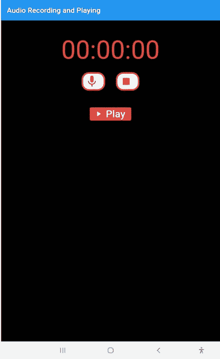

# 创建一个颤动的音频播放器和录音机应用程序

> 原文：<https://blog.logrocket.com/creating-flutter-audio-player-recorder-app/>

录制音频已经成为许多现代应用程序广泛使用的功能。从帮助用户在会议或讲座中记录和记笔记、学习新语言、创建播客等等的应用程序，录音已经成为技术生活中根深蒂固的一个方面。

音频播放功能同样重要。它出现在音乐应用、播客、游戏和通知中，用于动态改变我们交互和使用应用的方式。

在本教程中，我们将了解如何向 Flutter 应用程序添加音频录制和播放功能，以便您可以创建自己的基于音频的现代应用程序。

在继续学习本教程之前，请确保您具备以下条件:

*   颤振安装
*   安装了 Android Studio 或 Xcode

## 创建和设置新的 Flutter 应用程序

首先，让我们用下面的命令创建一个新的 Flutter 应用程序:

```
flutter create appname

```

在本教程中，我们将使用两个包: [flutter_sound](https://pub.dev/packages/flutter_sound) 用于音频录制，以及 [assetsaudio_player](https://pub.dev/packages/assets_audio_player) 用于音频播放。

在您喜欢的代码编辑器中打开新创建的 Flutter 应用程序，并导航到`main.dart`。您可以通过将`debugShowCheckedModeBanner`设置为`false`来移除调试模式标识:

```
    return MaterialApp(
      debugShowCheckedModeBanner: false,
      title: 'Flutter Demo',
      theme: ThemeData(
        primarySwatch: Colors.blue,
      ),
      home: MyHomePage(title: 'Flutter Demo Home Page'),
    );
  }

```

我们所有的代码都在`MyHomePageState`类中。

在它的`build`方法中，让我们将页面的背景颜色设置为`Colours.black87`。这给了我们的页面一个 87%不透明度的黑色背景。我们还可以为我们的`AppBar`添加一个标题:

```
backgroundColor: Colors.black87,
appBar: AppBar(title: Text('Audio Recording and Playing')),

```

## 向 Flutter audio 应用程序添加 UI 小部件

录音机通常有计时器，读取的时间和录音一样长。

为了给我们的应用程序添加一个定时器特性，让我们给应用程序的主体添加一个`Container`小部件。这将有一个`Text`小部件作为子部件，显示录制计时器。我们还将在`TextStyle`中给计时器文本一些样式:

```
      body: Center(
        child: Column(
          mainAxisAlignment: MainAxisAlignment.start,
          children: <Widget>[
            Container(
              child: Center(
                child: Text(
                  _timerText,
                  style: TextStyle(fontSize: 70, color: Colors.red),
                ),
              ),
            ),

```

随着我们的进展，我们将创建一个函数将计时器传递给`_timerText`变量。

### 开始和停止录制

接下来，让我们创建两个按钮来开始记录和停止记录。首先，创建一个大小合适的框，在计时器文本和两个按钮之间添加一些垂直空间。按钮将在同一行，所以我们将使用一个`Row`小部件。

我们将在这个页面上使用的所有按钮都将利用 [Flutter 的`ElevatedButton`小部件](https://blog.logrocket.com/new-material-buttons-in-flutter/#elevatedbutton)。但是，每个按钮都有自己独特的图标、文本和颜色。

因为我们将要创建的两个按钮彼此相似，所以让我们创建一个小部件，它具有两个按钮共有的所有属性，并添加参数来传递它们独特的属性。

让我们把这个小部件命名为`createElevatedButton`；为了将它用于我们的开始和停止按钮，我们将调用这个小部件并传入这个特定按钮所需的特性:

```
  ElevatedButton createElevatedButton(
      {IconData icon, Color iconColor, Function onPressFunc}) {
    return ElevatedButton.icon(
      style: ElevatedButton.styleFrom(
        padding: EdgeInsets.all(6.0),
        side: BorderSide(
          color: Colors.red,
          width: 4.0,
        ),
        shape: RoundedRectangleBorder(
          borderRadius: BorderRadius.circular(20),
        ),
        primary: Colors.white,
        elevation: 9.0,
      ),
      onPressed: onPressFunc,
      icon: Icon(
        icon,
        color: iconColor,
        size: 38.0,
      ),
      label: Text(''),
    );
  }

```

这个小部件每次都需要的三个属性是图标、图标的颜色和按下按钮时执行的功能。

请注意，小部件的所有边都有 6px 的填充，红色边框的宽度为 4px。我们还增加了 15px 的边框半径。对于方框阴影来说，原色是高度为`9`的白色。

作为`onPressFunc`传递给小部件的函数就是它的`onPressed`函数。无论传递给它的是什么图标，它的大小都是 38px，并且带有通过`iconColor`参数传递的颜色。

既然已经设置了`createElevatedButton`小部件，我们可以将它用于我们的`startRecording`和`stopRecording`按钮。

在我们上面创建的行中，我们可以通过使用`createElevatedButton`小部件将我们的`startRecording`按钮添加到它，向它传递一个`mic`图标，给图标一个红色，并给小部件一个名为`startRecording`的`onPressed`函数。我们稍后将创建这个函数。

接下来，让我们通过使用`CreateElevatedButton`小部件添加我们的`stopRecording`按钮，将`stop`图标传递给它，并给它一个白色和一个名为`stopRecording`的`onPressed`函数，我们将在后面创建它:

```
Row(
              mainAxisAlignment: MainAxisAlignment.center,
              children: <Widget>[
                createElevatedButton(
                  icon: Icons.mic,
                  iconColor: Colors.red,
                  onPressFunc: startRecording,
                ),
                SizedBox(
                  width: 30,
                ),
                createElevatedButton(
                  icon: Icons.stop,
                  iconColor: Colors.red,
                  onPressFunc: stopRecording,
                ),
              ],
            ),

```

### 播放录制的音频

现在我们有了开始和停止录音的按钮，我们需要一个按钮来播放录音。首先，让我们在刚刚创建的行和将要使用高度设置为 20px 的`SizedBox`小部件创建的按钮之间留出一些垂直空间。

这个按钮有两个功能:播放录制的音频和停止音频。因此，为了在这两个函数之间来回切换，我们需要一个布尔函数。我们将布尔值命名为`play_audio`，默认情况下将其设置为`false`:

```
bool _playAudio = false;

```

这很简单。当值为`false`时，不播放音频，当值为`true`时，播放音频。

接下来，让我们创建一个高度为`9`背景颜色为红色的`ElevatedButton`，并为按钮添加一个`onPressed`功能。

通过[的`setState`函数](https://blog.logrocket.com/flutter-state-management-methods/)，我们可以在两个布尔值之间来回切换，所以每次按下按钮，值都会改变并执行`setState`:

```
            SizedBox(
              height: 20,
            ),
            ElevatedButton.icon(
              style:
                  ElevatedButton.styleFrom(elevation: 9.0, 
                  primary: Colors.red),
              onPressed: () {
                setState(() {
                  _playAudio = !_playAudio;
                });
                if (_playAudio) playFunc();
                if (!_playAudio) stopPlayFunc();
              },
              icon: _playAudio
                  ? Icon(
                      Icons.stop,
                    )
                  : Icon(Icons.play_arrow),
              label: _playAudio
                  ? Text(
                      "Stop",
                      style: TextStyle(
                        fontSize: 28,
                      ),
                    )
                  : Text(
                      "Play",
                      style: TextStyle(
                        fontSize: 28,
                      ),
                    ),
            ),

```

如果当前值为`false`，这意味着当前没有播放音频，则执行`playFunc`功能。如果值为`true`，表示当前正在播放音频，按钮被按下，`stopPlayFunc`功能执行；我们将在下面创建这两个函数。

当音频播放时，我们希望在按钮上显示一个带有文本`"stop"`的停止图标。当音频停止播放时，我们将在按钮上显示一个播放图标和文本`"play"`。

## 为 Flutter audio 应用程序安装软件包

接下来，我们必须安装软件包，使我们能够在我们的应用程序中录制和播放音频。首先导航到`pubspec.yaml`文件，并将它们添加到`dependencies`下:

```
dependencies:
  flutter_sound: ^8.1.9
  assets_audio_player: ^3.0.3+3

```

现在，我们可以转到我们的`main.dart`文件，导入要在我们的应用程序中使用的包:

```
import 'package:flutter_sound/flutter_sound.dart';
import 'package:assets_audio_player/assets_audio_player.dart';

```

要使用它们，我们必须首先创建它们的实例:

```
  FlutterSoundRecorder _recordingSession;
  final recordingPlayer = AssetsAudioPlayer();

```

要播放一段音频，我们需要录音的路径，即手机上存储录音的位置。让我们为此创建一个变量:

```
  String pathToAudio;

```

## 为 Flutter 音频应用程序创建功能

### 正在初始化应用程序

为了在加载时初始化我们的应用程序，我们可以创建一个名为`initializer`的函数:

```
  void initializer() async {
    pathToAudio = '/sdcard/Download/temp.wav';
    _recordingSession = FlutterSoundRecorder();
    await _recordingSession.openAudioSession(
        focus: AudioFocus.requestFocusAndStopOthers,
        category: SessionCategory.playAndRecord,
        mode: SessionMode.modeDefault,
        device: AudioDevice.speaker);
    await _recordingSession.setSubscriptionDuration(Duration(
    milliseconds: 10));
    await initializeDateFormatting();
    await Permission.microphone.request();
    await Permission.storage.request();
    await Permission.manageExternalStorage.request();
  }

```

在这个函数中，我们给变量`pathToAudio`一个保存和播放录音的路径。

接下来，我们可以创建一个`FlutterSoundRecorder`的实例，并用`openAudioSession`打开一个音频会话，这样我们的手机就可以开始录音了。

添加到会话中的参数`focus`、`category`、`mode`和`device`实现音频聚焦。Audio focus 会停止我们手机上所有其他能够录制或播放声音的应用程序，这样我们的应用程序才能正常运行。

然后帮助我们跟踪和更新我们记录的时间。换句话说，它跟踪订阅记录器的时间量。

接下来，`initializeDateFormatting`功能帮助我们格式化计时器文本，最后，`Permission.microphone.request`、`Permission.storage.request`和`Permission.manageExternalStorage`功能允许请求使用手机的麦克风和外部存储。

最后，将`initializer`方法添加到`initState`方法中:

```
  void initState() {
    super.initState();
    initializer();
  }

```

### 在 Android 手机中授予权限

[对于 Android 手机](https://blog.logrocket.com/kotlin-vs-flutter-android-development/)，需要进行额外的设置来授予我们的应用程序这些权限。导航到以下内容，添加录制音频、从外部存储器读取文件、
以及将文件保存到外部存储器的权限:

```
android/app/src/main/AndroidManifest.XML

```

要访问 Android 10 或 API level 29 的手机的存储，我们必须将`requestLegacyExternalStorage`的值设置为`true`:

```
    <uses-permission android:name="android.permission.RECORD_AUDIO" />

    <uses-permission android:name=
    "android.permission.READ_EXTERNAL_STORAGE" />

    <uses-permission android:name=
    "android.permission.WRITE_EXTERNAL_STORAGE" />

   <application android:requestLegacyExternalStorage="true"

```

接下来，转到您的终端并运行以下命令:

```
flutter pub add permission_handler

```

### 添加`startRecording()`功能

我们可以继续创建添加到按钮中的功能；第一个功能是`startRecording()`:

```
  Future<void> startRecording() async {
    Directory directory = Directory(path.dirname(pathToAudio));
    if (!directory.existsSync()) {
      directory.createSync();
    }
    _recordingSession.openAudioSession();
    await _recordingSession.startRecorder(
      toFile: pathToAudio,
      codec: Codec.pcm16WAV,
    );
    StreamSubscription _recorderSubscription =
        _recordingSession.onProgress.listen((e) {
      var date = DateTime.fromMillisecondsSinceEpoch(
      e.duration.inMilliseconds,
          isUtc: true);
      var timeText = DateFormat('mm:ss:SS', 'en_GB').format(date);
      setState(() {
        _timerText = timeText.substring(0, 8);
      });
    });
    _recorderSubscription.cancel();
  }

```

使用`Directory directory = Directory(path.dirname(pathToAudio))`，我们指定要保存录像的目录。然后，使用一个`if`语句，我们可以检查该目录是否存在。如果没有，我们可以创建它。

然后，我们用`openAudioSession`功能打开一个音频会话并开始录制。在`startRecorder`函数中，我们用保存的格式指定保存音频的路径。

### 使用流来监控数据

如果我们想在记录数据时监控发生了什么，[我们可以使用流](https://blog.logrocket.com/understanding-flutter-streams/)。在这种情况下，我们使用`StreamSubscription`从我们的记录流中订阅事件。

`_recordingSession.onProgress.listen`然后在录音过程中收听。当这种情况发生时，我们还想把每一毫秒的时间保存在一个名为`timeText`的变量中。

然后，我们可以使用`setState`方法来更新应用程序中的计时器。当我们不再需要监控流时，我们取消订阅。

### 添加`stopRecording`功能

接下来，我们将创建`stopRecording`函数:

```
  Future<String> stopRecording() async {
    _recordingSession.closeAudioSession();
    return await _recordingSession.stopRecorder();
  }

```

在这个函数中，我们使用`closeAudioSession`方法来释放我们正在使用的所有手机资源，并关闭录音会话。然后，我们使用`stopRecorder`功能
停止记录。

### 添加`play`功能

接下来，我们将创建`play`函数:

```
  Future<void> playFunc() async {
    recordingPlayer.open(
      Audio.file(pathToAudio),
      autoStart: true,
      showNotification: true,
    );
  }

```

我们使用`open`函数来启动音频播放器，为它提供音频的路径，指定音频应该自动播放，并指定在播放音频时在手机屏幕的顶部出现一个通知。

### 添加`stopPlay`功能

最后，我们将创建`stopPlay`函数，在其中添加`stop`方法来停止播放器:

```
  Future<void> stopPlayFunc() async {
    recordingPlayer.stop();
  }

```

## 结论

至此，我们已经完成了一个简单的音频记录器和播放器应用程序:



下面是我们刚刚构建的所有内容的最终代码。编码快乐！

### `main.dart`

以下是`main.dart`文件的完整代码:

```
import 'dart:async';
import 'dart:io';
import 'package:flutter/cupertino.dart';
import 'package:flutter/material.dart';
import 'package:flutter_sound/flutter_sound.dart';
import 'package:intl/date_symbol_data_local.dart';
import 'package:permission_handler/permission_handler.dart';
import 'package:path/path.dart' as path;
import 'package:assets_audio_player/assets_audio_player.dart';
import 'package:intl/intl.dart' show DateFormat;
void main() {
  runApp(MyApp());
}
class MyApp extends StatelessWidget {
  @override
  Widget build(BuildContext context) {
    return MaterialApp(
      debugShowCheckedModeBanner: false,
      title: 'Flutter Demo',
      theme: ThemeData(
        primarySwatch: Colors.blue,
      ),
      home: MyHomePage(title: 'Flutter Demo Home Page'),
    );
  }
}
class MyHomePage extends StatefulWidget {
  MyHomePage({Key key, this.title}) : super(key: key);
  final String title;
  @override
  _MyHomePageState createState() => _MyHomePageState();
}
class _MyHomePageState extends State<MyHomePage> {
  FlutterSoundRecorder _recordingSession;
  final recordingPlayer = AssetsAudioPlayer();
  String pathToAudio;
  bool _playAudio = false;
  String _timerText = '00:00:00';
  @override
  void initState() {
    super.initState();
    initializer();
  }
  void initializer() async {
    pathToAudio = '/sdcard/Download/temp.wav';
    _recordingSession = FlutterSoundRecorder();
    await _recordingSession.openAudioSession(
        focus: AudioFocus.requestFocusAndStopOthers,
        category: SessionCategory.playAndRecord,
        mode: SessionMode.modeDefault,
        device: AudioDevice.speaker);
    await _recordingSession.setSubscriptionDuration(Duration(milliseconds: 10));
    await initializeDateFormatting();
    await Permission.microphone.request();
    await Permission.storage.request();
    await Permission.manageExternalStorage.request();
  }
  @override
  Widget build(BuildContext context) {
    return Scaffold(
      backgroundColor: Colors.black87,
      appBar: AppBar(title: Text('Audio Recording and Playing')),
      body: Center(
        child: Column(
          mainAxisAlignment: MainAxisAlignment.start,
          children: <Widget>[
            SizedBox(
              height: 40,
            ),
            Container(
              child: Center(
                child: Text(
                  _timerText,
                  style: TextStyle(fontSize: 70, color: Colors.red),
                ),
              ),
            ),
            SizedBox(
              height: 20,
            ),
            Row(
              mainAxisAlignment: MainAxisAlignment.center,
              children: <Widget>[
                createElevatedButton(
                  icon: Icons.mic,
                  iconColor: Colors.red,
                  onPressFunc: startRecording,
                ),
                SizedBox(
                  width: 30,
                ),
                createElevatedButton(
                  icon: Icons.stop,
                  iconColor: Colors.red,
                  onPressFunc: stopRecording,
                ),
              ],
            ),
            SizedBox(
              height: 20,
            ),
            ElevatedButton.icon(
              style:
                  ElevatedButton.styleFrom(elevation: 9.0, primary: Colors.red),
              onPressed: () {
                setState(() {
                  _playAudio = !_playAudio;
                });
                if (_playAudio) playFunc();
                if (!_playAudio) stopPlayFunc();
              },
              icon: _playAudio
                  ? Icon(
                      Icons.stop,
                    )
                  : Icon(Icons.play_arrow),
              label: _playAudio
                  ? Text(
                      "Stop",
                      style: TextStyle(
                        fontSize: 28,
                      ),
                    )
                  : Text(
                      "Play",
                      style: TextStyle(
                        fontSize: 28,
                      ),
                    ),
            ),
          ],
        ),
      ),
    );
  }
  ElevatedButton createElevatedButton(
      {IconData icon, Color iconColor, Function onPressFunc}) {
    return ElevatedButton.icon(
      style: ElevatedButton.styleFrom(
        padding: EdgeInsets.all(6.0),
        side: BorderSide(
          color: Colors.red,
          width: 4.0,
        ),
        shape: RoundedRectangleBorder(
          borderRadius: BorderRadius.circular(20),
        ),
        primary: Colors.white,
        elevation: 9.0,
      ),
      onPressed: onPressFunc,
      icon: Icon(
        icon,
        color: iconColor,
        size: 38.0,
      ),
      label: Text(''),
    );
  }
  Future<void> startRecording() async {
    Directory directory = Directory(path.dirname(pathToAudio));
    if (!directory.existsSync()) {
      directory.createSync();
    }
    _recordingSession.openAudioSession();
    await _recordingSession.startRecorder(
      toFile: pathToAudio,
      codec: Codec.pcm16WAV,
    );
    StreamSubscription _recorderSubscription =
        _recordingSession.onProgress.listen((e) {
      var date = DateTime.fromMillisecondsSinceEpoch(e.duration.inMilliseconds,
          isUtc: true);
      var timeText = DateFormat('mm:ss:SS', 'en_GB').format(date);
      setState(() {
        _timerText = timeText.substring(0, 8);
      });
    });
    _recorderSubscription.cancel();
  }
  Future<String> stopRecording() async {
    _recordingSession.closeAudioSession();
    return await _recordingSession.stopRecorder();
  }
  Future<void> playFunc() async {
    recordingPlayer.open(
      Audio.file(pathToAudio),
      autoStart: true,
      showNotification: true,
    );
  }
  Future<void> stopPlayFunc() async {
    recordingPlayer.stop();
  }
}

```

### `AndroidManifest.xml`

下面是`AndroidManifest.xml`在 Android 手机中配置权限的最终代码:

```
<manifest xmlns:android="http://schemas.android.com/apk/res/android"
    package="my.app.audio_recorder">
    <uses-permission android:name="android.permission.RECORD_AUDIO" />
    <uses-permission android:name="android.permission.READ_EXTERNAL_STORAGE" />
    <uses-permission android:name="android.permission.WRITE_EXTERNAL_STORAGE" />
   <application android:requestLegacyExternalStorage="true"
        android:label="audio_recorder"
        android:icon="@mipmap/ic_launcher">
        <activity
            android:name=".MainActivity"
            android:launchMode="singleTop"
            android:theme="@style/LaunchTheme"
            android:configChanges="orientation|keyboardHidden|
            keyboard|screenSize|smallestScreenSize|locale
            |layoutDirection|fontScale|screenLayout|density|uiMode"
            android:hardwareAccelerated="true"
            android:windowSoftInputMode="adjustResize">

```

### `pubspec.yaml`

下面是包含项目依赖项的`pubspec.yaml`文件的最终代码:

## 使用 [LogRocket](https://lp.logrocket.com/blg/signup) 消除传统错误报告的干扰

[](https://lp.logrocket.com/blg/signup)

[LogRocket](https://lp.logrocket.com/blg/signup) 是一个数字体验分析解决方案，它可以保护您免受数百个假阳性错误警报的影响，只针对几个真正重要的项目。LogRocket 会告诉您应用程序中实际影响用户的最具影响力的 bug 和 UX 问题。

然后，使用具有深层技术遥测的会话重放来确切地查看用户看到了什么以及是什么导致了问题，就像你在他们身后看一样。

LogRocket 自动聚合客户端错误、JS 异常、前端性能指标和用户交互。然后 LogRocket 使用机器学习来告诉你哪些问题正在影响大多数用户，并提供你需要修复它的上下文。

关注重要的 bug—[今天就试试 LogRocket】。](https://lp.logrocket.com/blg/signup-issue-free)

```
dependencies:
  flutter:
    sdk: flutter
  cupertino_icons: ^1.0.2
  flutter_sound: ^8.1.9
  permission_handler: ^8.1.2
  path: ^1.8.0
  assets_audio_player: ^3.0.3+3
  intl: ^0.17.0

```