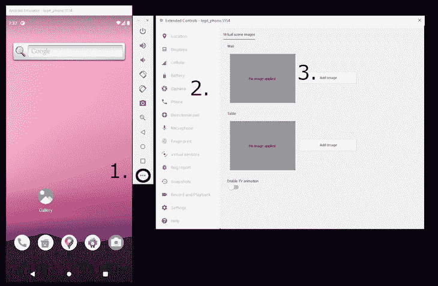

# 创建一个颤动的条形码扫描器

> 原文：<https://blog.logrocket.com/creating-flutter-barcode-scanner/>

如果你想让人们使用你的应用程序快速直观地识别数据，你不能使用条形码和二维码。它们已经存在很长时间了，可以光学地识别数据，不会出现错误或误解。

如今，条形码仍有许多用途。我们最近看到的一个更常见的用途是在餐馆，顾客可以扫描二维码来订购菜单上的特定项目。

在本文中，这正是我们要做的，以展示条形码和 QR 码如何在移动应用程序中工作:我们将创建一个名为 Scantastic **，**的简单应用程序，如下所示:


该应用程序将允许用户扫描二维码，然后识别为食品。为此，我们必须完成以下步骤:

1.  使用我们的菜单选项生成二维码
2.  [添加对](https://pub.dev/packages/qr_code_scanner) [`qr_code_scanner`](https://pub.dev/packages/qr_code_scanner) 的依赖，让我们可以从我们的应用程序扫描二维码和条形码
3.  向我们的应用程序添加菜单选项，并使其在检测到这些项目时做出反应
4.  配置 Android 模拟器，在模拟环境中显示二维码进行测试

准备好了吗？让我们开始吧。

## 创建我们的颤振项目

我们需要做的第一件事是创建我们的 Flutter 项目，这可以通过在命令行键入`flutter create scantastic`来完成。

一旦命令完成，我们就可以将`qr_code_scanner`添加到我们的项目中，这可以通过将以下代码写入命令行来完成:

```
flutter pub add qr_code_scanner 
```

这就增加了对二维码扫描包的依赖性。因为我们将使用用户手机上的摄像头来执行我们的任务，所以我们必须做一些设置来使其工作。

### Android 平台配置

通常情况下，Flutter 广泛兼容任何版本的 Android，甚至是非常旧的版本。然而，因为`qr_code_scanner`包使用了只有 Android KitKat 才有的功能，我们必须调整一些配置设置来影响这一变化。

要使用此插件，请确保您拥有最新的 Gradle、Kotlin 和 Kotlin Gradle 插件。为此，[遵循](https://github.com/juliuscanute/qr_code_scanner#android-integration) [`qr_code_scanner`存储库](https://github.com/juliuscanute/qr_code_scanner#android-integration)中概述的集成过程。

这里我们必须简单地调整我们的应用程序使用的 Kotlin 和 Gradle 的版本，并将我们的应用程序的最低 SDK 版本设置为`20`。这只是意味着该应用程序只能在 Android KitKat 和更高版本上运行。

### iOS 平台配置

因为我们正在访问手机的摄像头，苹果应用商店将会看到我们正在请求访问摄像头，并且会想知道我们为什么会提出这个请求。

我们可以通过在`Info.plist`文件中添加以下内容来[为插件](https://github.com/juliuscanute/qr_code_scanner#ios-integration)配置 iOS:

```
<key>io.flutter.embedded_views_preview</key>
<true/>
<key>NSCameraUsageDescription</key>
<string>This app needs camera access to scan QR codes</string>

```

现在，当用户试图用相机扫描应用程序中的二维码时，他们会看到一个警告，让他们接受或拒绝应用程序使用他们的相机。

### 创建我们的样本颤振应用程序

配置好我们的平台后，我们现在可以创建我们的 QR 码 Flutter 应用程序。为了便于使用，我把这个项目分成了几个不同的文件，这样就不会混淆了。项目的布局如下所示:

```
>- lib\main.dart (Contains the opening screen for our app)
- lib\home\home.dart (Contains the QR Code Scanner screen)
- lib\home\order.dart (The screen that loads when a code is recognized)
- qrcodes\ (A directory with sample QR codes to use)

```

因为本文的重点是扫描二维码的过程，所以我们将花大部分时间来查看`home.dart`文件。

#### 创建可识别的项目列表

我们要做的第一件事是[创建一个扫描仪应该识别的](https://blog.logrocket.com/creating-listviews-in-flutter/) `[List](https://blog.logrocket.com/creating-listviews-in-flutter/)` [项目](https://blog.logrocket.com/creating-listviews-in-flutter/)。我们必须这样做，因为我们的条形码扫描仪可能识别任何条形码，我们希望将其限制为只对预定义的商品列表做出反应。

我们还希望为每个商品关联一个特定的图标，这样我们就可以向用户展示他们将要订购的商品的可视化表示。

我们的 an `ExpectedScanResult`类如下所示:

```
class ExpectedScanResult {
  final String type;
  final IconData icon;

  ExpectedScanResult(this.type, this.icon);
}

```

然后，我们可以在我们的`home.dart`的第 15 行初始化下面的代码:

```
final recognisedCodes = <ExpectedScanResult>[
  ExpectedScanResult('cake', Icons.cake),
  ExpectedScanResult('cocktail', Icons.local_drink_outlined),
  ExpectedScanResult('coffee', Icons.coffee),
  ExpectedScanResult('burger', Icons.fastfood_rounded),
];

```

这将在扫描时添加我们接受的项目列表，包括相关的图标。

#### 设置`Barcode`结果

我们必须做的下一件事是设置我们的`Barcode`结果和`QRViewController`。

为此，我们将添加这些变量，但是通过给它们加上后缀`?`使它们可以为空。我们这样做是因为在用户扫描条形码之前，我们不知道我们的条形码结果是什么，并且我们只能在 QR 码扫描仪初始化之后访问我们的`QRViewController`:

```
Barcode? result;
QRViewController? controller;

```

#### 配置`QRView`小部件

现在，我们可以在小部件树中配置我们的`QRView`小部件。在示例应用程序中，我们将 QR 扫描仪放在一个`Stack`小部件中，因此我们可以告诉用户在 QR 代码扫描仪打开时扫描什么。

让我们这样配置我们的`QRView`:

```
QRView(
  cameraFacing: CameraFacing.back, // Use the rear camera
  key: qrKey, // The global key for the scanner
  onQRViewCreated: _onQRViewCreated, // Function to call after the QR View is created
  overlay: QrScannerOverlayShape( // Configure the overlay to look nice
    borderRadius: 10,
    borderWidth: 5,
    borderColor: Colors.white,
  ),
),

```

在`_onQRViewCreated`函数中，我们拉进我们期望看到的食物列表。然后，我们可以订阅从 QR 码扫描仪收到的事件。

如果我们扫描的内容有一个值在我们的接受列表中，我们会将用户带到另一个页面，用户可以在那里确认订单，如下所示:

```
void _onQRViewCreated(QRViewController controller) {
  this.controller = controller;
  // Retrieve the list of expected values
  final expectedCodes = recognisedCodes.map((e) => e.type);
  // Subscribe to the incoming events from our QR Code Scanner
  controller.scannedDataStream.listen((scanData) {
    // If the scanned code matches any of the items in our list...
    if (expectedCodes.any((element) => scanData.code == element)) {
      // ... then we open the page confirming the order with our user
      Navigator.of(context).push(
        MaterialPageRoute(
          builder: (context) => OrderPage(
            // Pass in the recognised item to the Order Page
            item: recognisedCodes.firstWhere((element) => element.type == scanData.code),
          ),
        ),
      );
    }
  });
}

```

因此，我们为应用程序中的二维码扫描仪奠定了基础。但是，我们现在有一个小问题:如果我们想扫描一张带有二维码的物理纸张，那么将这款应用部署到物理设备上进行调试将是一件痛苦的事情。

幸运的是，Android 模拟器附带了一个虚拟环境，我们可以在其中拍照。它还让我们在环境中设置一个图像，我们可以用它来测试我们的 QR 码扫描。让我们看看如何做到这一点。

## 配置 Android 模拟器进行测试

一旦我们准备好代码或者克隆了示例应用程序，[我们就可以启动 Android 模拟器](https://blog.logrocket.com/run-react-native-apps-android-emulator-macos/)。根据您使用的是 Visual Studio 代码还是 Android Studio，您这样做的方式会有所不同。

启动 Android 模拟器后，打开相机设置来设置图像。首先，点击菜单底部的三个点，然后点击**相机**然后**添加图像**，如下图截图:



接下来，在`qrcodes`目录中选择一个图像。这使得代码出现在虚拟摄像机环境中。

如果您现在在模拟器中打开相机并按住左 ALT 键，使用 W 向前移动，使用鼠标环顾四周以“走过”显示 QR 码的位置，如下所示:


我承认这很复杂，在虚拟环境中的墙上贴一个二维码；但它仍然比打印出一张上面有二维码的物理纸张并扫描它要好。

如果您在我们的示例应用程序中进行同样的操作，二维码将被识别，用户将可以选择订购该商品(如开头的视频所示)。

## 概述

QR 码和条形码是强大的工具，可用于快速光学识别数据。在本文中，我们学习了如何[使用一个 Flutter 包](https://blog.logrocket.com/tag/flutter/)来识别这些代码并对它们做一些事情。

我们还配置了一个模拟器来显示这些代码中的一个，这样我们就可以使用一张写有代码的纸，这加快了我们的工作流程。

示例应用程序的[完整代码可以在这里看到。](https://github.com/flutterfromscratch/scantastic)扫描愉快！📷

## 使用 [LogRocket](https://lp.logrocket.com/blg/signup) 消除传统错误报告的干扰

[](https://lp.logrocket.com/blg/signup)

[LogRocket](https://lp.logrocket.com/blg/signup) 是一个数字体验分析解决方案，它可以保护您免受数百个假阳性错误警报的影响，只针对几个真正重要的项目。LogRocket 会告诉您应用程序中实际影响用户的最具影响力的 bug 和 UX 问题。

然后，使用具有深层技术遥测的会话重放来确切地查看用户看到了什么以及是什么导致了问题，就像你在他们身后看一样。

LogRocket 自动聚合客户端错误、JS 异常、前端性能指标和用户交互。然后 LogRocket 使用机器学习来告诉你哪些问题正在影响大多数用户，并提供你需要修复它的上下文。

关注重要的 bug—[今天就试试 LogRocket】。](https://lp.logrocket.com/blg/signup-issue-free)