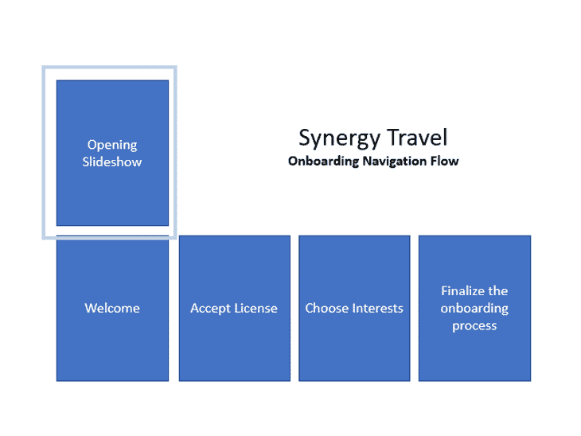
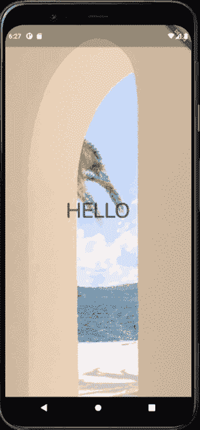
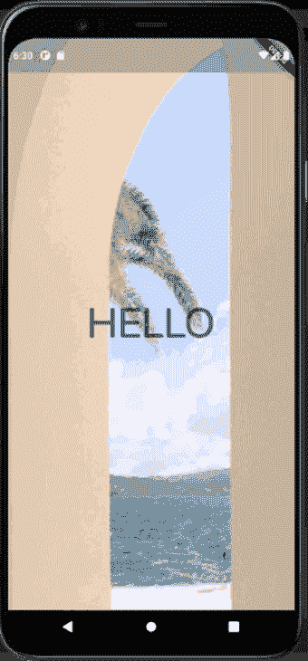
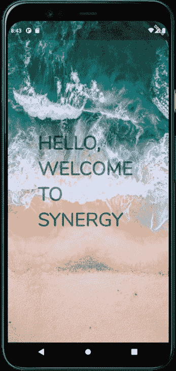
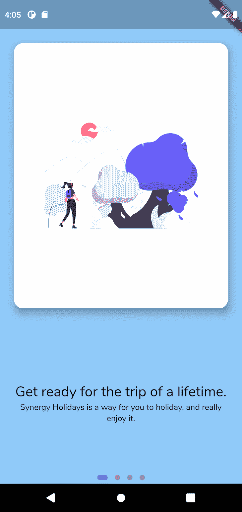
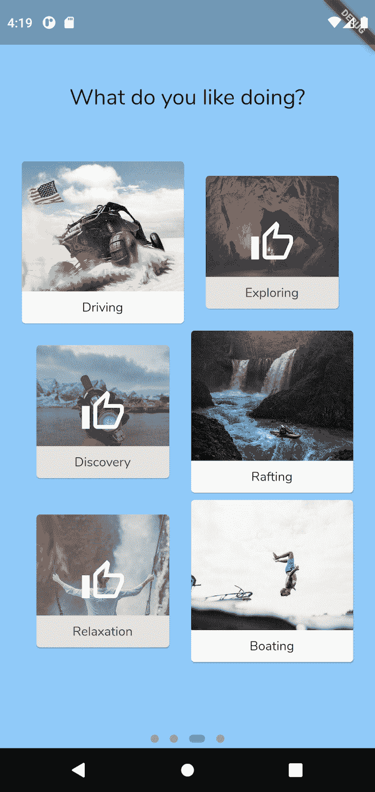

# 创建一个扑上屏幕的日志火箭博客

> 原文：<https://blog.logrocket.com/creating-flutter-onboarding-screen/>

说到移动应用，第一印象非常重要。通常，第一印象发生在入职过程中，用户在手机上设置应用程序。然而，因为入职只是简单地配置应用程序以使其第一次工作，所以它很容易变成一个无聊的过程。

入职培训还必须迎合大量用户，包括通过营销活动、口头宣传或在应用商店中看到某个应用的用户。

不管用户是如何进入应用程序的，入职流程必须为一个信息丰富但有趣的流程提供足够的信息，同时留住新用户。

良好的入职流程:

*   提供吸引人的外观和感觉，同时引人入胜
*   为用户提供了接受任何所需许可或协议的机会
*   从用户那里收集所有适当的数据，以便在入职流程后使用该应用程序

在本帖中，我们将探讨如何为名为“协同旅行”的应用程序创建合适的入职体验在世界上的许多地方，我们目前不能去任何地方旅行，所以让我们把所有的旅行愿望都集中到创造一个伟大的入职体验上来！✈


这是我们完成的入职培训屏幕的外观。当打开应用程序时，用户会看到一个以旅行为主题的幻灯片，通过缩放和淡入淡出来吸引他们，然后是主要的入职流程，其中有一个许可协议和一个选择他们兴趣的屏幕。

通过使用 motion，我们可以为用户创造引人入胜的有趣体验。那么，我们如何做到这一点呢？让我们找出答案。

## 规划我们的 Flutter 应用程序的入职流程

首先，我们必须规划我们的入职流程。在这种情况下，让我们播放开场幻灯片，让用户的视图垂直向下滚动到主入职流程。

如果我们想象用户可以在手机上看到浅蓝色的方框，我们的入职流程如下所示:



有效地规划我们追求的形象是很重要的，因为我们知道我们在朝着什么方向努力。如果我们不知道我们的目标是什么，我们的代码会变得一团糟。

因为我们希望我们的应用程序在用户打开时看起来很好，所以入职流程的第一步是创建一个引人入胜的开场幻灯片。

## 在 Flutter 中创建开场幻灯片

我们的开场幻灯片由几幅图片组成，上面覆盖着一个单词，最后一张幻灯片将所有的单词放在一起。

虽然我们可以使用视频来实现这一点，而无需在运行时在设备上播放，但我们可能会遇到一些压缩工件，并依赖于另一个包，从而增加应用程序的整体大小。

相反，我们将为 Flutter 提供在设备上呈现幻灯片所需的内容，以保持较小的安装包大小，并确保我们的应用程序获得最佳的视觉呈现。

要开始创建这个，让我们指定想要在我们的开场幻灯片顶部显示的单词:

```
final List<String> textOpeners = ['HELLO', 'WELCOME', 'TO', 'SYNERGY', 'HELLO,\r\nWELCOME\r\nTO\r\nSYNERGY'];

```

现在，这只是一个简单的单词列表。这个数组中的最后一个值使用换行符来分隔这些单词。然而，我们希望我们的开始图像每 2 秒改变一次，并且[显示一个按钮](https://blog.logrocket.com/new-material-buttons-in-flutter/)以在最后一个图像上开始入职过程。

幸运的是，Flutter 自带的`Timer.periodic`使得这种工作变得轻而易举:

```
void initState() {
  Timer.periodic(
    Duration(seconds: 2),
    (timer) {
      setState(() {
        if (index == 5) { // if we're at the end of the slideshow...
          timer.cancel(); //...stop running the timer
          setState(() {
            showStartCard = true; //...and show the button to begin the onboarding process
          });
        } else {
          index++; // otherwise, show the next slide
        }
      });
    },
  );
  super.initState();
}

```

因为当[调用`setState`](https://blog.logrocket.com/flutter-state-management-methods/) 时，我们的索引每 2 秒增加 1，这触发了我们的小部件的重建，以显示我们幻灯片中的下一幅图像。这由在参考图像之间切换的`AnimatedSwitcher`参考:

```
Widget build(BuildContext context) {
  return AnimatedSwitcher(
    duration: const Duration(milliseconds: 2000),
    child: Container(
      child: Stack(
        children: [
          Center(
            child: Text(
              textOpeners[index - 1],
              style: Theme.of(context).textTheme.headline3!.copyWith(
                    fontWeight: FontWeight.w900,
                    // color: Colors.white,
                  ),
            ),
          ),
          if (index == 5) // only on the last page
            AnimatedOpacity(
              duration: Duration(milliseconds: 400),
              opacity: showStartCard ? 1 : 0,
              child: Align(
                child: Padding(
                  padding: const EdgeInsets.all(80.0).copyWith(bottom: 120),
                  child: BottomTextInvite(
                    getStartedPressed: widget.getStartedPressed,
                  ),
                ),
                alignment: Alignment.bottomCenter,
              ),
            )
        ],
      ),
      key: ValueKey<int>(index),
      height: double.maxFinite, // occupy the entire screen
      width: double.maxFinite, // occupy the entire screen
      decoration: BoxDecoration(
        image: DecorationImage(
          fit: BoxFit.cover,
          image: AssetImage(
            'assets/opener/slide${index}.jpg',
          ),
        ),
      ),
    ),
  );
}

```

使用一个`AnimatedSwitcher`、一个`Stack`和一个`AnimatedOpacity`小部件会在每个新幻灯片淡入时带来非常好的体验。但是，虽然开始的幻灯片看起来还可以，但感觉还不是很好的体验；颜色混在一起，字不太清楚。



理想情况下，我们希望找到一种方法来提高视觉吸引力，一种简单的方法是引入一些赏心悦目的运动形式。

然而，很容易做过头，让用户在屏幕间切换，直到他们感到恶心，这永远不是最佳选择，所以我们需要添加一些细微差别，以确保它增加了体验，但又不影响体验。

为了实现这一点，我们可以将一个 [`ScaleTransition`和`FadeTransition`组合起来，产生一个看起来不错的效果](https://blog.logrocket.com/adding-animations-to-your-flutter-app/)。在我们的`AnimatedSwitcher`中，我们使用`transitionBuilder`来指定我们对这些小部件的更改应该如何发生:

```
transitionBuilder: (widget, animation) {
  final zoomAnimation = Tween(begin: 1.0, end: 1.3).animate(animation);
  final fadeAnimation = Tween(begin: 0.0, end: 1.0).animate(
    CurvedAnimation(
      parent: animation,
      curve: Interval(0.0, 0.2, curve: Curves.ease),
    ),
  );
  return FadeTransition(
    opacity: fadeAnimation,
    child: ScaleTransition(
      scale: zoomAnimation,
      child: widget,
    ),
  );
},
```

注意，在使用`zoomAnimation`和`fadeAnimation`时，我们必须考虑一些要点。

使用`zoomAnimation`时，从`1.0`开始，到`1.3`结束。这是因为图像开始填充 100%的屏幕，并以其原始大小的 130%结束，以提供缩放效果。还要注意，它在页面更改操作的整个过程中都会运行。

使用`fadeAnimation`时，从`0.0`开始，到`1.0`结束，使我们的过渡从完全透明到完全不透明。我们还使用`Interval`来指定这个动画与父动画同时开始，但是在父动画只完成 20%的时候结束。如果我们不这样做，我们的幻灯片将是一个永久的缩放和褪色的烂摊子。

既然我们已经指定了如何构建过渡，我们的开场幻灯片看起来更像这样:



我们需要做的最后一件事是添加一个`AnimatedOpacity`小部件，以便在幻灯片放映结束后淡入盒子。当我们的图像的索引是`5`(最后一张图像)时，我们希望将小部件的不透明度从完全透明切换到完全不透明，就像这样:

```
  if (index == 5) // only on the last page
            AnimatedOpacity(
              duration: Duration(milliseconds: 400),
              opacity: showStartCard ? 1 : 0,
              child: Align(
                child: Padding(
                  padding: const EdgeInsets.all(80.0).copyWith(bottom: 120),
                  child: BottomTextInvite(
                    getStartedPressed: widget.getStartedPressed,
                  ),
                ),
                alignment: Alignment.bottomCenter,
              ),
            )

```

这给了我们预期看到的淡入效果:



## 配置 Flutter `PageView`小部件

为了完成我们的开场，我们需要两个配置好的`PageView`小部件。第一个必须在垂直轴上操作，并在用户点击按钮后垂直移动视口。

用户将不能滑动这个`PageView`小部件来四处移动，因为用户滑动回到我们的开始幻灯片在逻辑上没有意义。

第二个小部件必须在水平轴上操作，并在用户向某个方向滑动时移动视口。

因为我们有两个相互嵌套的`PageView`小部件，任一个`PageView`都可以尝试接收和处理触摸事件，这不是我们想要的。相反，我们必须将我们的外部`ScrollView`设置为使用`NeverScrollableScrollPhysics`，并使用`ScrollController`手动滚动它。

所以，我们的根`PageView`和我们的子`PageView`看起来像这样:

```
Widget build(BuildContext context) {
  return Scaffold(
    body: PageView( // Root PageView
      controller: outerScrollController, // The scroll controller that is used to programatically scroll the PageView
      physics: NeverScrollableScrollPhysics(), // Prevent the user from swiping
      scrollDirection: Axis.vertical,
      children: [
        ClipRect( // Prevent children from overflowing from the container
          child: EnticerOpenerPage(
            getStartedPressed: () => outerScrollController.animateToPage(
              1, // When the user presses the button, scroll down to the onboarding process.
              duration: Duration(seconds: 1),
              curve: Curves.fastOutSlowIn,
            ),
          ),
        ),
        Stack(
          children: [
            PageView( // The child PageView
              onPageChanged: (val) {
                setState(() {
                  // Update the scroll position indicator at the bottom
                  innerScrollPosition = val.toDouble();
                });
              },
              children: [...onboarding widgets...]
              ),
              Align(
                alignment: Alignment.bottomCenter,
                child: DotsIndicator( // Shows the user their progress
                  dotsCount: 4,
                  position: innerScrollPosition,
                  decorator: DotsDecorator(
                    size: const Size.square(9.0),
                    activeSize: const Size(18.0, 9.0),
                    activeShape: RoundedRectangleBorder(borderRadius: BorderRadius.circular(5.0)),
    ),
  ),
)

```

## 在 Flutter 中设置入职步骤

因为我们的 onboarding 步骤通常都显示一些文本和一个图像，所以我们必须声明一个`OnboardStep`小部件，该部件接受我们希望在每个步骤中显示的孩子列表并显示一个图像。如果图像不存在，那么子对象将呈现容器的完整大小:

```
class OnboardStep extends StatelessWidget {
  final Widget? image;
  final List<Widget> children;

  OnboardStep(
    this.children, {
    this.image,
  });

  @override
  Widget build(BuildContext context) {
    return Container(
      color: Colors.blue.shade200,
      child: Column(
        children: [
          if (image != null)
            Expanded(
              child: SafeArea(
                child: Padding(
                  padding: const EdgeInsets.all(20.0),
                  child: Card(
                    elevation: 10,
                    child: image!,
                    shape: RoundedRectangleBorder(borderRadius: BorderRadius.circular(15)),
                  ),
                ),
              ),
              flex: 2, // occupy 2/3 of available space
            ),
          Expanded(
            child: Padding(
              padding: const EdgeInsets.all(20.0),
              child: Column(
                crossAxisAlignment: CrossAxisAlignment.stretch,
                mainAxisSize: MainAxisSize.max,
                mainAxisAlignment: MainAxisAlignment.center,
                children: children,
              ),
            ),
            flex: 1 // occupy 1/3 of available space,
          ),
        ],
      ),
    );
  }
}

```

用这个小部件创建的`OnboardStep`在视觉设计上每一步都是一致的。为了创建我们的初始步骤，我们只需要提供我们想要在这个特定步骤中显示的文本，并给出一个要使用的图像。调用这个小部件很容易:

```
OnboardStep(
  [
    Text(
      'Get ready for the trip of a lifetime.',
      style: Theme.of(context).textTheme.headline5,
      textAlign: TextAlign.center,
    ),
    Text(
      'Synergy Holidays is a way for you to holiday, and really enjoy it.',
      textAlign: TextAlign.center,
    ),
  ],
  image: Padding(
    padding: const EdgeInsets.all(50.0),
    child: Image.asset('assets/explore.png'),
  ),
),

```

该代码随后产生以下结果:



只要我们有一些文本要用可选的图像显示，我们就可以在入职流程的这个特定阶段轻松地显示我们想要的任何内容。

## 在 Flutter 中创建兴趣选择屏幕

通常，在入职过程中，开发人员希望从客户那里收集一些信息，比如他们的电子邮件地址或姓名。

在这种情况下，我们想知道用户在假期想做什么，这样我们的应用程序就可以给出适当的建议。同样，动作和反馈的微妙使用可以让用户感觉这个过程是愉快的和高质量的。

我们最终的兴趣选择屏幕如下所示:



要开始构建这个页面，我们必须构建一个可能的活动列表，供用户从中进行选择。我们还必须声明一个`Set`来跟踪选择的内容(我们使用`Set`是因为项目必须是唯一的，不像`List`允许重复):

```
final holidayTypes = [
  HolidayType('buggy.jpg', 'Driving'),
  HolidayType('cave_diving.jpg', 'Exploring'),
  HolidayType('exploration.jpg', 'Discovery'),
  HolidayType('rafting.jpg', 'Rafting'),
  HolidayType('relaxation.jpg', 'Relaxation'),
  HolidayType('water.jpg', 'Boating'),
];

final selectedHolidayTypes = <String>{};

```

当用户点击兴趣时，兴趣会缩小，并覆盖一个竖起大拇指的图标。为了实现这一点，我们必须使用一个`GridView`在一个网格上展示我们的兴趣。

同样，我们将使用`AnimatedContainer`和`AnimatedOpacity`来处理项目收缩和添加竖起大拇指图标显示。当兴趣被挖掘时，它们被添加到`selectedHolidayTypes`或从【】中删除:

```
GridView.count(
  physics: NeverScrollableScrollPhysics(),
  shrinkWrap: true,
  crossAxisCount: 2,
  children: [
    ...holidayTypes.map(
      (e) => AnimatedContainer(
        duration: Duration(milliseconds: 100),
        padding: selectedHolidayTypes.contains(e.name) ? EdgeInsets.all(16) : EdgeInsets.zero, // Implicitly animate between full size, or shrunk size, depending if selected
        child: Card(
          clipBehavior: Clip.antiAlias, // Clip the overflow
          child: InkWell( // Display the inkwell splash when the user taps on an item
            onTap: () {
              setState(() {
                if (selectedHolidayTypes.contains(e.name)) {
                  // If the interest is already on the list, remove it
                  selectedHolidayTypes.remove(e.name);
                } else {
                  // Otherwise, add it
                  selectedHolidayTypes.add(e.name);
                }
              });
            },
            child: Ink.image(
              image: AssetImage(
                'assets/holidaytypes/${e.asset}',
              ),
              fit: BoxFit.cover, // Cover the entire container with the image
              child: Stack(
                alignment: Alignment.center,
                fit: StackFit.expand, // Expand children items to fit parent size
                children: [
                  // Align the label to the bottom center of the card.
                  Align(
                    child: Container(
                      padding: EdgeInsets.zero,
                      child: Padding(
                        padding: const EdgeInsets.all(8.0),
                        child: Text(
                          e.name,
                          textAlign: TextAlign.center,
                        ),
                      ),
                      width: double.maxFinite,
                      color: Colors.white,
                    ),
                    alignment: Alignment.bottomCenter,
                  ),
                  // The 'thumbs-up' icon
                  AnimatedOpacity(
                    // If selected, show the thumbs-up icon
                    opacity: selectedHolidayTypes.contains(e.name) ? 1.0 : 0.0,
                    duration: Duration(milliseconds: 100),
                    child: Container(
                      height: double.maxFinite,
                      width: double.maxFinite,
                      // Overlay the image with a slight grey color
                      color: Colors.grey.withOpacity(0.3),
                      child: Icon(
                        Icons.thumb_up_alt_outlined,
                        color: Colors.white,
                        size: 50,
                      ),
                    ),
                  )
                ],
              ),
            ),
          ),
        ),
      ),
    )
  ],
)

```

该代码的结果是一个可交互的按钮，如下所示:


## 包扎

从一开始就让你的用户惊叹是很重要的，拥有一个有效的入职流程对实现这一点大有帮助。幸运的是，通过使用一些基本的运动和 Flutters 内置的隐式动画，不难实现您想要的确切结果。

和往常一样，在这里可以找到这个例子的源代码的链接。我希望您为您的应用程序创建一个真正伟大的入职流程！🚀😊

## 使用 [LogRocket](https://lp.logrocket.com/blg/signup) 消除传统错误报告的干扰

[](https://lp.logrocket.com/blg/signup)

[LogRocket](https://lp.logrocket.com/blg/signup) 是一个数字体验分析解决方案，它可以保护您免受数百个假阳性错误警报的影响，只针对几个真正重要的项目。LogRocket 会告诉您应用程序中实际影响用户的最具影响力的 bug 和 UX 问题。

然后，使用具有深层技术遥测的会话重放来确切地查看用户看到了什么以及是什么导致了问题，就像你在他们身后看一样。

LogRocket 自动聚合客户端错误、JS 异常、前端性能指标和用户交互。然后 LogRocket 使用机器学习来告诉你哪些问题正在影响大多数用户，并提供你需要修复它的上下文。

关注重要的 bug—[今天就试试 LogRocket】。](https://lp.logrocket.com/blg/signup-issue-free)