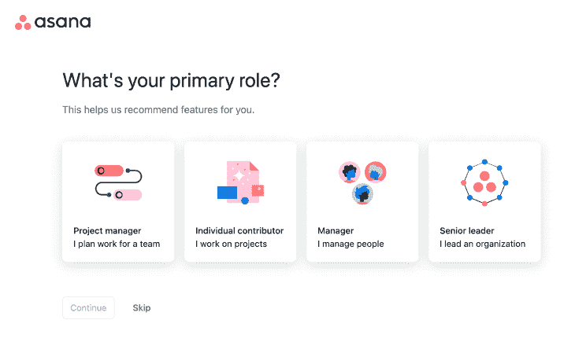
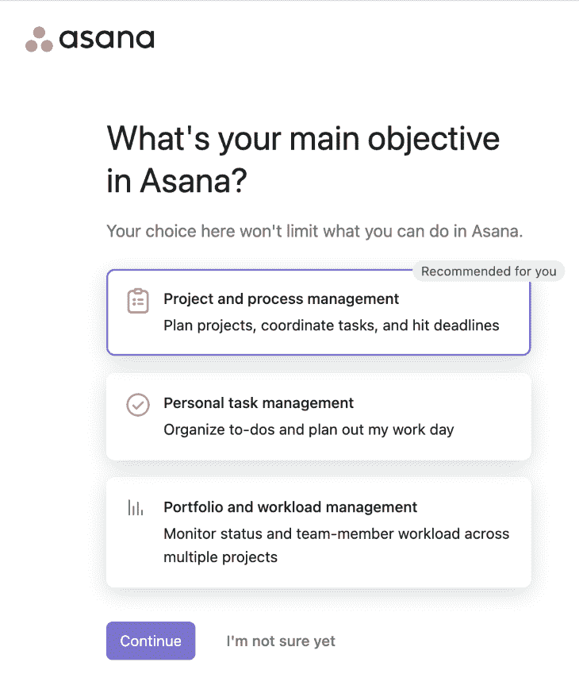
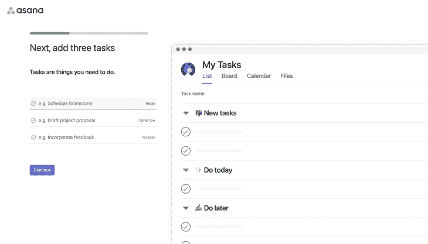
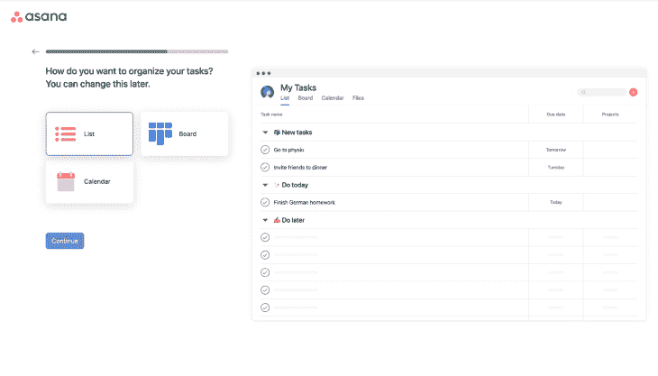
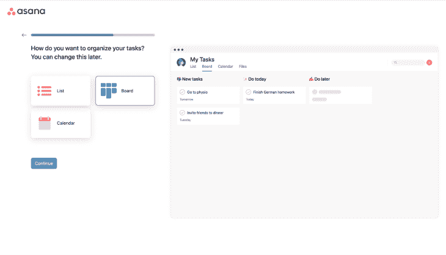
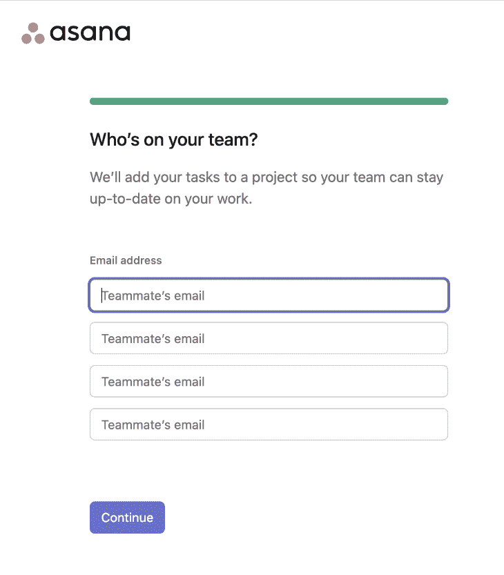
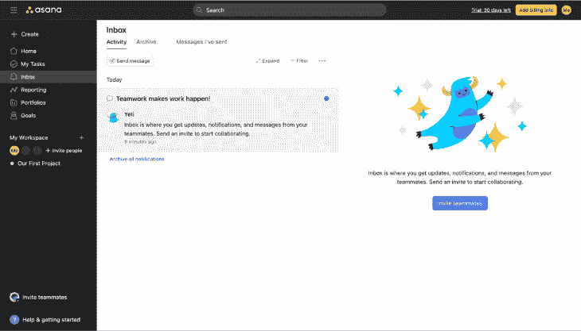
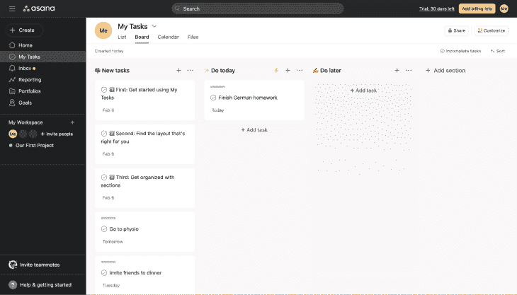
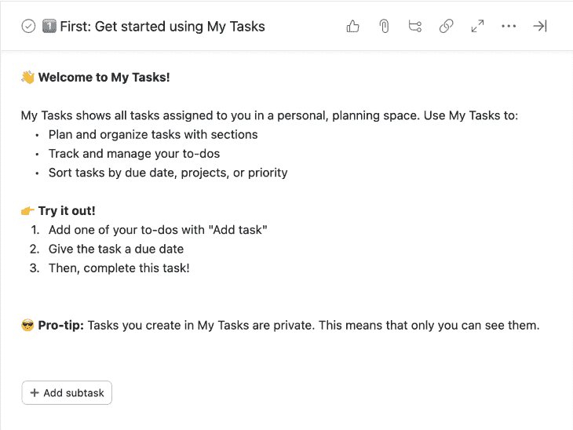

# 创造顺畅的用户入职体验

> 原文：<https://blog.logrocket.com/ux-design/creating-frictionless-user-onboarding-experience/>

你好，欢迎光临！让我带你四处看看，向你介绍这里的东西。Opps，但是你刚开始点下一个，下一个，下一个。嘿，你在听我说话吗？如果你能给我一分钟的时间，我真的能帮上忙。也许 30 秒？好吧，给我 5 秒钟。没有吗？我猜你只是想一个人去。那我就不打扰你了。

您已经单击了关闭。我希望你以后不会后悔你的决定…

这是一个关于用户加入流程的悲伤的小故事。我打赌你听起来也有点耳熟。

然而，数据显示，人们指望拥有良好的用户入职体验。根据 Wyzowl 的调查，86%的人倾向于成为提供良好入职体验并投资用户入职的公司的忠实客户。此外，根据 [Groove 的研究](https://www.groovehq.com/customer-service-statistics)，如果问题在第一次接触时就得到解决，67%的流失实际上是可以避免的。

这意味着这里有一个断开的链接。人们关心用户的加入，但是我们可能无法提供相关的和有帮助的用户加入体验。

你是否试图引导用户度过第一个啊哈时刻，以便他们坚持使用你的产品？你的客户注册后有没有被抛弃的感觉，很迷茫？然后，您需要考虑构建一个无摩擦的用户入职体验。

我们将以体式为例。Asana 是一个任务和项目管理软件。人们使用体式来组织、合作、计划和执行任务。让我们通过 Asana 的最佳实践来看看构建无摩擦用户入职的步骤。

## 1.根据用户类型定制入职培训

根据 Zendesk 的年度 CX 趋势报告，90%的消费者表示他们愿意在个性化客户服务体验的公司花更多的钱。你不觉得用户入职是包含在这个预期里的吗？不同的人使用你的产品来解决不同的问题。他们在你的产品中看到的价值可能会有所不同。

根据用户类型区分您的入职，使您能够强调相关功能，并根据他们自己的“啊哈时刻”进行优化这也有助于用户理解你关心他们独特的问题。

为了做到这一点，列出你拥有的主要用户类型，并列出他们应该首先发现的重要事情。让我们假设您列出了您的用户类型，但是您对所有类型都有相同的值，并且您无法区分您的入职。向用户展示你的产品被和自己一样的人使用还是有价值的。Asana 也欢迎用户加入他们的入职流程，要求他们选择自己的主要角色来实现这种定制。

## 2.不要强迫用户遵循你的入职路径

用户入门的主要目的不是教用户或强迫他们走一条路。作为一个产品，也应该向用户学习。例如，他们对你有什么期望？如果用户觉得你是根据他们的需求来配置你的产品的，他们会更喜欢加入。然而，这并不意味着他们总是知道自己想要什么。

为了让用户留在入职流程中，也给他们一个困惑的选项。Asana 还让用户可以选择说“我还不确定”,避免在入职时出现任何死角。

类似地， [Vevo 应用程序发现](https://www.swrve.com/resources/weblog/app-onboarding-creating-engaged-users-from-the-start)在他们的入职流程中增加了一个跳过选项，增加了近 10%的登录，成功注册的数量增加了近 6%。

## 3.显示用户进度并保持简短

用户想知道需要多长时间才能看到你的实际产品。强烈建议进度条显示他们的进度。当你强迫用户在毫无头绪的情况下点击一个又一个按钮时，他们更有可能觉得你在打扰他们。你没有引导他们去实现他们想要的东西，但是你对他们来说是一个障碍。

如果你能让用户做他们想做的事情，他们不会想放弃你的加入。在 Asana 的案例中，您已经在入职体验中使用了该产品。他们只是要求你添加一些待办事项，我的任务会根据你的输入更新。它也能可视化产品的工作方式。很顺利的发现体验。

## 4.引导他们度过啊哈时刻

Asana 是一个项目管理工具。因此，作为一名用户，当你开始与你的队友一起使用它并进行协作时，你会看到最大的价值。这就是为什么他们要求用户邀请他们的队友加入平台，作为入职流程的一部分。

在设计用户入职时，考虑你的啊哈时刻是很重要的。本书作者:*黑客成长*、[肖恩·阿利斯](https://www.seanellis.me)这样定义 Aha 时刻:*“Aha 是产品的效用真正为用户点击的时刻；当用户真正获得核心价值时——产品的用途，他们为什么需要它，以及他们从使用它中获得什么好处。”*

为了更清楚，让我举更多的例子。脸书的啊哈时刻是用户在 10 天内与 7 个朋友联系。 [Slack](https://www.fastcompany.com/3041905/slacks-founder-on-how-they-became-a-1-billion-company-in-two-years) 将 Aha 时刻定义为团队之间发送的 2000 条消息。

我想你已经明白入职不会那么容易结束。当用户脱离“正式”用户入职时，他们实际上仍在入职。体式有各种各样的特点，如**报告**、**组合**、**目标**。这些功能看起来也很酷。你认为他们为什么不推动这些功能呢？

体式的重点是“邀请队友”他们不断提醒你如何把队友带到工具面前。由于试验将在 30 天后结束，他们希望你在此之前坚持下去。你以后也可以发现这些特性，现在不急着去做。但是有一个 30 天的期限作为价值衡量标准。

## 5.给用户不同的方法去发现

在用户完成或跳过最初的入职培训后，他们仍然需要发现你的产品并找到他们问题的答案。他们想知道如何像专业人士一样使用它，并为自己获得最大价值。

Asana 想通过**帮助&开始**他们的主导航来实现这一点。如果你对发现高级特性感到足够舒适，那就是你学习的机会。因为你不能把所有的东西都放进你的入职培训，你可以用这种方法回答进一步的问题。

另一种让用户加入的方式是将产品之旅作为清单。Asana 很幸运，因为它的应用程序中已经有了待办事项列表。他们利用他们的工具给顾客一份清单，作为一个体式专业人士。清单有助于让用户按照自己的节奏和时间发现产品。

## 6.衡量入职的成功

用户入职不是一次性的事情。您可能会经历上面提到的所有步骤，并创建一个无摩擦的用户登录体验。坏消息是你的工作还没完成。您需要持续监控用户是否参与您的用户入职体验。他们在哪里下车？您认为人们没有特别参与的用户入职步骤有哪些？你开始明白你的用户开始从不同的特性中看到你产品的价值了吗？你需要像衡量你的产品一样衡量你的用户入职体验表现，并相应地改变它。

如果你仅仅依靠用户加入来获得产品成功，那么这可能是危险的。你应该专注于创造用户体验，这样你的用户就可以获得价值，而不需要你也参与其中。我建议你记住，用户的加入不应该仅仅是你产品的催化剂。

*标题图片来源:[图标侦察](https://iconscout.com)*

## [LogRocket](https://lp.logrocket.com/blg/signup) :无需采访即可获得 UX 洞察的分析

[LogRocket](https://lp.logrocket.com/blg/signup) 让您可以回放用户的产品体验，以可视化竞争，了解影响采用的问题，并结合定性和定量数据，以便您可以创建令人惊叹的数字体验。

查看设计选择、交互和问题如何影响您的用户— [立即尝试 LogRocket】。](hhttps://lp.logrocket.com/blg/signup)