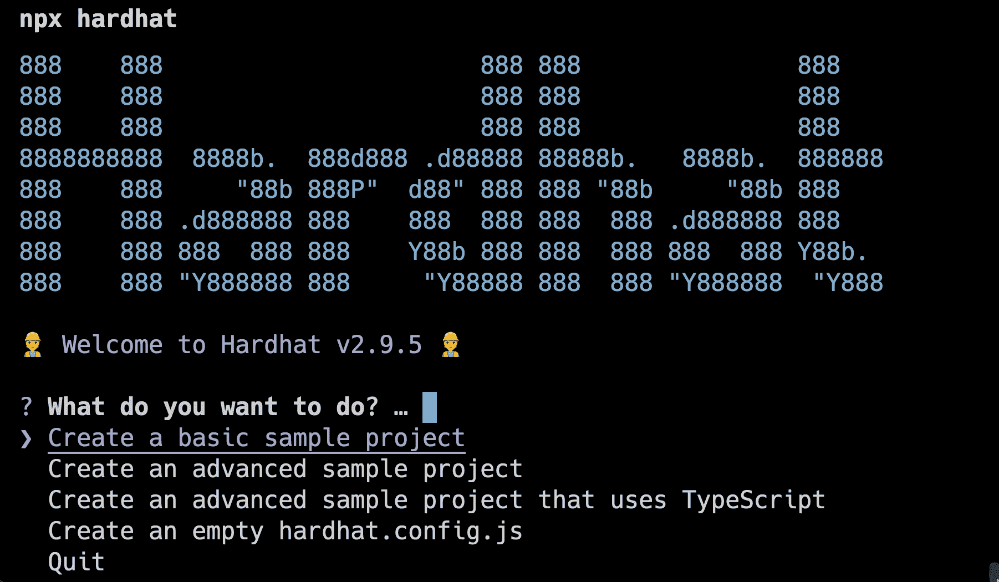
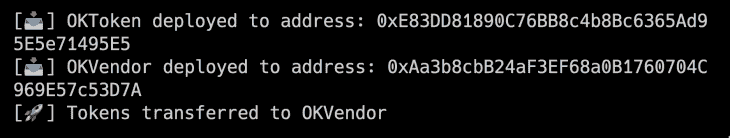
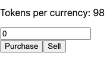

# 使用 Polygon - LogRocket 博客创建全栈 DeFi 应用程序

> 原文：<https://blog.logrocket.com/creating-full-stack-defi-app-polygon/>

DeFi 现在是加密货币领域的一个主要讨论话题。DeFi 代表“分散金融”，这意味着没有中央权力机构来监督和控制资金的转移。这也意味着 DeFi 中的交易是 P2P(点对点)，这意味着没有中央机构负责转账，资金直接从一个实体发送到另一个实体。

在这篇文章中，我们将学习如何通过使用 Next.js 作为前端在多边形链上制作一个全栈 DeFi 应用程序来开始使用 DeFi。这个应用程序将向用户出售和购买 OKToken(一个虚构的令牌)。但是，每一次购买交易都会从您通过 [MATIC](https://www.investopedia.com/polygon-matic-definition-5217569#:~:text=MATIC%20is%20an%20ERC%2D20%20token%2C%20meaning%20that%20it%27s%20compatible%20with%20other%20Ethereum%2Dbased%20digital%20currencies.%20MATIC%20is%20used%20to%20govern%20and%20secure%20the%20Polygon%20network%20and%20to%20pay%20network%20transaction%20fees.3) 获得的代币数量中减少一个代币(出售会使该数量增加一个)。这不是一个理想的演示，但通过这种方式，您可以了解如何在 Solidity smart contracts 中使用自己的逻辑，并学习使用 Polygon 创建自己的全栈 DeFi app。

### 内容

### 要求

要开始学习本教程，请确保您具备以下条件:

既然您已经检查了需求，让我们继续创建我们的 Hardhat 项目，以便与我们的 [Solidity smart contracts](https://blog.logrocket.com/daml-vs-solidity-choose-smart-contract-language/) 一起工作。

## 创建安全帽项目

导航到一个安全目录，并在终端中运行以下命令来初始化您的 Hardhat 项目:

```
npx hardhat

```

运行该命令后，您应该会在终端中看到下面的 Hardhat 初始化向导。



从列表中选择**创建一个高级示例项目**。然后会问你要在哪里初始化 Hardhat 项目；不要更改字段，只需按下**回车**，项目就会在当前目录下初始化。

然后会询问您是否要安装运行 Hardhat 项目所需的依赖项。按下 **y** 因为我们将需要这些依赖项，现在安装它们是最好的主意。

依赖项的安装将开始，可能需要几秒或几分钟的时间，具体取决于您正在运行的计算机。现在，在终端中运行以下命令来安装另一个依赖项，我们将需要它来简化我们的 Solidity 契约开发:

```
npm install @openzeppelin/contracts

```

OpenZeppelin 提供智能合约标准，我们可以在自己的智能合约中使用这些标准来轻松创建 Ownable、ERC-20 和 ERC-721 等合约。

成功安装依赖项后，在代码编辑器中打开目录。在本教程中，我将使用 VS 代码。

我们将创建两个智能合同:第一个是我们的 ERC-20 令牌本身，第二个是供应商合同，这将促进这些令牌的购买和销售。

## 创建我们的智能合同

现在，转到`contracts`文件夹，创建一个名为`OKToken.sol`的新 Solidity 文件，它将包含我们的 ERC-20 令牌合同。

对此文件使用以下代码:

```
// SPDX-License-Identifier: Unlicense
pragma solidity ^0.8.4;
import "@openzeppelin/contracts/token/ERC20/ERC20.sol";

contract OKToken is ERC20 {
    constructor() ERC20("OKT", "OKToken"){
        _mint(msg.sender, 10000 * 10 ** 18);
    }
}

```

在上面的代码中，我们从`@openzeppelin/contracts`导入`ERC20.sol`文件，这将帮助我们轻松地开始使用 ERC-20 令牌。然后，在构造函数中，我们为令牌提供了符号`"OKT"`和名称`"OKToken"`。

代币合同到此为止！现在，让我们处理供应商合同。在`contracts`文件夹下，用以下代码创建一个名为`OKVendor.sol`的新文件:

```
// SPDX-License-Identifier: MIT
pragma solidity ^0.8.4;
import "./OKToken.sol";
import "@openzeppelin/contracts/access/Ownable.sol";

contract OKVendor is Ownable {
  OKToken yourToken;
  uint256 public tokensPerNativeCurrency = 100;
  event BuyTokens(address buyer, uint256 amountOfNativeCurrency, uint256 amountOfTokens);
  constructor(address tokenAddress) {
    yourToken = OKToken(tokenAddress);
  }

  function buyTokens() public payable returns (uint256 tokenAmount) {
    require(msg.value > 0, "You need to send some NativeCurrency to proceed");
    uint256 amountToBuy = msg.value * tokensPerNativeCurrency;

    uint256 vendorBalance = yourToken.balanceOf(address(this));
    require(vendorBalance >= amountToBuy, "Vendor contract has not enough tokens to perform transaction");

    (bool sent) = yourToken.transfer(msg.sender, amountToBuy);
    require(sent, "Failed to transfer token to user");
    tokensPerNativeCurrency = tokensPerNativeCurrency - 1;

    emit BuyTokens(msg.sender, msg.value, amountToBuy);
    return amountToBuy;
  }
  function sellTokens(uint256 tokenAmountToSell) public {

    require(tokenAmountToSell > 0, "Specify an amount of token greater than zero");

    uint256 userBalance = yourToken.balanceOf(msg.sender);
    require(userBalance >= tokenAmountToSell, "You have insufficient tokens");

    uint256 amountOfNativeCurrencyToTransfer = tokenAmountToSell / tokensPerNativeCurrency;
    uint256 ownerNativeCurrencyBalance = address(this).balance;
    require(ownerNativeCurrencyBalance >= amountOfNativeCurrencyToTransfer, "Vendor has insufficient funds");
    (bool sent) = yourToken.transferFrom(msg.sender, address(this), tokenAmountToSell);
    require(sent, "Failed to transfer tokens from user to vendor");

    (sent,) = msg.sender.call{value: amountOfNativeCurrencyToTransfer}("");
    tokensPerNativeCurrency = tokensPerNativeCurrency + 1;
    require(sent, "Failed to send NativeCurrency to the user");
  }
  function getNumberOfTokensInNativeCurrency() public view returns(uint256) {
    return tokensPerNativeCurrency;
  }

  function withdraw() public onlyOwner {
    uint256 ownerBalance = address(this).balance;
    require(ownerBalance > 0, "No NativeCurrency present in Vendor");
    (bool sent,) = msg.sender.call{value: address(this).balance}("");
    require(sent, "Failed to withdraw");
  }
}

```

这将有助于我们方便代币的买卖。

在上面的契约中，首先我们导入我们的令牌契约，我们需要它来使用供应商契约和调用函数与我们的令牌契约进行交互。

我们也在从`@openzeppelin/contracts`导入`Ownable.sol`。这意味着智能合约的所有者可以转移其所有权，并可以访问所有者专有的功能。

在初始化智能合约之后，我们定义了变量`tokensPerNativeCurrency`,该变量表示可以使用 1 MATIC 购买的令牌数量。我们将根据所进行的交易更改该号码。

然后，我们有一个构造函数，它将接受 OKToken 的契约地址，这样我们就可以与部署的契约进行通信，并对它们执行功能。

在`buyTokens()`函数中，我们执行检查以确保向智能合同发送了适当数量的 MATIC，并且供应商合同具有所需数量的令牌。然后，我们从之前创建的 OKToken 实例中调用函数`transfer()`,将令牌传递给请求发送者。

在`sellTokens()`函数中，我们执行检查以确保请求发送者有足够的令牌，以及供应商合同是否有足够的令牌发送回请求发送者。然后，我们使用之前创建的 OKToken 实例中的`transferFrom()`函数将令牌从请求发送者的钱包转移到智能契约。然而，发送者需要批准该交易；在发出请求之前，我们在客户端执行这种批准。当我们制作这个应用程序的前端时，我们将讨论这一部分。

最后，我们有`withdraw()`函数，只有合同的所有者才能访问它。它允许他们撤回合同上的所有条款。

现在我们已经准备好了智能合约，让我们将它们部署到 Polygon Mumbai testnet！

## 部署我们的智能合同

我们将创建一个脚本来部署我们的合同多边形孟买。一旦部署了契约，我们将以编程方式将存储在部署者钱包中的所有令牌发送给供应商契约。

首先转到`hardhat.config.js`并在`module.exports`下，添加以下对象，以便 Hardhat 知道要连接到哪个网络:

```
networks: {
  mumbai: {
    url: "https://matic-mumbai.chainstacklabs.com",
    accounts: ["PRIVATE KEY HERE"],
  }
}

```

我们将为网络提供一个名称(在本例中为`mumbai`),并提供一个 RPC URL。提到的 RPC 网址是为多边形孟买。如果你想使用多边形 Mainnet，你可以选择你的 RPC 网址。请记住输入您自己的钱包私人密钥和一些测试码，以支付智能合同部署流程中涉及的汽油费。

现在，在`scripts`文件夹下，创建一个名为`deploy.js`的新文件。粘贴以下内容:

```
const { BigNumber, utils } = require("ethers");
const hardhat = require("hardhat");
async function main() {
  const OKToken = await hardhat.ethers.getContractFactory("OKToken");
  const oktoken = await OKToken.deploy();
  await oktoken.deployed();
  console.log("[📥] OKToken deployed to address: " + oktoken.address);
  const OKVendor = await hardhat.ethers.getContractFactory("OKVendor");
  const okvendor = await OKVendor.deploy(oktoken.address);
  console.log("[📥] OKVendor deployed to address: " + okvendor.address);
  await oktoken.deployed();
  // Transfer oktokens to vendor
  await oktoken.functions.transfer(okvendor.address, utils.parseEther("10000"));
  console.log("[🚀] Tokens transferred to OKVendor");
}
main()
  .then(() => process.exit(0))
  .catch((error) => {
    console.error(error);
    process.exit(1);
});

```

在上面的文件中，我们正在指导 Hardhat 如何部署我们的合同。`main()`函数是这里的入口点。首先，我们获得`OKToken`契约并部署它。然后，我们获得`OKVendor`契约，在构造函数中提供`OKToken`契约地址，并部署契约。然后，我们将所有资金从`OKToken`合同转移到`OKVendor`合同。

在终端中运行以下命令来运行脚本，并将我们的合同部署到 Polygon Mumbai 网络:

```
npx hardhat run --network mumbai scripts/deploy.js --show-stack-traces

```

请注意，网络名称必须与`hardhat.config.js`中提到的名称相匹配。运行该脚本后，应该已经部署了契约，您应该在终端中看到以下内容:



如果您看到类似以下内容的输出，则您的智能合约已成功部署和配置。现在，让我们继续创建 Next.js 应用程序。

## 创建 Next.js DeFi 应用程序

在同一目录下，在终端中运行以下命令来创建 Next.js 应用程序:

```
npx create-next-app frontend

```

上述命令将创建一个新的应用程序，并自动安装必要的依赖项。

导航到`frontend`文件夹，在终端中使用以下命令来安装附加的依赖项，这将帮助我们与智能合同进行交互:

```
yarn add @thirdweb-dev/react @thirdweb-dev/sdk ethers web3

```

我们正在安装`@thirdweb-dev/react`和`@thirdweb-dev/sdk`，这样我们就可以使用[元掩码](https://blog.logrocket.com/understanding-resolving-metamask-error-codes/)轻松认证用户并将其钱包连接到我们的应用程序。`ethers`是 thirdweb 必需的依赖项，所以我们也需要安装它。最后，我们正在安装`web3`，以便我们可以与我们的智能合同进行交互。

## 添加第三方 web 提供程序

首先，我们需要将我们的应用程序封装在一个`thirdwebProvider`中，这样 thirdweb 才能正常运行。

转到`pages`文件夹下的`_app.js`文件，添加以下内容:

```
import { thirdwebProvider, ChainId } from "@thirdweb-dev/react";
import "../styles/globals.css";
function MyApp({ Component, pageProps }) {
  return (
    <thirdwebProvider desiredChainId={ChainId.Mumbai}>
      <Component {...pageProps} />
    </thirdwebProvider>
  );
}
export default MyApp;

```

在上面的代码中，我们导入了`thirdwebProvider`，并将我们的应用程序封装在其中。我们还提供了多边形孟买的链 ID 的`desiredChainId`。如果您愿意，也可以使用多边形 Mainnet 的链 ID。

在 Next.js 应用程序根目录下创建一个名为`contracts.js`的新文件，并添加以下内容:

```
export const oktoken = {
  contractAddress: "0xE83DD81890C76BB8c4b8Bc6365Ad95E5e71495E5",
  abi: [
    {
      inputs: [],
      stateMutability: "nonpayable",
      type: "constructor",
    },
    {
      anonymous: false,
      inputs: [
        {
          indexed: true,
          internalType: "address",
          name: "owner",
          type: "address",
        },
        {
          indexed: true,
          internalType: "address",
          name: "spender",
          type: "address",
        },
        {
          indexed: false,
          internalType: "uint256",
          name: "value",
          type: "uint256",
        },
      ],
      name: "Approval",
      type: "event",
    },
    {
      anonymous: false,
      inputs: [
        {
          indexed: true,
          internalType: "address",
          name: "from",
          type: "address",
        },
        {
          indexed: true,
          internalType: "address",
          name: "to",
          type: "address",
        },
        {
          indexed: false,
          internalType: "uint256",
          name: "value",
          type: "uint256",
        },
      ],
      name: "Transfer",
      type: "event",
    },
    {
      inputs: [
        {
          internalType: "address",
          name: "owner",
          type: "address",
        },
        {
          internalType: "address",
          name: "spender",
          type: "address",
        },
      ],
      name: "allowance",
      outputs: [
        {
          internalType: "uint256",
          name: "",
          type: "uint256",
        },
      ],
      stateMutability: "view",
      type: "function",
    },
    {
      inputs: [
        {
          internalType: "address",
          name: "spender",
          type: "address",
        },
        {
          internalType: "uint256",
          name: "amount",
          type: "uint256",
        },
      ],
      name: "approve",
      outputs: [
        {
          internalType: "bool",
          name: "",
          type: "bool",
        },
      ],
      stateMutability: "nonpayable",
      type: "function",
    },
    {
      inputs: [
        {
          internalType: "address",
          name: "account",
          type: "address",
        },
      ],
      name: "balanceOf",
      outputs: [
        {
          internalType: "uint256",
          name: "",
          type: "uint256",
        },
      ],
      stateMutability: "view",
      type: "function",
    },
    {
      inputs: [],
      name: "decimals",
      outputs: [
        {
          internalType: "uint8",
          name: "",
          type: "uint8",
        },
      ],
      stateMutability: "view",
      type: "function",
    },
    {
      inputs: [
        {
          internalType: "address",
          name: "spender",
          type: "address",
        },
        {
          internalType: "uint256",
          name: "subtractedValue",
          type: "uint256",
        },
      ],
      name: "decreaseAllowance",
      outputs: [
        {
          internalType: "bool",
          name: "",
          type: "bool",
        },
      ],
      stateMutability: "nonpayable",
      type: "function",
    },
    {
      inputs: [
        {
          internalType: "address",
          name: "spender",
          type: "address",
        },
        {
          internalType: "uint256",
          name: "addedValue",
          type: "uint256",
        },
      ],
      name: "increaseAllowance",
      outputs: [
        {
          internalType: "bool",
          name: "",
          type: "bool",
        },
      ],
      stateMutability: "nonpayable",
      type: "function",
    },
    {
      inputs: [],
      name: "name",
      outputs: [
        {
          internalType: "string",
          name: "",
          type: "string",
        },
      ],
      stateMutability: "view",
      type: "function",
    },
    {
      inputs: [],
      name: "symbol",
      outputs: [
        {
          internalType: "string",
          name: "",
          type: "string",
        },
      ],
      stateMutability: "view",
      type: "function",
    },
    {
      inputs: [],
      name: "totalSupply",
      outputs: [
        {
          internalType: "uint256",
          name: "",
          type: "uint256",
        },
      ],
      stateMutability: "view",
      type: "function",
    },
    {
      inputs: [
        {
          internalType: "address",
          name: "to",
          type: "address",
        },
        {
          internalType: "uint256",
          name: "amount",
          type: "uint256",
        },
      ],
      name: "transfer",
      outputs: [
        {
          internalType: "bool",
          name: "",
          type: "bool",
        },
      ],
      stateMutability: "nonpayable",
      type: "function",
    },
    {
      inputs: [
        {
          internalType: "address",
          name: "from",
          type: "address",
        },
        {
          internalType: "address",
          name: "to",
          type: "address",
        },
        {
          internalType: "uint256",
          name: "amount",
          type: "uint256",
        },
      ],
      name: "transferFrom",
      outputs: [
        {
          internalType: "bool",
          name: "",
          type: "bool",
        },
      ],
      stateMutability: "nonpayable",
      type: "function",
    },
  ],
};
export const okvendor = {
  contractAddress: "0xAa3b8cbB24aF3EF68a0B1760704C969E57c53D7A",
  abi: [
    {
      inputs: [
        {
          internalType: "address",
          name: "tokenAddress",
          type: "address",
        },
      ],
      stateMutability: "nonpayable",
      type: "constructor",
    },
    {
      anonymous: false,
      inputs: [
        {
          indexed: false,
          internalType: "address",
          name: "buyer",
          type: "address",
        },
        {
          indexed: false,
          internalType: "uint256",
          name: "amountOfNativeCurrency",
          type: "uint256",
        },
        {
          indexed: false,
          internalType: "uint256",
          name: "amountOfTokens",
          type: "uint256",
        },
      ],
      name: "BuyTokens",
      type: "event",
    },
    {
      anonymous: false,
      inputs: [
        {
          indexed: true,
          internalType: "address",
          name: "previousOwner",
          type: "address",
        },
        {
          indexed: true,
          internalType: "address",
          name: "newOwner",
          type: "address",
        },
      ],
      name: "OwnershipTransferred",
      type: "event",
    },
    {
      inputs: [],
      name: "buyTokens",
      outputs: [
        {
          internalType: "uint256",
          name: "tokenAmount",
          type: "uint256",
        },
      ],
      stateMutability: "payable",
      type: "function",
    },
    {
      inputs: [],
      name: "getNumberOfTokensInNativeCurrency",
      outputs: [
        {
          internalType: "uint256",
          name: "",
          type: "uint256",
        },
      ],
      stateMutability: "view",
      type: "function",
    },
    {
      inputs: [],
      name: "owner",
      outputs: [
        {
          internalType: "address",
          name: "",
          type: "address",
        },
      ],
      stateMutability: "view",
      type: "function",
    },
    {
      inputs: [],
      name: "renounceOwnership",
      outputs: [],
      stateMutability: "nonpayable",
      type: "function",
    },
    {
      inputs: [
        {
          internalType: "uint256",
          name: "tokenAmountToSell",
          type: "uint256",
        },
      ],
      name: "sellTokens",
      outputs: [],
      stateMutability: "nonpayable",
      type: "function",
    },
    {
      inputs: [],
      name: "tokensPerNativeCurrency",
      outputs: [
        {
          internalType: "uint256",
          name: "",
          type: "uint256",
        },
      ],
      stateMutability: "view",
      type: "function",
    },
    {
      inputs: [
        {
          internalType: "address",
          name: "newOwner",
          type: "address",
        },
      ],
      name: "transferOwnership",
      outputs: [],
      stateMutability: "nonpayable",
      type: "function",
    },
    {
      inputs: [],
      name: "withdraw",
      outputs: [],
      stateMutability: "nonpayable",
      type: "function",
    },
  ],
};

```

记住用您自己的地址替换合同地址，以便 Next.js 应用程序尝试连接到正确的智能合同。

现在让我们开始编写我们的应用程序。打开`pages`文件夹下的`index.js`文件，添加以下内容:

```
import { useAddress, useContract, useMetamask } from "@thirdweb-dev/react";
import Head from "next/head";
import Image from "next/image";
import { oktoken, okvendor } from "../contracts";
import styles from "../styles/Home.module.css";
import { useEffect, useState } from "react";
import Web3 from "web3";
const web3 = new Web3(Web3.givenProvider);
export default function Home() {
  const [tokensPerCurrency, setTokensPerCurrency] = useState(0);
  const [tokens, setTokens] = useState(0);
  const address = useAddress();
  const connectUsingMetamask = useMetamask();
  const account = web3.defaultAccount;
  const purchase = async () => {
    const contract = new web3.eth.Contract(
      okvendor.abi,
      okvendor.contractAddress
    );
    const ethToSend = tokens / tokensPerCurrency;
    const purchase = await contract.methods.buyTokens().send({
      from: address,
      value: web3.utils.toWei(ethToSend.toString(), "ether"),
    });
    console.log(purchase);
    await fetchPrice();
  };
  const sell = async () => {
    const vendorContract = new web3.eth.Contract(
      okvendor.abi,
      okvendor.contractAddress
    );
    const tokenContract = new web3.eth.Contract(
      oktoken.abi,
      oktoken.contractAddress
    );
    const approve = await tokenContract.methods
      .approve(
        okvendor.contractAddress,
        web3.utils.toWei(tokens.toString(), "ether")
      )
      .send({
        from: address,
      });
    const sellTokens = await vendorContract.methods.sellTokens(tokens).send({
      from: address,
    });
    await fetchPrice();
  };
  const fetchPrice = async () => {
    const contract = new web3.eth.Contract(
      okvendor.abi,
      okvendor.contractAddress
    );
    const priceFromContract = await contract.methods
      .getNumberOfTokensInNativeCurrency()
      .call();
    setTokensPerCurrency(priceFromContract);
  };
  useEffect(() => {
    fetchPrice();
  }, []);
  return (
    <div>
      <Head>
        <title>Exchange OKTokens</title>
      </Head>
      {address ? (
        <div>
          <p>Tokens per currency: {tokensPerCurrency}</p>
          <div>
            <input
              type="number"
              value={tokens}
              onChange={(e) => setTokens(e.target.value)}
            />
          </div>
          <button onClick={purchase}>Purchase</button>
          <button onClick={sell}>Sell</button>
        </div>
      ) : (
        <div>
          <button onClick={connectUsingMetamask}>Connect using MetaMask</button>
        </div>
      )}
    </div>
  );
}

```

这是一个很长的代码块，所以让我们一步一步地看看代码在做什么:

*   使用 thirdweb 设置的提供程序初始化`web3`包
*   使用第三个 web 挂钩`useMetamask()`进行验证，使用`useAddress()`检查验证状态，如果用户没有使用元掩码连接钱包，则呈现登录按钮
*   在我们的应用程序中设置各种状态来映射文本框
*   创建一个`fetchPrice()`函数来与我们的智能合约交互，并检查一个 MATIC 可以获得多少令牌，同时还创建一个`useEffect`来在页面加载时检查这个价格
*   创建一个`purchase()`函数，该函数初始化我们的供应商契约并从契约中调用`buyTokens()`函数，然后随该事务一起发送一些 MATIC。然后，我们给`fetchPrice()`打电话，以便显示最新的价格

最后，我们正在创建一个`sell()`函数，它初始化令牌和供应商契约。首先，我们与 token contract 的`approve()`函数进行交互，并允许供应商合同代表我们转移资金。然后，我们从供应商契约中调用`sellTokens()`函数，最终出售令牌并接收 MATIC。我们也在呼叫`fetchPrice()`以获得交易后的最新价格。

我们简单的 DeFi 应用程序是完整的！您可以通过运行以下命令在浏览器中查看此应用程序:

```
yarn dev

```

现在一旦你访问 [http://localhost:3000](http://localhost:3000) ，你应该会看到下面的屏幕，你应该可以进行交易。



## 结论

这是一个简单的教程，介绍如何基于多边形创建自己的全栈 DeFi 应用程序。您可以在智能合约上实现您自己的逻辑，根据您的组织使它变得更好。我建议修改一下代码，这样你就能以最好的方式学习。

## 加入像 Bitso 和 Coinsquare 这样的组织，他们使用 LogRocket 主动监控他们的 Web3 应用

影响用户在您的应用中激活和交易的能力的客户端问题会极大地影响您的底线。如果您对监控 UX 问题、自动显示 JavaScript 错误、跟踪缓慢的网络请求和组件加载时间感兴趣，

[try LogRocket](https://lp.logrocket.com/blg/web3-signup)

.

[](https://lp.logrocket.com/blg/web3-signup)[https://logrocket.com/signup/](https://lp.logrocket.com/blg/web3-signup)

LogRocket 就像是网络和移动应用的 DVR，记录你的网络应用或网站上发生的一切。您可以汇总和报告关键的前端性能指标，重放用户会话和应用程序状态，记录网络请求，并自动显示所有错误，而不是猜测问题发生的原因。

现代化您调试 web 和移动应用的方式— [开始免费监控](https://lp.logrocket.com/blg/web3-signup)。