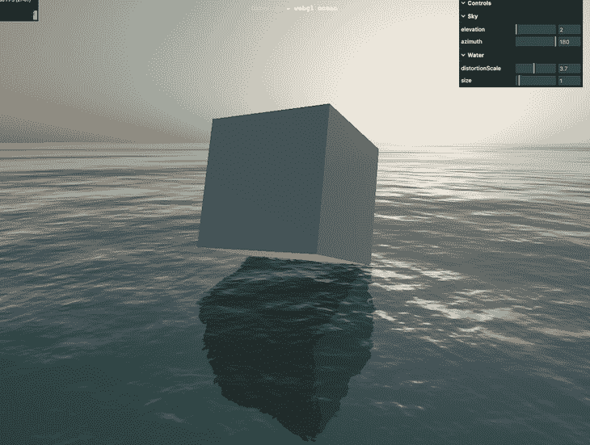
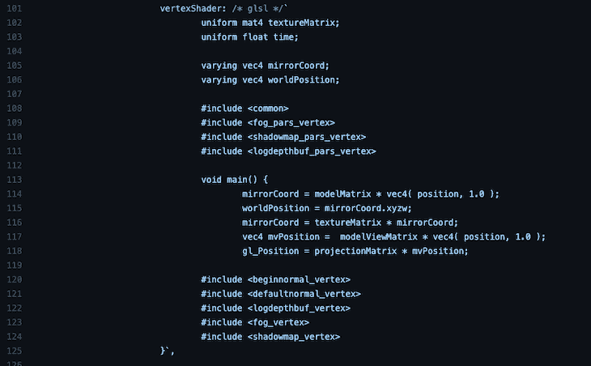
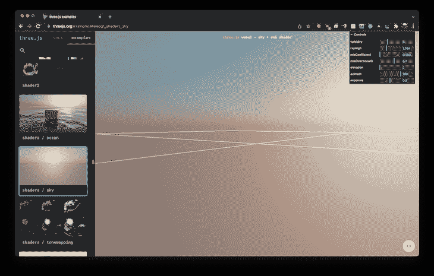
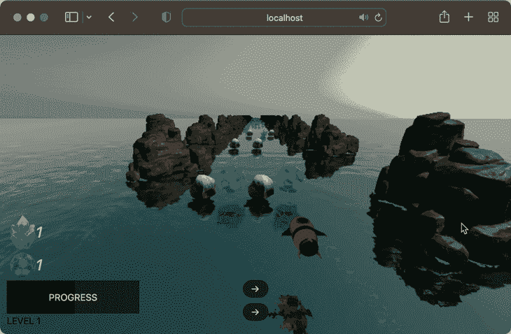
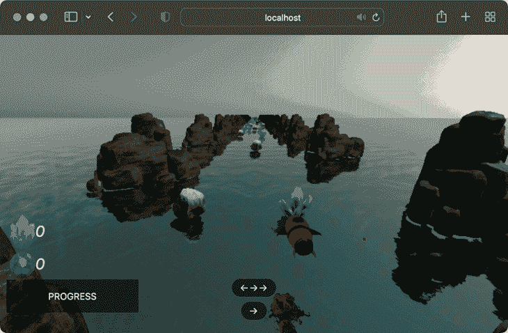
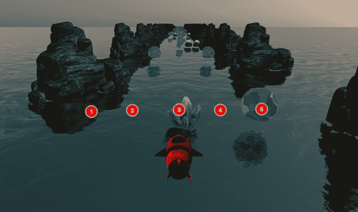
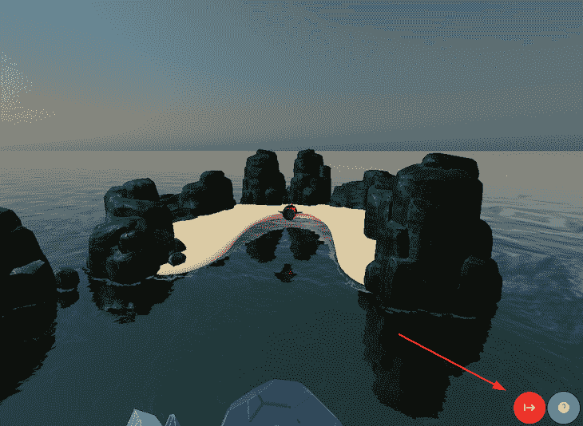
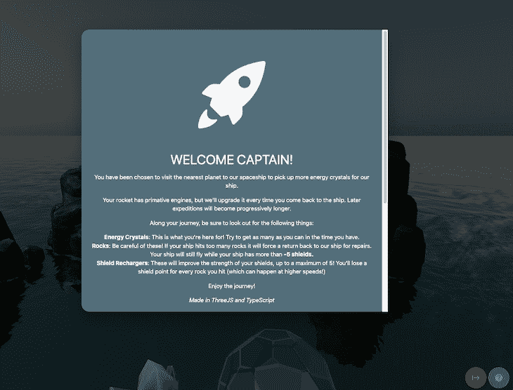
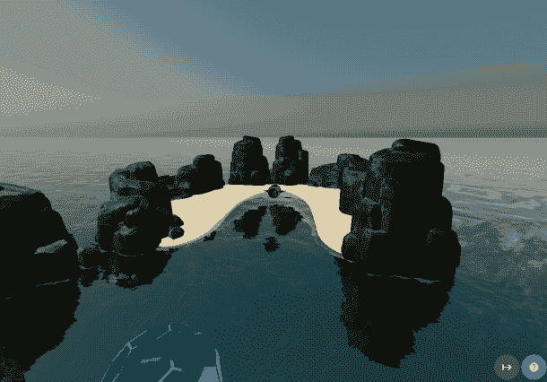

# 在 Three.js 中创建游戏

> 原文：<https://blog.logrocket.com/creating-game-three-js/>

就在不久前，创建和部署游戏的唯一方法是选择 Unity 或 Unreal 这样的游戏引擎，学习语言，然后打包您的游戏并部署到您选择的平台上。

试图通过浏览器向用户交付游戏的想法似乎是一项不可能完成的任务。

幸运的是，由于浏览器技术的进步和硬件加速在所有流行的浏览器中变得可用，JavaScript 性能的提高和可用处理能力的稳步增长，为浏览器创建交互式游戏体验变得越来越普遍。

在这篇文章中，我们将看看如何使用 Three.js 创建一个游戏。你可以跟随这里，也可以观看视频教程:

 [https://www.youtube.com/embed/2IWjCvTCeNE/?version=3&rel=1&showsearch=0&showinfo=1&iv_load_policy=1&fs=1&hl=en-US&autohide=2&wmode=transparent](https://www.youtube.com/embed/2IWjCvTCeNE/?version=3&rel=1&showsearch=0&showinfo=1&iv_load_policy=1&fs=1&hl=en-US&autohide=2&wmode=transparent)

视频

但首先我们来回顾一下 Three.js 是什么，为什么它是游戏开发的好选择。

## Three.js 是什么？

GitHub 上的“Three.js”项目描述恰当地将 Three.js 描述为“…一个易于使用、轻量级、跨浏览器、通用的 3D 库。”

作为开发人员，trial . js 让我们可以相对简单地在屏幕上绘制 3D 对象和模型。没有它，我们将需要直接与 WebGL 接口，这虽然不是不可能，但可能会让即使是最小的游戏开发项目也花费难以置信的时间。

传统上，一个“[游戏引擎](https://blog.logrocket.com/comparing-flutter-game-engines/)由多个部分组成。例如， [Unity 和 Unreal 提供了一种将物体渲染到屏幕上的方法](https://blog.logrocket.com/why-reinvent-the-wheel-these-5-mobile-game-engines-can-give-you-a-head-start/)，还提供了许多其他功能，比如网络、物理等等。

然而，Three.js 的方法更有限，不包括物理或网络之类的东西。但是，这种更简单的方法意味着它更容易学习，更适合做它最擅长的事情:将对象绘制到屏幕上。

它还有一组很棒的示例，我们可以用它们来理解如何在屏幕上绘制各种对象。最后，它提供了一种简单而自然的方式将我们的模型加载到我们的场景中。

如果你不希望你的用户需要通过应用商店下载应用或进行任何设置来玩你的游戏，那么 Three.js 作为游戏开发引擎可能是一个有吸引力的选择。如果你的游戏在浏览器中运行，那么你的进入门槛最低，这只能是一件好事。

## 使用 Three.js 创建我们的游戏

今天，我们将通过制作一个使用着色器、模型、动画和游戏逻辑的游戏来浏览 Three.js。我们将创建如下所示的内容:

 [https://www.youtube.com/embed/XGIThz9m3aQ?version=3&rel=1&showsearch=0&showinfo=1&iv_load_policy=1&fs=1&hl=en-US&autohide=2&wmode=transparent](https://www.youtube.com/embed/XGIThz9m3aQ?version=3&rel=1&showsearch=0&showinfo=1&iv_load_policy=1&fs=1&hl=en-US&autohide=2&wmode=transparent)

视频

概念很简单。我们控制着一艘火箭飞船，穿越一个星球，我们的目标是收集能量晶体。我们还需要管理我们的船的健康，拿起护盾，尽量不要因为撞到场景中的岩石而对我们的船造成太大的伤害。

在我们的运行结束时，火箭船返回到天空中的母舰，如果用户单击**下一级**，他们将获得另一次机会，这次火箭将通过更长的路径。

随着玩家玩游戏，火箭船的速度增加，因此他们必须更快地躲避岩石和收集能量晶体。

要创建这样的游戏，我们必须回答以下问题:

*   我们怎样才能让一艘火箭飞船在广阔的水面上永远向前移动呢？
*   我们如何检测火箭船和物体之间的碰撞？
*   我们如何创建一个在桌面和移动设备上都可以运行的 UI？

当我们创造出这个游戏时，我们已经克服了这些挑战。

在我们开始编码之前，我们必须回顾一些简单的理论，特别是关于我们如何在游戏中创造运动的感觉。

## 创造运动感

想象一下，你在现实生活中控制着一架直升机，你正在跟踪地面上的一个物体。物体继续以逐渐增加的速度运动。为了让你跟上，你必须逐渐增加你所在的直升机的速度。

如果直升机或地面上的物体的速度没有限制，只要你想跟上地面上的物体，这种情况就会持续下去。

当创建一个跟随一个物体的游戏时，就像我们在这个例子中所做的，应用同样的逻辑是很有诱惑力的。也就是说，当物体加速时，在世界空间中移动物体，并更新跟在后面的摄影机的速度。然而，这提出了一个直接的问题。

基本上每个玩这个游戏的人都会在手机或者台式电脑上玩。这些设备资源有限。如果我们试图在相机移动时生成无限数量的对象，然后移动相机，最终我们将用尽所有可用的资源，浏览器选项卡将变得无响应或崩溃。

我们还需要创建一个代表海洋的平面([一个平面 2D 物体](https://blog.logrocket.com/building-2d-game-flutter/))。当我们这样做时，我们必须给出海洋的尺寸。

然而，我们不能创造一个无限大小的平面，也不能创造一个巨大的平面，只是希望用户永远不会在我们的水平上前进足够远，以至于他们会离开这个平面。

这是糟糕的设计，希望人们玩我们的游戏玩得不够多而遇到错误似乎是违反直觉的。

### 有限范围内的无限运动

我们不是在一个方向上无限移动相机，而是保持相机静止，并移动它周围的环境。这有几个好处。

一个是我们总是知道我们的火箭船在哪里，因为火箭的位置不会移动到远处；它只会左右移动。这使我们很容易确定物体是否在摄像机后面，是否可以从场景中移除以释放资源。

另一个好处是我们可以选择远处的一个点来创建对象。这意味着当物体向玩家靠近时，新的物品或物体会在玩家视野之外的远处不断产生。

当它们从视野中消失时，无论是由于玩家与它们碰撞还是由于走到玩家后面，这些物品都会从场景中被处理掉以减少内存使用。

为了创造这个效果，我们需要做两件事:首先，我们需要沿着深度轴移动每一个物体来移动物体。第二，我们必须为我们的水面提供一个可以抵消的值，并随着时间的推移增加这个偏移量。

这将产生水面移动越来越快的效果。

既然我们已经解决了如何在场景中移动火箭，让我们继续设置我们的项目。

## 游戏项目配置

让我们开始做游戏吧！我们需要做的第一件事是设置我们的构建环境。对于这个例子，我选择使用 Typescript 和 Webpack。本文不是关于这些技术的好处，所以除了快速总结之外，我不会在这里详细介绍它们。

使用 Webpack 意味着当我们开发项目和保存文件时，Webpack 会看到我们的文件已经更改，并自动用我们保存的更改重新加载我们的浏览器。

这意味着您不需要在每次做出更改时手动刷新浏览器，从而节省了大量时间。这也意味着我们可以使用像 [three-minifier](https://github.com/yushijinhun/three-minifier) 这样的插件，当我们部署它时，它会减小我们的包的大小。

在我们的示例中使用 TypeScript 意味着我们的项目将具有类型安全。我发现这在处理 Three.js 的内部类型时特别有用，比如`Vector3` s 和`Quaternions`。知道我把正确类型的值赋给一个变量是非常有价值的。

我们还将使用[物化 CSS](https://blog.logrocket.com/bootstrap-materialize-tailwind-css-which-is-best/#materialize-css) 作为我们的 UI。对于我们将用作 UI 的几个按钮和卡片，这个 CSS 框架会有很大的帮助。

要开始我们的项目，请创建一个新文件夹。在文件夹内，创建一个`package.json`并将以下内容粘贴进去:

```
{
  "dependencies": {
    "materialize-css": "^1.0.0",
    "nipplejs": "^0.9.0",
    "three": "^0.135.0"
  },
  "devDependencies": {
    "@types/three": "^0.135.0",
    "@yushijinhun/three-minifier-webpack": "^0.3.0",
    "clean-webpack-plugin": "^4.0.0",
    "copy-webpack-plugin": "^9.1.0",
    "html-webpack-plugin": "^5.5.0",
    "raw-loader": "^4.0.2",
    "ts-loader": "^9.2.5",
    "typescript": "^4.5.4",
    "webpack": "^5.51.1",
    "webpack-cli": "^4.8.0",
    "webpack-dev-server": "^4.0.0",
    "webpack-glsl-loader": "git+https://github.com/grieve/webpack-glsl-loader.git",
    "webpack-merge": "^5.8.0"
  },
  "scripts": {
    "dev": "webpack serve --config ./webpack.dev.js",
    "build": "webpack --config ./webpack.production.js"
  }
}

```

然后，在命令窗口中，键入`npm i`将包安装到您的新项目中。

### 添加 Webpack 文件

我们现在需要创建三个文件，一个基本的 Webpack 配置文件，然后是我们项目的开发和生产配置。

在项目文件夹中创建一个`[webpack.common.js](https://github.com/flutterfromscratch/threejs-rocket-game/blob/master/webpack.common.js)`文件，并粘贴到以下配置中:

```
const HtmlWebpackPlugin = require("html-webpack-plugin");
const CopyPlugin = require("copy-webpack-plugin");

module.exports = {
    plugins: [
        // Automatically creat an index.html with the right bundle name and references to our javascript.
        new HtmlWebpackPlugin({
            template: 'html/index.html'
        }),
        // Copy game assets from our static directory, to the webpack output
        new CopyPlugin({
            patterns: [
                {from: 'static', to: 'static'}
            ]
        }),
    ],
    // Entrypoint for our game
    entry: './game.ts',
    module: {
        rules: [
            {
                // Load our GLSL shaders in as text
                test: /.(glsl|vs|fs|vert|frag)$/, exclude: /node_modules/, use: ['raw-loader']
            },
            {
                // Process our typescript and use ts-loader to transpile it to Javascript
                test: /.tsx?$/,
                use: 'ts-loader',
                exclude: /node_modules/,
            }

        ],
    },
    resolve: {
        extensions: ['.tsx', '.ts', '.js'],
    },

}

```

然后，创建一个`[webpack.dev.js](https://github.com/flutterfromscratch/threejs-rocket-game/blob/master/webpack.dev.js)`文件并粘贴这些细节。这将配置 Webpack 开发服务器的热重新加载功能:

```
const { merge } = require('webpack-merge')
const common = require('./webpack.common.js')
const path = require('path');
module.exports = merge(common, {
    mode: 'development', // Don't minify the source
    devtool: 'eval-source-map', // Source map for easier development
    devServer: {
        static: {
            directory: path.join(__dirname, './dist'), // Serve static files from here
        },
        hot: true, // Reload our page when the code changes
    },
})

```

最后，创建一个`[webpack.production.js](https://github.com/flutterfromscratch/threejs-rocket-game/blob/master/webpack.production.js)`文件并粘贴以下详细信息:

```
const { merge } = require('webpack-merge')
const common = require('./webpack.common.js')
const path = require('path');
const ThreeMinifierPlugin = require("@yushijinhun/three-minifier-webpack");
const {CleanWebpackPlugin} = require("clean-webpack-plugin");
const threeMinifier = new ThreeMinifierPlugin();

module.exports = merge(common, {
    plugins: [
        threeMinifier, // Minifies our three.js code
        new CleanWebpackPlugin() // Cleans our 'dist' folder between builds
    ],
    resolve: {
        plugins: [
            threeMinifier.resolver,
        ]
    },
    mode: 'production', // Minify our output
    output: {
        path: path.resolve(__dirname, 'dist'),
        filename: '[name].[fullhash:8].js', // Our output will have a unique hash, which will force our clients to download updates if they become available later
        sourceMapFilename: '[name].[fullhash:8].map',
        chunkFilename: '[id].[fullhash:8].js'
    },
    optimization: {
        splitChunks: {
            chunks: 'all', // Split our code into smaller chunks to assist caching for our clients
        },
    },
})

```

### 配置 TypeScript 环境

我们需要做的下一件事是配置我们的 TypeScript 环境，以允许我们使用来自 JavaScript 文件的导入。为此，创建一个`[tsconfig.json](https://github.com/flutterfromscratch/threejs-rocket-game/blob/master/tsconfig.json)`文件并粘贴以下详细信息:

```
{
    "compilerOptions": {
        "moduleResolution": "node",
        "strict": true,
        "allowJs": true,
        "checkJs": false,
        "target": "es2017",
      "module": "commonjs"

    },
    "include": ["**/*.ts"]
}

```

我们的构建环境现在已经配置好了。现在是时候开始为我们的玩家创建一个美丽可信的场景了。

## 设置游戏场景

我们的场景由以下元素组成:

1.  场景本身(这是我们添加的对象，组成游戏世界)
2.  天空
3.  水
4.  背景物体(位于用户游戏区域两侧的石头)
5.  火箭船
6.  包含水晶、岩石和盾牌物品的行(称为“挑战行”)

我们将在一个名为`game.ts`的文件中完成大部分工作，但是我们也将把游戏的各个部分分解到不同的文件中，这样我们就不会以一个非常长的文件而告终。我们现在可以继续创建`game.ts`文件了。

因为我们正在处理一个相当复杂的主题，所以我还将包含这些代码在 GitHub 项目中的链接。希望这能帮助你保持方向，不要迷失在一个更大的项目中。

### 创建`Scene`

我们需要做的第一件事是创建一个`Scene`，这样 Three.js 就有东西可以呈现了。在我们的`game.ts`、[中，我们将添加下面的行](https://github.com/flutterfromscratch/threejs-rocket-game/blob/master/game.ts#L59-L66)来构造我们的`Scene`，并在场景中放置一个`PerspectiveCamera`，这样我们就可以看到发生了什么。

最后，我们将为渲染器创建一个引用，稍后我们将分配该引用:

```
export const scene = new Scene()
export const camera = new PerspectiveCamera(
    75,
    window.innerWidth / window.innerHeight,
    0.1,
    2000
)

// Our three renderer
let renderer: WebGLRenderer;

```

### 创建初始化函数

为了设置我们的场景，我们需要执行一些任务，比如创建一个新的`WebGLRenderer`并设置我们想要绘制的画布的大小。

要做到这一点，让我们创建一个`init`函数并把它放在我们的`game.ts`中。这个`init`函数将为我们的场景进行初始设置，并且只运行一次(当游戏第一次加载时):

```
/// Can be viewed here
async function init() {
    renderer = new WebGLRenderer();
    renderer.setSize(window.innerWidth, window.innerHeight);
    document.body.appendChild(renderer.domElement);
}

```

我们还需要为我们的场景利用渲染和动画循环。我们需要动画循环在屏幕上移动我们需要的对象，我们需要渲染循环在屏幕上绘制新的帧。

让我们继续在我们的`game.ts`中创建`render`函数。开始时，这个函数看起来很简单，因为它只是请求一个动画帧，然后渲染场景。

我们请求动画帧有很多原因，但其中一个主要原因是，如果用户改变标签，我们的游戏将暂停，这将提高性能并减少设备上可能的资源浪费:

```
// Can be viewed here
const animate = () => {
    requestAnimationFrame(animate);
    renderer.render(scene, camera);
}

```

所以，现在我们有一个空的场景，里面有一个摄像机，但没有其他的。让我们给场景加点水。

### 为`Scene`创造水

幸运的是，Three.js 包含了一个我们可以在场景中使用的水对象的例子。它包括实时反射，看起来相当不错；你可以在这里查看。



对我们来说幸运的是，这水将完成我们在场景中想做的大部分事情。我们唯一需要做的是稍微改变一下水的着色器，这样我们就可以在渲染循环中更新它了。

我们这样做是因为如果我们随着时间的推移增加水纹理的偏移量，那么它会给我们速度的感觉。

为了演示，这是我们游戏的开场场景，但是我在每一帧增加偏移量。随着偏移量的增加，感觉我们下面的海洋速度在增加(即使火箭实际上是静止的)。


在 Three.js GitHub 上可以找到[水对象。我们需要做的唯一一件事就是做一个小小的改变，使这个偏移量可以从我们的渲染循环中控制(这样我们就可以随时更新它)。](https://github.com/mrdoob/three.js/blob/master/examples/jsm/objects/Water.js)

我们要做的第一件事是[在 Three.js 存储库中获取 Water.js 示例](https://github.com/mrdoob/three.js/blob/master/examples/jsm/objects/Water.js)的副本。我们将在`objects/water.js`把这个文件放在我们的项目中。如果我们打开`water.js`文件，大约到一半的时候，我们将开始看到类似这样的内容:



这些是我们的海洋材质的着色器。着色器本身超出了本文的范围，但基本上，它们是我们的游戏将向用户的计算机提供的关于如何绘制这个特定对象的指令。

我们在这里也有我们的着色器代码，它是用 OpenGraph 着色器语言(GLSL)编写的，合并到一个文件中，否则就是 JavaScript。

这没有什么错，但如果我们将这个着色器代码单独移动到一个文件中，那么我们可以将 GLSL 支持安装到我们选择的 IDE 中，我们将获得语法着色和验证等内容，这有助于我们定制我们的 GLSL。

为了将 GLSL 分成单独的文件，让我们在当前的`objects`目录中创建一个`shader`目录，选择我们的`vertexShader`和`fragmentShader`的内容，并将它们分别移动到`waterFragmentShader.glsl`和`waterVertexShader.glsl`文件中。

在我们的`[waterFragmentShader.glsl](https://github.com/flutterfromscratch/threejs-rocket-game/blob/master/objects/shaders/waterFragmentShader.glsl)`文件的顶部，我们有一个`getNoise`函数。默认情况下，它看起来像这样:

```
vec4 getNoise( vec2 uv ) {
  vec2 uv0 = ( uv / 103.0 ) + vec2(time / 17.0, time / 29.0);
  vec2 uv1 = uv / 107.0-vec2( time / -19.0, time / 31.0 );
  vec2 uv2 = uv / vec2( 8907.0, 9803.0 ) + vec2( time / 101.0, time / 97.0 );
  vec2 uv3 = uv / vec2( 1091.0, 1027.0 ) - vec2( time / 109.0, time / -113.0 );
  vec4 noise = texture2D( normalSampler, uv0 ) +
   texture2D( normalSampler, uv1 ) +
   texture2D( normalSampler, uv2 ) +
   texture2D( normalSampler, uv3 );
  return noise * 0.5 - 1.0;
}

```

为了使这个偏移量可以从我们的游戏代码中调整，我们想在我们的 GLSL 文件中添加一个参数，允许我们在执行过程中修改它。为此，我们必须用以下函数替换该函数:

```
// Can be viewed here

uniform float speed;

vec4 getNoise(vec2 uv) {
    float offset;
    if (speed == 0.0){
        offset = time / 10.0;
    }
    else {
        offset = speed;
    }
    vec2 uv3 = uv / vec2(50.0, 50.0) - vec2(speed / 1000.0, offset);
    vec2 uv0 = vec2(0, 0);
    vec2 uv1 = vec2(0, 0);
    vec2 uv2 = vec2(0, 0);
    vec4 noise = texture2D(normalSampler, uv0) +
    texture2D(normalSampler, uv1) +
    texture2D(normalSampler, uv2) +
    texture2D(normalSampler, uv3);
    return noise * 0.5 - 1.0;
}

```

您会注意到我们在这个 GLSL 文件中包含了一个新变量:`speed`变量。这是我们将更新的变量，以给出速度的感觉。

在我们的`game.ts`中，我们现在需要配置水的设置。在我们文件的顶部，添加以下变量:

```
// Can be viewed here

const waterGeometry = new PlaneGeometry(10000, 10000);

const water = new Water(
    waterGeometry,
    {
        textureWidth: 512,
        textureHeight: 512,
        waterNormals: new TextureLoader().load('static/normals/waternormals.jpeg', function (texture) {
            texture.wrapS = texture.wrapT = MirroredRepeatWrapping;
        }),
        sunDirection: new Vector3(),
        sunColor: 0xffffff,
        waterColor: 0x001e0f,
        distortionScale: 3.7,
        fog: scene.fog !== undefined
    }
);

```

然后，在我们的`init`函数中，我们必须配置水平面的旋转和位置，就像这样:

```
// Can be viewed here
// Water
water.rotation.x = -Math.PI / 2;
water.rotation.z = 0;
scene.add(water);

```

这将为海洋提供正确的旋转。

### 创造天空

Three.js 附带了一个相当有说服力的天空，我们可以在我们的项目中免费使用。你可以在 Three.js 示例页面看到一个这样的[示例。](https://threejs.org/examples/#webgl_shaders_sky)



给我们的项目添加一个天空是相当容易的；我们只需要将天空添加到场景中，设置天空盒的大小，然后设置一些参数来控制天空的外观。

在我们声明的`init`函数中，我们将天空添加到我们的场景中，并为天空配置视觉效果:

```
// Can be viewed here
const sky = new Sky();
sky.scale.setScalar(10000); // Specify the dimensions of the skybox
scene.add(sky); // Add the sky to our scene

// Set up variables to control the look of the sky
const skyUniforms = sky.material.uniforms;
skyUniforms['turbidity'].value = 10;
skyUniforms['rayleigh'].value = 2;
skyUniforms['mieCoefficient'].value = 0.005;
skyUniforms['mieDirectionalG'].value = 0.8;

const parameters = {
    elevation: 3,
    azimuth: 115
};

const pmremGenerator = new PMREMGenerator(renderer);

const phi = MathUtils.degToRad(90 - parameters.elevation);
const theta = MathUtils.degToRad(parameters.azimuth);

sun.setFromSphericalCoords(1, phi, theta);

sky.material.uniforms['sunPosition'].value.copy(sun);
(water.material as ShaderMaterial).uniforms['sunDirection'].value.copy(sun).normalize();
scene.environment = pmremGenerator.fromScene(sky as any).texture;

(water.material as ShaderMaterial).uniforms['speed'].value = 0.0;

```

### 最终`Scene`准备

我们在初始场景初始化时需要做的最后一件事是添加一些灯光，并添加我们的火箭模型和母舰模型:

```
// Can be viewed here
// Set the appropriate scale for our rocket
rocketModel.scale.set(0.3, 0.3, 0.3);
scene.add(rocketModel);
scene.add(mothershipModel);

// Set the scale and location for our mothership (above the player)
mothershipModel.position.y = 200;
mothershipModel.position.z = 100;
mothershipModel.scale.set(15,15,15);
sceneConfiguration.ready = true;

```

现在我们有我们的场景与一些好看的水和火箭。但是，我们缺乏任何可以让它成为一个游戏的东西。为了解决这个问题，我们需要构造一些基本参数来控制游戏，并允许玩家朝着某些目标前进。

在我们的`game.ts`文件的顶部，我们将添加下面的`sceneConfiguration`变量，它帮助我们跟踪场景中的物体:

```
// Can be viewed here
export const sceneConfiguration = {
    /// Whether the scene is ready (i.e.: All models have been loaded and can be used)
    ready: false,
    /// Whether the camera is moving from the beginning circular pattern to behind the ship
    cameraMovingToStartPosition: false,
    /// Whether the rocket is moving forward
    rocketMoving: false,
    // backgroundMoving: false,
    /// Collected game data
    data: {
        /// How many crystals the player has collected on this run
        crystalsCollected: 0,
        /// How many shields the player has collected on this run (can be as low as -5 if player hits rocks)
        shieldsCollected: 0,
    },
    /// The length of the current level, increases as levels go up
    courseLength: 500,
    /// How far the player is through the current level, initialises to zero.
    courseProgress: 0,
    /// Whether the level has finished
    levelOver: false,
    /// The current level, initialises to one.
    level: 1,
    /// Gives the completion amount of the course thus far, from 0.0 to 1.0.
    coursePercentComplete: () => (sceneConfiguration.courseProgress / sceneConfiguration.courseLength),
    /// Whether the start animation is playing (the circular camera movement while looking at the ship)
    cameraStartAnimationPlaying: false,
    /// How many 'background bits' are in the scene (the cliffs)
    backgroundBitCount: 0,
    /// How many 'challenge rows' are in the scene (the rows that have rocks, shields, or crystals in them).
    challengeRowCount: 0,
    /// The current speed of the ship
    speed: 0.0
}

```

现在，我们必须对玩家当前所处的关卡进行初始化。这个场景设置函数很重要，因为每次用户开始新的关卡时都会调用它。

因此，我们需要将火箭的位置设置回起点，并清理任何正在使用的旧资产。我在行内放了一些注释，这样你就可以看到每一行都在做什么:

```
// Can be viewed here
export const sceneSetup = (level: number) => {
    // Remove all references to old "challenge rows" and background bits
    sceneConfiguration.challengeRowCount = 0;
    sceneConfiguration.backgroundBitCount = 0;

    // Reset the camera position back to slightly infront of the ship, for the start-up animation
    camera.position.z = 50;
    camera.position.y = 12;
    camera.position.x = 15;
    camera.rotation.y = 2.5;

    // Add the starter bay to the scene (the sandy shore with the rocks around it)
    scene.add(starterBay);

    // Set the starter bay position to be close to the ship
    starterBay.position.copy(new Vector3(10, 0, 120));

    // Rotate the rocket model back to the correct orientation to play the level
    rocketModel.rotation.x = Math.PI;
    rocketModel.rotation.z = Math.PI;

    // Set the location of the rocket model to be within the starter bay
    rocketModel.position.z = 70;
    rocketModel.position.y = 10;
    rocketModel.position.x = 0;

    // Remove any existing challenge rows from the scene
    challengeRows.forEach(x => {
        scene.remove(x.rowParent);
    });

    // Remove any existing environment bits from the scene
    environmentBits.forEach(x => {
        scene.remove(x);
    })

    // Setting the length of these arrays to zero clears the array of any values
    environmentBits.length = 0;
    challengeRows.length = 0;

    // Render some challenge rows and background bits into the distance
    for (let i = 0; i < 60; i++) {
        // debugger;
        addChallengeRow(sceneConfiguration.challengeRowCount++);
        addBackgroundBit(sceneConfiguration.backgroundBitCount++);
    }

    //Set the variables back to their beginning state

    // Indicates that the animation where the camera flies from the current position isn't playing
    sceneConfiguration.cameraStartAnimationPlaying = false;
    // The level isn't over (we just started it)
    sceneConfiguration.levelOver = false;
    // The rocket isn't flying away back to the mothership
    rocketModel.userData.flyingAway = false;
    // Resets the current progress of the course to 0, as we haven't yet started the level we're on
    sceneConfiguration.courseProgress = 0;
    // Sets the length of the course based on our current level
    sceneConfiguration.courseLength = 1000 * level;

    // Reset how many things we've collected in this level to zero
    sceneConfiguration.data.shieldsCollected = 0;
    sceneConfiguration.data.crystalsCollected = 0;

    // Updates the UI to show how many things we've collected to zero.
    crystalUiElement.innerText = String(sceneConfiguration.data.crystalsCollected);
    shieldUiElement.innerText = String(sceneConfiguration.data.shieldsCollected);

    // Sets the current level ID in the UI
    document.getElementById('levelIndicator')!.innerText = `LEVEL ${sceneConfiguration.level}`;
    // Indicates that the scene setup has completed, and the scene is now ready
    sceneConfiguration.ready = true;
}

```

## 添加游戏逻辑

我们期望两种类型的设备来玩我们的游戏:台式电脑和手机。为此，我们需要提供两种类型的输入选项:

*   键盘(即键盘上的左右键)
*   触摸屏(通过在屏幕上显示操纵杆来左右操纵飞行器)

让我们现在配置这些。

### 键盘输入

在`game.ts`的顶部，我们将添加以下变量来跟踪键盘上的左键或右键是否被按下:

```
let leftPressed = false;
let rightPressed = false;

```

然后，在我们的`init`函数中，我们将注册`keydown`和`keyup`事件来分别调用`onKeyDown`和`onKeyUp`函数:

```
document.addEventListener('keydown', onKeyDown, false);
document.addEventListener('keyup', onKeyUp, false);

```

最后，对于键盘输入，我们将注册当这些键被按下时要做什么:

```
// Can be viewed here
function onKeyDown(event: KeyboardEvent) {
    console.log('keypress');
    let keyCode = event.which;
    if (keyCode == 37) { // Left arrow key
        leftPressed = true;
    } else if (keyCode == 39) { // Right arrow key
        rightPressed = true;
    }
}

function onKeyUp(event: KeyboardEvent) {
    let keyCode = event.which;
    if (keyCode == 37) { // Left arrow key
        leftPressed = false;
    } else if (keyCode == 39) { // Right arrow key
        rightPressed = false;
    }
}

```

### 触摸屏输入

我们的移动用户没有键盘来输入信息，因此，我们将使用 [nippleJS](https://www.npmjs.com/package/nipplejs) 在屏幕上创建一个操纵杆，并使用操纵杆的输出来影响屏幕上火箭的位置。

在我们的`init`函数中，我们将通过检查屏幕上是否有非零数量的触摸点来检查设备是否是触摸设备。如果是，我们将创建游戏杆，但是一旦玩家释放游戏杆的控制，我们也将把火箭的移动设置回零:

```
// Can be viewed here
if (isTouchDevice()) {
    // Get the area within the UI to use as our joystick
    let touchZone = document.getElementById('joystick-zone');

    if (touchZone != null) {
        // Create a Joystick Manager
        joystickManager = joystick.create({zone: document.getElementById('joystick-zone')!,})
        // Register what to do when the joystick moves
        joystickManager.on("move", (event, data) => {
            positionOffset = data.vector.x;
        })
        // When the joystick isn't being interacted with anymore, stop moving the rocket
        joystickManager.on('end', (event, data) => {
            positionOffset = 0.0;
        })
    }
}

```

在我们的`animate`函数中，我们记录了如果在那个时刻按下了左键或右键，或者操纵杆在使用中，该做什么。我们还将火箭的位置固定在可接受的左右位置，这样火箭就不会完全移出屏幕:

```
// Can be viewed here
// If the left arrow is pressed, move the rocket to the left
if (leftPressed) {
    rocketModel.position.x -= 0.5;
}
// If the right arrow is pressed, move the rocket to the right
if (rightPressed) {
    rocketModel.position.x += 0.5;
}
// If the joystick is in use, update the current location of the rocket accordingly
rocketModel.position.x += positionOffset;
// Clamp the final position of the rocket to an allowable region
rocketModel.position.x = clamp(rocketModel.position.x, -20, 25);

```

### 在我们的场景中移动物体

正如我们已经讨论过的，火箭船在我们的场景中保持静止，物体向它移动。这些物体移动的速度随着用户继续玩而逐渐增加，随着时间的推移增加了关卡的难度。

仍然在我们的动画循环中，我们想要逐步地将这些对象移向玩家。当对象离开玩家的视野时，我们希望将它们从场景中移除，这样我们就不会占用玩家计算机上不必要的资源。

在我们的渲染循环中，我们可以像这样设置这个功能:

```
// Can be viewed here
if (sceneConfiguration.rocketMoving) {
    // Detect if the rocket ship has collided with any of the objects within the scene
    detectCollisions();

    // Move the rocks towards the player
    for (let i = 0; i < environmentBits.length; i++) {
        let mesh = environmentBits[i];
        mesh.position.z += sceneConfiguration.speed;
    }

    // Move the challenge rows towards the player
    for (let i = 0; i < challengeRows.length; i++) {
        challengeRows[i].rowParent.position.z += sceneConfiguration.speed;
        // challengeRows[i].rowObjects.forEach(x => {
        //     x.position.z += speed;
        // })
    }

    // If the furtherest rock is less than a certain distance, create a new one on the horizon
    if ((!environmentBits.length || environmentBits[0].position.z > -1300) && !sceneConfiguration.levelOver) {
        addBackgroundBit(sceneConfiguration.backgroundBitCount++, true);
    }

    // If the furtherest challenge row is less than a certain distance, create a new one on the horizon
    if ((!challengeRows.length || challengeRows[0].rowParent.position.z > -1300) && !sceneConfiguration.levelOver) {
        addChallengeRow(sceneConfiguration.challengeRowCount++, true);
    }

    // If the starter bay hasn't already been removed from the scene, move it towards the player
    if (starterBay != null) {
        starterBay.position.z += sceneConfiguration.speed;
    }

    // If the starter bay is outside of the players' field of view, remove it from the scene
    if (starterBay.position.z > 200) {
        scene.remove(starterBay);
    }

```

我们可以看到，有几个函数是这个调用的一部分:

*   `detectCollisions`
*   `addBackgroundBit`
*   `addChallengeRow`

让我们探索一下这些函数在我们的游戏中实现了什么。

#### `detectCollisions`

碰撞检测是我们游戏的一个重要途径。没有它，我们就不知道我们的火箭飞船是否击中了任何目标，或者是否撞上了岩石，应该减速。这就是为什么我们想在游戏中使用碰撞检测。



通常，我们可以使用物理引擎来检测场景中对象之间的碰撞，但是 Three.js 没有包含物理引擎。

不过，这并不是说 Three.js 没有物理引擎。他们当然有，但是为了我们的需要，我们不需要添加一个物理引擎来检查我们的火箭是否撞击了另一个物体。

本质上，我们想回答这个问题，“我的火箭模型目前与屏幕上的任何其他模型相交吗？”我们还需要根据受到的打击做出特定的反应。

例如，如果我们的玩家一直把火箭撞向岩石，一旦受到一定程度的伤害，我们就需要结束这个关卡。

为了实现这一点，让我们创建一个函数来检查场景中火箭和物体的交集。根据玩家点击了什么，我们会做出相应的反应。

我们将把这段代码放在名为`collisionDetection.ts`的文件中的`game`目录下:

```
// Can be viewed here 

export const detectCollisions = () => {
    // If the level is over, don't detect collisions
    if (sceneConfiguration.levelOver) return;
    // Using the dimensions of our rocket, create a box that is the width and height of our model
    // This box doesn't appear in the world, it's merely a set of coordinates that describe the box
    // in world space.
    const rocketBox = new Box3().setFromObject(rocketModel);
    // For every challange row that we have on the screen...
    challengeRows.forEach(x => {
        // ...update the global position matrix of the row, and its children.
        x.rowParent.updateMatrixWorld();
        // Next, for each object within each challenge row...
        x.rowParent.children.forEach(y => {
            y.children.forEach(z => {
                // ...create a box that is the width and height of the object
                const box = new Box3().setFromObject(z);
                // Check if the box with the obstacle overlaps (or intersects with) our rocket
                if (box.intersectsBox(rocketBox)) {
                    // If it does, get the center position of that box
                    let destructionPosition = box.getCenter(z.position);
                    // Queue up the destruction animation to play (the boxes flying out from the rocket)
                    playDestructionAnimation(destructionPosition);
                    // Remove the object that has been hit from the parent
                    // This removes the object from the scene
                    y.remove(z);
                    // Now, we check what it was that we hit, whether it was a rock, shield, or crystal
                    if (y.userData.objectType !== undefined) {
                        let type = y.userData.objectType as ObjectType;
                        switch (type) {
                            // If it was a rock...
                            case ObjectType.ROCK:
                                // ...remove one shield from the players' score
                                sceneConfiguration.data.shieldsCollected--;
                                // Update the UI with the new count of shields
                                shieldUiElement.innerText = String(sceneConfiguration.data.shieldsCollected);
                                // If the player has less than 0 shields...
                                if (sceneConfiguration.data.shieldsCollected <= 0) {
                                    // ...add the 'danger' CSS class to make the text red (if it's not already there)
                                    if (!shieldUiElement.classList.contains('danger')) {
                                        shieldUiElement.classList.add('danger');
                                    }
                                } else { //Otherwise, if it's more than 0 shields, remove the danger CSS class
                                    // so the text goes back to being white
                                    shieldUiElement.classList.remove('danger');
                                }

                                // If the ship has sustained too much damage, and has less than -5 shields...
                                if (sceneConfiguration.data.shieldsCollected <= -5) {
                                    // ...end the scene
                                    endLevel(true);
                                }
                                break;
                            // If it's a crystal...
                            case ObjectType.CRYSTAL:
                                // Update the UI with the new count of crystals, and increment the count of
                                // currently collected crystals
                                crystalUiElement.innerText = String(++sceneConfiguration.data.crystalsCollected);
                                break;
                            // If it's a shield...
                            case ObjectType.SHIELD_ITEM:
                                // Update the UI with the new count of shields, and increment the count of
                                // currently collected shields
                                shieldUiElement.innerText = String(++sceneConfiguration.data.shieldsCollected);
                                break;
                        }
                    }
                }
            });
        })
    });
}

```

对于碰撞检测，我们需要做的另一件事是添加一个简短的动画，当用户与物体碰撞时播放。这个函数将获取碰撞发生的位置，并从这个原点生成一些盒子。

最终的结果将是这样的。



为了实现这一点，我们必须在发生碰撞的地方周围创建一个圆圈，并向外激活它们，使它们看起来像是从碰撞中爆炸出来的。为此，让我们在我们的`collisionDetection.ts`文件中添加这个功能:

```
// Can be viewed here
const playDestructionAnimation = (spawnPosition: Vector3) => {

    // Create six boxes
    for (let i = 0; i < 6; i++) {
        // Our destruction 'bits' will be black, but have some transparency to them
        let destructionBit = new Mesh(new BoxGeometry(1, 1, 1), new MeshBasicMaterial({
            color: 'black',
            transparent: true,
            opacity: 0.4
        }));

        // Each destruction bit object within the scene will have a 'lifetime' property associated to it
        // This property is incremented every time a frame is drawn to the screen
        // Within our animate loop, we check if this is more than 500, and if it is, we remove the object
        destructionBit.userData.lifetime = 0;
        // Set the spawn position of the box
        destructionBit.position.set(spawnPosition.x, spawnPosition.y, spawnPosition.z);
        // Create an animation mixer for the object
        destructionBit.userData.mixer = new AnimationMixer(destructionBit);

        // Spawn the objects in a circle around the rocket
        let degrees = i / 45;

        // Work out where on the circle we should spawn this specific destruction bit
        let spawnX = Math.cos(radToDeg(degrees)) * 15;
        let spawnY = Math.sin(radToDeg(degrees)) * 15;

        // Create a VectorKeyFrameTrack that will animate this box from its starting position to the final
        // 'outward' position (so it looks like the boxes are exploding from the ship)
        let track = new VectorKeyframeTrack('.position', [0, 0.3], [
            rocketModel.position.x, // x 1
            rocketModel.position.y, // y 1
            rocketModel.position.z, // z 1
            rocketModel.position.x + spawnX, // x 2
            rocketModel.position.y, // y 2
            rocketModel.position.z + spawnY, // z 2
        ]);

        // Create an animation clip with our VectorKeyFrameTrack
        const animationClip = new AnimationClip('animateIn', 10, [track]);
        const animationAction = destructionBit.userData.mixer.clipAction(animationClip);

        // Only play the animation once
        animationAction.setLoop(LoopOnce, 1);

        // When complete, leave the objects in their final position (don't reset them to the starting position)
        animationAction.clampWhenFinished = true;
        // Play the animation
        animationAction.play();
        // Associate a Clock to the destruction bit. We use this within the render loop so ThreeJS knows how far
        // to move this object for this frame
        destructionBit.userData.clock = new Clock();
        // Add the destruction bit to the scene
        scene.add(destructionBit);

        // Add the destruction bit to an array, to keep track of them
        destructionBits.push(destructionBit);
    }

```

这就是我们解决的碰撞检测问题，当物体被破坏时会有一个很好的动画。

#### `addBackgroundBit`

随着我们场景的进展，我们想在玩家的两边添加一些悬崖，这样看起来他们的移动被适当地限制在某个空间内。我们使用模操作符来程序化地将石头添加到用户的右边或左边:

```
// Can be viewed here
export const addBackgroundBit = (count: number, horizonSpawn: boolean = false) => {
    // If we're spawning on the horizon, always spawn at a position far away from the player
    // Otherwise, place the rocks at certain intervals into the distance-
    let zOffset = (horizonSpawn ? -1400 : -(60 * count));
    // Create a copy of our original rock model
    let thisRock = cliffsModel.clone();
    // Set the scale appropriately for the scene
    thisRock.scale.set(0.02, 0.02, 0.02);
    // If the row that we're adding is divisble by two, place the rock to the left of the user
    // otherwise, place it to the right of the user.
    thisRock.position.set(count % 2 == 0 ? 60 - Math.random() : -60 - Math.random(), 0, zOffset);
    // Rotate the rock to a better angle
    thisRock.rotation.set(MathUtils.degToRad(-90), 0, Math.random());
    // Finally, add the rock to the scene
    scene.add(thisRock);
    // Add the rock to the beginning of the environmentBits array to keep track of them (so we can clean up later)
    environmentBits.unshift(thisRock);// add to beginning of array
}

```

#### `addChallengeRow`

随着场景的进展，我们还想将我们的“挑战行”添加到场景中。这些是包含岩石、水晶或盾牌物品的物体。每一次这些新的行被创建，我们随机分配岩石，水晶和盾牌到每一行。



因此，在上面的例子中，单元格 1、2 和 4 没有添加任何东西，而单元格 3 和 5 分别添加了水晶和盾牌物品。

为此，我们将这些挑战行分成五个不同的单元。我们根据随机函数的输出在每个单元格中生成特定的项目，如下所示:

```
// Can be viewed here
export const addChallengeRow = (count: number, horizonSpawn: boolean = false) => {
    // Work out how far away this challenge row should be
    let zOffset = (horizonSpawn ? -1400 : -(count * 60));
    // Create a Group for the objects. This will be the parent for these objects.
    let rowGroup = new Group();
    rowGroup.position.z = zOffset;
    for (let i = 0; i < 5; i++) {
        // Calculate a random number between 1 and 10
        const random = Math.random() * 10;
        // If it's less than 2, create a crystal
        if (random < 2) {
            let crystal = addCrystal(i);
            rowGroup.add(crystal);
        }
        // If it's less than 4, spawn a rock
        else if (random < 4) {
            let rock = addRock(i);
            rowGroup.add(rock);
        }
       // but if it's more than 9, spawn a shield
        else if (random > 9) {
            let shield = addShield(i);
            rowGroup.add(shield);
        }
    }
    // Add the row to the challengeRows array to keep track of it, and so we can clean them up later
    challengeRows.unshift({rowParent: rowGroup, index: sceneConfiguration.challengeRowCount++});
    // Finally add the row to the scene
    scene.add(rowGroup);
}

```

岩石、水晶和盾牌的创造功能可以在任何一个链接中看到。

## 我们渲染循环的最后补充

我们需要在渲染循环中完成的最后一件事如下:

*   将收集到的物体碎片移向船只
*   如果用户完成了关卡，显示“飞走”动画和关卡摘要
*   如果火箭“飞走了”，调整相机来看火箭，这样用户就可以看到它飞向母舰

在 render 函数的末尾，我们可以添加以下代码来实现这一功能:

```
// Can be viewed here

// Call the function to relocate the current bits on the screen and move them towards the rocket
// so it looks like the rocket is collecting them
moveCollectedBits();
// If the rockets progress equals the length of the course...
if (sceneConfiguration.courseProgress >= sceneConfiguration.courseLength) {
    // ...check that we haven't already started the level-end process
    if (!rocketModel.userData.flyingAway) {
        // ...and end the level
        endLevel(false);
    }
}
// If the level end-scene is playing...
if (rocketModel.userData.flyingAway) {
    // Rotate the camera to look at the rocket on it's return journey to the mothership
    camera.lookAt(rocketModel.position);
}

```

这就是我们完成的渲染循环。

## 创建游戏用户界面

当人们加载我们的游戏时，他们会看到一些按钮，让他们能够开始玩游戏。



这些只是简单的 HTML 元素，我们根据游戏中发生的事情有计划地显示或隐藏它们。问题图标让玩家对游戏内容有所了解，并包括如何玩游戏的说明。它还包括(非常重要！)我们型号的许可证。



按下红色按钮开始游戏。请注意，当我们点击红色播放按钮时，摄像机移动并旋转到火箭后面，让玩家为场景开始做好准备。



在我们的场景`init`函数中，我们将事件注册到这个按钮的`onClick`处理程序中。要创建旋转和移动功能，我们需要执行以下操作:

1.  获取摄像机的当前位置和旋转角度
2.  获取我们希望摄像机所在位置的未来位置和旋转
3.  创建一个`KeyframeTrack`来管理两个游戏位置的移动和旋转
4.  将这些轨道分配给混音器，并开始播放它们

为此，我们将在`init`函数中添加以下代码，如下所示:

```
// Can be viewed here

startGameButton.onclick = (event) => {
    // Indicate that the animation from the camera starting position to the rocket location is running
    sceneConfiguration.cameraStartAnimationPlaying = true;
    // Remove the red text on the shield item, if it existed from the last level
    shieldUiElement.classList.remove('danger');
    // Show the heads up display (that shows crystals collected, etc)
    document.getElementById('headsUpDisplay')!.classList.remove('hidden');

    // Create an animation mixer on the rocket model
    camera.userData.mixer = new AnimationMixer(camera);
    // Create an animation from the cameras' current position to behind the rocket
    let track = new VectorKeyframeTrack('.position', [0, 2], [
        camera.position.x, // x 1
        camera.position.y, // y 1
        camera.position.z, // z 1
        0, // x 2
        30, // y 2
        100, // z 2
    ], InterpolateSmooth);

    // Create a Quaternion rotation for the "forwards" position on the camera
    let identityRotation = new Quaternion().setFromAxisAngle(new Vector3(-1, 0, 0), .3);

    // Create an animation clip that begins with the cameras' current rotation, and ends on the camera being
    // rotated towards the game space
    let rotationClip = new QuaternionKeyframeTrack('.quaternion', [0, 2], [
        camera.quaternion.x, camera.quaternion.y, camera.quaternion.z, camera.quaternion.w,
        identityRotation.x, identityRotation.y, identityRotation.z, identityRotation.w
    ]);

    // Associate both KeyFrameTracks to an AnimationClip, so they both play at the same time
    const animationClip = new AnimationClip('animateIn', 4, [track, rotationClip]);
    const animationAction = camera.userData.mixer.clipAction(animationClip);
    animationAction.setLoop(LoopOnce, 1);
    animationAction.clampWhenFinished = true;

    camera.userData.clock = new Clock();
    camera.userData.mixer.addEventListener('finished', function () {
        // Make sure the camera is facing in the right direction
        camera.lookAt(new Vector3(0, -500, -1400));
        // Indicate that the rocket has begun moving
        sceneConfiguration.rocketMoving = true;
    });

    // Play the animation
    camera.userData.mixer.clipAction(animationClip).play();
    // Remove the "start panel" (containing the play buttons) from view
    startPanel.classList.add('hidden');
}

```

我们还必须连接我们的逻辑，当我们的等级结束时做什么，[这样做的代码可以在这里看到](https://github.com/flutterfromscratch/threejs-rocket-game/blob/master/game.ts#L423-L490)。

## 结论

用 Three.js 创建一个游戏可以让你接触到数量惊人的潜在客户。由于人们可以在浏览器中玩游戏，而不需要下载或安装到他们的设备上，这成为一种非常吸引人的开发和分发游戏的方式。

正如我们所见，为广大用户创造引人入胜的有趣体验是非常可能的。所以，你唯一需要解决的是，你将在 Three.js 中创建什么？

## 您是否添加了新的 JS 库来提高性能或构建新特性？如果他们反其道而行之呢？

毫无疑问，前端变得越来越复杂。当您向应用程序添加新的 JavaScript 库和其他依赖项时，您将需要更多的可见性，以确保您的用户不会遇到未知的问题。

LogRocket 是一个前端应用程序监控解决方案，可以让您回放 JavaScript 错误，就像它们发生在您自己的浏览器中一样，这样您就可以更有效地对错误做出反应。

[](https://lp.logrocket.com/blg/javascript-signup)[https://logrocket.com/signup/](https://lp.logrocket.com/blg/javascript-signup)

[LogRocket](https://lp.logrocket.com/blg/javascript-signup) 可以与任何应用程序完美配合，不管是什么框架，并且有插件可以记录来自 Redux、Vuex 和@ngrx/store 的额外上下文。您可以汇总并报告问题发生时应用程序的状态，而不是猜测问题发生的原因。LogRocket 还可以监控应用的性能，报告客户端 CPU 负载、客户端内存使用等指标。

自信地构建— [开始免费监控](https://lp.logrocket.com/blg/javascript-signup)。