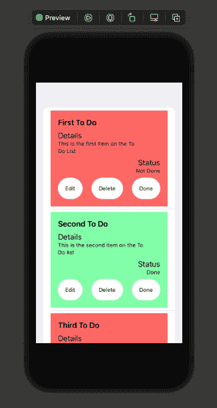
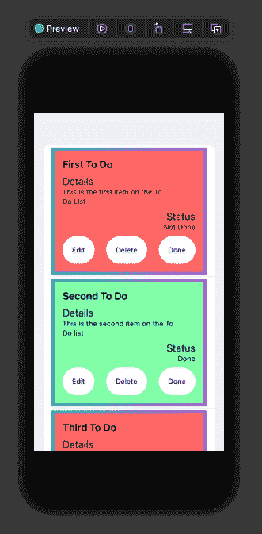
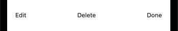
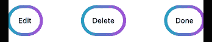
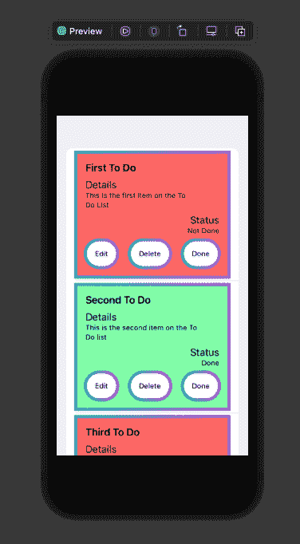

# 在 Swift 中创建渐变边框

> 原文：<https://blog.logrocket.com/creating-gradient-borders-swift/>

说到前端开发，UI 越清晰越好。对于移动开发的较小屏幕尺寸来说尤其如此。

边框允许我们在移动应用程序中突出显示信息和 CTA。然而，仅仅有一个边界是不够的。为了使边框更有吸引力，并与界面的其他部分更紧密结合，你可能会发现自己需要一些高级的边框样式。

在这篇文章中，我们将讨论如何为列表和按钮创建一个吸引人的渐变边框。

## 设置待办事项列表样本

因为这篇文章的重点是创建和应用渐变边框，所以我不会深入讨论如何实际创建我们将用作例子的待办事项列表。然而，我按照[这个教程](https://developer.apple.com/tutorials/app-dev-training/displaying-data-in-a-list)创建了一个列表和列表项供你参考。这篇博文的完整源代码可以在 [GitHub](https://github.com/macro6461/gradient-borders-swift-demo) 上找到。

在我们构建和应用任何渐变之前，下面是我们的待办事项列表:



如您所见，每个列表项都包含标题、细节、状态和按钮。具体来说，按钮执行与相应文本相关联的动作。我们将这些统称为行动。

背景颜色由待办事项列表项目的状态决定。如果项目不完整，列表显示为红色，如果项目完整，则显示为绿色。简单吧？

## 使用 Swift 对列表应用渐变边框

虽然背景色可以帮助我们区分不同的列表项，但是有点无聊。我个人不喜欢动作和列表项本身与背景的融合。

[一个边框不仅可以突出和区分 UI 元素](https://blog.logrocket.com/how-to-create-simple-gradient-borders-flutter/)，还可以提供更多的深度和个性。这就是我们的渐变边框可以派上用场的地方！

首先，让我们声明我们的渐变边界。我们可以将这些渐变存储在一个名为`MyGradients.swift`的文件中。

我们将构建`[overlays](https://developer.apple.com/documentation/swiftui/view/overlay(alignment:content:))`来覆盖我们的视图。[叠加可以让你在一个提供的`View`T5 上叠加一个辅助`View`。要使用它们，您可以简单地创建一个单独的`View`并将它附加到另一个上，就像这样:](https://blog.logrocket.com/complete-guide-implementing-overlays-flutter/)

```
SomeView().overlay(
SomeOtherView()
)

```

如果你想对覆盖图做更多的事情，而不仅仅是渲染第二个`View`本身，比如调整对齐，你可以这样写你的覆盖图:

```
SomeView().overlay(
    alignment: .topLeading
){
    SomeOtherView()
}

```

对于我们的具体情况，我们的渐变将作为覆盖图传递，不与用于待办事项列表项目和动作的`Views`对齐。

在我们的`MyGradients.swift`中，我们要做的第一件事是导入 [SwiftUI](https://developer.apple.com/documentation/swiftui/) 并为我们的边界创建一个渐变。你可以在下面看到这个:

```
import SwiftUI

var myGradient = Gradient(
    colors: [
        Color(.systemTeal),
        Color(.systemPurple)
    ]
)

```

这里，我们使用 SwiftUI 提供的`[Gradient class](https://developer.apple.com/documentation/swiftui/gradient)`。这个类接受一列`[Color](https://developer.apple.com/documentation/swiftui/color)`实例作为参数。您可以添加任意多的颜色，但我们现在只添加两种颜色。

接下来我们要创建的是我们的`CardGradient`。这将是我们用于待办事项列表项的渐变边框。

我们通过创建一个符合`View`协议的`struct`来做到这一点。在`body`中，我们将再次扩展`View`协议并使用`[Rectangle](https://developer.apple.com/documentation/swiftui/rectangle)`结构。我们将使用这个形状，因为我们的待办事项默认呈现它。

这一过程概述如下:

```
struct CardGradient: View{
    var body: some View {
        Rectangle()
            .stroke(
                LinearGradient(
                    gradient: myGradient,
                    startPoint: .leading,
                    endPoint: .trailing
                ),
                lineWidth: 5
            )
    }
}

```

您看到的附加到我们的`Rectangle`实例上的`stroke(...)`返回了一个新的形状，本质上充当了所提供的形状。在这种情况下，`Rectangle`是我们的待办事项列表项的扩展，带有描边路径(即边框)，其线宽由`lineWidth`值定义。我们将使用`[LinearGradient](https://developer.apple.com/documentation/swiftui/lineargradient)`在描边路径的内容中包含我们的渐变。

我想指出的是，我们使用的是`LinearGradient`而不是`[RadialGradient](https://developer.apple.com/documentation/swiftui/radialgradient)`,因为区别更明显。使用`RadialGradient`，渐变从中心向外辐射。这更适合较大的实心形状，而不是长而细的笔画路径。

`LinearGradient`需要三个参数:a `gradient`(应用于路径的颜色渐变)；一个`startPoint`；还有一个`endPoint`。我们将在`gradient`中提供`myGradient`。

对于`startPoint`，我们将使用`.leading`来表示开始应该是列表中的第一种颜色。`endPoint`就是`startPoint`的反义词。我们使用`.trailing`来表示渐变应该混合到列表中的最后一种颜色。

通过使用`.leading`和。`trailing`我们告诉线性渐变是水平的而不是垂直的。对于垂直渐变，你可以使用`.top`和`.bottom`。

现在，让我们看看我们的新渐变边界的行动！要做到这一点，我们需要去`CardView`。我们可以将渐变添加到我们的`View`的`VStack`上，如下所示。

```
var body: some View {
        VStack(alignment: .leading) {
            Text(todo.title)
                .font(.headline)
            Spacer();
            Text("Details");
            Text("\(todo.content)")
                .padding(.trailing, 20)
                .font(.caption);
            Spacer();
            Text("Status")
                .frame(minWidth: 0, maxWidth: .infinity, alignment: .trailing);
            Text(todo.isDone == true ? "Done" : "Not Done")
                .font(.caption)
                .frame(minWidth: 0, maxWidth: .infinity, alignment: .trailing);
            Spacer();
            ActionsView()
        }
        .frame(minWidth: 0, maxWidth: .infinity, minHeight: 0, maxHeight: .infinity, alignment: .topLeading)
        .padding()
        .background(todo.isDone == true
                    ? Color(red: 0.5804, green: 0.9961, blue: 0.6784)
                    : Color(red: 1, green: 0.4471, blue: 0.4353)
        )
        .overlay(
            CardGradient()
        )
    }

```

我们还在最后几行代码中实现了`.overlay()`到`CardGradient`来应用渐变。

现在，让我们看看它在 UI 中的样子。



完美！现在我们有一个很酷的渐变边框应用到我们的待办事项列表项。

## 使用 Swift 对按钮应用渐变边框

既然我们已经知道了如何为我们的列表项制作渐变边框，我们可以简单地对我们的按钮重新应用这个过程。让我们回到`MyGradients.swift`来创建我们的第二个渐变边界:`ButtonGradient`。

为了创建这个渐变，我们可以重用`CardGradient`中的很多代码。然而，我们需要考虑动作的形状。如果我们使用`Rectangle`，我们的覆盖图将会溢出按钮的边界，边界将会更加接近正方形。这些将与我们的动作按钮非常不一致。

为了解决这个问题，我们将使用`[Capsule](https://developer.apple.com/documentation/swiftui/capsule)`而不是`Rectangle`:

```
struct ButtonGradient: View{
    var body: some View {
        Capsule()
            .stroke(
                LinearGradient(
                    gradient: myGradient,
                    startPoint: .leading,
                    endPoint: .trailing
                ),
                lineWidth: 5
            )
    }
}

```

如您所见，除了我们的`View`的初始形状之外，代码基本相同。我们可以看到这是如何应用到我们的`Actions.swift`文件中的按钮的。

为了对每个`Button`应用定制样式，我们使用了一个名为`ButtonStyle`的属性。该属性接受一个符合`ButtonStyle`的`struct`，并包含影响我们的`Button`样式的各种属性。

```
struct MyButtonStyle: ButtonStyle {

    func makeBody(configuration: Configuration) -> some View {
        HStack {
          configuration.label.foregroundColor(.black)
        }
        .padding()
        .scaleEffect(configuration.isPressed ? 0.95 : 1)
        .background(Capsule().foregroundColor(Color.white))
    }
}

```

这是我们行动的初始样式。它可以应用于每个操作按钮，如下所示:

```
Button(action: edit) {
                Text("Edit")
                    .font(.caption)
            }
            .buttonStyle(MyButtonStyle())

```

现在，为了将我们的`ButtonGradient`应用到我们的动作按钮上，我们可以像对`CardView`那样加上`overlay`:

```
struct MyButtonStyle: ButtonStyle {

    func makeBody(configuration: Configuration) -> some View {
        HStack {
          configuration.label.foregroundColor(.black)
        }
        .padding()
        .scaleEffect(configuration.isPressed ? 0.95 : 1)
        .background(Capsule().foregroundColor(Color.white))
        .overlay(
           ButtonGradient()
        )
    }
}

```

让我们看看这个怎么样。以下是我们在应用叠加之前的操作:



下面是我们应用叠加后的操作:



现在，让我们一起来看看:



你有它！待办事项列表项和操作的渐变边框，两个渐变边框都符合各自的元素形状。太棒了。

## 结论

列表和按钮的渐变边框是区分用户界面特性和创建吸引人的界面的好方法。

如果你想更进一步，可以尝试更多的颜色，渐变类型和渐变方向！

如果你想参考它，这篇文章的所有代码都可以在 [GitHub](https://github.com/macro6461/gradient-borders-swift-demo) 上找到。

## 使用 [LogRocket](https://lp.logrocket.com/blg/signup) 消除传统错误报告的干扰

[](https://lp.logrocket.com/blg/signup)

[LogRocket](https://lp.logrocket.com/blg/signup) 是一个数字体验分析解决方案，它可以保护您免受数百个假阳性错误警报的影响，只针对几个真正重要的项目。LogRocket 会告诉您应用程序中实际影响用户的最具影响力的 bug 和 UX 问题。

然后，使用具有深层技术遥测的会话重放来确切地查看用户看到了什么以及是什么导致了问题，就像你在他们身后看一样。

LogRocket 自动聚合客户端错误、JS 异常、前端性能指标和用户交互。然后 LogRocket 使用机器学习来告诉你哪些问题正在影响大多数用户，并提供你需要修复它的上下文。

关注重要的 bug—[今天就试试 LogRocket】。](https://lp.logrocket.com/blg/signup-issue-free)