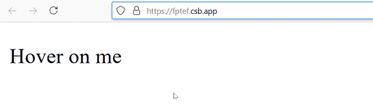

# 创建悬停事件与合成事件和反应悬停-日志火箭博客

> 原文：<https://blog.logrocket.com/creating-hover-events-synthetic-event-react-hover/>

## 介绍

您可以通过使用原生 CSS `:hover`选择器在 React 中实现基本的悬停事件，但是您可能会遇到两个限制:

1.  您不能通过 JavaScript 修改或更改实际的`:hover`选择器
2.  你不能用它来显示悬停时的其他组件

本文解释了在 React 中克服这些限制的两种替代方法。第一个将利用 React `SyntheticEvent`支持的两个事件处理程序，第二个使用一个名为 React Hover 的 npm 库。后者允许你在鼠标悬停时显示其他组件。

## React 中事件的快速概述

React 处理通常用普通 JavaScript 编写的事件，但有一些关键的区别:

*   事件处理程序使用 camel-case 约定命名。例如，`onclick`变成了`onClick`
*   您不能像在 JavaScript 中那样返回`false`来阻止默认行为；相反，您必须显式调用`preventDefault`
*   您的事件处理程序接收`SyntheticEvent`的实例

## 什么是`SyntheticEvent`？

是 React 的跨浏览器包装器，它包装了浏览器的原生事件，允许您的事件在所有浏览器上同样工作。

### 支持的事件

React 支持一系列的`SyntheticEvent`类型，但是对于本文，我们主要关注的是[鼠标事件](https://reactjs.org/docs/events.html#mouse-events)。

下一个代码块中列出了可用的鼠标事件。当您通读它们时，您会注意到没有允许您创建悬停事件的`onHover`。

```
onClick onContextMenu
onDoubleClick onDrag
onDragEnd onDragEnter
onDragExit onDragLeave
onDragOver onDragStart
onDrop onMouseDown
onMouseEnter onMouseLeave
onMouseMove onMouseOut
onMouseOver onMouseUp
```

这就是我们在这里要讨论的——幸运的是，有一个变通办法。

让我们在下一节看看这个。

## 如何使用`SyntheticEvent`创建悬停事件

在这一节中，我将演示如何使用 React 的`SyntheticEvent`支持的两个事件处理程序来创建悬停事件。他们是`onMouseEnter`和`onMouseLeave`。

在这个演示中，您将[创建一个工具提示](https://blog.logrocket.com/controlling-tooltips-pop-up-menus-using-compound-components-in-react)，这是一个 UI 元素，当用户将鼠标悬停在网页元素上时，它的内容就会显示出来。

### 创建反应工具提示

首先，如果您还没有 React 项目，那么您需要建立一个 React 项目。您可以在 CodeSandbox 上创建一个 React 项目，也可以使用 Create React App 设置一个本地项目。

对于本文，我将选择后者。

```
npm install create-react-app
```

安装完成后，请执行以下操作:

1.  删除`App.js`和`index.css`的内容
2.  在`src`文件夹中创建两个文件夹，命名为`css`和`component`
3.  在`css`文件夹中，创建名为`Tooltip.css`的新文件
4.  找到之前创建的`component`文件夹，创建一个名为`Tooltip.js`的新文件

现在，在`Tooltip.js`中，让我们写一些代码。我们将在本文的后面为`Tooltip.css`编写代码。

因为 React 允许您编写基于组件的代码，所以主要工具提示功能的代码实际上是一个组件。

下一个代码块从`React`导入`React`、`useState`，以及我们之前创建的`css`文件。当用户选择查看工具提示时，您将需要`useState`来管理应用程序的状态。

```
// src/components/Tooltip.js
​
import React, { useState } from 'react'
import '../css/Tooltip.css'
```

有了这些导入语句，您就可以开始编写实现工具提示核心功能的代码了。这个核心功能将驻留在一个名为`Tooltip`的组件中，它是一个返回数据的函数。

在本例中，它是一个箭头函数。

```
// src/components/Tooltip.js
import React, { useState } from 'react'
import '../css/Tooltip.css'
​
const Tooltip = (props) => {
   // All the code that will make the
   // tooltip work resides here
}
```

在`Tooltip`组件中，您将执行以下操作:

1.  设置一个计时器来确定工具提示显示和隐藏的时间间隔
2.  使用`useState`设置状态
3.  写一个函数来显示工具提示
4.  写一个函数来隐藏工具提示
5.  返回 JSX，其中包含一个单亲 HTML 元素及其子元素。这个父 HTML 元素会附加有`onMouseEnter`和`onMouseLeave`事件处理程序
6.  编写`onMouseEnter`的参数，它将是显示工具提示的函数
7.  编写`onMouseLeave`的参数，它将是隐藏工具提示的函数
8.  定义子元素；也就是说，工具提示内容将有一个类名和属性，它们将通过 CSS 进行样式化

所有这些步骤都包含在下一个代码块中。

```
// src/components/Tooltip.js
// Code truncated, check the previous
// code block.
const Tooltip = (props) => {
   // All the code that will make the
   // tooltip work resides here

   // Set up timer and state
   let TooltipTimeout;
   const [activeToolTip, setActiveToolTip] = useState(false);

   // Write a function to show the tooltip
   const showToolTip = () => {
       TooltipTimeout = setTimeout(() => {
           setActiveToolTip(true);
      }, props.delay || 300);
  };

   // Write a function to hide the tooltip
   const hideToolTip = () => {
       setActiveToolTip(false);
       clearInterval(TooltipTimeout);
  };

   // Return JSX which contains the HTML
   // data for the tooltip

   // Note the usage of the 2 supported event handlers
   // mentioned earlier in this article. They make
   // it is possible to create the hover event in React.
   return (
       <div
           className="Tooltip-Container"
           onMouseEnter={showToolTip}
           onMouseLeave={hideToolTip}
       >

          {props.children}
​
          {activeToolTip && (
               <div className={`Tooltip-Content ${props.direction} || "top"}`}>
                   {props.content}
               </div>
           )}

       </div>
   );
};
​
// Export the tooltip
export default Tooltip
```

工具提示现在可以使用了，但是在我们可以部署它之前，我们需要将它导入到`App.js`(或者任何其他您会发现它有用的组件)。

下一个代码块完成了这个任务:

```
// App.js
​
import React from "react"
import Tooltip from './components/Tooltip';
import './index.css';
​
const App = () => {
return (
  <div className="App">
    <div className="tooltip-wrapper">
      <Tooltip content="I am a tooltip" direction="top">
        Hover your mouse here
      </Tooltip>
    </div>
  </div>
)
}
​
export default App
```

现在我们可以开始造型了。

## 设计我们的反应工具提示

切换到`Tooltip.css`文件，并编写以下内容:

```
/* css/Tooltip.css */
​
/**
* The CSS class name starts with a
* capital letter to indicate it's a
* component.
*/
.Tooltip-Container {
   position: relative;
   display: inline-block;
}
​
.Tooltip-Content {
   position: absolute;
   left: 50%;
   padding: 8px;
   color: #ffffff;
   background: #1a1a1a;
   font-size: 0.85em;
   border-radius: 6px;
   transform: translateX(-50%);
   z-index: 1;
   white-space: nowrap;
}
​
.Tooltip-Content::before {
   left: 50%;
   position: absolute;
   content: " ";
   border: 6px solid transparent;
   margin-left: -6px;
}
​
.Tooltip-Content.top {
   top: -30px;
}
​
.Tooltip-Content.top::before {
   top: 100%;
   border-top-color: #1a1a1a;
}
​
/**
* The following styles are
* variations of the tooltip when you
* change the value if the "direction" attribute
* in the App component.
*/
.Tooltip-Content.right {
   top: 50%;
   left: calc(100% + 20px);
   transform: translateY(-50%);
}
​
.Tooltip-Content.right::before {
   top: 50%;
   left: -6px;
   transform: translateY(-50%);
   border-right-color: #1a1a1a;
}
​
.Tooltip-Content.bottom::before {
   bottom: 100%;
   border-bottom-color: #1a1a1a;
}
​
.Tooltip-Content.left {
   top: 50%;
   right: calc(100% + 30px);
   left: auto;
   transform: translateY(-50%);
}
​
.Tooltip-Content.left::before {
   top: 50%;
   right: -12px;
   left: auto;
   transform: translateY(-50%);
   border-left-color: #1a1a1a;
}
```

之后，切换到`index.css`，它应该仍然是空的，并写下以下内容:

```
/* index.css */
.App {
    font-family: "Trebuchet MS", Verdana, Geneva, Tahoma, sans-serif;
    padding-top: 16px;
    padding-right: 16px;
    padding-bottom: 120px;
    padding-left: 16px;
}
​
.tooltip-wrapper {
    padding: 16px 120px;
}
```

现在，当您将鼠标悬停在文本“将鼠标悬停在此处”上时，工具提示会出现。当您将鼠标从文本上移开时，工具提示会消失。

* * *

### 更多来自 LogRocket 的精彩文章:

* * *

太好了！尽管 React 缺少默认的`onHover`方法，但您不仅做到了这一点，而且还利用了 React 的`SyntheticEvent` ( `onMouseEnter`和`onMouseLeave`)支持的两个事件处理程序来创建它。

在下一节中，我将解释如何使用名为 React Hover 的 npm 库做类似的事情。

## 使用 React Hover 创建悬停事件

正如其官方 npm 页面所述，“React Hover 允许你将任何东西变成‘可悬浮’的物体。”这个“任何东西”都可以是普通的 HTML 或应用程序中的另一个组件。

在我们深入 React Hover 的语法及其工作原理之前，让我们安装它。

```
npm install --save react-hover
```

以上命令将 React Hover 安装在您当前的项目目录中。您可以通过检查您的`package.json`文件来验证其安装是否成功。

现在，关于语法。

### React 悬停语法

React Hover 为创建“可悬停”对象提供了以下选项:

*   `<ReactHover>`:你将把它包在两个东西上，它们是`<Trigger>`和`<Hover>`组件
*   `<Trigger>`:这是`<Trigger>`组件的包装器
*   `<Hover>`:这是`<Hover>`组件的包装器
*   `options`:这是`<ReactHover>`的一个属性，它的值是一个对象，当你把光标移到`<Trigger>`组件上时，这个对象决定了`<Hover>`组件的行为和位置。该对象接受以下三个属性:
    *   `followCursor`:接受一个布尔值，该值决定当您将光标移动到`<Trigger>`组件上时`<Hover>`组件是否会跟随光标
    *   `shiftX`:确定`<Hover>`组件沿 X 轴的位置，即左或右
    *   `shiftY`:这决定了`<Hover>`组件沿 Y 轴的位置，即顶部或底部
*   `type`:该属性将组件标识为触发器或悬停；因此，对于触发组件，它的值是`<Trigger>`，对于悬停组件，它的值是`<Hover>`

旁注:如果你更喜欢使用纯 HTML 而不是组件，那么分别在`<Trigger>`和`<Hover>`中直接编写 HTML 代码。

### 实现 React 悬停

好了，说够了——是时候写点代码了！

在您的组件文件夹中创建两个文件，即`TriggerComponent.js`和`HoverComponent.js`。切换到您的编辑器，在`TriggerComponent.js`中键入下一个代码块:

```
// components/TriggerComponent.js
​
import React from 'react'
​
const TriggerComponent = () => {
   return (
       <p>Hover on me</p>
  )
}
​
export default TriggerComponent
```

接下来，切换到`HoverComponent.js`并键入以下内容:

```
// components/HoverComponent.js
​
import React from 'react'
​
const HoverComponent = () => {
   return (
       <p>I am a hover component.</p>
  )
}

export default HoverComponent
```

设置好这些文件后，您可以在`App.js`或应用程序中的任何其他位置使用它们。请注意，在`App.js`中，您将编写传递给`options`属性的对象。如前所述，当光标移动到`<Trigger>`组件上时，该对象将决定被悬停组件的行为。

也就是说，在下一个代码块中，我们将继续使用`App.js`:

```
// App.js
​
import React from 'react'
import ReactHover, { Trigger, Hover } from 'react-hover'
import TriggerComponent from './components/TriggerComponent'
import HoverComponent from './components/HoverComponent'
​
// Set the option that determines the position
// and behavior of the hover component
const OptionsCursorTrueWithMargins = {
   followCursor: true,
   shiftX: 20,
   shiftY: 0
}
​
// The App function
const App = () => {
   return (
       <ReactHover options={OptionsCursorTrueWithMargins}>
           <Trigger type="trigger">
               <TriggerComponent />
           </Trigger>

           <Hover type="hover">
               <HoverComponent />
           </Hover>
       </ReactHover>
  )
};
​
export default App
```

保存您的文件，添加一些样式以满足您的需要，然后在您的 Web 浏览器中进行测试。你应该有类似下面 GIF 的东西。



## 结论

当您打算在 React 中创建悬停事件时，本文涵盖了两个可用的好选项。第一个选项利用了 React 的`SyntheticEvent`支持的两个事件处理程序，第二个选项包含了 [React Hover](https://www.npmjs.com/package/react-hovernpm) ，这是一个可以在 npm 注册表上获得的 JavaScript 库。

## [LogRocket](https://lp.logrocket.com/blg/react-signup-general) :全面了解您的生产 React 应用

调试 React 应用程序可能很困难，尤其是当用户遇到难以重现的问题时。如果您对监视和跟踪 Redux 状态、自动显示 JavaScript 错误以及跟踪缓慢的网络请求和组件加载时间感兴趣，

[try LogRocket](https://lp.logrocket.com/blg/react-signup-general)

.

[ ](https://lp.logrocket.com/blg/react-signup-general) [](https://lp.logrocket.com/blg/react-signup-general) 

LogRocket 结合了会话回放、产品分析和错误跟踪，使软件团队能够创建理想的 web 和移动产品体验。这对你来说意味着什么？

LogRocket 不是猜测错误发生的原因，也不是要求用户提供截图和日志转储，而是让您回放问题，就像它们发生在您自己的浏览器中一样，以快速了解哪里出错了。

不再有嘈杂的警报。智能错误跟踪允许您对问题进行分类，然后从中学习。获得有影响的用户问题的通知，而不是误报。警报越少，有用的信号越多。

LogRocket Redux 中间件包为您的用户会话增加了一层额外的可见性。LogRocket 记录 Redux 存储中的所有操作和状态。

现代化您调试 React 应用的方式— [开始免费监控](https://lp.logrocket.com/blg/react-signup-general)。