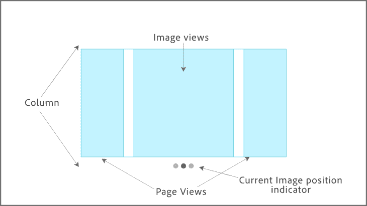
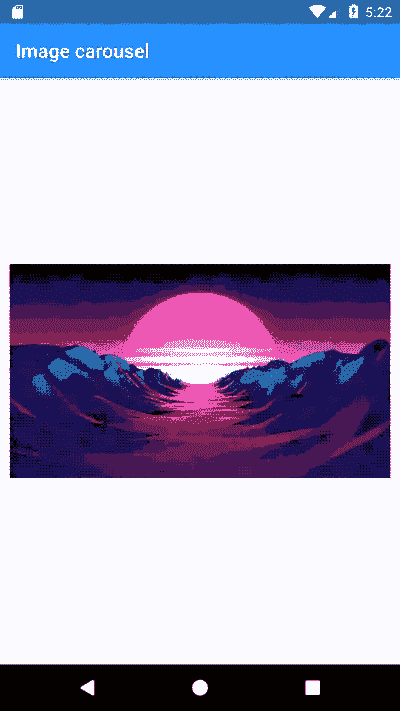
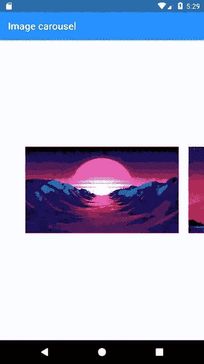

# 在 Flutter 中创建图片轮播

> 原文：<https://blog.logrocket.com/creating-image-carousel-flutter/>

从社交媒体应用程序到电子商务应用程序，大多数现代应用程序都有某种图像转盘来显示产品、图像或广告。

从头开始实现一个图像轮播并没有你想象的那么难，因为 flutter 提供了内置的小部件。

在本文中，您将学习如何从头开始创建一个图像轮播，并根据您的需要进行定制。最后，您将学习如何使用 **carousel_slider** 插件用更少的代码创建一个图像轮播。

这些是我们将要讨论的话题。

*   图像转盘的小部件结构
*   使用页面视图小部件创建一个旋转木马
*   控制初始页面
*   添加位置指示器
*   为滑动图像添加动画
*   如何使用 carousel_slider 插件

## 图像转盘的小部件结构

在我们进入编码部分之前，让我们了解一下我们需要的部件结构。



页面视图小部件需要在应用程序和图像视图中实现图像滑动功能，以显示实际图像。除此之外，您需要一个容器小部件来实现滑块底部的页面指示器。

## 使用页面视图小部件创建一个旋转木马

首先，让我们创建一个名为 Carousel 的有状态小部件。这是我们将要用来实现我们的旋转木马的小部件。

首先，让我们创建一个包含图像 URL 的列表:

```
List<String> images = [
    "https://encrypted-tbn0.gstatic.com/images?q=tbn:ANd9GcQTIZccfNPnqalhrWev-Xo7uBhkor57_rKbkw&usqp=CAU",
    "https://wallpaperaccess.com/full/2637581.jpg"
  ];
```

现在，您可以使用页面视图小部件构建器方法来创建一个旋转页面:

```
         PageView.builder(
            itemCount: 2,
            pageSnapping: true,
            itemBuilder: (context,pagePosition){
              return Container(
                margin: EdgeInsets.all(10),
                child: Image.network());
            })
```

`itemCount`代表页数，它将决定`itemBuilder`需要执行多少次。因此，您可以通过访问图像的索引来设置每个图像的 URL。

```
PageView.builder(
            itemCount: 2,
            pageSnapping: true,
            itemBuilder: (context,pagePosition){
            return Container(
              margin: EdgeInsets.all(10),
              child: Image.network(images[pagePosition]));
          })
```

现在你可以在屏幕上看到这些图像，你可以滑动这些图像。



如果您像这样显示图像，用户将不会知道是否有更多的图像。因此，在显示中间图像的同时显示左图像和右图像的片段将提高图像轮播的 UX。

首先，您应该创建`PageController`并将其设置为我们的页面视图小部件。此外，我添加了第三个图像，并更改了`itemCount`,以从图像数组本身的长度中获取计数。然后你可以在`PageController`中设置`viewportFraction`属性来显示其他图像的比例:

```
late PageController _pageController;
  List<String> images = [
    "https://images.wallpapersden.com/image/download/purple-sunrise-4k-vaporwave_bGplZmiUmZqaraWkpJRmbmdlrWZlbWU.jpg",
    "https://wallpaperaccess.com/full/2637581.jpg",
    "https://uhdwallpapers.org/uploads/converted/20/01/14/the-mandalorian-5k-1920x1080_477555-mm-90.jpg"
  ];

  @override
  void initState() {
    super.initState();
    _pageController = PageController(viewportFraction: 0.8);
  }

@override
  Widget build(BuildContext context) {
    return PageView.builder(
        itemCount: images.length,
        pageSnapping: true,
        controller: _pageController,
        onPageChanged: (page) {
          setState(() {
            activePage = page;
          });
        },
        itemBuilder: (context, pagePosition) {
          return Container(
            margin: EdgeInsets.all(10),
            child: Image.network(images[pagePosition]),
          );
        });
  }
```



尽管图像显示在页面视图的中间，但它实际上占据了整个屏幕空间。如果您将`fit`类型更改为`cover`，您可以看到它占据了整个屏幕。


为了控制这一点，您可以将小部件包装在`SizedBox`小部件中:

```
SizedBox(
        height: 200,
        width: MediaQuery.of(context).size.width,
        child:   PageView.builder(
                itemCount: images.length,
                pageSnapping: true,
                controller: _pageController,
                onPageChanged: (page) {
                  setState(() {
                    activePage = page;
                  });
                },
                itemBuilder: (context, pagePosition) {
                  return Container(
                    margin: EdgeInsets.all(10),
                    child: Image.network(images[pagePosition],fit: BoxFit.cover,),
                  );
                }),
      )
```


## 控制初始页面

carousel 在第一次加载时将第一个图像作为默认页面加载。但是如果您需要更改初始图像以从不同的页面开始，您可以在 PageController 中提供`initialPage` 属性。它接受索引作为位置:

```
_pageController = PageController(viewportFraction: 0.8,initialPage: 1);
```

## 添加位置指示器

首先，将`PageView`小部件和`SizedBox`一起移动到`Column`小部件的内部:

```
Column(
      children: [
        SizedBox(
          width: MediaQuery.of(context).size.width,
          height: 200,
          child: PageView.builder(
              itemCount: images.length,
              pageSnapping: true,
              controller: _pageController,
              onPageChanged: (page) {
                setState(() {
                  activePage = page;
                });
              },
              itemBuilder: (context, pagePosition) {
                return Container(
                  margin: EdgeInsets.all(10),
                  child: Image.network(images[pagePosition]),
                );
              }),
        ),
      ],
    )
```

然后，您可以创建一个方法来返回一个指示器列表，并且您应该根据当前的活动位置来更改指示器的颜色。因此，让我们创建一个接受`currentIndex`和`imagesLength`作为参数的方法。通过检查索引，您可以更改活动位置指示器的颜色，如下所示:

```
List<Widget> indicators(imagesLength,currentIndex) {
  return List<Widget>.generate(imagesLength, (index) {
    return Container(
      margin: EdgeInsets.all(3),
      width: 10,
      height: 10,
      decoration: BoxDecoration(
          color: currentIndex == index ? Colors.black : Colors.black26,
          shape: BoxShape.circle),
    );
  });
}
```

当用户滑动图像时，应该有一种方法来获得当前活动的位置。`onPageChanged`方法很好地解决了这个问题:

```
int activePage = 1;

  PageView.builder(
              itemCount: images.length,
              pageSnapping: true,
              controller: _pageController,
              onPageChanged: (page) {
                setState(() {
                  activePage = page;
                });
              })
```

现在您可以将`activePage`值传递给我们创建的方法。在`Column`小部件中创建一个 Row 小部件作为第二个子部件。然后，您可以将来自`indicators`方法的返回指示器作为子元素分配给一个`Row`小部件:

```
    Row(
         mainAxisAlignment: MainAxisAlignment.center,
         children: indicators(images.length,activePage))
```


## 为滑动图像添加动画

尽管我们的旋转木马工作得很好，但在图像之间滑动时有一个动画也很好。让我们看看当图像改变时如何添加动画。

有多种方法可以应用放大动画。但是这里我们将使用内置的 Flutter `AnimationContainer`小部件来创建这个动画，因为开箱即用，`AnimationContainer`提供了我们需要的所有功能。

在当前的滑块图像中，所有容器的大小都相同。通过更改图像的边距，您可以添加放大效果。

`AnimationContainer`包含类似于`duration`、`curve`、`margin`和`decoration`的属性，您可以使用它们来实现这个动画。

让我们创建一个单独的 slider 方法，作为参数，期望图像列表、当前页面位置以及当前图像是否是活动的。通过检查页面位置和当前活动页面位置，可在`itemBuilder`内检查该活动状态。

`curve`属性可用于指定动画曲线需要如何放置。请查看这篇 [Flutter 文章](https://api.flutter.dev/flutter/animation/Curves-class.html)，了解可用值及其行为:

```
itemBuilder: (context, pagePosition) {
      //checking active position
      bool active = pagePosition == activePage;
      return slider(images,pagePosition,active);
}
```

```
AnimatedContainer slider(images,pagePosition,active){
  double margin = active ? 10 : 20;
  return AnimatedContainer(
    duration: Duration(milliseconds: 500),
    curve: Curves.easeInOutCubic, 
    margin: EdgeInsets.all(margin),
    decoration: BoxDecoration(
      image: DecorationImage(image: NetworkImage(images[pagePosition]))
    ),
    );
}
```


## 如何使用 carousel_slider 插件

尽管从头开始实现一个 carousel 很容易，但是基于您的项目和时间表，添加不同的功能可能很难。因此，可以在您的项目中使用 carousel_slider 这样的插件来创建一个更简单的旋转木马。

首先，将插件添加到`pubspec.yaml`:

```
dependencies:
  carousel_slider: ^4.0.0
```

接下来，导入库，您将在哪里使用滑块:

```
import 'package:carousel_slider/carousel_slider.dart';
```

`CarouselSlider`类主要接受两个参数:`options`和`items`。对于选项，您可以配置滑块所需的行为。我已经提到了一些在`CarouselOptions`类中可用的属性。

| 财产 | 描述 |
| `height` | 设置滑块高度 |
| `enableInfiniteScroll` | 设置页面是否需要无限滚动。默认情况下，此选项是打开的，如果需要，您可以将其关闭 |
| `autoplay` | 滑块会自动改变图像。默认时间为 4 秒 |
| `autoPlayInterval` | 更改自动播放间隔，默认为 4 秒 |
| `onPageChanged` | 页面更改时的回调触发器。它包含两个参数:当前位置和原因。`reason`值可以是定时的、手动的或控制器的 |
| `enlargeCenterPage` | 放大中间页面，就像我们之前实现的那样 |

对于项目，您可以使用`map`方法创建一个图像列表:

```
SliderPlugin(images) {
  return CarouselSlider(
    options: CarouselOptions(
      height: 200.0,
      enlargeCenterPage: true,
      onPageChanged: (position,reason){
        print(reason);
        print(CarouselPageChangedReason.controller);
      },
      enableInfiniteScroll: false,
    ),
    items: images.map<Widget>((i) {
      return Builder(
        builder: (BuildContext context) {
          return Container(
              width: MediaQuery.of(context).size.width,
              decoration: BoxDecoration(
                  image: DecorationImage(image: NetworkImage(i))));
        },
      );
    }).toList(),
  );
}
```


# 结论

正如我们所讨论的，如果您有足够的时间并且需要更多的定制，您可以自己实现一个 carousel 小部件。但是如果你需要一个快速的解决方案，使用 carousel_slider 将会节省你的时间，因为它包含了所有必要的特性，这可能需要相当多的时间来从头实现。

尽管我们已经为这个例子实现了一个图像轮播，但是您也可以使用同样的技术在您的应用程序中实现入职体验。

你可以[在这里](https://gist.github.com/IshanFx/48d64b08c5d66eae4b42484c20fc9280)访问完整的代码。