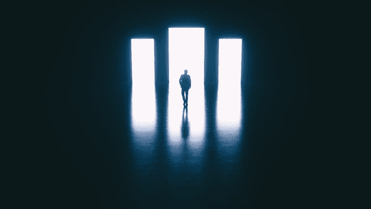
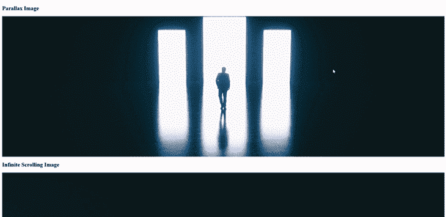

# 创建一个无限的 CSS 背景图片循环

> 原文：<https://blog.logrocket.com/creating-infinite-css-background-image-loop/>

在我们日常使用的应用程序和网站中，无限滚动图像有许多不同的用途。例如，我们经常在网站上看到移动的背景，就像下面的例子。

见 [CodePen](https://codepen.io) 上 kootoopas([@ kootoopas](https://codepen.io/kootoopas))
的笔 [纯 css 无限背景动画](https://codepen.io/kootoopas/pen/reyqg)。

在这篇文章中，我们将学习两种使用背景图片和一些基本的 HTML 标记和 CSS 创建无限滚动效果的方法，包括:

1.  使用动画来循环图像的水平无限滚动图像
2.  视差图像滚动效果，给人一种图像无限滚动的错觉

对于这两种方法，我们都需要一个图像作为背景。第一种效果理想地需要具有相似左右侧的图像；第二种效果的图像不需要任何特定的规格。

图像的两侧应该是彼此相同(或非常接近)的纯色。这允许循环在用户不知道的情况下进行，给人一种图像无限延续的印象。

如果你没有图像，也不想创建自定义图像，我强烈推荐使用[网站 Unsplash](https://unsplash.com/) 。Unsplash 提供高分辨率、免版税的图像，他们只要求你提供一个作者的信用。

这是我将在本教程中使用的图像。



Photo by [Adam Jícha on Unsplash](https://unsplash.com/@rothwellden?utm_source=unsplash&utm_medium=referral&utm_content=creditCopyText) for infinite scroll.

现在，图像源的步骤已经完成，让我们继续在 CSS 中创建效果。

## 方法 1:创建水平无限滚动图像

让我们来看看场景一。首先，我们需要一个容器来存放图像，它必须比图像本身大；这可以是两倍或更多，只要容器的宽度可以被图像的宽度整除，以产生无缝效果。

这个容器使我们能够用 CSS 重复图像，以创建我们想要的循环效果。

### HTML 标记和基本样式

让我们从为滚动图像创建基本 HTML 标记开始。如前所述，我们首先需要容器，然后是容器中的图像:

```
<div class="scrolling-image-container">
 <div class="scrolling-image"></div>
</div>

```

现在，滚动图像的基本标记已经完成，让我们添加我们需要的样式。

因为我们的图像必须超过页面的宽度才能循环，所以我们必须确保容器隐藏溢出，我们可以使用下面的代码轻松做到这一点:

```
.scrolling-image-container {
  overflow: hidden;
}

```

有了这个分类，我们可以把注意力转向实际的图像。为此，让我们使用 CSS 中的`background`属性添加图像。这也允许我们在定义图像时，通过使用带有`background`的`repeat-x`值轻松地重复图像。

接下来，我们必须定义图像 div 的宽度和高度。高度可以是任意的，你可以根据你所使用的图片任意设置。

然而，如前所述，宽度必须是图像宽度的倍数。因为我们来自 Unsplash 的图像的宽度为`3840px`，让我们将 div 设置为`7680px`的两倍:

```
.scrolling-image {
  background: url("./background-image.jpg") repeat-x;
  height: 750px;
  width: 7680px;
}

```

### 使图像无限滚动

现在我们有了隐藏溢出的容器，并且图像被设置为以给定的高度和宽度在容器内重复，我们可以创建在容器内移动重复图像的动画，以创建图像是无限的假象。

对于动画，[让我们使用标准的 CSS 动画](https://blog.logrocket.com/guide-to-css-animation-for-javascript-developers/)并将图像 div 从起点`0`转换到图像宽度的终点。所以，在这种情况下，动画的最终点必须是`-3840px`:

```
@keyframes slide {
  0% {
    transform: translate(0);
  }
  100% {
    transform: translate(-3840px); /* The image width */
  }
}

```

创建动画后，我们必须使用 CSS 的标准动画语法将动画添加到图像 div 中:

```
.scrolling-image {
  background: url("./background-image.jpg") repeat-x;
  height: 750px;
  width: 7680px;
  animation: slide 3s linear infinite;
}

```

我们还定义了动画必须持续 3 秒，具有线性计时功能，并无限重复。这使我们能够创造出这样的效果:图像永远水平滚动，几乎没有任何迹象表明这是一幅循环多次的图像。

这种方法的一个关键部分是给观众一个好的体验。我们这样做是通过确保图像的两边对齐，没有差异，所以观众不能发现循环。

## 方法 2:创建视差无限滚动效果

CSS 动画方法排序后，让我们看看另一种在 CSS 中为背景图像创建无限滚动效果的方法:视差效果。

视差图像是在容器内移动的图像。通常，它会随着用户在页面上的滚动而移动，并且永远不会到达图像的末尾，这很有帮助，因为它会产生图像是无限的这种错觉。

下面是一个代码笔，其中包含了一些视差图像的例子。

看笔 [背景视差](https://codepen.io/yitengjun/pen/yLzNQLE)由伊藤君([@伊藤君](https://codepen.io/yitengjun) )
在 [CodePen](https://codepen.io) 上。

虽然它在技术上不是无限的，因为该方法提供了同一幅图像的上下滚动，但用户没有办法到达图像的顶部或底部(假设我们设置正确)。这反过来又给人无限卷轴的错觉。

### 视差标记和 CSS

使用与第一种方法相同的图像，让我们创建一个视差图像容器，为用户提供所需的错觉。

* * *

### 更多来自 LogRocket 的精彩文章:

* * *

对于这种方法，我们不需要像前面的方法一样隐藏溢出的容器，因为我们不会溢出容器。相反，我们将图像包含在单个元素的范围内。

让我们首先在页面上定义一个带有类名的 div，稍后我们可以向它添加样式:

```
<div class="parallax-image"></div>

```

现在在 CSS 中，让我们像使用`background`属性之前一样添加我们的图像:

```
.parallax-image {
  background: url("./background-image.jpg");
}

```

此时，我们在页面上有了一个元素，其上设置了背景图像。但是，它没有显示在页面上。为此，我们必须定义元素的最小高度；接下来让我们添加:

```
.parallax-image {
  background: url("./background-image.jpg");
  min-height: 600px;
}

```

我们现在在页面上显示了图像，根据所使用的图像，可能会有图像溢出容器的问题，因为图像的宽度大于容器的宽度。现在让我们使用`background-size`来解决这个问题:

```
.parallax-image {
  background: url("./background-image.jpg");
  min-height: 600px;
  background-size: cover;
}

```

现在，图像应该被限制为页面上元素的宽度。

现在，为了让视差效果发挥出它的全部潜力，我们需要一个比我们在其中显示它的元素的高度更高的图像。

因此，在我的例子中，我使用的图像的高度是`2160px`，我在其中显示它的元素的高度是`600px`，所以我有足够的空间来使用。

如果你不是这种情况，那么你可以:

1.  降低显示元素的高度，以便在元素外部留出滚动空间
2.  使用更高分辨率的图像提供更高的高度

为了确保我们在顶部和底部使用相同的高度，[让我们通过使用`background-position`使我们的图像](https://blog.logrocket.com/bidirectional-css-centering-complete-guide/)居中。同时，我们也要使用`background-repeat`属性来确保图像不会重复:

```
.parallax-image {
  background: url("./background-image.jpg");
  min-height: 600px;
  background-position: center;
  background-repeat: no-repeat;
  background-size: cover;
}

```

在所有这些之后，我们的图像应该居中，没有重复，使用元素的整个宽度显示它。但是，我们仍然没有视差效果。现在让我们通过使用`background-attachment`属性来解决这个问题:

```
.parallax-image {
  background: url("./background-image.jpg");
  min-height: 600px;
  background-attachment: fixed;
  background-position: center;
  background-repeat: no-repeat;
  background-size: cover;
}

```

通过添加`background-attachment`属性，我们将背景固定为不相对于视口移动。换句话说，当我们滚动时，图像不会移动，从而产生我们想要的视差效果。

## 结论

这样，我们就有了两种使用 CSS 创建无限滚动背景图片[的方法。以下是我们今天创建的两种方法:](https://blog.logrocket.com/the-latest-features-of-css-in-2021/)



在这篇文章中，我们介绍了两种使用各种 CSS 属性在网站上产生无限滚动图像效果的方法。首先，是使用 CSS 动画来循环图像的方法，然后我们看一下使用各种`background`属性来创建视差效果。

创建无限滚动的图像没有对错之分；你使用的方法应该取决于你想要的效果。我希望这能对你有所帮助。如果你有，[请考虑在 Twitter 上关注我](https://twitter.com/MrConerMurphy)。

## 你的前端是否占用了用户的 CPU？

随着 web 前端变得越来越复杂，资源贪婪的特性对浏览器的要求越来越高。如果您对监控和跟踪生产环境中所有用户的客户端 CPU 使用、内存使用等感兴趣，

[try LogRocket](https://lp.logrocket.com/blg/css-signup)

.

[](https://lp.logrocket.com/blg/css-signup)[https://logrocket.com/signup/](https://lp.logrocket.com/blg/css-signup)

LogRocket 就像是网络和移动应用的 DVR，记录你的网络应用或网站上发生的一切。您可以汇总和报告关键的前端性能指标，重放用户会话和应用程序状态，记录网络请求，并自动显示所有错误，而不是猜测问题发生的原因。

现代化您调试 web 和移动应用的方式— [开始免费监控](https://lp.logrocket.com/blg/css-signup)。