# 在 Flutter 中创建列表视图

> 原文：<https://blog.logrocket.com/creating-listviews-in-flutter/>

在本教程中，我们将介绍在 Flutter 中创建和使用`ListView`的基础知识。

## 我们将学到什么:

*   如何使用 Flutter 创建应用程序
*   如何支撑一个新的颤振项目
*   如何在 Flutter 中创建和渲染`ListView`

## 什么是颤振？

Flutter 是 Google 推出的移动 UI 工具包和开源 SDK。它是用 Dart 编写的，Dart 是一种编程语言，也是由 Google 开发的。

Flutter 用于开发移动网络应用，如 iOS 和 Android 的原生应用或 Linux、macOS、Windows 和 ChromeOS 的桌面应用。它是一个完整的 SDK，这意味着它为开发人员提供了构建应用程序所需的一切:渲染引擎、UI 组件、测试框架、工具、路由器等等。

Flutter 的特别之处在于“一次编写，随处部署”的能力。它也很容易熟悉，不管你的背景是移动、桌面还是 web 开发。

颤振也有吨的控制和灵活性。比如一个用 Flutter 写的 Android app，可以编译成一个桌面或者 iOS 的 app；当你想为不同的设备构建你的应用时，你不必从头开始写一个新的项目。这种功能也有助于公司，因为一个项目可以在任何主要设备上编译，所以不需要在单个项目上有单独的团队(例如，web、iOS、Android)。

我喜欢使用 Flutter，我个人可以告诉你这个框架棒极了。只用几行代码就可以完成很多工作，路由系统、安全性、工具和测试都被框架抽象掉了，这使得我的工作非常容易。

## 什么是`ListView`？

`ListView`用于将数组中的几个项目分组，并在可滚动列表中显示。列表可以垂直、水平滚动，或者以网格形式显示:

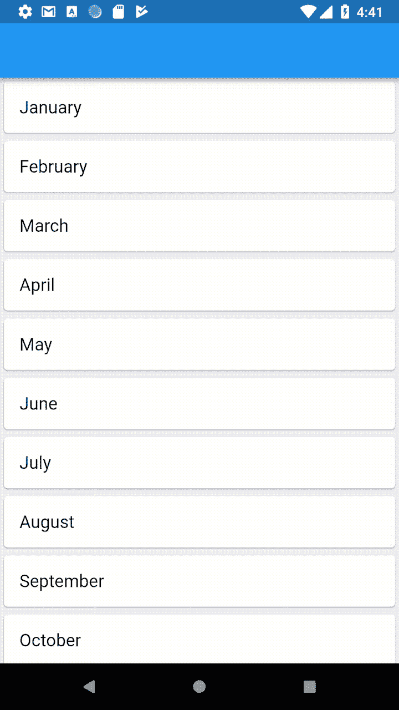

在 UI 框架中很常见，是世界上最流行的 UI 小部件之一。事实上，任何手机 app 或项目都必须以某种身份使用`ListView`。`ListView`在 Android、iOS、web 应用、Django 和其他框架中使用，它们执行相同的工作，但有时使用不同的名称。

最近变得非常老练。例如，Android 的`RecyclerView`从基本的`ListView`小工具扩展而来，具有更复杂、更强大的控制和功能。

`ListView`可以使用许多不同的技巧进行优化，并根据您项目的具体需求进行定制。我们将在下面的小节中介绍这些选项。

## 搭建一个颤动的项目

首先，我们需要搭建一个 Flutter 应用程序。这些是如何设置 flutter 并让它在 macOS 上工作的初始步骤。你可以在这里遵循 Flutter 的其他系统的安装指南。

第一步是为你想开发的平台安装 Android Studio 或者 Xcode。在本教程中，我将为 Android 开发。然后，按照以下步骤操作:

1.  [点击此链接下载安装包](https://storage.googleapis.com/flutter_infra/releases/stable/macos/flutter_macos_2.0.1-stable.zip)
2.  解压并放入所需文件夹:

    ```
    $ cd ~/desiredfolder $ unzip ~/Downloads/flutter*macos*2.0.2-stable.zip
    ```

3.  给你的道路添加颤动:

    ```
    $ export PATH="$PATH:DIR*TO*YOUR_FLUTTER/flutter/bin"
    ```

4.  在您的终端中运行`flutter doctor`

这个命令将下载 Flutter SDK 并运行诊断程序，以确定是否一切正常。运行结束时，您可能会得到以下结果:

```
[!] Android Studio (version 4.1)
    ✗ Flutter plugin not installed; this adds Flutter specific functionality.
    ✗ Dart plugin not installed; this adds Dart specific functionality.
[!] Connected device
    ! No devices available
! Doctor found issues in 4 categories.

```

如果您的 Android Studio 中没有 Flutter 和 Dart 插件，您需要做的就是:

1.  打开 Android Studio
2.  进入**安卓工作室** > **偏好…**
3.  点击**插件**
4.  在右侧窗格中，搜索**颤振**
5.  在结果中，选择**颤振**并安装
6.  还会有一个安装 Dart 插件的选项——确保您接受它

现在，我们需要运行 Android 虚拟管理器。为此，点击 Android Studio 右上角的 AVD 管理器图标。将出现一个带有默认 AVD 设备的对话框。在**动作**选项卡上，点击**运行**图标。

现在，回到你的终端，做一个颤振项目:

```
flutter create myapp

```

这将创建一个文件夹名为`myapp`的 Flutter 项目。我建议你用 VS 代码打开这个文件夹(只要你也安装了 Dart 和 Flutter 插件),这样在里面开发就变得更容易了。

运行 Flutter 项目:

```
flutter run

```

您将看到在 AVD 上运行的颤振:

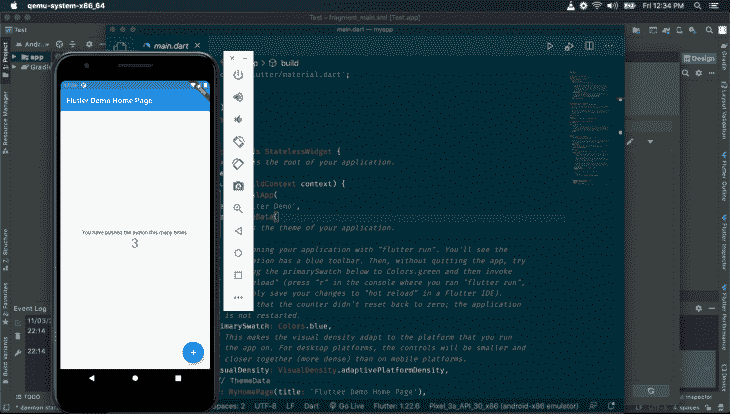

我们将处理`lib`文件夹中的`main.dart`文件:

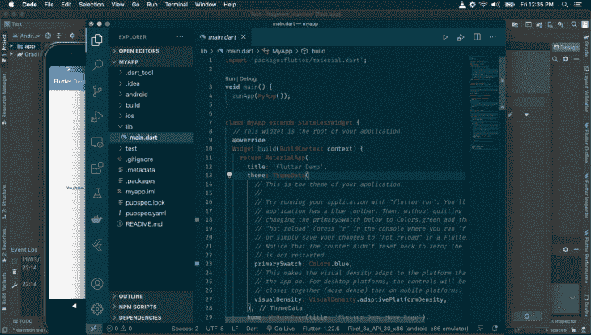

在我们的`main.dart`中，我们看到了这一点:

```
void main() {
  runApp(MyApp());
}
class MyApp extends StatelessWidget {
  // This widget is the root of your application.
  @override
  Widget build(BuildContext context) {
    return MaterialApp(
      title: 'Flutter Demo',
      theme: ThemeData(
        primarySwatch: Colors.blue,
        visualDensity: VisualDensity.adaptivePlatformDensity,
      ),
      home: MyHomePage(title: 'Flutter Demo Home Page'),
    );
  }
}

```

主要功能是我们 app 的入口。注意，它调用了传入`MyApp`实例的`runApp`，该实例是一个小部件。

查看`MyApp`，您可以看到它是一个无状态的小部件(意味着它没有本地状态)。Flutter 中的一切都是小部件，所有的小部件都必须扩展`StatelessWidget`或`StatefulWidget`，并且必须覆盖或实现`build`方法。`build`方法必须返回一个小部件，它将显示在屏幕上。

现在，在`runApp`调用中传递的任何小部件都成为根小部件。

这里，`MyApp`小部件返回一个`MaterialApp`小部件，它包装您的应用程序，将特定于材料设计的功能传递给应用程序中的所有小部件。`MaterialApp`有要传递的配置。`title`设置应用程序栏的标题，`theme`设置显示主题，`home`设置将在屏幕上呈现的小部件。

我们将删除`MyHomePage(...)`并用我们将要创建的`ListView`小部件替换它:

```
class ListViewHome extends StatelessWidget {
  @override
  Widget build(BuildContext context) {
    return ListView(
      padding: const EdgeInsets.all(8),
      children: <Widget>[
        Text('List 1'),
        Text('List 2'),
        Text('List 3'),
      ],
    );
  }
}

```

这里，我们有一个`ListViewHome`小部件。注意，在`build`方法中，我们返回了一个`ListView`小部件；这个小部件内置于 Flutter 中，它将连续呈现传递给它的数组数据。

看着`ListView`，看到我们用`padding`和`children`道具叫它。`padding`设置元素在其容器上的填充。`children`是一个数组，包含将由`ListView`呈现的小部件。

这里，我们正在渲染文本。我们创建了`Text`小部件来传递我们想要呈现给它们的文本。因此，ListView 将使用以下文本呈现三个`Text`小部件:“列表 1”、“列表 2”和“列表 3”。

现在，我们将从`MyApp`中删除`MyHomePage(title: 'Flutter Demo Home Page')`，并添加`ListViewHome()`:

```
void main() {
  runApp(MyApp());
}
class MyApp extends StatelessWidget {
  // This widget is the root of your application.
  @override
  Widget build(BuildContext context) {
    return MaterialApp(
      title: 'Flutter Demo',
      theme: ThemeData(
        primarySwatch: Colors.blue,
        visualDensity: VisualDensity.adaptivePlatformDensity,
      ),
      home: ListViewHome()
    );
  }
}

```

保存你的文件，Flutter 服务器将重新加载。前往您的 AVD 查看结果:

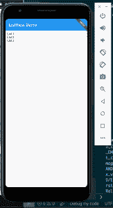

注意我们的文本列表是如何呈现的。但这不是很吸引人，让我们使它更时尚:

```
class ListViewHome extends StatelessWidget {
  @override
  Widget build(BuildContext context) {
    return ListView(
      padding: const EdgeInsets.all(8),
      children: <Widget>[
        ListTile( title: Text('List 1')),
        ListTile( title: Text('List 2')),
        ListTile( title: Text('List 3')),
      ],
    );
  }
}

```

这里，我们使用了来自 Flutter 的`ListTile`小部件。让我们看看结果:


`ListTile`小部件使渲染更加明显和填充。文字从自身分离出来，可读性更强，更时尚。`ListTile`对于制作类似设置菜单页面或不变的文本列表很有用。

我们还可以用`ListView`渲染图标、卡片、图像和定制的小部件。

## `ListView`中的图标

要在`ListView`中使用图标，我们可以通过替换`Text`小部件来使用`Icon`小部件:

```
class ListViewHome extends StatelessWidget {
  @override
  Widget build(BuildContext context) {
    return ListView(
      padding: const EdgeInsets.all(8),
      children: <Widget>[
        ListTile( title: Icon(Icons.battery_full)),
        ListTile( title: Icon(Icons.anchor)),
        ListTile( title: Icon(Icons.access_alarm)),
        ListTile(title: Icon(Icons.ballot))
      ],
    );
  }
}

```

`Icon`小部件渲染来自材质 UI 的图标。`Icons`类用于根据名称选择图标:

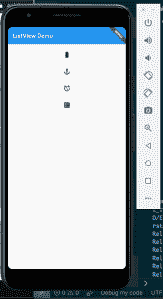

注意图标是如何在`ListView`上呈现的。让我们在图标旁边显示文本:

```
class ListViewHome extends StatelessWidget {
  @override
  Widget build(BuildContext context) {
    return ListView(
      padding: const EdgeInsets.all(8),
      children: <Widget>[
        ListTile( title: Text("Battery Full"), leading: Icon(Icons.battery_full)),
        ListTile( title: Text("Anchor"), leading: Icon(Icons.anchor)),
        ListTile( title: Text("Alarm"), leading: Icon(Icons.access_alarm)),
        ListTile( title: Text("Ballot"), leading: Icon(Icons.ballot))
      ],
    );
  }
}

```

我们使用`leading`道具使图标成为每个`ListTile`的开始:

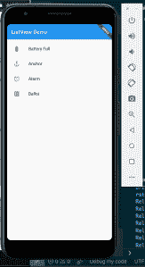

图标也可以添加到`ListTile`的右边:

```
class ListViewHome extends StatelessWidget {
  @override
  Widget build(BuildContext context) {
    return ListView(
      padding: const EdgeInsets.all(8),
      children: <Widget>[
        ListTile( title: Text("Battery Full"), leading: Icon(Icons.battery_full), trailing: Icon(Icons.star)),
        ListTile( title: Text("Anchor"), leading: Icon(Icons.anchor), trailing: Icon(Icons.star)),
        ListTile( title: Text("Alarm"), leading: Icon(Icons.access_alarm), trailing: Icon(Icons.star)),
        ListTile( title: Text("Ballot"), leading: Icon(Icons.ballot), trailing: Icon(Icons.star))
      ],
    );
  }
}

```

`trailing`道具用于将小部件设置在`ListTile`的最右边:


我们可以使用`subtitle`属性在`ListView`中添加一个字幕:

```
class ListViewHome extends StatelessWidget {
  @override
  Widget build(BuildContext context) {
    return ListView(
      padding: const EdgeInsets.all(8),
      children: <Widget>[
        ListTile( title: Text("Battery Full"),subtitle: Text("The battery is full."),leading: Icon(Icons.battery_full),trailing: Icon(Icons.star)),
        ListTile( title: Text("Anchor"),subtitle: Text("Lower the anchor."), leading: Icon(Icons.anchor), trailing: Icon(Icons.star)),
        ListTile( title: Text("Alarm"),subtitle: Text("This is the time."), leading: Icon(Icons.access_alarm), trailing: Icon(Icons.star)),
        ListTile( title: Text("Ballot"),subtitle: Text("Cast your vote."), leading: Icon(Icons.ballot), trailing: Icon(Icons.star))
      ],
    );
  }
}

```

副标题文本出现在标题文本下方，颜色较柔和:

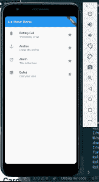

## `ListView`中的图像

在 Flutter 中，我们可以使用`AssetImage`和`NetworkImage`来渲染图像。

`ListView`通常用于在每个项目旁边显示头像。Flutter 有一个`CircleAvatar`小部件来显示用户的个人资料图像，或者当用户不在时显示姓名首字母。

让我们在`ListView`中的项目旁边添加一张图片:

```
class ListViewHome extends StatelessWidget {
  @override
  Widget build(BuildContext context) {
    return ListView(
      padding: const EdgeInsets.all(8),
      children: <Widget>[
        ListTile(
          title: Text("Battery Full"),
          subtitle: Text("The battery is full."),
          leading: CircleAvatar(backgroundImage: AssetImage("assets/js.png")),
          trailing: Icon(Icons.star)),
        ListTile( title: Text("Anchor"),subtitle: Text("Lower the anchor."), leading: CircleAvatar(backgroundImage: AssetImage("assets/react.png")), trailing: Icon(Icons.star)),
        ListTile( title: Text("Alarm"),subtitle: Text("This is the time."), leading:  CircleAvatar(backgroundImage: AssetImage("assets/js.png")), trailing: Icon(Icons.star)),
        ListTile( title: Text("Ballot"),subtitle: Text("Cast your vote."), leading:  CircleAvatar(backgroundImage: AssetImage("assets/react.png")), trailing: Icon(Icons.star))
      ],
    );
  }
}

```

在`leading`道具中，我们添加了`CircleAvatar`小部件，因此`ListView`从图像开始。`CircleAvatar`中的`backgroundImage`道具设置小工具的背景图片。

我们使用`AssetImage`小部件从本地资产文件夹中加载图像。但是在我们从本地目录加载图像之前，我们需要向`pubspec.yaml`文件添加一些部分:

```
assets:
  - assets/

```

现在，保存您的文件，AVD 将在列表中呈现图像，如下所示:

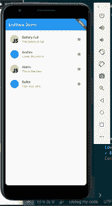

这是`ListView`以圆形形式呈现的图像:

```
CircleAvatar(
    backgroundImage: AssetImage("assets/react.png"),child: Text('BA'),
)

```

图像未加载时，显示`child`属性值“BA”。[你可以在这里了解更多关于`CircleAvatar`的信息。](https://api.flutter.dev/flutter/material/CircleAvatar-class.html)

我们可以使用`NetworkImage`小部件而不是`AssetImage`从互联网而不是本地目录加载我们的图像:

```
class ListViewHome extends StatelessWidget {
  @override
  Widget build(BuildContext context) {
    return ListView(
      padding: const EdgeInsets.all(8),
      children: <Widget>[
        ListTile(
          title: Text("Battery Full"),
          subtitle: Text("The battery is full."),
          leading: CircleAvatar(backgroundImage: NetworkImage("https://images.unsplash.com/photo-1547721064-da6cfb341d50")),
          trailing: Icon(Icons.star)),
        ListTile( title: Text("Anchor"),subtitle: Text("Lower the anchor."), leading: CircleAvatar(backgroundImage: NetworkImage("https://miro.medium.com/fit/c/64/64/1*WSdkXxKtD8m54-1xp75cqQ.jpeg")), trailing: Icon(Icons.star)),
        ListTile( title: Text("Alarm"),subtitle: Text("This is the time."), leading:  CircleAvatar(backgroundImage: NetworkImage("https://miro.medium.com/fit/c/64/64/1*WSdkXxKtD8m54-1xp75cqQ.jpeg")), trailing: Icon(Icons.star)),
        ListTile( title: Text("Ballot"),subtitle: Text("Cast your vote."), leading:  CircleAvatar(backgroundImage: NetworkImage("https://miro.medium.com/fit/c/64/64/1*WSdkXxKtD8m54-1xp75cqQ.jpeg")), trailing: Icon(Icons.star))
      ],
    );
  }
}

```

请注意我们是如何用`NetworkImage`替换`AssetImage`的。`NetworkImage`在其构造函数中获取图像的 URL，这使得`NetworkImage`小部件从互联网上获取图像并呈现它。

为了让 HTTP 请求工作，我们需要将权限`<uses-permission android:name="android.permission.INTERNET" />`添加到我们的`AndroidManifest.xml`文件中:

```
<manifest xmlns:android="http://schemas.android.com/apk/res/android"
    package="com.example.myapp">
<uses-permission android:name="android.permission.INTERNET" />
    <application ...>
    ...
    </application>
</manifest>

```

重新加载 AVD，停止颤动，然后再次启动。

我们将看到图像被获取和渲染:


## `ListView`中的卡片

卡片用于以简洁和专业的方式在列表旁边显示信息。你可以在这里了解更多关于卡片的知识。

为了在 Flutter 中使用 Card，我们将使用`Card`小部件。

`Card`小部件有一个`child`属性，它展示了一个子小部件，如下所示:

```
Card(child: Text("A card."))

```

`Card`小部件呈现一个带有文本“一张卡片”的`Text`小部件

让我们将它应用到`ListView`中，这样我们就可以在其中渲染`Cards`:

```
class ListViewHome extends StatelessWidget {
  @override
  Widget build(BuildContext context) {
    return ListView(
      padding: const EdgeInsets.all(8),
      children: <Widget>[
        Card(child:ListTile(
          title: Text("Battery Full"),
          subtitle: Text("The battery is full."),
          leading: CircleAvatar(backgroundImage: NetworkImage("https://images.unsplash.com/photo-1547721064-da6cfb341d50")),
          trailing: Icon(Icons.star))),
        Card(child:ListTile( title: Text("Anchor"),subtitle: Text("Lower the anchor."), leading: CircleAvatar(backgroundImage: NetworkImage("https://miro.medium.com/fit/c/64/64/1*WSdkXxKtD8m54-1xp75cqQ.jpeg")), trailing: Icon(Icons.star))),
        Card(child:ListTile( title: Text("Alarm"),subtitle: Text("This is the time."), leading:  CircleAvatar(backgroundImage: NetworkImage("https://miro.medium.com/fit/c/64/64/1*WSdkXxKtD8m54-1xp75cqQ.jpeg")), trailing: Icon(Icons.star))),
        Card(child:ListTile( title: Text("Ballot"),subtitle: Text("Cast your vote."), leading:  CircleAvatar(backgroundImage: NetworkImage("https://miro.medium.com/fit/c/64/64/1*WSdkXxKtD8m54-1xp75cqQ.jpeg")), trailing: Icon(Icons.star)))
      ],
    );
  }
}

```

我将`ListTile`小部件放在了`Card`小部件中。它将呈现以下内容:

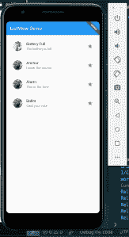

我们可以使用`ListView` builder 方法，通过一种更具可读性和可维护性的方法来实现上述目标:

```
class ListViewHome extends StatelessWidget {
  final titles = ["List 1", "List 2", "List 3"];
  final subtitles = [
    "Here is list 1 subtitle",
    "Here is list 2 subtitle",
    "Here is list 3 subtitle"
  ];
  final icons = [Icons.ac_unit, Icons.access_alarm, Icons.access_time];
  @override
  Widget build(BuildContext context) {
    return ListView.builder(
        itemCount: titles.length,
        itemBuilder: (context, index) {
          return Card(
              child: ListTile(
                  title: Text(titles[index]),
                  subtitle: Text(subtitles[index]),
                  leading: CircleAvatar(
                      backgroundImage: NetworkImage(
                          "https://images.unsplash.com/photo-1547721064-da6cfb341d50")),
                  trailing: Icon(icons[index])));
        });
  }
}

```

`ListView`使用构建器方法构建列表。我在`itemBuilder`道具中设置了每个列表的模板，在`itemCount`道具中设置了列表的编号。

`itemBuilder`函数返回模板。注意它如何返回一个带有`ListTile`的`Card`小部件，与上面的例子相同。请注意，标题、副标题和图标内容是分别从标题、副标题、图标和数组中选取的:


使用`itemBuilder`更好，因为它使`ListView`的创建非常灵活和动态。

## 添加行分隔符

我们可以使用`ListView.separated()`方法在列表项之间加一条线:

```
class ListViewHome extends StatelessWidget {
  final titles = ["List 1", "List 2", "List 3"];
  final subtitles = [
    "Here is list 1 subtitle",
    "Here is list 2 subtitle",
    "Here is list 3 subtitle"
  ];
  final icons = [Icons.ac_unit, Icons.access_alarm, Icons.access_time];
  @override
  Widget build(BuildContext context) {
    return ListView.separated(
      separatorBuilder: (BuildContext context, int index) => const Divider(),
        itemCount: titles.length,
        itemBuilder: (context, index) {
          return Card(
              child: ListTile(
                  title: Text(titles[index]),
                  subtitle: Text(subtitles[index]),
                  leading: CircleAvatar(
                      backgroundImage: NetworkImage(
                          "https://images.unsplash.com/photo-1547721064-da6cfb341d50")),
                  trailing: Icon(icons[index])));
        });
  }
}

```

我们之前的例子和这个例子的唯一区别是`separated()`方法和`separatorBuilder`属性。

结果会是这样的:

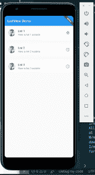

## 造型`ListView`

允许我们根据自己的喜好设计和定制列表项目。

为此，我们将丢弃`ListTile`。有许多小部件可以用来创建我们的定制列表项，但是最流行的是`Container`小部件:

```
class ListViewHome extends StatelessWidget {
  @override
  Widget build(BuildContext context) {
    return ListView(
      padding: const EdgeInsets.all(8),
      children: <Widget>[
        Container(
          height: 50,
          color: Colors.orange[600],
          child: const Center(child: Text('List 1')),
        ),
        Container(
          height: 50,
          color: Colors.red[500],
          child: const Center(child: Text('List 2')),
        ),
        Container(
          height: 50,
          color: Colors.blue[500],
          child: const Center(child: Text('List 3')),
        ),
      ],
    );
  }
}

```

我们使用`Container`来呈现定制样式，就像 HTML 中的`div`。

在上面的代码中，我们向`ListView`传递了一个由四个`Container`组成的数组。数组中的每一项都是一个`Container`小部件。

在每个`Container`小部件中，我们使用`height`属性设置容器的高度，使用`color`道具设置背景颜色。`child` prop 包含一个将由容器呈现的小部件。

在`child`道具中，我们使用`Center`小部件将内容放在容器中间，而`Center`小部件中的`child`道具呈现文本。

查看结果:

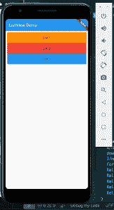

## `ListView`中的触摸事件和动态添加

我们可以向我们的`ListView`中的项目添加一个触摸事件。触摸事件被附加到一个触摸处理程序，所以当`ListView`中的一个项目被触摸或按下时，处理程序被执行。这类似于我们在 HTML/JS 应用程序中注册的事件:

```
class ListViewHome extends StatelessWidget {
  final titles = ["List 1", "List 2", "List 3"];
  final subtitles = [
    "Here is list 1 subtitle",
    "Here is list 2 subtitle",
    "Here is list 3 subtitle"
  ];
  final icons = [Icons.ac_unit, Icons.access_alarm, Icons.access_time];
  @override
  Widget build(BuildContext context) {
    return ListView.builder(
        itemCount: titles.length,
        itemBuilder: (context, index) {
          return Card(
              child: ListTile(
                  onTap: () {
                    Scaffold.of(context).showSnackBar(SnackBar(
                      content: Text(titles[index] + ' pressed!'),
                    ));
                  },
                  title: Text(titles[index]),
                  subtitle: Text(subtitles[index]),
                  leading: CircleAvatar(
                      backgroundImage: NetworkImage(
                          "https://images.unsplash.com/photo-1547721064-da6cfb341d50")),
                  trailing: Icon(icons[index])));
        });
  }
}

```

注意，我们在`ListTile`中添加了一个`onTap`函数属性，并附带了一个函数处理程序。它监听`ListView`项中的触摸事件，因此每当列表项被触摸或按下时，函数处理程序就会被执行。这将在运行时显示一个滚动条，显示所触摸的列表项的“标题”:

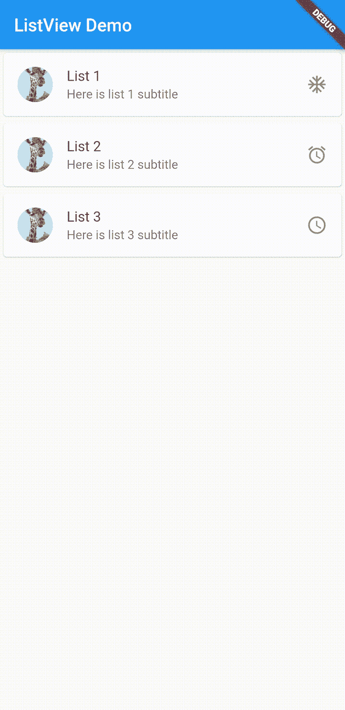

我们还可以添加或删除`ListView`中的项目。为此，我们必须让我们的小部件成为有状态的小部件。

我们可以通过扩展类`State`使`ListViewHome`成为一个状态小部件。

一个有状态的小部件将扩展`StatefulWidget`类，并在它的`createState`方法中调用`ListViewHome`:

```
class ListViewHomeLayout extends StatefulWidget {
@override
      ListViewHome createState() {
        return new ListViewHome();
      }
}
class ListViewHome extends State<ListViewHomeLayout> {
  List<String> titles = ["List 1", "List 2", "List 3"];
  final subtitles = [
    "Here is list 1 subtitle",
    "Here is list 2 subtitle",
    "Here is list 3 subtitle"
  ];
  final icons = [Icons.ac_unit, Icons.access_alarm, Icons.access_time];
  @override
  Widget build(BuildContext context) {
    return ListView.builder(
        itemCount: titles.length,
        itemBuilder: (context, index) {
          return Card(
              child: ListTile(
                  onTap: () {
                  setState(() {
                    titles.add('List' + (titles.length+1).toString());
                    subtitles.add('Here is list' + (titles.length+1).toString() + ' subtitle');
                    icons.add(Icons.zoom_out_sharp);
                  });
                    Scaffold.of(context).showSnackBar(SnackBar(
                      content: Text(titles[index] + ' pressed!'),
                    ));
                  },
                  title: Text(titles[index]),
                  subtitle: Text(subtitles[index]),
                  leading: CircleAvatar(
                      backgroundImage: NetworkImage(
                          "https://images.unsplash.com/photo-1547721064-da6cfb341d50")),
                  trailing: Icon(icons[index])));
        });
  }
}

```

现在，我们将改变`MyApp`中的`body`道具来渲染`ListViewHomeLayout()`:

```
body: ListViewHomeLayout())

```

在`ListViewHome`中，查看`onTap`处理器的内部。我们可以使用`setState`方法向`titles`、`subtitles`和`icons`数组添加条目。这将导致`ListView`被重新渲染，并且 UI 被更新为最新添加的项目:

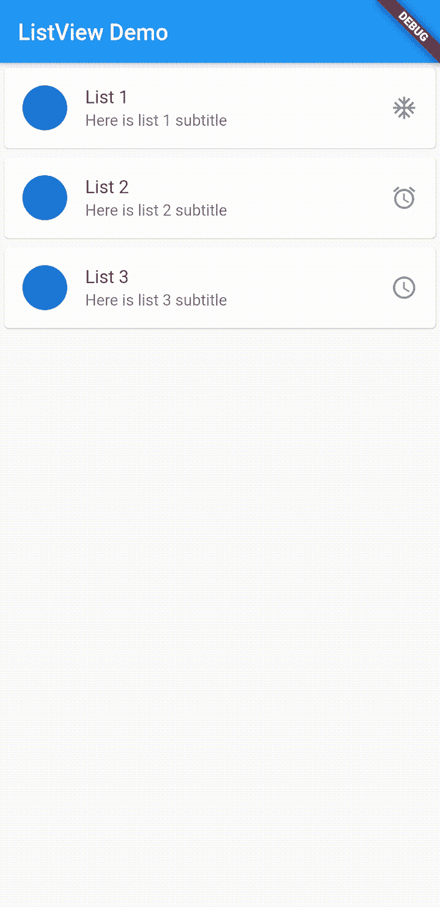

## 结论

我们在列表视图上讨论了很多！

我们从 Flutter 开始，了解它的工作原理和用途。然后，我们介绍了如何下载 Flutter SDK，导出它，并为 Flutter 开发配置您的 Android Studio。接下来，我们看到了如何搭建支架和运行 Flutter。

然后我们学习了如何创建一个`ListView`，包括静态和动态创建`ListView`实例的不同方法。我们学习了如何在每个项目中添加单独的行，如何在列表项目中注册触摸事件，以及如何使用`Stateful`小部件向`ListView`添加项目。

我希望你像我写这篇文章一样喜欢阅读这篇文章，并且学到一些在你的下一个项目中使用`ListView`的有用技巧。

## 参考

[行动中的颤动——埃里克·风车](https://www.manning.com/books/flutter-in-action)

## 使用 [LogRocket](https://lp.logrocket.com/blg/signup) 消除传统错误报告的干扰

[](https://lp.logrocket.com/blg/signup)

[LogRocket](https://lp.logrocket.com/blg/signup) 是一个数字体验分析解决方案，它可以保护您免受数百个假阳性错误警报的影响，只针对几个真正重要的项目。LogRocket 会告诉您应用程序中实际影响用户的最具影响力的 bug 和 UX 问题。

然后，使用具有深层技术遥测的会话重放来确切地查看用户看到了什么以及是什么导致了问题，就像你在他们身后看一样。

LogRocket 自动聚合客户端错误、JS 异常、前端性能指标和用户交互。然后 LogRocket 使用机器学习来告诉你哪些问题正在影响大多数用户，并提供你需要修复它的上下文。

关注重要的 bug—[今天就试试 LogRocket】。](https://lp.logrocket.com/blg/signup-issue-free)