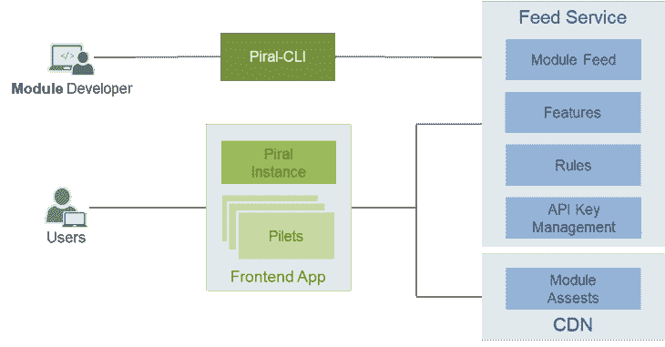
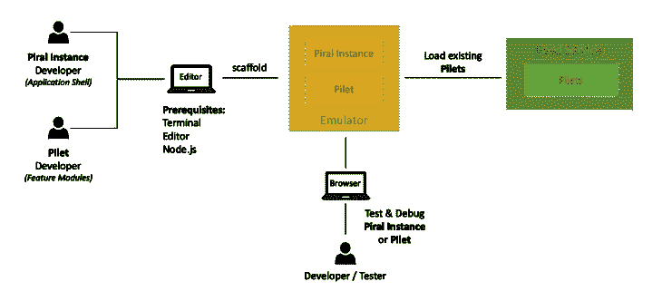
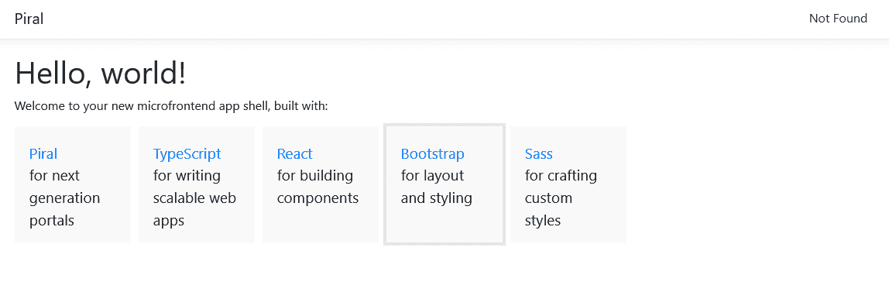
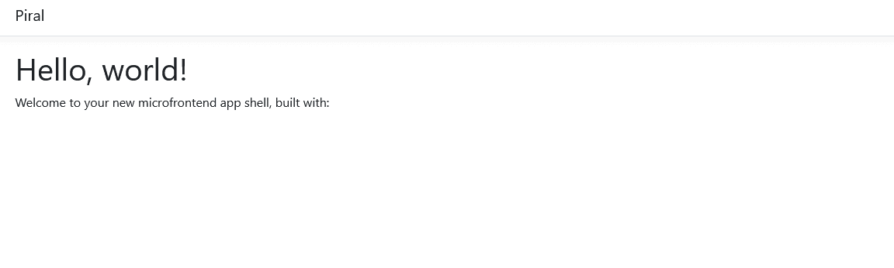
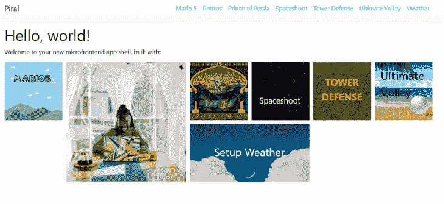
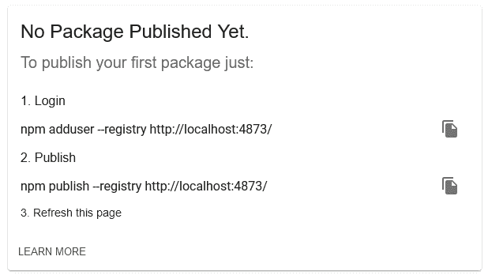
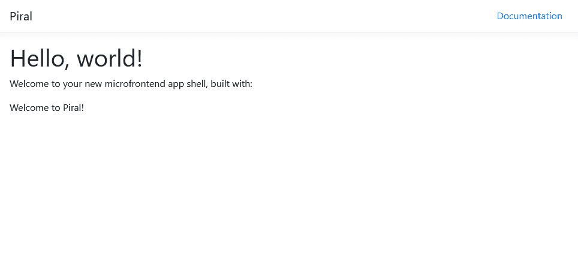
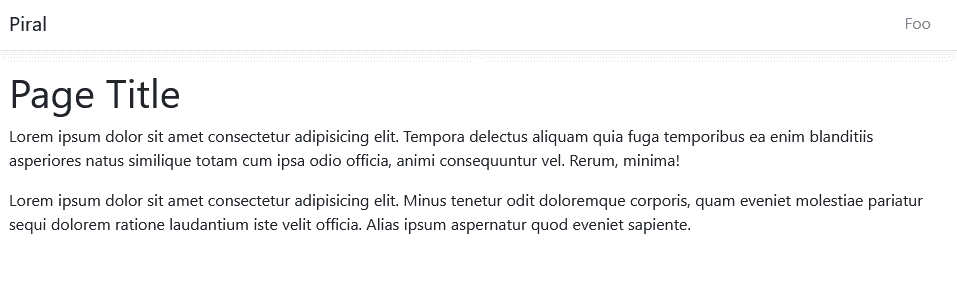

# 用 Piral 创建微前端

> 原文：<https://blog.logrocket.com/creating-micro-frontends-piral/>

三年多以前，我在 LogRocket 的一篇文章中透露了通过某种发现机制形成微前端的想法，这篇文章叫做[驯服前端整体](https://blog.logrocket.com/taming-the-front-end-monolith-dbaede402c39/)。发现机制，也就是 feed 服务，是我参与的解决方案的核心。

这个解决方案就是 Piral，半年后我们在 O'Reilly 的软件架构会议上正式公布了它。

如今，Piral 是微前端领域最常用和最知名的解决方案之一。仅此一点就足以证明另一篇博文的合理性——但是，我们也看到了微前端越来越受欢迎，以及对总体可伸缩性的需求。

事不宜迟，让我们看看什么是微前端，为什么松耦合对它们如此重要，以及 Piral 如何解决这一问题(以及其他问题)以实现巨大的可伸缩性。我们将在以下几节中讨论这一点:

## 什么是微前端？

近年来，微前端越来越受欢迎。原因之一是对大型 web 应用程序的需求增加。今天，像 AWS 和 Azure 门户这样的强大门户，以及像网飞或 DAZN 这样的丰富用户体验，已经不是例外，而是常态。如何构建如此大型的应用程序？如何扩展它们？

这些问题的一个答案是使用微前端。微前端是一个[业务子域](https://blog.logrocket.com/how-to-build-web-app-with-multiple-subdomains-nginx/)的技术表示。基本思想是孤立地开发 UI 的一部分。这一块不需要在屏幕上的一个区域里表现出来；它实际上可以由多个片段组成，即一个菜单项和该菜单项链接到的页面。唯一的限制是，该作品应该与企业子域相关。

微前端由不同的组件组成，但它们不是传统的 UI 组件，如下拉菜单或富文本字段框。相反，这些组件是特定于领域的组件，包含一些业务逻辑，比如需要发出什么 API 请求。

在这个上下文中，即使像菜单项这样简单的东西也是域组件，因为它已经知道到页面的链接来自同一个业务域。一旦组件有了一些领域逻辑，它就是一个领域组件——因此可以成为微前端的一部分。

为了实现微前端，存在一整套方法和实践。它们可以在构建时在服务器端和客户端集合在一起。

在本文中，我们将研究客户端的组合，但是同样的故事也可以写在服务器上。那么微前端实际上是如何伸缩的呢？

## 其他微前端框架的可伸缩性问题

许多微前端框架在现实环境中面临可伸缩性问题。看看其他的文章，这项技术乍一看似乎不错；例如，如果你读过[用单 spa 创建微前端应用](https://blog.logrocket.com/micro-frontend-apps-single-spa/)或者[用讲台构建苗条的微前端](https://blog.logrocket.com/building-svelte-micro-frontends-podium/)，他们很好地介绍了技术和用例。另一个例子可以在[用前端](https://blog.logrocket.com/micro-frontends-fronts/)构建渐进式微前端中看到。

问题是这些框架通常试图在视觉上分割 UI。然而，在现实中，你永远不会把你的前端分成像“导航”、“页眉”、“内容”和“页脚”这样的部分。这是为什么呢？

一个真正的应用程序由不同的部分组成，正如上一节所解释的，这些部分来自不同的子域，它们组合在一起形成完整的应用程序域。虽然这些子域可以在纸上很好地完全分开，但它们通常在相同的布局元素中呈现给最终用户。

想象一下类似于网络商店的东西。如果您有一个子域用于产品细节，另一个子域用于处理以前的订单，那么作为用户，您不会希望在订单历史中只看到无意义的产品 id。相反，您希望订单历史中至少显示产品名称和一些细节。因此，这些子域在视觉上向最终用户交错。

同样，几乎每个子域都有助于共享 UI 布局元素，比如导航、页眉或页脚。因此，让微前端专门处理一个导航区域在实践中没有多大意义，因为这个微前端会收到来自其他团队的大量请求——并成为一个瓶颈。这样做会导致一个隐藏的整体。

现在，有人可能会说，在微前端中没有导航会导致相同的更改需求，但这次是在应用程序外壳所有者上。这甚至会更糟。

那么解决办法是什么呢？显然，我们需要将这些事情分开。所以不用像这样的东西:

```
import MyMenuItem1 from 'my-micro-frontend1';
import MyMenuItem1 from 'my-micro-frontend2';
import MyMenuItemN from 'my-micro-frontendN';

const MyMenu = () => (
    <>
        <MyMenuItem1 />
        <MyMenuItem2 />
        <MyMenuItemN />
    </>
);

```

我们需要注册每个必要的部分，比如来自微前端本身的导航项。这样，我们可以得到这样的结构:

```
const MyMenu = () => {
    const items = useRegisteredMenuItems();

    return (
        <>
            {items.map(({ id, Component }) => <Component key={id} />)}
        </>
    );
};

```

为了避免需要知道微前端的名称和位置，需要一种发现。这只是一个 JSON 文档，可以从一个已知的位置检索，比如后端服务。

现在我们知道了需要扩展什么，是时候开始实现了。幸运的是，有一个框架已经给了我们这方面的先机:Piral。

## 皮拉尔有什么不同？

Piral 是一个使用微前端创建超可伸缩 web 应用的框架。在众多特性中，它具有以下特点:

*   一种集成的微前端发现机制
*   端到端的丰富开发人员体验，满足您的一切需求
*   具有跨框架支持的松散耦合组件

这样，单个团队就可以专注于他们特定的领域问题，而不是需要联合和联合发布。Piral 应用程序由三部分组成:

1.  应用程序外壳。这可以简单到一个 HTML 文件，其中包含对微前端发现服务的引用，称为提要
2.  微前端的提要(也可以是一个静态 JSON，但通常您会想要更强大的东西)
3.  不同的模块(微前端)，称为 pilets

整个设置可概述如下:



模块开发人员可以使用命令行实用程序`piral-cli`来搭建(即，使用一些模板创建)和发布新的 pilets，调试和更新现有的模块，或者执行一些林挺和验证。真正的用户不会将解决方案视为不同的部分——他们实际上在一个应用程序中使用应用程序外壳和 pilets。从技术上讲，这些 pilets 是从 feed 服务中获取的。

通常，微前端的开发体验并不理想。要么需要检查并开始多项工作，要么整个过程归结为一个开发-提交-尝试-失败-重启的循环。Piral 在这里有所不同——它试图先离线。微前端直接在称为仿真器的应用外壳的特殊版本中开发。



模拟器只是一个 npm 包，可以安装在任何 npm 项目中。当`piral-cli`用于调试时，它实际上将使用模拟器中的内容作为页面来显示。然后，pilet 将通过内部 API 提供服务，而不是通过远程 feed 服务或类似的服务。

然而，在开发过程中加载现有的微前端仍然是有意义的。在这种情况下，仍然可以集成来自现有提要的 pilets。

让我们看看这一切在实践中是如何运作的。

## 使用 Piral 开发您的应用程序外壳

使用 Piral 创建应用程序外壳有多种方式:

*   迁移现有项目
*   手动将包添加到新项目中
*   使用`piral-cli`创建一个新项目

在这篇文章中，我们将做后者。

在命令行上，我们运行:

```
npm init piral-instance --bundler esbuild --target my-app-shell --defaults

```

这将在`my-app-shell`目录中创建一个新的应用程序外壳。该项目将使用 npm、TypeScript 和`esbuild`工具作为我们的捆绑器(尽管我们实际上可以选择任何类型的捆绑器，如 webpack、Parcel 或 Vite 等。).选择`esbuild`在很多情况下就足够了，并提供了最快安装时间的好处。

现在，我们可以开始调试项目了。进入新目录(如`cd my-app-shell`)并启动调试会话:

```
npm start

```

转到`[http://localhost:1234](http://localhost:1234)`会显示标准模板:



### 更改模板

我们现在可以在所有可能的方面改变模板。例如，我们可以改变提供的布局，没有任何固定的内容瓦片；只需编辑`src/layout.tsx`文件，删除`defaultTiles`和`defaultMenuItems`。确保不仅要删除它们的初始化，还要删除对它们的引用。

为了获得更详细的信息，我们可以将`DashboardContainer`改为:

```
DashboardContainer: ({ children }) => (
  <div>
    <h1>Hello, world!</h1>
    <p>Welcome to your new microfrontend app shell, built with:</p>
    <div className="tiles">
      {defaultTiles}
      {children}
    </div>
  </div>
),

```

收件人:

```
DashboardContainer: ({ children }) => (
  <div>
    <h1>Hello, world!</h1>
    <p>Welcome to your new microfrontend app shell, built with:</p>
    <div className="tiles">
      {children}
    </div>
  </div>
),

```

这里可以看到的所有组件都有不同的用途。虽然它们中的许多来自可选插件，但有些——如`ErrorInfo`或`Layout`——已经通过驱动 Piral 的核心库进行了定义。

在上面的案例中，我们为 Piral 的仪表板插件定义了仪表板容器。仪表板插件为我们提供了一个仪表板，默认情况下，它位于我们页面的主页(`/`)上。我们可以改变这里的一切，包括它的外观和它应该位于哪里(当然，如果我们想有一个仪表板的话)。

仪表板非常适合门户应用程序，因为它们在一个屏幕上收集了大量信息。对于微前端来说，仪表板也是很好的——尤其是作为一个橱窗。在这个页面上，即使不是所有的，也可能是大多数的微前端想要展示一些东西。

从 dashboard 容器中移除默认磁贴后，web 应用程序现在应该看起来更空一些:



我们的 web 应用程序之所以空虚，主要原因是我们没有在某个地方集成任何呈现组件的微前端。此时，脚手架机制将我们的新应用程序外壳连接到 Piral 自己拥有的特殊提要:空提要。

空提要就是顾名思义将一直保持为空的提要。我们可以更改应用程序外壳的代码，转而使用其他提要。

### 更改提要以显示不同的内容

为此，您需要打开`src/index.tsx`文件。在那里，您将看到包含要使用的提要的 URL 的变量:

```
const feedUrl = 'https://feed.piral.cloud/api/v1/pilet/sample';

```

转到示例提要，它在另一个应用程序外壳中使用，我们实际上可以看到如果由微前端适当填充，外壳会是什么样子。仪表板现在应该看起来像这样:



事实上，我们已经可以在新的应用程序外壳中显示来自另一个 feed 的 pilets，这真的很酷。这预先表明，桩实际上是独立的，与它们的壳没有密切关系。

但是，请记住，这种平稳的集成并不总是可能的。Pilets 总是可以以一种相当容易集成到其他 Piral 实例中的方式来开发。同样，以排除不同应用程序外壳的方式开发 pilet 也是可能的。

## 创建应用程序模拟器

在我们为这个应用程序外壳开发一些微前端之前，我们需要创建它的模拟器。停止调试过程，并运行以下命令:

```
npm run build

```

这将在当前项目上运行`piral build`。结果是`dist`中有两个子目录:

1.  `dist/release`
2.  `dist/emulator`

前者可用于在某处实际部署我们的 web 应用程序，而后者包含一个可上传到注册表的`.tgz`文件，如下所示:

```
npm publish dist/emulator/my-app-shell-1.0.0.tgz

```

您可能需要 npm 凭据来发布软件包，但是即使您已经登录 npm，您也可能不想发布它，而是将其保持为私有，或者在不同的注册表上发布。

对于使用定制注册表测试发布过程，您可以使用 [Verdaccio](https://verdaccio.org/docs/what-is-verdaccio) 。在新的 shell 中，启动:

```
npx verdaccio

```

这将安装并运行本地版本的 Verdaccio。您应该会在屏幕上看到如下内容:

```
warn --- http address - http://localhost:4873/ - verdaccio/5.13.1

```

到这个地址看看说明。它们应该如下所示:



运行登录命令(`npm adduser --registry [http://localhost:4873/](http://localhost:4873/)`)并填写数据。对于`Username`和`Password`，用`test`就可以了。什么都会被拿走；`Email`可以简单到`[[email protected]](/cdn-cgi/l/email-protection)`。

发布到自定义注册表现在可以通过以下方式进行:

```
npm publish dist/emulator/my-app-shell-1.0.0.tgz --registry http://localhost:4873/

```

一旦完成，我们就可以为这个外壳创建微前端了！

## 推出微前端

正如我们对应用程序外壳所做的那样，我们可以使用`piral-cli`来搭建一个项目。这个命令现在使用`pilet`而不是`piral-instance`。我们运行:

```
npm init pilet --source my-app-shell --registry http://localhost:4873/ --bundler esbuild --target my-pilet --defaults

```

这将创建一个名为`my-pilet`的新目录，其中包含新微前端的代码。工具设置为`esbuild`(像以前一样，我们使用 esbuild，因为它安装非常快，但是你也可以[使用不同的东西，比如 webpack](https://blog.logrocket.com/webpack-or-esbuild-why-not-both/) )。

上面重要的部分是指定`--source`，它指示用于开发的仿真器。现在一切就绪，我们可以`cd my-pilet`并运行:

```
npm start

```

像之前一样，开发服务器托管在`[http://localhost:1234](http://localhost:1234)`。转到那里会出现如下所示的页面:



几乎和我们使用过的`empty`饲料一样空。然而，在本例中，新 pilet 的模板已经注册了一个 tile 和一个菜单项。让我们看看如何改变这种情况。

### 更换电池

打开`src/index.tsx`文件，看看代码:

```
import * as React from 'react';
import type { PiletApi } from 'my-app-shell';

export function setup(api: PiletApi) {
  api.showNotification('Hello from Piral!', {
    autoClose: 2000,
  });
  api.registerMenu(() =>
    <a href="https://docs.piral.io" target="_blank">Documentation</a>
  );
  api.registerTile(() => <div>Welcome to Piral!</div>, {
    initialColumns: 2,
    initialRows: 1,
  });
}

```

简单来说，一个 pilet 只是一个 JavaScript 库；重要的是这个库输出了什么。

pilet 导出一个`setup`函数(确切地说，是一个可选的`teardown`函数)。一旦微前端被连接，该函数就被使用，并接收由应用程序外壳定义和创建的单个参数`api`。

应用程序外壳的 API(通常称为 Pilet API)是 Pilet 在应用程序中注册其部件的地方。让我们添加一个页面并稍微改变一下磁贴。

我们从瓷砖开始。我们可以给它一些类似于`teaser`的类，让它有一点背景知识。此外，我们希望为仪表板容器添加一些元数据。我们可以使用`initialColumns`和`initialRows`属性来传达想要的大小。

```
app.registerTile(() => <div className="teaser">Hello LogRocket!</div>, {
  initialColumns: 2,
  initialRows: 2,
})

```

保存后，图块的外观会有所不同。让我们去掉不再需要的`showNotification`,引入一个新的页面:

```
api.registerPage('/foo', () =>
  <p>This is my page</p>
);

```

要链接到此页面，我们可以更改注册的菜单项。为了执行 SPA 导航，我们可以使用一个熟悉的 React 工具，`react-router-dom`:

```
api.registerMenu(() =>
  <Link to="/foo">Foo</Link>
);

```

太好了！然而，像页面这样的片段并不总是需要的，只应该在应该呈现的时候加载。这种惰性加载可以通过将代码放在一个专用文件中来实现，即`Page.tsx`，并将注册改为:

```
const Page = React.lazy(() => import('./Page'));
api.registerPage('/foo', Page);

```

`Page.tsx`的内容可以简单明了:

```
import * as React from 'react';

export default () => {
  return (
    <>
      <h1>Page Title</h1>
      <p>Lorem ipsum dolor sit ...</p>
      <p>Lorem ipsum dolor sit ...</p>
    </>
  );
};

```

注册页面后，您现在可以单击导航栏中的“Foo”来查看页面:



### 构建和发布我们的 pilet

现在我们的 pilet 已经编写好了，我们可以实际构建并发布它了。在这一点上，我们还没有创建自己的 feed 或在任何地方发布应用程序外壳，所以最后一部分实际上有点理论性。

要构建 pilet，您可以运行:

```
npm run build

```

创建完成后，您可以使用`npx pilet pack`打包 pilet。这将非常类似于运行`npm pack`。结果是另一个`.tgz`文件——这次不是模拟器，而是实际的 pilet。tarball 是可以上传到一个专用服务的东西，比如一个 feed 服务，提供 feed 供应用程序外壳使用。

在 [piral.cloud](https://www.piral.cloud) 可以找到非商业和商业产品的例子。

在我们结束本教程之前，让我们看看如何集成一个通用功能——在本例中，用 SWR 执行 HTTP 请求。

## 集成 SWR 来执行 HTTP 请求

有多种方法可以整合像 SWR 这样的共同关心的问题。一旦您将 swr(或位于它之上的其他库)添加到应用程序 shell 并在那里配置它，您有三种选择:

1.  将其公开为共享库
2.  通过 Pilet API 公开它
3.  不公开它(尽管，在我们的 SWR 例子中，这并不可行，因为我们需要一个对钩子的引用)
4.  将使用`swr`的决定留给 pilets:他们可以共享`swr`作为一个分布式依赖项(也就是说，只有在没有其他 pilets 加载它的时候才加载它)

整合 SWT 最简单、最可靠的方法是使用第一个选项。为此，我们回到应用程序外壳。

在应用程序外壳的目录中运行:

```
npm install swr

```

现在，我们来修改一下`package.json`。保留几乎所有内容，但是修改`pilets`部分的`externals`数组，如下所示:

```
{
  "name": "my-app-shell",
  "version": "1.1.0",
  // ...
  "pilets": {
    "externals": ["swr"],
    // ...
  },
  // ...
}

```

请注意，我还更改了版本号。因为我们将对模拟器进行更新，所以我们需要一个新版本。这将指示 Piral 实际上与所有 pilets 共享`swr`依赖项。

为了实际测试这一点，让我们编写`npm run build`并再次发布。

```
npm run build
npm publish dist/emulator/my-app-shell-1.1.0.tgz --registry http://localhost:4873/

```

有了更新的 shell，让我们进入 pilet 的目录并升级应用程序 shell:

```
npx pilet upgrade

```

pilet 的`package.json`文件应该已经更改。它现在应该包含对版本`1.1.0`中`my-app-shell`的引用，而不是`1.0.0`。另外，你应该看到`devDependencies`和`peerDependencies`中列出的`swr`。

让我们修改页面以使用`swr`:

```
import * as React from 'react';
import LogRocket from 'swr';

// note: fetcher could have also been globally configured in the app shell
// however, in general the pilet's don't know about this and so they may want to
// reconfigure or redefine it like here
const fetcher = (resource, init) => fetch(resource, init).then(res => res.json());

export default () => {
  const { data, error } = useSWR('https://jsonplaceholder.typicode.com/users/1', fetcher);

  if (error) {
    return <div>failed to load</div>;
  }

  if (!data) {
    return <div>loading...</div>;
  }

  return (
    <>
      Hello {data.name}!
    </>
  );
};

```

现在我们完成了！SWR 不仅在我们的应用程序中成功设置，我们还可以在所有微前端中使用它。这既节省了加载 SWR 的带宽，也节省了 SWR 的内部缓存，给所有微前端带来了很好的性能优势。

## 摘要

在这篇文章中，你看到了 Piral 的入门是多么容易。Piral 为您提供了将您的 web 应用程序分发到不同存储库的选项，甚至跨不同的团队。

在这篇文章中，我们只探索了非常基本的设置，但是你可以用 Piral 做更多的事情。探索 Piral 的最佳方式是浏览官方文档。

Piral 比大多数其他解决方案伸缩性更好的原因是 Piral 鼓励松散耦合。这样，你将很难将两个东西融合在一起，这有助于避免功能重叠和隐藏的独石。

无论您计划做什么，请确保已经考虑了哪些依赖项要共享，哪些要留给 pilet。我们已经看到了一个例子，提供`swr`作为共享依赖项实际上是在几秒钟内建立起来的。编码快乐！

## 您是否添加了新的 JS 库来提高性能或构建新特性？如果他们反其道而行之呢？

毫无疑问，前端变得越来越复杂。当您向应用程序添加新的 JavaScript 库和其他依赖项时，您将需要更多的可见性，以确保您的用户不会遇到未知的问题。

LogRocket 是一个前端应用程序监控解决方案，可以让您回放 JavaScript 错误，就像它们发生在您自己的浏览器中一样，这样您就可以更有效地对错误做出反应。

[](https://lp.logrocket.com/blg/javascript-signup)[https://logrocket.com/signup/](https://lp.logrocket.com/blg/javascript-signup)

[LogRocket](https://lp.logrocket.com/blg/javascript-signup) 可以与任何应用程序完美配合，不管是什么框架，并且有插件可以记录来自 Redux、Vuex 和@ngrx/store 的额外上下文。您可以汇总并报告问题发生时应用程序的状态，而不是猜测问题发生的原因。LogRocket 还可以监控应用的性能，报告客户端 CPU 负载、客户端内存使用等指标。

自信地构建— [开始免费监控](https://lp.logrocket.com/blg/javascript-signup)。