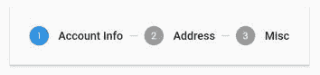
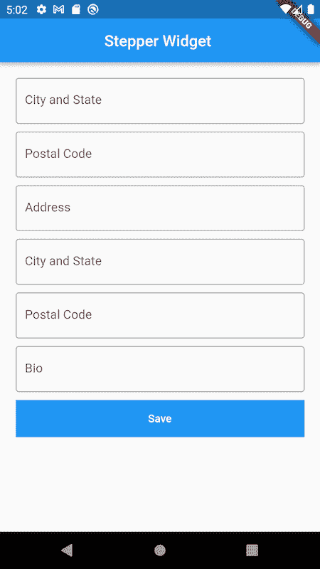
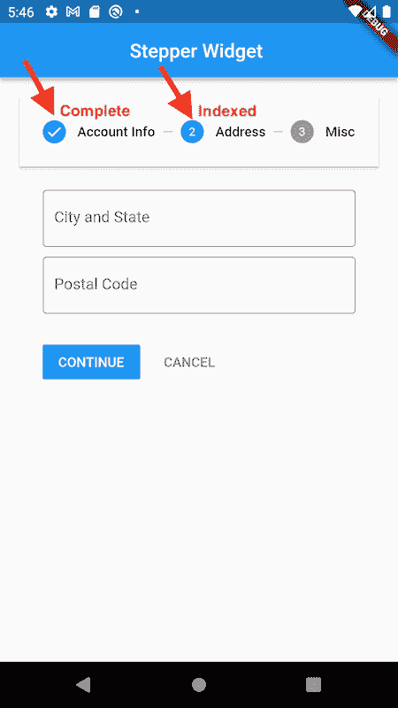
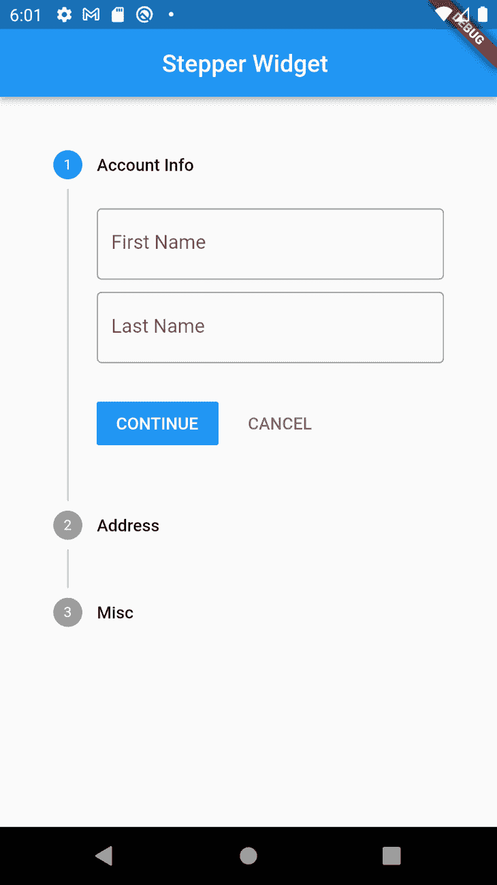
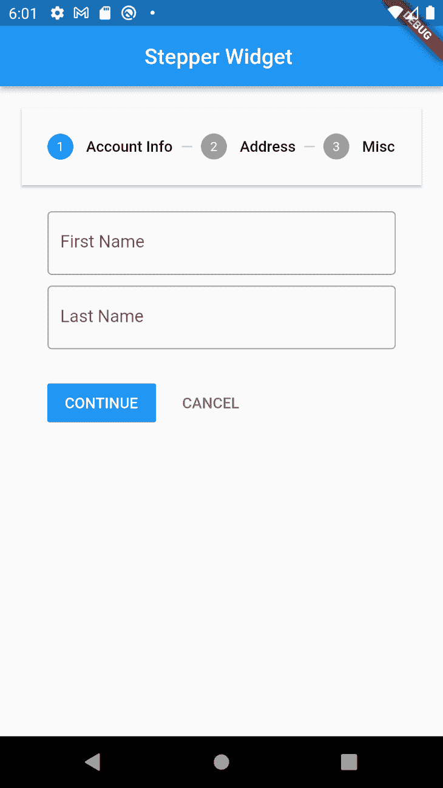

# 使用 Stepper widget 在 Flutter 中创建多步表单

> 原文：<https://blog.logrocket.com/creating-multi-step-form-flutter-stepper-widget/>

大多数情况下，填写包含大量字段的表单会很麻烦，这会阻碍用户完成整个过程。这就是多步表单发挥作用的地方。

多步表单顾名思义:多步表单是将一个长表单分解成几个小段。它们为应用程序的用户提供了一种不那么令人畏惧的体验。

Flutter 预绑定了一个 Stepper 小部件，它让我们能够将表单分解成一系列步骤。在本文中，我们将探讨什么是步进器小部件，以及如何在 Flutter 中应用它来构建多步表单以增强用户体验。您还将学习如何自定义一个步进器小部件来满足您的移动应用程序的规范。

这些是步进器小部件的一些基本属性。我们还将通过演示展示它们的实际应用，但在开始之前，您可以在这里查看一下:

*   类型(`StepperType.horizontal`或`StepperType.vertical`)-这决定了方向以及每个步骤相对于彼此的放置方式
*   步骤—步进器的步骤，其标题、副标题和图标始终可见。下面是我们将用于演示的步骤示例:
    
*   `currentStep` —步长的索引值(0，1，2 等。).定义表单中的活动步骤
*   `onStepContinue()` —继续时回调按钮，用于移动到下一步
*   `onStepCancel()` —取消时回调按钮，移动到上一步
*   `onStepTapped` (int index) —当用户点击步骤时的回调，以移动到正在进行的选定步骤。回调还为我们提供了用户点击的步骤的索引
*   `List<Step>` —步进器的步骤，当各个步骤为`Active`时，显示其标题和内容

要进一步深入，步骤本身的属性包括:

*   `title` —使用此属性为步骤命名。这个属性是一个必需的属性，它接受一个小部件作为值，通常是一个文本小部件
*   `subtitle` —使用该属性向步骤添加副标题。它接受一个小部件作为值，通常是文本小部件
*   `content` —我们将使用该属性为该步骤提供内容。这是一个必需的属性，接受任何小部件作为值
*   `state` —使用该属性设置步骤的状态，如`completed`、`disabled`、`editing`、`indexed`或`error`。根据状态，步骤的图标会发生变化
*   `isActive` —使用此属性指示步骤是活动的还是非活动的。它接受布尔值作为值

## 在 Flutter 中创建多步表单

现在，让我们创建一个新的 Flutter 项目，展示如何应用 Stepper 小部件。

我们表单的初始状态看起来就像下图。但是，我们将使用 Stepper 小部件将它分成多个步骤，这样用户就不会被他们必须填写的字段数量淹没。



我们有自己创建的可重复使用的定制小部件。

我们有我们的`main.dart file`，它有以下内容:

```
import 'package:flutter/material.dart';
import 'package:stepper_widget/form_page.dart';

void main() {
  runApp(const MyApp());
}

class MyApp extends StatelessWidget {
  const MyApp({Key? key}) : super(key: key);

  @override
  Widget build(BuildContext context) {
    return MaterialApp(
      title: 'Flutter Demo',
      theme: ThemeData(
        primarySwatch: Colors.blue,
      ),
      home: const FormPage(),
    );
  }
}

```

我们的`FormPage`小部件包含这些内容:

```
import 'package:flutter/material.dart';
import 'package:stepper_widget/widgets/custom_button.dart';
import 'package:stepper_widget/widgets/custom_input.dart';

class FormPage extends StatefulWidget {
  const FormPage({Key? key}) : super(key: key);

  @override
  _FormPageState createState() => _FormPageState();
}

class _FormPageState extends State<FormPage> {
  @override
  Widget build(BuildContext context) {
    return MaterialApp(
      home: Scaffold(
        appBar: AppBar(
          title: const Text(
            "Stepper Widget ",
          ),
          centerTitle: true,
        ),
        body: Container(
          padding: const EdgeInsets.all(20),
          child: ListView(
            children: [
              const CustomInput(
                hint: "First Name",
                inputBorder: OutlineInputBorder(),
              ),
              const CustomInput(
                hint: "Last Name",
                inputBorder: OutlineInputBorder(),
              ),
              const CustomInput(
                hint: "Address",
                inputBorder: OutlineInputBorder(),
              ),
              const CustomInput(
                hint: "City and State",
                inputBorder: OutlineInputBorder(),
              ),
              const CustomInput(
                hint: "Bio",
                inputBorder: OutlineInputBorder(),
              ),
              const CustomInput(
                hint: "Bio",
                inputBorder: OutlineInputBorder(),
              ),
              CustomBtn(
                title: const Text(
                  "Save",
                  style: TextStyle(color: Colors.white),
                ),
                callback: () {},
              )
            ],
          ),
        ),
      ),
    );
  }
}

```

我们的`CustomInput`:

```
import 'package:flutter/material.dart';

class CustomInput extends StatelessWidget {
  final ValueChanged<String>? onChanged;
  final String? hint;
  final InputBorder? inputBorder;
  const CustomInput({Key? key, this.onChanged, this.hint, this.inputBorder})
      : super(key: key);

  @override
  Widget build(BuildContext context) {
    return Container(
      margin: const EdgeInsets.only(bottom: 10),
      child: TextField(
        onChanged: (v) => onChanged!(v),
        decoration: InputDecoration(hintText: hint!, border: inputBorder),
      ),
    );
  }
}

```

最后是我们的自定义按钮，`CustomBtn`:

```
import 'package:flutter/material.dart';

class CustomBtn extends StatelessWidget {
  final Function? callback;
  final Widget? title;
  CustomBtn({Key? key, this.title, this.callback}) : super(key: key);

  @override
  Widget build(BuildContext context) {
    return Container(
      margin: const EdgeInsets.only(bottom: 10),
      child: SizedBox(
        width: double.infinity,
        child: Container(
          color: Colors.blue,
          child: TextButton(
            onPressed: () => callback!(),
            child: title!,
          ),
        ),
      ),
    );
  }
}

```

### 为我们的表单创建步骤

为了使用我们的 Stepper 小部件，我们将首先创建一个步骤列表。

因为我们已经定义了 Stepper 小部件的一些重要特性，所以我们在这里就不深究了。我们可以直接进入:

```
List<Step> getSteps() {
  return <Step>[
    Step(
      state: currentStep > 0 ? StepState.complete : StepState.indexed,
      isActive: currentStep >= 0,
      title: const Text("Account Info"),
      content: Column(
        children: const [
          CustomInput(
            hint: "First Name",
            inputBorder: OutlineInputBorder(),
          ),
          CustomInput(
            hint: "Last Name",
            inputBorder: OutlineInputBorder(),
          ),
        ],
      ),
    ),
    Step(
      state: currentStep > 1 ? StepState.complete : StepState.indexed,
      isActive: currentStep >= 1,
      title: const Text("Address"),
      content: Column(
        children: const [
          CustomInput(
            hint: "City and State",
            inputBorder: OutlineInputBorder(),
          ),
          CustomInput(
            hint: "Postal Code",
            inputBorder: OutlineInputBorder(),
          ),
        ],
      ),
    ),
    Step(
      state: currentStep > 2 ? StepState.complete : StepState.indexed,
      isActive: currentStep >= 2,
      title: const Text("Misc"),
      content: Column(
        children: const [
          CustomInput(
            hint: "Bio",
            inputBorder: OutlineInputBorder(),
          ),
        ],
      ),
    ),
  ];
}

```

创建了 Stepper 小部件所需的步骤后，我们现在可以替换`formpage.dart`中的`ListView`。但在此之前，让我们先看看我们单步的每个字段代表什么。

我们为单步执行设置的第一个属性是`state`:您可能还记得，它定义了步进器上的前导图标，如下图所示。当用户编辑完特定步骤中的字段并移动到下一步时，前一步在`state`属性中被标记为已完成，当前步骤被标记为`indexed`，这仅仅意味着用户正在主动编辑该步骤。



属性只是用来显示用户当前正在查看哪个步骤。`title`接收一个小部件并显示在每个步骤的顶部，而每个步骤的内容是我们希望用户与之交互的实际表单小部件。

将之前的`Listview`小部件替换为`Stepper`后，我们的代码看起来是这样的:

```
import 'package:flutter/material.dart';
import 'package:stepper_widget/widgets/custom_input.dart';

class FormPage extends StatefulWidget {
  const FormPage({Key? key}) : super(key: key);

  @override
  _FormPageState createState() => _FormPageState();
}

class _FormPageState extends State<FormPage> {
  int currentStep = 0;
  @override
  Widget build(BuildContext context) {
    return MaterialApp(
      home: Scaffold(
        appBar: AppBar(
          title: const Text(
            "Stepper Widget ",
          ),
          centerTitle: true,
        ),
        body: Container(
            padding: const EdgeInsets.all(20),
            child: Stepper(
              type: StepperType.horizontal,
              currentStep: currentStep,
              onStepCancel: () => currentStep == 0
                  ? null
                  : setState(() {
                      currentStep -= 1;
                    }),
              onStepContinue: () {
                bool isLastStep = (currentStep == getSteps().length - 1);
                if (isLastStep) {
                  //Do something with this information
                } else {
                  setState(() {
                    currentStep += 1;
                  });
                }
              },
              onStepTapped: (step) => setState(() {
                currentStep = step;
              }),
              steps: getSteps(),
            )),
      ),
    );
  }

  List<Step> getSteps() {
    return <Step>[
      Step(
        state: currentStep > 0 ? StepState.complete : StepState.indexed,
        isActive: currentStep >= 0,
        title: const Text("Account Info"),
        content: Column(
          children: const [
            CustomInput(
              hint: "First Name",
              inputBorder: OutlineInputBorder(),
            ),
            CustomInput(
              hint: "Last Name",
              inputBorder: OutlineInputBorder(),
            ),
          ],
        ),
      ),
      Step(
        state: currentStep > 1 ? StepState.complete : StepState.indexed,
        isActive: currentStep >= 1,
        title: const Text("Address"),
        content: Column(
          children: const [
            CustomInput(
              hint: "City and State",
              inputBorder: OutlineInputBorder(),
            ),
            CustomInput(
              hint: "Postal Code",
              inputBorder: OutlineInputBorder(),
            ),
          ],
        ),
      ),
      Step(
        state: currentStep > 2 ? StepState.complete : StepState.indexed,
        isActive: currentStep >= 2,
        title: const Text("Misc"),
        content: Column(
          children: const [
            CustomInput(
              hint: "Bio",
              inputBorder: OutlineInputBorder(),
            ),
          ],
        ),
      ),
    ];
  }
}

```

现在让我们浏览一下我们在 Stepper 小部件中定义的每个属性。

从`type`开始，我们定义 stepper 小部件的内容应该如何在 Stepper 中布局。对于垂直和水平步进类型，这是我们的步进器小部件的外观:





`CurrentStep`简单地接受用户当前可见的步骤的索引值。

当我们表单的用户点击后退按钮时，是否会执行回调，我们目前正在进行检查，以防止按钮在第一步就被激活。

`onStepContinue`是我们继续按钮上的回调。在这里，我们还进行了检查，以了解用户何时处于最后一步，在这里，我们可以使用提供给我们的信息执行必要的操作。

`OnStepTapped`返回用户点击的步骤，我们可以通过将它设置为当前步骤的值来激活它。

可以对我们的 Stepper 小部件做的其他事情包括添加自定义主题或实现我们自己的自定义控制按钮，这就是我们现有的**下一个**和**继续**按钮。为此，只需使用我们的 Stepper 小部件的`theme`属性和`controlsBuilder`属性。

## 最后的想法

使用多步表单可以显著改善用户体验，增加我们设计的视觉吸引力。

在需要的情况下，Flutter 中的 Stepper 小部件可以帮助我们，它为我们提供了许多有用的定制，无需依赖第三方库就可以获得我们想要的结果。

## 使用 [LogRocket](https://lp.logrocket.com/blg/signup) 消除传统错误报告的干扰

[](https://lp.logrocket.com/blg/signup)

[LogRocket](https://lp.logrocket.com/blg/signup) 是一个数字体验分析解决方案，它可以保护您免受数百个假阳性错误警报的影响，只针对几个真正重要的项目。LogRocket 会告诉您应用程序中实际影响用户的最具影响力的 bug 和 UX 问题。

然后，使用具有深层技术遥测的会话重放来确切地查看用户看到了什么以及是什么导致了问题，就像你在他们身后看一样。

LogRocket 自动聚合客户端错误、JS 异常、前端性能指标和用户交互。然后 LogRocket 使用机器学习来告诉你哪些问题正在影响大多数用户，并提供你需要修复它的上下文。

关注重要的 bug—[今天就试试 LogRocket】。](https://lp.logrocket.com/blg/signup-issue-free)