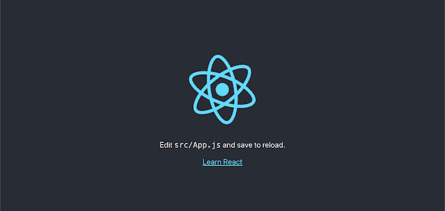
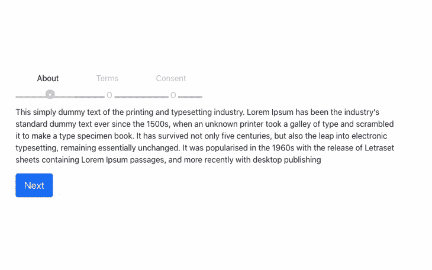
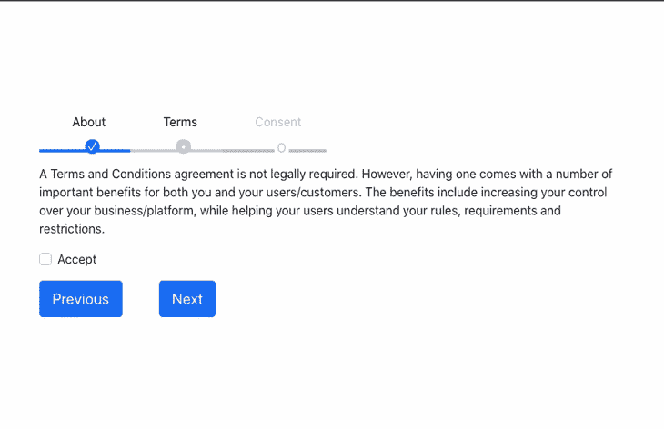

# 使用 React Stepzilla 创建多步表单

> 原文：<https://blog.logrocket.com/creating-multi-step-forms-react-stepzilla/>

web 开发人员面临的一个常见挑战是收集详细的用户数据，而不要用冗长复杂的表单淹没 UI。特别是随着 SPAs 越来越广泛的使用，现在让用户通过一个过程的最佳实践需要将表单分成小的、可理解的步骤，这些步骤不会呈现一个新的页面。

在本教程中，我们将演示如何使用 [React Stepzilla 增强您的 UX，这是一个为顺序数据收集而设计的多步向导](https://github.com/newbreedofgeek/react-stepzilla)组件。使用 Stepzilla，您可以呈现不同类型的 React 组件，如数据表单和 HTML 到文本。要跟随 React 样式教程，您需要:

*   熟悉 CSS、HTML 和 [JavaScript ES6](https://blog.logrocket.com/practical-use-cases-for-javascript-es6-proxies/)
*   系统上安装的 Node.js
*   您系统中安装的网络浏览器，即 Chrome
*   安装在开发机器上的代码编辑器，即 VS 代码
*   对 React 的基本理解

我们开始吧！

## 安装 Stepzilla

首先，我们将初始化一个新的 React 应用程序，并通过运行下面的代码来安装 Stepzilla。如果你使用的是 Mac，通过终端导航到你的工作目录；对于 Windows 用户，通过命令提示符访问您的目录:

```
npx create-react-app stepzilla-app

```

若要启动您的应用程序，请运行以下命令:

```
cd stepzilla-app && npm start

```

您的应用程序应该类似于下面的屏幕截图:



接下来，我们将通过运行以下命令来安装 React Stepzilla 组件:

```
npm install --save react-stepzilla

```

## 用 Stepzilla 创建一个多步骤组件

让我们为包含三个步骤的多步骤表单编写逻辑，`About`、`Terms`和`ConsentForm`组件。在你项目的根目录下，新建一个名为`components`的文件夹；在里面，创建一个名为`multiStep.js`的新文件。

现在，创建一个名为`steps`的文件夹。导航到其中并创建以下四个文件:`About.js`、`Terms.js`、`ConsentForm.js`和`steps.js`。让我们编写代码来填充这三个步骤。

将以下代码添加到`About.js`:

```
import react from 'react';

const About = () => {
    return (
        <div>
            <p>
                This simply dummy text of the printing and typesetting 
                industry. Lorem Ipsum has been the industry's standard dummy 
                text ever since the 1500s, when an unknown printer took a 
                galley of type and scrambled it to make a type specimen book. 
                It has survived not only five centuries, but also the leap into 
                electronic typesetting, remaining essentially unchanged. 
                It was popularised in the 1960s with the release of 
                Letraset sheets containing Lorem Ipsum passages, and more 
                recently with desktop publishing
            </p>
        </div>
    )
}
export default About;

```

> 文字来源于[https://www.lipsum.com](https://www.lipsum.com)

将下面的代码添加到`Terms.js`:

```
import react from 'react';
const Terms = () => {
    return (
        <div>
            <p>
                A Terms and Conditions agreement is not legally required. However, having one
                comes with a number of important benefits for both you and your users/customers.
                The benefits include increasing your control over your business/platform,
                while helping your users understand your rules, requirements and restrictions.
            </p>
            <div class="form-group form-check">
                <input type="checkbox" class="form-check-input" id="exampleCheck1" />
                <label class="form-check-label" for="exampleCheck1">Accept</label>
            </div>
        </div>
    )
}
export default Terms;
```

将以下代码添加到`ConsentForm.js`:

```
import react from 'react';
const ConsentForm = () => {
    return (
        <div>
            <form>
                <div className="form-group">
                    <label htmlFor="exampleInputEmail1">Email address</label>
                    <input type="email" className="form-control" id="exampleInputEmail1" aria-describedby="emailHelp" />
                    <small id="emailHelp" className="form-text text-muted">We'll never share your email with anyone else.</small>
                </div>
                <div className="form-group">
                    <label htmlFor="exampleInputPassword1">Password</label>
                    <input type="password" className="form-control" id="exampleInputPassword1" />
                </div>
                <div className="form-group form-check">
                    <input type="checkbox" className="form-check-input" id="exampleCheck1" />
                    <label className="form-check-label" htmlFor="exampleCheck1">Check me out</label>
                </div>
            </form>
        </div>
    )
}
export default ConsentForm;

```

现在，我们将创建一个名为`steps`的常量，它将保存我们在上面创建的步骤。将下面的代码添加到`steps.js`:

```
import About from './About';
import Terms from './Terms';
import ConsentForm from './ConsentForm';
export {About, Terms, ConsentForm};

```

接下来，我们将把常量`steps`传递给 Stepzilla，作为其选项`steps`的值。在`steps.js`中，添加以下代码:

```
import react from 'react';
import { About, Terms, ConsentForm } from './steps/steps';
import StepZilla from "react-stepzilla";
const steps =
    [
        { name: 'About', component: <About /> },
        { name: 'Terms', component: <Terms /> },
        { name: 'Consent', component: <ConsentForm /> },
    ]
const MultiSteps = () => {
    return (
        <div className='step-progress'>
            <StepZilla steps={steps} />
        </div>
    );
}
export default MultiSteps;

```

要显示多步骤组件，打开`App.js`并用以下代码替换现有代码:

```
import MultiSteps from './components/MultiStep';
import './App.css';
function App() {
  return (
    <div className="App">
      <div className="stepsWrapper">
      <MultiSteps />
      </div>
    </div>
  );
}
export default App;

```

在上面的代码中，我们将`MultiSteps`组件导入到`App.js`中。现在，您的 React 应用程序应该看起来像下面的 gif:



## 设计多步表单的样式

为了增强我们的 UI，让我们在项目中添加一些自定义样式。因为 Stepzilla 使用 Bootstrap 进行造型，我们将把 [Bootstrap CDN](https://getbootstrap.com/) 放在我们项目的公共文件夹中`index.html`的头部分:

```
&lt;!-- CSS only -->
<link href="https://cdn.jsdelivr.net/npm/[email protected]/dist/css/bootstrap.min.css" rel="stylesheet" integrity="sha384-KyZXEAg3QhqLMpG8r+8fhAXLRk2vvoC2f3B09zVXn8CA5QIVfZOJ3BCsw2P0p/We" crossorigin="anonymous">

```

让我们添加一些自定义样式来处理多步导航、按钮、`ol`列表颜色、填充和边距。用以下代码替换`App.css`中的代码:

```
.App {
  margin-top: 10%;
}
.stepsWrapper{
  width: 60%;
  margin: 0 auto;
}
ol.progtrckr {
  list-style-type: none;
  padding: 0;
}
ol.progtrckr li {
  display: inline-block;
  text-align: center;
  line-height: 4.5rem;
  cursor: pointer;
}
ol.progtrckr li span {
  padding: 0 1.5rem;
}
@media (max-width: 650px) {
  .progtrckr li span {
    display: none;
  }
}
.progtrckr em {
  display: none;
  font-weight: 700;
  padding-left: 1rem;
}
@media (max-width: 650px) {
  .progtrckr em {
    display: inline;
  }
}
ol.progtrckr li.progtrckr-todo {
  color: silver;
  border-bottom: 4px solid silver;
}
ol.progtrckr li.progtrckr-doing {
  color: black;
  border-bottom: 4px solid #CCCCCC;
}
ol.progtrckr li.progtrckr-done {
  color: black;
  border-bottom: 4px solid #0d6efd;
}
ol.progtrckr li:after {
  content: "\00a0\00a0";
}
ol.progtrckr li:before {
  position: relative;
  bottom: -3.7rem;
  float: left;
  left: 50%;
}
ol.progtrckr li.progtrckr-todo:before {
  content: "\039F";
  color: silver;
  background-color: white;
  width: 1.2em;
  line-height: 1.4em;
}
ol.progtrckr li.progtrckr-todo:hover:before {
  color: #ff4500;
}
ol.progtrckr li.progtrckr-doing:before {
  content: "\2022";
  color: white;
  background-color: #CCCCCC;
  width: 1.2em;
  line-height: 1.2em;
  border-radius: 1.2em;
}
ol.progtrckr li.progtrckr-doing:hover:before {
  color: #ff4500;
}
ol.progtrckr li.progtrckr-done:before {
  content: "\2713";
  color: white;
  background-color: #0d6efd;
  width: 1.2em;
  line-height: 1.2em;
  border-radius: 1.2em;
}
ol.progtrckr li.progtrckr-done:hover:before {
  color: #333;
}

```

## 步骤验证

Stepzilla 包附带了对使用`isValidated`实用函数的步骤验证的支持，该函数在基于类的组件和钩子组件中都可用。

让我们通过用下面的代码更新`Terms.js`来为我们的`ConsentForm`组件添加基本验证:

```
import React from 'react';
class Terms extends React.Component {
    constructor(props) {
        super(props);
        this.state = {
            terms: this.props.terms,
        };
        this._validateOnDemand = true; // this flag enables onBlur validation as user fills forms
        this.validationCheck = this.validationCheck.bind(this);
        this.isValidated = this.isValidated.bind(this);
    }
    isValidated() {
        const userInput = this._grabUserInput(); // grab user entered vals
        const validateNewInput = this._validateData(userInput); // run the new input against the validator
        let isDataValid = false;
        // if full validation passes then save to store and pass as valid
        if (Object.keys(validateNewInput).every((k) => { return validateNewInput[k] === true })) {
            if (this.props.getStore().terms != userInput.terms) { // only update store of something changed
                this.props.updateStore({
                    ...userInput,
                    savedToCloud: false // use this to notify step4 that some changes took place and prompt the user to save again
                });  // Update store here (this is just an example, in reality you will do it via redux or flux)
            }
            isDataValid = true;
        }
        else {
            // if anything fails then update the UI validation state but NOT the UI Data State
            this.setState(Object.assign(userInput, validateNewInput, this._validationErrors(validateNewInput)));
        }
        return isDataValid;
    }
    validationCheck() {
        if (!this._validateOnDemand)
            return;
        const userInput = this._grabUserInput(); // grab user entered vals
        const validateNewInput = this._validateData(userInput); // run the new input against the validator
        this.setState(Object.assign(userInput, validateNewInput, this._validationErrors(validateNewInput)));
    }
    _validateData(data) {
        return {
            termsVal: (data.terms != false), // required: anything besides N/A
        }
    }
    _validationErrors(val) {
        const errMsgs = {
            termValMsg: val.termVal ? '' : 'Accept terms to continue',
        }
        return errMsgs;
    }
    _grabUserInput() {
        return {
            terms: this.refs.terms.value,
        };
    }
    render() {
        // explicit class assigning based on validation
        let notValidClasses = {};
        if (typeof this.state.termVal == 'undefined' || this.state.term) {
            notValidClasses.termCls = 'no-error col-md-8';
        }
        else {
            notValidClasses.termCls = 'invalid-feedback col-md-8';
            notValidClasses.termValGrpCls = 'val-err-tooltip';
        }
        return (
            <div className="step step3">
                <div className="row">
                    <form id="Form" className="form-horizontal">
                        <p>
                            A Terms and Conditions agreement is not legally required. However, having one
                            comes with a number of important benefits for both you and your users/customers.
                            The benefits include increasing your control over your business/platform,
                            while helping your users understand your rules, requirements and restrictions.
                        </p>
                        <div className="form-group form-check mb-3">
                            <input type="checkbox" ref="terms" class="form-check-input" id="exampleCheck1" />
                            <label class="form-check-label" for="exampleCheck1" onBlur={this.validationCheck} defaultValue={this.state.terms}>Accept</label>
                            <div className={notValidClasses.termValGrpCls}>{this.state.termValMsg}</div>
                        </div>
                    </form>
                </div>
            </div>
        )
    }
}
export default Terms;

```

现在，您的应用程序应该看起来类似于下面的截图:



## 结论

React Stepzilla 是一个强大的向导，它使得在 React 中构建多步组件变得简单。当我们通过将复杂的表单分解成在单个页面上呈现的更小的步骤来简化它们时，我们通过整理 UI 和减少加载时间来极大地改善我们的 UX。

在本教程中，我们通过创建一个带用户完成三个步骤的应用程序来熟悉 React Stepzilla。Stepzilla 易于使用和定制，以满足您的个人项目的需求。我希望你喜欢这个教程！

## 使用 LogRocket 消除传统反应错误报告的噪音

[LogRocket](https://lp.logrocket.com/blg/react-signup-issue-free)

是一款 React analytics 解决方案，可保护您免受数百个误报错误警报的影响，只针对少数真正重要的项目。LogRocket 告诉您 React 应用程序中实际影响用户的最具影响力的 bug 和 UX 问题。

[ ](https://lp.logrocket.com/blg/react-signup-general) [  ](https://lp.logrocket.com/blg/react-signup-general) [LogRocket](https://lp.logrocket.com/blg/react-signup-issue-free)

自动聚合客户端错误、反应错误边界、还原状态、缓慢的组件加载时间、JS 异常、前端性能指标和用户交互。然后，LogRocket 使用机器学习来通知您影响大多数用户的最具影响力的问题，并提供您修复它所需的上下文。

关注重要的 React bug—[今天就试试 LogRocket】。](https://lp.logrocket.com/blg/react-signup-issue-free)