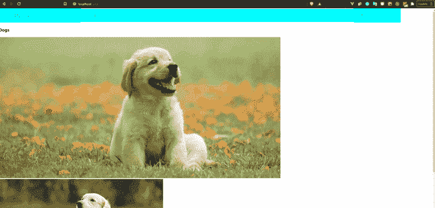

# 在 React - LogRocket 博客中创建导航栏

> 原文：<https://blog.logrocket.com/creating-navbar-react/>

多年来，导航条，或称 navbars，已经成为网站建设中的一个主要特征。它们在浏览网站时真的很方便。

在本教程中，我们将回顾在 React 中构建导航条的基础知识。例如，我们将构建一个固定在页面顶部的导航栏，用户可以像在仪表板上一样在网页之间切换。然后，我们将通过构建一个实时示例应用程序，将所有新发现的技能付诸实践。

我们的示例应用程序是一个动物图库，当我们在导航栏上单击动物名称后，我们将使用它来查看一些不同类型的动物的图片。

## 装置

让我们直接进入代码。要创建 React 应用程序，请确保您的计算机上安装了 Node.js。如果您以前没有构建 React 应用程序，您可以通过在终端中键入以下内容来检查是否安装了 Node.js:

```
node -v

```

如果没有，就去 Node.js 网站[下载最新版本](https://nodejs.org/en/download/)。

完成后，我们可以通过运行以下命令开始使用 React 应用程序:

```
npx create-react-app nav-bar                                             

```

然后，我们在终端上导航到我们的项目文件夹:

```
cd nav-bar

```

## 设置 React 路由器库

在我们的应用程序中使用[React 路由器库](https://blog.logrocket.com/react-router-v6/)允许我们在 React 中的不同页面或组件之间导航，并实际对每个页面或组件的 URL 进行这些更改。事实上，它还可以处理更复杂的功能，比如通过查询和嵌套路由在页面之间传递数据——但这超出了本文的范围。

对于这个例子，我们只需要安装 [React Router](https://reactrouter.com/web/guides/quick-start) 库，当我们点击链接上的动物名称时，它可以帮助我们切换应用程序中动物的视图。

```
npm install react-router-dom

```

首先，我们将构建导航栏本身。为此，我们将在`src/components/navbar`中创建一个名为`navbar.js`的文件:

```
import React from 'react';
import {  Link } from "react-router-dom";
const navbar= () =>{
  return (
  <div>
    <li>
      <Link to="/">Dogs</Link>
    </li>
    <li>
      <Link to="/cats">Cats</Link>
    </li>
    <li>
      <Link to="/sheeps">Sheeps</Link>
    </li>
    <li>
      <Link to="/goats">Goats</Link>
    </li>
  </div>
  );
}
export default navbar;

```

我们必须从已经安装的 react-router-dom 库中导入`Link`。`<Link>`来自 React 路由器库，允许我们在`to`属性中导航到确切的路由名称。它所做的是转换属性中的任何内容(文本、图像等)。)成链接。当您点击它时，您将被带到已经在`to`属性中指示的路线。

## 创建单独的`to`属性链接

回到我们的例子——我们在`to`属性中列出了动物的名字，每个名字都会链接到相应的动物页面。现在，让我们为导航栏中列出的动物创建组件。

我们将它们放在`src/pages/navbar`中，就像这样:

### Dogs.js

```
import React from 'react';
const Dogs = () =>{
  return (
    <div>
      <h3>Dogs</h3>
      <div>
        
        
      </div>
    </div>
  );
}
export default Dogs;

Dogs.js

```

### 猫. js

```
import React from 'react';
const Cats = () =>{
  return (
    <div>
      <h3>Cats</h3>
      <div>
        
        
      </div>
    </div>
  );
}
export default Cats;

Cats.js

```

### Sheeps.js

```
import React from 'react';
const Sheeps = () =>{
  return (
    <div>
      <h3>Sheeps</h3>
      <div>
        
        
      </div>
    </div>
  );
}
export default Sheeps;

Sheep.js

```

### 山羊. js

```
import React from 'react';
const Goats = () =>{
  return (
    <div>
      <h3>Goat</h3>
      <div>
        
        
      </div>
    </div>
  );
}
export default Goats;

Goat.js

```

你会注意到每个动物页面的代码都是一样的。

现在，进入您的`App.js`，将 react-router-dom 导入您的项目:

```
import './App.css';
import { BrowserRouter as Router, Switch, Route } from "react-router-dom";
import navbar from "./components/navbar"
import Dogs from "./pages/Dogs"
import Cats from "./pages/Cats"
import Sheeps from "./pages/Sheeps"
import Goats from "./pages/Goats"
function App() {
  return (
    <Router>
      <navbar />
      <Switch>
        <Route path='/' exact component={Dogs} />
        <Route path='/cats' component={Cats} />
        <Route path='/sheeps' component={Sheeps} />
        <Route path='/goats' component={Goats} />
      </Switch>
    </Router>
  );
}

export default App;

```

在导入 react-router-dom 时，可以选择导入我们需要的具体东西。这里，我们将导入`BrowserRouter`(为了清楚起见，我们将其重命名为`Router`)，`Switch`来帮助我们一次在一个页面之间移动，而`Route`用来定义每个路径及其相关的组件或页面。默认情况下，一旦页面加载，用户就会被带到带有空路径`*path*='/'`的组件。在我们的例子中，用户最初被发送到`Dogs.js`。

`navbar`在我们的`Switch`之外，因为我们希望它永远在我们页面的顶部，所以当我们在不同的动物组件之间切换时，它不受影响。

## 检查我们的结果

让我们启动服务器来查看我们的最终产品。只需运行下面的命令:

```
npm start

```



让我们快速回顾一下我们所做的事情。首先，我们使用 Create React App 开始这个项目，然后我们安装了 react-router-dom 库。一旦我们的项目完成了这些，我们就构建了导航条本身，并且为每个动物添加了组件。

最后，我们进入`App.js`并使用 react 路由器将导航栏上的名称连接到相应的组件。

## 结论

恭喜你，你已经在 React 中成功构建了你的第一个导航条。你可以在我的 GitHub 上找到[样例项目。尽管我们的 navbar 可以实现更复杂的路由，但这应该足以通过 navbar 处理不同组件之间的简单路由。](https://github.com/Atanda1/react-navbar)

## [LogRocket](https://lp.logrocket.com/blg/react-signup-general) :全面了解您的生产 React 应用

调试 React 应用程序可能很困难，尤其是当用户遇到难以重现的问题时。如果您对监视和跟踪 Redux 状态、自动显示 JavaScript 错误以及跟踪缓慢的网络请求和组件加载时间感兴趣，

[try LogRocket](https://lp.logrocket.com/blg/react-signup-general)

.

[ ](https://lp.logrocket.com/blg/react-signup-general) [](https://lp.logrocket.com/blg/react-signup-general) 

LogRocket 结合了会话回放、产品分析和错误跟踪，使软件团队能够创建理想的 web 和移动产品体验。这对你来说意味着什么？

LogRocket 不是猜测错误发生的原因，也不是要求用户提供截图和日志转储，而是让您回放问题，就像它们发生在您自己的浏览器中一样，以快速了解哪里出错了。

不再有嘈杂的警报。智能错误跟踪允许您对问题进行分类，然后从中学习。获得有影响的用户问题的通知，而不是误报。警报越少，有用的信号越多。

LogRocket Redux 中间件包为您的用户会话增加了一层额外的可见性。LogRocket 记录 Redux 存储中的所有操作和状态。

现代化您调试 React 应用的方式— [开始免费监控](https://lp.logrocket.com/blg/react-signup-general)。