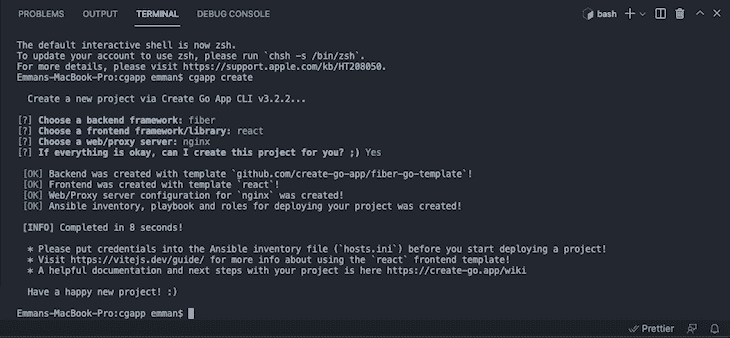
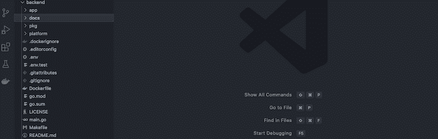
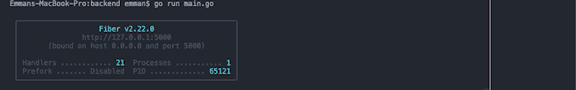
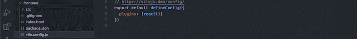
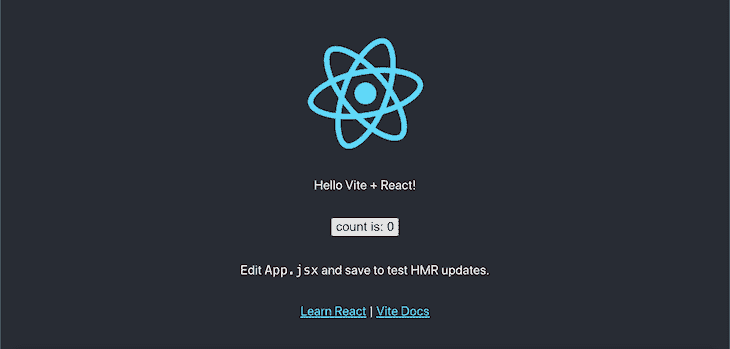
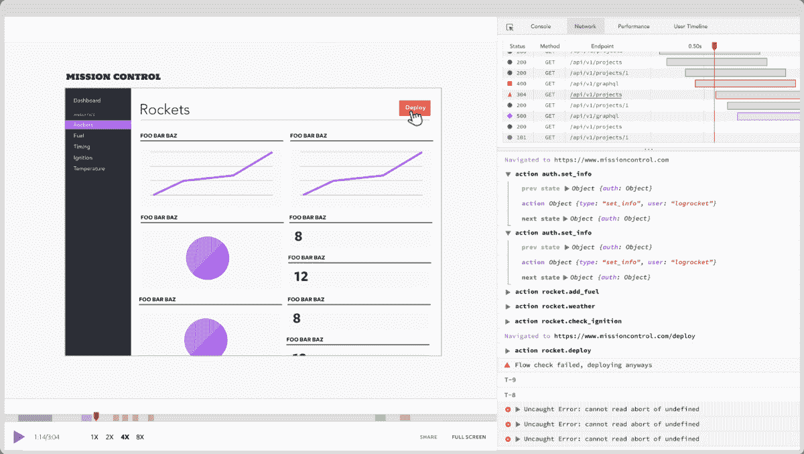

# 使用 Create Go 应用程序创建 PWA-log rocket 博客

> 原文：<https://blog.logrocket.com/creating-pwa-create-go-app/>

Google 的 Go 编程语言已经在各种软件开发领域取得了重大进展。凭借内存安全、垃圾收集、静态类型和并发性等语言效率，Go 在构建可伸缩软件的首选编程语言中赢得了一席之地。

尽管 Go 取得了巨大的增长和成功，但大多数开发人员仍然发现从头开始构建一个生产就绪的 Go 应用程序很困难。然而， [Create Go App](https://github.com/create-go-app/cli) ，一个类似于[流行的 Create React App](https://blog.logrocket.com/getting-started-with-create-react-app-d93147444a27/) 的 CLI，让开发者更容易搭建生产就绪的 Go 应用，提供选择前端库的选项，如 React、Svelte、Preact、Vue 等。从软件包附带的一系列选项中选择。

在本教程中，我们将学习如何在后端使用 Go，在前端使用 React 来搭建 PWA。您将熟悉 Create Go App 项目结构，深入了解该包，并学习如何构建可扩展的 Go PWA。

### 先决条件

要跟随本教程，您需要:

*   安装在您的机器上
*   对艾滋病毒/艾滋病的基本了解
*   熟悉 Golang
*   安装在您机器上的网络浏览器
*   代码编辑器，即 VS 代码

我们开始吧！

## 入门指南

在我们开始之前，[检查您是否已经在您的机器上安装了 Go≥v . 16](https://go.dev/dl/)，因为这是 Create Go 应用程序包所要求的。

安装完成后，打开终端并运行以下命令下载并安装 Create Go 应用程序包:

```
go install github.com/create-go-app/cli/v3/cmd/[email protected]

```

如果您使用的是 macOS，也可以通过以下选项进行安装:

```
# Tap a new formula:
brew tap create-go-app/cli
//
# Installation:
brew install create-go-app/cli/cgapp

```

在下一节中，我们将使用 Create Go 应用程序包初始化一个新项目，并开始构建我们的 PWA。

## 生成 PWA 支架

要初始化新的 Create Go 应用程序项目，请导航至 Go 工作区，创建名为`cgapp`的新文件夹，并运行以下命令:

```
cgapp create

```

在 CLI 的交互 UI 中选择 **React** 作为您的前端。初始化完成后，您应该会得到类似于下面截图的输出:



接下来，在代码编辑器中打开新生成的文件夹。我们来讨论一下文件夹结构。

如果您选择了`net/http`作为后端框架，您的后端 Go 应用程序将使用 Create Go 应用程序的创建者开发的`net/http`模板生成。类似地，通过选择`fiber`选项，您将拥有一个自动化的模板。

Create Go App 使用一个`makefile`来搭建、运行和构建后端和前端，使用一组预定义的 shell 命令，看起来像一个典型的 npm 命令。Create Go 应用程序根目录中的默认`makefile`如下所示:

```
.PHONY: test run build
FRONTEND_PATH = $(PWD)/frontend
BACKEND_PATH = $(PWD)/backend
test:
    @if [ -d "$(FRONTEND_PATH)" ]; then cd $(FRONTEND_PATH) && npm run test; fi
    @if [ -d "$(BACKEND_PATH)" ]; then cd $(BACKEND_PATH) && go test ./...; fi
run: test
    @if [ -d "$(FRONTEND_PATH)" ]; then cd $(FRONTEND_PATH) && npm run dev; fi
    @if [ -d "$(BACKEND_PATH)" ]; then cd $(BACKEND_PATH) && $(MAKE) run; fi
build: test
    @if [ -d "$(FRONTEND_PATH)" ]; then cd $(FRONTEND_PATH) && npm run build; fi
    @if [ -d "$(BACKEND_PATH)" ]; then cd $(BACKEND_PATH) && $(MAKE) build; fi

```

从上面的 shell 脚本中，使用`PWD`访问到前端和后端的路径，然后分别存储在`FRONTEND_PATH`和`BACKEND_PATH`上。

`test`命令通过结合使用 Bash 和 npm 命令导航到每个文件夹，在前端和后端运行测试。同样的方法也适用于`run`和`build`命令。

## 了解文件夹结构

既然您已经对我们的 Create Go App 项目结构有了一个概念，那么让我们来讨论构建 PWA 所需的两个基本目录。然后，我们将在 Create Go 应用程序中查看其配置和设置。

正如您已经知道的，每个 PWA 都应该将前端和后端技术在逻辑上相互分离，支持软件开发的干净架构模式。

### 后端

后端的文件夹结构如下图所示:



`app`文件夹保存构成应用程序逻辑的文件夹和文件，包括控制器、模型和查询。这种方法提供了一种独特的方式，从一开始就构建可伸缩的应用程序，而不必担心未来的文件夹结构。

考虑到文档在构建 RESTful APIs 或服务中的作用，`docs`文件夹是 Create Go App 的独特功能之一，包含使用 [Swagger](https://swagger.io/) 自动生成 API 文档的配置文件。

`pkg`文件夹包含`configuration`、`middlewares`、`repositories`、`routes`和`utils`文件，这些文件是专门为项目的业务逻辑定制的。

`platform`文件夹保存构成项目业务逻辑的外部逻辑，包括缓存、数据库和迁移。您可以将`platform`文件夹视为您的服务文件夹，其中包含您所有的外部服务。

`.env`保存所有应用程序的凭证，如应用程序名称、数据库凭证、JWT 凭证、主机、端口等等。最后，`.Dockerfile`为部署创建项目的 Docker 映像。

要启动后端服务器，请使用您的服务器配置更新`.env`文件，并运行以下命令:

```
go run main.go

```

您应该让后端服务器运行，并在终端上显示详细信息。输出应该类似于下面的屏幕截图:



您可以通过`[http://127.0.0.1:5000](http://127.0.0.1:5000)`访问您的服务器，但是，您的端点的实际 URL 应该是`[http://127.0.0.1:5000/api/v1/](http://127.0.0.1:5000/api/v1/){query}`。打开`pkg/routes`查看可用路线。

### 前端

在本教程中，我们使用 React 为前端生成了 PWA 支架，但是，您可以使用不同的框架或库。如果你已经熟悉 React，你应该对前端文件夹结构有一个清晰的了解，看起来像下面的截图:



注意这个`vite.config.js`文件。Create Go 应用附带的 React 模板不是由常规的 Create React 应用生成的，而是与 [Vite npm 模块](https://vitejs.dev)捆绑在一起的。Vite 是一个替代 Babel 和 webpack 的前端工具 npm 包。Vite 包括即时服务器、模块替换、资产优化等功能。

典型的 Vite 配置类似于下面的代码片段:

```
import { defineConfig } from 'vite'
import react from '@vitejs/plugin-react'
// https://vitejs.dev/config/
export default defineConfig({
  plugins: [react()]
})

```

上面的配置将插件设置为`[react()]`，告诉 Vite 应该为 React 构建项目。要启动开发服务器，请导航到前端文件夹，然后运行下面的命令来安装所需的依赖项:

```
npm i 

```

您应该会得到类似下面截图的输出:


按`CMD + click`在网络浏览器中打开链接:



现在，您可以开始构建您的 PWA，甚至将您的项目部署到生产服务器上。

## 部署您的 PWA

为了部署项目，我们将在系统中安装 [Docker](https://www.docker.com/) 、 [Python v3.8+](https://www.python.org/downloads/) 和 [Ansible v2.5](https://docs.ansible.com/ansible/latest/installation_guide/intro_installation.html#installing-ansible-on-specific-operating-systems) 。然后，我们将使用我们的服务器配置更新`hosts.ini`文件。

Create Go App 在后台使用 Ansible Python 库进行自动部署，使我们的系统充当您的远程项目的服务器。要部署项目，请通过您的终端运行下面的 Create Go App 命令:

```
cgapp deploy

```

这就是您将项目部署到活动服务器所需的全部内容！

## 结论

Create Go App 附带了无缝构建和部署生产就绪、可扩展的 Go 应用程序所需的技术，同时仍保持最佳实践。在本文中，我们通过从头构建 PWA 来探索 Create Go 应用程序，从我们的支架开始，最后是我们的应用程序的后端和前端。我希望你喜欢这篇文章。

## 使用 [LogRocket](https://lp.logrocket.com/blg/signup) 消除传统错误报告的干扰

[](https://lp.logrocket.com/blg/signup)

[LogRocket](https://lp.logrocket.com/blg/signup) 是一个数字体验分析解决方案，它可以保护您免受数百个假阳性错误警报的影响，只针对几个真正重要的项目。LogRocket 会告诉您应用程序中实际影响用户的最具影响力的 bug 和 UX 问题。

然后，使用具有深层技术遥测的会话重放来确切地查看用户看到了什么以及是什么导致了问题，就像你在他们身后看一样。

LogRocket 自动聚合客户端错误、JS 异常、前端性能指标和用户交互。然后 LogRocket 使用机器学习来告诉你哪些问题正在影响大多数用户，并提供你需要修复它的上下文。

关注重要的 bug—[今天就试试 LogRocket】。](https://lp.logrocket.com/blg/signup-issue-free)