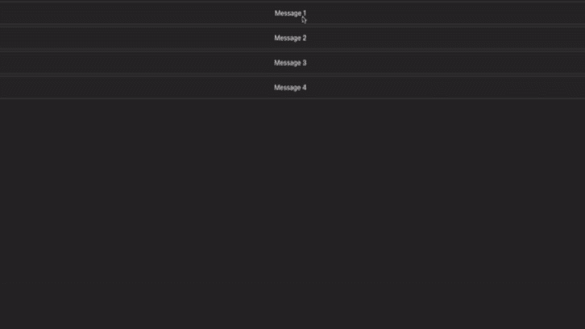
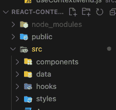
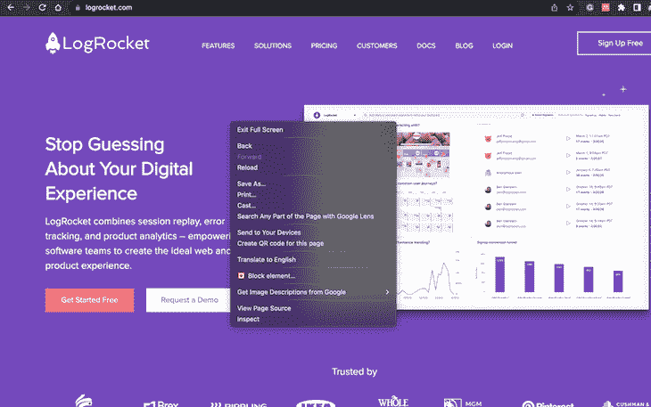
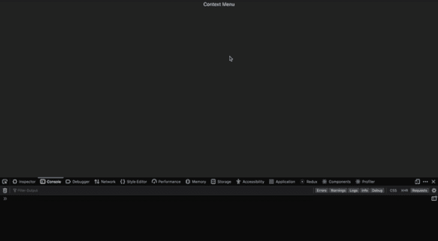
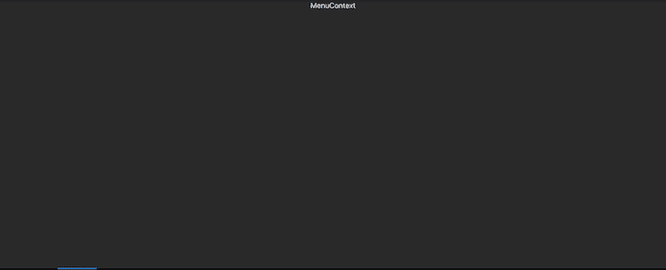
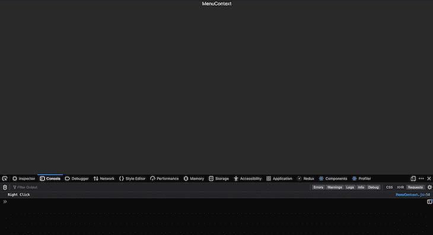
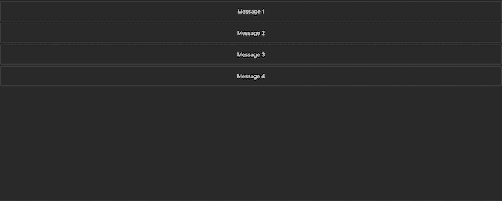
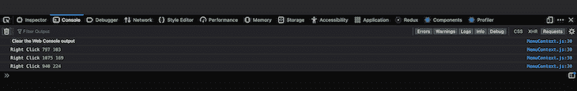
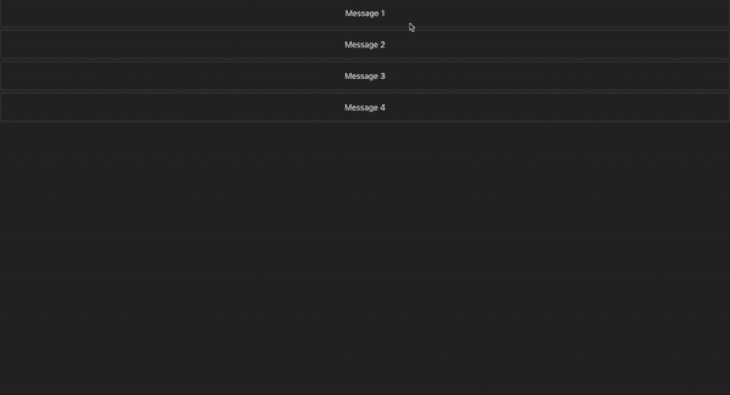

# 创建一个 React 上下文菜单

> 原文：<https://blog.logrocket.com/creating-react-context-menu/>

***编者按:*** *这个创建 React 上下文菜单的指南最后一次更新是在 2022 年 12 月 5 日，目的是更新 [React 路由器 v6 的信息。](https://blog.logrocket.com/migrating-react-router-v6-guide/)此次更新还包括了关于禁用右键上下文菜单和在 React 中创建自定义上下文菜单挂钩的新内容。*

如果您在访问网站时右键单击浏览器，您可以看到操作系统的本机上下文菜单。在那里，你可以保存、打印、创建网页的二维码等等。如果高亮显示文本，您可以看到复制、粘贴和剪切等选项。你也可以在电子邮件或列表应用程序和协作应用程序(如 Trello 和 imponent)上看到定制的上下文菜单。这些右键菜单(也称为上下文菜单)在用户使用应用程序时为他们提供了更多的选项。

这篇文章将探讨如何创建一个 [React](https://blog.logrocket.com/tag/react/) 上下文菜单，激活右键菜单的快捷方式，以及如何创建一个[自定义上下文菜单钩子](https://blog.logrocket.com/react-render-props-vs-custom-hooks/)。

你可以看到下面的项目演示，并在 GitHub 或[部署的网站](https://react-context-menu-livid.vercel.app/)上查看[完整的代码](https://codesandbox.io/p/github/Taofiqq/react-context-menu/main?file=%2FREADME.md)。

*向前跳转:*

[上下文菜单](https://en.wikipedia.org/wiki/Context_menu)(也称为右击菜单)是在用户交互时出现的图形用户界面(GUI)菜单，例如右击鼠标操作。上下文菜单在菜单所属的操作系统或应用程序的当前状态或上下文中提供了一组有限的可用选项。

## 开始我们的 React 项目

要开始在 React 中创建自定义右键菜单，我们将使用`npx create-react-app react-context-menu`命令初始化 React 项目，然后使用`cd react-context-menu`命令进入项目文件夹。在本教程中，我们将使用[样式化组件](https://styled-components.com/https://blog.logrocket.com/benefits-using-styled-components-react/)进行样式化:



### 项目和文件夹结构

在我们的`src`文件中，我们将创建四个文件夹:

*   这将容纳我们将在整个项目中使用的所有组件
*   `data`:存储将在网页上呈现的数据信息
*   `hooks`:这是我们为右键上下文菜单创建挂钩的地方
*   这个文件夹将包含我们所有风格的文件



如果你打开 Chrome 或 Mozilla 浏览器，右击任意位置，你会看到默认的浏览器上下文菜单，如下所示:



我们将使用`onContextMenu`属性在我们的`App.js`文件中禁用这个默认行为。它看起来会像这样:

```
src/App.js

 import "./App.css";
function App() {
  return (
    <div
      className="App"
      onContextMenu={(e) => {
        e.preventDefault(); // prevent the default behaviour when right clicked
        console.log("Right Click");
      }}
    >
      Context Menu
      </div>
  );
}
export default App;

```

现在，让我们看看浏览器中有什么:



正如你所看到的，当浏览器的任何其他**部分被右击时，默认菜单出现，但是当**上下文**被右击时，它不出现，并且一个文本被记录在控制台中。**

首先，我们将在`data`文件夹中创建一个`data.js`文件，并用我们将在项目中使用的数据填充它:

```
src/data.js

export const data = [
  {
    id: 1,
    title: "Message 1",
  },
  {
    id: 2,
    title: "Message 2",
  },
  {
    id: 3,
    title: "Message 3",
  },
  {
    id: 4,
    title: "Message 4",
  },
];

```

然后，我们将在`component`文件夹中创建一个名为`MenuContext.js`的新组件，并在我们的`App.js`中使用这个组件:

```
src/App.js

import "./App.css";
import MenuContext from "./components/MenuContext";
import { data } from "./data/data";
function App() {
  return (
    <div className="App">
      <MenuContext  />
    </div>
  );
}
export default App;

src/component/MenuContext.js

import React, { useState, useEffect } from "react";
const MenuContext = () => {
  return (
    <div>
      MenuContext
    </div>
  );
};
export default MenuContext;

```

现在，我们的浏览器中应该有这样的内容:



在上一节中，我们提到需要禁用浏览器的默认右键上下文菜单。我们将使用`onContextMenu`道具，如前所述:

```
src/component/MenuContext.js

    <div
      onContextMenu={(e) => {
        e.preventDefault();
        console.log("Right Click");
      }}
    >
      MenuContext
    </div>

```

这里，我们使用`onContextMenu`来防止默认的浏览器上下文菜单行为，并使用`event method`来防止浏览器的默认行为。控制台日志被指定为当我们在浏览器中右键单击时在控制台中显示文本，因为我们无法再次看到浏览器的默认上下文菜单:



在右键单击并阻止默认浏览器行为之后，一个文本被记录到控制台(`Right Click`)中，以显示我们右键单击了。

既然默认的右键自定义菜单已经被禁用，我们可以继续自定义右键菜单的实现。

首先，我们将数据导入到`App.js`中，并将其作为道具传递给`MenuContext`组件。在`MenuContext`中，我们将析构这个道具(`data`)并映射到它上面，以将我们的数据呈现到浏览器 UI:

```
src/App.js

import "./App.css";
import MenuContext from "./components/MenuContext";
import { data } from "./data/data";
function App() {
  return (
    <div className="App">
      <MenuContext data={data} />
    </div>
  );
}
export default App;

src/components/MenuContext.js

import React, { useState, useEffect } from "react";
import Menu from "./Menu";
const MenuContext = ({ data }) => {
   return (
    <div>
      {data.map((item) => (
        <div
          onContextMenu={(e) => {
            e.preventDefault();
            console.log("Right Click", e.pageX, e.pageY);
          }}
        >
          <Menu key={item.id} title={item.title} />
        </div>
      ))}
    </div>
  );
};
export default MenuContext;

```

这里，我们映射数据数组，返回一个`Menu`组件，并传入`ID`和`title`。在`Menu.js`文件中，我们将如下使用这两个道具:

```
src/components/Menu.js

import React from "react";
import { MenuContextContainer } from "../styles/styles";
const Menu = ({ title, key }) => {
  return (
    <>
      <MenuContextContainer key={key}>{title}</MenuContextContainer>
    </>
  );
};
export default Menu;

```

`MenuContextContainer`是来自`styles`文件的[样式组件](https://blog.logrocket.com/using-styled-components-in-react/)；

```
src/styles/styles.js

import styled, { css } from "styled-components";
export const MenuContextContainer = styled.div`
  border: 1px solid #ffffff2d;
  border-radius: 4px;
  padding: 18px;
  margin: 5px 0;
  box-sizing: border-box;
`;

```

现在，我们可以检查浏览器中的内容:



当我们点击任何**消息框**时，一个控制台文本`"Right Click"`将被记录。现在，我们需要实现它，当任何一个**框**被右击时，右键上下文菜单显示一次，而不是四次。这是因为我们在 UI 上呈现了四个项目，鼠标指向哪里，菜单就显示在哪里:

```
src/compoennts/MenuContext.js

import React, { useState, useEffect } from "react";
import { ContextMenu } from "../styles/styles";
import Menu from "./Menu";
const MenuContext = ({ data }) => {
  const [clicked, setClicked] = useState(false);
  const [points, setPoints] = useState({
    x: 0,
    y: 0,
  });
  useEffect(() => {
    const handleClick = () => setClicked(false);
    window.addEventListener("click", handleClick);
    return () => {
      window.removeEventListener("click", handleClick);
    };
  }, []);
  return (
    <div>
      {data.map((item) => (
        <div
          onContextMenu={(e) => {
            e.preventDefault();
            setClicked(true);
            setPoints({
              x: e.pageX,
              y: e.pageY,
            });
            console.log("Right Click", e.pageX, e.pageY);
          }}
        >
          <Menu id={item.id} title={item.title} />
        </div>
      ))}
      {clicked && (
        <ContextMenu top={points.y} left={points.x}>
          <ul>
            <li>Edit</li>
            <li>Copy</li>
            <li>Delete</li>
          </ul>
        </ContextMenu>
      )}
    </div>
  );
};
export default MenuContext;

```

在`MenuContext.js`文件中，我们创建了两个状态:`clicked` 和`points`。当鼠标右键单击时，`clicked`状态(带有布尔值)将被监控。`points`(带有一个对象状态)将被用来获取点击**鼠标**的位置的`x`和`y`坐标。

## 使用`useEffect`挂钩

`x`和`y`的值将默认设置为`0`。然后，我们必须让它在我们点击**页面**的任何地方时，上下文菜单消失，就像它为默认的自定义右键菜单文本工作一样。为此，我们将通过调用 [`useEffect`钩子](https://blog.logrocket.com/a-guide-to-usestate-in-react-ecb9952e406c/)并创建一个名为`handleClick`的函数，在窗口上注册一个事件监听器。我们还会将`clicked`状态设置为`false`以不显示它。

然后，我们将引用该窗口，调用`addEventListener`方法，并注册一个`click`事件，以便每当我们在窗口或浏览器中单击任何地方时，该文档将调用`handle click`。最后，我们将为[附加一个清理函数](https://blog.logrocket.com/understanding-react-useeffect-cleanup-function/)来移除事件监听器，以避免内存泄漏。

事件对象包含被点击的当前**坐标**的值。为了更清楚，我们可以在`onContextMenu`属性中记录`e.x`和`e.y`:

```
src/MenuContext.js

  <div>
      {data.map((item) => (
        <div
          onContextMenu={(e) => {
            e.preventDefault();
            setClicked(true);
            setPoints({
              x: e.pageX,
              y: e.pageY,
            });
            console.log("Right Click", e.pageX, e.pageY);
          }}
        >
          <Menu id={item.id} title={item.title} />
        </div>
      ))}
      {clicked && (
        <ContextMenu top={points.y} left={points.x}>
          <ul>
            <li>Edit</li>
            <li>Copy</li>
            <li>Delete</li>
          </ul>
        </ContextMenu>
      )}
    </div>

```

现在，我们可以检查控制台，看看当我们单击浏览器上的不同位置时记录了什么:



我点击了四个呈现项目的地方，记录或返回了`x`和`y`坐标值。

在`div`包装和我们的`Menu`项目中(这里我们已经初始化了`onCotextMenu`道具)，我们将把`clicked`状态设置为`true`，把`points`设置为被点击的`x`和`y`坐标。

`ContextMenu`是`styles.js`文件中的一个 div 样式。只有当 clicked 为 true 时才会显示。例如，只有当任何一个**消息框**被点击时，因为我们在包装`message boxes`元素的`div`中将`click`设置为`true`。

记住，我们的`clicked`状态的默认值是`false`。`x`和`y`的值被作为道具传递给`ContextMenu` div，并用于设置上下文菜单应该显示的位置。最后，在`ContextMenu`中创建了一个无序列表，当右键单击任意一个**项** ( `Message 1- 4`)时就会显示出来:

```
src/styles/styles.js

import styled, { css } from "styled-components";
export const MenuContextContainer = styled.div`
  border: 1px solid #ffffff2d;
  border-radius: 4px;
  padding: 18px;
  margin: 5px 0;
  box-sizing: border-box;
`;
export const ContextMenu = styled.div`
  position: absolute;
  width: 200px;
  background-color: #383838;
  border-radius: 5px;
  box-sizing: border-box;
  ${({ top, left }) => css`
    top: ${top}px;
    left: ${left}px;
  `}
  ul {
    box-sizing: border-box;
    padding: 10px;
    margin: 0;
    list-style: none;
  }
  ul li {
    padding: 18px 12px;
  }
  /* hover */
  ul li:hover {
    cursor: pointer;
    background-color: #000000;
  }
`;

```

现在，我们可以检查浏览器中的内容:



为了创建一个定制的右键上下文菜单钩子，我们将创建一个名为`useContextMenu.js`的文件，在这里我们将创建钩子函数。此外，我们将在`components`文件夹中创建一个名为`MenuContextHook.js`的附加文件:

```
src/hooks/useContextMenu

import { useState, useEffect } from "react";
const useContextMenu = () => {
  const [clicked, setClicked] = useState(false);
  const [points, setPoints] = useState({
    x: 0,
    y: 0,
  });
  useEffect(() => {
    const handleClick = () => setClicked(false);
    document.addEventListener("click", handleClick);
    return () => {
      document.removeEventListener("click", handleClick);
    };
  }, []);
  return {
    clicked,
    setClicked,
    points,
    setPoints,
  };
};
export default useContextMenu;

```

在`useContexMenu`钩子中，我们声明了两种状态:`clicked`和`points`——就像上一节一样。然后，我们使用`useEffect`钩子注册一个事件监听器，并用清理函数清理事件。最后，返回`clicked`、`setClicked`、`points`和`setPoints`。

在`MenuContextHook.js`文件中，我们将如下使用这个钩子:

```
src/components/MenuContextHook.js

import React from "react";
import useContextMenu from "../hooks/useContextMenu";
import { ContextMenu } from "../styles/styles";
import Menu from "./Menu";
const MenuContextHook = ({ data }) => {
  const { clicked, setClicked, points, setPoints } = useContextMenu();
  return (
    <div>
      {data.map((item) => (
        <div
          onContextMenu={(e) => {
            e.preventDefault();
            setClicked(true);
            setPoints({
              x: e.pageX,
              y: e.pageY,
            });
            console.log("Right Click", e.pageX, e.pageY);
          }}
        >
          <Menu key={item.id} title={item.title} />
        </div>
      ))}
      {clicked && (
        <ContextMenu top={points.y} left={points.x}>
          <ul>
            <li>Edit</li>
            <li>Copy</li>
            <li>Delete</li>
          </ul>
        </ContextMenu>
      )}
    </div>
  );
};
export default MenuContextHook;

```

基本上，在这个文件中，我们从`useContextMenu`钩子中重组了`clicked`、`setClicked`、`points`和`setPoints`，并使用它来创建定制的右键菜单，如前一节所述。

## 结论和考虑

本文介绍了在 React 应用程序中创建自定义上下文菜单的许多方法。请记住，如果您正在 React 中创建自定义上下文菜单，请考虑[移动交互](https://blog.logrocket.com/ux-design/designing-microinteractions-better-app-ux/)。如果用户使用移动电话，他们可能无法右键单击。

因此，您可能需要再三考虑为什么需要自定义上下文菜单。如果用户想看到默认菜单，这会导致不好的体验。

## 使用 LogRocket 消除传统反应错误报告的噪音

[LogRocket](https://lp.logrocket.com/blg/react-signup-issue-free)

是一款 React analytics 解决方案，可保护您免受数百个误报错误警报的影响，只针对少数真正重要的项目。LogRocket 告诉您 React 应用程序中实际影响用户的最具影响力的 bug 和 UX 问题。

[ ](https://lp.logrocket.com/blg/react-signup-general) [  ](https://lp.logrocket.com/blg/react-signup-general) [LogRocket](https://lp.logrocket.com/blg/react-signup-issue-free)

自动聚合客户端错误、反应错误边界、还原状态、缓慢的组件加载时间、JS 异常、前端性能指标和用户交互。然后，LogRocket 使用机器学习来通知您影响大多数用户的最具影响力的问题，并提供您修复它所需的上下文。

关注重要的 React bug—[今天就试试 LogRocket】。](https://lp.logrocket.com/blg/react-signup-issue-free)