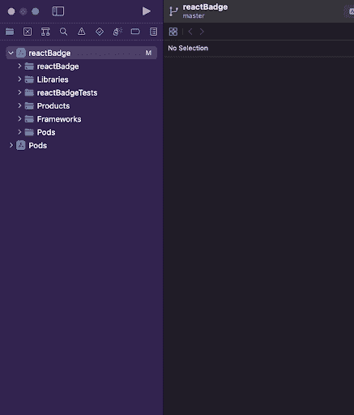
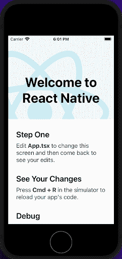
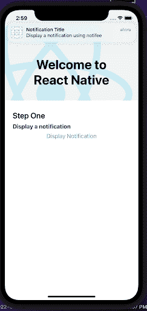
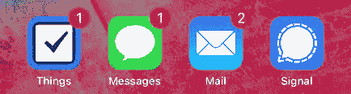
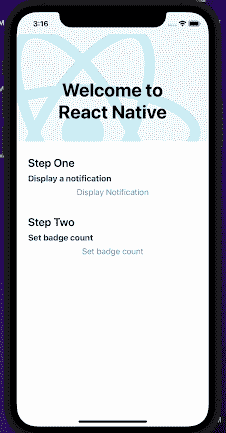
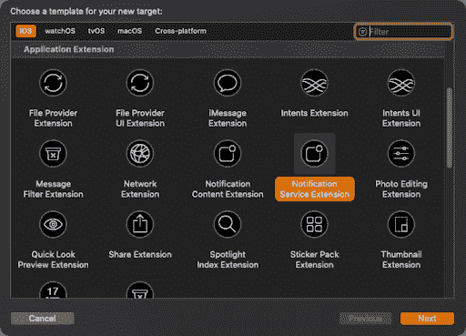
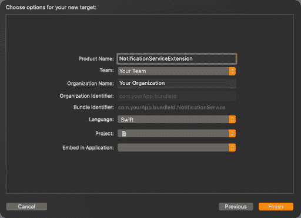
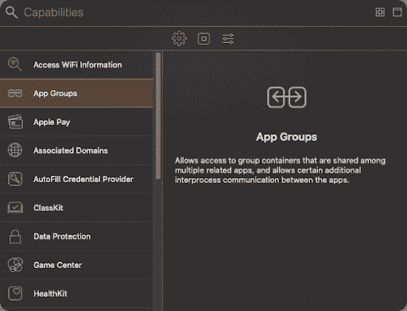
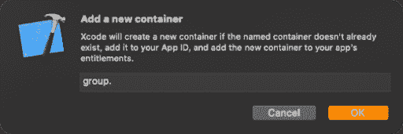
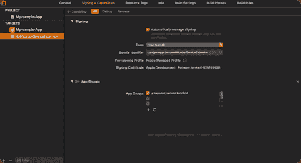

# 在 iOS 中创建 React 原生徽章组件

> 原文：<https://blog.logrocket.com/creating-react-native-badge-components-ios/>

徽章是提醒用户与应用程序相关的重要发展的有效工具。它们可以显示应用程序的未决通知数量，显示离某个截止日期还有几天，提醒用户有评论等等。

在本文中，我们将学习如何将通知徽章组件集成到一个 [React Native](https://reactnative.dev/) 项目中，并探索徽章如何提高用户体验‌and 驱动参与度。我们还将了解[通知](https://notifee.app/)，设置徽章数量的各种方法，以及如何动态清除徽章数量。我们还将简要了解推送通知如何使徽章计数器被动态触发。要了解更多关于 React Native 的信息，请查看 [React Native 档案](https://blog.logrocket.com/tag/react-native/)。

*向前跳转:*

## 先决条件

要跟随本教程，您需要:

*   Node.js :异步事件驱动的 JavaScript 运行时，设计用于构建可伸缩的应用程序
*   Watchman:监视文件并在有变化时触发动作的服务
*   Xcode :这个 IDE 包含了在苹果平台上开发、测试和发布应用程序所需的一切
*   [CocoaPods](https://cocoapods.org/) :负责 [Swift](https://developer.apple.com/xcode/swiftui/) 和 [Objective-C](https://developer.apple.com/library/archive/documentation/Cocoa/Conceptual/ProgrammingWithObjectiveC/Introduction/Introduction.html) 可可项目的依赖关系经理
*   这个库为 Android 和 iOS 应用程序都带来了本地通知支持，但是没有集成第三方消息服务

## 在 React Native 中管理徽章

让我们探索使用通知库[notifie](https://notifee.app/react-native/docs/ios/badges)在 iOS 中设置和操作通知徽章的不同方法。首先，参考 React Native [文档](https://reactnative.dev/docs/environment-setup)，通过设置开发环境来创建 React Native app。

现在，使用 React Native CLI，让我们使用以下命令创建我们的项目:

```
$ npx react-native init reactBadge --template react-native-template-typescript
```

一旦项目被创建，在终端窗口中`cd`进入项目目录。

```
$ cd
$ yarn start
```

运行以下命令添加 Notifee 包:

```
$ yarn add @notifee/react-native
```

一旦完成，就从`cd`变成`iOS`。

```
$ cd ios
$ pod install
```

对于本教程，我使用了一台 Mac M1 架构的机器。然而，CocoaPods 与该架构不兼容，所以请记住，以下命令在其他 MAC 上可能会有所不同。如果你没有使用 M1 架构，你可以在`iOS`的`cd`之后运行`pod install`。

如果使用装有 Mac M1 的计算机，请运行以下命令:

```
$ cd ios 
$ sudo arch -x86_64 gem install ffi
$ arch -x86-64 pod install
```

这些命令会安装`[ffi](https://pub.dev/packages/ffi)`，它会加载动态链接库，并使 Mac M1 能够顺利运行`pod install`。

现在打开 Xcode，点击**打开一个项目** **或者** **文件**。


导航到保存`reactBadge`的文件夹目录，并打开`iOS`文件夹。然后，双击 **`reactBadge.xcworkspace`** ，在 Xcode 中打开我们的 iOS 项目。



一旦完成，我们的文件夹结构应该看起来像上面的图片。点击顶部的**播放**，在模拟器中构建我们的 iOS 应用程序。



## 将 Notifee 与 React Native 一起使用

要设置徽章计数，请将`notifee`导入`App.tsx`。

```
import notifee from '@notifee/react-native';
```

通知是在移动设备中构建徽章通知系统的关键，因为徽章数量取决于接收和清除通知的数量。让我们看看如何使用 Notifee 在 React Native 中触发通知。

### 创建通知触发功能

对于 iOS 设备，我们必须在触发通知之前请求用户许可，而对于 Android 设备，我们必须创建一个通道。幸运的是，Notifee 提供了两个有用的函数来克服这些挑战:

*   `notifee.requestPermission()`在 iOS 设备的应用程序上显示通知或徽章计数之前，请求其许可
*   `notifee.createChannel({})`为 Android 设备应用程序创建一个`channelId`

让我们深入研究代码。首先，在`App.tsx`中，我们将创建一个用于显示通知的异步函数。单击时，这有两个目的:请求显示通知或创建频道的权限，以及显示我们创建的应用程序。

为此，将代码块粘贴到`App.tsx`中。

```
const App = () => {
 const isDarkMode = useColorScheme() === 'dark';

 const backgroundStyle = {
   backgroundColor: isDarkMode ? Colors.darker : Colors.lighter,
 };

 async function onDisplayNotification() {
   // Request permissions (required for iOS)
   await notifee.requestPermission();

   // Create a channel (required for Android)
   const channelId = await notifee.createChannel({
     id: 'default',
     name: 'Default Channel',
   });

   // Display a notification
   await notifee.displayNotification({
     title: 'Notification Title',
     body: 'Display a notification using notifee',
     android: {
       channelId,
       smallIcon: 'name-of-a-small-icon', // optional, defaults to 'ic_launcher'.
       // pressAction is needed if you want the notification to open the app when pressed
       pressAction: {
         id: 'default',
       },
     },
   });
 }
```

现在我们需要使用`Button from React Native`来触发通知。

```
import {Button} from 'react-native';
```

一旦按钮被导入，我们将把`onDisplayNotification`传递给`Button`组件的`onPress`处理程序。

```
return (
   <SafeAreaView style={backgroundStyle}>
     <StatusBar barStyle={isDarkMode ? 'light-content' : 'dark-content'} />
     <ScrollView
       contentInsetAdjustmentBehavior="automatic"
       style={backgroundStyle}>
       <Header />
       <View
         style={{
           backgroundColor: isDarkMode ? Colors.black : Colors.white,
         }}>
         <Section title="Step One">
           <Text style={styles.highlight}>Set badge count</Text>
         </Section>
         <Button
           title="Display Notification"
           onPress={() => onDisplayNotification()}
         />
       </View>
     </ScrollView>
   </SafeAreaView>
 );
```

当我们点击 **`Display Notification`** 时，会触发并显示我们创建的通知。



### 在 React Native 中设置徽章计数

在 iOS 设备中，设备主屏幕上的应用程序图标将徽章数量显示为红色圆圈，图标的右上角有一个数字。这个数字表示用户有多少未读通知。



为了创建一个设置徽章数量的函数，我们将使用`setBadgeCount`。在`App.tsx`中，创建`setBadgeCount`，如下图所示:

```
 async function setBadgeCount() {
   // Set badge count
   notifee.setBadgeCount(53).then(() => console.log('Badge count set'));
 }
```

从那里，将`setBadgeCount`传递给`onPress`处理程序，以触发徽章计数的设置。

```
     <View
         style={{
           backgroundColor: isDarkMode ? Colors.black : Colors.white,
         }}>
         <Section title="Step One">
           <Text style={styles.highlight}>Display a notification</Text>
         </Section>
         <Button
           title="Display Notification"
           onPress={() => onDisplayNotification()}
         />
         <Section title="Step Two">
           <Text style={styles.highlight}>Set badge count</Text>
         </Section>
         <Button title="Set badge count" onPress={() => setBadgeCount()} />
       </View>

```



点击`setBadgeCount`，通过该方法传递的任何一个整数都将显示为`badgeCount`。


### 在 React Native 中清除徽章组件通知

创建通知时，UX 是需要考虑的重要因素。为了创建一个更好的 UX，我们希望`badgeCount`在应用程序打开时清除。为此，我们将通过将代码块粘贴到`App.tsx`中来使用`[useEffect](https://blog.logrocket.com/react-hooks-cheat-sheet-unlock-solutions-to-common-problems-af4caf699e70/)`。

```
React.useEffect(() => {
   // App launched, remove the badge count
   notifee.setBadgeCount(0).then(() => console.log('Badge count removed'));
 }, []);
```


## 启用远程推送通知

在 iOS 应用中启用远程推送通知是动态触发徽章计数器的另一种方式，并且无需用户操作。远程推送通知最能触发我们的徽章计数，从而提供更好的 UX。它们还包含少量数据，并将这些数据推送到我们的应用程序，即使设备没有运行。

在 iOS 设备上，发送通知需要四个关键组件:

*   公司的服务器
*   APNs
*   用户的设备
*   在用户设备上运行的应用程序

公司的服务器创建远程通知来确定发送什么通知以及发送时间，然后创建通知请求。这包含通知数据和用户设备的唯一标识符，然后转发给 APNs，由 APNs 处理对用户的交付。

然而，其他操作，如设置提供者服务器和配置应用程序来处理通知，是开发人员的责任。

要了解如何在 iOS 中设置远程推送通知服务，请查看这篇关于在 React Native with OneSignal 中实现推送通知的文章。对于希望为 Android 设置推送通知的开发人员，请参考这篇关于 React 和 Firebase 推送通知的[实用指南](https://blog.logrocket.com/push-notifications-react-firebase/)。

在本文中，我们将探索通知服务扩展的使用，它支持对原始通知的修改。

## 使用`UNNotificationServiceExtension`

[`UNNotificationServiceExtension`](https://developer.apple.com/documentation/usernotifications/unnotificationserviceextension) 对象为通知服务应用扩展提供了一个入口点。该扩展在系统向用户设备发送通知时启动。Xcode 为通知服务扩展目标提供了一个模板，并提供了我们将修改的子类。当我们的应用程序收到远程通知时，系统加载扩展并在以下条件下调用`[didReceive(_:withContentHandler:)](https://developer.apple.com/documentation/usernotifications/unnotificationserviceextension/1648229-didreceive)`方法。

*   应用程序必须配置为接收远程通知以显示警报
*   远程通知`aps`字典包括值设置为 1 的`mutable-content`。

在本节中，我们将修改收到的推送通知的内容，并在收到新的推送通知时增加徽章计数。

让我们开始吧。

首先，在 Xcode 内部我们的 React 原生项目的 iOS 应用中添加`UNNotificationServiceExtension`。



然后，添加一个适合您项目的产品名称。



要设置 app 群组，我们需要导航到 Xcode，选择**项目** - > **目标** - > **你的 app 目标** - > **签约&能力**->**[+]**->**App 群组**。



现在，在`App Groups`部分，选择**[+]**->-**添加一个新容器**->-**输入组名** - > **OK** 。



确保选择了之前创建的选定应用程序组。


最后，是时候为我们的`NotificationServiceExtension`创建`App Group`了。

在我们 Xcode 的项目目录下，点击**目标** - > **通知服务扩展目标** - > **签约和能力**->**[+】**->**App 组**。


选择之前在**应用目标**中创建的同一个**应用组**。



### 设置`usersuite`以存储徽章计数

我们需要创建一个`usersuite`来在我们的应用程序目标和通知服务目标之间传递数据。为此，请遵循以下步骤:

将代码块粘贴到`AppDelegate.swift`文件夹中。

```
func applicationWillEnterForeground(_ application: UIApplication) {    

 UserDefaults(suiteName: "group.com.yourApp.bundleId")?.set(1, forKey: "count")      UIApplication.shared.applicationIconBadgeNumber = 0  

}

```

接下来，我们将创建一个逻辑，用于在收到通知时增加我们的工卡计数。

```
import UserNotifications

class NotificationService: UNNotificationServiceExtension {

    var contentHandler: ((UNNotificationContent) -> Void)?
    var bestAttemptContent: UNMutableNotificationContent?
    let defaults = UserDefaults(suiteName: "group.com.yourApp.bundleId")

    override func didReceive(_ request: UNNotificationRequest, withContentHandler contentHandler: @escaping (UNNotificationContent) -> Void) {
        self.contentHandler = contentHandler
        bestAttemptContent = (request.content.mutableCopy() as? UNMutableNotificationContent)
        var count: Int = defaults?.value(forKey: "count") as! Int
        if let bestAttemptContent = bestAttemptContent {
            bestAttemptContent.title = "\(bestAttemptContent.title) "
            bestAttemptContent.body = "\(bestAttemptContent.body) "
            bestAttemptContent.badge = count as? NSNumber
            count = count + 1
            defaults?.set(count, forKey: "count")
            contentHandler(bestAttemptContent)
        }
    }

    override func serviceExtensionTimeWillExpire() {

        if let contentHandler = contentHandler, let bestAttemptContent =  bestAttemptContent {
            contentHandler(bestAttemptContent)
        }
    }
}
```

现在，我们可以运行应用程序，并在收到每个通知后看到徽章计数的增加。


## 结论

在本文中，我们将通知徽章集成到 React 原生项目中，并了解了如何启用徽章来提高 UX 并引导用户使用应用程序来提高参与度。我们还研究了 Notifee 和其他技术如何设置和动态清除徽章计数。

## [LogRocket](https://lp.logrocket.com/blg/react-native-signup) :即时重现 React 原生应用中的问题。

[](https://lp.logrocket.com/blg/react-native-signup)

[LogRocket](https://lp.logrocket.com/blg/react-native-signup) 是一款 React 原生监控解决方案，可帮助您即时重现问题、确定 bug 的优先级并了解 React 原生应用的性能。

LogRocket 还可以向你展示用户是如何与你的应用程序互动的，从而帮助你提高转化率和产品使用率。LogRocket 的产品分析功能揭示了用户不完成特定流程或不采用新功能的原因。

开始主动监控您的 React 原生应用— [免费试用 LogRocket】。](https://lp.logrocket.com/blg/react-native-signup)