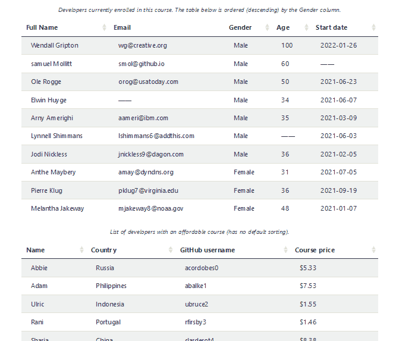
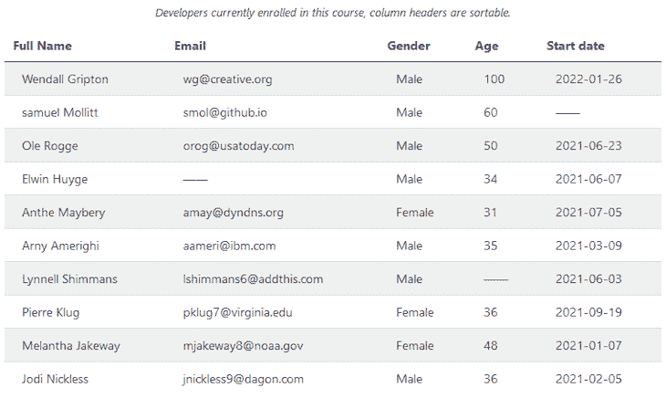

# 创建一个 React 可排序的表格日志博客

> 原文：<https://blog.logrocket.com/creating-react-sortable-table/>

有时，当我们创建一个表来显示应用程序中的数据时，我们可能希望为数据管理添加一个排序功能。

虽然有像[React Table](https://blog.logrocket.com/complete-guide-building-smart-data-table-react/)这样的库允许我们添加排序功能和更多功能，但有时使用库并不是最好的选择，尤其是如果我们想要一个完全灵活的简单表。

在本教程中，我们将介绍如何从头开始创建一个可排序的表。我们将通过单击表格标题对表格行进行升序或降序排序。

我们还将添加允许按特定列进行默认排序的功能，并且我们将构建一个可重用、可排序的表格组件。

最后，我们将学习如何正确使用 JavaScript `sort()`函数和一些重要的 React 原则。最终，我们将得到一个可排序的工作表，如下图所示。你可以[与项目](https://ibaslogic.github.io/react-sortable-table/)互动，然后开始！



要学习本教程，您必须具备 React 的应用知识。

*向前跳转:*

## 在 React 中创建表格标记

让我们从用`[create-react-app](https://blog.logrocket.com/getting-started-with-create-react-app-d93147444a27/)`创建一个 React 项目开始，并启动开发服务器。一旦项目启动并运行，我们将创建表格标记。

回想一下 HTML，表格标记遵循包含表格`caption`的以下结构:

```
<table>
  <caption>Caption here</caption>
  <thead>
    <tr>
      <th>{/* ... */}</th>
    </tr>
  </thead>
  <tbody>
    <tr>
      <td>{/* ... */}</td>
    </tr>
  </tbody>
</table>

```

由于 React 是一个基于组件的库，我们可以将标记拆分成不同的组件文件。`Table`组件将作为父组件来保存`TableHead`和`TableBody`组件。

在这些子组件中，我们将分别呈现表格标题和主体内容。最后，我们将在`App`组件中呈现父组件。

在`src`文件夹中，让我们创建文件，这样我们就有了以下结构:

```
react-sortable-table
   ...
    ├── src
    │    ├── components
    │    │      ├── Table.js
    │    │      ├── TableBody.js
    │    │      └── TableHead.js      
    │    ├── images
    │    ├── App.js
    │    ├── index.css
    │    └── index.js

```

注意，我们还在`src`中添加了一个`images`文件夹。这将保存指示排序方向的图标。让我们从项目中获取图标[，并将它们添加到`src/images`文件夹中。](https://github.com/Ibaslogic/react-sortable-table/tree/main/src/images)

接下来，打开`src/index.js`并更新文件，这样我们就有了:

```
import React from 'react';
import ReactDOM from 'react-dom/client';
import './index.css';
import App from './App';

const root = ReactDOM.createRoot(document.getElementById('root'));
root.render(
 <React.StrictMode>
  <App />
 </React.StrictMode>
);

```

然后，更新`src/App.js`文件，这样我们就有了以下内容:

```
const App = () => {
 return <>App</>;
};

export default App;

```

在我们保存文件之前，让我们用这个项目的 [CSS 文件](https://github.com/Ibaslogic/react-sortable-table/blob/main/src/index.css)来替换`src/index.css`文件。如果我们现在保存文件，我们应该在前端看到一个简单的“App”文本。

## 获取表的数据

通常当我们使用表格时，我们从 API 或后端服务器异步获取表格数据。然而，对于本教程，我们将从 Mockaroo 生成一些模拟但真实的[数据，并获得如下所示的返回 JSON 数据:](https://www.mockaroo.com/)

```
[
 {
  "id": 1,
  "full_name": "Wendall Gripton",
  "email": "[email protected]",
  "gender": "Male",
  "age": 100,
  "start_date": "2022-01-26"
 },
 // ...
]

```

那么，让我们在`src`文件夹中创建一个`data.json`，将[项目文件中的数据复制到这里](https://github.com/Ibaslogic/react-sortable-table/blob/main/src/tableData1.json)，并粘贴到我们刚刚创建的文件中。现在，保存文件。

在文件中，您会注意到我们添加了一些`null`值来表示缺失的值。这是为了展示如何正确排序`null`数据类型的值。

## 呈现表格数据

在`components/Table.js`文件中，让我们从添加以下代码开始:

```
import { useState } from "react";
import tableData1 from "../tableData1.json";
import TableBody from "./TableBody";
import TableHead from "./TableHead";

const Table = () => {
 const [tableData, setTableData] = useState(tableData1);

 const columns = [
  { label: "Full Name", accessor: "full_name" },
  { label: "Email", accessor: "email" },
  { label: "Gender", accessor: "gender" },
  { label: "Age", accessor: "age" },
  { label: "Start date", accessor: "start_date" },
 ];

 return (
  <>
   <table className="table">
    <caption>
     Developers currently enrolled in this course, column headers are sortable.
    </caption>
    <TableHead columns={columns} />
    <TableBody columns={columns} tableData={tableData} />
   </table>
  </>
 );
};

export default Table;

```

代码是不言自明的。我们导入了表数据，并将其存储在状态中。然后，我们通过 prop 将它传递给`TableBody`组件。我们还将表头定义为一个对象数组，并将它们分配给`columns`变量。

我们现在可以遍历`TableHead`组件中的变量来显示表格标题，并使用`accessor`键来动态访问和显示正文行数据。为此，`accessor`必须匹配`src/tableData1.json`文件中的数据键。

接下来，让我们访问子组件中的数据，以便呈现它们。让我们在`components/TableHead.js`文件中添加以下代码:

```
const TableHead = ({ columns }) => {
 return (
  <thead>
   <tr>
    {columns.map(({ label, accessor }) => {
     return <th key={accessor}>{label}</th>;
    })}
   </tr>
  </thead>
 );
};

export default TableHead;

```

接下来，让我们在`components/TableBody.js`文件中添加以下内容:

```
const TableBody = ({ tableData, columns }) => {
 return (
  <tbody>
   {tableData.map((data) => {
    return (
     <tr key={data.id}>
      {columns.map(({ accessor }) => {
       const tData = data[accessor] ? data[accessor] : "——";
       return <td key={accessor}>{tData}</td>;
      })}
     </tr>
    );
   })}
  </tbody>
 );
};

export default TableBody;

```

最后，更新`src/App.js`文件以包含`Table`组件:

```
import Table from "./components/Table";

const App = () => {
 return (
  <div className="table_container">
   <h1>Sortable table with React</h1>
   <Table />
  </div>
 );
};

export default App;

```

让我们保存所有文件并检查前端。我们应该看到我们的表被渲染。



## 对 React 表数据进行排序

现在，每当我们点击任何一个表格标题，我们就可以按升序或降序对特定的列进行排序。为了实现这一点，我们必须使用一个知道如何整理和排序项目的排序函数。在这种情况下，我们将使用`sort()`函数。

但是，根据项目的数据类型，我们可以使用不同的方法对元素进行排序。让我们快速看一下。

### 基本`sort()`功能

在最简单的形式中，我们可以使用`sort()`函数来排列`arr`数组中的元素:

```
const arr = [3, 9, 6, 1];

arr.sort((a, b) => a - b);
console.log(arr); // [1, 3, 6, 9]

```

通过它的算法，`sort()`知道如何比较它的元素。默认情况下，它按升序排序。如果排序项是数字，则上述语法有效。对于字符串，我们有这样的东西:

```
const arr2 = ["z", "a", "b", "c"];

arr2.sort((a, b) => (a < b ? -1 : 1));
console.log(arr2); // ["a", "b", "c", "z"]

```

这里，`sort()`比较条目并返回一个整数，以了解条目在列表中是上移还是下移。在上面的实现中，如果比较函数返回一个负数，第一项`a`小于`b`，因此上移，这表示升序，反之亦然。

理解使用`sort()`函数的排序原理对于表格数据的排序至关重要。现在，让我们看更多的例子。

如果我们将以下数据按`name`排序:

```
const data = [
  { name: "Ibas", age: 100 },
  {
    name: "doe",
    age: 36
  }
];

```

我们将有以下代码:

```
const data1 = [...data].sort((a, b) => (a.name < b.name ? -1 : 1));

data1.map((d) => console.log("without conversion", d.name)); // Ibas, doe

```

请注意，输出不是我们所期望的。基于默认的升序规则，我们期望`doe`在`Ibas`之前列出。这是因为字符是按 Unicode 值排序的。

在 [Unicode 表](https://www.utf8-chartable.de/)中，大写字母的值小于小写字母的值。为了确保看到预期的结果，我们必须通过将排序项转换为小写或大写，按不区分大小写进行排序。

我们的代码现在应该是这样的:

```
const data2 = [...data].sort((a, b) =>
  a.name.toLowerCase() < b.name.toLowerCase() ? -1 : 1
);

data2.map((d) => console.log("with conversion", d.name)); // doe, Ibas

```

这和预期的一样有效。但是，在我们的项目中，我们将按照不同的数据类型对表头进行排序，这些数据类型包括`number`、`string`和`date`。

在上面的实现中，我们不能传递数字，因为`.toLowerCase()`函数只存在于字符串上。这就是`localeCompare()`函数的用武之地。

### 将`localeCompare()`与`sort()`功能一起使用

这个函数能够处理不同的数据类型，包括不同语言的字符串，因此它们以正确的顺序出现。这非常适合我们的用例。

* * *

### 更多来自 LogRocket 的精彩文章:

* * *

如果我们用它按照`name`对`data`数组进行排序，我们得到如下结果:

```
const data3 = [...data].sort((a, b) => a.name.localeCompare(b.name));

data3.map((d) => console.log("with localeCompare", d.name, d.age)); // doe 36, Ibas 100

```

像前面的比较函数一样，`localeCompare()`也返回一个数字。在上面的实现中，如果`a.name`小于`b.name`，它将返回一个负数，反之亦然。这个函数只应用于字符串，但是它提供了一个数字排序的选项。

回到我们的`data`数组，我们可以通过调用`age`上的`.toString()`得到一个字符串表示来按照`age`号排序:

```
const data4 = [...data].sort((a, b) =>
  a.age.toString().localeCompare(b.age.toString())
);

data4.map((d) => console.log("with localeCompare", d.name, d.age)); // ibas 100, doe 36

```

同样，在代码中我们注意到`100`在`36`之前，这不是我们所期望的。这也是因为值是字符串，因此，`"100"` `<` `"36"`是正确的。对于数字排序，我们必须指定`numeric`选项，因此我们有:

```
const data5 = [...data].sort((a, b) =>
  a.age.toString().localeCompare(b.age.toString(), "en", {
    numeric: true
  })
);

data5.map((d) => console.log("with localeCompare", d.name, d.age)); /// doe 36, Ibas 100

```

如上所述，我们现在得到了适当的安排。在代码中，我们还包含了一个可选的`"en"` locale 来指定应用程序语言。

既然我们已经更新了如何使用`sort()`函数，在我们的项目中实现它将是小菜一碟。

## 处理`onClick`事件并整理数据

当我们单击一个特定的表格标题时，我们必须跟踪排序顺序和排序列。为此，我们必须使用`useState`钩子。

在`components/TableHead.js`中，导入`useState`钩子，使用方法如下:

```
import { useState } from "react";

const TableHead = ({ columns }) => {
 const [sortField, setSortField] = useState("");
 const [order, setOrder] = useState("asc");
 return (
  // ...
 );
};

export default TableHead;

```

接下来，向表头`th`添加一个`onClick`事件，并在`return`语句上方添加其处理函数:

```
const TableHead = ({ columns }) => {
 // ...
 const handleSortingChange = (accessor) => {
  console.log(accessor);
 };
 return (
  <thead>
   <tr>
    {columns.map(({ label, accessor }) => {
     return (
      <th key={accessor} onClick={() => handleSortingChange(accessor)}>
       {label}
      </th>
     );
    })}
   </tr>
  </thead>
 );
};

export default TableHead;

```

让我们保存文件。如果我们打开控制台并单击表格标题，我们应该会看到它们各自的`accessor`键。

接下来，让我们定义一个逻辑，通过更新`handleSortingChange`处理程序来切换每个标题点击的顺序，这样我们就有了以下内容:

```
const handleSortingChange = (accessor) => {
 const sortOrder =
  accessor === sortField && order === "asc" ? "desc" : "asc";
 setSortField(accessor);
 setOrder(sortOrder);
 handleSorting(accessor, sortOrder);
};

```

此时，我们可以访问最新的排序顺序。现在，为了操作表数据，我们必须将`order`向上传递到父`Table`组件，我们已经使用`handleSorting()`函数调用完成了。

这是因为`Table`组件是保存状态数据的组件。因此，它是唯一可以改变它的组件。在 React 中，我们可以像在这个文件中一样引发一个事件，然后通过 props 在父组件中处理它。

因此，在我们保存文件之前，让我们确保我们析构了组件 prop，并且可以像这样访问`handleSorting`:

```
const TableHead = ({ columns, handleSorting }) => {

```

现在，保存文件。

接下来，让我们打开`components/Table.js`文件来处理事件。首先，在`return`中，让我们确保将`handleSorting`作为道具传递给`TableHead`实例:

```
return (
 <>
  <table className="table">
   {/* ... */}
   <TableHead columns={columns} handleSorting={handleSorting} />
   <TableBody columns={columns} tableData={tableData} />
  </table>
 </>
);

```

我们可以重写上面的代码，让它看起来更简单，就像这样:

```
return (
 <>
  <table className="table">
   {/* ... */}
   <TableHead {...{ columns, handleSorting }} />
   <TableBody {...{ columns, tableData }} />
  </table>
 </>
);

```

以上两种方法都可以。

最后，让我们在`return`语句上方添加`handleSorting`处理程序:

```
const handleSorting = (sortField, sortOrder) => {
 console.log(sortField, sortOrder)
};

```

让我们保存所有文件。

`handleSorting`处理程序需要两个参数，因为我们从`TableHead`组件传递了它们。同时，每当我们单击表格标题时，我们都会将这些参数记录到控制台中。

接下来，我们将在使用`localeCompare()`的同时使用`sort()`函数来正确地对表格数据进行排序。幸运的是，我们在本教程的前面已经了解了这一点。

通过应用排序逻辑，`handleSorting`处理程序现在看起来像这样:

```
const handleSorting = (sortField, sortOrder) => {
 if (sortField) {
  const sorted = [...tableData].sort((a, b) => {
   return (
    a[sortField].toString().localeCompare(b[sortField].toString(), "en", {
     numeric: true,
    }) * (sortOrder === "asc" ? 1 : -1)
   );
  });
  setTableData(sorted);
 }
};

```

代码应该足够清楚。如果您需要复习，请重温之前的解释。这里，我们按照列标题对表格数据进行排序，然后通过`setTableData()` updater 函数更新`tableData`状态。

注意我们是如何通过检查`"asc"`值并切换返回值来反转排序顺序的。

让我们保存并测试我们的项目。

在我们单击包含`null`值的列之前，该项目应该一直工作。让我们通过更新处理程序来检查`null`值来解决这个问题:

```
const handleSorting = (sortField, sortOrder) => {
 if (sortField) {
  const sorted = [...tableData].sort((a, b) => {
   if (a[sortField] === null) return 1;
   if (b[sortField] === null) return -1;
   if (a[sortField] === null && b[sortField] === null) return 0;
   return (
    a[sortField].toString().localeCompare(b[sortField].toString(), "en", {
     numeric: true,
    }) * (sortOrder === "asc" ? 1 : -1)
   );
  });
  setTableData(sorted);
 }
};

```

现在，保存文件并测试项目。应该能行。

### 启用或禁用特定列的排序

接下来，让我们向`columns`项添加一个`sortable`键，并指定一个布尔值来允许或不允许对任何列进行排序。

```
const columns = [
 { label: "Full Name", accessor: "full_name", sortable: true },
 { label: "Email", accessor: "email", sortable: false },
 { label: "Gender", accessor: "gender", sortable: true },
 { label: "Age", accessor: "age", sortable: true },
 { label: "Start date", accessor: "start_date", sortable: true },
];

```

然后，我们可以在`TableHead`组件中访问这个键，并使用它来激活一个点击事件，如下所示:

```
return (
 <thead>
  <tr>
   {columns.map(({ label, accessor, sortable }) => {
    return (
     <th
      key={accessor}
      onClick={sortable ? () => handleSortingChange(accessor) : null}
     >
      {label}
     </th>
    );
   })}
  </tr>
 </thead>
);

```

现在，我们应该能够对任何列进行排序，除了那些值为`false`的列。

## 显示图标以指示分类方向

这很简单。这里，让我们动态地将`default`、`up`和`down`类名添加到表头的`th`元素中。这些类已经在我们的 CSS 文件中添加了箭头图标。在`components/TableHead.js`文件中，更新`return`语句，这样我们就有了以下内容:

```
return (
 <thead>
  <tr>
   {columns.map(({ label, accessor, sortable }) => {
    const cl = sortable
     ? sortField === accessor && order === "asc"
      ? "up"
      : sortField === accessor && order === "desc"
      ? "down"
      : "default"
     : "";
    return (
     <th
      // ...
      className={cl}
     >
      {label}
     </th>
    );
   })}
  </tr>
 </thead>
);

```

在代码中，我们使用嵌套的三元运算符来检查订单状态，并相应地分配类名。保存并测试您的项目。

## 使桌子可重复使用

React 允许我们在需要时重用组件逻辑。例如，如果我们需要在项目的不同部分包含另一个数据表，我们可以使用自定义钩子在组件之间提取和共享类似的逻辑。

在这里，我们将创建一个定制的钩子来重用不同表组件中的排序功能。

让我们从将排序逻辑提取到一个可重用的函数`useSortableTable`开始。在`src`文件夹中，创建一个名为`useSortableTable.js`的文件，并添加以下代码:

```
import { useState } from "react";
export const useSortableTable = (data) => {
 const [tableData, setTableData] = useState(data);

 const handleSorting = (sortField, sortOrder) => {
  if (sortField) {
   const sorted = [...tableData].sort((a, b) => {
    if (a[sortField] === null) return 1;
    if (b[sortField] === null) return -1;
    if (a[sortField] === null && b[sortField] === null) return 0;
    return (
     a[sortField].toString().localeCompare(b[sortField].toString(), "en", {
      numeric: true,
     }) * (sortOrder === "asc" ? 1 : -1)
    );
   });
   setTableData(sorted);
  }
 };

 return [tableData, handleSorting];
};

```

在上面的代码中，我们只将排序逻辑提取到一个定制的钩子文件中。钩子将表数据作为参数，并在我们单击列标题时返回排序后的数据。接下来，我们将使用钩子代替`Table`组件中的逻辑。

打开`components/Table.js`文件。然后，导入并使用`useSortableTable()`自定义钩子，如下所示:

```
// ...
import { useSortableTable } from "../useSortableTable";

const Table = () => {
 const columns = [
  // ...
 ];
 const [tableData, handleSorting] = useSortableTable(tableData1);
 return (
  // ...
 );
};

export default Table;

```

有了这个实现，`Table`组件包含的代码更少。如果我们保存文件并测试我们的项目，它应该会像预期的那样工作。现在，我们可以在任何其他表组件中重用该逻辑。

### 创建可重用的`Table`组件

在上一节中，我们学习了如何使用自定义钩子重用组件逻辑。这使我们能够重用排序功能。现在让我们来看看如何进一步抽象表逻辑，只暴露一个`Table`实例，在这个实例中我们可以传递一些与特定表相关的属性。

在我们的代码中，我们目前正在渲染`src/App.js`中的`<Table />`。让我们从`Table`组件中取出与该表相关的所有数据，并在`src/App.js`中使用它。这些数据包括表体内容、列和表标题。

`src/App.js`文件现在看起来像这样:

```
import Table from "./components/Table";
import tableData1 from "./tableData1.json";

const columns = [
 // ...
];

const App = () => {
 return (
  <div className="table_container">
   <h1>Sortable table with React</h1>
   <Table
    caption="Developers currently enrolled in this course, column headers are sortable."
    data={tableData1}
    columns={columns}
   />
  </div>
 );
};

export default App;

```

现在，我们可以从`Table`组件接收道具，然后在我们的渲染中使用它们:

```
// ...
const Table = ({ caption, data, columns }) => {
 const [tableData, handleSorting] = useSortableTable(data);

 return (
  <>
   <table className="table">
    <caption>{caption}</caption>
    <TableHead {...{ columns, handleSorting }} />
    <TableBody {...{ columns, tableData }} />
   </table>
  </>
 );
};

export default Table;

```

现在，保存文件并测试项目。

### 呈现另一个数据表

让我们获取另一个数据表，并使用相同的`Table`组件呈现它。首先，在`src`文件夹中创建一个`tableData2.json`文件。然后，从[项目文件](https://github.com/Ibaslogic/react-sortable-table/blob/main/src/tableData2.json)中复制数据并粘贴到`tableData2.json`文件中。

接下来，让我们在`components`文件夹中创建一个名为`RenderAnotherTable.js`的组件文件，并呈现新的表格。

```
import Table from "./Table";
import tableData2 from "../tableData2.json";

const columns = [
 { label: "Name", accessor: "name", sortable: true },
 { label: "Country", accessor: "country", sortable: true },
 { label: "GitHub username", accessor: "github_username", sortable: true },
 { label: "Course price", accessor: "money", sortable: true },
];

const RenderAnotherTable = () => {
 return (
  <>
   <Table
    caption="List of developers with an affordable course."
    data={tableData2}
    columns={columns}
   />
  </>
 );
};

export default RenderAnotherTable;

```

现在，我们可以在任何文件中呈现这个新组件。在我们的例子中，我们将在`src/App.js`文件中呈现它:

```
import RenderAnotherTable from "./components/RenderAnotherTable";
// ...
const App = () => {
 return (
  <div className="table_container">
   {/* ... */}
   <br />
   <RenderAnotherTable />
  </div>
 );
};

export default App;

```

保存所有文件并测试您的项目。它应该像预期的那样工作。

## 按列默认排序

让我们添加逻辑，使我们能够在初始呈现时按特定列对表进行排序。让我们在`src/App.js`文件中找到`columns`数组，并添加一个带有`desc`值的`sortbyOrder`键:

```
const columns = [
 // ...
 { label: "Gender", accessor: "gender", sortable: true, sortbyOrder: "desc" },
 // ...
];

```

这样，我们将根据`G``ender`列对表格进行降序排序。

在`Table`组件中，让我们也将`columns`传递给`useSortableTable`钩子，这样我们就可以定义默认的排序功能。

```
const Table = ({ caption, data, columns }) => {
 const [tableData, handleSorting] = useSortableTable(data, columns);

 return (
  // ...
 );
};

export default Table;

```

接下来，打开`src/useSortableTable.js`文件并访问列:

```
export const useSortableTable = (data, columns) => {
 const [tableData, setTableData] = useState(data);

 const handleSorting = (sortField, sortOrder) => {
  // ...
 };

 return [tableData, handleSorting];
};

```

在初始呈现时，我们不是将未排序的表数据传递给 state，而是传递一个函数来检测我们是否希望对特定列进行默认排序，然后返回排序后的表。

因此，让我们用一个函数来初始化状态，该函数接受数据和列，并定义默认的排序逻辑，如下所示:

```
function getDefaultSorting(defaultTableData, columns) {
 const sorted = [...defaultTableData].sort((a, b) => {
  const filterColumn = columns.filter((column) => column.sortbyOrder);

  // Merge all array objects into single object and extract accessor and sortbyOrder keys
  let { accessor = "id", sortbyOrder = "asc" } = Object.assign(
   {},
   ...filterColumn
  );

  if (a[accessor] === null) return 1;
  if (b[accessor] === null) return -1;
  if (a[accessor] === null && b[accessor] === null) return 0;

  const ascending = a[accessor]
   .toString()
   .localeCompare(b[accessor].toString(), "en", {
    numeric: true,
   });

  return sortbyOrder === "asc" ? ascending : -ascending;
 });
 return sorted;
}

export const useSortableTable = (data, columns) => {
 const [tableData, setTableData] = useState(getDefaultSorting(data, columns));

 // ...
 return [tableData, handleSorting];
};

```

在初始呈现时，我们检查是否有任何列有`sortbyOrder`键，然后按照指定的值对列进行排序；不是上升就是下降。如果我们保存我们的文件并测试项目，它应该工作。你可以在这里亲眼看看。

差不多就是这样！

## 结论

向表中添加排序功能对于数据管理和改善用户体验至关重要，尤其是对于包含许多行的表。

在本教程中，我们学习了如何在不使用任何库的情况下向 React 表添加排序功能(包括根据特定列的默认排序功能)。我们还学习了如何重用表逻辑向项目的不同部分添加另一个数据表。

如果你喜欢这个教程，努力在网上分享它。如果你有问题或贡献，请在评论区分享你的想法。

你可以在我的 GitHub 上找到[项目源代码。](https://github.com/Ibaslogic/react-sortable-table)

## 使用 LogRocket 消除传统反应错误报告的噪音

[LogRocket](https://lp.logrocket.com/blg/react-signup-issue-free)

是一款 React analytics 解决方案，可保护您免受数百个误报错误警报的影响，只针对少数真正重要的项目。LogRocket 告诉您 React 应用程序中实际影响用户的最具影响力的 bug 和 UX 问题。

[ ](https://lp.logrocket.com/blg/react-signup-general) [  ](https://lp.logrocket.com/blg/react-signup-general) [LogRocket](https://lp.logrocket.com/blg/react-signup-issue-free)

自动聚合客户端错误、反应错误边界、还原状态、缓慢的组件加载时间、JS 异常、前端性能指标和用户交互。然后，LogRocket 使用机器学习来通知您影响大多数用户的最具影响力的问题，并提供您修复它所需的上下文。

关注重要的 React bug—[今天就试试 LogRocket】。](https://lp.logrocket.com/blg/react-signup-issue-free)