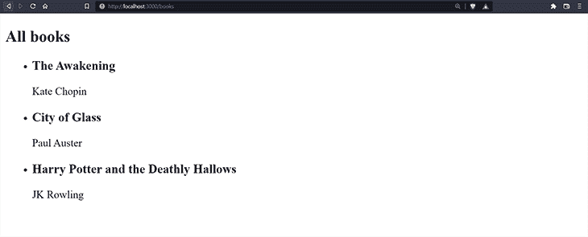

# 用 GraphQL 创建一个混音应用

> 原文：<https://blog.logrocket.com/creating-remix-app-graphql/>

Remix 是一个非常棒的 React 框架，专注于服务器端渲染。Remix 允许应用程序有一个快速的加载时间，一旦应用程序被加载，水合作用就开始发挥作用，并为它提供客户端功能。

因为 Remix 可以在服务器上运行，所以我们可以在 Remix 应用程序中创建 API 路由来执行后端任务，比如连接到数据库。感谢像 Apollo GraphQL 这样的技术和工具，我们可以利用 Remix API 路由来构建一个功能性的全栈 GraphQL 应用程序。

在本文中，我们将介绍如何建立一个具有 GraphQL 功能的 Remix 应用程序。我们将研究如何通过使用 Apollo 创建 GraphQL 服务器路由，在 Remix 应用程序中实现简单的 CRUD 功能。

## 什么是混音？

Remix 是一个关注用户界面的全栈 web 框架。它通过 web 基本原理来提供快速、流畅、有弹性的用户体验。

Remix 基于 React 构建，包括 React 路由器、服务器端渲染、TypeScript 支持、生产服务器和后端优化。

如果您熟悉 React，您会知道有几个框架提供基于 React 的服务器端呈现功能。一些这样的框架包括 [Next.js](https://nextjs.org/) 和 [Astro](https://astro.build/) 。

Remix 从其他服务器端 React 框架中脱颖而出有几个原因。首先，与 Next.js 等其他框架不同，它不提供静态站点生成(SSG)。相反，它建立在[服务器/客户端模型](https://remix.run/docs/en/v1/pages/philosophy#serverclient-model)之上，专注于 SSR，在服务器上构建和编译一切，并在边缘利用分布式系统。客户端接收较小的有效负载，并在客户端使用 React 进行水合。

Remix 还完全采用了 web Fetch API 等 Web 标准，允许开发人员利用 Web 提供的核心工具和功能，并且已经开发了多年。例如，Remix 利用 HTTP 缓存，让浏览器处理任何复杂的缓存资源。

最后，我们会发现，与其他框架不同，Remix 在数据突变和 CRUD 功能方面利用了 HTML `<form>`。然后，它使用`action`和`loader`来处理用`<form>`发送的请求。

### 了解 Remix API 路线

有了 Remix，[路由就是自己的 API](https://remix.run/docs/en/v1/guides/api-routes#routes-are-their-own-api)。因为一切都在服务器上，所以当用户请求路由时，组件在服务器端获取数据。

Remix 中的[路由是 Remix 与 Next.js 等框架的另一个关键区别](https://blog.logrocket.com/understanding-routes-route-nesting-remix/)，在 next . js 中，客户端需要向 API/服务器路由发出请求，以便在`loader`和`action`的帮助下执行 CRUD 操作

看看下面的代码:

```
// ./app/routes/index.tsx

import { json } from '@remix-run/node';
import { useLoaderData } from '@remix-run/react';

// type definitions
type Book = {
  title: string;
  genre: string;
};
type Books = Array<Book>;
type LoaderData = {
  books: Books;
};

// Loader function
export const loader = async () => {
  return json<LoaderData>({
    books: [
      {
        title: 'Harry Potter and the Deathly Hallows',
        genre: "Children's Fiction",
      },
      {
        title: "Harry Potter and the Philosopher's Stone",
        genre: "Children's Fiction",
      },
    ],
  });
};

export default function Index() {
  // use data from loader
  const { books } = useLoaderData() as LoaderData;
  return (
    <div style={{ fontFamily: 'system-ui, sans-serif', lineHeight: '1.4' }}>
      <h1>Welcome to Remix</h1>
      <ul>
        {books.map(({ title, genre }, i) => {
          return (
            <li key={i}>
              <h3> {title} </h3>
              <p> {genre} </p>
            </li>
          );
        })}
      </ul>
    </div>
  );
}

```

[点击此处查看 StackBlitz](https://stackblitz.com/edit/node-kd1jcm?file=app/routes/index.tsx) 。

在上面的代码中，我们可以看到我们声明了一个`loader`来返回一个可以从远程服务器或数据库获取的书籍数组，但是现在它是硬编码的。由于`loader`函数是[我们路线的后端“API”](https://remix.run/docs/en/v1/tutorials/blog#loading-data)，在`useLoaderData`的帮助下，我们可以很容易地从`Index`组件中的`loader`获得数据。

由于这一切都发生在服务器上，它被渲染并发送到浏览器。在客户端没有额外的获取操作。

除了获取数据，我们还可以使用`actions`在服务器端发送要处理的数据。

让我们向我们的`Index`组件添加一个带有`method="post"`的表单和一个将处理提交请求的`action`:

```
import { json } from '@remix-run/node';
import { useLoaderData, useActionData, Form } from '@remix-run/react';
// type definitions
// ...

// loader function
export const loader = async () => {
 // ...
};

// action funtion
export const action = async ({ request }) => {
  const formData = await request.formData();
  const name = formData.get('name');
  return json({ name });
};

export default function Index() {
  // use data from loader
  const { books } = useLoaderData() as LoaderData;

  // get data from action
  const data = useActionData();
  return (
    <div style={{ fontFamily: 'system-ui, sans-serif', lineHeight: '1.4' }}>
      {/* show "Stranger" if no data is available yet */}
      <h1>Welcome to Remix {data ? data.name : 'Stranger'} </h1>

      <ul>
        {books.map(({ title, genre }, i) => {
          return (
            <li key={i}>
              <h3> {title} </h3>
              <p> {genre} </p>
            </li>
          );
        })}
      </ul>

      {/* Remix form component with "POST" method */}
      <Form method="post">
        <div className="form-control">
          <label htmlFor="name">
            Name
            <input id="name" name="name" type="text" />
          </label>
        </div>
        <button type="submit">Submit </button>
      </Form>
    </div>
  );
}

```

[堆栈上的视图](https://stackblitz.com/edit/node-kd1jcm?file=app/routes/index.tsx)

在上面的代码中，我们创建了一个带有`request`参数的`action`函数。我们通过调用`request.formData()`并将其传递给`formData`变量来获取表单值。为了获得`name`值，我们在`formData`上调用`.get()`方法。

最后，我们返回一个 JSON 对象，包含从请求中收到的`name`。

在我们的`Index`组件中，为了从我们的路由`action`访问 JSON 解析的数据，我们简单地使用了`[useActionData](https://remix.run/docs/en/v1/api/remix#useactiondata)`钩子。如果在当前位置还没有提交，它返回`undefined`。

这是对 Remix 最基本的介绍，我们已经看到了如何在 Remix 应用程序中获取和发送数据。接下来，我们将看看 GraphQL 以及如何在 Remix 中使用它。

## 为什么要使用 GraphQL？

与 REST API 相比，GraphQL 的主要优势在于，在与 API 交互时，GraphQL 减少了不必要的请求。

根据请求，REST APIs 往往会返回比我们应用程序所需更多或更少的数据。这可能会使来自我们请求的响应变得不必要的臃肿，甚至对于一个操作来说是不够的。然后我们将不得不执行另一个请求，这反过来会影响用户体验，尤其是在不稳定的网络条件下)。

使用 GraphQL，我们必须能够在响应中明确请求我们需要的内容——不多也不少。

将 GraphQL 的效率与 Remix 在构建服务器端呈现的 web 应用程序时带来的效率结合起来，我们将看到一些真正令人敬畏的东西。

### Apollo GraphQL 简介

正如本文中的[所定义的，“Apollo 是一套创建 GraphQL 服务器和消费 GraphQL API 的工具。”](https://flaviocopes.com/apollo/)

我们将使用的工具之一是[模式链接](https://www.apollographql.com/docs/react/api/link/apollo-link-schema/)，它允许我们对提供的模式执行 GraphQL 操作，而不是对 GraphQL API 进行网络调用。

这个工具对于 SSR 应用程序来说非常方便，在本文中我们将和其他工具一起使用。

## 我们的 Remix 和 GraphQL 应用概述

下面是我们在本教程中将要构建的内容的简要概述。

在上一节中，我们介绍了 Remix、`loader`和`action`函数中的路线，为了演示这些概念，我们构建了一个简单的应用程序来呈现图书列表，并包含一个表单，在提交时询问并显示我们的姓名。

* * *

### 更多来自 LogRocket 的精彩文章:

* * *

提醒一下，你可以在 [StackBlitz](https://stackblitz.com/edit/node-kd1jcm?file=app/routes/index.tsx) 和这个 [GitHub 分支](https://github.com/miracleonyenma/remix-demo/tree/actions)上访问代码。

在下一节中，我们将构建一个简单的应用程序，它显示图书列表，并提供一个表单以嵌套的方式上传新书，所有这些都使用 GraphQL 查询和变体。

您可以在 GitHub 上的资源库的 [schema-links 分支上访问最终代码。](https://github.com/miracleonyenma/remix-demo/tree/schema-links)

### 先决条件

要阅读这篇文章，我们需要:

*   文本编辑器(例如 VSCode)
*   [再混合](https://remix.run/)的基础知识
*   [GraphQL](https://graphql.org/) 的基础知识
*   最近安装的 [Node.js](https://nodejs.org/en/) 版本

## 设置混音项目

要创建新的混音项目，请在终端中运行以下命令:

```
npx [email protected]

```

然后按照提示操作:

```
? Where would you like to create your app? remix-graphql
? What type of app do you want to create? Just the basics
? Where do you want to deploy? Choose Remix App Server if you're unsure; it's easy to change deployment targets. Remix App Server
? TypeScript or JavaScript? TypeScript
? Do you want me to run `npm install`? Yes

```

一旦创建并安装了项目，我们就可以继续了。

## 阿波罗图 QL 在 Remix

为了在我们的项目中使用 Apollo GraphQL，我们必须安装几个包:

```
npm install @apollo/client @graphql-tools/schema

```

一旦安装了包，让我们设置我们的 GraphQL 客户端。如前所述，我们将使用模式链接。在新的`./app/lib/apollo/index.ts`文件中，我们将配置我们的模式和解析器:

```
// ./app/lib/apollo/index.ts

import { ApolloClient, gql, InMemoryCache } from "@apollo/client";
import { SchemaLink } from "@apollo/client/link/schema";
import { makeExecutableSchema } from "@graphql-tools/schema";
import { read, write } from "../../utils/readWrite";

// a schema is a collection of type definitions (hence "typeDefs")
// that together define the "shape" of queries that are executed against
// your data.
export const typeDefs = gql`

  # Comments in GraphQL strings (such as this one) start with the hash (#) symbol.
  # This "Book" type defines the queryable fields for every book in our data source.
  type Book {
    title: String
    author: String
  }

  # the "Query" type is special: it lists all of the available queries that
  # clients can execute, along with the return type for each. in this
  # case, the "books" query returns an array of zero or more Books (defined above).
  type Query {
    books: [Book]
  }
`;

// resolvers define the technique for fetching the types defined in the
// schema. this resolver retrieves books from the "books" array above.
export const resolvers = {
  Query: {
    books: () => {
      const books = read();
      return books;
    },
  }
};

const schema = makeExecutableSchema({ typeDefs, resolvers });

export const graphQLClient = new ApolloClient({
  cache: new InMemoryCache(),
  ssrMode: true,
  link: new SchemaLink({ schema }),
});

```

在上面的代码中，我们定义了我们的`Book`和`Query`类型。对于我们的`Query`，`books`查询返回一个`Book`的列表。

我们还在`resolvers`中定义了我们的`Query`解析器，它简单地返回由`read`函数提供的图书列表。这可能是一个从外部 API 或数据库获取图书列表的函数。在我们的例子中，我们只是从一个 JSON 文件中获取书籍。

然后，我们使用`makeExecutableSchema`创建一个可执行模式，并传入模式(`typeDefs`和`resolvers`)。

最后，我们定义一个新的`ApolloClient`实例为`graphQLClient`并导出它，准备在我们的 Remix 加载器中使用。

在此之前，让我们设置我们的实用函数`read`和`write`，使我们能够读取和修改包含图书列表的`.json`文件。

## 设置实用函数来读写 JSON 文件

在`./app/data/books.json`创建一个 JSON 文件:

```
// ./app/data/books.json
[
  {
    "title": "The Awakening",
    "author": "Kate Chopin"
  },
  {
    "title": "City of Glass",
    "author": "Paul Auster"
  },
  {
    "title": "Harry Potter and the Deathly Hallows",
    "author": "JK Rowling"
  }
]

```

创建一个新文件`./app/utils/readWrite.ts`并输入以下代码:

```
// ./app/utils/readWrite.ts
import fs from "fs"

// JSON file containing books array
const dataPath = `${process.cwd()}/app/data/books.json`;

// function to read file contents 
export const read = (
  returnJSON = false,
  path = dataPath,
  encoding = "utf-8"
) => {
  try {
    let data = readFileSync(path, encoding);
    return returnJSON ? data : JSON.parse(data);
  } catch (error) {
    console.log({ error });
    return null;
  }
};

// function to write content to file
export const write = (data: object, path = dataPath) => {
  let initialData = read();
  let modifiedData = [...initialData, data];
  try {
    writeFileSync(path, JSON.stringify(modifiedData, null, 2));
    let result = read();
    return result;
  } catch (error) {
    console.log({ error });
    return null;
  }
};

```

太好了！既然已经为解析器创建了读写函数，那么让我们创建一个`/books`路由来运行一个查询，该查询使用 Apollo 客户机模式链接列出我们所有的书籍。

### 运行我们的查询

用以下代码创建一个新文件`./app/routes/books.tsx`:

```
// ./app/routes/books.tsx

import { LoaderFunction, json } from "@remix-run/node";
import { gql } from "@apollo/client";
import { graphQLClient } from "~/lib/apollo";
import { useLoaderData } from "@remix-run/react";

const query = gql`
  query GetBooks {
    books {
      title
      author
    }
  }
`;

export const loader: LoaderFunction = async ({ request, params }) => {
  const { data } = await graphQLClient.query({
    query,
  });
  return json({ books: data.books });
};

export default function Books() {
  const { books } = useLoaderData();
  return (
    <main>
      <section>
        <h1>All books</h1>
        <ul>
          {books.map(({ title, author }: { title: string; author: string }, index:number) => (
            <li key={index}>
              <h3>{title}</h3>
              <p>{author}</p>
            </li>
          ))}
        </ul>
      </section>
    </main>
  );
}

```

这里，我们定义了我们的`query`，在我们的`loader`函数中，我们使用`graphQLClient.query()`执行查询并返回`json`响应。

在我们的`Books`组件中，我们使用`useLoaderData()`获取图书列表并呈现它:



厉害！我们的查询路线有效。接下来，我们将看到如何设置突变。

### 设置突变

首先，我们在`./app/lib/apollo/index.ts`中的`typeDefs`中定义我们的`Mutation`和`BookInput`类型:

```
// ./app/lib/apollo/index.ts
// ...

export const typeDefs = gql`

  # here, we define an input
  input BookInput {
    title: String
    author: String
  }

  # here, we define our mutations
  type Mutation {
    addBook(book: BookInput): [Book]!
  }
`;

```

在这里，我们用`title`和`author`定义了一个`input`类型:`BookInput`。它们都是字符串。

我们还定义了一个`addBook`变异，它接受我们之前创建的输入类型`BookInput`的一个参数`book`。

然后，`addBook`变异返回一个名为`[Book]`的图书列表

接下来，我们定义我们的`Mutation`解析器:

```
// ./app/lib/apollo/index.ts

// ...
export const resolvers = {
  Query: {
   // ...
  },
  Mutation: {
    addBook: (parent: any, { book }: any) => {
      console.log({ book });
      let books = write(book);
      return books;
    },
  },
};
// ...

```

这里，我们创建了一个新的`addBook`解析器，它接受`book`作为参数，并将其传递给`write()`函数。这会将新书添加到列表中，并返回更新后的图书列表。

创建新的`/books/addbook`路线。这将是一个嵌套的路由，这意味着我们必须创建一个像`./app/routes/books/addbook.tsx`一样的`books`目录:

```
// ./app/routes/books/addbook.tsx

import { gql } from "@apollo/client";
import { ActionFunction, json } from "@remix-run/node";
import { Form } from "@remix-run/react";
import { graphQLClient } from "~/lib/apollo";

// action function
export const action: ActionFunction = async ({ request }) => {
  const formData = await request.formData();
  const title = formData.get("title");
  const author = formData.get("author");

  let book = {
    title,
    author,
  };

  // mutation to add book
  const mutation = gql`
    mutation ($book: BookInput) {
      addBook(book: $book) {
        title
      }
    }
  `;

  const { data } = await graphQLClient.mutate({
    mutation,
    variables: { book },
  });

  return json({ books: data.books });
};
export default function AddBook() {
  return (
    <section style={{ border: "1px solid #333", padding: "1rem" }}>
      <h2>Add new book</h2>
      <Form method="post">
        <div className="form-control">
          <label htmlFor="title">Title</label>
          <input id="title" name="title" type="text" />
        </div>
        <div className="form-control">
          <label htmlFor="author">Author</label>
          <input id="author" name="author" type="text" />
        </div>
        <button type="submit">Submit</button>
      </Form>
    </section>
  );
}

```

在这里，我们可以看到我们有一个`action`函数，从`request`中得到`title`和`author`。

然后，我们创建一个`mutation`并将包含`title`和`author`的`book`对象作为变量传递。之后，我们使用`graphQLClient.mutate`执行这个查询。

在我们的`AddBook`组件中，我们使用 Remix 提供的`Form`组件通过`method = "post"`发送我们的数据。

现在，为了渲染我们的嵌套路线，我们必须在`./app/routes/books.tsx`中添加`<Outlet/>`:

```
// ...

export default function Books() {
  const { books } = useLoaderData();
  return (
    <main>
      <section>
        {/* ... */}
      </section>

      <Outlet />
    </main>
  );
}

```

现在，当我们转到`[http://localhost:3000/books/addbook](http://localhost:3000/books/addbook)`时，我们应该会看到:


不错！

## 结论

到目前为止，我们已经能够使用 Apollo GraphQL 设置 Remix 来针对我们的 GraphQL 模式发出请求。

我们现在可以进行查询和改变，这一切都发生在服务器端，所以在我们的客户端没有不必要的网络调用。

这只是我们用 Remix 和 GraphQL 所能实现的事情的冰山一角。我们还可以在 Remix 中创建一个资源路由，使用 Apollo Server 提供一个 GraphQL 端点。这将允许我们提出请求，并提供一个 GraphQL 平台。

你可以在再混合文档中读到更多关于[资源路线的信息，也可以在阿波罗文档](https://remix.run/docs/en/v1/guides/resource-routes)中读到更多关于[阿波罗服务器的信息。](https://www.apollographql.com/docs/apollo-server/getting-started)

## 监控生产中失败和缓慢的 GraphQL 请求

虽然 GraphQL 有一些调试请求和响应的特性，但确保 GraphQL 可靠地为您的生产应用程序提供资源是一件比较困难的事情。如果您对确保对后端或第三方服务的网络请求成功感兴趣，

[try LogRocket](https://lp.logrocket.com/blg/graphql-signup)

.

[](https://lp.logrocket.com/blg/graphql-signup)[https://logrocket.com/signup/](https://lp.logrocket.com/blg/graphql-signup)

LogRocket 就像是网络和移动应用的 DVR，记录下你网站上发生的每一件事。您可以汇总并报告有问题的 GraphQL 请求，以快速了解根本原因，而不是猜测问题发生的原因。此外，您可以跟踪 Apollo 客户机状态并检查 GraphQL 查询的键值对。

LogRocket 检测您的应用程序以记录基线性能计时，如页面加载时间、到达第一个字节的时间、慢速网络请求，还记录 Redux、NgRx 和 Vuex 操作/状态。

[Start monitoring for free](https://lp.logrocket.com/blg/graphql-signup)

.