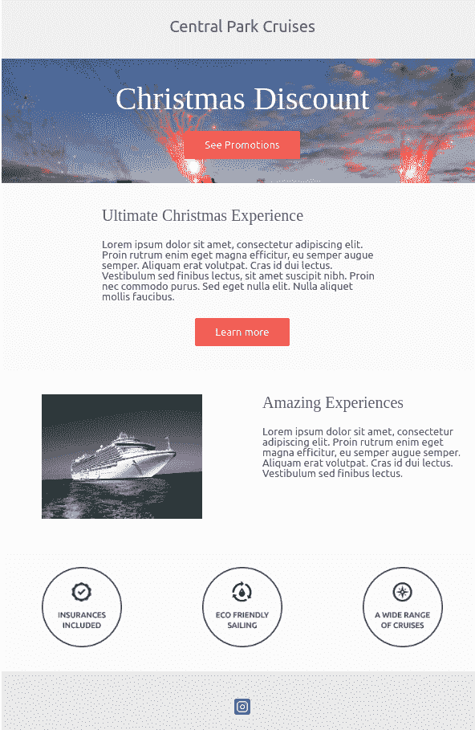

# 使用 MJML - LogRocket 博客创建回复邮件

> 原文：<https://blog.logrocket.com/creating-responsive-emails-using-mjml/>

MJML 是一个现代化的电子邮件工具，允许开发人员创建漂亮的、可在所有设备和邮件客户端上响应的优秀电子邮件。这种标记语言旨在减少编写响应邮件的痛苦。

它的语义语法使得使用起来简单明了。它还具有丰富的功能，标准组件加快了开发时间。在本教程中，我们将使用 MJML 构建漂亮且响应迅速的电子邮件，并在几个电子邮件客户端进行测试。

## 设置 MJML

您可以将 MJML 与 npm 一起安装，以便与 Node.js 或 CLI 一起使用:

```
$ npm install -g mjml

```

## 构建我们的电子邮件

首先，创建一个名为`email.mjml`的文件，尽管您也可以选择任何其他名称。现在我们已经创建了文件，我们的回复电子邮件将分为以下几个部分:

*   公司标题
*   图像标题
*   电子邮件介绍
*   列部分
*   核标准情报中心
*   社交图标

### 部分

这些部分是我们回复邮件的框架。如上所示，我们的邮件将分为六个部分。在我们的`email.mjml`文件中:

```
<mjml>
  <mj-body>
    <!-- Company Header -->
    <mj-section background-color="#f0f0f0"></mj-section>
    <!-- Image Header -->
    <mj-section background-color="#f0f0f0"></mj-section>
    <!-- Email Introduction -->
    <mj-section background-color="#fafafa"></mj-section>
    <!-- Columns section -->
    <mj-section background-color="white"></mj-section>
    <!-- Icons -->
    <mj-section background-color="#fbfbfb"></mj-section>
    <!-- Social icons -->
    <mj-section background-color="#f0f0f0"></mj-section>
  </mj-body>
</mjml>

```

从上面可以看到，我们使用了两个 MJML 组件:`mj-body`和`mj-section`。`mj-body`定义了我们电子邮件的起点，`mj-section`定义了一个包含其他组件的部分。

对于每个定义的部分，还定义了一个带有各自十六进制值的`[background-color](https://blog.logrocket.com/css-reference-guide-background/)`属性。这有助于我们的读者轻松识别邮件的各个部分。

#### 公司标题

我们电子邮件的这一部分将只在中心横幅位置包含我们公司/品牌的名称:

```
<!-- Company Header -->
<mj-section background-color="#f0f0f0">
  <mj-column>
    <mj-text  font-style="bold"
        font-size="20px"
        align="center"
        color="#626262">
    Central Park Cruise
    </mj-text>
  </mj-column>
</mj-section>

```

`mj-column`组件用于定义一个列。`mj-text`组件用于我们的文本内容，并带有样式属性，如`font-style`、`font-size`、`color`等。

#### 图像标题

在这一部分，我们将有一个背景图像和一个文本块，它应该代表我们公司的口号。我们还将有一个行动号召按钮，指向一个包含更多详细信息的页面。

要添加图像标题，您必须用一个`background-url`替换该部分的`background-color`。与第一个标题类似，您必须将文本垂直和水平居中。填充保持不变。

按钮的`href`设置按钮位置。为了使背景在列中全幅呈现，使用`width="600px"`将列宽设置为 600px。

我们电子邮件的这一部分将只在中心横幅位置包含我们公司/品牌的名称:

```
<!-- Image Header -->
<mj-section background-url="https://ca-times.brightspotcdn.com/dims4/default/2af165c/2147483647/strip/true/crop/2048x1363+0+0/resize/1440x958!/quality/90/?url=https%3A%2F%2Fwww.trbimg.com%2Fimg-4f561d37%2Fturbine%2Forl-disneyfantasy720120306062055"
        background-size="cover"
        background-repeat="no-repeat">
        <mj-column width="600px">
            <mj-text  align="center"
                color="#fff"
                font-size="40px"
                font-family="Helvetica Neue">Christmas Discount</mj-text>
            <mj-button background-color="#F63A4D" href="#">
                See Promotions
            </mj-button>
        </mj-column>
    </mj-section>

```

为了使用图像标题，我们将向`mj-section`组件添加一个`background-url`属性，然后使用`background-size`和`background-repeat`属性来设置图像的样式。

对于我们的标语文本块，我们使用`align`属性将文本垂直和水平对齐到中心。您还可以设置文本颜色、字体大小、字体系列等。如你所愿。

行动号召按钮是使用`mj-button`组件实现的。`background-color`属性允许我们指定按钮背景颜色，然后用`href`指定链接或页面位置。

#### 电子邮件介绍

简介文本由标题、正文和行动号召按钮组成。

```
<!-- Intro text -->
<mj-section background-color="#fafafa">
    <mj-column width="400px">
      <mj-text font-style="bold"
        font-size="20px"
        font-family="Helvetica Neue"
        color="#626262">Ultimate Christmas Experience</mj-text>
        <mj-text color="#525252">
            Lorem ipsum dolor sit amet, consectetur adipiscing elit. Proin rutrum enim eget magna efficitur, eu semper augue semper. Aliquam erat volutpat. Cras id dui lectus. Vestibulum sed finibus lectus, sit amet suscipit nibh. Proin nec commodo purus. Sed eget nulla elit. Nulla aliquet mollis faucibus.
        </mj-text>
        <mj-button background-color="#F45E43" href="#">Learn more</mj-button>
    </mj-column>
</mj-section>

```

#### 列部分

在这封邮件的部分，我们将有两列:一列将包含一个描述性的图像，第二列将包含我们的文本块，以补充第一部分中的图像。

```
<!-- Side image -->
<mj-section background-color="white">
  <!-- Left image -->
  <mj-column>
      <mj-image width="200px"
          src="https://navis-consulting.com/wp-content/uploads/2019/09/Cruise1-1.png"/>
  </mj-column>
  <!-- right paragraph -->
  <mj-column>
      <mj-text font-style="bold"
          font-size="20px"
          font-family="Helvetica Neue"
          color="#626262">
          Amazing Experiences
      </mj-text>
      <mj-text color="#525252">
          Lorem ipsum dolor sit amet, consectetur adipiscing elit. 
          Proin rutrum enim eget magna efficitur, eu semper augue semper. 
          Aliquam erat volutpat. Cras id dui lectus. Vestibulum sed finibus 
          lectus.
      </mj-text>
  </mj-column>
</mj-section> 
```

左边的第一列使用`mj-image`组件来指定要使用的图像。该图像可以是一个本地文件，或者，在我们的例子中，是一个远程托管的图像。

右边的第二列包含两个文本块，一个是我们的标题，另一个是主体文本。

#### 核标准情报中心

图标部分将有三列。您也可以添加更多，这取决于您希望电子邮件的外观。

```
<!-- Icons -->
<mj-section background-color="#fbfbfb">
    <mj-column>
        <mj-image width="100px" src="https://191n.mj.am/img/191n/3s/x0l.png" />
    </mj-column>
    <mj-column>
        <mj-image width="100px" src="https://191n.mj.am/img/191n/3s/x01.png" />
    </mj-column>
    <mj-column>
        <mj-image width="100px" src="https://191n.mj.am/img/191n/3s/x0s.png" />
    </mj-column>
</mj-section>

```

每一列都有自己的用于呈现图标图像的`mj-image`组件。

#### 社交图标

此部分将包含指向我们社交媒体账户的图标。

```
<mj-section background-color="#e7e7e7">
    <mj-column>
        <mj-social>
            <mj-social-element name="instagram" />
        </mj-social>
    </mj-column>
</mj-section>

```

MJML 附带了`mj-social`组件，可以很容易地用来显示社交媒体图标。在我们的电子邮件中，我们使用了 Twitter `mj-social-element`。

## 把所有的放在一起

现在我们已经实现了所有的部分，我们完整的`email.mjml`应该是这样的:

```
<mjml>
  <mj-body>
    <!-- Company Header -->
    <mj-section background-color="#f0f0f0">
        <mj-column>
            <mj-text  font-style="bold"
                font-size="20px"
                align="center"
                color="#626262">
            Central Park Cruises
            </mj-text>
        </mj-column>
    </mj-section>
    <!-- Image Header -->
    <mj-section background-url="https://ca-times.brightspotcdn.com/dims4/default/2af165c/2147483647/strip/true/crop/2048x1363+0+0/resize/1440x958!/quality/90/?url=https%3A%2F%2Fwww.trbimg.com%2Fimg-4f561d37%2Fturbine%2Forl-disneyfantasy720120306062055"
        background-size="cover"
        background-repeat="no-repeat">
        <mj-column width="600px">
            <mj-text  align="center"
                color="#fff"
                font-size="40px"
                font-family="Helvetica Neue">Christmas Discount</mj-text>
            <mj-button background-color="#F63A4D" href="#">
                See Promotions
            </mj-button>
        </mj-column>
    </mj-section>
    <!-- Email Introduction -->
    <mj-section background-color="#fafafa">
        <mj-column width="400px">
          <mj-text font-style="bold"
            font-size="20px"
            font-family="Helvetica Neue"
            color="#626262">Ultimate Christmas Experience</mj-text>
            <mj-text color="#525252">
                Lorem ipsum dolor sit amet, consectetur adipiscing elit. Proin rutrum enim eget magna efficitur, eu semper augue semper. Aliquam erat volutpat. Cras id dui lectus. Vestibulum sed finibus lectus, sit amet suscipit nibh. Proin nec commodo purus. Sed eget nulla elit. Nulla aliquet mollis faucibus.
            </mj-text>
            <mj-button background-color="#F45E43" href="#">Learn more</mj-button>
        </mj-column>
    </mj-section>
    <!-- Columns section -->
    <mj-section background-color="white">
        <!-- Left image -->
        <mj-column>
            <mj-image width="200px"
                src="https://navis-consulting.com/wp-content/uploads/2019/09/Cruise1-1.png"/>
        </mj-column>
        <!-- right paragraph -->
        <mj-column>
            <mj-text font-style="bold"
                font-size="20px"
                font-family="Helvetica Neue"
                color="#626262">
                Amazing Experiences
            </mj-text>
            <mj-text color="#525252">
                Lorem ipsum dolor sit amet, consectetur adipiscing elit. 
                Proin rutrum enim eget magna efficitur, eu semper augue semper. 
                Aliquam erat volutpat. Cras id dui lectus. Vestibulum sed finibus 
                lectus.
            </mj-text>
        </mj-column>
    </mj-section>
    <!-- Icons -->
    <mj-section background-color="#fbfbfb">
        <mj-column>
            <mj-image width="100px" src="https://191n.mj.am/img/191n/3s/x0l.png" />
        </mj-column>
        <mj-column>
            <mj-image width="100px" src="https://191n.mj.am/img/191n/3s/x01.png" />
        </mj-column>
        <mj-column>
            <mj-image width="100px" src="https://191n.mj.am/img/191n/3s/x0s.png" />
        </mj-column>
    </mj-section>
    <!-- Social icons -->
    <mj-section background-color="#e7e7e7">
        <mj-column>
            <mj-social>
                <mj-social-element name="instagram" />
            </mj-social>
        </mj-column>
    </mj-section>
  </mj-body>
</mjml>

```

### 运行我们的应用

现在我们已经完成了电子邮件的构建，我们可以继续编译它，看看它是什么样子的。为此，我们在终端中键入以下内容:

```
mjml -r email.mjml -o .

```

*   允许 MJML 读取和编译我们的文件
*   `-o .`告诉 MJML 将编译后的`mjml`输出保存到同一个目录中

一旦 MJML 完成编译，您现在应该会在同一个目录中看到一个`email.html`文件。用您最喜欢的电子邮件客户端或浏览器打开它，它看起来应该类似于下图:



## 结论

正如我们刚刚看到的，MJML 帮助我们生成高质量、漂亮的 HTML 电子邮件，这些邮件可以跨多种浏览器和客户端进行响应。