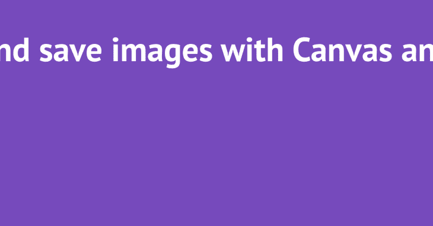
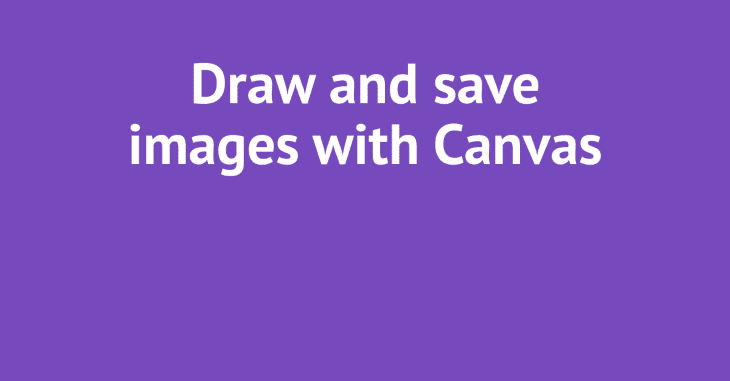
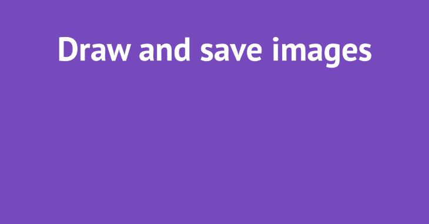
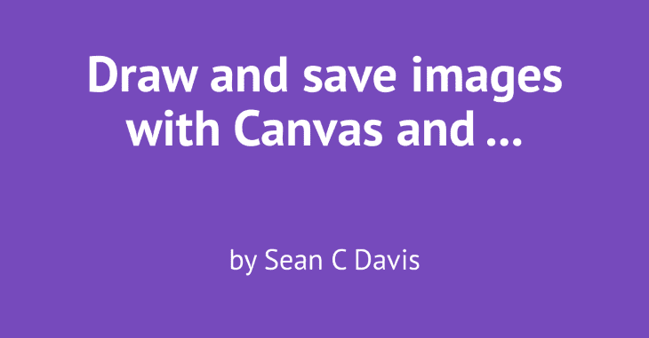
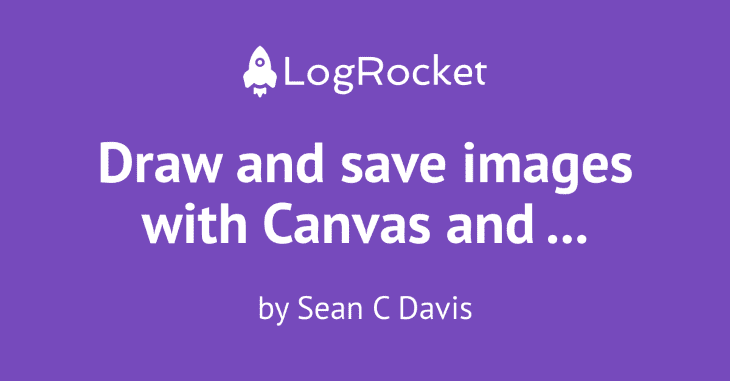
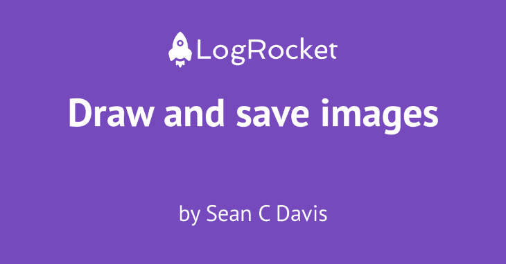
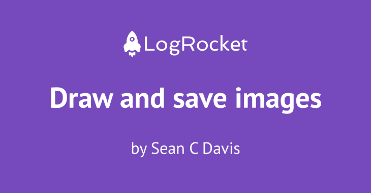

# 使用 node-canvas 创建和保存图像

> 原文：<https://blog.logrocket.com/creating-saving-images-node-canvas/>

让我们看看如何使用 Node.js 为一些内容生成元图像，比如一篇博客文章。

我们假设:

*   图像[应该是](https://neilpatel.com/blog/open-graph-meta-tags/#:~:text=The) `[1200px](https://neilpatel.com/blog/open-graph-meta-tags/#:~:text=The)` [x](https://neilpatel.com/blog/open-graph-meta-tags/#:~:text=The) `[627px](https://neilpatel.com/blog/open-graph-meta-tags/#:~:text=The)`
*   这篇文章的标题长度不一，如果太长，我们会将其截断，并用省略号(…)表示
*   有一个作者名字
*   我们想在图像的顶部包括一个标志

## 为什么要生成元图像？

我为我写的每一篇博客文章手动生成元图像。它让阅读帖子列表的读者感觉更愉快，在社交媒体上分享时看起来也不错。

但是我花了相当多的时间来找到正确的图标，选择一种我最近没有过度使用的颜色，导出图像，并将其添加到我的项目中。如果我能自动完成这个过程，我就不用做任何工作，仍然会有一个看起来不错的形象。

对于我或者任何已经手动生成图像的人来说，这是一个省时的方法。但是对于那些还没有生成图片的人来说，它让你的内容在分享时看起来更加精美。而且，带有图片的链接更容易被用户点击。

## 用画布和节点绘制图像

首先，我们将开始我们的新 JavaScript 项目。(如果你知道怎么做，那太好了！如果没有，[这里有一个方便的指南](https://www.seancdavis.com/blog/new-javascript-project-setup/)。)

一旦你有了基本的东西，安装你的依赖项。对于这个项目，我们所需要的是[节点-画布](https://www.npmjs.com/package/canvas)。

```
npm install canvas

```

在项目的根目录下创建一个名为`draw.js`的新文件。这将是我们运行的脚本。现在，让我们用它来记录一个“hello world”消息。

```
console.log("hello world")

```

在您的`package.json`文件中，您可能有一个`scripts`部分，这是一个`test`脚本。向该部分添加一个运行`node draw.js`的`draw`脚本。

```
{
  // ...
  "scripts": {
    "draw": "node draw.js"
  }
}

```

现在运行它！

```
npm run draw

```

您应该会在终端窗口上看到“hello world”字样。如果你做到了，你就可以开始运行了，我们可以开始生成我们的图像了。

## 空白画布保存到文件

让我们首先简单地生成一个紫色矩形，并将其保存到项目根目录下的一个名为`image.png`的文件中。更新您的`draw.js`文件，如下所示:

```
const { createCanvas } = require("canvas");
const fs = require("fs");

// Dimensions for the image
const width = 1200;
const height = 627;

// Instantiate the canvas object
const canvas = createCanvas(width, height);
const context = canvas.getContext("2d");

// Fill the rectangle with purple
context.fillStyle = "#764abc";
context.fillRect(0, 0, width, height);

// Write the image to file
const buffer = canvas.toBuffer("image/png");
fs.writeFileSync("./image.png", buffer);

```

现在再次运行脚本(`npm run draw`)并检查项目中的`image.png`文件。打开它，你应该会看到一个空白的紫色矩形。


## 用画布添加文章标题

接下来，我们来介绍一些内容。我们从帖子标题开始。将一个`post`对象添加到文件的顶部(我们稍后将向该对象添加作者)，然后在图像上呈现标题。

```
const { createCanvas } = require("canvas");
const fs = require("fs");

const width = 1200;
const height = 627;

// Add post object with the content to render
const post = {
  title: "Draw and save images with Canvas and Node"
}

const canvas = createCanvas(width, height);
const context = canvas.getContext("2d");

context.fillStyle = "#764abc";
context.fillRect(0, 0, width, height);

// Set the style of the test and render it to the canvas
context.font = "bold 70pt 'PT Sans'";
context.textAlign = "center";
context.fillStyle = "#fff";
// 600 is the x value (the center of the image)
// 170 is the y (the top of the line of text)
context.fillText(post.title, 600, 170);

const buffer = canvas.toBuffer("image/png");
fs.writeFileSync("./image.png", buffer);

```

这是我们得到的结果:



哎呦！它完全按照我们的要求做了，但是那种大小的文本量对于画布来说太大了，它溢出了边缘。

现在，我们可以使文本变小，但我不会减少太多，因为我希望它在图像共享时易于阅读。即使我们缩小文本，我们也仍然可能遇到这些问题。

## 环绕标题文本

让我们换成文字换行吧！

因为这将需要相当多的逻辑来正确工作，所以让我们保持主脚本文件的整洁并创建一个新的助手。向`utils/format-title.js`添加一个文件。下面是代码，加了注释，这样更容易理解发生了什么。

```
const getMaxNextLine = (input, maxChars = 20) => {
  // Split the string into an array of words.
  const allWords = input.split(" ");
  // Find the index in the words array at which we should stop or we will exceed
  // maximum characters.
  const lineIndex = allWords.reduce((prev, cur, index) => {
    if (prev?.done) return prev;
    const endLastWord = prev?.position || 0;
    const position = endLastWord + 1 + cur.length;
    return position >= maxChars ? { done: true, index } : { position, index };
  });
  // Using the index, build a string for this line ...
  const line = allWords.slice(0, lineIndex.index).join(" ");
  // And determine what's left.
  const remainingChars = allWords.slice(lineIndex.index).join(" ");
  // Return the result.
  return { line, remainingChars };
};

exports.formatTitle = (title) => {
  let output = [];
  // If the title is 40 characters or longer, look to add ellipses at the end of
  // the second line.
  if (title.length >= 40) {
    const firstLine = getMaxNextLine(title);
    const secondLine = getMaxNextLine(firstLine.remainingChars);
    output = [firstLine.line];
    let fmSecondLine = secondLine.line;
    if (secondLine.remainingChars.length > 0) fmSecondLine += " ...";
    output.push(fmSecondLine);
  }
  // If 20 characters or longer, add the entire second line, using a max of half
  // the characters, making the first line always slightly shorter than the
  // second.
  else if (title.length >= 20) {
    const firstLine = getMaxNextLine(title, title.length / 2);
    output = [firstLine.line, firstLine.remainingChars];
  }
  // Otherwise, return the short title.
  else {
    output = [title];
  }

  return output;
};

```

注意，我们导出了第二个函数。这是我们将在主脚本中使用的一个。第一个函数接受一个字符串并返回下一行和剩余的字符，它不允许任何一行的长度超过 20 个字符。

接下来，将其导入到主`draw.js`脚本中。

```
const { createCanvas } = require("canvas");
const fs = require("fs");

// Import the helper function.
const { formatTitle } = require("./utils/format-title");

const post = {
  title: "Draw and save images with Canvas and Node"
}

const width = 1200;
const height = 627;
// Extract the starting Y value for the title's position, which
// we'll move if we add a second line.
const titleY = 170;
// Set the line height of the text, which varies based on the
// font size and family.
const lineHeight = 100;

const canvas = createCanvas(width, height);
const context = canvas.getContext("2d");

context.fillStyle = "#764abc";
context.fillRect(0, 0, width, height);

context.font = "bold 70pt 'PT Sans'";
context.textAlign = "center";
context.fillStyle = "#fff";

// Format the title and render to the canvas.
const text = formatTitle(post.title);
context.fillText(text[0], 600, titleY);
// If we need a second line, we move use the titleY and lineHeight
// to find the appropriate Y value.
if (text[1]) context.fillText(text[1], 600, titleY + lineHeight);

const buffer = canvas.toBuffer("image/png");
fs.writeFileSync("./image.png", buffer);

```

再次运行它，然后打开生成的`image.png`文件。


太好了！我们的标题很长，所以分成两行。第二行仍然太长，所以`formatTitle`助手在末尾添加了省略号。

尝试将标题更改为 20 到 40 个字符，然后再次运行脚本，看看会发生什么。



请注意，该行在“保存”之后断开，而不是像完整标题那样在“图像”之后断开。这是因为`formatTitle`函数试图变得更聪明，如果标题在 20 到 40 个字符之间，它将使行的长度相似，这样我们(希望)不会出现坏的中断。它无论如何都不完美，但它解决了这些简单的案例。

如果我们进一步缩短它，我们可以在一行中得到所有的标题。



好吧！我们正在取得进展。😅

## 添加署名

让我们继续添加作者姓名的署名。

```
const { createCanvas } = require("canvas");
const fs = require("fs");

const { formatTitle } = require("./utils/format-title");

// Add author name to the post object. (Notice that I
// put the title back to the original.)
const post = {
  title: "Draw and save images with Canvas and Node",
  author: "Sean C Davis",
};

const width = 1200;
const height = 627;
const titleY = 170;
const lineHeight = 100;
const authorY = 500;

const canvas = createCanvas(width, height);
const context = canvas.getContext("2d");

context.fillStyle = "#764abc";
context.fillRect(0, 0, width, height);

context.font = "bold 70pt 'PT Sans'";
context.textAlign = "center";
context.fillStyle = "#fff";

const text = formatTitle(post.title);
context.fillText(text[0], 600, titleY);
if (text[1]) context.fillText(text[1], 600, titleY + lineHeight);

// Render the byline on the image, starting at 600px.
context.font = "40pt 'PT Sans'";
context.fillText(`by ${post.author}`, 600, authorY);

const buffer = canvas.toBuffer("image/png");
fs.writeFileSync("./image.png", buffer);

```

再运行一次。



这开始看起来像是我们可以利用的东西了！

## 添加徽标图像

让我们添加一个标志来完善它。我们将不得不在这里做一些逻辑上的改变。先给`assets/logo.png`加个 logo。[这是我在这个例子中使用的](https://github.com/seancdavis/seancdavis-com/raw/2741fbaa7b6da7f0f186fed5d2a4dcc4d174c943/examples/generate-meta-images/assets/logo.png)。

*注意:我把图像* `800px` *做得很宽，因为我们在* `400px` *渲染它，它在更高的 DPR 屏幕上看起来仍然清晰。你可能想根据你使用的图像放大或缩小***。**

 *下面的代码带有注释，以帮助您了解这些变化。

```
// Bring in loadImage function from canvas so we can
// add an image to the canvas.
const { createCanvas, loadImage } = require("canvas");
const fs = require("fs");

const { formatTitle } = require("./utils/format-title");

const post = {
  title: "Draw and save images with Canvas and Node",
  author: "Sean C Davis",
};

const width = 1200;
const height = 627;
// Set the coordinates for the image position.
const imagePosition = {
  w: 400,
  h: 88,
  x: 400,
    y: 75,
};
// Because we are putting the image near the top (y: 75)
// move the title down.
const titleY = 300;
const titleLineHeight = 100;
// Bring up the author's Y value as well to make it all
// fit together nicely.
const authorY = 525;

const canvas = createCanvas(width, height);
const context = canvas.getContext("2d");

context.fillStyle = "#764abc";
context.fillRect(0, 0, width, height);

context.font = "bold 70pt 'PT Sans'";
context.textAlign = "center";
context.fillStyle = "#fff";

const titleText = formatTitle(post.title);
context.fillText(titleText[0], 600, titleY);
if (titleText[1]) context.fillText(titleText[1], 600, titleY + titleLineHeight);

context.font = "40pt 'PT Sans'";
context.fillText(`by ${post.author}`, 600, authorY);

// Load the logo file and then render it on the screen.
loadImage("./assets/logo.png").then((image) => {
  const { w, h, x, y } = imagePosition;
  context.drawImage(image, x, y, w, h);

  const buffer = canvas.toBuffer("image/png");
  fs.writeFileSync("./image.png", buffer);
});

```

再运行一次。



看看那个！呜哇！我喜欢它。看起来很棒，可以分享。

让我们仔细检查它是否覆盖了我们的用例。缩短标题，使其适合单行，然后再次运行脚本。



嗯……看起来不太好。🙁

再补充一点定位逻辑吧。

```
const { createCanvas, loadImage } = require("canvas");
const fs = require("fs");

const { formatTitle } = require("./utils/format-title");

const post = {
  title: "Draw and save images with Canvas and Node",
  author: "Sean C Davis",
};
// Move the title formatter up farther because we're going to
// use it to set our Y values.
const titleText = formatTitle(post.title);

const width = 1200;
const height = 627;
const imagePosition = {
  w: 400,
  h: 88,
  x: 400,
    // Calculate the Y of the image based on the number of
    // lines in the title.
    y: titleText.length === 2 ? 75 : 100,
};
// Do the same with the title's Y value.
const titleY = titleText.length === 2 ? 300 : 350;
const titleLineHeight = 100;
// And the author's Y value.
const authorY = titleText.length === 2 ? 525 : 500;

const canvas = createCanvas(width, height);
const context = canvas.getContext("2d");

context.fillStyle = "#764abc";
context.fillRect(0, 0, width, height);

context.font = "bold 70pt 'PT Sans'";
context.textAlign = "center";
context.fillStyle = "#fff";

context.fillText(titleText[0], 600, titleY);
if (titleText[1]) context.fillText(titleText[1], 600, titleY + titleLineHeight);

context.font = "40pt 'PT Sans'";
context.fillText(`by ${post.author}`, 600, authorY);

loadImage("./assets/logo.png").then((image) => {
  const { w, h, x, y } = imagePosition;
  context.drawImage(image, x, y, w, h);

  const buffer = canvas.toBuffer("image/png");
  fs.writeFileSync("./image.png", buffer);
});

```

好吧，再来一次短标题。



看起来不错！不是完美的像素，但相当坚实。根据您的使用情况——图像大小、字体系列和大小——您可能想要调整这些值，直到它看起来合适为止，但是现在您已经有了一个强大的基础。

## 结论

你可以用多种方式来使用它。我想在这里停下来，因为我们已经解决了我们要解决的问题。然而，我打开了另一个帖子，在这个帖子中，我从一个文件目录中读取帖子数据，并为每个文件生成图像。这提供了一些额外的逻辑，可以帮助你把你的脚本变成你可以用于生产的东西。

[在这里看帖子](https://www.seancdavis.com/blog/generate-meta-images-for-blog-posts-with-node/)。而[这里是它的示例代码](https://github.com/seancdavis/seancdavis-com/tree/1c86b1f8e5333d5239caa10fd000be0e371997cb/examples/generate-meta-images)。

我很想看看你是如何把这个例子应用到你的项目中的。分享给全世界([和我](https://twitter.com/seancdavis29))！

## 200 只显示器出现故障，生产中网络请求缓慢

部署基于节点的 web 应用程序或网站是容易的部分。确保您的节点实例继续为您的应用程序提供资源是事情变得更加困难的地方。如果您对确保对后端或第三方服务的请求成功感兴趣，

[try LogRocket](https://lp.logrocket.com/blg/node-signup)

.

[](https://lp.logrocket.com/blg/node-signup)[https://logrocket.com/signup/](https://lp.logrocket.com/blg/node-signup)

LogRocket 就像是网络和移动应用程序的 DVR，记录下用户与你的应用程序交互时发生的一切。您可以汇总并报告有问题的网络请求，以快速了解根本原因，而不是猜测问题发生的原因。

LogRocket 检测您的应用程序以记录基线性能计时，如页面加载时间、到达第一个字节的时间、慢速网络请求，还记录 Redux、NgRx 和 Vuex 操作/状态。

[Start monitoring for free](https://lp.logrocket.com/blg/node-signup)

.*