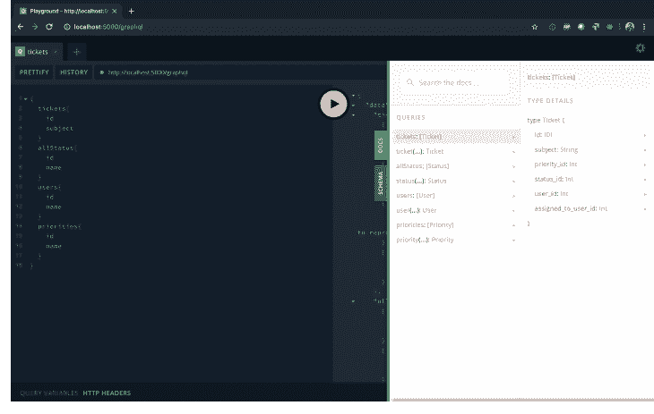
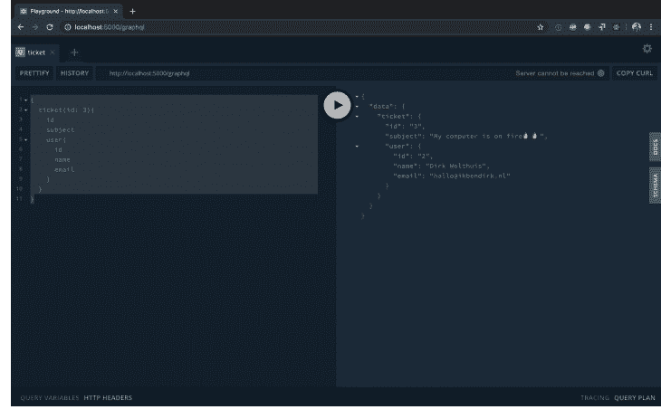

# 用 MySQL、Node.js 和 Apollo - LogRocket 博客创建可伸缩的 GraphQL API

> 原文：<https://blog.logrocket.com/creating-scalable-graphql-api-mysql-apollo-node/>

***编者按:**本帖于 2021 年 8 月更新相关信息和更新代码。*

准备好跳到一个 [GraphQL](https://blog.logrocket.com/intro-to-graphql-with-prisma/) API 了吗？如果您已经有了一个 MySQL 数据库，那么您就有了一个创建可伸缩 API 的绝佳起点。在本教程中，我们将介绍如何基于数据库创建模型，创建从数据库读取数据的节点 GraphQL API，并学习如何在不同的表之间建立关系。

## 创建 GraphQL 端点

在本教程中，我们将为票务系统构建一个小的 GraphQL 端点。我们希望创建一个端点，在这里我们可以读取票据并获取它们的相关数据，比如用户、状态和优先级。

我们将使用的构造块有:

*   (现有的)MySQL 数据库
*   [Node.js](https://nodejs.org/en/)
*   [Express](https://expressjs.com/)(node . js 的 web 框架)
*   [Apollo](https://www.apollographql.com/) (创建 GraphQL 端点的工具)
*   [序列化](http://docs.sequelizejs.com/)(对象关系映射包)
*   [Webpack](https://webpack.js.org/) (打包应用程序)
*   [Docker](https://www.docker.com/) (旋转本地 MySQL 数据库；只要您有 MySQL 实例，它就是可选的)

如果你不知道我刚才提到的每一部分，不要担心，我会描述这一过程中的每一步。如果您想继续编码，您可以签出[这个存储库](https://github.com/DirkWolthuis/graphql-express-migrating-mysql),并使用以下命令克隆教程发布的开始:

```
git clone <https://github.com/DirkWolthuis/graphql-express-migrating-mysql> --branch start
```

## 构建数据库层

首先，我们将假设我们正在使用一个现有的数据库。我创建了一个 SQL 文件，您可以将其导入 MySQL 数据库。我喜欢在一个 [Docker](https://blog.logrocket.com/docker-for-front-end-developers/) 容器中运行我的 MySQL 数据库。您可以使用`docker-compose.yaml`文件(在存储库中)来启动 MySQL 容器。

该数据库有四个表:票据、优先级、状态和用户。这些表格具有以下结构:

票

```
| Field               | Type             | Null | Key | Default           | Extra          |
+---------------------+------------------+------+-----+-------------------+----------------+
| id                  | int(11) unsigned | NO   | PRI | NULL              | auto_increment |
| subject             | varchar(256)     | NO   |     | NULL              |                |
| priority_id         | int(11)          | NO   |     | NULL              |                |
| status_id           | tinyint(4)       | NO   |     | NULL              |                |
| user_id             | int(11)          | NO   |     | NULL              |                |
| assigned_to_user_id | int(11)          | YES  |     | NULL              |                |
+---------------------+------------------+------+-----+-------------------+----------------+
```

用户

```
| Field | Type             | Null | Key | Default | Extra          |
+-------+------------------+------+-----+---------+----------------+
| id    | int(10) unsigned | NO   | PRI | NULL    | auto_increment |
| name  | varchar(256)     | NO   |     | NULL    |                |
| email | varchar(256)     | NO   |     | NULL    |                |
+-------+------------------+------+-----+---------+----------------+
```

优先

```
| Field | Type             | Null | Key | Default | Extra          |
+-------+------------------+------+-----+---------+----------------+
| id    | int(10) unsigned | NO   | PRI | NULL    | auto_increment |
| slug  | varchar(64)      | NO   |     | NULL    |                |
| name  | varchar(256)     | NO   |     | NULL    |                |
+-------+------------------+------+-----+---------+----------------+
```

状态

```
| Field | Type             | Null | Key | Default | Extra          |
+-------+------------------+------+-----+---------+----------------+
| id    | int(10) unsigned | NO   | PRI | NULL    | auto_increment |
| slug  | varchar(64)      | NO   |     | NULL    |                |
| name  | varchar(256)     | NO   |     | NULL    |                |
+-------+------------------+------+-----+---------+----------------+
```

使用上面的图表创建自己的数据库，或者将 SQL 文件导入 MySQL 数据库。我们准备开始编码。您可以在目录`tutorial_assets`中的存储库内找到 SQL 文件。

## 引导应用程序

对于本教程， [webpack](https://webpack.js.org/) 被设置为编译`dist`目录中的`app.js`文件。它是一个基本的 Express Hello World 应用程序。克隆项目后，您需要运行`npm install`来安装依赖项。

安装完毕？可以运行`npm run start`来启动 app。它将作为`[http://localhost:5000](http://localhost:5000)`上的端点。

让我们开始构建我们的 GraphQL API 吧！

## 在 MySQL 中创建数据库模型

几乎每个框架都使用模型与数据库进行交互。为了与我们的 MySQL 数据库进行交互，我们使用 [Sequelize](http://docs.sequelizejs.com/) 作为 ORM(对象关系映射)包。让我们从添加包开始(`mysql2`包是连接 MySQL 数据库所必需的),使用 npm:

```
npm install sequelize mysql2
```

或者用纱线:

```
yarn add sequelize mysql2
```

现在我们可以做两件事情中的一件:我们可以手工创建数据库模型，或者用一个额外的包自动生成它们。对于本教程，手动创建模型不成问题，因为我们的数据库中只有四个小表。但是当您正在迁移一个更大的数据库时，您可能想要更加自动化的东西。幸运的是，有一个基于现有数据库生成序列数据库文件的包。这个包被命名为 [Sequelize-Auto](https://github.com/sequelize/sequelize-auto) ，可以在全球范围内安装 npm:

```
npm install -g sequelize-auto MySQL
```

这是纱线的安装:

```
yarn global add sequelize-auto MySQL
```

为了以更加自动化的方式迁移数据库，我们可以使用`sequelize-auto`命令。我们需要在命令中插入 MySQL 数据库凭证来生成模型。如果您正在使用步骤 1 中提供的 MySQL dump，我已经创建了一个您需要使用的 config JSON 文件。

`sequelize-auto-settings.json`位于`tutorial_assets`目录中。如果你在本教程中使用你自己的数据库，查看 Sequelize API 文档中的[设置页面](https://sequelize.readthedocs.io/en/latest/api/sequelize/)，找到你需要的设置。

```
sequelize-auto -h <host> -d <database> -u <user> -x [password] -p [port]  --dialect [dialect] -c [/path/to/config] -o [/path/to/models]
```

所以，对我来说:

```
sequelize-auto -h localhost -d graphql-mysql-tutorial -u graphql -x 123456 -p 8006  --dialect mysql -c /Users/wolthuis/Documents/websites/tutorials/graphql-migrating-mysql/tutorial_assets/sequelize-auto-settings.json -o /Users/wolthuis/Documents/websites/tutorials/graphql-migrating-mysql/app/models
```

我们走吧！四个文件出现在`app/models`目录中。在我们的文件中，让我们从导入 Sequelize 和设置一些变量开始。

## 实现数据库模型

我们现在需要实现数据库模型。在 app 目录下，创建一个`database.js file`。在这个文件中，我们导入并导出数据库模型，这样我们就可以在应用程序中的任何地方使用它们。

```
import Sequelize from 'sequelize';

var db = {}

const sequelize = new Sequelize(
    'DATABASE_NAME',
    'DATABASE_USER',
    'DATABASE_PASSWORD',
    {
        host: 'DATABASE_HOST',
        port: 'DATABASE_PORT',
        dialect: 'mysql',
        define: {
            freezeTableName: true,
        },
        pool: {
            max: 5,
            min: 0,
            acquire: 30000,
            idle: 10000,
        },
        // <http://docs.sequelizejs.com/manual/tutorial/querying.html#operators>
        operatorsAliases: false,
    },
)

let models = []

// Initialize models
models.forEach(model => {
    const seqModel = model(sequelize, Sequelize)
    db[seqModel.name] = seqModel
})

// Apply associations
Object.keys(db).forEach(key => {
    if ('associate' in db[key]) {
        db[key].associate(db)
    }
})

db.sequelize = sequelize
db.Sequelize = Sequelize

export default db;
```

现在我们需要填写 MySQL 数据库凭证并导入新创建的模型。通常情况下，您会使用环境变量来安全地传递敏感数据，但是出于教程的目的，我将在`database.js`文件中硬编码一些值。

导入中带有凭证的`database.js`文件如下所示:

```
import Sequelize from 'sequelize';

var db = {}

const sequelize = new Sequelize('graphql-mysql-tutorial', 'graphql', '123456', {
    host: 'localhost',
    port: '8006',
    dialect: 'mysql',
    define: {
        freezeTableName: true,
    },
    pool: {
        max: 5,
        min: 0,
        acquire: 30000,
        idle: 10000,
    },
    // <http://docs.sequelizejs.com/manual/tutorial/querying.html#operators>
    operatorsAliases: false,
})

let models = [
    require('./models/priorities.js'),
    require('./models/status.js'),
    require('./models/tickets.js'),
    require('./models/users.js'),
]

// Initialize models
models.forEach(model => {
    const seqModel = model(sequelize, Sequelize)
    db[seqModel.name] = seqModel
})

// Apply associations
Object.keys(db).forEach(key => {
    if ('associate' in db[key]) {
        db[key].associate(db)
    }
})

db.sequelize = sequelize
db.Sequelize = Sequelize

export default db;
```

太好了，我们现在可以在应用程序的任何地方导入`db`变量，并访问我们所有的模型。在接下来的步骤中，我们将使用该变量来访问我们的数据。

## 设置阿波罗服务器

Apollo 是一家为 GraphQL 生态系统提供许多服务和开发工具的公司。它帮助开发人员使用许多包(如 Apollo Federation、Apollo Client 和 Apollo Server)构建快速可靠的 GraphQL 服务。

Apollo Server 是一个符合规范的、可用于生产的 JavaScript GraphQL 服务器，它有助于使用许多 Node.js 框架创建 GraphQL APIs。这是一个简单但功能强大的包，易于实现，易于使用，并且可以投入生产。

首先，我们需要添加两个包:

```
npm install apollo-server-express graphql
```

或者用纱线:

```
yarn add apollo-server-express graphql
```

安装后，我们需要在`app.js`内部做一些设置来耦合 Apollo 和 Express。我们从导入`ApolloServer`开始:

```
import { ApolloServer } from 'apollo-server-express';
```

然后，我们创建一个新的 Apollo 服务器实例:

```
const server = new ApolloServer({
        modules: []
})
```

最后一步是在现有的 Express 应用程序上应用 Apollo 服务器作为中间件:

```
server.applyMiddleware({ app })
```

我们还不能启动我们的应用程序，因为没有任何模块，阿波罗服务器将抛出一个错误。因此，我们将把我们的数据库实体实现到一个 GraphQL 端点中，这样我们就可以用 GraphQL 查询来访问它们。

## 创建我们的 GraphQL 类型和解析器

在 GraphQL 中，需要类型和解析器。类型描述了可以通过 GraphQL 端点获取或写入的数据。解析器是解析用户请求的逻辑。

在 GraphQL 目录中，我们创建了一个新文件`tickets.js`。在这个文件中，我们将包含一个来自`apollo-server-express`包的变量，我们将使用它来创建 GraphQL 类型定义，包括我们的`db`变量和两个用于类型 GraphQL 定义和 GraphQL 解析器的空对象。

```
import { gql } from 'apollo-server-express'
import * as db from '../database'

export const typeDefs = gql`

`
export const resolvers = {
}
```

## 创建 GraphQL 类型

首先我们填充`typeDefs`变量。你可以看到我们正在使用来自`apollo-server-express`包的`gql`变量。`gql`变量让我们编写包可读的类型定义。

* * *

### 更多来自 LogRocket 的精彩文章:

* * *

在`typeDefs`变量中，我们需要扩展查询类型并创建一个名为`Ticket`的新类型。我们需要扩展`Query`类型的原因是因为 GraphQL 总是使用名为`Query`的顶级类型。在该类型中嵌套了其他类型，这就是 GraphQL 如何知道在您的 GraphQL API 中可用的类型。

让我们扩展一下`Query`类型:

```
export const typeDefs = gql`
    extend type Query {
        tickets: [Ticket]
        ticket(id: ID!): Ticket
    }
    type Ticket {

    }
`
```

正如您所看到的，我们让 GraphQL 知道我们想要用两个新实体来扩展`Query`:`ticket`和`tickets`。

`Tickets`返回一个数组`tickets`:

```
tickets: [Ticket]
```

`Ticket`返回单类型的`Ticket`。票类型会收到一个名为`id`、`of type ID`的参数，并且不能为空(所以换句话说，参数是必需的)。GraphQL 类型中的感叹号表示值不能为空:

```
ticket(id: ID!): Ticket
```

现在我们的`Ticket`类型是空的，所以让我们填充这个类型:

```
export const typeDefs = gql`
    extend type Query {
        tickets: [Ticket]
        ticket(id: ID!): Ticket
    }
    type Ticket {
        id: ID!
        subject: String
        priority_id: Int
        status_id: Int
        user_id: Int
        assigned_to_user_id: Int
    }
`
```

这里，我们描述了票证类型由哪些类型组成。它与我们的数据库模型 100%匹配。这对于现在来说是正确的，但是将来当我们要在我们的类型/模型之间添加关系时，这种情况将会改变。

## 创建 GraphQL 解析器

现在我们已经创建了我们的`Ticket`实体，让我们创建我们的解析器。解析器需要或多或少地反映我们的类型。在 resolver 对象内部，我们也从一个顶级的`Query`对象开始。

```
export const resolvers = {
    Query: {},
}
```

在`Query`类型中，我们将创建两种票类型:`ticket`和`tickets`。我们使用我们的`db`(数据库)变量来解析数据库中的数据。

```
export const resolvers = {
    Query: {
        tickets: async () => db.tickets.findAll(),
        ticket: async (obj, args, context, info) =>
            db.tickets.findByPk(args.id),
    },
}
```

解析器接收两个参数，我们可以用它们来解析删除请求。`obj`是根对象，我们将使用这个根对象来建立关系。`args`是我们在类型中定义的函数参数。

对于我们的`tickets`查询，我们将接收一个`id`作为参数，并将其传递给我们的`findByPk`函数以获取一个特定的`Ticket`。如果你想了解更多关于`obj`、`args`、`context`和`info`的信息，请查阅[阿波罗文档](https://www.apollographql.com/docs/graphql-tools/resolvers/)。

## 将票务模块添加到我们的阿波罗服务器

我们已经创建了一个模块，现在我们只需要将它导入到我们的应用程序`app.js`中。为此，请添加模块:

```
const server = new ApolloServer({
    modules: [require('./GraphQL/tickets')],
})
```

现在对优先级、用户和状态进行同样的操作，并导入这些模块:

```
const server = new ApolloServer({
    modules: [
        require('./GraphQL/tickets'),
        require('./GraphQL/status'),
        require('./GraphQL/users'),
        require('./GraphQL/priorities'),
    ],
})
```

再次启动应用程序后，进入 [localhost:5000/graphql](http://localhost:5000/graphql) ，你将进入 Apollo GraphQL 查询构建器环境。在这个环境中，您可以测试您的 API 并创建查询，稍后您将在其他应用程序中使用这些查询。

此外，您可以使用右侧的 docs 按钮来浏览您的 API。因为 GraphQL 是类型化的，所以您自动拥有 API 文档。相当酷！



## 创建数据之间的关系

在获取特定的`Ticket`时自动获取用户名就好了。对于这一步，我们将创建一个`Ticket`和一个用户之间的关系。

## 在 GraphQL 中的票据类型上添加用户类型

因此，首先让我们编辑票证类型。我们需要让 GraphQL 知道我们想要请求一个 user 类型的用户:

```
export const typeDefs = gql`
    extend type Query {
        tickets: [Ticket]
        ticket(id: ID!): Ticket
    }
    type Ticket {
        id: ID!
        subject: String
        priority_id: Int
        status_id: Int
        user_id: Int
        user: User
        assigned_to_user_id: Int
    }
`
```

## 在 GraphQL 中为用户添加额外的解析器

接下来，我们需要添加一个嵌套的解析器来解析票据中的用户。在 resolver 对象中，我们将添加键`Ticket`。这就是当我们在一个类型中请求另一个类型时，GraphQL 知道如何解析嵌套查询的原因。

在本例中，解析器是票据类型中的`User`类型:

```
export const resolvers = {
    Query: {
        tickets: async () => db.tickets.findAll(),
        ticket: async (obj, args, context, info) =>
            db.tickets.findByPk(args.id),
    },
    Ticket: {
        user: async (obj, args, context, info) => db.users.findByPk(obj.user_id),
    },
}
```

您可以看到我们正在使用`obj`来访问票证数据。在票证数据中设置了`user_id`,因此我们可以从数据库中获得正确的用户。

所以让我们看看我们的代码是否有效。我创建了这个查询，看看能否获得嵌套的用户数据。注意，您还需要从用户类型中指定您想要的字段，在我的例子中是`id`、`name`和`email`字段。

```
{
  ticket(id: 3){
    id
    subject
    user{
      id
      name
      email
    }
  }
}
```

太好了，成功了！这是阿波罗的回报:



现在以同样的方式添加其他关系:`priority`、`status`和`assigned_to_user`。在添加完另一个嵌套解析器之后，您的`tickets.js`文件看起来会像这样:

```
import { gql } from 'apollo-server-express'
import * as db from '../database'
export const typeDefs = gql`
    extend type Query {
        tickets: [Ticket]
        ticket(id: ID!): Ticket
    }
    type Ticket {
        id: ID!
        subject: String
        priority_id: Int
        priority: Priority
        status_id: Int
        status: Status
        user_id: Int
        user: User
        assigned_to_user_id: Int
        assigned_to_user: User
    }
`
export const resolvers = {
    Query: {
        tickets: async () => db.tickets.findAll(),
        ticket: async (obj, args, context, info) =>
            db.tickets.findByPk(args.id),
    },
    Ticket: {
        user: async (obj, args, context, info) =>
            db.users.findByPk(obj.user_id),
        priority: async (obj, args, context, info) =>
            db.priorities.findByPk(obj.priority_id),
        status: async (obj, args, context, info) =>
            db.status.findByPk(obj.status_id),
        assigned_to_user: async (obj, args, context, info) =>
            db.users.findByPk(obj.assigned_to_user_id),
    },
}
```

转到`localhost:5000/graphql`并构建一个查询，获取所有票据及其状态、优先级和用户。使用此查询:

```
{
  tickets{
    subject
    status{
      slug
    }
    priority{
      slug
    }
    user{
      name
    }
    assigned_to_user{
      name
    }
  }
}
```

我获得了以下票证及其属性:

```
{
  "data": {
    "tickets": [
      {
        "subject": "My computer is on fire🔥🔥",
        "status": {
          "slug": "open"
        },
        "priority": {
          "slug": "high"
        },
        "user": {
          "name": "Dirk Wolthuis"
        },
        "assigned_to_user": null
      },
      {
        "subject": "MS Word is not starting, can someone help?",
        "status": {
          "slug": "doing"
        },
        "priority": {
          "slug": "low"
        },
        "user": {
          "name": "Chris Vogt"
        },
        "assigned_to_user": {
          "name": "Dirk Wolthuis"
        }
      },
      {
        "subject": "There is a bug in the 🛒 of the webshop, steps to reproduce are included",
        "status": {
          "slug": "doing"
        },
        "priority": {
          "slug": "high"
        },
        "user": {
          "name": "Andrew Clark"
        },
        "assigned_to_user": {
          "name": "Dirk Wolthuis"
        }
      },
      {
        "subject": "404 error: website not found - website down?💀",
        "status": {
          "slug": "closed"
        },
        "priority": {
          "slug": "high"
        },
        "user": {
          "name": "Andrew Clark"
        },
        "assigned_to_user": {
          "name": "Dirk Wolthuis"
        }
      }
    ]
  }
}
```

## 结论

我们已经创建了一个可用的 GraphQL API，您可以按照自己想要的方式定制它。您可以在实体之间添加多层关系。而且，在创建新的数据库表之后，您可以轻松地为您的应用程序创建所需的序列模型。

出于本教程的目的，我们已经创建了一个只读数据库。只是想看看代码？你可以在这个库中找到它。如果你想了解更多关于如何操作数据库中的数据，你可以查看[设计突变](https://www.apollographql.com/docs/apollo-server/essentials/schema/#designing-mutations)或者阅读[这篇关于突变的文章](https://www.howtographql.com/graphql-js/3-a-simple-mutation/)。服务器的设置略有不同，但逻辑是相同的。

## 监控生产中失败和缓慢的 GraphQL 请求

虽然 GraphQL 有一些调试请求和响应的特性，但确保 GraphQL 可靠地为您的生产应用程序提供资源是一件比较困难的事情。如果您对确保对后端或第三方服务的网络请求成功感兴趣，

[try LogRocket](https://lp.logrocket.com/blg/graphql-signup)

.

[](https://lp.logrocket.com/blg/graphql-signup)[https://logrocket.com/signup/](https://lp.logrocket.com/blg/graphql-signup)

LogRocket 就像是网络和移动应用的 DVR，记录下你网站上发生的每一件事。您可以汇总并报告有问题的 GraphQL 请求，以快速了解根本原因，而不是猜测问题发生的原因。此外，您可以跟踪 Apollo 客户机状态并检查 GraphQL 查询的键值对。

LogRocket 检测您的应用程序以记录基线性能计时，如页面加载时间、到达第一个字节的时间、慢速网络请求，还记录 Redux、NgRx 和 Vuex 操作/状态。

[Start monitoring for free](https://lp.logrocket.com/blg/graphql-signup)

.