# 使用 GitHub 操作创建单独的 monorepo CI/CD 管道

> 原文：<https://blog.logrocket.com/creating-separate-monorepo-ci-cd-pipelines-github-actions/>

您是否正在构建微服务，但仍想使用 monorepo？让我来帮你吧！使用 monorepo 是在一个代码库中管理多个相关项目的一种便捷方式。

这篇博客演示了如何为 monorepo 中的子项目创建单独的 CD 管道，这使得为小型或早期微服务应用程序使用 monorepo 更加可行，并尽可能长时间地继续使用 monorepo。

这篇博文中包含了一系列工作示例代码，您可以将这些代码放入您自己的 GitHub 帐户，亲自尝试自动化部署管道。

*向前跳转:*

## 微服务支持简单、独立的部署

我们为什么要用微服务？微服务可能适合您的项目有许多原因，但最重要的原因之一是使用微服务降低了我们的部署风险。

当您部署一个 monolith 时，您冒着破坏整个东西的风险，并且让您的客户没有一个可用的产品(直到您可以修复它)。这对你公司的财务和声誉都没有好处。

当您部署微服务时，您有可能只破坏应用程序的一小部分，因为一个微服务只是应用程序的一小部分。您可能会破坏的部分很小——通常甚至不面向客户——因此它所代表的风险也更小。

小问题也比大问题更容易修复(压力也更小)，因此将损坏的微服务回滚到工作状态通常比回滚整体更容易。

为了实现这一点，我们的微服务必须有独立的部署管道。也就是说，每个微服务必须能够与其他微服务分开部署。

相反，如果你有一个部署管道可以一次部署所有的微服务——那么，这并不比拥有一个整体好多少。为了充分利用微服务，每个微服务都需要自己独立的持续部署(CD)管道。

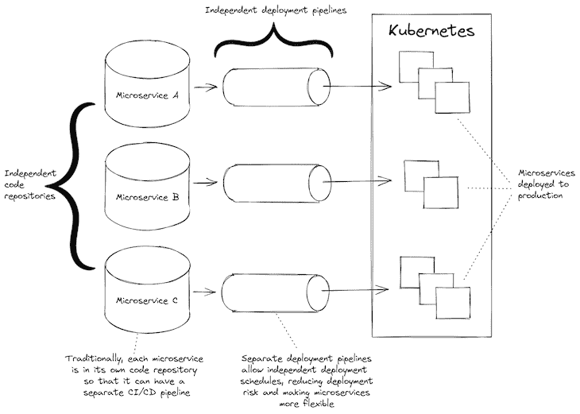

Figure 1: A normal microservices project with separate code repositories and independent CI/CD pipelines

我们可以使用带有微服务的 monorepo 吗？当然，我们当然可以。事实上，使用包含所有微服务的 monorepo 是开始新的微服务项目的一种非常方便和直接的方式。我已经用这种方式启动了多个新的微服务项目。

传统上，问题是 monorepo 有一个 CD 管道，当代码更改被推送到代码库时，这个管道被调用。所以，无论哪个微服务发生变化，都会部署所有的微服务。

在应用程序的早期，当所有的微服务都在开发并频繁变化时，这并不太糟糕。但是随着应用程序的成熟，您需要能够单独部署微服务—这不仅是因为部署所有微服务非常耗时(尤其是当微服务的数量开始爆炸时)，还因为您希望减轻、最小化和控制您的部署风险。

### 扩展 CD 管道和微服务

通常会有这样的时候——达到一定的成熟度，或者微服务太多——微服务的单个 CD 管道会成为应用程序可伸缩性的主要障碍。可惜这个时候往往微服务来的特别快！

在这一点上，我们通常会通过将稳定的微服务拉出到它们自己的代码库中来开始重构，在那里它们可以拥有自己的 CD 管道。在我们将微服务分离到它们自己的代码库中之后，我们可能会将它们重新组合到一个 metarepo 中(详见[元包](https://www.npmjs.com/package/meta))。

Metarepos 结合了 monorepo 的便利性和独立代码库的灵活性。但是，拥有独立的代码库增加了复杂性，如果我们能尽可能长时间地坚持使用更简单的 monorepo 会更好。

分拆单一回购还有其他原因。对于一个成长中的公司来说，拆分成独立的存储库可以让你在一个成长中的开发团队中进行扩展。

但是如果你想要的只是单独的 CD 管道，那么能够更长时间地坚持使用更简单的 monorepo 并且能够为每个子项目拥有单独的 CD 管道不是很好吗？

好消息是这是有可能的。你可以有多个 CD 管道——至少你可以使用 GitHub 操作——这允许我们在更长的时间内保持 monorepo 的简单性。

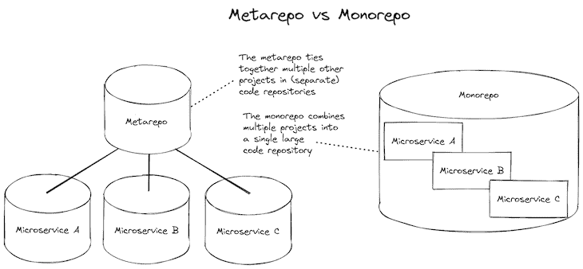

Figure 2: Comparing a metarepo to a monorepo

## 在 GitHub 操作中创建单独的 CI/CD 管道

当我们在 [GitHub](https://github.com/) 上托管我们的代码时，我们可以使用 [GitHub 动作](https://github.com/features/actions)来创建工作流，当代码被推送到我们的代码库时，这些工作流会被自动调用。我们可以使用这些来创建持续集成(CI)和持续部署(CD)的管道。

为了更简单，我喜欢把它解释为“在云中自动运行一个 shell 脚本”在脚本中指定命令，然后每当 GitHub Actions 检测到您的代码发生更改时，就会自动执行该脚本。

每个工作流的输出都显示在 GitHub Actions 用户界面中；下面的图 3 显示了一个例子。它收集并显示每个工作流调用的输出和状态(`success`或`failure`)。通常，当工作流失败时，GitHub 会自动向团队发送电子邮件，通知他们有人破坏了某些东西。

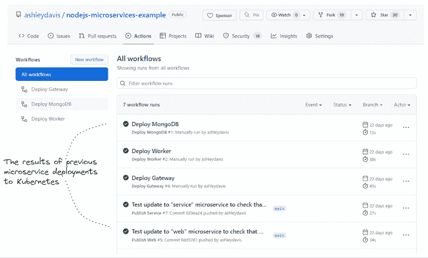

Figure 3: An example of workflow history in GitHub Actions

为了热身，让我们看看基本的工作流配置是什么样子的。下面的示例代码显示了为 Node.js 项目运行自动化测试的工作流。在一个代码库中，我们可以有任意多的工作流，所以下面的工作流可能只是特定代码库中的一个。

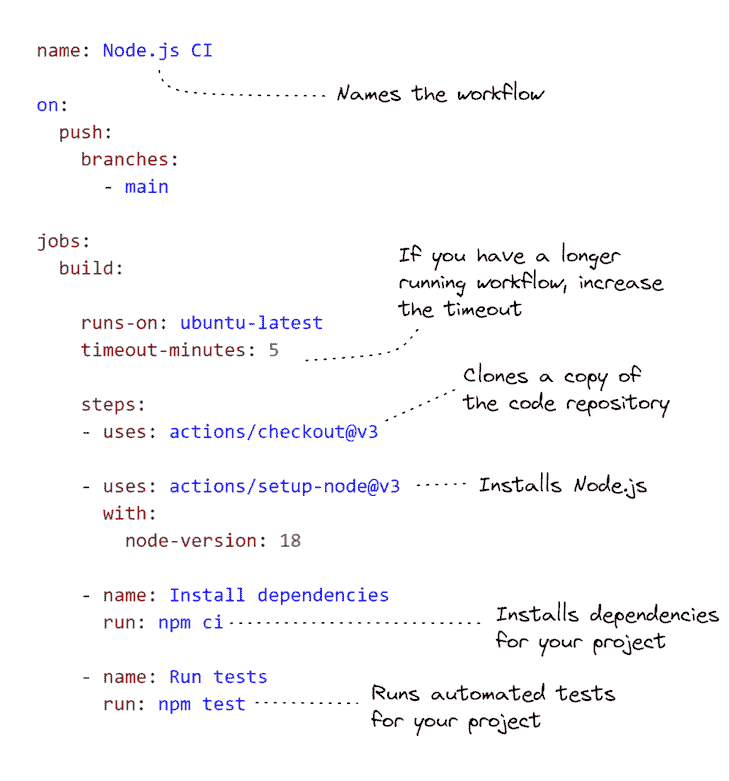

An example of workflow configuration for running automated tests in a Node.js project

## 示例项目

这篇文章附带了一个工作示例，你可以自己尝试一下。示例项目是包含两个微服务的 monorepo。每一个都有自己独立的 CD 管道，将微服务部署到 Kubernetes 集群。

代码[可在 GitHub](https://github.com/ashleydavis/nodejs-microservices-example) 上获得。克隆示例回购的本地副本，如下所示:

```
git clone https://github.com/ashleydavis/nodejs-microservices-example.git

```

你也可以[下载 zip 文件](https://github.com/ashleydavis/nodejs-microservices-example/archive/refs/heads/main.zip)，或者，如果你只是想[看看 GitHub Actions 工作流历史是什么样子的](https://github.com/ashleydavis/nodejs-microservices-example/actions)，我已经链接到了 GitHub 中的例子。

下面，图 4 提供了示例项目的概述。它显示了与两个微服务项目相关的工作流配置，以及将它们部署到 Kubernetes 的配置。

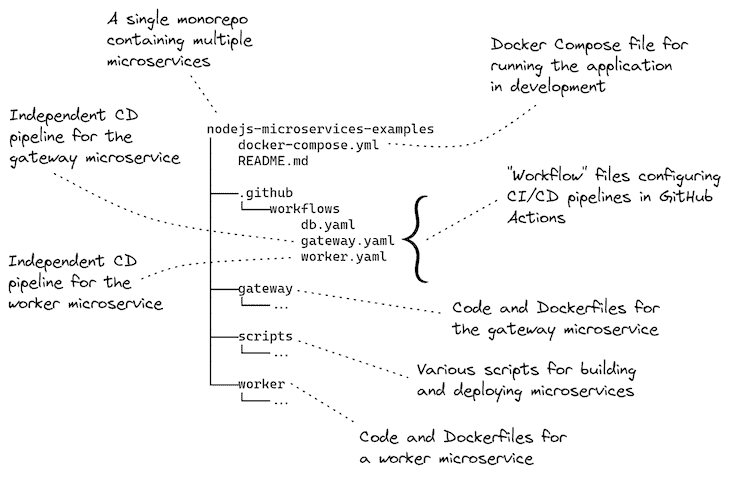

Figure 4: The structure of the example project

## 先决条件

运行示例项目需要什么？

嗯，那要看你想怎么经营了！

如果您希望在开发计算机上本地运行微服务应用程序，您将需要:

如果您想通过从开发计算机运行部署脚本来将其部署到 Kubernetes，您将需要:

如果您想让 GitHub Actions 工作流程自己运行，您需要:

在这篇文章的其余部分，我们将更详细地研究这些例子。

## 在本地运行应用程序进行开发

如果你想在开发中尝试在本地运行这个微服务应用，你只需要安装 [Docker Desktop](https://www.docker.com/products/docker-desktop/) 。

[清单 1](https://github.com/ashleydavis/nodejs-microservices-example/blob/main/docker-compose.yml) 展示了使这成为可能的 Docker 合成文件。您可以看到它如何启动多个“服务”:一个用于 MongoDB 数据库服务器，一个用于我们的每个微服务。它还启动了一个将测试数据加载到我们的数据库中的服务(名为`db-fixture`)。

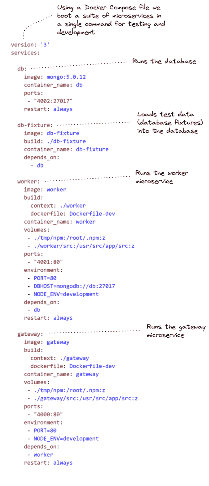

Listing 1 ([docker-compose.yaml](https://github.com/ashleydavis/nodejs-microservices-example/blob/main/docker-compose.yml)). Docker Compose file for running the example microservices application on our development computer

要运行它，首先将目录更改为代码库的本地副本:

```
cd nodejs-microservices-example

```

然后，在 Docker Compose 下启动本地微服务应用程序:

```
docker compose up --build

```

运行后，您可以通过打开 web 浏览器并导航到`[http://localhost:4000/](http://localhost:4000/)`来测试它。你应该看到“你好电脑！”打印在网页上。这很简单，但它向您展示了网关微服务正在为一个网页提供服务。

在 route `/api/data`下有一个示例 REST API 可以通过 gateway 微服务获得；将您的浏览器导航到`[http://localhost:4000/api/data](http://localhost:4000/api/data)`以查看其输出。

网关微服务将 REST API 请求转发给工人微服务，您可以在`[http://localhost:4001/api/data](http://localhost:4001/api/data)`直接访问工人微服务。注意，在开发中运行微服务应用程序时，我们只能像这样直接访问 worker 微服务。当我们将应用程序部署到 Kubernetes 时，它被配置为只有 gateway 微服务可以从外部访问，而 worker 微服务只能在 Kubernetes 集群中访问。

当微服务应用程序在本地运行时，您可以随意尝试代码。它是为[实时重载](https://blog.logrocket.com/complete-guide-full-stack-live-reload/)配置的，因此您对每个微服务的代码所做的任何更改都会导致该微服务自动重载以合并您的更改。

完成后，您可以关闭本地微服务应用程序:

```
docker compose down

```

Docker Compose 是启动和停止本地微服务应用程序的一种非常方便的方式。

## 从您的开发计算机部署到 Kubernetes

在创建自动化部署管道之前(比如说，使用 GitHub 操作)，最好先练习一下我们将要自动化的命令。

如果您想从自己的开发计算机上运行这些命令，您需要:

当然，您不需要这样做。您可以直接跳到在 GitHub 操作中使用这个例子(如果是这样，跳到下一节)。但是您很容易遇到问题，比如 Kubernetes 集群的认证问题。如果我们试图在 GitHub 操作下解决这些问题，那么调试起来会很困难而且很慢。

通过首先从我们的本地开发计算机上练习部署，可以更快更容易地试验和解决问题。在我们尝试在 GitHub Actions 中自动化部署脚本之前，这为我们的成功做好了准备。

### 部署数据库

让我们从部署一个 MongoDB 数据库到我们的 Kubernetes 集群开始。这是一个简单的起点，因为我们不必为它构建 Docker 映像(我们重用 DockerHub 上可用的[预构建映像)，并且我们不必为部署参数化 Kubernetes 配置文件。](https://hub.docker.com/_/mongo)

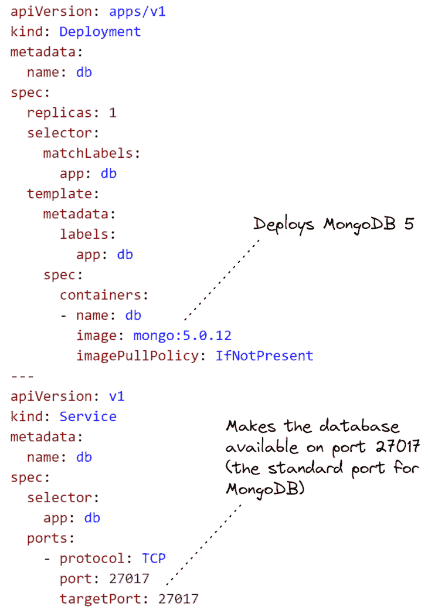

Listing 2 ([scripts/kubernetes/db.yaml](https://github.com/ashleydavis/nodejs-microservices-example/blob/main/scripts/kubernetes/db.yaml)). Kubernetes Yaml configuration file to deploy the database

我们使用 Kubectl 部署这个配置:

```
kubectl apply -f ./scripts/kubernetes/db.yaml

```

现在，让我们部署我们的两个微服务。这并不那么简单，因为它们的部署配置需要参数，我们必须在部署它们之前填补这些配置中的空白。

### 扩展我们的模板化配置

我创建了自己的工具，名为 [Figit](https://www.npmjs.com/package/figit/v/0.0.8) ，用于扩展模板化配置。Figit 是一个运行在 Node.js 下的命令行工具，我们向 Figit 输入 YAML 文件，它从环境变量中填充参数。

为什么我们甚至需要参数化我们的配置文件？首先，能够在不同的环境中重用我们的配置文件是件好事。但是在这篇博文中，我们将使用它来“插入”容器注册表的 URL 和每个 Docker 图像的版本。

您可以在[清单 3](https://github.com/ashleydavis/nodejs-microservices-example/blob/main/scripts/kubernetes/worker.yaml) 中看到，worker 微服务的配置类似于数据库的配置(来自清单 2)，除了我们参数化了对 Docker 映像的引用。清单 3 突出显示了这一部分，因此您可以很容易地看到它。

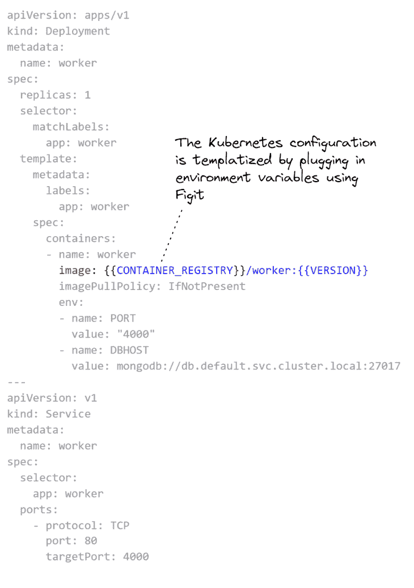

Listing 3 ([scripts/kubernetes/worker.yaml](https://github.com/ashleydavis/nodejs-microservices-example/blob/main/scripts/kubernetes/worker.yaml)). Kubernetes Yaml configuration file to deploy the worker microservice

在部署之前，我们必须展开清单 3 中的配置模板。为此，我们需要设置环境变量`CONTAINER_REGISTRY`和`VERSION`:

```
export CONTAINER_REGISTRY=<url-to-your-container-registry>
export VERSION=1

```

或者在 Windows 上，像这样:

```
set CONTAINER_REGISTRY=<url-to-your-container-registry>
set VERSION=1

```

现在我们可以对扩展进行试运行，看看结果。要运行`figit`，我们必须安装 Node.js 依赖项:

```
npm install

```

现在，我们可以展开 YAML 配置模板并查看结果:

```
npx figit ./scripts/kubernetes/worker.yaml

```

终端的输出应该显示配置中的`CONTAINER_REGISTRY`和`VERSION`已经被替换为环境变量的值。

### 构建和发布微服务

示例项目包括为每个微服务构建和发布 Docker 映像的 shell 脚本。

要构建每个微服务:

```
./scripts/build-image.sh worker
./scripts/build-image.sh gateway

```

不过，这些 shell 脚本不能在 Windows 上运行。如果您想在 Windows 上尝试一下，您可能想在 WSL2 下使用 Linux 终端或者直接调用`docker build`命令(查看 shell 脚本中的命令细节)。

要发布，您必须首先使用容器注册表的用户名和密码设置一些环境变量:

```
export REGISTRY_UN=<container-registry-username>
export REGISTRY_PW=<container-registry-password>

```

在 Windows 上，使用`set`命令而不是`export`。

然后，要将微服务的映像发布到容器注册表，请使用以下命令:

```
./scripts/publish-image.sh worker
./scripts/publish-image.sh gateway

```

随着微服务的构建和发布，我们现在可以部署它们了。

### 部署微服务

让我们将微服务部署到 Kubernetes。为此，我们必须使用`figit`来扩展配置模板，并将扩展的配置传输到`kubectl`，将我们的微服务部署到 Kubernetes 集群:

```
npx figit ./scripts/kubernetes/worker.yaml --output yaml | kubectl apply -f -

npx figit ./scripts/kubernetes/gateway.yaml --output yaml | kubectl apply -f -

```

为了检查部署，调用`kubectl get pods`和`kubectl get deployments` 来查看我们对 Kubernetes 的部署是否成功。

一切进展顺利，我们的微服务现在应该在 Kubernetes 中运行。worker 微服务是隐藏的，不可访问，但 gateway 微服务对全世界开放，因此我们可以从我们的 web 浏览器测试它。要找到 IP 地址，调用`kubectl get services`，在列表中查找`gateway`。将您的 web 浏览器导航到该 IP 地址，查看网关微服务的网页。

如果您想要更改代码并尝试部署某个微服务的更新版本，请确保在构建、发布和部署微服务之前增加您的`VERSION`环境变量。

### 清理 Kubernetes 集群

这是我们部署的一次练习，以确保我们的部署流程在自动化之前能够正常工作。一会儿我们将在 GitHub Actions 下设置真正的部署。

首先，我们应该清理我们的 Kubernetes 集群，并删除我们在练习运行中部署的微服务:

```
npx figit ./scripts/kubernetes/worker.yaml --output yaml | kubectl delete -f -

npx figit ./scripts/kubernetes/gateway.yaml --output yaml | kubectl delete -f -

```

## 用 GitHub 动作实现独立的 CD 管道

现在，最重要的是！在这最后一部分，我们使用 GitHub Actions 自动部署我们的微服务。

要亲自尝试，您需要:

最重要的部分是如何将每个 GitHub Actions 工作流限定到 monorepo 中每个子项目的子目录中。您可以在清单 4 的[中看到这是如何指定的。这使得 monorepo 中的每个微服务都有自己独立的 CD 管道。](https://github.com/ashleydavis/nodejs-microservices-example/blob/main/scripts/kubernetes/worker.yaml)

您可以向这个 monorepo 添加任意多的微服务，但是它们都需要自己的工作流配置，其范围是 monorepo 中的子目录。

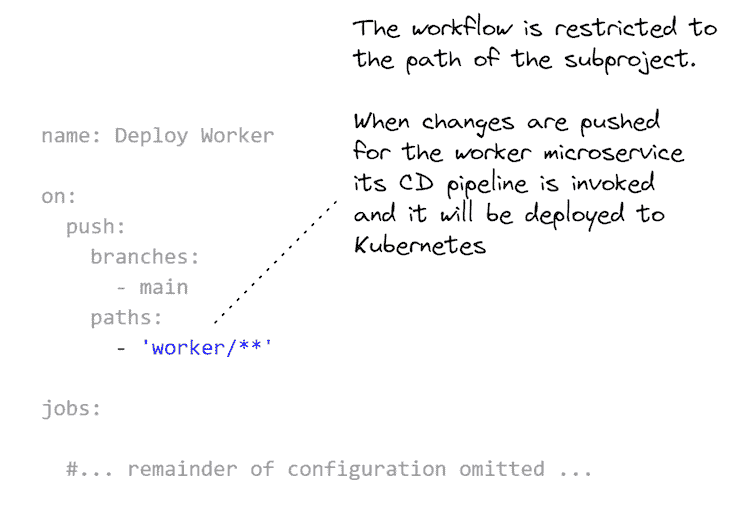

Listing 4 (extract from [scripts/kubernetes/worker.yaml](https://github.com/ashleydavis/nodejs-microservices-example/blob/main/scripts/kubernetes/worker.yaml)). The GitHub Actions workflow configuration for the worker microservice is scoped to its subdirectory in the monorepo

### GitHub 操作的 Kubernetes 部署工作流

上面的清单 4 只是为了突出重要部分的摘录。[下面的清单 5](https://github.com/ashleydavis/nodejs-microservices-example/blob/main/scripts/kubernetes/worker.yaml) 展示了 worker 微服务的 CD 管道的完整工作流配置，包括:

*   从 GitHub Secrets 设置环境变量；
*   建立和发布码头工人形象；
*   配置 Kubectl，然后；
*   扩展 Kubernetes 部署配置模板并将 worker 微服务部署到 Kubernetes


Listing 5 (the full [scripts/kubernetes/worker.yaml](https://github.com/ashleydavis/nodejs-microservices-example/blob/main/scripts/kubernetes/worker.yaml)). The complete GitHubActions workflow configuration for the worker microservice

关于在 GitHub 动作中使用`kubectl-action`的更多信息，请[参见文档](https://github.com/marketplace/actions/kubernetes-cli-kubectl)。

### 在 GitHub Secrets 中设置秘密和其他配置

为了能够在 GitHub Actions 中运行每个微服务的工作流，我们必须将所需的环境变量添加到代码存储库的 GitHub Secrets 中。这些是我们之前在本地计算机上练习部署时设置的环境变量`CONTAINER_REGISTRY`、`REGISTRY_UN`和`REGISTRY_PW`。

不过，不要担心设置`VERSION`——这是在工作流配置中根据对代码库的最新更改的提交散列自动设置的。这是一个很好的方法来确保我们的 Docker 图像总是有一个新的版本号，我们不必担心手动增加它们。

图 5 显示了如何在代码库中设置 GitHub 秘密。


Figure 5: Configuring your GitHub Actions workflow via GitHub Secrets

### 通过 GitHub UI 手动调用部署

还有最后一件值得一提的事情:我们可以对 GitHub Actions 工作流配置做一个小小的更新，允许我们手动调用它。这在某些情况下非常有用，即使微服务的代码没有改变，也可以点击一个按钮来调用微服务的部署。

这样做的一个原因是当我们想通过 GitHub Secrets 重新配置一个环境变量时。更改环境变量的值不会自动触发重新部署，所以当我们这样做时，我们需要在部署管道中手动触发它。

[清单 6](https://github.com/ashleydavis/nodejs-microservices-example/blob/main/scripts/kubernetes/worker.yaml) 显示了我们需要添加的内容，以便能够手动调用 GitHub Actions 工作流。在图 6 中，您可以看到我们如何通过 GitHub Actions UI 调用工作流来重新部署 worker 微服务。

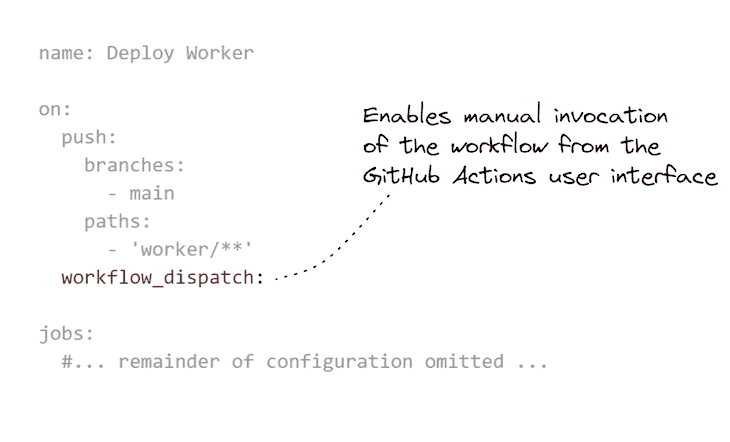

Listing 6 (extract from [scripts/kubernetes/worker.yaml](https://github.com/ashleydavis/nodejs-microservices-example/blob/main/scripts/kubernetes/worker.yaml)). A GitHub Actions workflow configured for manually invocation

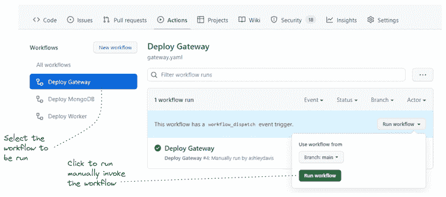

Figure 6: Manually invoking a GitHub Actions workflow (the CD pipeline for a microservice) through the GitHub UI

## 亲自尝试 GitHub 操作

现在您可以自己尝试 GitHub 操作了。在您这样做之前，您应该认真学习前面的部分，练习从您的开发计算机部署到 Kubernetes。从本地计算机部署到 Kubernetes 有助于解决在 GitHub 操作下运行时更难解决的所有问题，因为您无法直接访问运行部署管道的计算机。

为此，您需要自己的 GitHub 帐户，然后为示例项目派生[repo。](https://github.com/ashleydavis/nodejs-microservices-example)

现在，将 GitHub 秘密添加到您的分叉存储库中，以设置`CONTAINER_REGISTRY`、`CONTAINER_UN`、`CONTAINER_PW`和`KUBE_CONFIG`。前面提到了前三个环境变量；新的`KUBE_CONFIG`是 base64 编码的 Kubernetes 配置，它配置`kubectl`来访问您的 Kubernetes 集群。

这很容易生成。如果您已经在本地配置了`kubectl`,您可以像这样编码您的本地配置:

```
cat ~/.kube/config | base64

```

然后从您的终端复制 base64 编码的配置，并将其放在`KUBE_CONFIG` secret 中。

基本就是这样！

现在，您有两种方法来触发微服务的部署管道:

1.  为其中一个微服务推送代码更改
2.  通过 GitHub 用户界面手动触发工作流

当然，很多事情都可能出错——如果您以前没有做过，那么仅仅配置到 Kubernetes 的连接就很困难。这就是为什么在让您的部署管道在 GitHub Actions 中工作之前，您应该在本地进行实践。

## 摘要

使用 monorepo 是启动微服务项目的一种便捷方式，但通常，在很长时间内，我们必须将其分成多个 repo，以便我们可以为我们的微服务创建独立的部署管道，从而获得微服务架构模式的全部好处。

然而，这篇博文展示了一种不同的方法。我们已经展示了如何使用 GitHub Actions 在 monorepo 中为微服务创建单独的 CD 管道，这意味着我们可以继续使用我们的 monorepo，以及它提供的持续便利，更深入地进入我们的微服务项目的生命周期。

## 使用 [LogRocket](https://lp.logrocket.com/blg/signup) 消除传统错误报告的干扰

[](https://lp.logrocket.com/blg/signup)

[LogRocket](https://lp.logrocket.com/blg/signup) 是一个数字体验分析解决方案，它可以保护您免受数百个假阳性错误警报的影响，只针对几个真正重要的项目。LogRocket 会告诉您应用程序中实际影响用户的最具影响力的 bug 和 UX 问题。

然后，使用具有深层技术遥测的会话重放来确切地查看用户看到了什么以及是什么导致了问题，就像你在他们身后看一样。

LogRocket 自动聚合客户端错误、JS 异常、前端性能指标和用户交互。然后 LogRocket 使用机器学习来告诉你哪些问题正在影响大多数用户，并提供你需要修复它的上下文。

关注重要的 bug—[今天就试试 LogRocket】。](https://lp.logrocket.com/blg/signup-issue-free)