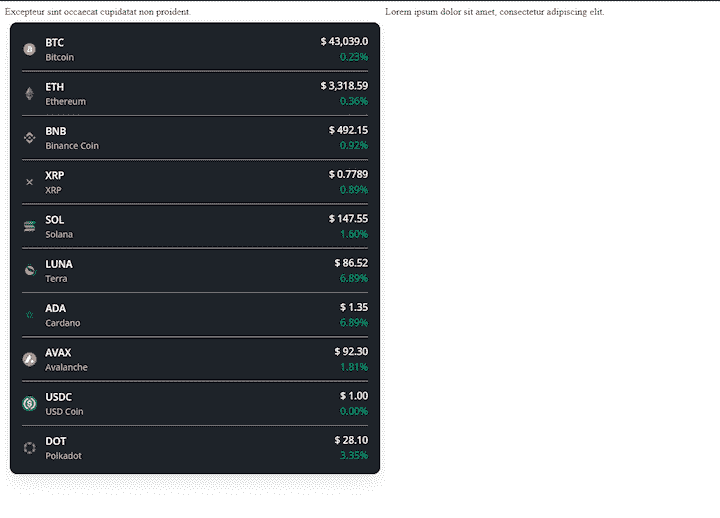

# 创建可共享的 React 窗口小部件

> 原文：<https://blog.logrocket.com/creating-shareable-react-widgets/>

React 是一个基于组件的 JavaScript 库，越来越受欢迎。在 2021 年的一项全球研究中，[超过 40%的被调查开发者报告使用 React](https://www.statista.com/statistics/1124699/worldwide-developer-survey-most-used-frameworks-web/) 。React 的广泛使用并不令人惊讶。React 灵活、易学，并提供了编写定制组件的能力。这些定制组件，或者说[单独的 UI 块](https://blog.logrocket.com/building-reusable-ui-components-with-react-hooks/)，是可重用的，并且可以很容易地在其他 React 应用之间共享。

然而，React 不太直接的一个方面是将定制组件集成到静态网站中。在本教程中，我们将演示如何使用小部件将 React 组件与完全由 HTML 构建的静态网站集成。

打开你最喜欢的文本编辑器，让我们开始吧！

小部件是一个 UI，它在内部处理数据逻辑和数据表示，独立于网页上的其他元素。小部件用于向独立的静态应用程序添加动态内容(如弹出窗口、图像转盘或动态列表)。

小部件是框架不可知的。本教程主要关注 React 组件的集成，但是同样的方法也可以用于在您选择的框架中创建的组件。

天气窗口小部件是许多人日常交互的常见窗口小部件的一个例子。它使用用户的地理位置显示附近地区的当前天气状况。这个小部件处理几个任务，比如获得访问用户位置的许可和获取天气数据。

嵌入天气小部件的应用程序或网站不需要关心如何获取数据或如何向用户显示数据。这些任务由小部件处理。

让我们创建一个小部件，它将从 [Crypto Compare API](https://min-api.cryptocompare.com) 中读取数据，并按市值显示顶级加密货币的列表。

首先，我们需要建立一个 React 项目。

要创建和运行 React 应用程序，Node.js 和 npm 都必须安装在系统中。

打开终端，运行以下命令:

```
npx create-react-app ReactWidgetDemo
cd ReactWidgetDemo 

```

在`src`文件夹中，创建两个新文件夹:`components`和`hooks`。我们将创建一个自定义挂钩来从加密比较 API 获取数据。

在`hooks`文件夹中，创建一个新文件:`useCryptoData.js`。

```
import { useEffect, useState } from "react";

const useCryptoData = () => {
  const [cryptoData, setCryptoData] = useState([]);
  const [isLoading, setLoading] = useState(true);

  useEffect(() => {
    setLoading(true);
    // fetch the data and set cryptData
    setLoading(false);
  }, [])

  return { cryptoData, isLoading }
};

```

在`useCryptoData`定制钩子中，我们使用`useState` React 钩子来创建两个状态变量:`cryptoData`和`isLoading`。

`cryptoData`状态变量将存储来自 API 的数据。`isLoading`状态将指示数据提取是否正在进行。

现在，我们将使用`fetch()`方法从加密比较 API 中检索数据，然后设置`cryptoData`状态:

```
import { useEffect, useState } from "react";

const useCryptoData = () => {
  const [cryptoData, setCryptoData] = useState([]);
  const [isLoading, setLoading] = useState(true);
  useEffect(() => {
    setLoading(true);
    fetch(
      "https://min-api.cryptocompare.com/data/top/mktcapfull?limit=10&tsym=USD"
    )
      .then((res) => res.json())
      .then((data) => {
        console.log(data);
        const preparedData = [];
        data.Data.forEach((d) => {
          const { Id, Name, FullName, ImageUrl, Url } = d.CoinInfo;
          let Price, Change24hr;
          if (d.DISPLAY?.USD) {
            const { PRICE, CHANGEPCT24HOUR } = d.DISPLAY.USD;
            Price = PRICE;
            Change24hr = CHANGEPCT24HOUR;
          }
          preparedData.push({
            Id,
            Name,
            FullName,
            ImageUrl: `https://www.cryptocompare.com${ImageUrl}`,
            Url: `https://www.cryptocompare.com${Url}`,
            Price,
            Change24hr
          });
        });
        setCryptoData(preparedData);
      })
      .finally(() => setLoading(false));
  }, []);
  return { cryptoData, isLoading };
};

export default useCryptoData;

```

`components`文件夹将存放主要的小部件组件文件。在`CryptoList`组件文件中导入`useCryptoData`钩子:

```
import useCryptoData from "./useCryptoData";

const CryptoItem = (props) => (
  <div className="item">
    
    <div className="display-container">
      <div className="name">{props.Name}</div>
      <div className="fullname">{props.FullName}</div>
    </div>
    <div className="price-container">
      <div className="price">{props.Price}</div>
      <div
        className={`price-change ${
          parseInt(props.Change24hr) < 0 ? "danger" : "success"
        }`}
      >
        {props.Change24hr}
      </div>
    </div>
  </div>
);

const CryptoList = () => {
  const { cryptoData, isLoading } = useCryptoData();
  return (
    <div>
      <div className="container">
        {!isLoading ? (
          cryptoData.map((itemData) => (
            <CryptoItem key={itemData.Id} {...itemData} />
          ))
        ) : (
          <p className="loading-text">Loading Data...</p>
        )}
      </div>
    </div>
  );
};

export default CryptoList;

```

接下来，在主`App()`组件中使用`CryptoList`组件:

```
import CryptoList from "./components/CryptoList";
import "./styles.css";

export default function App() {
  return (
    <div>
      <CryptoList />
    </div>
  );
}

```

现在，让我们为组件添加样式以改善其外观:

```
@import url("https://fonts.googleapis.com/css2?family=Open+Sans:[email protected];600&display=swap");
:root {
  --dark: #1e2329;
  --light: #fafafa;
  --success: #03a66d;
  --danger: #cf304a;
}
* {
  font-family: "Open Sans", sans-serif;
}
.name,
.loading-text {
  color: var(--light);
  font-size: 16px;
  font-weight: 600;
}
.fullname {
  color: #b6b6b6;
  font-size: 14px;
  margin-top: 3px;
  font-weight: 500;
}
.item {
  display: flex;
  align-items: center;
  padding: 12px 0px;
  border-bottom: 1px solid #949191;
}
.item:first-child {
  padding-top: 0px;
}
.item:last-child {
  padding-bottom: 0px;
  border-bottom: 0px;
}
.container {
  background-color: var(--dark);
  padding: 20px;
  border-radius: 12px;
  box-shadow: rgba(0, 0, 0, 0.1) 0px 10px 30px;
}
.icon {
  height: 24px;
  width: 24px;
  margin-right: 14px;
}
.price-container {
  margin-left: auto;
  display: flex;
  flex-direction: column;
  align-items: flex-end;
}
.price {
  font-weight: 500;
  color: var(--light);
  font-size: 16px;
}
.price-change {
  margin-top: 3px;
}
.price-change.danger {
  color: var(--danger);
}
.price-change.success {
  color: var(--success);
}

```

要启动并运行 React 应用程序，请从项目根目录使用以下命令:

```
npm run start

```

这将建立一个本地开发服务器，并在端口 3000 上运行应用程序。

打开浏览器，进入 [http://localhost:3000](http://localhost:3000) 。

到 CodeSandbox 去[看看演示`CryptoList`小部件在运行](https://codesandbox.io/s/intelligent-jones-zwd0h)。

现在是时候在独立的静态 HTML 网页中使用 demo `CryptoList`小部件了。我们将使用 iframe 来嵌入小部件。

我们将把 React 应用程序的 URL 传递给`<iframe />`的`src`属性。在这个例子中，URL 是 [http://localhost:3000](http://localhost:3000) 。

```
<iframe
  src="http://localhost:3000"
  style="border: none;"
  width="100%"
></iframe>

```

下面是静态网页中其他元素包含的 iframe 和小部件代码:

```
<html lang="en">
  <head>
    <meta charset="UTF-8" />
    <meta http-equiv="X-UA-Compatible" content="IE=edge" />
    <meta name="viewport" content="width=device-width, initial-scale=1.0" />
    <style>
      .row {
        display: flex;
        flex-direction: row;
      }
      .col {
        flex: 1;
      }
    </style>
    <title>Static website</title>
  </head>
  <body style="min-height: 100vh">
    <div class="row">
      <div class="col">
        <div>Excepteur sint occaecat cupidatat non proident.</div>
        <iframe
          src="http://localhost:3000"
          style="border: none; min-height: 98vh"
          width="100%"
        ></iframe>
      </div>
      <div class="col">
        Lorem ipsum dolor sit amet, consectetur adipiscing elit.
      </div>
    </div>
  </body>
</html>

```

下面是嵌入在 HTML 网页中的演示`CryptoList`小部件:



## 在 React 应用程序之间共享组件

根据项目的不同，可能需要在 React 应用程序之间共享小部件，而不是将它们集成到一个静态网站中。要为 React 应用程序创建可共享的小部件，我们可以[创建一个公共组件库](https://blog.logrocket.com/build-component-library-react-typescript/)并将其发布在 npm 上。本指南包含关于[如何为 React](https://blog.logrocket.com/the-complete-guide-to-publishing-a-react-package-to-npm/) 创建 npm 包的详细说明。

或者，我们可以从存储库中导入包:

```
npm i https://github.com/{username}/{repo}.git

```

我们可以在不同的 React 项目中安装这个包，并在我们的 JSX 文件中导入这个组件。使用这种方法，小部件可以单独维护。每当小部件的功能或样式更新时，这将通过简单地更新 npm 包反映在 React 项目中。

## 结论

在 React 中制作可共享的小部件非常容易。在本教程中，我们演示了如何使用 React 构建一个简单的小部件，然后将其与静态 HTML 网页集成。

作为一名开发人员，理解使用 iframe 嵌入小部件的利弊很重要。这可能不是每个用例的首选选项。对于涉及大量嵌入式小部件的项目，可以考虑将[迁移到 Gatsby](https://blog.logrocket.com/is-gatsby-really-that-great-e7b19c4c1c05/) 或 React 的另一个静态站点生成器。

要了解更多关于 React 的信息，请访问其[网站](https://reactjs.org/docs/getting-started.html)或 [MDN](https://developer.mozilla.org/en-US/docs/Learn/Tools_and_testing/Client-side_JavaScript_frameworks/React_getting_started) 上的 React 资源。

## [LogRocket](https://lp.logrocket.com/blg/react-signup-general) :全面了解您的生产 React 应用

调试 React 应用程序可能很困难，尤其是当用户遇到难以重现的问题时。如果您对监视和跟踪 Redux 状态、自动显示 JavaScript 错误以及跟踪缓慢的网络请求和组件加载时间感兴趣，

[try LogRocket](https://lp.logrocket.com/blg/react-signup-general)

.

[ ](https://lp.logrocket.com/blg/react-signup-general) [](https://lp.logrocket.com/blg/react-signup-general) 

LogRocket 结合了会话回放、产品分析和错误跟踪，使软件团队能够创建理想的 web 和移动产品体验。这对你来说意味着什么？

LogRocket 不是猜测错误发生的原因，也不是要求用户提供截图和日志转储，而是让您回放问题，就像它们发生在您自己的浏览器中一样，以快速了解哪里出错了。

不再有嘈杂的警报。智能错误跟踪允许您对问题进行分类，然后从中学习。获得有影响的用户问题的通知，而不是误报。警报越少，有用的信号越多。

LogRocket Redux 中间件包为您的用户会话增加了一层额外的可见性。LogRocket 记录 Redux 存储中的所有操作和状态。

现代化您调试 React 应用的方式— [开始免费监控](https://lp.logrocket.com/blg/react-signup-general)。