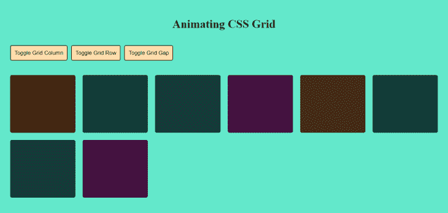
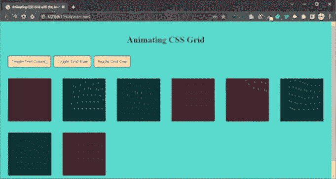
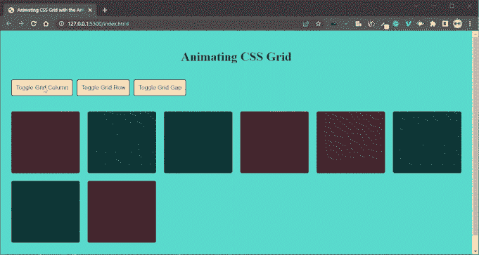
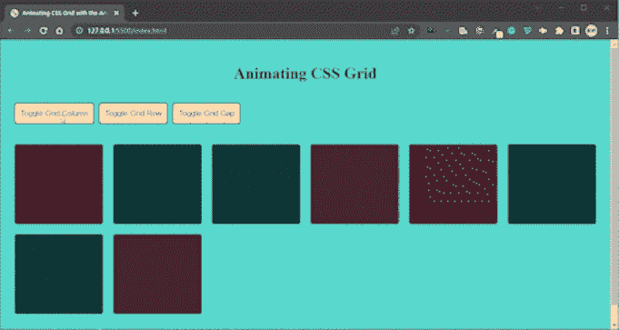

# 使用动画 CSS 网格创建更平滑的 CSS 过渡

> 原文：<https://blog.logrocket.com/creating-smoother-css-transitions-animate-css-grid/>

现在可以轻松地在 CSS 网格中制作属性动画并创建平滑过渡，而无需编写任何动画代码。耶！

在这篇文章中，我们将演示如何使用动画 CSS 网格包来动画我们的网格的所有属性。我们将看看这个包的特性，看看它有多容易使用。动画 CSS 网格使我们能够实现 CSS 网格容器的状态变化之间的平滑过渡，而无需编写任何 CSS 动画代码。我们还将看看如何配置 CSS 包来满足我们的特定需求。

我们开始吧！

*向前跳转:*

## 什么是 CSS 网格？

如果你正在阅读这篇文章，你可能已经熟悉了 [CSS 网格](https://developer.mozilla.org/en-US/docs/Web/CSS/CSS_Grid_Layout)。但是，对于那些不熟悉 CSS 的读者，这里有一个简单的介绍。

CSS grid 允许我们使用基于网格的布局系统(包括行和列)在 CSS 中进行布局，从而更容易设计网页，而不需要使用浮动和定位。 [CSS Flexbox 设计用于构建一维布局](https://blog.logrocket.com/how-to-build-a-basic-flexbox-layout-a-tutorial-with-examples/)(行或列)，而 CSS grid 设计用于同时构建二维布局(行和列)。

基于网格的布局包括具有一个或多个子元素的父元素。一些 CSS 网格属性包括`grid-column`、`grid-row`、`grid-template-column`和`grid-gap`。大多数 CSS 网格属性可以被动画化；我们将在本文后面演示如何制作其中一些动画。要了解更多关于 CSS 网格属性和动画的信息，[请看官方文档](https://www.w3.org/TR/css-grid-1/)。

## CSS 网格布局可以动画化吗？

以前，动画 CSS 网格属性几乎是不可能的，因为该功能缺乏浏览器支持。它最近才在 Firefox v66+和其他浏览器(如 Chrome v 107、Safari v 16.1 和 Edge v 107)中获得支持。

在撰写本文时，几乎所有的 CSS 网格属性都包含在[可动画化的 CSS 属性](https://developer.mozilla.org/en-US/docs/Web/CSS/CSS_animated_properties)中。然而，对于本文，我们不会通过为我们的过渡编写 CSS 动画来动画化网格属性。相反，我们将使用[动画 CSS 网格](https://github.com/aholachek/animate-css-grid)开源包。

## CSS 网格动画是如何工作的？

动画 CSS 网格允许您方便地将 CSS 网格的状态从一种状态转换到另一种状态。如果网格的内容发生变化，或者通过添加或删除类来更新它的一个子元素，网格将自动转换到新的配置。

这个包允许你制作 CSS 网格属性的动画，包括`grid-column`、`grid-row`、`grid-template-column`和`grid-gap`。

animate-css-grid 为您处理所有动画，节省您编写自己的动画代码的时间和压力。如果你像我一样，不喜欢在 CSS 中配置纯动画，这一点尤其重要！

要使用 animate-css-grid，你所要做的就是用包提供的`wrapGrid` 方法包装你的网格容器。每当代码中的任何网格属性发生变化时，当它从一种状态转换到另一种状态时，就会自动产生动画效果。

用 animate-css-grid 包配置动画的另一种方法是将一个对象传递给`wrapGrid`方法。我们将在本文的后面讨论这个选项。

## 动画 CSS 网格演示

动画 CSS 网格可用于普通 JavaScript、React 和 Vue.js 项目。对于本文的范围，我们将使用普通的 JavaScript 构建一个项目。

### 构建项目

首先，让我们创建一个名为`animate-css-grid`的文件夹，我们可以在其中创建以下文件:`index.html`、`style.css`和`script.js`。

在你喜欢的代码编辑器中打开文件夹(我用的是 VS 代码)。现在，让我们写一些代码。

在`index.html`文件中，将`style`文件导入到`<head>`标签中:

```
<link rel="stylesheet" href="style.css" />
```

现在，在`<body>`标签中添加以下代码，并在 HTML 下面导入`<script>`标签:

```
<body>
    <h1>Animating CSS Grid</h1>
    <div class="buttons">
      <button class="column-button">Toggle Grid Column</button>
      <button class="row-button">Toggle Grid Row</button>
      <button class="gap-button">Toggle Grid Gap</button>
    </div>
    <div class="grid">
      <div class="grid__item"></div>
      <div class="grid__item"></div>
      <div class="grid__item"></div>
      <div class="grid__item"></div>
      <div class="grid__item"></div>
      <div class="grid__item"></div>
      <div class="grid__item"></div>
      <div class="grid__item"></div>
    </div>

    <script src="script.js"></script>
</body>
```

我们的`<body>`标签有一个包含包名的`<h1>`标签和一个围绕三个按钮的叫做`buttons`的`<div>`标签。稍后，我们将配置这个标记，以便在单击任何按钮时修改网格的属性。

还有另一个名为`grid`的`<div>`标签，代表我们的网格父容器，里面有我们所有的网格项目。

将以下代码添加到`style.css`文件中:

```
html,
body {
  font-size: 16px;
  color: hsl(60, 58%, 0%);
}
body {
  padding: 20px;
  background-color: rgb(99, 232, 203);
}
h1 {
  font-size: 2rem;
  text-align: center;
}
.buttons {
  display: flex;
  flex-wrap: wrap;
  gap: 10px;
  margin: 40px 0;
}
button {
  padding: 10px;
  border-radius: 5px;
  border: 2px solid hsl(60, 58%, 17%);
  background-color: navajowhite;
}
.grid {
  display: grid;
  grid-template-columns: repeat(auto-fit, minmax(10rem, 1fr));
  grid-auto-rows: 10rem;
  grid-gap: 20px;
  margin: 40px 0;
}
.grid__item {
  background-color: hsl(40, 58%, 17%);
  border-radius: 5px;
}
.grid__item:nth-child(1),
.grid__item:nth-child(4) {
  background-color: hsl(10, 58%, 17%);
}
.grid__item:nth-child(2),
.grid__item:nth-child(6) {
  background-color: hsl(150, 58%, 17%);
}
.grid__item:nth-child(3),
.grid__item:nth-child(7) {
  background-color: hsl(200, 58%, 17%);
}
.grid__item:nth-child(4),
.grid__item:nth-child(8) {
  background-color: hsl(305, 58%, 17%);
}

/* transition styles that would be animated */
.toggle-column {
  grid-template-columns: repeat(auto-fit, minmax(16rem, 1fr));
}
.toggle-row {
  grid-auto-rows: 16rem;
}
.toggle-gap {
  grid-gap: 40px;
}
```

我们已经为文档中的每个元素添加了样式，我们还编写了一些样式，当任何按钮被单击时，这些样式将通过 JavaScript 添加到网格父容器中或从其中删除。

下面是我们当前的代码在浏览器中的样子:



接下来，将以下代码添加到`script.js`文件中:

```
// selecting our elements
const gridButton = document.querySelector(".column-button");
const rowButton = document.querySelector(".row-button");
const gapButton = document.querySelector(".gap-button");
const gridCntr = document.querySelector(".grid");

// adding event listeners to the buttons
gridButton.addEventListener("click", function () {
  gridCntr.classList.toggle("toggle-column");
});

rowButton.addEventListener("click", function () {
  gridCntr.classList.toggle("toggle-row");
});

gapButton.addEventListener("click", function () {
  gridCntr.classList.toggle("toggle-gap");
});
```

在上面的代码中，我们选择了我们的按钮，并分别保存为`gridButton`、`rowButton`和`gapButton`。我们还选择了网格父容器，并将其命名为`gridCntr`。

我们还为每个按钮添加了事件监听器。它们是这样工作的:

*   当点击`Toggle Grid Column`按钮时，我们在网格上添加或删除`toggle-column`样式属性，增加或减少网格项目的宽度
*   当点击`Toggle Grid Row`按钮时，我们在网格上添加或删除`toggle-row`样式属性，增加和减少网格项目的高度
*   当点击`Toggle Grid Gap`按钮时，我们在网格上添加或删除`toggle-gap`样式属性，增加和减少每个网格项目之间的空间

现在，让我们来查看浏览器中的变化:



我们可以看到我们的按钮工作正常。但是，我们的网格需要在不同的状态之间平稳过渡。这就是 animate-css-grid 包发挥作用的地方。

### 导入动画 CSS 网格并包装容器

有两种方法可以在项目中使用 animate-css-grid 包。一种方法是通过运行以下命令之一来安装软件包:

```
yarn add animate-css-grid
```

```
npm install animate-css-grid
```

第二种选择是使用脚本标记，而不是安装包。你可以在[包的 GitHub 自述文件](https://github.com/aholachek/animate-css-grid#how-to-use-it)中读到更多关于这个选项的信息。

对于本文，我们将使用脚本标记方法。

在`<body>`标签的底部，包含以下脚本标签:

```
<script src="https://unpkg.com/[email protected]"></script>
<script>
      const grid = document.querySelector(".grid");
      animateCSSGrid.wrapGrid(grid);
</script>
```

您会注意到，我们不仅通过脚本标签导入了包，还将网格容器作为目标，并用`animateCSSGrid.wrapGrid()`方法包装它。

回到我们的浏览器，当我们改变网格的状态时，我们最终可以看到一个过渡效果。这种过渡可以通过动画 CSS 网格来实现:



### 通过传递对象来配置动画 CSS 网格

正如我前面提到的，我们也可以通过传入一个对象来配置 CSS 动画。该对象需要下列值:

*   `stagger`:表示网格中项目的每个动画之间应该经过的时间量；默认值为`0ms`
*   持续时间:表示动画将持续的总时间；默认值为`250ms`
*   `easing`:表示过渡的动画计时功能；默认值为`[ease-in-out](https://developer.mozilla.org/en-US/docs/Web/CSS/easing-function)`。[你可以在这里了解更多可用的缓动功能](https://developer.mozilla.org/en-US/docs/Web/CSS/easing-function)
*   `onStart`:表示一个元素将要动画化时要调用的函数
*   `onEnd`:表示一个元素完成动画时要调用的函数

让我们将下面的配置传递给我们的`wrapGrid`方法:

```
animateCSSGrid.wrapGrid(grid, {
        stagger: 100,
        duration: 500,
        easing: "backInOut",
        onStart: (animatingElementList) => {
          console.log("starting animation");
        },
        onEnd: (animatingElementList) => {
          console.log("ending animation");
        },
      });
```

现在，让我们在浏览器中查看变化:


这就对了，很简单！

## 结论

动画当然使我们的 CSS 网格更具视觉吸引力！我们可以使用动画 CSS 网格来实现这一点，同时编写较少的代码。

在本文中，我们演示了如何使用动画 CSS 网格包来为网格制作动画和创建更平滑的过渡，以及如何配置其设置。

你可以在 [GitHub](https://github.com/Timonwa/animate-css-grid) 和这个[现场演示](https://animate-css-grid-timonwa.vercel.app)上玩这个代码。单击演示按钮观看动画和过渡。

## 你的前端是否占用了用户的 CPU？

随着 web 前端变得越来越复杂，资源贪婪的特性对浏览器的要求越来越高。如果您对监控和跟踪生产环境中所有用户的客户端 CPU 使用、内存使用等感兴趣，

[try LogRocket](https://lp.logrocket.com/blg/css-signup)

.

[](https://lp.logrocket.com/blg/css-signup)[https://logrocket.com/signup/](https://lp.logrocket.com/blg/css-signup)

LogRocket 就像是网络和移动应用的 DVR，记录你的网络应用或网站上发生的一切。您可以汇总和报告关键的前端性能指标，重放用户会话和应用程序状态，记录网络请求，并自动显示所有错误，而不是猜测问题发生的原因。

现代化您调试 web 和移动应用的方式— [开始免费监控](https://lp.logrocket.com/blg/css-signup)。