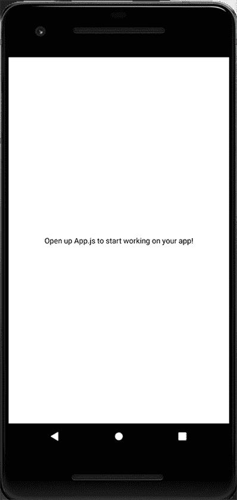
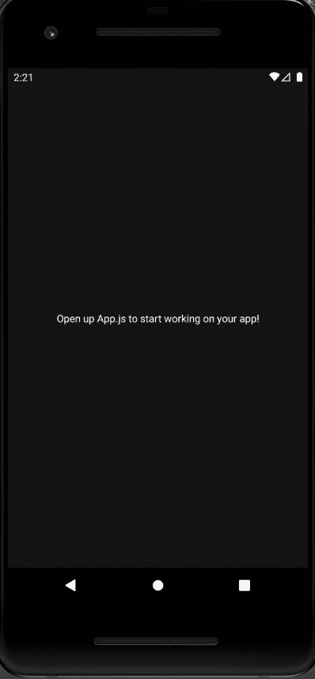
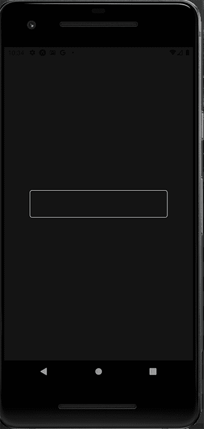
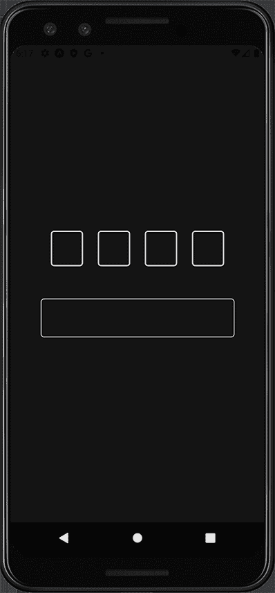
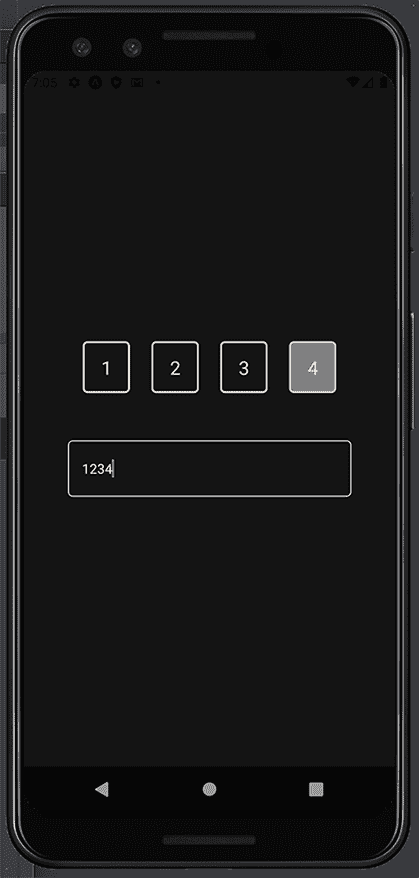
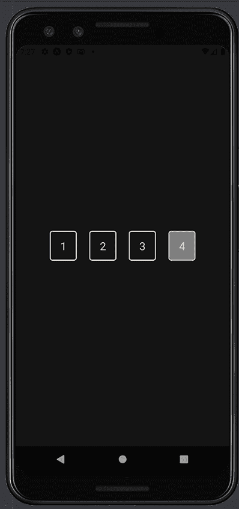

# 在 React Native 中创建分割 OTP 输入字段

> 原文：<https://blog.logrocket.com/creating-split-otp-input-fields-react-native/>

作为 React 本地开发人员，我们经常需要创建要求用户输入一次性密码(OTP)的身份验证流。

当我们考虑创建这个特性所带来的`TextInput`的处理时，OTP 可能是一项令人生畏的任务。经典的`TextInput`显示将用户输入的文本输出到一个框中，尽管被星号隐藏。但是，如果我们想要分割显示，为每个 OTP 数字创建一个框，该怎么办呢？我们完全可以做到！

在本文中，我们将学习如何在 React Native 中创建分割 OTP 输入字段，而不使用外部包。

## 设置环境

为了设置开发环境，我们将使用 [Expo CLI](https://docs.expo.dev/workflow/expo-cli/) 。要在 Expo 中创建新的 React 本地项目，请运行以下命令:

```
expo init splitOTP

```

选择**空白**选项，这将引导您的项目。接下来，运行`expo start`来启动 Metro 服务器。你可以在 Android 模拟器或 iOS 模拟器上打开应用程序。本文中的截图将是 Android 的，但在 iOS 上应该几乎相同。

现在，我们的模拟器应该是这样的:



我们将使用`styled-components`进行应用程序样式化，您可以安装:

```
>npm i start 

```

或者…

```
yarn add styled-components

```

## 在应用程序中实现分割 OTP 输入字段

实现 split OTP 特性的概念是让`TextInput`成为我们的参考组件，或者换句话说，成为我们的事实来源。对于这个文本输入接收到的每个数字，我们将以框的形式呈现一个样式化的`View`。

之后，文本输入将被隐藏，并根据需要使用`useRef`钩子调用。我把容器`View`的`background-color`改成了更暗的颜色，这样我们的实现就更加清晰可见了。


Pictorial representation of our work concept.

下面的代码片段显示了我们的条目文件`App.js`，我们在其中修改了背景颜色:

```
export default function App() {
 return (
   <View style={styles.container}>
     <Text
       style={{
         color: "white",
       }}
     >
       Open up App.js to start working on your app!
     </Text>
     <StatusBar style="auto" />
   </View>
 );
}

const styles = StyleSheet.create({
 container: {
   flex: 1,
   backgroundColor: "#141414",
   alignItems: "center",
   justifyContent: "center",
 },
});

```



### 呈现`TextInput`组件

接下来，我们将创建`components`文件夹。在这个文件夹中，我们将有另一个名为`OTP`的文件夹，它将存放`OTPInput.js`和`Styles.js`文件。

在`OTPInput.js`文件中，我们将使用样式化的组件创建两个组件:`TextInputHidden`，稍后我们将隐藏的文本输入；和`OTPInputContainer`，住房文本输入本身。

下面是我们的`Styles.js`文件:

```
import styled from "styled-components/native";

export const OTPInputContainer = styled.View`
 justify-content: center;
 align-items: center;
`;

export const TextInputHidden = styled.TextInput`
 width: 300px;
 border-color: #e5e5e5;
 border-width: 1px;
 border-radius: 5px;
 padding: 15px;
`;

```

下面是我们的`OTPInput.js`文件中的代码:

```
import React from "react";
import { OTPInputContainer, TextInputHidden } from "./styles";

const OTPInput = () => {
 return (
   <OTPInputContainer>
     <TextInputHidden />
   </OTPInputContainer>
 );
};

export default OTPInput;

```

现在，我们将使用`App.js`中的`OTPInput`组件，这样我们可以在我们的仿真器/模拟器中呈现整个实现:

```
import { StatusBar } from "expo-status-bar";
import { StyleSheet, Text, View } from "react-native";
import OTPInput from "./components/OTP/OTPInput";

export default function App() {
 return (
   <View style={styles.container}>
     <OTPInput />
     <StatusBar style="auto" />
   </View>
 );
}

const styles = StyleSheet.create({
 container: {
   flex: 1,
   backgroundColor: "#141414",
   alignItems: "center",
   justifyContent: "center",
 },
});

```



我们将初始化`App.js`中的一些状态，并将它们作为道具传递给`OTPInput.js`文件。

第一个状态将是`code`，一个空字符串，它将存储在输入字段中输入的值。

第二个状态是`isPinReady`，一个布尔值，默认为`false`，当用户输入所需的预期位数时为`true`。

现在，我们将预期数字的最大长度声明为 4(这可以根据您的用例来声明)。

我们将把这些状态作为道具传递给`OTPInput`组件。接下来，我们将析构我们作为道具传递到`App.js`中的`OTPInput.js`组件的所有值。被析构的值将被传递给`TextInputHidden`。

接下来，我们将把`TextInput`组件的值设置为`code`状态，并将`onChangeText`设置为`setCode`。当用户输入值时,`onChangeText`将更新代码状态(之前设置为空字符串)。

由于我们只期望数字被输入到输入字段，我们将`keyboardType`设置为`number-pad`并将`maxLength`设置为可以输入的最大数字。在我们的例子中，也是四个。

为了在输入失焦时处理`onBlur`事件，我们将使用`useRef`钩子和`handleOnBlur`函数。我们将用`useRef`创建一个参考变量，并将初始值设为`null`。对于`handleOnBlur`函数，我们做一个声明供以后使用。

现在，在我们的`App.js`文件中，我们将设置所有状态，并将其作为道具传递给`OTPInput`组件，如下所示:

```
import { useState } from "react";
import { StatusBar } from "expo-status-bar";
import { StyleSheet, Text, View } from "react-native";
import OTPInput from "./components/OTP/OTPInput";

export default function App() {
 const [otpCode, setOTPCode] = useState("");
 const [isPinReady, setIsPinReady] = useState(false);
 const maximumCodeLength = 4;
 return (
   <View style={styles.container}>
     <OTPInput
       code={otpCode}
       setCode={setOTPCode}
       maximumLength={maximumCodeLength}
       setIsPinReady={setIsPinReady}
     />
     <StatusBar style="auto" />
   </View>
 );
}

const styles = StyleSheet.create({
 container: {
   flex: 1,
   backgroundColor: "#141414",
   alignItems: "center",
   justifyContent: "center",
 },
});

```

在`OTPInput.js`中，我们将接收传递给`OTPInput`组件的道具，并将其析构以供使用:

```
import React, { useRef } from "react";
import { OTPInputContainer, TextInputHidden } from "./styles";

const OTPInput = ({ code, setCode, maximumLength, setIsPinReady }) => {
 const inputRef = useRef();

 const handleOnBlur = () => {};
 return (
   <OTPInputContainer>
     <TextInputHidden
       value={code}
       onChangeText={setCode}
       maxLength={maximumLength}
       ref={inputRef}
       onBlur={handleOnBlur}
     />
   </OTPInputContainer>
 );
};

export default OTPInput;

```

### 创建拆分输入框组件

现在，我们将为分割输入框本身创建一些组件。首先，我们将创建一个名为`SplitOTPBoxesContainer`的`Pressable` 组件，并给它一些样式。然后，我们将制作一个名为`SplitBoxes`的`View`组件来呈现我们的分割框，并制作一个文本组件(`SplitBoxText`)来显示文本。

* * *

### 更多来自 LogRocket 的精彩文章:

* * *

您可以在下面的`Styles.js`文件中看到代码:

```
export const SplitOTPBoxesContainer = styled.Pressable`
 width: 80%;
 flex-direction: row;
 justify-content: space-evenly;
`;
export const SplitBoxes = styled.View`
 border-color: #e5e5e5;
 border-width: 2px;
 border-radius: 5px;
 padding: 12px;
 min-width: 50px;
`;

export const SplitBoxText = styled.Text`
 font-size: 20px;
 text-align: center;
 color: #e5e5e5;
`;

```

回到`OTPInput.js`，我们将把`SplitOTPBoxesContainer`放在`TextInputHidden`组件的上面。

在`SplitOTPBoxesContainer`中，我们将映射`TextInputHidden`组件的数字，并为每个数字呈现一个框。我们将使用`Array.fill()`方法创建一个最大长度为 4 的数组，并用`0`初始化输入字段索引。

```
const boxArray = new Array(maximumLength).fill(0);

```

当我们将`boxArray`记录到控制台时，我们得到的结果是:

```
Array [
   0,
   0,
   0,
   0,
 ]

```

现在，我们将创建一个函数来处理数组中每个值的映射，并为每个值呈现一个框。它将从`Array.map`方法接收值和索引。

我们首先创建一个变量`emptyInput`，这是一个空字符串，当一个输入框为空时就会呈现出来。将使用索引从代码输入字符串中提取每个数字，如果是空的，将返回我们之前声明的`emptyInput`变量。

然后，`SplitBoxes`的`View`组件将与`SplitBoxText`一起返回。`SplitBoxText`的值将是数字，索引将作为键传递给`SplitBoxes`。

在`SplitOTPBoxesContainer`中，我们将映射通过`boxArray`并进入`boxDigit`功能来渲染分割框。这将参照`boxArray`中的数字数量来渲染方框，数字数量将是四。

我们将在我们的`OTPInput.js`文件中实现它:

```
const OTPInput = ({ code, setCode, maximumLength, setIsPinReady }) => {
 const boxArray = new Array(maximumLength).fill(0);
 const inputRef = useRef();

 const boxDigit = (_, index) => {
   const emptyInput = "";
   const digit = code[index] || emptyInput;
   return (
     <SplitBoxes key={index}>
       <SplitBoxText>{digit}</SplitBoxText>
     </SplitBoxes>
   );
 };

 const handleOnBlur = () => {};
 return (
   <OTPInputContainer>
     <SplitOTPBoxesContainer>{boxArray.map(boxDigit)}</SplitOTPBoxesContainer>
     <TextInputHidden
       value={code}
       onChangeText={setCode}
       maxLength={maximumLength}
       ref={inputRef}
       onBlur={handleOnBlur}
     />
   </OTPInputContainer>
 );
};

```

现在，我们可以检查我们的仿真器/模拟器中的分割框，并输入一些值！



### 突出显示当前 OTP 数字

当我们按下每个输入框时，我们需要用它的背景色高亮显示当前的输入框并触发键盘。记住我们有`SplitOTPBoxesContainer`，一个可挤压的组件。我们将用函数`handleOnPress`将`onPress`道具传递给它。

为了实现这一点，我们将声明一个布尔状态来检查我们是否在焦点上。输入框默认为`false`。

在`handleOnPress`函数中，我们将创建的焦点状态设置为`true`,并使用`inputRef`来触发它聚焦。在`handleOnBlur`功能中，我们将焦点状态设置回`false`。

此时，我们应该能够按下`TextInput`来输入 PIN 数字，并在分割框和`TextInput`中看到它们:

```
 const [isInputBoxFocused, setIsInputBoxFocused] = useState(false);

 const handleOnPress = () => {
   setIsInputBoxFocused(true);
   inputRef.current.focus();
 };

 const handleOnBlur = () => {
   setIsInputBoxFocused(false);
 };

```

为了完成当前框的高亮显示，我们将在我们的`Styles.js`文件中创建一个名为`SplitBoxesFocused`的新样式组件，它将基于`SplitBoxes`，修改`background`和`border-color`:

```
export const SplitBoxesFocused = styled(SplitBoxes)`
 border-color: #ecdbba;
 background-color: grey;
`;

```

在`boxDigit`函数中，我们将建立几个变量:

*   `isCurrentValue`:检查映射的当前值是否是当前需要关注的数字或方框
*   `isLastValue`:检查最后一位数字
*   `isCodeComplete`:检查代码长度是否与我们之前指定的最大长度相同，将为`true`
*   `isValueFocused`:检查数值是否聚焦。如果这是当前或最后的值，并且代码是完整的，这将是`true`。

现在，我们想在`SplitBoxes`和`SplitBoxesFocused`之间切换。我们将创建一个名为`StyledSplitBoxes`的新变量。如果文本输入和值都被聚焦，我们将返回`SplitBoxesFocused`；否则，我们将返回`SplitBoxes`。

接下来，我们将把`StyledSplitBoxes`替换为`SplitBoxes`。我们可以用指定的背景颜色来呈现焦点输入框。

```
const boxDigit = (_, index) => {
   const emptyInput = "";
   const digit = code[index] || emptyInput;

   const isCurrentValue = index === code.length;
   const isLastValue = index === maximumLength - 1;
   const isCodeComplete = code.length === maximumLength;

   const isValueFocused = isCurrentValue || (isLastValue && isCodeComplete);

   const StyledSplitBoxes =
     isInputBoxFocused && isValueFocused ? SplitBoxesFocused : SplitBoxes;
   return (
     <StyledSplitBoxes key={index}>
       <SplitBoxText>{digit}</SplitBoxText>
     </StyledSplitBoxes>
   );

```



### 为我们的分割输入字段增加活力

如果我们想给我们的应用程序添加活力，让它看起来更好呢？

为了实现这一点，我们可以使用`useEffect`钩子，每当所有需要的数字都被填满时，就将`setIsPinReady`的值更新为`true`。

```
 useEffect(() => {
   // update pin ready status
   setIsPinReady(code.length === maximumLength);
   // clean up function
   return () => {
     setIsPinReady(false);
   };
 }, [code]);

```

`code`是作为一个依赖项添加的，所以`useEffect`只有在`code`值改变时才会运行。然后，我们将更新`TextInputHidden`样式的组件以完全隐藏它，但不会失去任何控制:

```
export const TextInputHidden = styled.TextInput`
 position: absolute;
 opacity: 0;
`;

```



### 在分离框外按压时隐藏键盘

如果键盘被拉起，用户按下屏幕上框外的任何地方，键盘应该被关闭。我们可以使用 React Native 中的`Pressable`和`Keyboard`。

包装文本输入的`View`组件将被替换为`Pressable`组件，并附加`onPress`函数来调用`keyboard.dismiss`函数，如下图所示:

```
import { StyleSheet, Text, View, Pressable, Keyboard } from "react-native";
import OTPInput from "./components/OTP/OTPInput";

export default function App() {
 const [otpCode, setOTPCode] = useState("");
 const [isPinReady, setIsPinReady] = useState(false);
 const maximumCodeLength = 4;
 return (
   <Pressable style={styles.container} onPress={Keyboard.dismiss}>
     <OTPInput
       code={otpCode}
       setCode={setOTPCode}
       maximumLength={maximumCodeLength}
       setIsPinReady={setIsPinReady}
     />
     <StatusBar style="auto" />
   </Pressable>
 );
}

```

### 将提交按钮与 OTP 输入状态同步

假设我们在设计中有一个 submit 按钮，需要和这个特性一起实现。

我们可以首先使用`TouchableOpaity`和`Text`组件创建按钮，并在`Styles.js`中呈现它:

```
export const ButtonContainer = styled.TouchableOpacity`
 background-color: #d8e9a8;
 padding: 20px;
 justify-content: center;
 align-items: center;
 width: 200px;
 margin-top: 30px;
`;

export const ButtonText = styled.Text`
 color: black;
 font-size: 20px;
`;

```

然后，在我们的`App.js`文件中，我们将使用我们刚刚创建的两个组件:

```
export default function App() {
 const [otpCode, setOTPCode] = useState("");
 const [isPinReady, setIsPinReady] = useState(false);
 const maximumCodeLength = 4;
 return (
   <Pressable style={styles.container} onPress={Keyboard.dismiss}>
     <OTPInput
       code={otpCode}
       setCode={setOTPCode}
       maximumLength={maximumCodeLength}
       setIsPinReady={setIsPinReady}
     />

     <ButtonContainer>
       <ButtonText>Login</ButtonText>
     </ButtonContainer>
     <StatusBar style="auto" />
   </Pressable>
 );
}

```

使用`isPinReady`状态，我们可以根据是否输入了所有数字来切换该按钮是激活还是非激活。

```
<
ButtonContainer
       disabled={!isPinReady}
       style={{
         backgroundColor: !isPinReady ? "grey" : "#000000",
       }}
     >
       <ButtonText
         style={{
           color: !isPinReady ? "black" : "#EEEEEE",
         }}
       >
         Login
       </ButtonText>
     </ButtonContainer>

```

我们做到了！

结论

## 我们已经成功地在 React Native 中创建了一个拆分 OTP 输入字段！通过修改最大长度数，可以将它调整为用户需要输入的位数。

你可以在这里找到 [GitHub 库的链接。](https://github.com/Taofiqq/splitOTP)

[LogRocket](https://lp.logrocket.com/blg/react-native-signup) :即时重现 React 原生应用中的问题。

## [LogRocket](https://lp.logrocket.com/blg/react-native-signup) 是一款 React 原生监控解决方案，可帮助您即时重现问题、确定 bug 的优先级并了解 React 原生应用的性能。

[](https://lp.logrocket.com/blg/react-native-signup)

LogRocket 还可以向你展示用户是如何与你的应用程序互动的，从而帮助你提高转化率和产品使用率。LogRocket 的产品分析功能揭示了用户不完成特定流程或不采用新功能的原因。

开始主动监控您的 React 原生应用— [免费试用 LogRocket】。](https://lp.logrocket.com/blg/react-native-signup)

Start proactively monitoring your React Native apps — [try LogRocket for free](https://lp.logrocket.com/blg/react-native-signup).