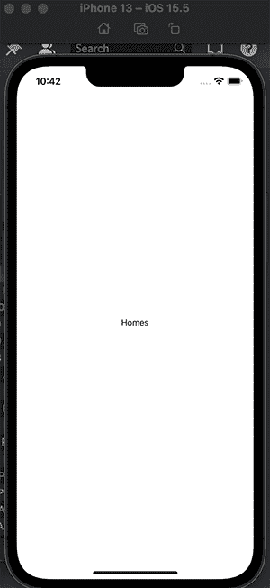
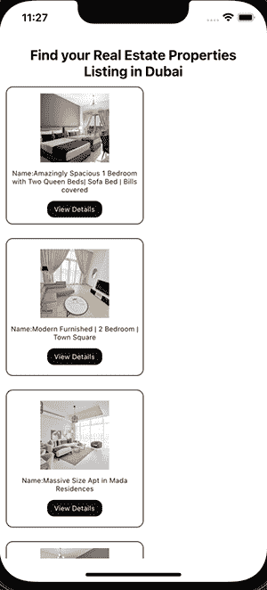
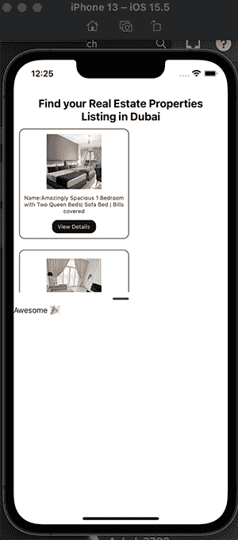

# 在 React Native 中创建和样式化一个模态底层表单

> 原文：<https://blog.logrocket.com/creating-styling-modal-bottom-sheet-react-native/>

模态底层是一个我们以前可能都见过的组件。它是一个从屏幕底部向上滑动的元素，用于显示移动应用程序中的额外内容或更长的描述。你可能在一些当今最流行的应用程序中见过它，比如 Twitter、Instagram 和苹果应用商店。

每当用户触发一个事件时，模态底部表单就会弹出。你可以在下面的“尝试在我的手机上安装应用程序”中看到一个例子:


在本教程中，我们将创建一个基本的 realtor 应用程序，它具有一个模态底层特性。我们将讨论如何设置应用程序布局、从 API 获取数据、实现模态底层表单、向其传递数据以及设置样式。

## 设置应用程序并安装依赖项

我们应用程序的基本思想是显示可供出租的房产列表。当用户决定他们想要哪个或了解更多信息时，他们可以点击**查看详情**按钮和[，模态底部表单将向上滑动以显示关于该属性的附加信息](https://blog.logrocket.com/flutter-modal-bottom-sheet-tutorial-with-examples/)。

我们将使用[react-native-bottom-sheet](https://github.com/gorhom/react-native-bottom-sheet)包来实现模态底层表单。我们还将使用 Bayut API，您可以通过[在这里注册](https://rapidapi.com/)来访问它，[可以在这里预览 API](https://rapidapi.com/apidojo/api/bayut)，以及 Axios 向所需的 API 端点发出请求。

首先，我们将使用 Expo 来构建我们的 React 本地应用程序。我们将通过在 CLI 中键入命令`npx create-expo-app react-native-bottom-sheet`来初始化我们的项目。

我们还将安装我们需要的依赖项:

```
npm install axios @gorhom/bottom-sheet react-native-gesture-handler react-native-reanimated 

```

## 创建我们的应用布局

对于应用程序的文件夹结构，我们将创建`utils`和`components`文件夹。在`components`文件夹中，我们将有`Homes`和`BottomSheetModalComponent`组件。

`Homes`组件将用于呈现属性列表，而`BottomSheetModalComponent`将用于显示模态底部表单。

在`utils`文件夹中，我们将创建一个`homesApi`文件来创建从我们前面提到的 API 端点获取数据的函数。


在`Homes.js`组件中，我们将通过向文件添加以下内容来初始化组件:

```
//Homes.js
import { StyleSheet, Text, View } from 'react-native'
import React from 'react'

const Homes = () => {
 return (
   <View>
     <Text>Homes</Text>
   </View>
 )
}

export default Homes

const styles = StyleSheet.create({})

```

然后，我们将这个组件导入到`App.js`文件中，如下所示:

```
//app.js

import { StyleSheet, Text, View } from "react-native";
import React from "react";
import Homes from "./components/Homes";

const App = () => {
 return <Homes />;
};

export default App;

const styles = StyleSheet.create({});

```

我们的模拟器中应该有这个:



**注意，**由于模态底部表单需要在使用之前安装`react-native-reanimated`依赖项，您需要将以下代码添加到您的`babel.config.js`文件中(否则您将得到一个错误):

```
plugins: ["react-native-reanimated/plugin"],

```

该文件现在将如下所示:

```
module.exports = function (api) {
 api.cache(true);
 return {
   presets: ["babel-preset-expo"],
   plugins: ["react-native-reanimated/plugin"],
 };
};

```

## 从 API 获取数据

如前所述，我们将从 API 获取属性列表。在`homesApi`文件中，我们将创建从 API 端点获取数据的函数:

```
//homesApi
import axios from "axios";

const options = {
 method: "GET",
 url: "https://bayut.p.rapidapi.com/properties/list",
 params: {
   locationExternalIDs: "5002,6020",
   purpose: "for-rent",
   hitsPerPage: "10",
   page: "0",
   lang: "en",
   sort: "city-level-score",
   rentFrequency: "monthly",
   categoryExternalID: "4",
 },
 headers: {
   "X-RapidAPI-Key": "5cf25132e5msh07ce895df09bd96p1fb02ajsn623ba5792950",
   "X-RapidAPI-Host": "bayut.p.rapidapi.com",
 },
};

export const getProperties = async () => {
 try {
   const response = await axios(options);
   return response.data.hits;
 } catch (error) {
   console.log(error);
 }
};

```

然后，在`App.js`中，我们将调用这个函数，并使用`useEffect`钩子让 API 调用[。](https://blog.logrocket.com/using-react-useeffect-hook-lifecycle-methods/)

首先，我们创建一个`homes`状态，它最初是一个空数组(在它被来自 API 的数据填充之前)。然后，一旦组件呈现，我们将使用`useEffect`钩子获取数据，并将`homes`状态设置为返回的数据。

然后，我们将把整个应用程序包装在一个`SafeAreaView`组件中，以便在设备的安全区域边界内呈现内容。`FlatList`将用于映射从 API 返回的数据数组，并且将呈现`Homes`组件。

此外，由于获取数据的过程是异步的，并且需要时间来完成，所以我们可以初始化加载状态，以便在呈现数据之前向用户显示加载文本。

```
// App.js
import { StyleSheet, Text, View, SafeAreaView, FlatList } from "react-native";
import Homes from "./components/Homes";
import { useState, useEffect, useRef, useMemo } from "react";
import { getProperties } from "./utils/homesApi";
const App = () => {
const [homes, setHomes] = useState([]);
 const [loading, setLoading] = useState(true);

useEffect(() => {
   const fetchHouseData = async () => {
     const data = await getProperties();
     setHomes(data);
   };
   fetchHouseData();
 }, []);

 if (loading)
   return (
     <View style={styles.loading}>
       <Text>Loading Properties...</Text>
     </View>
   );

 return (
    <SafeAreaView style={styles.container}>
       <Text style={styles.header}>
         Find your Real Estate Properties Listing in Dubai
       </Text>
       <FlatList
         keyExtractor={(item) => item.id}
         data={homes}
         renderItem={({ item }) => (
           <Homes {...item} />
         )}
       />
     </SafeAreaView>

);
};

export default App;

const styles = StyleSheet.create({
 container: {
   flex: 1,
   backgroundColor: "#fff",
 },
 loading: {
   flex: 1,
   justifyContent: "center",
   alignItems: "center",
 },

});

```

正如您在上面所注意到的，在映射了从 API 返回给我们的数组中的项目之后，我们为每个属性都准备了一个对象。我们在`Homes`组件上使用扩展操作符来扩展对象。我们可以析构所需的值，并用它们来构建`Homes`组件。

```
//Homes.js
import {
 StyleSheet,
 Text,
 View,
 TouchableOpacity,
 Image,
} from "react-native";
import React from "react";

const Homes = ({ title, coverPhoto}) => {
 return (
   <View style={styles.container}>
     <Image source={{ uri: coverPhoto.url }} style={styles.image} />
     <Text style={styles.text}>Name:{title}</Text>
     <TouchableOpacity style={styles.button}>
       <Text style={styles.buttonText}>View Details</Text>
     </TouchableOpacity>
   </View>
 );
};

export default Homes;

const styles = StyleSheet.create({
 container: {
   width: 200,
   height: 200,
   backgroundColor: "#fff",
   margin: 10,
   borderRadius: 10,
   borderWidth: 1,
   borderColor: "#121212",
   justifyContent: "center",
   alignItems: "center",
 },
 text: {
   color: "#121212",
   fontSize: 10,
   textAlign: "center",
   marginTop: 10,
 },
 image: {
   width: 100,
   height: 100,
 },
 button: {
   width: 80,
   marginTop: 10,
   padding: 6,
   backgroundColor: "#121212",
   justifyContent: "center",
   alignItems: "center",
   borderRadius: 10,
 },
 buttonText: {
   color: "white",
   fontSize: 10,
 },
});

```

这里，我们只使用了`coverPhoto`和`title`道具，同时构建了我们的行动号召按钮来触发模态底部表单。现在，我们的模拟器中应该有这个:



## 在我们的 React 原生应用中实现模态底部表单

为了开始模态底层实现，我们将从库中导入`BottomSheetModal`和`BottomSheetModalProvider`，并用`BottomSheetModalProvider`包装整个应用程序。然后，我们将从库中调用`BottomSheetModal`组件，并传入以下道具:`snapPoints`、`index`、`ref`。

`snapPoints`是底部工作表要贴齐的点，应该从底部到顶部排序。这个道具接受一个数字数组。

`index`是初始快照索引。

在我们传入道具之后，我们将在`BottomSheetModal`内部传入一个简单的`View`组件，看看它是什么样子的。

为了让弹出模式在我们点击**查看细节时工作，**我们将传递一个`onPress`道具给`Homes`组件，该组件将接受一个`openModal`函数。然后`onPress`道具将在`Homes`组件中被析构，并被传递给**视图细节**按钮，因此当点击该按钮时，模态底部表单向上滑动。

```
//App.js
import { StyleSheet, Text, View, SafeAreaView, FlatList } from "react-native";
import Homes from "./components/Homes";
import { useState, useEffect, useRef, useMemo } from "react";
import { getProperties } from "./utils/homesApi";
const App = () => {
const [homes, setHomes] = useState([]);
 const [loading, setLoading] = useState(true);

useEffect(() => {
   const fetchHouseData = async () => {
     const data = await getProperties();
     setHomes(data);
   };
   fetchHouseData();
 }, []);

 // ref
 const bottomSheetModalRef = useRef(null);
 const snapPoints = useMemo(() => ["50%"], []);

const openModal = () => {
   bottomSheetModalRef.current.present();
 };

 if (loading)
   return (
     <View style={styles.loading}>
       <Text>Loading Properties...</Text>
     </View>
   );

 return (
   <BottomSheetModalProvider>
    <SafeAreaView style={styles.container}>
       <Text style={styles.header}>
         Find your Real Estate Properties Listing in Dubai
       </Text>
       <FlatList
         keyExtractor={(item) => item.id}
         data={homes}
         renderItem={({ item }) => (
           <Homes {...item} onPress={() => openModal()} />
         )}
       />
     </SafeAreaView>
    <BottomSheetModal
       ref={bottomSheetModalRef}
       index={0}
       snapPoints={snapPoints}
       style={styles.bottomSheet}
     >
       <View style={styles.contentContainer}>
         <Text>Awesome 🎉</Text>
       </View>
     </BottomSheetModal>
   </BottomSheetModalProvider>

);
};

export default App;

const styles = StyleSheet.create({
 container: {
   flex: 1,
   backgroundColor: "#fff",
 },
 loading: {
   flex: 1,
   justifyContent: "center",
   alignItems: "center",
 },

});

//Homes.js
const Homes = ({ title, coverPhoto, onPress }) => {
 return (
   <View style={styles.container}>
     <Image source={{ uri: coverPhoto.url }} style={styles.image} />
     <Text style={styles.text}>Name:{title}</Text>
     <TouchableOpacity style={styles.button} onPress={onPress}>
       <Text style={styles.buttonText}>View Details</Text>
     </TouchableOpacity>
   </View>
 );
};

```

现在让我们看看我们有什么:



一旦我们触发**视图细节**功能，我们就可以看到我们的模态底部表单出现了！

**注意:[，]** 对于捕捉点，您可以根据自己的喜好进行捕捉。在这里，我们使用了`50%`,所以它不会超过屏幕的一半。如果你想让它吸附到最顶端，你可以将`["50%", "100%"]`传递到数组中。

## 将数据传递到模态底部表单

现在模态底层工作了，我们将呈现我们最初创建的`BottomSheetModalComponent`,并找到一种方法将 API 数据传递到这个组件中。当模态底部表单滑入时，这将允许我们看到关于每个属性的附加信息。

为此，我们将创建一个名为`houseDataModal`的新状态，并将初始值设置为`null`。因为我们在`Homes`组件中有了`item`对象，在那里我们映射了`homes`数据数组，我们可以将`item`传递给`openModal`函数，将`setHouseDataModal`传递给传递给`openModal`函数的项目。

```
//App.js
 const openModal = (item) => {
   setHouseDataModal(item);
   bottomSheetModalRef.current.present();
 };

 <FlatList
         keyExtractor={(item) => item.id}
         data={homes}
         renderItem={({ item }) => (
           <Homes {...item} onPress={() => openModal(item)} />
         )}
       />

```

然后，在`BottomSheetModalComponent`中，我们可以这样展开 item 对象:

```
 <BottomSheetModal
       ref={bottomSheetModalRef}
       index={0}
       snapPoints={snapPoints}
       style={styles.bottomSheet}
     >
       <BottomSheetModalComponent {...houseDataModal} />
     </BottomSheetModal>

```

最后，我们可以从返回的 API 数据中析构我们需要的所有值，并将它们呈现在模态底部表单中:

```
//BottomSheetModalComponent.js
import { StyleSheet, Text, View, Image } from "react-native";
import React from "react";
import { FontAwesome } from "@expo/vector-icons";
import { Fontisto } from "@expo/vector-icons";
import { MaterialIcons } from "@expo/vector-icons";
import { MaterialCommunityIcons } from "@expo/vector-icons";

const BottomSheetModalComponent = ({
 contactName,
 agency,
 rooms,
 baths,
 title,
 price,
 coverPhoto,
 isVerified,
 area,
 phoneNumber,
}) => {
 return (
   <View style={styles.container}>
     {/* text header */}
     <View style={styles.textContainer}>
       <Text style={styles.text}>{title}</Text>
     </View>
     {/* image */}
     <View style={styles.imageContainer}>
       <Image source={{ uri: coverPhoto.url }} style={styles.image} />
     </View>

     {/* furniture */}
     <View style={styles.furniture}>
       {/* rooms */}
       <View style={styles.roomsContainer}>
         <Fontisto name="room" size={24} color="black" />
         <Text style={styles.subtext}>{rooms}</Text>
       </View>

       {/* baths */}
       <View style={styles.bathsContainer}>
         <FontAwesome name="bathtub" size={24} color="black" />
         <Text style={styles.subtext}>{baths}</Text>
       </View>

       {/* area */}
       <View style={styles.areaContainer}>
         <MaterialCommunityIcons name="island" size={24} color="black" />
         <Text>{area.toLocaleString()} Sq.km</Text>
       </View>
       <Text style={styles.price}> AED {price.toLocaleString()}</Text>
     </View>
     {/* end of furniture */}

     <View style={styles.details}>
       <MaterialIcons
         name={isVerified ? "verified" : null}
         size={24}
         color="blue"
       />
       <Image source={{ uri: agency.logo.url }} style={styles.logo} />
       <Text style={styles.name}>{contactName}</Text>
       <Text style={styles.phone}>{phoneNumber.mobile}</Text>
     </View>
   </View>
 );
};

export default BottomSheetModalComponent;

```

## 设计莫代尔底板的样式

现在，我们可以根据自己的喜好设计底板样式，如下所示:

```
>const styles = StyleSheet.create({
 container: {
   backgroundColor: "lavender",
   flex: 1,
 },
 textContainer: {
   marginTop: 10,
 },
 text: {
   textAlign: "center",
   fontWeight: "bold",
 },
 imageContainer: {
   justifyContent: "center",
   alignItems: "center",
   marginTop: 10,
 },
 furniture: {
   flexDirection: "row",
   justifyContent: "space-around",
   marginTop: 20,
   alignItems: "center",
 },
 roomsContainer: {
   flexDirection: "row",
   justifyContent: "center",
   alignItems: "center",
 },
 subtext: {
   marginLeft: 5,
 },
 bathsContainer: {
   flexDirection: "row",
   justifyContent: "center",
   alignItems: "center",
 },
 details: {
   flexDirection: "row",
   justifyContent: "center",
   alignItems: "center",
   marginTop: 20,
 },
 logo: {
   width: 25,
   height: 25,
   marginRight: 15,
   marginLeft: 15,
 },
 image: {
   width: 180,
   height: 180,
 },
 price: {
   fontWeight: "bold",
 },
 name: {
   fontWeight: "bold",
   marginRight: 10,
 },
 phone: {
   fontWeight: "bold",
 },
 areaContainer: {
   flexDirection: "row",
   justifyContent: "center",
   alignItems: "center",
 },
});

```

太好了！我们已经将样式应用于我们的模态底部表单，这样它们就可以以一种更好看的方式显示。我们可以看到我们的标题，财产图像，图标，和其他细节妥善安排。

当我们点击**查看详情**按钮时，我们可以看看我们的模态底部表单中有什么:


现在，我们已经成功地在 React 本地应用程序中实现了一个模态底层表。当触发 **View Details** 按钮时，我们从 API 获取数据以呈现属性列表并显示该模态底部表单。

## 结论

我们的莫代尔底层已经准备好了！在本教程中，我们学习了如何使用`@gorhom/bottom-sheet`库在 React 本地应用程序中创建一个模态底层表单。

我们还学习了如何在特定用例的渲染组件和模态底部表单之间共享数据，例如，当模态底部表单弹出时，我们需要向用户显示更多数据。

如果您愿意，可以在自己的 React 本地项目中集成并修改这个示例。[你可以在我的知识库中找到完整的代码](https://github.com/Taofiqq/bottom-sheet-modal-example-react-native)。

## [LogRocket](https://lp.logrocket.com/blg/react-native-signup) :即时重现 React 原生应用中的问题。

[](https://lp.logrocket.com/blg/react-native-signup)

[LogRocket](https://lp.logrocket.com/blg/react-native-signup) 是一款 React 原生监控解决方案，可帮助您即时重现问题、确定 bug 的优先级并了解 React 原生应用的性能。

LogRocket 还可以向你展示用户是如何与你的应用程序互动的，从而帮助你提高转化率和产品使用率。LogRocket 的产品分析功能揭示了用户不完成特定流程或不采用新功能的原因。

开始主动监控您的 React 原生应用— [免费试用 LogRocket】。](https://lp.logrocket.com/blg/react-native-signup)