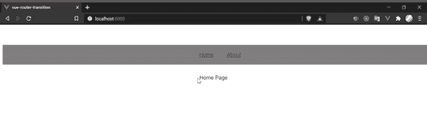
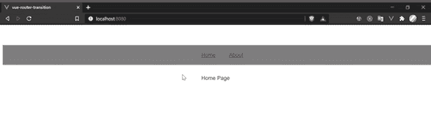
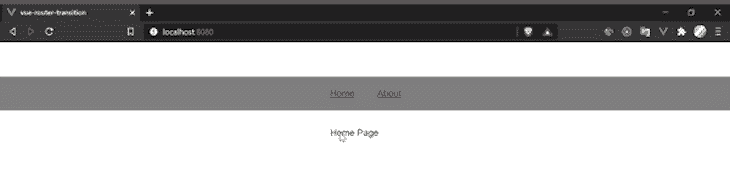

# 用 Vue 路由器在你的 Vue 应用中创建过渡

> 原文：<https://blog.logrocket.com/creating-transitions-in-your-vue-app-with-vue-router/>

# 使用 Vue 路由器在您的 Vue 应用中创建转场

## 

2021 年 1 月 20 日 3 min 读 921

## 什么是 Vue 路由器？

Vue Router 是 Vue.js 应用的官方路由库。尽管您可以继续使用其他通用路由库，但 Vue Router 与 Vue.js 的思想深度集成，使单页应用程序(spa)易于构建。

在本文中，我们将探讨如何通过在使用 Vue 路由器进行路由时创建转换来轻松改善 Vue 应用中的用户体验。

那么，为什么要在你的应用中使用转场呢？

我将谈一点为什么你可能首先需要过渡。

网站通常由网页的集合组成。从一个网页到另一个网页的移动几乎是不可避免的，网站和页面移动之间的交互在塑造用户对我们网站的体验方面起着重要作用。

我们应该尽可能地在网站的交互中建立线性——当用户点击一个链接时，他们不应该觉得他们又开始了一次新的体验。相反，应该有一个持续的经历和积累。

想象一下，从一本书的第一章到第五章，没有任何线性。即使你可能理解了第五章的内容，并最终继续喜欢这本书，这种体验也会有所中断。使用过渡可以缓和甚至消除这种体验上的中断。

## 创建过渡

Vue Router 让在你的 Vue 应用中加入转场变得非常简单。在本文中，我们将探讨如何在 Vue 应用中实现三种令人愉快的过渡。我们将主要使用两个组件:

**过渡**–来自 Vue 的包装器组件，每当一个元素进入或离开 DOM 时，它就向 HTML 或 Vue 元素添加过渡效果。在`<transition>`组件中，`name`属性用于添加一个转换类。Vue 自动给我们六个类，前缀是`name`属性的值。这些类在转换的生命周期中应用。根据元素进入和离开 DOM 时发生的情况，可以将类分为两组:

*   **进入** :这个类定义了元素在经历转换之前的开始状态。它在元素插入之前生效
*   **enter-active** :这个类定义了当元素被插入 DOM 时会发生什么。它可以用来定义进入过渡的持续时间
*   **enter-to** :这个类定义了元素被插入 DOM 后发生的事情。一旦进入过渡完成，它就被删除
*   **离开** :这个类定义了元素的离开状态。它在元素从 DOM 中移除之前生效
*   **leave-active** :这个类定义了元素离开阶段发生的事情。它可以用来定义离开过渡的持续时间
*   **leave-to** :这个类定义了元素从 DOM 中移除后会发生什么。一旦移除过渡完成，它将被移除
*   **路由器-查看** : 该组件由 Vue 路由器提供。它呈现与 Vue 路由器实例化中指定的路径相匹配的组件
*   过渡类型

## 滑动淡化

*   乏味的
*   自定义过渡类
*   注意:本教程假设您熟悉使用 Vue 路由器设置 Vue 应用程序。

> 

幻灯片渐变过渡示例

### **app . view**



```
<template>
  <div id="app">
    <ul>
      <router-link to="/">Home</router-link>
      <router-link to="/about">About</router-link>
      <router-link to="/contact">Contact us</router-link>
    </ul>
    <transition name="slide-fade">
      <router-view class="view"/>
    </transition>
  </div>
</template>
<script>
  export default {}
</script>
<style>
.slide-fade-enter-active {
  transition: all .3s ease;
}
.slide-fade-leave-active {
  transition: all .8s cubic-bezier(1.0, 0.5, 0.8, 1.0);
}
.slide-fade-enter, .slide-fade-leave-to{
  transform: translateX(10px);
  opacity: 0;
}
</style>
```

淡入淡出过渡示例

### **app . view**



```
<template>
  <div id="app">
    <ul>
      <router-link to="/">Home</router-link>
      <router-link to="/about">About</router-link>
      <router-link to="/contact">Contact us</router-link>
    </ul>
    <transition name="fade">
      <router-view class="view"/>
    </transition>
  </div>
</template>
<script>
export default {}
</script>
<style>
.fade-enter-active, .fade-leave-active {
  transition: opacity .4s;
}
.fade-enter, .fade-leave-to {
  opacity: 0;
}
</style>
```

自定义过渡类

### 将`animate.css` CDN 链接添加到您的公共文件夹中的 HTML 文件，如下所示:

**app . vista** 

```
<link href="https://cdn.jsdelivr.net/npm/[email protected]" rel="stylesheet" type="text/css">
```

你可以在`animate.css`库这里查看更多动画风格: [animate.style](https://animate.style/) 。

```
<template>
  <div id="app">
    <ul>
      <router-link to="/">Home</router-link>
      <router-link to="/about">About</router-link>
      <router-link to="/contact">Contact us</router-link>
    </ul>
    <transition
      name="custom-classes-transition"
      enter-active-class="animated tada"
      leave-active-class="animated bounceOutRight"
    >
      <router-view class="view"/>
    </transition>
  </div>
</template>

<script>
export default {}
</script>

<style>
</style>
```

结论

## 在本文中，我们已经查看了 Vue 过渡组件提供的不同生命周期以及如何使用它们，我们还探索了如何将它们与其他动画库(如`animate.css`)一起使用。你可以在[文档](https://router.vuejs.org/guide/advanced/transitions.html)中了解更多信息。

像用户一样体验您的 Vue 应用

## 调试 Vue.js 应用程序可能会很困难，尤其是当用户会话期间有几十个(如果不是几百个)突变时。如果您对监视和跟踪生产中所有用户的 Vue 突变感兴趣，

.

[try LogRocket](https://lp.logrocket.com/blg/vue-signup)

LogRocket 就像是网络和移动应用程序的 DVR，记录你的 Vue 应用程序中发生的一切，包括网络请求、JavaScript 错误、性能问题等等。您可以汇总并报告问题发生时应用程序的状态，而不是猜测问题发生的原因。

[](https://lp.logrocket.com/blg/vue-signup)[https://logrocket.com/signup/](https://lp.logrocket.com/blg/vue-signup)

LogRocket Vuex 插件将 Vuex 突变记录到 LogRocket 控制台，为您提供导致错误的环境，以及出现问题时应用程序的状态。

现代化您调试 Vue 应用的方式- [开始免费监控](https://lp.logrocket.com/blg/vue-signup)。

Modernize how you debug your Vue apps - [Start monitoring for free](https://lp.logrocket.com/blg/vue-signup).