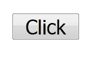
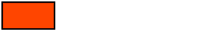
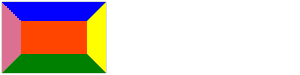
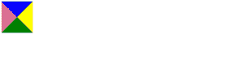
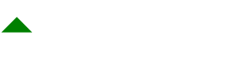
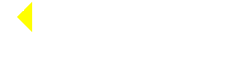
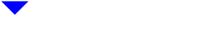
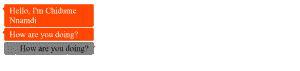
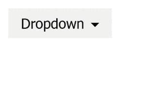
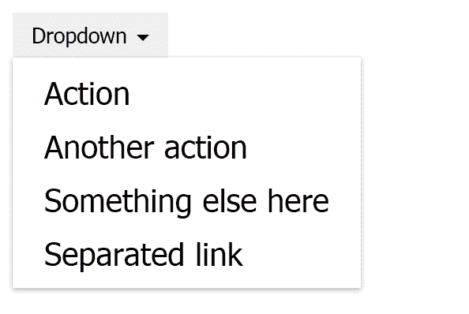

# 使用 CSS 创建三角形

> 原文：<https://blog.logrocket.com/creating-triangles-using-css/>

在这篇文章中，我们将学习如何在 CSS 中创建三角形。首先，让我们回顾一下关于 CSS 的一些事情。

## 半铸钢ˌ钢性铸铁(Cast Semi-Steel)

CSS 不是设计工具。但是，它提供了声明性语法，使得设计文档或文档集合的样式变得非常简单。

CSS 使我们的页面非常漂亮和时尚。文档包含元素，每个元素都有它们在操作系统中的默认样式。CSS 给了我们根据自己的喜好设计元素的能力。

```
<button>Click</button>
```



这是一个简单的按钮，具有操作系统的基本样式。我们可以通过 CSS 添加自己的样式:

```
button {
    margin: 0;
    padding: 6px 12px;
    background-color: orangered;
    color: white;
    border: 1px solid #b93605;
    border-radius: 2px;
}
```

我们的样式将覆盖按钮元素的默认样式。我们使用 CSS 属性来设置我们的样式。

`margin: 0`删除按钮的边距。

`padding`填充按钮的内容区域:上下 6 像素，左右 12 像素。

属性将按钮的背景色设置为更橙色。

文本颜色被`color`属性规则设置为白色。

通过设置边框规则:`border: 1px solid #b93605;`，使按钮的边框更加清晰。

通过使用 2 像素单位的边框半径，按钮被赋予了一点弯曲的形状。

我们的按钮将显得更加时尚和吸引人:


如您所见，我们使用元素选择器来设计按钮的样式。我们有不同的选择器可以用来选择 CSS 中的元素并设置它们的样式。

*   `class`选择器
*   `id`选择器
*   伪选择器

CSS 可以通过内联 CSS、`style`标签内、使用`link`标签的 HTTP 链接和样式表添加到 web 文档中。

### 内嵌 CSS

CSS 样式插入到元素的`style`属性中。

```
<html>
    <body>
        <button style="margin: 0;padding: 6px 12px;background-color: orangered;">Click</button>
    </body>
</html>
```

这是内联 CSS。

### `style`标签

这将在 HTML 页面的`style`标签中插入 CSS。

```
<html>
    <style>
        button {
            margin: 0;
            padding: 6px 12px;
            background-color: orangered;
        }
    </style>

    <body>
        <button>Click</button>
    </body>
</html>
```

### `link`标签/样式表

CSS 规则集位于扩展名为`.css`的样式表文件中，然后文件路径被插入到`link`标签的`href`属性中。

```
/* main.css */

button {
    margin: 0;
    padding: 6px 12px;
    background-color: orangered;
}
```

```
<html>
    <link href="./main.css" rel="stylesheet">
    <body>
        <button>Click</button>
    </body>
</html>
```

CSS 已经被用于构建游戏，创建令人惊叹的艺术品，甚至被用于重新创建米开朗基罗的流行艺术品。

这些作品都是用 CSS 招数完成的。在这里，我们将学习一个使用 CSS 创建三角形的技巧。我们将创建不同类型的三角形，并看看它们在现实世界中的应用。

### 诀窍是

诀窍是使用边界、宽度和高度来创建三角形。我会告诉你怎么做。

先说一个简单的`div`。

```
<style>
    div {
        background: orangered;
        width: 400px;
        height: 150px;
    }
</style>
<body>
    <div></div>
</body>
```


高度和宽度分别为 150px 和 300px。

如果我们像这样在`div`上设置边界:

```
div {
    ...
    border: 10px solid black;
}
```



这将使`div`的边框变得 10px 厚，颜色设置为黑色。

如果我们让边框变粗:

```
div {
    border: 88px solid black;
}
```


注意，`div`的边界区域和内容区域形成一条对角线，当边界变大时，它们变得更加明显。为了让这一点更加明显，我们让边框有独特的颜色。

```
div {
    ...
    border-top-color: blue;
    border-right-color: yellow;
    border-bottom-color: green;
    border-left-color: palevioletred;
}
```



看到了吗？就像边界区域的边缘即将相遇。如果他们相遇会怎样？

他们会形成一个三角形！

为了使它们相遇，我们将使宽度和高度为 0px:

```
div {
    background: orangered;
    color: white;
    width: 300px;
    height: 150px;

    border: 88px solid black;
    border-top-color: blue;
    border-right-color: yellow;
    border-bottom-color: green;
    border-left-color: palevioletred;
}
```



现在，我们有了边界三角形。元素各边的边框形成一个三角形。

要制作一个普通的三角形——一个指向上方的三角形——我们必须使顶部、右侧和左侧的边框透明。我们还必须删除背景颜色:

```
div {
    color: white;
    width: 0px;
    height: 0px;
    border: 88px solid black;
    border-top-color: transparent;
    border-right-color: transparent;
    border-bottom-color: green;
    border-left-color: transparent;
}
```



可以这样做来制作一个指向左边的三角形:

```
div {
    color: white;
    width: 0px;
    height: 0px;
    border: 88px solid black;
    border-top-color: transparent;
    border-right-color: yellow;
    border-bottom-color: transparent;
    border-left-color: transparent;
}
```

所有边框都是透明的，除了右边框设置为黄色以显示左三角形。



我们将同样的方法应用于向右下方的三角形:

```
div {
    color: white;
    width: 0px;
    height: 0px;
    border: 88px solid black;
    border-top-color: transparent;
    border-right-color: transparent;
    border-bottom-color: transparent;
    border-left-color: palevioletred;
}
```


这里有一个向下的三角形:

```
div {
    color: white;
    width: 0px;
    height: 0px;
    border: 88px solid black;
    border-top-color: blue;
    border-right-color: transparent;
    border-bottom-color: transparent;
    border-left-color: transparent;
}
```



## 用法:聊天工具

我发现这在制作聊天工具时很有用。

聊天工具是网站上用于实时交流的独立软件。它为您的客户/用户提供了一种与网站管理员交流的方式。这种交流通常是通过打字文本进行的。

聊天小工具有一种方法可以告诉通信双方哪些消息是给谁的，谁输入了消息，以及消息是什么时候发送的。这些识别是通过使用箭头(左箭头或右箭头)来完成的。

在聊天框上放置方向箭头来指示谁在说话:



参见代码:

```
<style>
    .chat {
        width: 150px;
        padding: 3px 10px;
        border-radius: 3px;
        position: relative;
        margin-bottom: 2px;
    }

    .chat-left {
        color: white;
        background: orangered;
    }

    .chat-right {
        color: black;
        background: grey;
        text-align: right;
    }

    .chat-left::before, .chat-right::after {
        content: "";
        color: white;
        width: 0px;
        height: 0px;
        border: 4px solid transparent;

        position: absolute;
        top: 5px;
    }

    .chat-left::before {
        border-top-color: transparent;
        border-right-color: orangered;
        border-bottom-color: transparent;
        border-left-color: transparent;
        left: -7px;
    }

    .chat-right::after {
        border-top-color: transparent;
        border-right-color: transparent;
        border-bottom-color: transparent;
        border-left-color: gray;
        right: -7px;
    }

</style>

<div class="chat chat-left">
    Hello, I'm Chidume Nnamdi
</div>
<div class="chat chat-left">
    How are you doing?
</div>
<div class="chat chat-right">
    How are you doing?
</div>
```

我们使用了`::before`和`::after`赝选子来绘制三角形。你可以看到，它们的宽度和高度都是 0px。对于`.chat-left::before`中的左箭头，我们将所有边框设置为透明，除了右边框。对于`.chat-right::after`中的右箭头，我们将除左边界之外的所有边界设置为透明。

## 用法:下拉菜单

下拉列表中也使用箭头来指示哪个元素有下拉列表。或者下拉菜单是从哪里掉下来的。

参见 HTML:

```
<body>
    <span>
    <button class="dropdown">
        <a class="dropdown-toggle" data-toggle="dropdown" aria-expanded="false">
            Dropdown <span class="caret"></span>
        </a>
        <ul class="dropdown-menu">
            <li><a>Action</a></li>
            <li><a>Another action</a></li>
            <li><a>Something else here</a></li>
            <li class="divider"></li>
            <li><a>Separated link</a></li>
        </ul>
    </button>
    </span>
</body>
```

`span.caret`元素将是一个指向下方的三角形。

让我们来设计一下:

```
.caret {
    display: inline-block;
    width: 0;
    height: 0;
    margin-left: 2px;
    vertical-align: middle;
    border-top: 4px solid;
    border-right: 4px solid transparent;
    border-left: 4px solid transparent;            
}
```

我们将宽度和高度设为 0，所以我们可以只显示边界并连接在一起。然后，为了制作一个向下的三角形，我们将底部、右侧和左侧的边框设为透明，顶部的边框设为纯黑色。



我们用三角形来表示下拉列表将出现的位置。

以下是 CSS 代码的其余部分:

```
button {
    margin: 0;
    padding: 6px 12px;
    border: 0;
}

.dropdown {
    position: relative;
    text-decoration: none;
}

.dropdown-menu {
    position: absolute;
    z-index: 1000;
    background: white;
    color: black;
    list-style: none;
    margin: 0;
    padding: 5px 0;
    border-color: rgba(255, 255, 255, 0.9);
    box-shadow: 0 1px 3px 0 rgba(0, 0, 0, 0.33);
    top: 100%;
    left: 0;        
    min-width: 100px;
}

.dropdown li a {
    padding: 5px 20px;
    font-size: 20px;
    display: block;
    color: black;        
    text-decoration: none;
    white-space: nowrap;
    text-align: left;
}

.dropdown li a:active {
    background: #ddd;
}

.dropdown li a:hover {
    background: #ddd;
}
```



## 结论

这就是诀窍。边框、宽度和高度被操纵以在 CSS 中创建三角形！

如果你对此有任何问题，或者我应该添加，纠正或删除的任何内容，请随时评论，发电子邮件或发短信给我。

## 你的前端是否占用了用户的 CPU？

随着 web 前端变得越来越复杂，资源贪婪的特性对浏览器的要求越来越高。如果您对监控和跟踪生产环境中所有用户的客户端 CPU 使用、内存使用等感兴趣，

[try LogRocket](https://lp.logrocket.com/blg/css-signup)

.

[](https://lp.logrocket.com/blg/css-signup)[https://logrocket.com/signup/](https://lp.logrocket.com/blg/css-signup)

LogRocket 就像是网络和移动应用的 DVR，记录你的网络应用或网站上发生的一切。您可以汇总和报告关键的前端性能指标，重放用户会话和应用程序状态，记录网络请求，并自动显示所有错误，而不是猜测问题发生的原因。

现代化您调试 web 和移动应用的方式— [开始免费监控](https://lp.logrocket.com/blg/css-signup)。