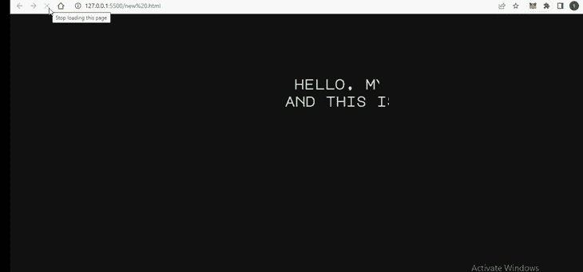
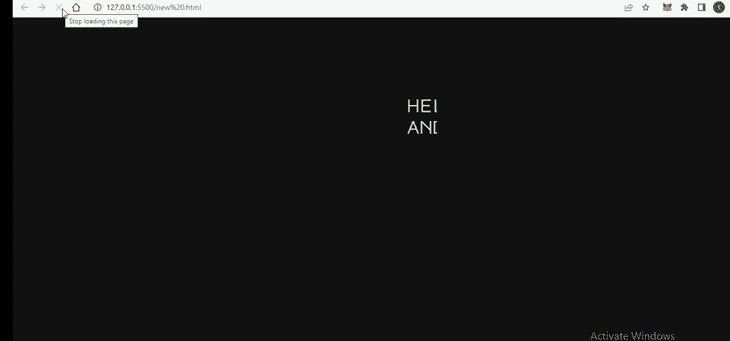
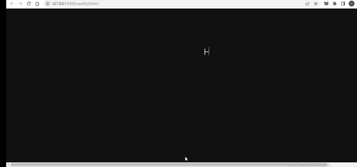

# 仅用 CSS 创建打字机动画效果

> 原文：<https://blog.logrocket.com/creating-typewriter-animation-css/>

创造打字机效果比你想象的要容易。虽然实现这种效果最常见的方法是使用 JavaScript，但是我们也可以使用普通的 CSS 来创建打字机动画。

在这篇文章中，我们将看看如何只用 CSS 创建一个打字机动画效果。它简单、漂亮、容易。我们还将看看用 CSS 和 JavaScript 创建这种效果的优缺点。

要理解这篇文章并制作出最终的打字机效果，你需要对 CSS 和 CSS 动画有一个基本的了解。如果你有这些基本知识，那么你就可以开始了。我们将涵盖以下内容:

让我们直接开始吧。

## 打字机动画使用 JavaScript 和 CSS 的利与弊

最终，CSS 和 JavaScript 之间的选择将取决于您的特定需求和资源。让我们回顾一下每种方法的优缺点，以帮助您做出决定。

仅使用 CSS 比使用 JavaScript 更简单、更容易实现。这种方法使用的资源也比 JavaScript 少，这对低端设备的性能很重要。

然而，当只使用 CSS 时，打字机动画可能不像使用 JavaScript 时那样动态。此外，您可能无法处理更复杂的情况，例如动态更改动画内容。

相比之下，使用 JavaScript 可以更好地控制动画。您可以微调效果的时间，使其更加动态。JavaScript 比 CSS 更灵活，适应性更强，尤其是当你需要快速改变动画的内容时。

另一方面，JavaScript 可能比 CSS 实现起来更复杂，尤其是对于不熟悉它的开发人员来说。

如果你只是需要一个简单的，静态的打字机效果，CSS 可能是正确的选择。但是如果您需要更多的控制或动态内容，JavaScript 可能是更好的选择。

现在让我们继续建立我们的打字机效果！

## 我们的打字机 CSS 动画项目概述

为了达到打字机的效果，我们将动画显示我们的文本，使其逐渐显示文本。我们还将有一个光标，它可以输入文本，并在输入完成后继续闪烁。

在我们开始之前，让我们回顾一下将要使用的 CSS 属性。

我们将使用`[@keyframes](https://developer.mozilla.org/en-US/docs/Web/CSS/@keyframes)` [来制作动画](https://developer.mozilla.org/en-US/docs/Web/CSS/@keyframes)，因为这个 at 规则给了我们更多的控制来制作我们想要的动画。[在我们的内容上使用](https://blog.logrocket.com/new-guide-css-overflow/) `[overflow](https://blog.logrocket.com/new-guide-css-overflow/)` [属性](https://blog.logrocket.com/new-guide-css-overflow/)将确保每个单词按照动画显示，而不是一次全部显示。

`[white-space](https://developer.mozilla.org/en-US/docs/Web/CSS/white-space)`[属性](https://developer.mozilla.org/en-US/docs/Web/CSS/white-space)会将动画修剪成单行。同时，`[border-right-color](https://developer.mozilla.org/en-US/docs/Web/CSS/border-right-color)`[属性](https://developer.mozilla.org/en-US/docs/Web/CSS/border-right-color)将帮助我们将光标从浅灰色变为透明，给动画一个闪烁光标的真实触感。

最后，`[width](https://developer.mozilla.org/en-US/docs/Web/CSS/width#:~:text=The%20width%20CSS%20property%20sets,width%20of%20the%20border%20area.)`[属性](https://developer.mozilla.org/en-US/docs/Web/CSS/width#:~:text=The%20width%20CSS%20property%20sets,width%20of%20the%20border%20area.)从`0%`到`100%`动画化，达到每个字母一次出现一个的效果。

## 设置项目

首先，让我们定义文本的`HTML`结构，我们将使用 CSS 使其具有打字机效果。在这个项目的文件夹中，创建一个`index.html`文件，它将作为这个项目演示的网页，然后粘贴这个文件:

```
<!DOCTYPE html>
<html lang="en">
  <head>
    <meta charset="UTF-8" />
    <meta http-equiv="X-UA-Compatible" content="IE=edge" />
    <meta name="viewport" content="width=device-width, initial-scale=1.0" />
    <link rel="stylesheet" href="new.css" />
    <title>Document</title>
  </head>
  <body>
    <div class="container">
      <p class="first_line">Hello. My name is Temitope</p>
      <p class="second_line">and this is a typewriter effect</p>
    </div>
  </body>
</html>

```

我们在这个文件中包含了一个 div 容器，其中有两段文本。每个段落都有自己的类，分别是`first_line`和`second_line`，因为我们试图实现多行打字机的效果。

这就是我们在页面中需要做的一切。让我们继续设计我们的网页和创建我们的动画。

## 设计网页样式

在项目文件夹中创建另一个名为`style.css`的文件，并粘贴如下内容:

```
@import url("https://fonts.googleapis.com/css2?family=Major+Mono+Display&display=swap");
body {
  height: 100%;
  width: 100%;
  background: #111;
  color: #d8e0db;
  font-family: "Major Mono Display", monospace;
}
.container {
  margin-top: 5%;
  width: 100%;
  height: 100%;
  padding: 70px;
}
.first_line,
.second_line {
  white-space: nowrap; /* keep text in one line */
  overflow: hidden; /* hide text behind the cursor */
  margin: 0.5rem auto;
  font-family: "Major Mono Display", monospace;
  font-size: 2rem;
  font-weight: bold;
}
.first_line {
  border-right: 2px solid rgba(17, 17, 17, 0.9);
}
.second_line {
  border-right: 2px solid rgba(17, 17, 17, 0.9);
}

```

在我们的`style.css`文件中，我们试图设计两行文本的样式。我们使用了一些我们之前讨论过的 CSS 属性来制作动画。

我们将`overflow`属性设置为`hidden`,以防止项目中不必要的水平滚动和额外的空白。`white-space:` `nowrap`设置将使我们的动画变成一行。

最后，`border-right`属性将作为我们的光标，当文本显示时我们希望它闪烁。我们添加了两个——每行一个——但是我们分配的黑色使它们现在不可见。

你可能已经注意到，我们使用十六进制颜色代码`#111`将背景颜色设置为黑色，而文本颜色`#d8e0db`转换为非常浅的褐色。你可以[为你自己的文本选择任何你喜欢的颜色](https://blog.logrocket.com/advanced-guide-setting-colors-css/)，但是要确保[的颜色之间有足够的对比](https://blog.logrocket.com/building-color-palette-css/#exploring-concepts-color-harmony-contrast)以符合可访问性标准。

此外，我们正在使用`Major Mono Display`字体系列。就像背景和文本颜色一样，你也可以选择任何你喜欢的字体。但是，有些字体比其他字体具有更好的打字机效果。

为了获得最佳效果，您可能希望选择干净的无衬线字体或等宽字体。同样，你会看到我们在下面的`@keyframes`中设置了一个`width`。您可能需要更改`width`,以适应您选择使用的任何字体，并确保光标闪烁动画正常工作。

## 用 CSS `@keyframes`和`steps()`创建打字机动画

我们将使用 CSS `@keyframes`为两行文本创建一个效果。我们希望所有的文本都以一个字母接一个字母的方式打印出来，就像打字机一样:

```
@keyframes typewriter_1 {
  from {
    width: 0;
  }
  to {
    width: 38rem;
  }
}
@keyframes typewriter_2 {
  from {
    width: 0;
  }
  to {
    width: 40rem;
  }
}

```

这些`@keyframes`规则分别被命名为`typewriter_1`和`typewriter_2`。每个规则都有两个关键帧— `from`和`to`。`to`关键帧使用了`[rem](https://blog.logrocket.com/using-em-vs-rem-css/)` [，这是一个可伸缩的 CSS 单元](https://blog.logrocket.com/using-em-vs-rem-css/)，它使我们的设计变得灵活、灵敏和易于访问。

在`typewriter_1`关键帧中，我们将`from`宽度设为`0`，而`to`设为`38rem`。这确保了当文本一个字母一个字母地显示时，我们的光标会在文本旁边闪烁，从文本开头的宽度 0 到文本结尾的宽度 38。我们的`typewriter_2`也有`from`和`to`宽度分别设置为`0`和`40rem`。

我们的`@keyframes`将创建一个动画，其中元素从左到右逐渐出现，就像打字机打印文本一样。

要应用此动画，请使用`animation`属性将其包含在字幕类选择器中。在我们的例子中，我们将把我们的`div`副标题更新为:

```
.first_line {
  border-right: 2px solid rgba(17, 17, 17, 0.9);
  /* define animation types for firstline  */
  animation: typewriter_1 6s 
}
.second_line {
  border-right: 2px solid rgba(17, 17, 17, 0.9);
  /* define animation types for econd_line  */
  animation: typewriter_2 5s 
}

```

动画被添加到动画速度旁边，以平滑地显示我们的文本。结果如下:



这看起来不像我们想要的方式，对不对？记住，我们的目标是让它看起来像打字机一样工作——也就是说，以一个字母接一个字母的方式打字。为了实现这一点，我们将利用`steps()` CSS 函数。

CSS 中的`steps()`函数用于指定计时函数中的间隔或步数。在我们的例子中，我们将在我们的`animation`属性中使用它来允许我们的文本逐字母显示:

```
.first_line {
  border-right: 2px solid rgba(17, 17, 17, 0.9);
  /* define animation types for text + cursor */
  animation: typewriter_1 6s steps(33) 1s 1 normal both;

}
.second_line {
  border-right: 2px solid rgba(17, 17, 17, 0.9);
  /* define animation types for text + cursor */
  animation: typewriter_2 5s steps(31) 1s 1 normal both;

}

```

在上面的代码中，您会注意到步骤分别是`33`和`31`。我们通过计算文本中的字符数得到这些数字。在我们的浏览器中检查结果:



现在一切都在一起了。然而，请注意，在我们的结果中，光标没有显示或闪烁。我们希望光标闪烁，使我们的打字机动画看起来更真实。此外，两行文本同时出现，这不是打字机的样子。

为了解决这个问题，我们还将使用`@keyframes`为每一行的光标创建动画:

```
@keyframes first_cursor {
  from {
    border-right-color: rgba(17, 17, 17, 0.9);
  }
  to {
    border-right-color: rgba(255, 255, 255, 0.8);
  }
}
@keyframes second_cursor{
  from {
    border-right-color: rgba(17, 17, 17, 0.9);
  }
  to {
    border-right-color: rgba(255, 255, 255, 0.8);
  }
}

```

在上面的代码中，我们两个光标的`border-right-color`属性设置将随着它们的移动从黑色变为白色。这将给我们的每个光标一个闪烁的效果。

我们将把它包含在文本类的`animation`属性中，将每个动画方向属性设置为`infinite`。这将使光标消失，并永远再现每一个`780ms`:

```
.first_line {
  border-right: 2px solid rgba(17, 17, 17, 0.9);
  /* define animation types for text + cursor */
  animation: typewriter_1 6s steps(33) 1s 1 normal both,
    first_cursor 900ms steps(33) 8;
}
.second_line {
  border-right: 2px solid rgba(17, 17, 17, 0.9);
  /* define animation types for text + cursor */
  animation: typewriter_2 5s steps(31) 1s 1 normal both,
    second_cursor 900ms steps(31) infinite;
  -webkit-animation-delay: 7s;
  animation-delay: 7s;
}

```

在上面的代码中，我们将`infinite`添加到第二个光标动画中，因为我们的文本在第二行结束。这将使光标消失，每隔`900ms`再次出现一次，直到永远。

我们还为`second_line`添加了一个 7 秒钟的`delay`，这样它就不会与我们的第一行输入和显示同时运行。

全部完成！当在浏览器中检查结果时，我们现在应该看到以下内容:



恭喜你。我们刚刚只用 CSS 制作了一个打字机动画效果。

请注意，如果您只需要一行文本，您可以遵循这些相同的步骤。唯一的区别是将`infinite`添加到第一行的动画中，因为没有第二行。这将确保光标在单行的末尾持续闪烁。您也不需要像我们在第二行中那样添加延迟属性。

## 结论

在本文中，我们研究了如何使用 CSS 创建一个完全没有 JavaScript 的打字机动画效果。只用基本的 HTML 代码和不复杂的 CSS 语法就可以很容易做到这一点。另外，它没有浏览器支持问题！

我们网站上的打字机动画效果会增加我们网页的趣味性。如果你觉得这有帮助，请分享。

## 你的前端是否占用了用户的 CPU？

随着 web 前端变得越来越复杂，资源贪婪的特性对浏览器的要求越来越高。如果您对监控和跟踪生产环境中所有用户的客户端 CPU 使用、内存使用等感兴趣，

[try LogRocket](https://lp.logrocket.com/blg/css-signup)

.

[](https://lp.logrocket.com/blg/css-signup)[https://logrocket.com/signup/](https://lp.logrocket.com/blg/css-signup)

LogRocket 就像是网络和移动应用的 DVR，记录你的网络应用或网站上发生的一切。您可以汇总和报告关键的前端性能指标，重放用户会话和应用程序状态，记录网络请求，并自动显示所有错误，而不是猜测问题发生的原因。

现代化您调试 web 和移动应用的方式— [开始免费监控](https://lp.logrocket.com/blg/css-signup)。