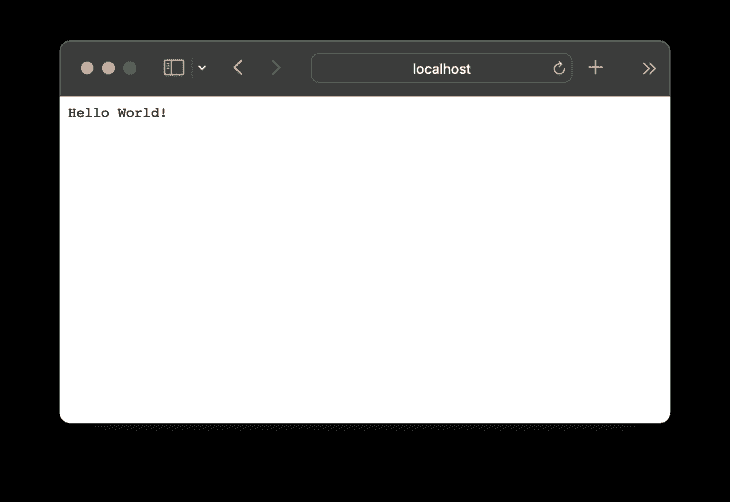
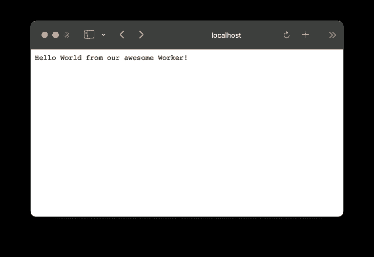
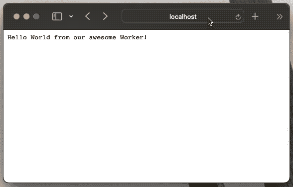
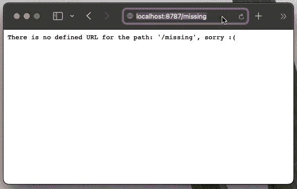
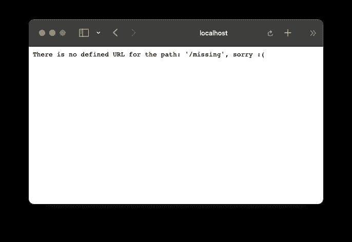
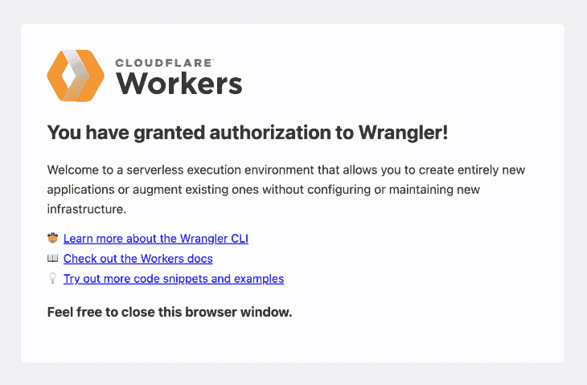
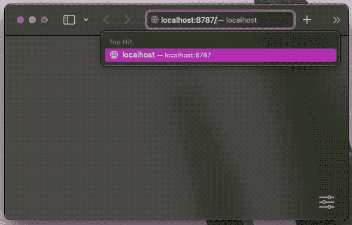
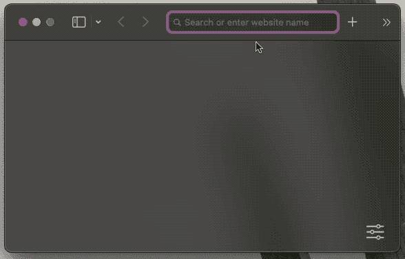
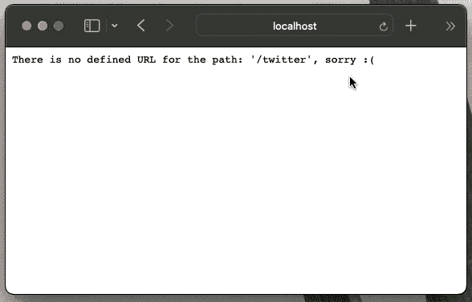

# 使用 Cloudflare Workers 创建一个 URL shortener

> 原文：<https://blog.logrocket.com/creating-url-shortener-cloudflare-workers/>

你曾经使用过像 [Bitly](https://bitly.com) 或 [TinyURL](https://tinyurl.com/app) 这样的工具来缩短长链接吗？或者，您是否想知道这些服务是如何工作的？也许你想建立一个网址缩短器，但是没有时间或者合适的工具去做。无论如何，如果你对这个话题感兴趣，这篇文章非常适合你。

在本帖中，我们将展示如何使用 [Cloudflare Workers](https://workers.cloudflare.com) 构建一个基本的 URL shortener 服务。我们将提供有关 URL shortener 服务如何工作的详细信息，介绍 Cloudflare Workers 的几个功能，并逐步说明如何开始使用 Cloudflare Workers。

*向前跳转:*

我们开始吧！

## 什么是 Cloudflare Workers？

Cloudflare Workers 是一项允许您将无服务器代码部署到 Cloudflare 网络的服务。Cloudflare network 或 Edge 是一个遍布全球的 web 服务器网络。Cloudflare Workers 的一个优点是，您不必担心代码的伸缩性。此外，您不必担心代码所在的时区；Workers 中的代码在部署后几秒钟内就会传遍全球。

最重要的是，Cloudflare Workers 提供了一个简单的键值数据存储，称为 KV。在本教程中，我们将结合使用 Cloudflare Workers 和 KV storage 来缩短我们的 URL。

## 项目概述:网址缩写服务

我们将从构建一个简单的、非动态的 URL 缩写器开始，在这里你可以硬编码你想要重定向到的网站。这将作为学习如何使用 [Wrangler](https://developers.cloudflare.com/workers/wrangler/) (Cloudflare 的官方 CLI 工具)的介绍，并将演示工人领域的基本概念。

接下来，我们将增加一些趣味，增加对动态 URL 的支持。基本上，我们将与 Cloudflare Workers KV store 进行交互，并输入 URL 的简短版本和我们想要重定向到的实际 URL。KV 存储中的数据将类似于以下结构:

```
'short-url': 'https://my-cool-website.com'
'submit': 'https://my-cool-site.org/blog/ideas/submit'

```

最后，我们将把我们的代码部署到生产环境中，并在全球范围内看到它的运行。

你已经兴奋了吗？太好了，我们跳进去吧！

## 设置环境

要阅读本文，您需要以下内容:

*   Node.js 和 npm
*   牧马人
*   curl(或您选择的浏览器)来测试 URL shortener

我使用 [asdf 工具](https://asdf-vm.com/)来管理我的本地依赖项，但是你可以使用任何你喜欢的版本管理器。在撰写本文时，这里是我的节点和 npm 版本:

```
$ node --version
v18.5.0
$ npm --version
8.12.1

```

牧马人是一个命令行构建工具，最近，它获得了 2.0 版本。对于这个职位的目的，牧马人将满足我们所有的需求。在未来，我们可能会使用 [Miniflare，它是牧马人](https://blog.logrocket.com/ditch-wrangler-cli-miniflare/)的一个更强大、功能更丰富的兄弟。但是，现在让我们通过 npm 在全球范围内安装牧马人:

```
$ npm install -g [email protected]

```

在撰写本文时，最新的牧马人版本是 2.0.21，所以我们将使用该版本。

酷毙了。现在我们已经有了所有的依赖项，我们可以使用 Wrangler CLI 来生成我们的 starter Cloudflare Worker。

## 生成项目

牧马人 CLI 工具将证明在这里非常有用。

首先，让我们运行一个命令来正确启动和设置我们的项目:

```
$ wrangler init short-it

```

该命令将询问几个问题。现在，我们将对所有这些问题回答“是”(通过键入 **y** ):

```
$ wrangler init short-it
 ⛅️ wrangler 2.0.21
--------------------
Using npm as package manager.
✨ Created short-it/wrangler.toml
Would you like to use git to manage this Worker? (y/n)
✨ Initialized git repository at short-it
No package.json found. Would you like to create one? (y/n)
✨ Created short-it/package.json
Would you like to use TypeScript? (y/n)
✨ Created short-it/tsconfig.json
Would you like to create a Worker at short-it/src/index.ts?
  None
❯ Fetch handler
  Scheduled handler
✨ Created short-it/src/index.ts

added 62 packages, and audited 63 packages in 1s

1 package is looking for funding
  run `npm fund` for details

found 0 vulnerabilities
✨ Installed @cloudflare/workers-types and typescript into devDependencies

To start developing your Worker, run `cd short-it && npm start`
To publish your Worker to the Internet, run `npm run deploy`

```

如果您对牧马人的所有问题都做出了肯定的回答，那么您将获得一个项目名称`short-it`，其中包含以下内容:

*   目录，这意味着您已经准备好将它推送给您的 Git 提供者了
*   `package.json`文件
*   `tsconfig.json`包含所有类型脚本配置的文件
*   用一些简单明了的逻辑提交文件，以获得我们员工的回应

太棒了。让我们看看这东西有没有用！

让我们`cd`进入`short-it`目录，在本地开发模式下启动牧马人:

```
$ cd short-it
$ wrangler dev --local

```

这应该会在 http://localhost:8787/ 上运行我们的 Worker。如果我们访问 localhost，我们应该会看到一个简单的“Hello World！”消息:



Generated Worker is displaying a “Hello World!” message.

耶！我们成功了。但是怎么做呢？让我们仔细看看。

## Cloudflare 工作人员是如何工作的？

我们在本地从生成的 Worker 中获得了第一条消息，但是这到底是如何工作的呢？

让我们仔细查看生成的`src/index.ts`文件，以便更好地理解那里发生了什么。

```
// src/index.ts

/**
 * Welcome to Cloudflare Workers! This is your first worker.
 *
 * - Run `wrangler dev src/index.ts` in your terminal to start a development server
 * - Open a browser tab at http://localhost:8787/ to see your worker in action
 * - Run `wrangler publish src/index.ts --name my-worker` to publish your worker
 *
 * Learn more at https://developers.cloudflare.com/workers/
 */

export interface Env {
  // Example binding to KV. Learn more at https://developers.cloudflare.com/workers/runtime-apis/kv/
  // MY_KV_NAMESPACE: KVNamespace;
  //
  // Example binding to Durable Object. Learn more at https://developers.cloudflare.com/workers/runtime-apis/durable-objects/
  // MY_DURABLE_OBJECT: DurableObjectNamespace;
  //
  // Example binding to R2\. Learn more at https://developers.cloudflare.com/workers/runtime-apis/r2/
  // MY_BUCKET: R2Bucket;
}

export default {
  async fetch(
    request: Request,
    env: Env,
    ctx: ExecutionContext
  ): Promise<Response> {
    return new Response("Hello World!");
  },
};

```

上面的代码包括我们环境的定义(`Env`接口)和一些与`ENV`接口相关的注释。

由于接口超出了本文的范围，我们将忽略这部分代码，只关注主要逻辑:

```
// src/index.ts

export default {
  async fetch(
    request: Request,
    env: Env,
    ctx: ExecutionContext
  ): Promise<Response> {
    return new Response("Hello World!");
  },
};

```

这里发生的是我们的`index.ts`导出一个`fetch`函数。这是一个类似于 [Web Workers](https://developer.mozilla.org/en-US/docs/Web/API/Web_Workers_API/Using_web_workers) 的界面。事实上,“Cloudflare Workers”这个名称就是从这个接口产生的。Cloudflare Workers 类似于 Web Workers，只是它运行在 Cloudflare 基础架构上，而不是浏览器上。

在上面的代码中，`fetch`函数返回一个带有“Hello World！”的新的`Response`对象文字。所以当我们运行我们的 Worker 时，这个`fetch`函数被调用。然后，被调用的`fetch`函数返回“Hello World！”响应，这是我们在浏览器中(或通过任何用于调用 Worker 的工具)获得的。

好了，我们已经搞清楚了 Cloudflare Workers 的基本情况。我们可以满怀信心地继续前进。如果您不熟悉 TypeScript，不要担心；我们将只是简单地使用它的特性。想象这是一个轻量级的 TypeScript 世界。

太好了，让我们继续前进吧！

## 添加第一个重定向

我们将慢慢开始研究我们的逻辑。首先，我们会让我们的 URL shortener 将用户重定向到一个不同的网站。这将是后面变化的基础。

目前，我们会让用户在访问我们的本地员工时，转到 https://http.cat/网站的一个页面。

如果你不熟悉[https://http.cat/](https://http.cat/)，这是一个有趣的网站，显示不同 HTTP 状态的各种猫图片。例如，如果用户向我们的工作人员向[http://localhost:8787/404](http://localhost:8787/404)发出请求，他们将被定向到【https://http.cat/404】的。

为了实现这个重定向，我们将编辑`src/index.ts`，如下所示:

```
// src/index.ts
// ...

const basePath = "https://http.cat";

export default {
  async fetch(
    request: Request,
    _env: Env,
    _ctx: ExecutionContext
  ): Promise<Response> {
    const url = new URL(request.url);

    const { pathname } = url;

    const redirectURL = basePath + pathname;

    if (pathname === "/") {
      return new Response("Hello World from our awesome Worker!");
    }

    return Response.redirect(redirectURL, 301);
  },
};

```

现在，如果我们访问 http://localhost:8787 ,我们会收到一条更新的消息:“你好，世界，来自我们伟大的工作者！”，如下图所示:



Worker displaying an updated “Hello world” message.

但是，如果我们尝试去[http://localhost:8787/404](http://localhost:8787/404)，我们会被重定向到 https://http.cat/404。



User is redirected to the http.cat/404 website.

太好了，我们第一次重定向成功了。现在，让我们的网址缩短器实际上缩短一些网址。

## 缩短 URL

现在，我们将添加一个小的数据结构来存储我们缩短的 URL。我们可以这样做:

```
const shortURLs = {
  "/blog": "https://pragmaticpineapple.com/",
  "/twitter": "https://twitter.com/nikolalsvk",
  "/github": "https://github.com/nikolalsvk",
} as Record<any, string>;

export default {
  async fetch(
    request: Request,
    _env: Env,
    _ctx: ExecutionContext
  ): Promise<Response> {
    const url = new URL(request.url);

    const { pathname } = url;

    const redirectURL = shortURLs[pathname];

    if (!redirectURL) {
      return new Response(
        `There is no defined URL for the path: '${pathname}', sorry :(`
      );
    }

    return Response.redirect(redirectURL, 301);
  },
};

```

这里，我们添加了几个简短的 URL:

你可以把它改成你喜欢的任何东西，只是为了看看它是如何工作的。现在，当我访问 http://localhost:8787/blog 时，我被重定向到我的博客所在的一个更长的 URL。结果如下:



Visiting /blog redirects to the actual blog page.

但是，如果我们请求某个路径，比如[http://localhost:8787/missing](http://localhost:8787/missing)，我们会得到下面的错误消息:“没有为该路径定义的 URL:'/missing '，对不起:(”。



Visiting /missing displays an error message.

太棒了，现在我们已经准备好把硬编码的 URL 和它们的缩写版本转移到某个地方了。幸运的是，我们正在使用 Cloudflare Workers，它提供了一个简单的名为 KV 的键值存储。

## 添加存储

在为我们的项目实际创建 KV 之前，我们首先需要通过 Wrangler 登录 Cloudflare Workers。这是必要的，因为 Wrangler 稍后需要联系 Cloudflare，以便为我们创建 KV 实例。

### 登录到 Cloudflare

要登录到 Cloudflare，请使用以下命令:

```
$ wrangler login

```

将会打开一个浏览器，要求您登录 Cloudflare。不用担心；这个免费计划涵盖了我们在这个教程中需要的所有东西，并且不会要求你付费。请继续注册，或者如果您已经有帐户，请登录。

接下来，Cloudflare 会询问您是否要授权给牧马人。同意后，您应该会看到以下屏幕:



The Wrangler CLI tool is now properly connected.

注册过程中不应该出现任何问题。但是，如果你在任何时候遇到困难，你可以按照 [Cloudflare 的指南创建一个账户](https://developers.cloudflare.com/fundamentals/account-and-billing/account-setup/)。

厉害！现在您已经注册并登录了，让我们检查一下所有的东西是否都连接好了。

使用以下命令:

```
$ wrangler whoami
 ⛅️ wrangler 2.0.21
--------------------
Getting User settings...
👋 You are logged in with an OAuth Token, associated with the email '[email protected]'!
┌──────────────────────┬──────────────────────────────────┐
│ Account Name         │ Account ID.                      │
├──────────────────────┼──────────────────────────────────┤
│ Nikola Đuza Personal │ 98a16dfefca0e2ee27e1e79ba590d973 │
└──────────────────────┴──────────────────────────────────┘

```

很好，我们已经准备好创建一个 KV 名称空间了。

### 创建 KV 名称空间

KV 命名空间可以看作是 Cloudflare 网络上 KV up 的一个实例。我们将创建两个 KV 名称空间:一个用于我们的应用程序将生活和工作的生产环境，另一个用于预览环境。在测试和开发 URL shortener 时，我们将使用预览名称空间。

我们将使用以下命令通过 Wrangler 创建 KV 名称空间:

```
$ wrangler kv:namespace create SHORT_URLS
🌀 Creating namespace with title "short-it-SHORT_URLS"
✨ Success!
Add the following to your configuration file in your kv_namespaces array:
{ binding = "SHORT_URLS", id = "029d374ebd984e19b0bb98e37ab1a95e" }

$ wrangler kv:namespace create SHORT_URLS --preview
 ⛅️ wrangler 2.0.21
--------------------
🌀 Creating namespace with title "short-it-SHORT_URLS_preview"
✨ Success!
Add the following to your configuration file in your kv_namespaces array:
{ binding = "SHORT_URLS", preview_id = "99a72876e5f84cf58de722b1c2080604" }

```

在运行这两个命令并创建了两个名称空间之后，我们需要告诉 Wrangler 在运行`wrangler dev`时使用这些名称空间。

我们将把关于 KV 名称空间的信息添加到项目根目录下的`wrangler.toml`文件中。它应该是这样的:

```
name = "short-it"
main = "src/index.ts"
compatibility_date = "2022-07-15"

kv_namespaces = [
  { binding = "SHORT_URLS", id = "029d374ebd984e19b0bb98e37ab1a95e", preview_id = "99a72876e5f84cf58de722b1c2080604" }
]

```

`wrangler.toml`文件是一个配置文件，它告诉`wrangler`关于我们项目的某些信息。现在，我们已经准备好向 KV 添加一些数据。

### 向 KV 添加数据

我们的下一步是将数据播种到 KV。请记住，我们有两个名称空间，因此我们必须运行两个命令来将数据放在这两个地方。让我们将`/blog`条目添加到 KV:

```
$ wrangler kv:key put --binding SHORT_URLS "/blog" "https://pragmaticpineapple.com/" --preview false
 ⛅️ wrangler 2.0.21
--------------------
Writing the value "https://pragmaticpineapple.com/" to key "/blog" on namespace 029d374ebd984e19b0bb98e37ab1a95e.

$ wrangler kv:key put --binding SHORT_URLS "/blog" "https://pragmaticpineapple.com/" --preview
 ⛅️ wrangler 2.0.21
--------------------
Writing the value "https://pragmaticpineapple.com/" to key "/blog" on namespace 99a72876e5f84cf58de722b1c2080604.

```

太棒了。现在我们在 KV 中有一个条目。接下来，让我们添加从 KV 读取并重定向用户的逻辑。

### KV 读数

我们将快速删除旧的硬编码短 URL，并添加对 KV 的调用，如下所示:

```
// src/index.ts
export interface Env {
  SHORT_URLS: KVNamespace;
}

export default {
  async fetch(
    request: Request,
    env: Env,
    _ctx: ExecutionContext
  ): Promise<Response> {
    const url = new URL(request.url);

    const { pathname } = url;

    const redirectURL = await env.SHORT_URLS.get(pathname);

    if (!redirectURL) {
      return new Response(
        `There is no defined URL for the path: '${pathname}', sorry :(`
      );
    }

    return Response.redirect(redirectURL, 301);
  },
};

```

这里我们添加`SHORT_URLS`作为`KVNamespace`类型。这将允许我们调用 KV 方法来获得正确的数据。这次我们使用`await env.SHORT_URLS.get(pathname)`，而不是带有 URL 的硬编码对象。

对`env.SHORT_URLS.get(pathname)`的调用试图从 KV 获取密钥。如果它回报承诺，我们必须`await`。但是，如果给定的`pathname`有值，那么用户会被重定向到该 URL。

现在，当我们访问[http://localhost:8787/blog](http://localhost:8787/blog)时，我们将被重定向到我们放在 KV 中的实际博客 URL。它看起来会像这样:



Visiting /blog still redirects us to the actual blog page.

但是，如果我们现在尝试访问我们硬编码的任何其他 URL，我们将得到一条消息，说明这些 URL 缺少重定向:



Visiting /twitter results in a message indicating the URL is missing a redirect.

让我们使用以下命令快速将 Twitter 的缩写 URL 添加到 KV 中:

```
$ wrangler kv:key put --binding SHORT_URLS "/twitter" "https://twitter.com/nikolalsvk" --preview false
⛅️ wrangler 2.0.21
--------------------
Writing the value "https://twitter.com/nikolalsvk" to key "/twitter" on namespace 029d374ebd984e19b0bb98e37ab1a95e.

$ wrangler kv:key put --binding SHORT_URLS "/twitter" "https://twitter.com/nikolalsvk" --preview
 ⛅️ wrangler 2.0.21
--------------------
Writing the value "https://twitter.com/nikolalsvk" to key "/twitter" on namespace 99a72876e5f84cf58de722b1c2080604.

```

现在，当我们刷新[http://localhost:8787/twitter](http://localhost:8787/twitter)时，我们应该被重定向到 Twitter 帐户。



Twitter loads after we added the shortened URL to the KV.

厉害了，现在我们有两个短网址:`/blog`和`/twitter`。让我们尝试部署我们的服务，并在生产中看到它。

## 部署 Cloudflare 工作人员

Cloudflare Workers 部署步骤相当简单。我们将利用`wrangler publish`，就像这样:

```
$ wrangler publish
 ⛅️ wrangler 2.0.21
--------------------
Retrieving cached values for userId from node_modules/.cache/wrangler
Your worker has access to the following bindings:
- KV Namespaces:
  - SHORT_URLS: 029d374ebd984e19b0bb98e37ab1a95e
Total Upload: 0.45 KiB / gzip: 0.29 KiB
Worker ID: short-it
Worker ETag: f8395cab29edf297137631b803b14c32daaae982758c23e3019b700e2468c277
Uploaded short-it (2.14 sec)
Published short-it (6.33 sec)
  short-it.nikolalsvk.workers.dev

```

现在，这些服务已经在 https://short-it . nikolalsvk . workers . dev 上线。耶！

如果你按照本教程学习，你的服务应该位于 URL [https://short-it 的某个地方。YOUR_SUBDOMAIN.workers.dev](https://short-it.YOUR_SUBDOMAIN.workers.dev) ，这取决于您为`YOUR_SUBDOMAIN`选择的内容。

此时，我们的 Worker 脚本已在全球部署在 Cloudflare Edge 网络上。这意味着，如果世界各地的朋友和陌生人访问 https://short-it.nikolalsvk.workers.dev/twitter，他们会以惊人的速度被重定向到我们的 Twitter 账户。

## 包扎

感谢您跟随我们的旅程，使用 Cloudflare Workers 创建简单的 URL shortener 服务。在本文中，我们介绍了 Cloudflare 上下文中的 Worker 的概念。我们还演示了如何在 Cloudflare 的 KV 存储中创建和管理数据。

我们能够使用牧马人平稳地执行所有这些，这提供了一个很好的开发人员体验。但是，最重要的是，我们设法创建、测试和部署了我们的小型服务，它可以在世界的各个角落快速运行。

在类似的技术或服务中实现这一点可能需要大量的金钱和努力。然而，Cloudflare 支持每天 100，000 个请求的大量免费层。因此，你可以缩短许多网址，并在进入付费计划之前有许多访问。

本文中的所有代码都可以在 [GitHub repo](https://github.com/nikolalsvk/short-it) 中获得(如果你喜欢的话，请给它打星号)。shortener 服务在[https://short-it . nikolalsvk . workers . dev](https://short-it.nikolalsvk.workers.dev)上线。

如果你喜欢这篇文章，请考虑与你的朋友和同事分享。

下次见，干杯！

## 使用 [LogRocket](https://lp.logrocket.com/blg/signup) 消除传统错误报告的干扰

[](https://lp.logrocket.com/blg/signup)

[LogRocket](https://lp.logrocket.com/blg/signup) 是一个数字体验分析解决方案，它可以保护您免受数百个假阳性错误警报的影响，只针对几个真正重要的项目。LogRocket 会告诉您应用程序中实际影响用户的最具影响力的 bug 和 UX 问题。

然后，使用具有深层技术遥测的会话重放来确切地查看用户看到了什么以及是什么导致了问题，就像你在他们身后看一样。

LogRocket 自动聚合客户端错误、JS 异常、前端性能指标和用户交互。然后 LogRocket 使用机器学习来告诉你哪些问题正在影响大多数用户，并提供你需要修复它的上下文。

关注重要的 bug—[今天就试试 LogRocket】。](https://lp.logrocket.com/blg/signup-issue-free)