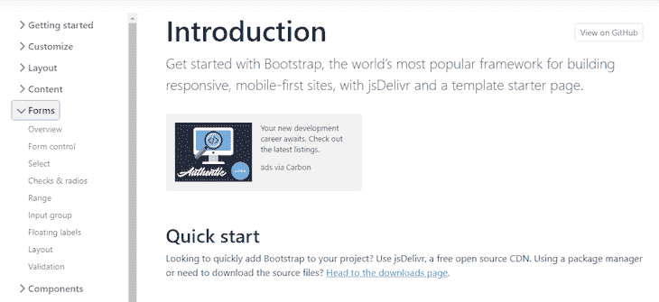
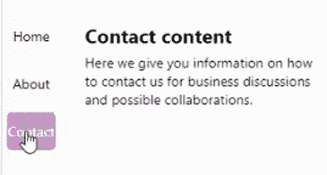
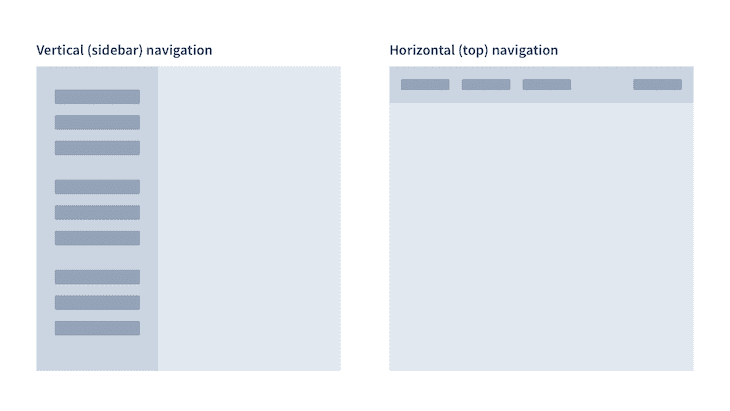

# 为 React 本机应用程序创建垂直选项卡布局

> 原文：<https://blog.logrocket.com/creating-vertical-tab-layout-react-native/>

当开发包含大量资源的多级站点或应用程序时，您会希望让用户从用户界面上的一个位置轻松导航到这些不同的级别。您可以使用选项卡元素设计一个 UI 来实现这个目标。

在本教程中，我们将在 React Native 中从头开始创建一个垂直选项卡布局，使用 CSS flexbox 来确保该布局具有响应性，并且在各种设备上看起来相似。然后我们将讨论水平和垂直标签布局，以及何时最好使用其中一个。向前跳:

作为本教程的先决条件，您应该熟悉 React Native 和 CSS。你也应该有一个关于世博小吃的入门应用。

## React 原生应用为什么要使用垂直标签？

选项卡式界面包含一组可点击的标签卡或选项卡。通常，这些选项卡要么是导航性的，要么是模块化的。导航标签链接到不同的页面，而模块化标签链接到同一页面的子部分。

选项卡式界面模式类似于文件柜中的选项卡式分隔线，它在选择文件之前将内容组织到清晰的类别和子类别中。就像这个真实世界的例子一样，用户可以在单击选项卡查看内容之前，浏览选项卡标签以找到他们想要访问的内容。

标签非常适合组织内容。它们让你告诉用户哪些内容属于哪个类别，让他们很容易找到符合他们当前目的和目标的内容。这里有一个来自 Bootstrap 网站的例子:



在 Forms 类别下，您可以看到几个链接到页面其他部分的子类别。现在，让我们学习如何在 React Native 中创建我们自己的简单垂直标签菜单。

## 预览我们的垂直选项卡布局项目

在垂直选项卡布局中，选项卡垂直排列在左侧。每个选项卡标签对应一个相关内容块，一次只能有一个选项卡处于活动状态。

这是最终项目的预览:



在我们进入下一部分之前，您应该已经在 Expo Snack 设置好了您的入门应用程序。如果你没有，只需在你的网络浏览器中进入 [snack.expo.dev](https://snack.expo.dev/) 即可。

## 导入项目组件

首先删除`App.js`文件中的所有代码。然后，在同一个文件中，进行以下导入:

```
import * as React from 'react';
import { StyleSheet, View, Image, TouchableOpacity, Text, Dimension, FlatList, SafeAreaView} from 'react-native';
import {useState} from 'react'

```

这里我们导入了核心的 React 库，几个我们将用来构建 UI 的组件，以及管理应用程序状态的`[useState](https://blog.logrocket.com/a-guide-to-usestate-in-react-ecb9952e406c/)`[钩子](https://blog.logrocket.com/a-guide-to-usestate-in-react-ecb9952e406c/)。

## 定义选项卡标签和内容

我们将使用`listTab`来定义我们的选项卡标签，使用`data`来定义每个标签将链接到的内容。请参见下面的代码:

```
const listTab = [
  {
    status: 'Home'    
  },
  {
    status: 'About'    
  },
  {
    status: 'Contact'    
  },
]

// Linking content
const data = [
  {
    name: "Home content",
    text: "This is my homepage. Here I welcome you to my website and try me best to make a good impression. I tell you about the services I provide and encourage you to venture into my site.",
    status: "Home"
  },
  {
     name: "About content",
    text: "Here I go into details about myself and my business, including the services we provide, how we started and our overall ethos.",
    status: "About"
  },
  {
     name: "Contact content",
    text: "Here we give you information on how to contact us for business discussions and possible collaborations.",
    status: "Contact"
  }
]

```

每个内容对象都有一个与`listTab`中的状态相匹配的`status`属性。这就是我们如何将选项卡标签链接到它们相应的数据。

## 为 React 本机选项卡元素设置功能

在下一个代码块中，我们将定义`App`组件函数:

```
export default function App() {
  // the following code goes here
}

```

在`App`中，首先默认设置标签为`Home`。确保`Home`的`data`也显示出来:

```
const [status, setStatus] = useState('Home')
    const [dataList, setDataList] = useState([...data.filter(e => e.status === 'Home')])

```

现在，您需要一种方法来在用户点击标签项时激活它。我们将使用`setStatusFilter`函数来完成这项工作:

```
const setStatusFilter = status => {
      if(status !== 'Home') {
        setDataList([...data.filter(e => e.status === status)])
      }else {
        setDataList([...data.filter(e => e.status === 'Home')])
      }

      setStatus(status)
    }

```

当点击一个标签时，上面的函数被执行。在函数内部，我们简单地更新`dataList`来显示与用户点击的标签相关的内容。

接下来，我们将返回[一个包含标签菜单和内容列表的](https://blog.logrocket.com/improve-mobile-ui-react-native-safe-area-context/) `[SafeAreaView](https://blog.logrocket.com/improve-mobile-ui-react-native-safe-area-context/)` [元素](https://blog.logrocket.com/improve-mobile-ui-react-native-safe-area-context/)。在第一个`<View>`组件中，我们将使用`map()`数组函数遍历标签项。对于每一项，我们将[呈现一个带有标签的](https://blog.logrocket.com/react-native-touchable-vs-pressable-components/) `[TouchableOpacity](https://blog.logrocket.com/react-native-touchable-vs-pressable-components/)` [元素](https://blog.logrocket.com/react-native-touchable-vs-pressable-components/)。

我们还将动态地将`btnTabActive`类应用于活动选项卡，并在用户按下元素时调用`setStatusFilter`方法来更新活动状态:

```
return (
      <SafeAreaView style={styles.container}>
        <View style={styles.listTab}>
          {
            listTab.map((e) => {
              return (
                <TouchableOpacity 
                  style={[styles.btnTab, status === e.status && styles.btnTabActive]}
                  onPress={() => setStatusFilter(e.status)}
                >
                  <Text style={styles.textTab, status === e.status && styles.textTabActive}>{e.status}</Text>
                </TouchableOpacity>
              )
            })
          }          
        </View>    

        <FlatList
          data={dataList}
          keyExtractor={(e,i) => i.toString()}
          renderItem={renderItem}
        />    
      </SafeAreaView>
    );
}

```

在`<View>`组件下面是`[<FlatList>](https://blog.logrocket.com/deep-dive-react-native-flatlist/)`[组件](https://blog.logrocket.com/deep-dive-react-native-flatlist/)。`<FlatList>`接收与活动选项卡相关的数据，并通过调用`renderItem`函数来呈现。下面是函数体:

```
const renderItem = ({item, index}) => {
      return (
        <View key={index} style={styles.itemContainer}>                    
          <Text style = {styles.itemName}>{item.name}</Text>                     
          <Text>{item.text}</Text>
        </View>       
      )
 }

```

在上面的代码中，我们呈现了两个`Text`组件来显示与活动选项卡相关的标题和文本。

## 设计我们的 responsive React 本机垂直选项卡布局

最后，这里是负责样式化元素的样式表。请注意，我们正在使用 [CSS flexbox 布局系统](https://blog.logrocket.com/flexbox-vs-css-grid/)来实现一个响应性的垂直选项卡布局，该布局在不同设备之间看起来相似:

```
const styles = StyleSheet.create({
  container: {
    flex: 1,        
    flexDirection: 'row',
    paddingHorizontal: 10,
    justifyContent: 'center'  
  },
  listTab: {
    backgroundColor: '#fff',    
    flexDirection: 'column',
    justifyContent: 'flex-start',
    marginTop: 20,    
    marginLeft: 5,    
    height: 100
  },
  btnTab: {
    width: 50,
    flexDirection: 'row',
    marginBottom: 10,
    paddingHorizontal: 15,
    paddingVertical: 10,
    justifyContent: 'center'
  },
   textTab: {
    fontSize: 16    
  },
  btnTabActive: {
    backgroundColor: 'purple',
    borderRadius: 5
  },
  textTabActive: {
    color: '#fff'
  },
  itemContainer: {    
    justifyContent: 'flex-end',
    paddingVertical: 15,
    marginLeft: 30,
    marginTop: 10
  },
  itemName: {
    fontWeight: 'bold',
    fontSize: 20,
    marginBottom: 5
  },
});

```

就是这样！您现在有了一个工作的导航选项卡。当你点击一个标签页时，它对应的内容会显示在右边，如下图所示:


我们提到有两种选项卡布局——垂直和水平。让我们进一步了解它们。

## 何时使用垂直制表符与水平制表符

垂直标签，通常称为侧边栏，是放置在页面及其主要内容两侧的链接列表。另一方面，水平选项卡布局位于页面顶部。你可以把它做成粘性的，这样无论你在页面上导航到哪里，它都会出现。

下面，您可以看到出现在屏幕左侧的垂直选项卡元素和出现在屏幕顶部的水平选项卡元素的位置之间的差异:



当构建你的网站或应用程序的用户界面时，你首先需要决定你的网站导航是使用垂直还是水平的标签布局。那么，什么时候应该使用一种而不是另一种呢？

这一切都归结为可用空间。在垂直选项卡布局中，选项卡和内容共享相同的水平空间，这意味着内容的空间有限。除非你的目的是在用户浏览你的内容时抓住他们的注意力，否则垂直标签可能不是一个好主意。

垂直标签最好用在大屏幕上。例如，[当屏幕大到足以包含选项卡和主要内容时，您可以使用媒体查询](https://blog.logrocket.com/choose-between-media-container-queries/)来应用垂直选项卡布局，但随后在较小的屏幕上切换到水平布局，以便为内容释放更多空间。

## 结论

我希望这篇教程能帮助你更好地理解垂直和水平标签。现在，您应该能够使用本文中介绍的技术在 React 原生应用程序中从头开始构建导航选项卡。

如果你对这个话题有任何疑问，请留下评论，我会尽快回复。祝你一周愉快！

## [LogRocket](https://lp.logrocket.com/blg/react-native-signup) :即时重现 React 原生应用中的问题。

[](https://lp.logrocket.com/blg/react-native-signup)

[LogRocket](https://lp.logrocket.com/blg/react-native-signup) 是一款 React 原生监控解决方案，可帮助您即时重现问题、确定 bug 的优先级并了解 React 原生应用的性能。

LogRocket 还可以向你展示用户是如何与你的应用程序互动的，从而帮助你提高转化率和产品使用率。LogRocket 的产品分析功能揭示了用户不完成特定流程或不采用新功能的原因。

开始主动监控您的 React 原生应用— [免费试用 LogRocket】。](https://lp.logrocket.com/blg/react-native-signup)