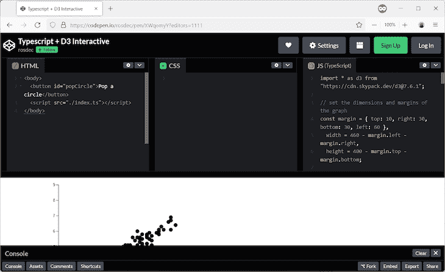
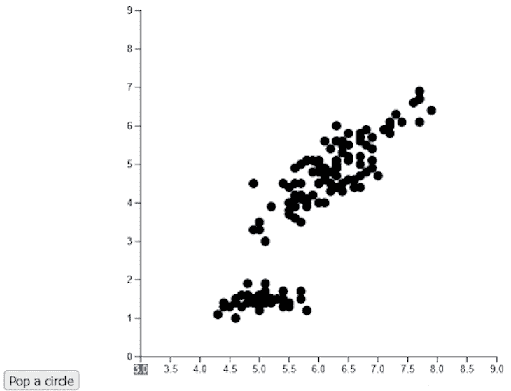

# 用 D3 和 TypeScript 创建可视化

> 原文：<https://blog.logrocket.com/creating-visualizations-d3-typescript/>

本文将记录我学习 [D3.js](https://d3js.org/) 的经历，这是一个 JavaScript 框架，可以生成由数据驱动的高质量图表和图形。

虽然 D3 是一个 JavaScript 库，但我们将使用 [TypeScript](https://blog.logrocket.com/tag/typescript/) ，因为它比普通的旧 JavaScript 更有效地处理数据和数据类型。

本教程将向你展示如何使用 D3 和 TypeScript 创建可视化效果。首先，我们将创建一个简单的样板项目，添加数据，然后构建一个完全交互式的示例。我们将在 [CodePen](https://codepen.io) 上托管代码，以获得最大的交互性，这是一个风格决定。

每个例子都可以在浏览器中运行，省去了你在电脑上安装任何东西的麻烦。当然，您将能够叉起一支笔，在您的代码版本上工作。

*向前跳转:*

## 在 D3 中创建和导出样板工程

我们将主要关注添加依赖项和用样板笔熟悉环境。左边会有 HTML，中间会有 CSS，右边会有 TypeScript。这是大部分活动发生的地方。



接下来，确保 JavaScript 窗格设置为 TypeScript，并添加 D3 作为依赖项。您可以通过选择右上角的**档位图标**来完成此操作。

下面是代码的一个交互式示例:

参见 [CodePen](https://codepen.io) 上 rosdec ( [@rosdec](https://codepen.io/rosdec) )
的 Pen[Typescript+D3 样板](https://codepen.io/rosdec/pen/VwxzGVp)。

代码很简单，所以我们只关注 TypeScript，因为 HTML 和 CSS 是不相关的。

```
import * as d3 from "https://cdn.skypack.dev/[email protected]";

const svg = d3.select("body")
  .append("svg")
  .attr("width", 500)
  .attr("height", 500);

svg
  .append("text")
  .attr("x", 100)
  .attr("y", 100)
  .text("Hello d3js");

svg
  .append("circle")
  .attr("r", 30)
  .attr("cx", 60)
  .attr("cy", 50);
```

导入解决了 D3 库的依赖性。在下面的代码块中，我们将`svg`组件添加到了`body`标签中，以适应每个代码示例中的图形。

最后两行代码添加了文本和圆圈，以产生在笔中看到的结果。这就是我们设置环境来玩 D3 所需要的一切。

## 向 D3 添加数据

为了忠实于 D3 理念，我们必须将数据添加到我们的图形中。为此，我们将使用下面的代码。这将下载一个 CSV 文件，并将其可视化为散点图。

参见 [CodePen](https://codepen.io) 上 rosdec ( [@rosdec](https://codepen.io/rosdec) )
的 Pen[Typescript+D3 互动](https://codepen.io/rosdec/pen/XWqemyY)。

```
import * as d3 from "https://cdn.skypack.dev/[email protected]";

// set the dimensions and margins of the graph
const margin = { top: 10, right: 30, bottom: 30, left: 60 },
  width = 460 - margin.left - margin.right,
  height = 400 - margin.top - margin.bottom;

// append the svg object to the body of the page
const svg = d3
  .select("body")
  .append("svg")
  .attr("width", width + margin.left + margin.right)
  .attr("height", height + margin.top + margin.bottom)
  .append("g")
  .attr("transform", `translate(${margin.left}, ${margin.top})`);

// Read the data
d3.csv(
"https://raw.githubusercontent.com/holtzy/D3-graph-gallery/master/DATA/iris.csv"
).then(function (csvdata) {
  // Add X axis
  const x = d3.scaleLinear().domain([3, 9]).range([0, width]);
  const xAxis = svg
    .append("g")
    .attr("transform", `translate(0, ${height})`)
    .call(d3.axisBottom(x));

  // Add Y axis
  const y = d3.scaleLinear().domain([0, 9]).range([height, 0]);
  svg.append("g").call(d3.axisLeft(y));

  // Add dots
  svg.append("g")
     .selectAll("circle")
     .data(csvdata)
     .join("circle")
     .attr("cx", function (d) {
       return x(d.Sepal_Length);
    })
    .attr("cy", function (d) {
       return y(d.Petal_Length);
    })
    .attr("r", 5);
});
```

完成导入后，我们将定义在其上绘制图形的表面。我们可以通过计算区域的宽度和高度以及边距来做到这一点。这些值将`svg`添加到 HTML 主体中，并指定一个转换。在这种情况下，将`g`置于`svg`之下是一个`translate`操作。

我们最后的操作是绘制散点图中的点。数据是作为 CSV 文件直接从 URL 下载的。D3 可以操作 CSV 数据，这在大多数情况下会派上用场。一旦数据可用，就执行三个操作:添加 x 轴、添加 y 轴和绘制数据。

连续执行前两个操作，将 x 轴和 y 轴定义为`scaleLinear`。然后，对于每个轴，该范围由这些轴将占据的像素数来指定。x 轴将有一个从`3`到`9`的域，y 轴将有从`0`到`9`的域。

## 使用 D3 将数据绑定到图形

将点添加到散点图可能看起来有点复杂，但是我们可以通过特定的操作序列来完成。这个想法是将图形组件(圆、点和线)绑定到数据。然后，数据将修改图形组件的某些方面，如颜色、厚度、图案和位置。在上面的源代码中，我们:

*   使用`.selectAll`定义将连接每个数据元素的元素类型
*   使用`.data`来定义阵列
*   使用`.join`连接数据和图形元素。这是动态添加和删除`HTML`或`SVG`的地方

现在，我们定义数据的值如何影响图形元素。在上面的例子中，你可以看到我们`.selectAll`圈出元素，我们调用`.data`将`csvdata`分配为连接的数据源，然后我们`.join`将数据分配给图形元素。

我们最后也是最有创意的一步是定义数据如何影响`graphics`。此时，对于`csvdata`中的每个条目，我们只有一个圆圈。要修改圆圈，我们使用`.attr`。前两个将修改圆心坐标处的属性`cx`和`cy`，然后通过将半径设置为`5`来修改半径。

## 用 D3 与可视化交互

接下来我们增加一个互动，探索 D3 的真实可能性。首先，让我们看看最后的结果:

参见 [CodePen](https://codepen.io) 上 rosdec ( [@rosdec](https://codepen.io/rosdec) )
的 Pen[Typescript+D3 互动](https://codepen.io/rosdec/pen/XWqemyY)。

除了散点图，我们还有一个从数据中删除一个圆的按钮。这是在 D3 中完成的，无需访问外部源。该按钮被添加到 HTML 中，但被绑定到它将在 TypeScript 源代码中执行的代码。

交互发生在`popCircle()`中，并将从`csvdata`数组中移除最后一个元素。这将把散点图中的圆连接到数据上，但是有一点附加——`.exit`操作。这定义了当一个数据退出图形数组时会发生什么。

代码的语义很简单:`.exit()`之后的所有内容都将应用于从数组中退出的图形元素。这里，我们要求 D3 在从表示中移除`graphics`之前，在由`.attr`指定的圆半径上应用一个过渡，它将成为`0`。

最终的效果在视觉上令人满意。一旦你点击**按钮**，散点图圆圈消失，过渡提醒用户修改发生在哪里。



## 结论

在本教程中，我们学习了如何建立一个基于 TypeScript 和 D3 的精简项目。我们还看到了如何从基本的表示转变为高级的、交互式的数据驱动的表示。虽然这个例子很简单，但我希望它清楚地显示了在哪里进行干预以产生数据驱动的图形表示。

## [LogRocket](https://lp.logrocket.com/blg/typescript-signup) :全面了解您的网络和移动应用

[](https://lp.logrocket.com/blg/typescript-signup)

LogRocket 是一个前端应用程序监控解决方案，可以让您回放问题，就像问题发生在您自己的浏览器中一样。LogRocket 不需要猜测错误发生的原因，也不需要向用户询问截图和日志转储，而是让您重放会话以快速了解哪里出错了。它可以与任何应用程序完美配合，不管是什么框架，并且有插件可以记录来自 Redux、Vuex 和@ngrx/store 的额外上下文。

除了记录 Redux 操作和状态，LogRocket 还记录控制台日志、JavaScript 错误、堆栈跟踪、带有头+正文的网络请求/响应、浏览器元数据和自定义日志。它还使用 DOM 来记录页面上的 HTML 和 CSS，甚至为最复杂的单页面和移动应用程序重新创建像素级完美视频。

[Try it for free](https://lp.logrocket.com/blg/typescript-signup)

.