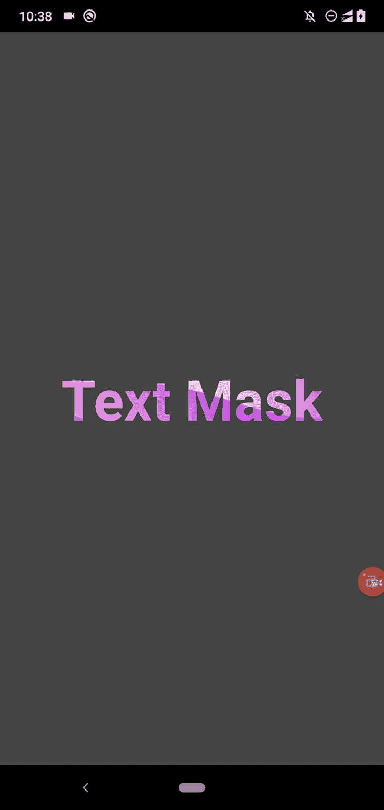
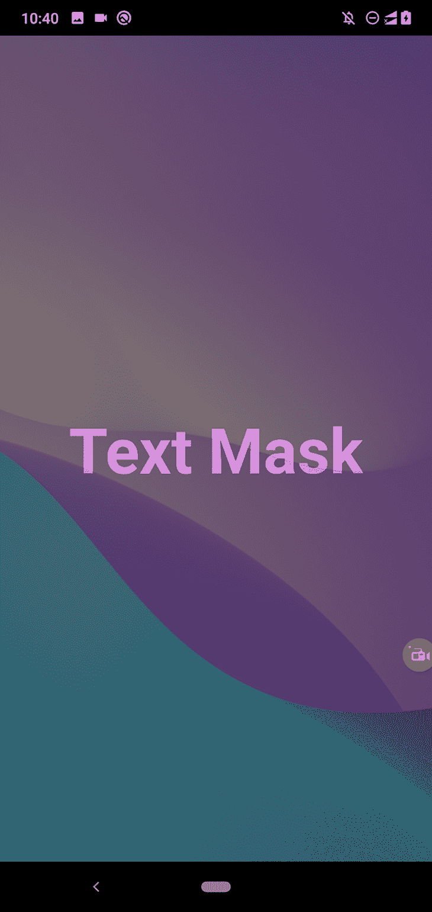
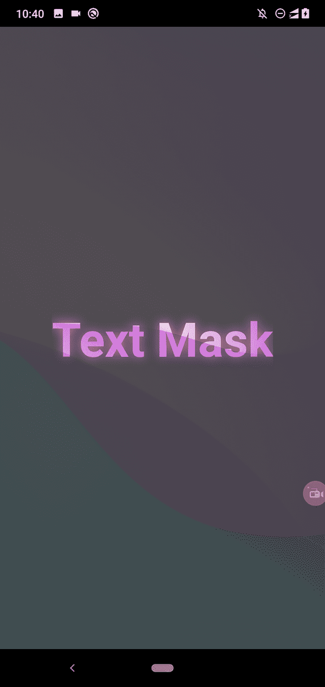
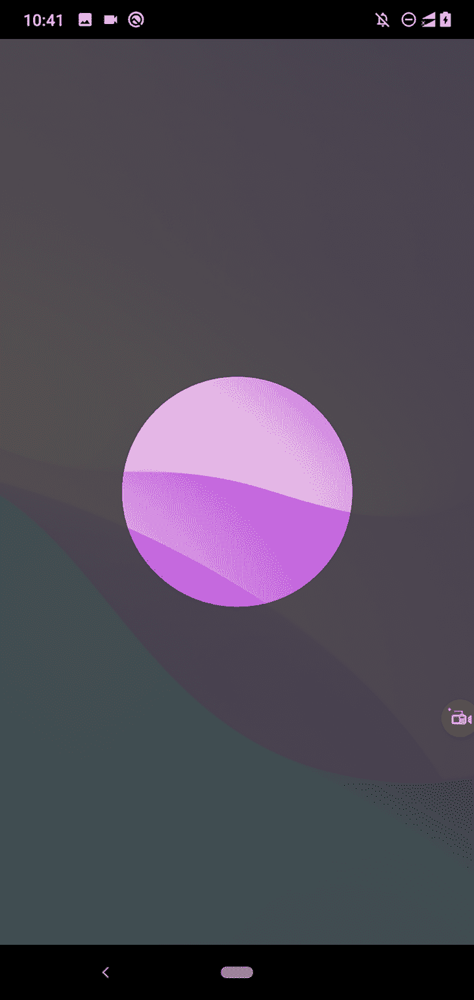
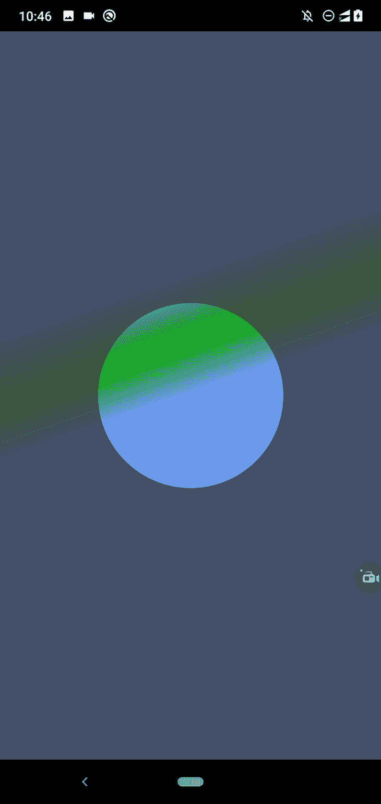
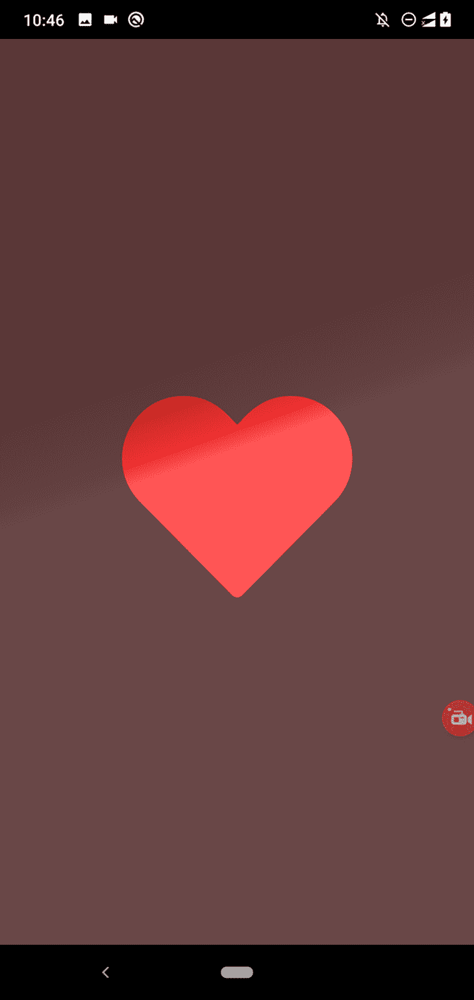
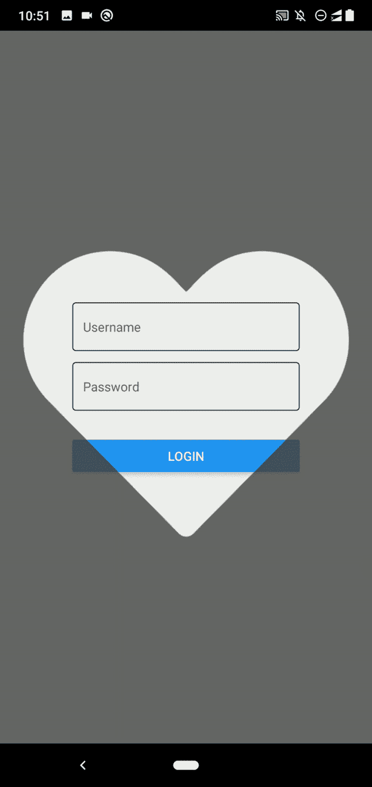
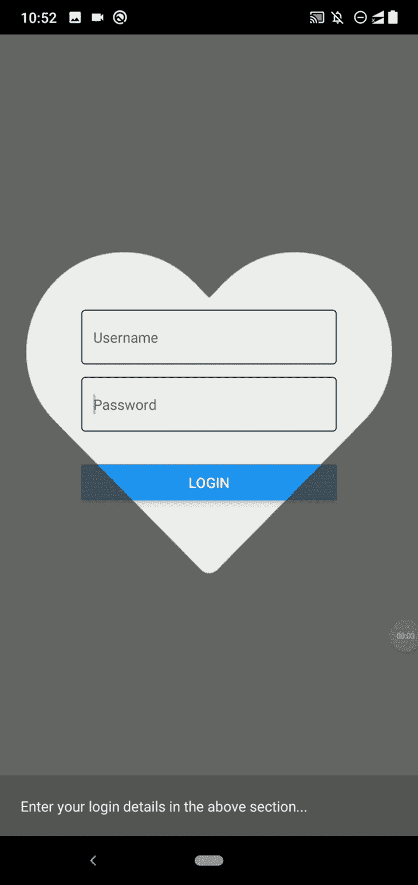
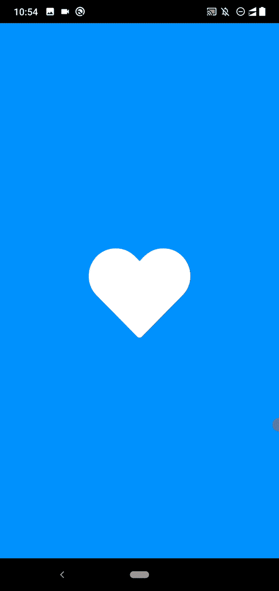

# 使用 react-native-masked-view 创建视觉效果

> 原文：<https://blog.logrocket.com/creating-visuals-react-native-masked-view/>

在计算机科学中，“屏蔽”是指使用一个数字元素(掩码)来修改或提取第二个数字元素中的数据。程序员在各种计算机科学应用中使用屏蔽:在开发软件系统/API 时使用位屏蔽，在前端开发中使用输入屏蔽，在开发 GUI 应用时使用基于计算机图形的屏蔽。

在移动应用程序中，我们经常使用视觉信号来提高应用程序的质量和用户友好性，包括这些基于遮罩的静态图形和动画。例如，现代移动应用程序包括包含图像纹理或渐变层的矢量形状或文本。一些移动应用程序显示带有动画矢量遮罩的主应用程序屏幕(即 Twitter 的 iOS 应用程序)，以创建独特的欢迎用户体验。

[react-native-masked-view 库](https://github.com/react-native-masked-view/masked-view)允许您创建遮罩视图，为 react 原生应用程序添加引人注目的视觉效果。在本教程中，我将解释如何使用 react-native-masked-view 库，并提供一些可以在 react 本地应用中使用的实例。

*向前跳转:*

学习库特性有助于验证实现设计思想的可行性。所以，在使用库之前，让我们研究一些库的特性。该库具有以下突出的特性:

### 跨平台支持

旧的 React 原生版本提供了官方的内置 [`MaskedViewIOS`框架组件](https://reactnative.dev/docs/0.61/maskedviewios)，用于在 iOS 上实现屏蔽视图。但是在 [v0.59](https://reactnative.dev/blog/2019/03/12/releasing-react-native-059#-lean-core-is-underway) 中，React 原生团队将`MaskedViewIOS`组件移到了一个名为 react-native-masked-view 的独立社区包中，以实现更好的可管理性；现在，react-native-masked-view 同时支持 Android 和 iOS 平台。

### 独立于元素类型的屏蔽

这个库不会通过只提供基于图像的遮罩来限制应用程序开发人员；您可以在屏蔽过程中使用任何有效的 React 元素。使用该库可以创建基于文本、基于图像或任何基于 React 元素的遮罩。

### 动画支持

React Native framework 为开发人员提供了一个内置的动画 API，用于制作特定于平台的本机 UI 元素的动画。您可以集成内置的动画 API 和这个遮罩库，在 React 本机应用程序中创建引人注目的动态视觉效果。用矢量形状蒙版创建一个独特的开场动画是如此简单！

现在我们知道了屏蔽库提供的主要特性，让我们开始使用这个库来更加熟悉它。

首先，我们需要在 React 本地项目中安装这个库。您可以在现有项目或新项目中使用即将出现的示例。如果您计划创建一个新的，请使用以下命令:

```
npx react-native init MaskedViewDemo
cd MaskedViewDemo

```

现在，按如下方式安装库:

```
npm install @react-native-masked-view/masked-view
# --- or ---
yarn add @react-native-masked-view/masked-view

```

运行项目以确保屏蔽包安装成功:

```
npx react-native run-android
# --- or --- 
npx react-native run-ios

```

## 创建带有背景纹理的文本蒙版

我们可以用一个`Text`组件和一个`Image`组件创建一个简单的 mask 元素来开始。这里，我们需要使用`Text`组件作为蒙版元素，并使用`Image`作为蒙版的纹理。换句话说，我们需要用背景纹理填充文本元素。

首先，[从 Unsplash 网站下载中等大小的图片文件](https://unsplash.com/photos/E8Ufcyxz514)到你的 app 目录下，重命名为`texture.jpg`。接下来，将以下代码添加到您的`App.js`文件中:

```
import React from 'react';
import {
  SafeAreaView,
  StyleSheet,
  Text,
  View,
  Image
} from 'react-native';
import MaskedView from '@react-native-masked-view/masked-view';
import backgroundTexture from './texture.jpg';

function App() {
  return (
    <SafeAreaView style={styles.container}>
      <MaskedView
        style={styles.maskedView}
        maskElement={
          <View style={styles.maskWrapper}>
            <Text style={styles.mask}>Text Mask</Text>
          </View>
        }>
        <Image
          source={backgroundTexture}
          style={styles.image}
        />
      </MaskedView>
    </SafeAreaView>
  );
}

const styles = StyleSheet.create({
  container: {
    flex: 1,
    backgroundColor: '#444'
  },
  maskedView: {
    flex: 1,
    flexDirection: 'row',
    height: '100%'
  },
  maskWrapper: {
    backgroundColor: 'transparent',
    flex: 1,
    justifyContent: 'center',
    alignItems: 'center',
  },
  mask: {
    fontSize: 60,
    color: 'black',
    fontWeight: 'bold',
  },
  image: {
    flex: 1,
    height: '100%',
    backgroundColor: '#324376'
  },
});

export default App;

```

上面，我们创建了一个文本遮罩，并在`maskElement`道具中添加了一个`Text`组件。出于定位的目的，我们用透明的`View`包装了`Text`组件。`Image`组件呈现在文本蒙版后面，所以我们只能看到蒙版区域内的图像内容:



`MaskedView`组件显示基于`maskElement`的 [alpha 通道](https://en.wikipedia.org/wiki/Alpha_compositing)的背景组件，因此我们可以使用部分透明来增加样式的趣味性。例如，我们可以部分显示文本元素周围的背景图像，如下所示:

```
maskWrapper: {
  backgroundColor: 'rgba(0, 0, 0, 0.3)',
  flex: 1,
  justifyContent: 'center',
  alignItems: 'center',
},

```

上面的样式定义通过`rgba`样式语法为遮罩元素设置了一个不透明度值。现在，您将看到以下结果:



我们还可以更改文本阴影，在文本元素周围应用模糊效果:

```
maskWrapper: {
  backgroundColor: 'rgba(0, 0, 0, 0.08)',
  flex: 1,
  justifyContent: 'center',
  alignItems: 'center',
},
mask: {
  fontSize: 60,
  color: 'black',
  fontWeight: 'bold',
  textShadowRadius: 30,
  textShadowColor: 'rgba(0, 0, 0, 0.8)'
},

```

在你的应用程序中使用上述代码后，你会在文本元素周围看到一个模糊效果。对阴影使用高 alpha 值会更多地显示背景图像，模糊文本元素，因为遮罩过程使用不透明区域来激活遮罩。看下面的预告:



## 创建矢量形状遮罩

之前，我们使用了带有背景图像的文本遮罩。现在，我们将使用矢量形状作为遮罩。我们可以通过使用一个`View`组件从形状遮罩开始。正如您已经知道的，我们可以通过调整它的边界半径来创建一个带有`View`组件的圆形。

用一个`View`组件替换`Text`组件，如下所示:

```
maskElement={
  <View style={styles.maskWrapper}>
    <View style={styles.mask}></View>
  </View>
}>

```

接下来，更改内部遮罩元素的样式定义:

```
mask: {
  width: 200,
  height: 200,
  backgroundColor: '#000',
  borderRadius: 100
},

```

注意，我们仍然使用`maskWrapper`进行定位。上面的样式片段设置了内部`View`的边框半径，而外部`View`使用低 alpha 值来稍微显示背景图像，如下面的预览所示:



在前面的例子中，我们使用了带有蒙版的图像背景，但是蒙版库支持在蒙版元素后面使用任何 React 元素。例如，您可以在遮罩元素后面使用[众所周知的`LinearGradient`组件](https://blog.logrocket.com/complex-gradients-react-native-linear-gradient/)，如下所示:

```
import React from 'react';
import {
  SafeAreaView,
  StyleSheet,
  Text,
  View,
  Image
} from 'react-native';
import MaskedView from '@react-native-masked-view/masked-view';
import LinearGradient from 'react-native-linear-gradient';

function App() {
  return (
    <SafeAreaView style={styles.container}>
      <MaskedView
        style={styles.maskedView}
        maskElement={
          <View style={styles.maskWrapper}>
            <View style={styles.mask}></View>
          </View>
        }>
        <LinearGradient
          start={{x: 0.0, y: 0.25}}
          end={{x: 0.5, y: 1.0}}
          locations={[0.2, 0.32, 0.4]}
          colors={['#0059FF', '#18AF00', '#6B99ED']}
          style={styles.image}
        />
      </MaskedView>
    </SafeAreaView>
  );
}

const styles = StyleSheet.create({
  container: {
    flex: 1,
    backgroundColor: '#444'
  },
  maskedView: {
    flex: 1,
    flexDirection: 'row',
    height: '100%'
  },
  maskWrapper: {
    backgroundColor: 'rgba(0, 0, 0, 0.2)',
    flex: 1,
    justifyContent: 'center',
    alignItems: 'center',
  },
  mask: {
    width: 200,
    height: 200,
    backgroundColor: '#000',
    borderRadius: 100
  },
  image: {
    flex: 1,
    height: '100%',
  },
});

export default App;

```

> 注意:在运行下面的代码之前，确保根据[官方安装指南](https://github.com/react-native-linear-gradient/react-native-linear-gradient#installation)安装`react-native-linear-gradient`包。

以上代码呈现了以下遮罩:



### 使用 png 中的矢量图形创建渐变背景

使用相同的方法，您可以使用 PNG 文件中的矢量图形来创建带有渐变背景的蒙版元素。我们试试吧！

在您的项目目录中下载[这个 PNG 图像](https://www.flaticon.com/free-icon/heart_2107845?term=heart&page=1&position=8&page=1&position=8&related_id=2107845&origin=search)(来自 [FlatIcon](https://www.flaticon.com) 的心形符号的矢量图像)并将其重命名为`heart.png`。接下来，将以下代码添加到您的`App.js`文件中:

```
import React from 'react';
import {
  SafeAreaView,
  StyleSheet,
  Text,
  View,
  Image
} from 'react-native';
import MaskedView from '@react-native-masked-view/masked-view';
import LinearGradient from 'react-native-linear-gradient';
import heartImage from './heart.png';
import backgroundImage from './texture.jpg';

function App() {
  return (
    <SafeAreaView style={styles.container}>
      <MaskedView
        style={styles.maskedView}
        maskElement={
          <View style={styles.maskWrapper}>
            <Image source={heartImage} style={styles.mask}/>
          </View>
        }>
        <LinearGradient
          start={{x: 0.0, y: 0.25}}
          end={{x: 0.5, y: 1.0}}
          locations={[0.2, 0.32, 0.35]}
          colors={['#AF0000', '#ED2F2F', '#FF5656']}
          style={styles.image}
        />
      </MaskedView>
    </SafeAreaView>
  );
}

const styles = StyleSheet.create({
  container: {
    flex: 1,
    backgroundColor: '#444'
  },
  maskedView: {
    flex: 1,
    flexDirection: 'row',
    height: '100%'
  },
  maskWrapper: {
    backgroundColor: 'rgba(0, 0, 0, 0.2)',
    flex: 1,
    justifyContent: 'center',
    alignItems: 'center',
  },
  mask: {
    width: 200,
    height: 200,
  },
  image: {
    flex: 1,
    height: '100%',
  },
});

export default App;

```

上面的代码使用矢量形状作为遮罩，使用渐变作为遮罩的背景，如下所示:



图像背景也可以作为相同的渐变背景。只需使用以下组件代替之前的`LinearGradient`组件:

```
<Image source={backgroundImage} style={styles.image}/>

```

现在，心形图标将显示我们之前下载的背景图像:


从 [FlatIcon](https://www.flaticon.com/) 网站下载更多 PNG 文件，看看你能为你的登录屏幕创建什么样令人印象深刻的背景！

## 为您的应用程序内容创建遮罩

在前面的例子中，我们使用图像或渐变层作为遮罩元素的背景。如果需要通过 mask 元素显示你的 app 屏幕内容，比如通过之前的 vector mask 显示一个登录屏幕怎么办？

将以下代码添加到您的`App.js`中:

```
import React, { useState, useEffect } from 'react';
import {
  SafeAreaView,
  StyleSheet,
  Text,
  TextInput,
  View,
  Image,
  Button,
} from 'react-native';
import MaskedView from '@react-native-masked-view/masked-view';
import LinearGradient from 'react-native-linear-gradient';
import heartImage from './heart.png';

function App() {
  return (
    <SafeAreaView style={styles.container}>
      <MaskedView
        style={styles.maskedView}
        maskElement={
          <View style={styles.maskWrapper}>
            <Image source={heartImage} style={styles.mask}/>
          </View>
        }>
        <View style={styles.loginBox}>
          <TextInput
            value=""
            placeholder="Username"
            placeholderTextColor="#666"
            style={styles.input}
          />
          <TextInput
            value=""
            placeholder="Password"
            placeholderTextColor="#666"
            secureTextEntry={true}
            style={styles.input}
          />
          <View style={styles.separator}/>
          <Button title="Login"/>
        </View>
      </MaskedView>
    </SafeAreaView>
  );
}

const styles = StyleSheet.create({
  container: {
    flex: 1,
    backgroundColor: '#444'
  },
  maskedView: {
    flex: 1,
    flexDirection: 'row',
    height: '100%'
  },
  maskWrapper: {
    backgroundColor: 'rgba(0, 0, 0, 0.2)',
    flex: 1,
    justifyContent: 'center',
    alignItems: 'center',
  },
  mask: {
    width: 360,
    height: 360,
  },
  loginBox: {
    flex: 1,
    height: '100%',
    justifyContent: 'center',
    backgroundColor: '#eee',
    padding: 80
  },
  input: {
    borderWidth: 1,
    borderColor: '#222',
    borderRadius: 4,
    padding: 12,
    marginBottom: 12
  },
  separator: {
    height: 20
  }
});

export default App;

```

上面的代码在登录框上实现了一个心形的遮罩。您可以点按心形并激活登录框的输入元素，所有触摸事件都可以通过遮罩区域完美工作。

看下面的预告:



同样，您可以在应用程序内容上显示矢量形状遮罩。这种方法的一个很好的用例是突出应用中的细分市场，以创建应用之旅。让我们把上面的心形面具变成一个简单的应用程序游览屏幕。

首先，将以下样式定义添加到源代码中:

```
infoBox: {
  padding: 20,
  backgroundColor: '#555',
},
infoText: {
  fontSize: 14,
  color: '#eee'
}

```

接下来，在`MaskedView`之后添加下面的信息框代码片段:

```
</MaskedView>
<View style={styles.infoBox}>
  <Text style={styles.infoText}>Enter your login details in the above section...</Text>
</View>

```

您将看到一个简单的应用程序浏览屏幕，如下所示:



在这里，我用我们已经下载的矢量形状演示了一个用例——您将希望使用类似聚光灯或合适的矢量蒙版元素来创建应用程序游览。

## 使用带有遮罩的动画:创建开瓶器动画

如果你使用过 Twitter iOS 应用程序，你可能会记得它独特的开启屏幕:当启动时，它会显示带有动画 Twitter 标志面具的提要。Twitter 徽标遮罩开始变小并放大，直到用户看到整个提要屏幕。

react-native-masked-view 库支持动画元素作为遮罩元素，因此我们可以使用矢量遮罩创建令人印象深刻的开场动画。让我们像 Twitter iOS 应用程序一样，将之前的登录屏幕的遮罩制作成动画，并显示应用程序内容。

下载或克隆这个 GitHub 存储库，我在那里存储了示例应用程序内容。安装依赖项并运行应用程序。您将看到以下动画:



我们使用内置动画 API 的 react-native-masked-view 来创建动画心形图标。动画看起来很简单，但以这种速度想象它的阶段有点令人困惑。如果我们考虑以下几个阶段，我们就可以查看和理解整个动画的元素:

1.  心形图标遮罩会放大并显示白色背景层
2.  同时，蓝色背景层会出现在矢量形状的背景周围
3.  我们淡入并缩小登录部分
4.  当动画结束时，蓝色和白色背景屏幕被隐藏，不再可见

让我们检查一下上面代码中的一些关键事实。我们在蒙版中使用了一个`Animated.Image`组件来动态改变蒙版的缩放因子:

```
<MaskedView
  style={styles.maskedView}
  maskElement={
    <View style={styles.maskWrapper}>
      <Animated.Image source={heartImage}
        style={[styles.mask, maskScale]}/>
    </View>

```

为了缩小和淡化登录框，我们使用了一个`Animated.View`组件:

```
<Animated.View style={[styles.loginBox, appScale, appOpacity]}>

```

在代码中，蓝色背景层位于`MaskedView`之前:

```
{ !animDone ? <View style={[StyleSheet.absoluteFill, styles.backgroundFillBlue]}></View> : null }
<MaskedView

```

白色背景层位于`MaskedView`内，并在心形图标遮罩动画中显示。它会在动画结束后消失:

```
<MaskedView
  style={styles.maskedView}
  maskElement={
    <View style={styles.maskWrapper}>
      <Animated.Image source={heartImage}
        style={[styles.mask, maskScale]}/>
    </View>
  }>
  { !animDone ? <View style={[StyleSheet.absoluteFill, styles.backgroundFillWhite]}></View> : null }
  <Animated.View style={[styles.loginBox, appScale, appOpacity]}>

```

现在，使用您的移动应用程序的标志而不是`heart.png`文件，并根据您的意愿调整动画。你也可以将上述组件的源代码打包到[一个 React 原生包](https://blog.logrocket.com/the-complete-guide-to-publishing-a-react-package-to-npm/)中，在创纪录的时间内为你的应用程序创建一个引人注目的开启屏幕。

查看 React Native 博客上的这篇文章,了解更多关于在 React Native 中实现 Twitter iOS 应用程序的开场动画的信息。我在上面的演示应用程序中使用了相同的方法。

## 结论

在本教程中，我们开发了一些实际的例子来学习如何使用 react-native-masked-view 库在 react 本机应用程序中创建引人注目的视觉效果。可以使用这个库来创建带有图像、渐变和基于应用程序元素的背景的文本和矢量蒙版。此外，您可以使用任何 React 元素作为遮罩。

正如我之前演示的，您可以使用内置的动画 API 和`MaskedView`来创建动态的动画遮罩元素。

## [LogRocket](https://lp.logrocket.com/blg/react-native-signup) :即时重现 React 原生应用中的问题。

[](https://lp.logrocket.com/blg/react-native-signup)

[LogRocket](https://lp.logrocket.com/blg/react-native-signup) 是一款 React 原生监控解决方案，可帮助您即时重现问题、确定 bug 的优先级并了解 React 原生应用的性能。

LogRocket 还可以向你展示用户是如何与你的应用程序互动的，从而帮助你提高转化率和产品使用率。LogRocket 的产品分析功能揭示了用户不完成特定流程或不采用新功能的原因。

开始主动监控您的 React 原生应用— [免费试用 LogRocket】。](https://lp.logrocket.com/blg/react-native-signup)