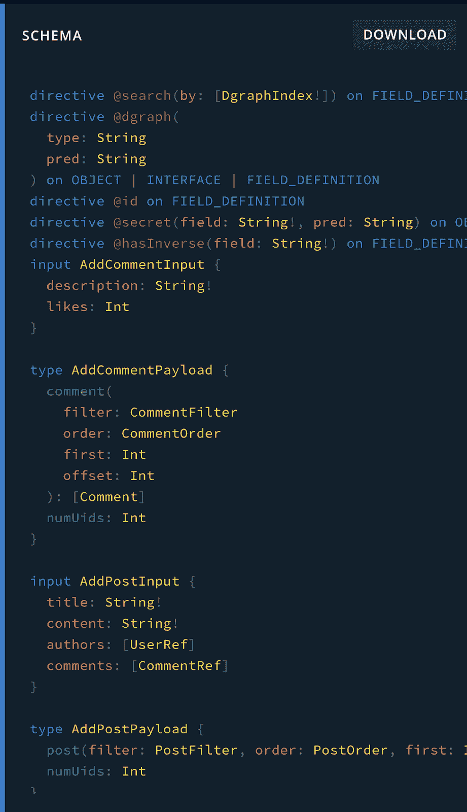
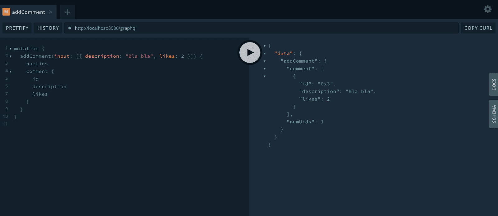
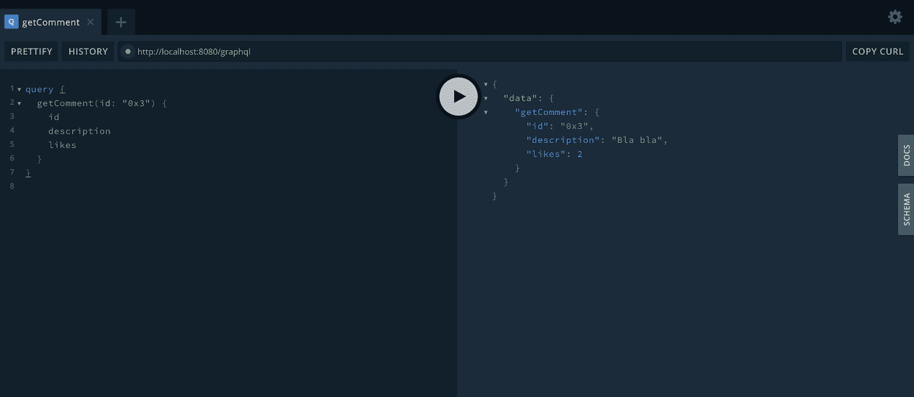
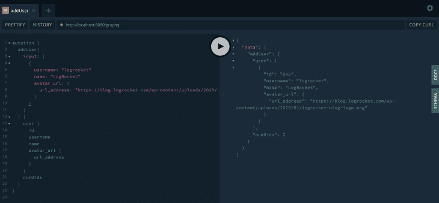
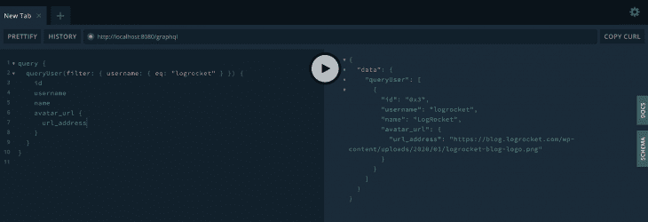
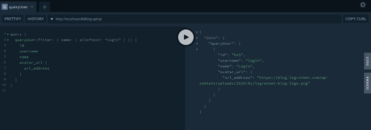
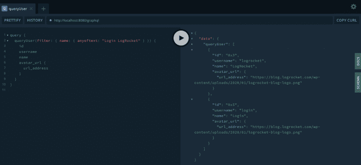

# 用 Dgraph 和 GraphQL 创建你的第一个 CRUD

> 原文：<https://blog.logrocket.com/creating-your-first-crud-with-dgraph-and-graphql/>

Dgraph 是一个可水平扩展的、快速的、高度可用的分布式图形数据库，提供 ACID 事务、一致的复制和可线性化的读取。

它还支持类似 GraphQL 的查询语法，这对于拥有更细粒度的搜索特性非常有用。

图形数据库则是使用图形结构(如节点和边)来表示实体关系和存储数据的数据库。

[GraphQL](https://graphql.org/) 顾名思义，也是基于图的面积的技术。那么，为什么不把两者混合呢？

如您所知，GraphQL 是一种替代的、健壮的方法来公开 API 端点，而不是通常的 REST。

它灵活、不受语言限制、功能强大，并且被社区广泛接受。但这并不意味着您必须在图形数据库中编写数据存储逻辑。

本文旨在以实用的方式触及这一主题。

我们将使用 Dgraph 创建一个 CRUD，反过来，它将为每一个查询和变化生成搭建的方法。然后，通过使用 GraphQL Playground，我们将对它们进行测试。

## 设置

启动和运行 Dgraph 的最快方法是通过 Docker。你也可以通过`curl`下载它，并按照[这些指令](https://github.com/dgraph-io/dgraph#quick-install)将它添加到 bash 中。

然而，为了简单起见，我们将坚持 Docker 策略。

首先，[安装 Docker](https://docs.docker.com/get-docker/) 如果你还没有的话。

然后，让我们运行下面的命令，该命令提取最新的[图形 Docker 图像](https://hub.docker.com/r/dgraph/dgraph/):

```
docker pull dgraph/dgraph:latest
```

如果你愿意，你也可以安装一个特定的版本而不是最新的版本。

完成后，您可以运行以下命令来检查下载的图像:

```
docker images
```

最后，让我们启动并运行 Dgraph:

```
docker run -it -p 8080:8080 dgraph/dgraph:latest
```

这将在端口 8080 的`localhost`中启动我们的应用程序。您可以随意更改端口。

请务必等到消息“`Listening on ...`”出现，以证明它已启动。

这就是了。设置非常简单，下一步是向我们的 Dgraph 数据库提供模式。

现在，让我们分析一下我们的模式将会是什么样子:

```
type Post {
    id: ID!
    title: String! @search(by: [exact])
    content: String!
    authors: [User]
    comments: [Comment]
}

type User {
    id: ID!
    username: String! @search(by: [exact])
    name: String! @search(by: [fulltext])
    avatar_url: Url
}

type Comment {
    id: ID!
    description: String!
    likes: Int
}

type Url {
    url_address: String!
}
```

我们的例子是一篇博客文章的模式。我们将对博客用户、帖子和评论创建一个 CRUD。

如果你不熟悉 GraphQL 模式，我推荐你阅读一下这个。

在创建模式时，重要的是要像考虑数据库表一样考虑它。每种类型对应一个表，该表应该有一个 id(自动生成)。在我们的例子中，`Url`类型没有 id，所以这意味着我们必须显式地将 URL 插入用户。

其余字段遵循惯例。你有一个类型，`!`定义了它是否是必需的。

这里特别注意`@search`指令。

它告诉 Dgraph 我们的模型需要能够搜索特定的属性值。

`exact`值表示要在 param 提供的精确字符串上进行搜索，而`fulltext`值启用了另外两个选项，我们将进一步看到它们的作用。

* * *

### 更多来自 LogRocket 的精彩文章:

* * *

您还有选项`regexp`，它允许通过 regex 进行过滤。

你可以在这里阅读更多关于这个[的内容。](https://graphql.dgraph.io/quick-start)

现在，让我们运行命令，根据看到的模式创建所有数据库结构:

```
curl -H "Content-Type: application/json" http://localhost:8080/admin/schema -XPOST -d $'
type Post {
    id: ID!
    title: String! @search(by: [exact])
    content: String!
    authors: [User]
    comments: [Comment]
}

type User {
    id: ID!
    username: String! @search(by: [exact])
    name: String! @search(by: [fulltext])
    avatar_url: Url
}

type Comment {
    id: ID!
    description: String!
    likes: Int
}

type Url {
    url_address: String!
}'
```

该命令成功完成后，您应该会看到以下输出消息:

```
{"data":{"code":"Success","message":"Done"}}
```

## 测试

现在是时候测试我们的示例并向数据库提供博客数据了。

首先，你需要下载并安装 GraphQL Playground 工具到你的电脑上。

显然，您可以使用最适合您的任何工具，但是我们将坚持使用操场，因为它很简单，并且当您在服务器上更改它时会自动刷新 GraphQL 模式。

现在，打开它，在地址栏中键入[http://localhost:8080/graph QL](http://localhost:8080/graphql)。

点击窗口右侧的`SCHEMA`按钮，会出现以下内容:



Dgraph generated schema.

您可能已经注意到，我们提供给 Dgraph 命令的初始模式并不是最终的模式。实际上，Dgraph 会以此为默认基础，在每一个已建立的关系上生成 CRUD 模式操作。

模式及其关系越复杂，最终生成的 GraphQL 模式就越复杂。

Dgraph 遵循以下模式:将`Add`(创建新项)、`Update`(更新现有项)、`Remove`(删除)和`Get`(检索和过滤)作为前缀出现在操作名的开头。

让我们从创建新注释的简单突变开始测试。这是内容:



Creating a new comment.

为了在这个 API 中进行调用，您必须遵循由 Dgraph 确定的类型系统——这个系统是自动生成的，我们以前见过。

每个突变接收一个参数，即`input`。它基本上是一个条目数组，根据您正在执行的操作类型而变化。例如，为了创建一个新的评论，你必须提供一个`description`和`likes`的号码。

还要注意，在我们放置结果字段之后，我们希望返回结果字段。这是必须的。

最后，在右边，您可以看到结果，包括自动生成的 id 值。这个值很重要，因为它是您在获取评论时必须使用的值。例如:



Querying for a specific id.

现在让我们创建一个新用户。这是它的变异内容:

```
mutation {
  addUser(
    input: [
      {
        username: "logrocket"
        name: "LogRocket"
        avatar_url: {
          url_address: "https://blog.logrocket.com/wp-content/uploads/2020/01/logrocket-blog-logo.png"
        }
      }
    ]
  ) {
    user {
      id
      username
      name
      avatar_url {
        url_address
      }
    }
    numUids
  }
}
```

注意，我们应该显式地将头像 url 内容作为一个整体类型放置。如果你有许多对象在另一个里面，它们也必须在这里说明。

这是输出:



Adding a new user.

查询已创建的用户与注释非常相似。Playground 实际上通过自动完成突变和查询的可用选项帮了大忙。

这是最近创建的用户的查询示例:

```
query {
  getUser(id: "0x6") {
    id
    username
    name
    avatar_url {
      url_address
    }
  }
}
```

现在，让我们来探索一下[滤镜特性](https://dgraph.io/tour/basic/6/)。

正如我们提到的，它允许我们查询特定的语句或文本片段。例如，假设您有一群已经注册的用户，您想搜索用户名为“logrocket”的所有用户。

这可能是您的疑问:

```
query {
  queryUser(filter: { username: { eq : "logrocket" } }) {
    id
    username
    name
    avatar_url {
      url_address
    }
  }
}
```

`eq`运算符代表`equals to`。请记住，这是唯一可能的，因为我们已经在模式中定义了`username`字段是可搜索的(`@search(by: [exact])`)。



Querying by exact username value.

另一方面，name 字段是作为可搜索字段创建的，但是带有选项`fulltext`。该选项为我们提供了两个搜索操作符:`alloftext`(包含所有这些)和`anyoftext`(至少包含其中一个)。

看看带有第一个选项的查询:

```
query {
  queryUser(filter: { name: { alloftext: "Login" } }) {
    id
    username
    name
    avatar_url {
      url_address
    }
  }
}
```

这将是结果:



Testing with alloftext option.

说到第二种选择，我们得到的是:



Testing with anyoftext option.

现在我们有了一个包含两个元素的数组。Dgraph 将搜索与至少一个字符串参数匹配的任何内容。

另一个可能的查询如下:

```
query {
  queryPost(
    filter: { title: { eq: "bla" } }
    order: { asc: content }
    first: 2
  ) {
    id
    title
    content
    comments {
      description
      likes
    }
  }
}
```

插入一些文章后，您可以查询标题为“bla”的所有文章，按内容排序，结果是找到前两个条目。

## 结论

这些只是 Dgraph 与 GraphQL 结合的几个例子。它的脚手架性质对从头构建 CRUD 并让它立即运行很有帮助。

Dgraph 为我们提供了其他有趣的特性，比如授权和认证指令、自定义解析器、自定义字段等等。

请务必参考他们的[官方文件](https://graphql.dgraph.io/quick-start)了解更多信息。

## 监控生产中失败和缓慢的 GraphQL 请求

虽然 GraphQL 有一些调试请求和响应的特性，但确保 GraphQL 可靠地为您的生产应用程序提供资源是一件比较困难的事情。如果您对确保对后端或第三方服务的网络请求成功感兴趣，

[try LogRocket](https://lp.logrocket.com/blg/graphql-signup)

.

[](https://lp.logrocket.com/blg/graphql-signup)[https://logrocket.com/signup/](https://lp.logrocket.com/blg/graphql-signup)

LogRocket 就像是网络和移动应用的 DVR，记录下你网站上发生的每一件事。您可以汇总并报告有问题的 GraphQL 请求，以快速了解根本原因，而不是猜测问题发生的原因。此外，您可以跟踪 Apollo 客户机状态并检查 GraphQL 查询的键值对。

LogRocket 检测您的应用程序以记录基线性能计时，如页面加载时间、到达第一个字节的时间、慢速网络请求，还记录 Redux、NgRx 和 Vuex 操作/状态。

[Start monitoring for free](https://lp.logrocket.com/blg/graphql-signup)

.