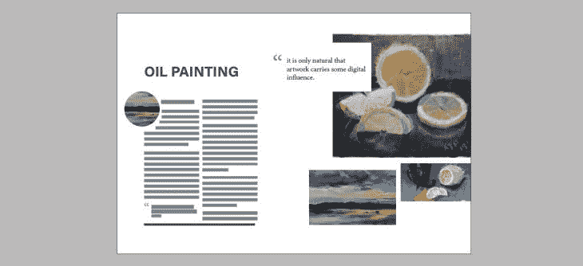
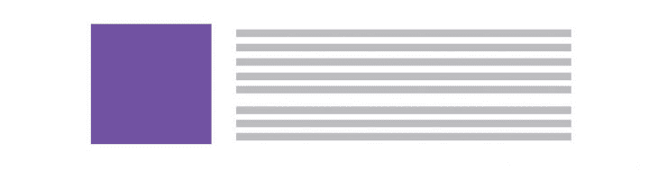
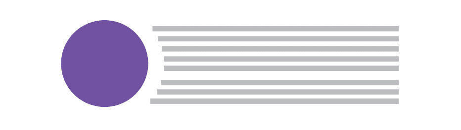
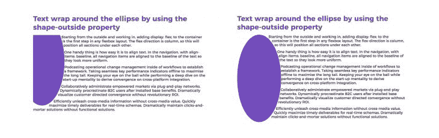
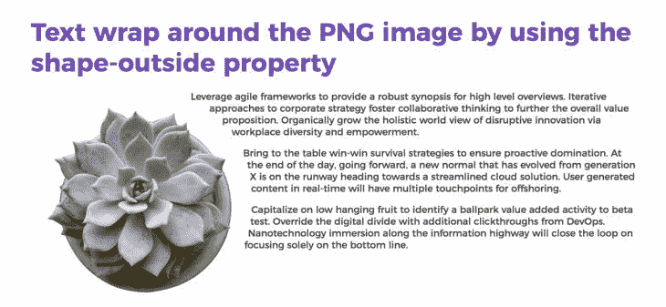
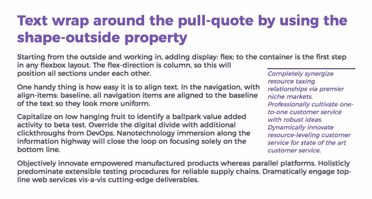
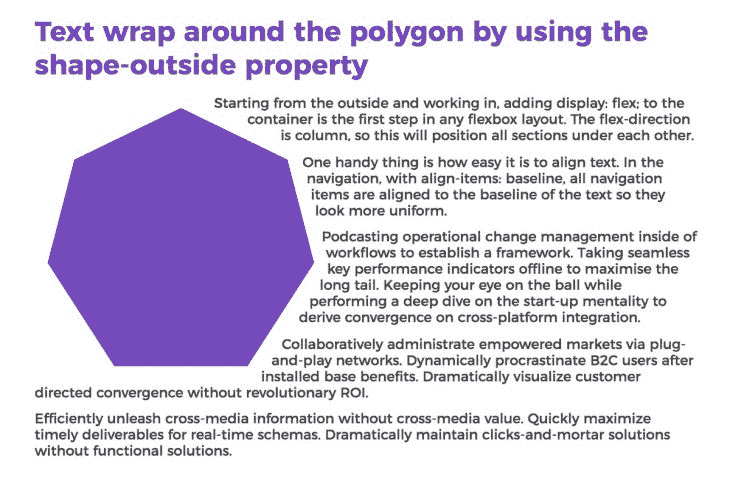

# 使用 CSS 形状的创意文本流

> 原文：<https://blog.logrocket.com/creative-text-flows-using-css-shapes/>

回想许多年前，我是如何开始我的设计生涯的，我记得在 Adobe InDesign 中创建了创造性的文本流。作为一名印刷设计师，我在页面设计程序中做了很多工作。处理布局时，有时文本会环绕图像或“环绕”形状。这在印刷界被称为“文本换行”。这不是网络上使用的术语，但是 CSS 样式也有类似的想法。



内容是任何网站的关键。谈到网页排版，有很多最佳实践，但最重要的设计规则是保持排版清晰，并为最佳浏览体验进行优化。

权力越大，责任越大。当设计和规划文本的排版和流动时，注意用户的阅读体验是很重要的。仅仅因为你可以做一些“有趣和不同”的事情，并不意味着你一定要做，如果它会分散注意力或以消极的方式影响易读性。易读性是第一位的，但是如果你想打破格子，你的创造力不必受到限制。让我们来看看如何将创意文本流融入到您的设计中。

## 形状和文字如何融合？

已经有一段时间了，但我记得看过一些文章，听到设计师说，“所有的网站看起来都一样”。这可能是几年前的事了，现在当我浏览网页时，我看不到完全一致的东西。

我提出这一点是因为现在浏览器变得更加先进，有了更多的灵活性。网站看起来独特而有趣，因为设计师利用了独特的图形、动画和创意文本流等东西。好消息是，使用 CSS 进行样式设计具有灵活性，您可以在设计中使用文本流做一些有趣的事情。简单的形状和剪辑路径是让文本流更有创意的方法。

## 形状

对于圆形、椭圆形和矩形，简单的形状非常简单。这里所做的是利用 shape-outside 属性来重排文本。这一特性让我们摆脱了我们习惯的矩形。它将允许文本环绕其他形状。



We’re used to seeing squares and rectangles on the web when it comes to text flow

## 简单断面型钢

举个简单的例子，我希望我的文本环绕一个圆。它给长文本增加了一些视觉趣味，这样的东西很容易设计。这是其中的一种情况，在这种情况下最容易通过实践来学习。使用 shape-outside 属性，文本围绕一个圆形流动，而不是我们习惯看到的矩形。基本想法是这样的:



下面是 CodePen 上的一个例子:

参见艾比·菲茨杰拉德([@艾比·菲茨杰拉德](https://codepen.io/abbeyjfitzgerald) )
在 [CodePen](https://codepen.io) 上用圈出形状的笔[。](https://codepen.io/abbeyjfitzgerald/pen/MWwGmoy)

**注意**:为了让 shape-outside 属性工作，您需要包含一个浮动并设置高度和宽度。在上面的例子中，宽度和高度被设置为 200px，并且声明了一个左浮动。需要考虑的一件事是，由于浮动决定了形状的哪一侧有环绕，所以不会环绕整个形状。

也许你想用椭圆形代替圆形。请记住，这是一个非常快速的调整圆，使其成为一个椭圆。一个维度相对于另一个维度被拉长了。视椭圆而定，横轴或纵轴较大。我有点脱离几何练习，但是 rx 是 x 轴上的半径值。Ry 是 y 轴上的值。

如果您想使用椭圆，您可能会看到类似 clip-path: ellipse(100px 200px，50% 50%)的内容。这里有两组数字。我们知道第一组数字指定了维度，但是第二组数字是什么呢？那些是 cx 和 cy。它们是椭圆中心的坐标。



See how the coordinates can adjust the placement: ellipse(100px 200px at 20% 30%) compared to ellipse(100px 200px at 50% 50%)

请看 [CodePen](https://codepen.io) 上艾比菲茨杰拉德([@艾比菲茨杰拉德](https://codepen.io/abbeyjfitzgerald) )
的 [椭圆带外形](https://codepen.io/abbeyjfitzgerald/pen/OJVZmpq)。

使用. png 文件

## 一个简单的圆非常简单，但是请记住，shape-outside 属性也适用于。png 图像。利用。png 文件，将图像与形状结合起来是最容易的。这个植物图像与一个圆形结合在一起，因此文本最好围绕它流动。这就是形状余量发挥作用的地方。

下面是 CodePen 上的例子(尝试调整大小和形状边距，看看会发生什么):



This example uses shape-outside with margin-box. It’s important to know that the margin-box is used by default. It’s good to have a reminder of the box model, they can be added to the end of the shape-end. Margin-box and border-box are typically used.

参见 Abbey Fitzgerald([@ abbeyjfitzgerald](https://codepen.io/abbeyjfitzgerald))
上 [CodePen](https://codepen.io) 的笔 [PNG 带外形外](https://codepen.io/abbeyjfitzgerald/pen/yLNjbwg)。

形状边距

这个例子在叶子上有一些有机的形状，所以如果图像和文本之间有一些空白，看起来会更好。Shape-margin 定义了一个形状，因此它与文本流没有直接关系，但与间距有关。您可能已经注意到，在几个例子中，文本与形状很接近。这可能是也可能不是你想要的。这两者之间有一些喘息的空间是很好的，所以好消息是有办法增加一些空间。

## 浮动

定义一个浮动很重要，因为它是包装所需要的。这很容易实验，但是记住浮动需要相反的思维。如果这个植物的图像向右浮动，换行发生在图像的左侧。您还需要设置图像的尺寸，因此记住设置高度/宽度是必要的。

## 使用内容框创建引用

这是一个相当简单的概念，但术语可能有点混乱，因为我们不像上面的例子那样依赖形状。想想像引用这样的设计元素。有时这些设计是为了让文章文本环绕在它们周围。这是整合文章正文和关键引用的好方法(常见于杂志)。这当然是网络上的一个选项。只是需要一点造型。

### 外形在这里看起来会有点不同。内容框指的是拉动式报价包含的内容量，外部内容将围绕它。没有已定义的形状，所以它使用标准矩形。与其他示例一样，在使用 shape-outside 时，宽度、高度和浮动是必需的。



这是密码笔:

```
.pull-quote{
  width: 200px;
  height: 200px;
  shape-outside: content-box;
  margin-top: 35px;
  float: right;
}
```

参见 Abbey Fitzgerald([@ abbeyjfitzgerald](https://codepen.io/abbeyjfitzgerald))
上 [CodePen](https://codepen.io) 的笔 [拉引带形外](https://codepen.io/abbeyjfitzgerald/pen/MWwGxyv)。

复杂形状

剪辑路径

在处理这些例子的时候，我发现 CSS 剪辑路径生成器 [Clippy](https://bennettfeely.com/clippy/) 在建立基本形状的时候非常有用。在某些情况下，您可能想要处理一些更复杂的形状，如多边形。对于像多边形这样的东西，你将使用裁剪路径。当你看到像 clip-path: polygon(50% 0%，90% 20%，100% 60%，75% 100%，25% 100%，0% 60%，10% 20%)这样的东西时，看到很多值可能有点吓人，但是使用像 Clippy 这样的工具真的很有帮助。这是一个非常简单的七边形，但同样的技术可以用于更复杂的路径。

## 

### 下面是 CodePen 上的例子:

参见 Abbey Fitzgerald([@ abbeyjfitzgerald](https://codepen.io/abbeyjfitzgerald))
在 [CodePen](https://codepen.io) 上的 [多边形与形状外](https://codepen.io/abbeyjfitzgerald/pen/eYNrXMr)。


这样做可能不需要非常复杂的形状，但是可以考虑组合形状。由于内容环绕浮动所指定的另一侧的形状，因此可以有两个浮动的形状以及它们之间的文本。它提供了一个有趣的效果。

浏览器支持

使用 CSS 形状时，检查浏览器支持总是很重要的。[我能用吗](https://caniuse.com/)总是一个有用的资源。好消息是，这些文本流是设计上的改进。内容始终是主要焦点，因此无论流是否换行，用户都应该能够访问文本。

结论

## CSS 形状可以简单也可以复杂。现在您已经有了文本流和 CSS 形状的基础，您可以将其中的一些概念整合到您的 web 布局中。

你的前端是否占用了用户的 CPU？

## 随着 web 前端变得越来越复杂，资源贪婪的特性对浏览器的要求越来越高。如果您对监控和跟踪生产环境中所有用户的客户端 CPU 使用、内存使用等感兴趣，

.

## LogRocket 就像是网络和移动应用的 DVR，记录你的网络应用或网站上发生的一切。您可以汇总和报告关键的前端性能指标，重放用户会话和应用程序状态，记录网络请求，并自动显示所有错误，而不是猜测问题发生的原因。

现代化您调试 web 和移动应用的方式— [开始免费监控](https://lp.logrocket.com/blg/css-signup)。

[try LogRocket](https://lp.logrocket.com/blg/css-signup)

.

[](https://lp.logrocket.com/blg/css-signup)[https://logrocket.com/signup/](https://lp.logrocket.com/blg/css-signup)

[LogRocket](https://lp.logrocket.com/blg/css-signup) is like a DVR for web and mobile apps, recording everything that happens in your web app or site. Instead of guessing why problems happen, you can aggregate and report on key frontend performance metrics, replay user sessions along with application state, log network requests, and automatically surface all errors.

Modernize how you debug web and mobile apps — [Start monitoring for free](https://lp.logrocket.com/blg/css-signup).