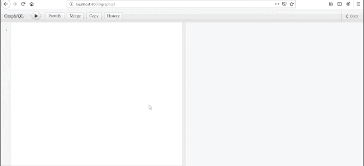

# 使用 React 和 GraphQL 的 CRUD:一个完整的示例教程

> 原文：<https://blog.logrocket.com/crud-react-graphql-examples/>

***编者按**:这个 React 和 GraphQL CRUD 教程最后一次更新是在 2021 年 4 月 30 日。*

在本教程中，我们将向您展示如何使用 GraphQL 和 React 实现简单的端到端 CRUD 操作。我们将回顾使用 [React 钩子](https://blog.logrocket.com/react-hooks-cheat-sheet-unlock-solutions-to-common-problems-af4caf699e70/)读取和改变数据的简单例子。我们还将展示如何用 [Apollo 客户端](https://blog.logrocket.com/data-retrieval-in-graphql-with-react-apollo/)实现认证、错误处理、缓存和乐观 UI。

以下是我们将要介绍的内容:

## 什么是反应？

[React](https://reactjs.org/) 是一个用于构建用户界面的 JavaScript 库。它旨在帮助构建应用程序的前端，包括处理 web 和移动应用程序的视图层。

React 是基于组件的，这意味着 React 应用程序的各个部分被分解成更小的组件，然后组织在更高级别的组件中。这些高级组件是应用程序最终结构的定义所在。

React 支持可重用组件，因此您可以创建一个组件，并在应用程序的不同部分多次使用它。这有助于减少臃肿的代码，并更容易遵循 [DRY 原则](https://en.wikipedia.org/wiki/Don%27t_repeat_yourself)。

## GraphQL 是什么？

GraphQL 是一种用于 API 的查询语言，也是用现有数据完成查询的运行时。简单来说，GraphQL 是一种描述如何请求数据的语法。它通常用于从服务器向客户端加载数据。

GraphQL 通过将所有请求抽象到一个端点来降低构建 API 的复杂性。与传统的 REST APIs 不同，它是声明性的，这意味着无论请求什么都会被返回。

### 何时使用 GraphQL

当然，并不是所有的项目都需要 graph QL——它仅仅是一个整合数据的工具。它有定义良好的模式，所以我们肯定不会过度提取。但是如果我们已经有了一个稳定的 RESTful API 系统，我们依赖于来自单一数据源的数据，我们就不需要 GraphQL 。

例如，假设我们正在为自己创建一个博客，我们决定在一个 MongoDB 数据库中存储、检索和交流数据。在这种情况下，我们没有做任何架构上复杂的事情，也不需要 GraphQL。

另一方面，假设我们有一个完全成熟的产品，它依赖于来自多个来源的数据(例如，MongoDB、MySQL、Postgres 和其他 API)。在这种情况下，我们[应该使用 GraphQL](https://blog.logrocket.com/graphql-vs-rest-what-you-didnt-know/) 。

例如，如果我们正在为自己设计一个作品集网站，我们想要来自社交媒体和 GitHub 的数据(以显示贡献)，我们也有自己的数据库来维护一个博客，我们可以使用 GraphQL 来编写业务逻辑和模式。它将把数据整合为单一的真实来源。

一旦我们有了将正确的数据分发到前端的解析器功能，我们将能够轻松地管理单个数据源中的数据。

## 什么是 CRUD？

在构建 API 时，您希望您的模型提供四个基本功能:它应该能够[创建、读取、更新和删除资源](https://blog.logrocket.com/nodejs-expressjs-postgresql-crud-rest-api-example/#whatisacrudapi)。这组基本操作通常被称为 [CRUD](https://www.codecademy.com/articles/what-is-crud) 。

RESTful APIs 通常利用 HTTP 请求。REST 环境中最常见的四种 HTTP 方法是`GET`、`POST`、`PUT`和`DELETE`，开发人员可以通过这些方法[创建 CRUD 系统](https://blog.logrocket.com/creating-a-crud-api-with-node-express-and-grpc/)。

## 使用`graphql-server`的 CRUD

在本节中，我们将查看一些 GraphQL CRUD 示例，以帮助您理解 CRUD 操作如何在 React 和 GraphQL 应用程序中工作。

### 设置服务器

我们将使用 [`express-graphql`](https://www.npmjs.com/package/express-graphql) 剥离一个简单的 GraphQL 服务器，并将其连接到 MySQL 数据库。源代码和 MySQL 文件都在这个[仓库](https://github.com/AvanthikaMeenakshi/graphqlReactBoilerplate)里。

GraphQL 服务器构建在模式和解析器之上。作为第一步，我们构建一个模式(定义类型、查询、变异和订阅)。这个模式描述了整个应用程序的结构。

其次，对于模式中定义的内容，我们正在构建各自的解析器来计算和分发数据。解析器将动作与功能进行映射；对于 typedef 中声明的每个查询，我们创建一个解析器来返回数据。

最后，我们通过定义端点和传递配置来完成服务器设置。我们将`/graphql`初始化为应用程序的端点。我们将构建的模式和根解析器传递给`graphqlHTTP`中间件。

除了模式和根解析器，我们还启用了 [GraphiQL](https://www.npmjs.com/package/graphiql) 游乐场。GraphQL 是一个交互式浏览器内 GraphQL IDE，它帮助我们处理我们构建的 GraphQL 查询。

```
var express = require('express');
var graphqlHTTP = require('express-graphql');
var { buildSchema } = require('graphql');

var schema = buildSchema(`
  type Query {
    hello: String
  }
`);

var root = {
  hello: () => "World"
};

var app = express();

app.use('/graphql', graphqlHTTP({
  schema: schema,
  rootValue: root,
  graphiql: true,
}));

app.listen(4000);

console.log('Running a GraphQL API server at localhost:4000/graphql');
```

一旦服务器准备就绪，用`node index.js`运行应用程序将在`[http://localhost:4000/graphql](http://localhost:4000/graphql)`启动服务器。我们可以查询 hello 并得到字符串“World”作为响应。

### 连接数据库

我将建立与 MySQL 数据库的连接，如下所示:

```
var mysql = require('mysql');

app.use((req, res, next) => {
  req.mysqlDb = mysql.createConnection({
    host     : 'localhost',
    user     : 'root',
    password : '',
    database : 'userapp'
  });
  req.mysqlDb.connect();
  next();
});
```

我们可以连接多个数据库/源，并在解析器中整合它们。我在这里连接到一个 MySQL 数据库。我在本文中使用的数据库转储在 GitHub 存储库中。

## 使用 GraphQL 读写数据

我们使用查询和突变来读取和修改`data-sources`中的数据。在这个例子中，我定义了一个通用的 queryDB 函数来帮助查询数据库。

### 问题

列出和查看数据的所有 SELECT 语句(或读操作)都放在`type Query` typedef 中。我们在这里定义了两个查询:一个列出数据库中的所有用户，另一个按 id 查看单个用户。

1.  **列出数据:**为了列出用户，我们定义了一个名为`User`的 GraphQL 模式对象类型，它表示我们可以从`getUsers`查询中获取或期望的内容。然后我们定义`getUsers`查询来返回一组用户
2.  **查看单个记录:**为了查看单个记录，我们将`id`作为我们定义的`getUserInfo`查询的参数。它在数据库中查询该特定 id，并将数据返回给前端



现在我们已经将获取所有记录和按 ID 查看记录的查询放在一起，当我们试图从 GraphiQL 中查询用户时，它将在屏幕上列出一组用户！

```
var schema = buildSchema(`
  type User {
    id: String
    name: String
    job_title: String
    email: String
  }
  type Query {
    getUsers: [User],
    getUserInfo(id: Int) : User
  }
`);

const queryDB = (req, sql, args) => new Promise((resolve, reject) => {
    req.mysqlDb.query(sql, args, (err, rows) => {
        if (err)
            return reject(err);
        rows.changedRows || rows.affectedRows || rows.insertId ? resolve(true) : resolve(rows);
    });
});

var root = {
  getUsers: (args, req) => queryDB(req, "select * from users").then(data => data),
  getUserInfo: (args, req) => queryDB(req, "select * from users where id = ?", [args.id]).then(data => data[0])
};
```

### 突变

数据库的写操作——创建、更新、删除——通常在突变下定义。GraphQL 引擎以连续的方式执行变异。查询是并行执行的。

1.  创建数据:我们已经定义了一个变体`createUser`，它采用指定的参数在 MySQL 数据库中创建数据。
2.  更新或删除数据:类似于查看记录，更新(`updateUserInfo`)和删除(`deleteUser`)以 id 为参数，修改数据库。

这些函数用一个布尔值来表示是否发生了变化。

```
var schema = buildSchema(`
  type Mutation {
    updateUserInfo(id: Int, name: String, email: String, job_title: String): Boolean
    createUser(name: String, email: String, job_title: String): Boolean
    deleteUser(id: Int): Boolean
  }
`);

var root = {
  updateUserInfo: (args, req) => queryDB(req, "update users SET ? where id = ?", [args, args.id]).then(data => data),
  createUser: (args, req) => queryDB(req, "insert into users SET ?", args).then(data => data),
  deleteUser: (args, req) => queryDB(req, "delete from users where id = ?", [args.id]).then(data => data)
};
```

既然我们已经设置并排序了服务器端的东西，让我们尝试将后端连接到我们的 React 应用程序。

## 使用`graphql-client`反应中的积垢

一旦我们有了服务器，创建客户机逻辑来显示和改变数据就很容易了。Apollo 客户端有助于状态管理和缓存。它也是高度抽象和快速的:所有用于检索数据、跟踪加载和错误状态以及更新 UI 的逻辑都由`useQuery`钩子封装。

### 连接到`graphql-server`

我创建了一个 CRA 样板文件，并安装了、 [`apollo-boost`](https://www.npmjs.com/package/apollo-boost) 和 [`@apollo/react-hooks`](https://www.npmjs.com/package/@apollo/react-hooks) 。我们初始化 Apollo 客户机，并让它挂钩作出反应。

```
import React from 'react';
import ReactDOM from 'react-dom';
import App from './App';
import ApolloClient from 'apollo-boost';
import { ApolloProvider } from '@apollo/react-hooks';

const client = new ApolloClient({
  uri: 'http://localhost:4000/graphql'
});

ReactDOM.render(
  <ApolloProvider client={client}>
    <App />
  </ApolloProvider>,
  document.getElementById('root')
);
```

### 读取和改变数据

我已经在我的源代码的`Queries`文件夹中管理了所有的 GraphQL 查询。我将使用`useQuery`钩子从服务器请求数据，该钩子构建在 React 钩子 API 之上。它有助于将数据引入 UI。

GraphQL 查询通常包装在`gql`函数中。`gql`帮助将查询字符串转换成查询文档。下面是我们如何在应用程序中定义查询。

```
import { gql } from 'apollo-boost';

export const GET_USERS = gql`
  {
    getUsers {
      id,
      name,
      job_title,
      email
    }
  }
`;

export const VIEW_USERS = gql`
  query ($id: Int){
    getUserInfo(id: $id) {
      id,
      name,
      job_title,
      email
    }
  }
`;

export const ADD_USER = gql`
  mutation($name: String, $email: String, $job_title: String) {
    createUser (name: $name, email: $email, job_title: $job_title)
  }
`;

export const EDIT_USER = gql`
  mutation($id: Int, $name: String, $email: String, $job_title: String) {
    updateUserInfo (id: $id, name: $name, email: $email, job_title: $job_title)
  }
`;

export const DELETE_USER = gql`
  mutation($id: Int) {
    deleteUser(id: $id)
  }
`
```

一旦设置了`ApolloProvider`,我们就可以从我们的 GraphQL 服务器请求数据。我们将试图进行的查询传递给`useQuery`钩子，它将为我们提供结果。

我做了两个有参数和没有参数的查询，来展示我们应该如何在前端处理查询和变异。`useQuery`为我们跟踪`error`和`loading`状态，并将反映在关联对象中。一旦服务器发送结果，它将通过数据属性反映出来。

```
import React from 'react';
import { useQuery } from '@apollo/react-hooks';
import { GET_USERS, VIEW_USERS } from "./Queries";
import { Card, CardBody, CardHeader, CardSubtitle, Spinner } from 'reactstrap';

function App() {
  const getAllUsers = useQuery(GET_USERS);
  const userInfo = useQuery(VIEW_USERS, { variables: { id: 1 }});
  if (getAllUsers.loading || userInfo.loading) return <Spinner color="dark" />;
  if (getAllUsers.error || userInfo.error) return <React.Fragment>Error :(</React.Fragment>;

  return (
    <div className="container">
      <Card>
        <CardHeader>Query - Displaying all data</CardHeader>
        <CardBody>
          <pre>
            {JSON.stringify(getAllUsers.data, null, 2)}
          </pre>
        </CardBody>
      </Card>
      <Card>
        <CardHeader>Query - Displaying data with args</CardHeader>
        <CardBody>
          <CardSubtitle>Viewing a user by id</CardSubtitle>
          <pre>
            {JSON.stringify(userInfo.data, null, 2)}
          </pre>
        </CardBody>
      </Card>
    </div>
  )
}

export default App;

```

与查询类似，变异将使用相同的`useQuery`钩子，并将数据作为变量传递给查询。

```
const deleteMutation = useQuery(DELETE_USER, { variables: { id: 8 }});
const editMutation = useQuery(EDIT_USER, { variables: { id: 9, name: "Username", email: "email", job_title: "job" }});
const createMutation = useQuery(ADD_USER, { variables: { name: "Username", email: "email", job_title: "job" }});
```

## 200 只监视器在生产中出现故障和缓慢的 GraphQL 请求

虽然 GraphQL 有一些调试请求和响应的功能，但确保 GraphQL 在生产中继续为您的应用程序提供资源却变得更加困难。如果您对确保对后端或第三方服务的请求成功感兴趣，请尝试 LogRocket 。[](https://logrocket.com/signup/)[https://logrocket.com/signup/](https://logrocket.com/signup/)

LogRocket 就像是网络应用的 DVR，记录下你网站上发生的每一件事。您可以汇总并报告有问题的 GraphQL 请求，以快速了解根本原因，而不是猜测问题发生的原因。

LogRocket 检测您的应用程序以记录基线性能计时，如页面加载时间、到达第一个字节的时间、慢速网络请求以及日志 Redux、NgRx。和 Vuex 动作/状态。[开始免费监控](https://logrocket.com/signup/)。

## 结论

哒哒！我们只是用 GraphQL 做了端到端的 CRUD 操作。在客户端，引入 React 钩子后，读取和改变数据变得非常简单。Apollo Client 还提供了身份验证、更好的错误处理、缓存和乐观 UI。

订阅是 GraphQL 中另一个有趣的概念。有了这个应用程序作为样板，我们可以继续试验其他类似的概念！

编码快乐！

## 使用 LogRocket 消除传统反应错误报告的噪音

[LogRocket](https://lp.logrocket.com/blg/react-signup-issue-free)

是一款 React analytics 解决方案，可保护您免受数百个误报错误警报的影响，只针对少数真正重要的项目。LogRocket 告诉您 React 应用程序中实际影响用户的最具影响力的 bug 和 UX 问题。

[ ](https://lp.logrocket.com/blg/react-signup-general) [  ](https://lp.logrocket.com/blg/react-signup-general) [LogRocket](https://lp.logrocket.com/blg/react-signup-issue-free)

自动聚合客户端错误、反应错误边界、还原状态、缓慢的组件加载时间、JS 异常、前端性能指标和用户交互。然后，LogRocket 使用机器学习来通知您影响大多数用户的最具影响力的问题，并提供您修复它所需的上下文。

关注重要的 React bug—[今天就试试 LogRocket】。](https://lp.logrocket.com/blg/react-signup-issue-free)