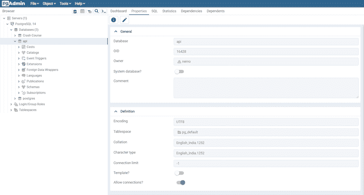
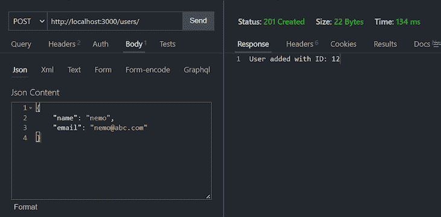

# 带有 Node.js、Express 和 PostgreSQL - LogRocket 博客的 CRUD REST API

> 原文：<https://blog.logrocket.com/crud-rest-api-node-js-express-postgresql/>

***编者按:*** *本帖更新于* *06 月* *2022 以反映对 pgAdmin 客户端的更新。*

对于现代 web 开发人员来说，知道如何使用 API 来促进软件系统之间的通信是至关重要的。在本教程中，我们将学习如何在 Node.js 环境中创建一个 CRUD RESTful API，该环境运行在 Express 服务器上并使用 PostgreSQL 数据库。我们还将通过使用 [node-postgres](https://node-postgres.com/) 将 Express 服务器与 PostgreSQL 连接起来。

我们的 API 将能够处理对应于 PostgreSQL 数据库的 HTTP 请求方法，API 从该数据库获取数据。您还将学习如何安装 PostgreSQL 并通过命令行界面使用它。

我们的目标是允许在 API 上进行 CRUD 操作，`GET`、`POST`、`PUT`和`DELETE`，这些操作将运行相应的数据库命令。为此，我们将为每个端点设置一个路由，并为每个查询设置一个函数。

我们将详细介绍以下内容:

要跟随本教程，您需要:

*   熟悉 JavaScript 语法和基础知识
*   使用命令行的基本知识
*   已安装 Node.js 和 npm

教程的完整代码可以在这个 [GitHub repo](https://github.com/nemo0/node-postgres-crud-api) 上获得。我们开始吧！

## 什么是 RESTful API？

表述性状态转移(REST)为 web 服务定义了一套标准。API 是软件程序用来相互通信的接口。因此，RESTful API 是符合 REST 架构风格和约束的 API。REST 系统是无状态的、可伸缩的、可缓存的，并且具有统一的接口。

## 什么是 CRUD API？

构建 API 时，您希望您的模型提供四个基本功能。它应该能够创建、读取、更新和删除资源。这组基本操作通常被称为 CRUD。

RESTful APIs 通常利用 HTTP 请求。REST 环境中最常见的四种 HTTP 方法是`GET`、`POST`、`PUT`和`DELETE`，开发人员可以通过这些方法创建 CRUD 系统。

*   `Create`:使用`HTTP POST`方法在 REST 环境中创建一个资源
*   `Read`:使用`GET`方法读取资源，在不改变数据的情况下检索数据
*   `Update`:使用`PUT`方法更新资源
*   `Delete`:使用`DELETE`方法从系统中删除资源

## 什么是快递？

根据官方 [Express 文档](https://expressjs.com/)，Express 是 Node.js 的一个快速、无主见、极简的 web 框架，Express 是 Node.js 最流行的框架之一，事实上，MERN 中的 E、MEVN 和 MEAN stack 都代表 Express。

尽管 Express 是极简的，但它也非常灵活，这导致了各种 Express 中间件的[开发，您可以使用这些中间件来解决几乎任何可以想象的任务或问题。](https://blog.logrocket.com/express-middleware-a-complete-guide/)

## PostgreSQL 是什么？

PostgreSQL，通常被称为 Postgres，是一个免费、开源的关系数据库管理系统。您可能熟悉其他一些类似的数据库系统，如 MySQL、Microsoft SQL Server 或 MariaDB，它们与 PostgreSQL 竞争。

PostgreSQL 是一个健壮的关系数据库，自 1997 年就已经存在，可用于所有主流操作系统、Linux、Windows 和 macOS。由于 PostgreSQL 以稳定性、可扩展性和符合标准而闻名，所以它是开发人员和公司的热门选择。

还可以使用 [Sequelize](https://sequelize.org/) 创建 Node.js RESTful CRUD API。 [Sequelize 是一个基于 promise 的 Node.js ORM](https://blog.logrocket.com/using-sequelize-with-typescript/) ，用于 for Postgres、MySQL、MariaDB、SQLite 和 Microsoft SQL Server。

有关如何在 Node.js REST API 中使用 Sequelize 的更多信息，请查看下面的视频教程:

 [https://www.youtube.com/embed/VDgXAw7VynQ?version=3&rel=1&showsearch=0&showinfo=1&iv_load_policy=1&fs=1&hl=en-US&autohide=2&wmode=transparent](https://www.youtube.com/embed/VDgXAw7VynQ?version=3&rel=1&showsearch=0&showinfo=1&iv_load_policy=1&fs=1&hl=en-US&autohide=2&wmode=transparent)

视频

## 什么是 node-postgres？

node-postgres 或 pg 是 Node.js 的非阻塞 PostgreSQL 客户端。本质上，node-postgres 是 Node.js 模块的集合，用于与 PostgreSQL 数据库接口。

node-postgres 支持的许多特性包括回调、承诺、异步/等待、连接池、预处理语句、游标、富类型解析和 C/C++绑定。

## 创建 PostgreSQL 数据库

我们将通过安装 PostgreSQL、创建一个新用户、创建一个数据库以及用一个模式和一些数据初始化一个表来开始本教程。

### 装置

如果你用的是 Windows，下载一个 PostgreSQL 的 [Windows 安装程序](https://www.postgresql.org/download/windows/)。

如果你使用的是 Mac，本教程假设你已经在电脑上安装了 [Homebrew](https://brew.sh/) 作为安装新程序的软件包管理器。如果没有，只需点击链接并按照说明进行操作。

打开端子，用`brew`安装`postgresql`:

```
brew install postgresql

```

你可能会在网页上看到说明，显示的是`brew install postgres`而不是`postgresql`；这两个选项都将在您的计算机上安装 PostgreSQL。

安装完成后，我们希望让`postgresql`启动并运行，这可以通过`services start`来实现:

```
brew services start postgresql
==> Successfully started `postgresql` (label: homebrew.mxcl.postgresql)

```

如果您想在任何时候停止`postgresql`服务，您可以运行`brew services stop postgresql`。

安装 PostgreSQL 后，接下来，我们将连接到`postgres`命令行，在这里我们可以运行 SQL 命令。

## PostgreSQL 命令提示符

`psql`是 PostgreSQL 交互终端。运行`psql`会将您连接到一个 PostgreSQL 主机。运行`psql --help`将为您提供更多关于与`psql`连接的可用选项的信息:

*   `-h` : `--host=HOSTNAME`:数据库服务器主机或套接字目录；默认是`local socket`
*   `-p` : `--port=PORT`:数据库服务器端口；默认是`5432`
*   `-U` : `--username=USERNAME`:数据库用户名；默认是`your_username`
*   `-w` : `--no-password`:从不提示输入密码
*   `-W` : `--password`:强制密码提示，应该自动出现

我们将用默认的登录信息和无选项标志连接到默认的`postgres`数据库:

```
psql postgres

```

你会发现我们建立了新的联系。我们现在在数据库`postgres`的`psql`中。提示符以一个`#`结尾，表示我们作为超级用户或 root 登录:

```
postgres=#

```

`psql`中的命令以反斜杠`\`开始。为了测试我们的第一个命令，我们可以使用`\conninfo`命令检查我们连接到了什么数据库、用户和端口。

```
postgres=# \conninfo
You are connected to database "postgres" as user "your_username" via socket in "/tmp" at port "5432".

```

下面的参考表包括一些我们将在本教程中使用的常用命令:

*   `\q`:退出`psql`连接
*   `\c`:连接到新的数据库
*   `\dt`:列出所有表格
*   `\du`:列出所有角色
*   `\list`:列出数据库

让我们创建一个新的数据库和用户，这样我们就不会使用默认帐户，这些帐户拥有超级用户权限。

## 在 Postgres 中创建角色

首先，我们将创建一个名为`me`的角色，并给它一个密码`password`。角色可以充当用户或组。在这种情况下，我们将以用户身份使用它:

```
postgres=# CREATE ROLE me WITH LOGIN PASSWORD 'password';

```

我们希望`me`能够创建一个数据库:

```
postgres=# ALTER ROLE me CREATEDB;

```

您可以运行`\du`来列出所有角色和用户:

```
me          | Create DB                           | {}
postgres    | Superuser, Create role, Create DB   | {}

```

现在，我们想从`me`用户创建一个数据库。使用`\q`退出默认会话:

```
postgres=# \q

```

我们回到了电脑的默认终端连接。现在，我们将连接`postgres`和`me`:

```
psql -d postgres -U me

```

我们的提示符现在显示的是`postgres=>`，而不是`postgres=#`，这意味着我们不再以超级用户的身份登录。

## 在 Postgres 中创建数据库

我们可以使用 SQL 命令创建一个数据库，如下所示:

```
postgres=> CREATE DATABASE api;

```

使用`\list`命令查看可用的数据库:

```
Name    |    Owner    | Encoding |   Collate   |    Ctype    |
api     | me          | UTF8     | en_US.UTF-8 | en_US.UTF-8 |

```

让我们使用`\c` connect 命令通过`me`连接到新的`api`数据库:

```
postgres=> \c api
You are now connected to database "api" as user "me".
api=>

```

我们的提示现在显示我们已连接到`api`。

## 在 Postgres 中创建表格

最后，在`psql`命令提示符下，我们将创建一个名为`users`的表，它有三个字段、两个`VARCHAR`类型和一个自动递增的`PRIMARY KEY` ID:

```
api=>
CREATE TABLE users (
  ID SERIAL PRIMARY KEY,
  name VARCHAR(30),
  email VARCHAR(30)
);

```

在 PostgreSQL 中创建和使用表时，确保不要使用反勾```字符。虽然在 MySQL 中允许使用反斜线，但在 PostgreSQL 中是无效的。还要确保在`CREATE TABLE`命令中没有尾随逗号。

* * *

### 更多来自 LogRocket 的精彩文章:

* * *

让我们通过向`users`添加两个条目来添加一些数据:

```
INSERT INTO users (name, email)
  VALUES ('Jerry', '[email protected]'), ('George', '[email protected]');

```

让我们通过获取`users`中的所有条目来确保以上信息被正确添加:

```
api=> SELECT * FROM users;
id |  name  |       email        
----+--------+--------------------
  1 | Jerry  | [email protected]
  2 | George | [email protected]

```

现在，我们有了一个用户、数据库、表和一些数据。我们可以开始构建 Node.js RESTful API 来连接存储在 PostgreSQL 数据库中的数据。

至此，我们已经完成了所有 PostgreSQL 任务，可以开始设置 Node.js 应用程序和 Express 服务器了。

## 设置 Express 服务器

要设置 Node.js 应用程序和 Express 服务器，首先要为项目创建一个目录:

```
mkdir node-api-postgres
cd node-api-postgres

```

您可以运行`npm init -y`来创建一个`package.json`文件，或者将下面的代码复制到一个`package.json`文件中:

```
{
  "name": "node-api-postgres",
  "version": "1.0.0",
  "description": "RESTful API with Node.js, Express, and PostgreSQL",
  "main": "index.js",
  "license": "MIT"
}

```

我们希望为服务器和节点安装 Express-postgres 以连接到 PostgreSQL:

```
npm i express pg

```

现在，我们已经将依赖关系加载到了`node_modules`和`package.json`中。

创建一个`index.js`文件，我们将用它作为服务器的入口点。在顶部，我们将需要`express`模块、内置的 [`body-parser`中间件](http://expressjs.com/en/resources/middleware/body-parser.html)，并且我们将设置我们的`app`和`port`变量:

```
const express = require('express')
const bodyParser = require('body-parser')
const app = express()
const port = 3000

app.use(bodyParser.json())
app.use(
  bodyParser.urlencoded({
    extended: true,
  })
)

```

我们将告诉 route 在根`/` URL 上寻找`GET`请求，并返回一些 JSON:

```
app.get('/', (request, response) => {
  response.json({ info: 'Node.js, Express, and Postgres API' })
})

```

现在，将应用程序设置为监听您设置的端口:

```
app.listen(port, () => {
  console.log(`App running on port ${port}.`)
})

```

从命令行，我们可以通过点击`index.js`来启动服务器:

```
node index.js
App running on port 3000.

```

在你的浏览器的地址栏转到`[http://localhost:3000](http://localhost:3000)`，你会看到我们之前设置的 JSON:

```
{
  info: "Node.js, Express, and Postgres API"
}

```

Express 服务器现在正在运行，但是它只发送一些我们创建的静态 JSON 数据。下一步是从 Node.js 连接到 PostgreSQL，以便能够进行动态查询。

## 使用客户端连接到 Postgres 数据库

访问 Postgres 数据库的一个流行客户端是 [pgAdmin](https://www.pgadmin.org/) 客户端。pgAdmin 应用程序可用于各种平台。如果你想为你的 Postgres 数据库设计一个图形用户界面，你可以去[下载页面](https://www.pgadmin.org/download/)下载必要的软件包。

使用 pgAdmin 创建和查询数据库很简单。你需要点击顶部菜单上的**对象**选项，选择**创建**，选择**数据库**来创建一个新的连接。所有的数据库都可以在侧边菜单上找到。通过选择适当的数据库，您可以高效地查询或运行 SQL 查询:



## 从 Node.js 连接到 Postgres 数据库

我们将使用 [node-postgres](https://node-postgres.com/) 模块来创建一个连接池。因此，我们不必在每次查询时都打开和关闭客户机。

生产池的一个流行选项是使用`[pgBouncer](https://pgbouncer.github.io/)`，这是 PostgreSQL 的一个轻量级连接池。

创建一个名为`queries.js`的文件，并设置 PostgreSQL 连接的配置:

```
const Pool = require('pg').Pool
const pool = new Pool({
  user: 'me',
  host: 'localhost',
  database: 'api',
  password: 'password',
  port: 5432,
})

```

在生产环境中，您可能希望将配置详细信息放在一个具有限制性权限的单独文件中，这样就不能从版本控制中访问它。但是，为了简化本教程，我们将把它保存在与查询相同的文件中。

本教程的目的是允许在 API 上进行 CRUD 操作，`GET`、`POST`、`PUT`和`DELETE`，这些操作将运行相应的数据库命令。为此，我们将为每个端点设置一个路由，并为每个查询设置一个函数。

## 为 CRUD 操作创建路线

我们将为六条路线创建六个函数，如下所示。首先，为每条路线创建所有的函数。然后，导出这些函数，以便可以访问它们:

*   `GET` : `/` | `displayHome()`
*   `GET` : `/users` | `getUsers()`
*   `GET` : `/users/:id` | `getUserById()`
*   `POST` : `/users` | `createUser()`
*   `PUT` : `/users/:id` | `updateUser()`
*   `DELETE` : `/users/:id` | `deleteUser()`

在`index.js`中，我们为根端点制作了一个`app.get()`，其中包含一个函数。现在，在`queries.js`中，我们将创建显示所有用户、显示单个用户、创建新用户、更新现有用户和删除用户的端点。

### `GET`所有用户

我们的第一个端点将是一个`GET`请求。我们可以将接触到数据库的原始 SQL 放在`pool.query()`中。我们将`SELECT`所有用户并按 ID 排序。

```
const getUsers = (request, response) => {
  pool.query('SELECT * FROM users ORDER BY id ASC', (error, results) => {
    if (error) {
      throw error
    }
    response.status(200).json(results.rows)
  })
}

```

### `GET`单个用户通过 ID

对于我们的`/users/:id`请求，我们将通过 URL 获得自定义的`id`参数，并使用一个`WHERE`子句来显示结果。

在 SQL 查询中，我们在寻找`id=$1`。在这个实例中，`$1`是 PostgreSQL 本身使用的一个带编号的占位符，而不是您可能从 SQL 的其他变体中识别的`?`占位符:

```
const getUserById = (request, response) => {
  const id = parseInt(request.params.id)

  pool.query('SELECT * FROM users WHERE id = $1', [id], (error, results) => {
    if (error) {
      throw error
    }
    response.status(200).json(results.rows)
  })
}

```

### `POST`新用户

API 将把一个`GET`和`POST`请求带到`/users`端点。在`POST`请求中，我们将添加一个新用户。在这个函数中，我们从请求体中提取了`name`和`email`属性，并插入了带有`INSERT`的值:

```
const createUser = (request, response) => {
  const { name, email } = request.body

  pool.query('INSERT INTO users (name, email) VALUES ($1, $2) RETURNING *', [name, email], (error, results) => {
    if (error) {
      throw error
    }
    response.status(201).send(`User added with ID: ${results.rows[0].id}`)
  })
}

```

### `PUT`更新现有用户中的数据

`/users/:id`端点也将接受两个 HTTP 请求，一个是我们为`getUserById`创建的`GET`,另一个是修改现有用户的`PUT`。对于这个查询，我们将结合我们在`GET`和`POST`中学到的知识来使用`UPDATE`子句。

值得注意的是,`PUT`是幂等的，这意味着完全相同的调用可以反复进行，并将产生相同的结果。`PUT`与`POST`不同，完全相同的呼叫不断重复，会不断产生新的数据用户:

```
const updateUser = (request, response) => {
  const id = parseInt(request.params.id)
  const { name, email } = request.body

  pool.query(
    'UPDATE users SET name = $1, email = $2 WHERE id = $3',
    [name, email, id],
    (error, results) => {
      if (error) {
        throw error
      }
      response.status(200).send(`User modified with ID: ${id}`)
    }
  )
}

```

### `DELETE`一个用户

最后，我们将使用`/users/:id`上的`DELETE`子句删除一个特定的 ID 用户。这个调用非常类似于我们的`getUserById()`功能:

```
const deleteUser = (request, response) => {
  const id = parseInt(request.params.id)

  pool.query('DELETE FROM users WHERE id = $1', [id], (error, results) => {
    if (error) {
      throw error
    }
    response.status(200).send(`User deleted with ID: ${id}`)
  })
}

```

## 在 REST API 中导出 CRUD 函数

要从`index.js`访问这些功能，我们需要导出它们。我们可以用`module.exports`来实现，创建一个函数对象。因为我们使用的是 ES6 语法，我们可以写`getUsers`而不是`getUsers:getUsers`等等:

```
module.exports = {
  getUsers,
  getUserById,
  createUser,
  updateUser,
  deleteUser,
}

```

我们完整的`queries.js`文件如下:

```
const Pool = require('pg').Pool
const pool = new Pool({
  user: 'me',
  host: 'localhost',
  database: 'api',
  password: 'password',
  port: 5432,
})
const getUsers = (request, response) => {
  pool.query('SELECT * FROM users ORDER BY id ASC', (error, results) => {
    if (error) {
      throw error
    }
    response.status(200).json(results.rows)
  })
}

const getUserById = (request, response) => {
  const id = parseInt(request.params.id)

  pool.query('SELECT * FROM users WHERE id = $1', [id], (error, results) => {
    if (error) {
      throw error
    }
    response.status(200).json(results.rows)
  })
}

const createUser = (request, response) => {
  const { name, email } = request.body

  pool.query('INSERT INTO users (name, email) VALUES ($1, $2)', [name, email], (error, results) => {
    if (error) {
      throw error
    }
    response.status(201).send(`User added with ID: ${results.insertId}`)
  })
}

const updateUser = (request, response) => {
  const id = parseInt(request.params.id)
  const { name, email } = request.body

  pool.query(
    'UPDATE users SET name = $1, email = $2 WHERE id = $3',
    [name, email, id],
    (error, results) => {
      if (error) {
        throw error
      }
      response.status(200).send(`User modified with ID: ${id}`)
    }
  )
}

const deleteUser = (request, response) => {
  const id = parseInt(request.params.id)

  pool.query('DELETE FROM users WHERE id = $1', [id], (error, results) => {
    if (error) {
      throw error
    }
    response.status(200).send(`User deleted with ID: ${id}`)
  })
}

module.exports = {
  getUsers,
  getUserById,
  createUser,
  updateUser,
  deleteUser,
}

```

## 在 REST API 中设置 CRUD 函数

现在我们有了所有的查询，我们需要将它们放入到`index.js`文件中，并为我们创建的所有查询函数创建端点路由。

为了从`queries.js`获取所有导出的函数，我们将`require`该文件并将其赋给一个变量:

```
const db = require('./queries')

```

现在，对于每个端点，我们将设置 HTTP 请求方法、端点 URL 路径和相关函数:

```
app.get('/users', db.getUsers)
app.get('/users/:id', db.getUserById)
app.post('/users', db.createUser)
app.put('/users/:id', db.updateUser)
app.delete('/users/:id', db.deleteUser)

```

下面是我们完整的`index.js`文件，API 服务器的入口点:

```
const express = require('express')
const bodyParser = require('body-parser')
const app = express()
const db = require('./queries')
const port = 3000

app.use(bodyParser.json())
app.use(
  bodyParser.urlencoded({
    extended: true,
  })
)

app.get('/', (request, response) => {
  response.json({ info: 'Node.js, Express, and Postgres API' })
})

app.get('/users', db.getUsers)
app.get('/users/:id', db.getUserById)
app.post('/users', db.createUser)
app.put('/users/:id', db.updateUser)
app.delete('/users/:id', db.deleteUser)

app.listen(port, () => {
  console.log(`App running on port ${port}.`)
})

```

有了这两个文件，我们就有了服务器、数据库和 API。您可以再次点击`index.js`来启动服务器:

```
node index.js
App running on port 3000.

```

现在，如果您转到`[http://localhost:3000/users](http://localhost:3000/users)`或`[http://localhost:3000/users/1](http://localhost:3000/users/1)`，您将看到两个`GET`请求的 JSON 响应。

为了测试我们的`POST`、`PUT`和`DELETE`请求，我们可以使用像 Postman 这样的工具或者像 [Thunder Client](https://www.thunderclient.com/) 这样的 VS 代码扩展来发送 HTTP 请求。您还可以使用 [curl](https://curl.se/) ，这是一个已经在您的终端上可用的命令行工具。

使用 Postman 或 Thunder 客户端工具可以很容易地用不同的 HTTP 方法查询端点。只需输入您的 URL，选择特定的 HTTP 方法，如果端点是 PUT 或 POST 路由，则插入 JSON 值，然后点击 **send** :



上面的例子显示了发送一个`POST`请求到指定的路由。`POST`选项表明这是一个`POST`请求。方法旁边的 URL 是 API 端点，JSON 内容是要发送到端点的数据。你同样可以选择不同的路线。

## 结论

现在，您应该有了一个运行在 Node.js 上的 API 服务器，并连接到一个活动的 PostgreSQL 数据库。在本教程中，我们学习了如何在命令行中安装和设置 PostgreSQL，创建用户、数据库和表，以及运行 SQL 命令。我们还学习了如何创建一个可以处理多种 HTTP 方法的 Express 服务器，并使用`pg`模块从 Node.js 连接到 PostgreSQL。

有了这些知识，您应该能够构建这个 API，并将其用于您自己的个人或专业开发项目。