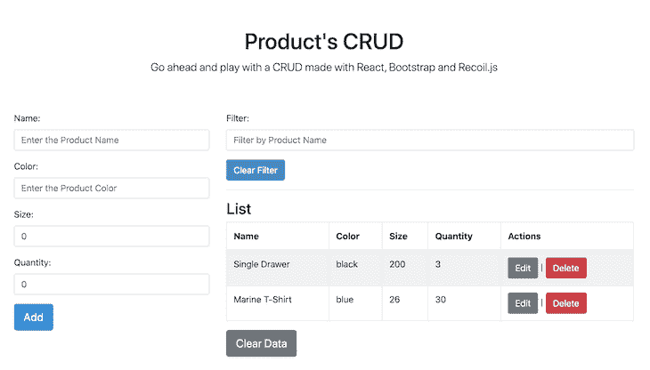

# 用脸书的反冲火箭博客创建你的第一个 CRUD

> 原文：<https://blog.logrocket.com/crud-with-facebook-recoil/>

到目前为止，Redux 一直是 React 应用状态管理的领导者。GitHub 上有超过 53K 颗星，它是成熟的、健壮的，并受到其社区的高度支持。

反冲是脸书团队解决同一问题的新赌注。在用反冲工作了一段时间后，我的一个主要感受是这种完全处于反应世界的感觉(并不奇怪)。学习曲线低于 Redux 和其他类似的 libs，可能是因为它的简单性质。

反冲是基于原子和选择器的。简而言之，原子是存储状态值的全局单元，而选择器是从全局存储中检索计算值的“getters”。

然而，我们的重点不是详细解释这个库。你可以在这里阅读——你应该这样做。

我们的目标是在实践中探索后坐力的一些主要特征。为此，让我们用 React、 [create-react-app](https://reactjs.org/docs/create-a-new-react-app.html) 、 [react-bootstrap](https://react-bootstrap.github.io/) (为了便于设计和填充)以及状态管理反冲来创建一个功能完整的产品 CRUD。

在文章的最后，这将是我们的 CRUD 应用程序:



所以，我们开门见山吧。

## 设置

首先，您应该检查您是否已经安装了 Node。在本教程中，我们将使用 Yarn 命令(可选)，所以最好[也安装](https://classic.yarnpkg.com/en/docs/install)。在这个例子中，我们还将使用 VS 代码作为 IDE。

通过命令行进入您选择的文件夹并运行:

```
npx create-react-app recoil-products-crud 
cd recoil-products-crud
```

遵循默认选项，直到结束。现在，让我们安装所需的依赖项。为此，运行以下命令:

```
yarn add recoil bootstrap react-bootstrap uuid
```

`uuid`模块将帮助我们为产品列表生成随机 id。

由于 Bootstrap 将负责页面元素的设计，让我们将它的 CSS 导入添加到`index.js`文件中，同时添加其余的初始反冲设置:

```
import React from "react";
import ReactDOM from "react-dom";
import App from "./App";
import { RecoilRoot } from "recoil";
import * as serviceWorker from "./serviceWorker";

import "bootstrap/dist/css/bootstrap.min.css";

ReactDOM.render(
    <React.StrictMode>
        <RecoilRoot>
            <App />
        </RecoilRoot>
    </React.StrictMode>,
    document.getElementById("root")
);

serviceWorker.unregister();
```

反应`App`必须始终被`RecoilRoot`标签包裹，以启用反冲功能。

项目的最终结构如下所示(请确保在您的项目中复制它):

```
recoil-products-crud
|----- src
        |----- components
      |----- AddProduct.js
      |----- ListProducts.js
      |----- FilterProduct.js
      |----- modals
          |----- EditModal.js
          |----- DeleteModal.js
        |----- store
      |----- atom.js
      |----- index.js
      |----- selector.js
|----- index.js
|----- App.js
|----- serviceWorker.js
```

## 反冲设置

我们的应用程序将提供四个默认的 CRUD 操作，加上按产品名称过滤结果的能力。这将允许我们探索一下选择器的特性。

因此，我们需要两个不同的原子:一个用来存储注册产品的原始列表，另一个用来在过滤操作发生后保存过滤列表的状态。

让我们从`atom.js`代码开始:

```
import { atom } from "recoil";

export const products = atom({
  key: "products",
  default: [],
});

export const filterProductsValue = atom({
  key: "filterProductsValue",
  default: "",
});
```

到目前为止非常简单。我们刚刚创建了两个需要的原子，每个原子都有一个惟一的键和默认值(现在都是空的)。

接下来，转到`selector.js`内容:

```
import { selector } from "recoil";
import { products, filterProductsValue } from ".";

export const filterProducts = selector({
  key: "filterProducts",
  get: ({ get }) => {
    const productsState = get(products);
    const filterProductsValueState = get(filterProductsValue);

    if (filterProductsValueState.length) {
      return productsState.filter(
        (item) => item.name.includes(filterProductsValueState.trim()) && item
      );
    }
    return products;
  },
});
```

这里，我们从反冲中导入`selector`函数。注意，选择器也需要一个唯一的键；他们是国家价值观的探寻者。`get`值接收过滤代码，在我们的例子中，过滤代码将首先恢复产品列表和输入的过滤文本，最后在前一个列表中执行搜索。

对于许多不同的搜索需求，可以创建许多新的选择器。如果您的选择器代码变得太大，您应该考虑将它们组织在不同的分类 JavaScript 文件中。

让我们用`index.js`的代码来结束这一部分:

```
export { products, filterProductsValue } from "./atom";
export { filterProducts } from "./selector";
```

在这里，我们只是将原子和选择器统一在一个地方。无论何时你需要它们，只需导入`store`。

## 组件

显然，没有 React 组件，我们的反冲代码无法单独工作。所以，让我们继续他们的建设。我们将从较低的组件(模态)到较高的组件这样做。

该示例将有两个模态:一个用于产品的编辑，另一个用于产品的删除。下面是`DeleteModal.js`文件的代码:

```
import React from "react";
import { Button, Modal } from "react-bootstrap";
import { useRecoilState } from "recoil";

import { products } from "../../store";

const DeleteModal = (props) => {
  const { show, id, handleClose } = props;

  const [productList, setProductList] = useRecoilState(products);
  const product = productList.length
    ? productList.find((item) => item.id === id)
    : null;
  const index = productList.findIndex((item) => item === product);

  const deleteProduct = () => {
    setProductList(removeProduct(productList, index));
    handleClose();
  };

  return (
    <>
      {product ? (
        <Modal show={show} onHide={handleClose}>
          <Modal.Header closeButton>
            <Modal.Title>Delete the Product</Modal.Title>
          </Modal.Header>
          <Modal.Body>Are you sure?</Modal.Body>
          <Modal.Footer>
            <Button variant="secondary" onClick={() => handleClose()}>
              Close
            </Button>
            <Button variant="primary" onClick={() => deleteProduct()}>
              Yes, Do it.
            </Button>
          </Modal.Footer>
        </Modal>
      ) : (
        ""
      )}
    </>
  );
};

function removeProduct(products, i) {
  return [...products.slice(0, i), ...products.slice(i + 1)];
}

export default DeleteModal;
```

这个模态接收两个属性作为道具:决定模态是否应该显示的布尔值和被选择进行编辑的用户的`id`。

注意`useRecoilState`功能的使用。它相当于 React 的`useState`，分别检索州的产品列表和它的 setter 函数。

之后，我们循环产品列表，根据在`props`中收到的 ID 以及在同一个数组中的`index`来查找产品。这些值将有助于其他功能。

`deleteProduct`函数只是在反冲状态下替换由`removeProduct`函数返回的更新列表。该函数又从数组中删除相应的乘积，给出作为参数传递的索引。

确保总是在通过`handleClose`功能完成目标后关闭模态。

现在，进入第二个模态，即`EditModal.js`:

```
import React, { useState } from "react";
import { Button, Form, Modal } from "react-bootstrap";
import { useRecoilState } from "recoil";
import { products } from "../../store";

const EditModal = (props) => {
  const { show, id, handleClose } = props;

  const [productList, setProductList] = useRecoilState(products);
  const product = productList.length
    ? productList.find((item) => item.id === id)
    : null;
  const index = productList.findIndex((item) => item === product);

  const [name, setName] = useState("");
  const [color, setColor] = useState("");
  const [size, setSize] = useState(0.0);
  const [quantity, setQuantity] = useState(0);

  const onChangeName = (e) => {
    setName(e.target.value);
  };

  const onChangeColor = (e) => {
    setColor(e.target.value);
  };

  const onChangeSize = (e) => {
    setSize(e.target.value);
  };

  const onChangeQuantity = (e) => {
    setQuantity(e.target.value);
  };

  const updateProduct = () => {
    const newList = replaceProduct(productList, index, {
      ...product,
      name: name,
      color: color,
      size: size,
      quantity: quantity,
    });

    setProductList(newList);
    handleClose();
  };

  return (
    <>
      {product ? (
        <Modal show={show} onHide={handleClose}>
          <Modal.Header closeButton>
            <Modal.Title>Edit the Product</Modal.Title>
          </Modal.Header>
          <Modal.Body>
            <Form>
              <Form.Group controlId="name">
                <Form.Label>Name</Form.Label>
                <Form.Control
                  type="text"
                  placeholder="Enter the Product Name"
                  defaultValue={product.name}
                  onChange={(e) => onChangeName(e)}
                />
              </Form.Group>

              <Form.Group controlId="color">
                <Form.Label>Color</Form.Label>
                <Form.Control
                  type="text"
                  placeholder="Enter the Product Color"
                  defaultValue={product.color}
                  onChange={(e) => onChangeColor(e)}
                />
              </Form.Group>

              <Form.Group controlId="size">
                <Form.Label>Size</Form.Label>
                <Form.Control
                  type="number"
                  placeholder="Enter the Product Size"
                  defaultValue={product.size}
                  onChange={(e) => onChangeSize(e)}
                />
              </Form.Group>

              <Form.Group controlId="quantity">
                <Form.Label>Quantity</Form.Label>
                <Form.Control
                  type="number"
                  placeholder="Enter the Product Quantity"
                  defaultValue={product.quantity}
                  onChange={(e) => onChangeQuantity(e)}
                />
              </Form.Group>
            </Form>
          </Modal.Body>
          <Modal.Footer>
            <Button variant="secondary" onClick={() => handleClose()}>
              Close
            </Button>
            <Button variant="primary" onClick={() => updateProduct()}>
              Save Changes
            </Button>
          </Modal.Footer>
        </Modal>
      ) : (
        ""
      )}
    </>
  );
};

function replaceProduct(products, i, newVal) {
  return [...products.slice(0, i), newVal, ...products.slice(i + 1)];
}

export default EditModal;
```

它的大部分内容与形式构成有关。我们的表单中有四个字段，每个字段都必须有一个本地状态表示(通过钩子)作为常量。这样，我们可以在将它们发送到反冲状态之前操纵它们的值。

每个字段还必须有其对应的`onChangeXX`函数，该函数会根据用户输入的内容来刷新它们的值。注意，我们还引用了同一个产品的列表、索引和 setter 函数，就像我们在另一个模型中所做的那样。

* * *

### 更多来自 LogRocket 的精彩文章:

* * *

`updateProduct`功能通过产生新列表(带有用户在模态字段中输入的更新值)并将其设置为反冲状态来起作用。对于这个任务，它使用了清单末尾的助手函数`replaceProduct`。

## 列出产品

我们的应用程序中的列表栏将负责显示模态，这些模态将依次被每个相应的动作按钮触发。

这是`ListProduct.js`文件的内容:

```
import React, { useState } from "react";
import { Table, Button } from "react-bootstrap";

import { useRecoilValue, useResetRecoilState } from "recoil";
import { filterProducts, filterProductsValue, products } from "../store";
import EditModal from "./modals/EditModal";
import DeleteModal from "./modals/DeleteModal";

const ListProducts = () => {
  const productsState = useRecoilValue(filterProducts);
  const resetList = useResetRecoilState(products);
  const resetfilterProductsValue = useResetRecoilState(filterProductsValue);

  // Modals
  const [showEdit, setShowEdit] = useState(false);
  const [showDelete, setShowDelete] = useState(false);
  const [userId4Actions, setUserId4Actions] = useState(0);

  const handleEditClose = () => setShowEdit(false);
  const handleEditShow = () => setShowEdit(true);

  const handleDeleteClose = () => setShowDelete(false);
  const handleDeleteShow = () => setShowDelete(true);

  const resetAtoms = () => {
    resetList();
    resetfilterProductsValue();
  };

  const editProduct = (id) => {
    handleEditShow();
    setUserId4Actions(id);
  };

  const deleteProduct = (id) => {
    handleDeleteShow();
    setUserId4Actions(id);
  };

  return (
    <>
      <h3>List</h3>

      <Table striped bordered hover responsive>
        <thead>
          <tr>
            <th>Name</th>
            <th>Color</th>
            <th>Size</th>
            <th>Quantity</th>
            <th>Actions</th>
          </tr>
        </thead>
        <tbody>
          {!productsState.length ? (
            <tr>
              <td colSpan="5" style={{ textAlign: "center" }}>
                No products here.
              </td>
            </tr>
          ) : (
            productsState.map((item, index) => (
              <tr key={item.id}>
                <td>{item.name}</td>
                <td>{item.color}</td>
                <td>{item.size}</td>
                <td>{item.quantity}</td>
                <td colSpan="2">
                  <Button
                    variant="secondary"
                    onClick={() => editProduct(item.id)}
                  >
                    Edit
                  </Button>{" "}
                  {" | "}
                  <Button
                    variant="danger"
                    onClick={() => deleteProduct(item.id)}
                  >
                    Delete
                  </Button>
                </td>
              </tr>
            ))
          )}
        </tbody>
      </Table>

      <Button variant="secondary" size="lg" onClick={() => resetAtoms()}>
        Clear Data
      </Button>

      <EditModal
        show={showEdit}
        id={userId4Actions}
        handleClose={handleEditClose}
      />

      <DeleteModal
        show={showDelete}
        id={userId4Actions}
        handleClose={handleDeleteClose}
      />
    </>
  );
};

export default ListProducts;
```

这里的主要目标是在一个引导表中展示产品列表。注意，这里我们通过`useRecoilValue`函数以不同的方式从反冲状态中恢复产品列表。它只返回存储区中的当前值，没有设置器。右下方的另外两个用于重置状态值。

接下来，我们有显示和隐藏模态的辅助常数。我们将在清单代码中管理这个功能，通过 props 传递各自的值。

然后，我们有三个主要功能:

1.  `resetAtoms`–顾名思义，它们利用反冲重置功能将列表和搜索文本重置为初始值
2.  `editProduct`–切换编辑模式并将当前用户的 ID 设置为本地状态
3.  `deleteProduct`–切换删除模式并将当前用户的 ID 设置为本地状态

在`render`函数中，注意我们还检查产品列表的存在，以便显示正确的消息。

## 添加表单

现在是实现`AddProduct`组件的时候了，该组件将向列表提供表单中的产品值。

以下是`AddProduct.js`文件的内容:

```
import React, { useState } from "react";
import { Button, Form } from "react-bootstrap";

import { useSetRecoilState } from "recoil";
import { v4 as uuid4 } from "uuid";
import { products } from "../store";

const AddProduct = () => {
  const [name, setName] = useState("");
  const [color, setColor] = useState("");
  const [size, setSize] = useState(0.0);
  const [quantity, setQuantity] = useState(0);
  const setProducts = useSetRecoilState(products);

  const onChangeName = (e) => {
    setName(e.target.value);
  };

  const onChangeColor = (e) => {
    setColor(e.target.value);
  };

  const onChangeSize = (e) => {
    setSize(e.target.value);
  };

  const onChangeQuantity = (e) => {
    setQuantity(e.target.value);
  };

  const addProduct = () => {
    setProducts((oldList) => [
      ...oldList,
      {
        id: uuid4(),
        name: name,
        color: color,
        size: size,
        quantity: quantity,
      },
    ]);

    resetForm();
  };

  const resetForm = () => {
    setName("");
    setColor("");
    setSize(0.0);
    setQuantity(0);
  };

  return (
    <Form>
      <Form.Group controlId="name">
        <Form.Label>Name:</Form.Label>
        <Form.Control
          type="text"
          value={name}
          placeholder="Enter the Product Name"
          onChange={(e) => onChangeName(e)}
        />
      </Form.Group>

      <Form.Group controlId="color">
        <Form.Label>Color:</Form.Label>
        <Form.Control
          type="text"
          value={color}
          placeholder="Enter the Product Color"
          onChange={(e) => onChangeColor(e)}
        />
      </Form.Group>

      <Form.Group controlId="size">
        <Form.Label>Size:</Form.Label>
        <Form.Control
          type="number"
          value={size}
          placeholder="Enter the Product Size"
          onChange={(e) => onChangeSize(e)}
        />
      </Form.Group>

      <Form.Group controlId="quantity">
        <Form.Label>Quantity:</Form.Label>
        <Form.Control
          type="number"
          value={quantity}
          placeholder="Enter the Product Quantity"
          onChange={(e) => onChangeQuantity(e)}
        />
      </Form.Group>

      <Button variant="primary" size="lg" onClick={() => addProduct()}>
        Add
      </Button>
    </Form>
  );
};

export default AddProduct;
```

创建表单与编辑模式非常相似，因为这里也有相同的字段。我们有相同的`onChange`函数，以及本地状态属性。

函数`addProduct`添加新产品，将更新后的数组设置为反冲状态，并重置表单。

到目前为止，根据前面组件的知识，这里没有太多要添加的。

## 过滤产品

过滤器组件也非常简单。它由一个收集过滤文本的文本字段和一个清除过滤文本的按钮组成。过滤将在对字段的任何改变下执行，而不是普通的按钮点击。

这是`FilterProducts.js`文件:

```
import React from "react";
import { useRecoilState } from "recoil";

import { filterProductsValue } from "../store";
import { Form, Button } from "react-bootstrap";

const FilterProducts = () => {
  const [filterProductsState, filterProducts] = useRecoilState(
    filterProductsValue
  );

  const filter = (event) => {
    const { value } = event.target;
    filterProducts(value);
  };

  const clearFilter = () => filterProducts("");

  return (
    <Form>
      <Form.Group controlId="name">
        <Form.Label>Filter:</Form.Label>
        <Form.Control
          type="text"
          placeholder="Filter by Product Name"
          value={filterProductsState}
          onChange={(e) => filter(e)}
        />
      </Form.Group>

      <Button variant="info" onClick={() => clearFilter()}>
        Clear Filter
      </Button>
    </Form>
  );
};

export default FilterProducts;
```

最后，我们只需要在应用程序的根文件`App.js`中组织组件。

将以下代码放入其中:

```
import React from "react";
import Container from "react-bootstrap/Container";
import { Row, Col } from "react-bootstrap";

import AddProduct from "./components/AddProduct";
import FilterProducts from "./components/FilterProducts";
import ListProducts from "./components/ListProducts";

function App() {
  return (
    <Container className="p-3">
      <div className="py-5 text-center">
        <h1>Product's CRUD</h1>
        <p className="lead">
          Go ahead and play with a CRUD made with React, Bootstrap and Recoil.js
        </p>
      </div>
      <Row>
        <Col>
          <AddProduct />
        </Col>
        <Col className="col-8">
          <FilterProducts />
          <hr />
          <ListProducts />
        </Col>
      </Row>
    </Container>
  );
}

export default App;
```

这里没什么特别的，只是普通的代码。您可以随意处理组件的配置，只需知道每个组件如何适应基于 react-bootstrap CSS 类的屏幕。

## 结论

就这样——现在是你试验这个例子的时候了。只需运行通常的`npm start`并检查在浏览器中运行的示例。

同样，反冲代码中 React 的味道对 lib 是一个很好的补充，尤其是如果你已经在使用 React 钩子的话。

事实上，别忘了查看一下官方文件。他们不仅会在现在，而且会在每一个主要版本发布后引导你了解这个库是如何运作的，以及你如何从中获得最大的利益。

你可以在我的 GitHub 中的这里找到这个例子的代码。

## 使用 LogRocket 消除传统反应错误报告的噪音

[LogRocket](https://lp.logrocket.com/blg/react-signup-issue-free)

是一款 React analytics 解决方案，可保护您免受数百个误报错误警报的影响，只针对少数真正重要的项目。LogRocket 告诉您 React 应用程序中实际影响用户的最具影响力的 bug 和 UX 问题。

[ ](https://lp.logrocket.com/blg/react-signup-general) [  ](https://lp.logrocket.com/blg/react-signup-general) [LogRocket](https://lp.logrocket.com/blg/react-signup-issue-free)

自动聚合客户端错误、反应错误边界、还原状态、缓慢的组件加载时间、JS 异常、前端性能指标和用户交互。然后，LogRocket 使用机器学习来通知您影响大多数用户的最具影响力的问题，并提供您修复它所需的上下文。

关注重要的 React bug—[今天就试试 LogRocket】。](https://lp.logrocket.com/blg/react-signup-issue-free)