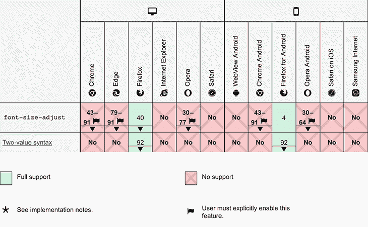
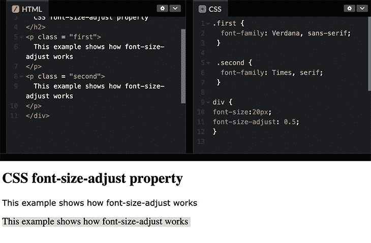
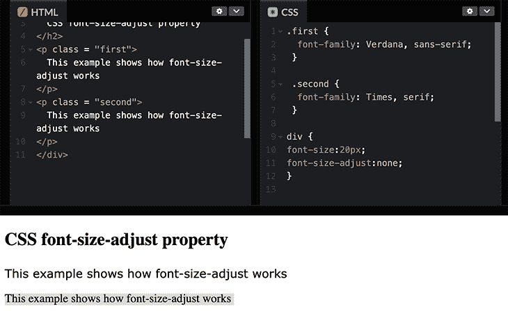

# CSS 字体大小调整:如何自动调整你的字体大小

> 原文：<https://blog.logrocket.com/css-font-size-adjust-how-to/>

在本文中，我们将看看字体大小调整属性如何帮助您自动调整字体大小。我们将讨论以下主题:

## CSS `font-size-adjust`如何工作

出于样式和可读性的目的，开发人员通常在单个网页上使用多种字体系列和字体大小。例如，开发人员可以使用 Open Sans 字体作为标题，使用 Roboto Mono 字体作为正文。


当一种字体无法访问时，浏览器会退回到所提供的第二种字体，这可能会导致字体大小的显著变化，进而影响 UI 的其他部分。为了更好地描述实现时的情况，请看下图。


Source: [quackit.com](https://www.quackit.com/pix/stock/css_font-size-adjust_example_1.gif)

这个例子比较了两种不同 x 高度的字体，并演示了如何使用`font-size-adjust`来调整一种字体的 x 高度以匹配另一种字体的 x 高度。尽管两个例子都使用了相同的两种字体，但是在第一行没有应用`font-size-adjust`的情况下，第一种字体中的所有小写字母都比第二种字体中的要高得多。

这就是`font-size-adjust`派上用场的地方——在第二行，属性调整第二种字体的字母大小，以匹配第一种字体的字母的 x 高度。

`font-size-adjust`很有用，因为它根据小写字母的大小而不是大写字母的大小来确定字体可读性，并将小写字母的大小调整为当前使用的字体的大小。

使用`font-size-adjust`属性可以让您对字体大小有更多的控制，从而有助于防止这种情况发生。然而，并不是所有的浏览器都支持所有的字体，使用不支持的字体可能会让你的网站看起来很奇怪，就像前面讨论的那样。让我们在下一节看看浏览器兼容性。

## `font-size-adjust`的浏览器兼容性

在我们进入细节之前，让我们回顾一下浏览器对`font-size-adjust`属性的支持。在撰写本文时，CSS `font-size-adjust`属性在默认情况下只受 Firefox 的[支持。](https://caniuse.com/?search=font-size-adjust%20css)

Chrome 和 Opera 在“实验性网络平台功能”标志背后支持这一属性，该标志可能在`chrome:/flags`中被激活，范围从版本 43 到 30。Edge 或 Safari 目前不支持 CSS `font-size-adjust`属性。



Source: [MDN Docs](https://developer.mozilla.org/en-US/docs/Web/CSS/font-size-adjust#browser_compatibility)

来源: [MDN 文档](https://developer.mozilla.org/en-US/docs/Web/CSS/font-size-adjust#browser_compatibility)

现在，在深入研究 CSS `font-size-adjust`属性之前，让我们更广泛地简要了解一下 CSS `font-size`属性。

## CSS `font-size`属性

CSS 属性设置字体的整体大小。关于`font-size`属性，有一些关键的事情需要注意:

*   当`font-size`属性在`em`中设置为固定值时，根据父元素的字体大小计算大小
*   如果`em`中有其他元素，改变一个元素的字体大小可能会影响其他元素的字体大小
*   当字体大小以百分比形式提供时，它是相对于父元素的字体大小来计算的

下面是一个`font-size`语法的例子:

```
/ absolute-size /
font-size: medium | xx-small | x-small | small | large | x-large | xx-large; ​​

/ relative-size /
font-size: smaller | larger;

/ percentage /
font-size: 10%;

​​/ length /
font-size: 5px;

```

## CSS `font-size-adjust`属性

正如我们之前提到的， [CSS 属性 docs 指定](https://developer.mozilla.org/en-US/docs/Web/CSS/font-size-adjust)元素的字体大小应该根据小写字母的高度来调整，而不是大写字母的高度。

当无法访问主要字体类型时，CSS `font-size-adjust`属性允许开发人员在组件级别控制字体大小。在这种情况下，会引用字体备份，浏览器会切换到显示辅助字体。

但是如果期望的原始字体和当前字体的纵横比有变化，这可能会导致易读性和可访问性的问题。CSS `font-size-adjust`属性可能用在我们需要保持文本的易读性同时保持其美感的情况下。

`font-size-adjust`语法如下:

```
number | none | initial | inherit;

```

*   `Number`: `font-size-adjust`属性被设置为一个数字
*   `None`:这是默认值
*   `Initial`:将该属性的值设置为默认值
*   `Inherit`:`font-size-adjust`属性由父代传递给子代

让我们看一个例子。假设`font-size-adjust`属性接收到一个值`0.5`，该值将返回小写字母给定字体大小的一半。

参见 [CodePen](https://codepen.io) 上 ade kanye Oluwatomiyin([@ ade tomi](https://codepen.io/Adetomi))
的 Pen [font-size-adjust](https://codepen.io/Adetomi/pen/ZEpGYpo) 。

我们也可以将这个属性设置为一个数字，并乘以`font-size`属性，使其与不支持`font-size-adjust`的浏览器兼容。这是另一个例子:

```
font-size: 20px;
font-size-adjust: 0.5;

```



这将字体小写字母的 x 高度设置为`20 * 0.5`，等于`10px`。

在不支持`font-size-adjust`的浏览器中，使用该方法时仍会执行 20px 字体。

根据上面的图片，这两种字体之间的差异不是很明显。然而，如果您使用`none`，预定义的字体及其给定的大小:

```
font-size-adjust: none

```



你可以更清楚的看到这两种字体有明显的区别。两个句子的大小都基于字体大小属性，使用预定义的字体大小。

## 结论

现在，您应该对 CSS `font-size-adjust`属性的作用、它的重要性以及如何将它包含在您的 CSS 样式中有了更好的理解。

为了提高可读性和美观性，您可以在 web 应用程序中开始使用该属性。考虑到它只被一种浏览器支持，为了避免由于浏览器不兼容而导致的大小差异，选择具有相近比例的字体可能仍然是一种最佳实践。

谢谢，造型愉快。

## 你的前端是否占用了用户的 CPU？

随着 web 前端变得越来越复杂，资源贪婪的特性对浏览器的要求越来越高。如果您对监控和跟踪生产环境中所有用户的客户端 CPU 使用、内存使用等感兴趣，

[try LogRocket](https://lp.logrocket.com/blg/css-signup)

.

[](https://lp.logrocket.com/blg/css-signup)[https://logrocket.com/signup/](https://lp.logrocket.com/blg/css-signup)

LogRocket 就像是网络和移动应用的 DVR，记录你的网络应用或网站上发生的一切。您可以汇总和报告关键的前端性能指标，重放用户会话和应用程序状态，记录网络请求，并自动显示所有错误，而不是猜测问题发生的原因。

现代化您调试 web 和移动应用的方式— [开始免费监控](https://lp.logrocket.com/blg/css-signup)。