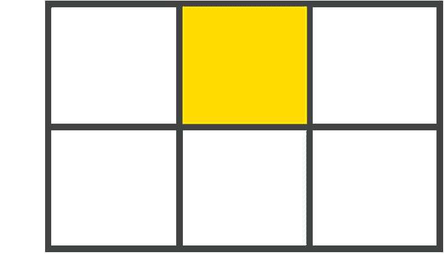
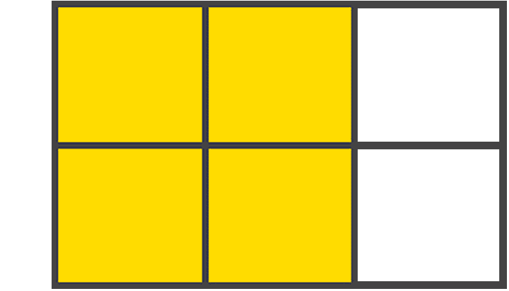
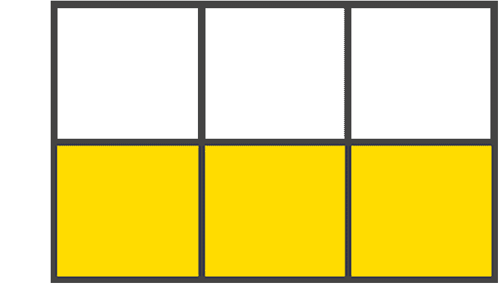
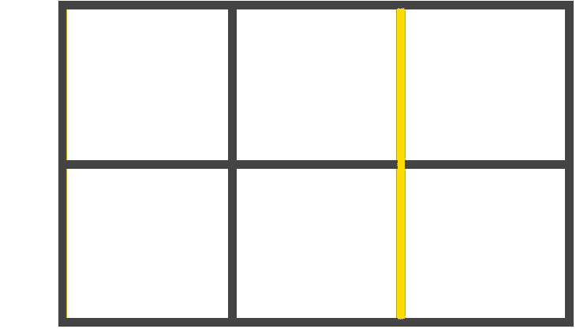
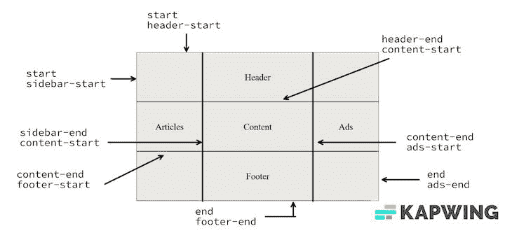
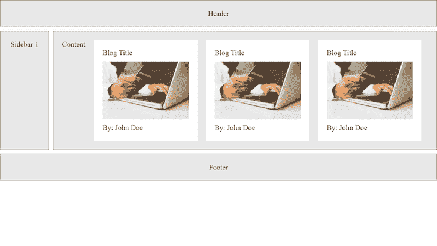
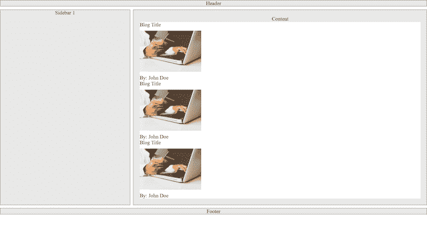

# CSS 网格:入门指南

> 原文：<https://blog.logrocket.com/css-grid-guide/>

***编者按:*** *这份 CSS 网格指南最近一次更新是在 2023 年 1 月 10 日，它包含了更多关于 [CSS 网格和 CSS flexbox](https://blog.logrocket.com/css-flexbox-vs-css-grid/) 之间的差异的信息，交互式代码示例，以及关于何时使用 CSS 网格的更深入的定义。查看我们的 [CSS 档案库](https://blog.logrocket.com/tag/css/)，了解更多关于 CSS 的功能。*

网络是基于布局的，由布局组成。您希望您的 web 应用程序在不同平台和设备(移动设备、平板电脑、笔记本电脑和台式机)上的外观在很大程度上取决于布局结构。

例如，我们已经开始接受一种响应迅速、移动优先的设计。这是因为大多数人通过手机上网。

为了最初实现这种布局，开发人员不得不依赖于 web 应用的 CSS 代码，如`tables`、`floats`、`positioning`和`inline-blocks`。然后，CSS 网格布局被引入，以帮助开发人员创建更好的布局，尤其是避免使用`floats`和`tables`。CSS 网格还有什么？它支持所有不同的浏览器。

有了 CSS grid，我们可以无缝地创建惊人的布局和响应性网页。CSS 网格布局系统的强大之处就在于此:能够使用它为移动优先的 web 应用程序和跨不同浏览器的响应网站设计布局。本文将深入探讨 CSS grid，并向您展示如何开始使用它。

*向前跳转:*

## CSS 网格是用来做什么的？

CSS grid 用于创建二维布局。它不同于 CSS flexbox，后者只能创建一维布局，主要是为对齐而创建的。作为一个二维布局系统，意味着 CSS grid 允许我们同时使用列和行来构建[复杂且响应迅速的布局](https://blog.logrocket.com/how-to-use-css-grid-to-build-a-responsive-web-layout/)。CSS grid 的出现意味着我们不再需要部署像`positioning`和`floats`这样的黑客。

当我们需要考虑不同元素的位置、大小和层次，以及它们如何在打开网页时相互关联时，CSS grid 是一个很好的工具。这也使得快速[为网站创建不同类型的布局](https://blog.logrocket.com/full-bleed-layout-css-grid/)变得容易。

### CSS 网格与 CSS flexbox:你应该使用哪一个？

和所有的网络和软件开发一样，这个问题的答案是:视情况而定。虽然 [CSS grid 和 CSS flexbox](https://blog.logrocket.com/css-flexbox-vs-css-grid/) 都不是万能的解决方案，但在某些情况下，CSS grid 作为合适且更好的工具大放异彩。

对于由不同大小的元素组成的网站来说，需要[复杂的布局](https://gridbyexample.com/patterns/)像[砖石布局](https://developer.mozilla.org/en-US/docs/Web/CSS/CSS_Grid_Layout/Masonry_Layout)，CSS grid 是你最好的选择。虽然您可以实现 flexbox hacks 来实现这些布局，但这些 hacks 通常很复杂，需要较长的代码行，因为您没有使用正确的工具来完成工作。

如果您希望对页面上每个单独元素的位置进行细粒度控制，CSS grid 是一个很好的工具。CSS 网格的`grid-template-areas`、网格线和网格跨越特性使这成为可能。虽然我们也可以用 flexbox 实现这种细粒度的控制，但它通常需要更多的代码行，随着时间的推移，维护和管理起来会很棘手，而且难以处理大量的 CSS 文件。

最后，如果您希望更灵活地移动元素，而不考虑 HTML 标记的结构，CSS grid 应该是您的首选。

## CSS 网格的基本原则

在最基本的层面上，CSS 网格是 web 的二维布局系统。使用 CSS grid，您可以在[行和](https://blog.logrocket.com/understanding-grid-template-columns-css/)列中布置内容。

在深入探讨之前，我们先来看看 CSS grid 的构建模块——`display: grid;`容器。

首先，让我们创建我们想要用 CSS 网格样式化的 [HTML 元素](https://blog.logrocket.com/deprecated-html-elements-and-what-to-use-instead/):

```
<body class="container">
    <div class="item box1"><p>One</p></div>
    <div class="item box2"><p>Two</p></div>
    <div class="item box3"><p>Three</p></div>
</body>

```

接下来，我们通过将`display`设置为`grid`来定义网格布局:

```
// define or create a grid 
.container{
    display: grid;
}

```

## CSS 网格术语

一旦你的`grid`被定义，你就处于一个良好的开端。然而，这还没有产生任何神奇的效果。我们需要告诉`grid`列和行应该有多大。为了更好地了解细节，让我们来讨论 CSS 网格的术语:

*   网格容器:定义了`grid display`的父容器
*   网格项目:你的`grid`容器的直接子容器
*   间隙:用于创建行和列之间的间距
*   网格单元:两个相邻行和两个相邻列`grid`行之间的空间。是`grid`的一个单体。下面的图片解释了网格单元:



*   网格区域:一个或多个网格单元在网格上构成一个矩形区域。网格区域本质上必须是矩形的。这里有一个例子:



*   网格轨迹:轨迹是两个相邻网格线之间的空间，本质上是开始和停止行或列的线，因此您总是会比现有的列数和行数多一个。请查看以下内容:



*   网格线:这些是在定义网格显示时创建的分隔线:



### 隐式和显式网格线

隐式网格线在您的开发工具中显示为虚线，由浏览器创建，无需显式定义列或行。

让我们使用这个代码片段来解释隐式网格线:

```
.container{
    display: grid;
    grid-template-columns: 100px 100px 100px;
}

```

在上面的代码片段中，我们明确定义了列的内容。我们不定义行。因此，浏览器将决定如何处理显式定义中没有包含的额外项目。它通过创建新的行并将这些额外的项移动到这些行中来实现这一点。而且那是隐性的！

显式网格线是在开发工具中可见的实线，用于 CSS 中定义的行和列。显式场景不是由浏览器做出的决定；它们是你做的决定，很明确。

这里有一个互动的例子:

参见 [CodePen](https://codepen.io) 上 Emadamerho Nefe([@ Nefe James](https://codepen.io/nefejames))
的 Pen [CSS Grid-gap](https://codepen.io/nefejames/pen/abjdyRx)。

## 使用檐槽分隔网格单元

檐槽是网格单元之间的空间。您可以使用 [`gap`速记属性](https://developer.mozilla.org/en-US/docs/Web/CSS/gap)创建一个装订线，或者您可以使用`column-gap`和`row-gap`显式地创建装订线。如果您使用`gap`速记属性来创建装订线，那么您分配给`gap`的值将指向网格的`row`和`column`。

要使用`gap`为网格提供檐槽，您将在父`container`中定义该属性:

```
// using gap to create gutter of 20px row and column
.container {
    gap: 20px; /* row and column gap */
}

// this can also be written as
.container {
    column-gap: 20px; 
    row-gap: 20px;
}

```

参见 [CodePen](https://codepen.io) 上 Emadamerho Nefe([@ Nefe James](https://codepen.io/nefejames))
的 Pen [CSS Grid-with gap](https://codepen.io/nefejames/pen/Yzjwxdy)。

分数单位

### `fr`值，也称为分数单位，解决了在元素之间自动分配自由空间的问题，并取代了对百分比的需要。

让我们更新示例的 CSS 文件，从像素切换到`fr`:

请注意网格中子元素的宽度如何自动增加，以填充父网格中的可用空间:

```
.container {
  display: grid;
  gap: 10px;
  grid-template-columns: 1fr 1fr 1fr;
}

```

参见 [CodePen](https://codepen.io) 上 Emadamerho Nefe([@ Nefe James](https://codepen.io/nefejames))
的 Pen [CSS Grid–1fr](https://codepen.io/nefejames/pen/bGjEarg)。

See the Pen [CSS Grid – 1fr](https://codepen.io/nefejames/pen/bGjEarg) by Emadamerho Nefe ([@nefejames](https://codepen.io/nefejames))
on [CodePen](https://codepen.io).

创建 CSS 网格容器、列和行

## 因为在您真正定义行和列之前什么都不会发生，所以我们现在应该学习创建它们。有各种方法来定义每一个，所以让我们从学习如何创建列开始。

创建列和列跨越

## 在`parent-container`中创建 [`grid-template-columns`属性](https://developer.mozilla.org/en-US/docs/Web/CSS/grid-template-columns)，其中传递的每个值代表显式列的数量。例如:

上面的例子告诉浏览器创建三列。第一列`20px`宽，第二列`1fr`，第三列`40px`。您还可以将函数和关键字作为值传递，我们将在本文的后面讨论这一点。

```
.parent-container {
  grid-template-columns: 20px 1fr 40px;
}

```

通过定义`column start`和`column end`位置，被称为[跨越](https://developer.mozilla.org/en-US/docs/Web/CSS/grid-column)的技术允许子项跨越`grid`中的列，如下所示:

上面的代码片段定义了每一列的开始和结束位置。但是，您也可以在两个值之间包含一条斜线。

```
.container{
  display: grid;
  grid-template-columns: 1fr 1fr 1fr 1fr 1fr;
}

.child-item:nth-child(1) {
  grid-column: span 2; /* span 2 columns */
}

.child-item:nth-child(2) {
  grid-column: span 3
}

```

您也可以使用下面的代码获得同样的结果。这里的区别在于，`/`之前的第一个值将指向列的开始行，而第二个值将指向`grid`的结尾:

上面的代码告诉浏览器将我的`grid`项扩展两列，并在第五列结束。这代表了`column-start` / `column-end`位置，但是注意我们没有告诉浏览器从哪里开始列；我们只说在哪里结束。

```
.child-item:nth-child(1) {
  grid-column: span 2 / 5;
}

```

这是浏览器要解决的问题。它自动理解我们想要跨越两列并结束第五列的网格线，因此它计算出该项目将从第二列的网格线的末端开始。

如果我们想告诉浏览器从哪里开始一个`child-item`，我们应该删除`span`关键字:

该代码片段告诉浏览器从列`2`开始我的项目，到列`5`结束。这里有一个例子:

```
.child-item {
  grid-column: 2 / 5;
}

```

参见 [CodePen](https://codepen.io) 上 Emadamerho Nefe([@ Nefe James](https://codepen.io/nefejames))
的 Pen [CSS Grid-Grid column span](https://codepen.io/nefejames/pen/ZEjQvzJ)。

横跨整个宽度

您将经常使用这个偷偷摸摸的`-1`值来跨越整个网格容器，这都是因为您的网格比定义的列/行数多一个。这真的与曲目有关。这条赛道正式结束于你的网格容器的末端:

### 此示例从第一列开始，跨越定义的网格的整个宽度，而不考虑 CSS 中定义的列数。很酷，对吧？是啊，的确是！请查看以下内容:

参见 [CodePen](https://codepen.io) 上 Emadamerho Nefe([@ Nefe James](https://codepen.io/nefejames))
的 Pen [CSS 网格-全角-1](https://codepen.io/nefejames/pen/VwBeyzo) 。

```
.child-item {
  grid-column: 1 / -1;
}

```

创建和跨越行

网格行就像列一样，只是它们是水平的，而不是垂直的。该属性的写法与我们的列完全相同，只是我们使用了单词`rows`。这是如何用 CSS 编写的:

上面的例子定义了四个显式的`rows`，每个都是`1fr`高。如果有任何孩子使用新的`row`，那么你的隐式`rows`将被创建。

### 使用 [`grid-row`速记属性](https://developer.mozilla.org/en-US/docs/Web/CSS/grid-row)，我们有同样的机会跨行，就像我们可以跨列一样，就像这样:

参见 [CodePen](https://codepen.io) 上 Emadamerho Nefe([@ Nefe James](https://codepen.io/nefejames))
的 Pen [CSS Grid-Grid 模板行](https://codepen.io/nefejames/pen/qBybpdJ)。

```
.parent-container {
  grid-template-rows: 1fr 1fr 1fr 1fr 1fr;
}

```

The above example defines four explicit `rows`, each of which is `1fr` high. If any children wrap to a new `row`, that’s when your implicit `rows` will be created.

创建行和列的一种更简单的方法

```
.item:nth-child(1){
  grid-row: span 2
}

.item:nth-child(2){
  grid-row: span 3
}

```

[`grid-template()`简写](https://developer.mozilla.org/en-US/docs/Web/CSS/grid-template)允许您在一行中定义行和列的开始和结束位置，并且比我们之前讨论的`grid`属性更易于阅读。我个人很喜欢这个简写。对我来说很有意义。

这里有一个例子:

## 上面给我们提供的人手是`[grid-template-rows](https://blog.logrocket.com/15-ways-implement-vertical-alignment-css/#explicit-grid-row-placement:~:text=13.%20Explicit%20grid%20row%20placement)`和`[grid-template-columns](https://blog.logrocket.com/understanding-grid-template-columns-css/)`，但是我们也要考虑`grid-template-areas`——稍后会详细介绍。

第一个值是开始位置，第二个值是结束位置，后面跟着重复这个模式的斜杠`/`。你可以这样想:`/`前面的部分是你的行，`/`后面的部分是你的列:

参见 [CodePen](https://codepen.io) 上 Emadamerho Nefe([@ Nefe James](https://codepen.io/nefejames))
的 Pen [CSS Grid-Grid-template](https://codepen.io/nefejames/pen/ZEjQJrR)。

```
.parent-container {
  grid-template: 1fr 1fr / 100px 100px 100px;
}

```

The shorthands we’re provided with above are `[grid-template-rows](https://blog.logrocket.com/15-ways-implement-vertical-alignment-css/#explicit-grid-row-placement:~:text=13.%20Explicit%20grid%20row%20placement)` and `[grid-template-columns](https://blog.logrocket.com/understanding-grid-template-columns-css/)`, but we also have `grid-template-areas` to consider, too — more on that shortly.

控制列和行溢出

当那个讨厌的 [`overflow`](https://developer.mozilla.org/en-US/docs/Web/CSS/grid-auto-flow) 在你的格子里徘徊时，你能做什么？你把你的电脑扔出窗外，对吗？不对！您可以使用一些精心放置的列和行溢出属性，在一个快速的操作中控制网格的溢出。让我们从研究列溢出开始。

列溢出

## 属性将帮助处理您的溢出需求。它在`parent-container`上定义，并以如下方式书写:

上面的代码片段暗示，当创建隐式网格时，`column`的大小应该占据`parent-container`的两个小数单位:

### 上面代码的结果告诉溢出创建大小为`150px`的列，这意味着隐式的`overflow`将以`columns`的形式出现，而不是`rows`:

参见 [CodePen](https://codepen.io) 上的 Pen [CSS Grid-auto column overflow](https://codepen.io/nefejames/pen/dyjGJVB)作者 Emadamerho Nefe([@ Nefe James](https://codepen.io/nefejames))
。

```
.parent-container {
    grid-auto-columns: 50px;
}

```

行溢出

```
.parent-container {
    grid-auto-columns: 50px; /* overflow size */
    grid-auto-flow: column; /* overflow type */
}

```

这个属性的工作方式和我们的`column overflow`属性完全一样，编写方式也一样——bonus！

就像我们用于列的属性一样，我们通过将值`row`传递给`grid-auto-flow`来指定隐式行的大小。我们得到的是`overflow`出现时产生的`rows`:

使用上面的代码行，我们为`grid`容器的子元素定义了隐式溢出的溢出类型(`rows`)和溢出大小(`150px`):

### 参见 [CodePen](https://codepen.io) 上 Emadamerho Nefe([@ Nefe James](https://codepen.io/nefejames))
的 Pen [CSS 网格-自动行溢出](https://codepen.io/nefejames/pen/xxJZppM)。

构建网格模板

```
.parent-container {
    grid-auto-rows: 150px;
}

```

当你不知道前期需要多少列时，网格模板很好用。它们也很适合与[媒体查询](https://blog.logrocket.com/choose-between-media-container-queries/)一起使用，以实现一些重新排列的魔法。下面是编写该属性的方法:

```
.parent-container {
    grid-auto-rows: 150px;
    grid-auto-flow: row;
}

```

使用一组包含您选择的单词的引号，例如`"sidebar1 content sidebar2"`，我们开始定义我们的`grid areas`。您也可以定义多个区域。例如:

这个属性减轻了对行号的担心，每个使用的行号都将被相应地定位。通过在您选择的子项上定义属性来设置位置:

使用`grid-area`，我们将相应的面积作为一个值传递。不多不少；就这么简单。这里有一个例子:

## 参见 [CodePen](https://codepen.io) 上 Emadamerho Nefe([@ Nefe James](https://codepen.io/nefejames))
的 Pen [CSS Grid-Grid 模板区域](https://codepen.io/nefejames/pen/ZEjQrgG)。

命名网格线

```
.parent-container {
    grid-template-areas: "sidebar1 content sidebar2";
}

```

CSS grid 的这个特性，[名为 grid lines](https://developer.mozilla.org/en-US/docs/Web/CSS/CSS_Grid_Layout/Layout_using_Named_Grid_Lines) ，如果你想明确地指导你的布局行为，可能会很有用。您可以在网格上命名位置，而不是使用未命名的数值:

```
.container {
  display: grid;
  gap: 10px;
  grid-template:
    "header header header" auto
    "sidebar1 content sidebar2" 1fr
    "footer footer footer" auto
}

```



```
.header{
  grid-area: header;
}

.sidebar1{
  grid-area: sidebar1;
}

.content{
    grid-area: content;
}

.sidebar2{
  grid-area: sidebar2;
}

.footer{
    grid-area: footer;
}

```

让我们看看这是如何工作的。首先，HTML:

然后，CSS:

该区域的名称后跟大小(`constraint`)。为了定义位置，我们转向 children，在那里我们将根据上面的命名区域定义值:

## 参见 [CodePen](https://codepen.io) 上的 Pen [CSS Grid:由 Emadamerho Nefe(](https://codepen.io/nefejames/pen/rNreWWR)[@ Nefe James](https://codepen.io/nefejames))
命名的网格线。

对 CSS 网格使用函数

这些得心应手的小恶魔是你网格欲望的帮手。他们是帮助您的代码编写生活变得更简单、更高效的超级明星。先说我最喜欢的一个:`repeat()`。

`repeat()`

```
  <body>
    <div class="container">
      <div class="item header">Header</div>
      <div class="item content">Content</div>
      <div class="item articles">Articles</div>
      <div class="item footer">Footer</div>
      <div class="item ads">Ads</div>
    </div>
  </body>

```

[`repeat()`函数](https://developer.mozilla.org/en-US/docs/Web/CSS/repeat())允许简洁地编写循环模式——在 CSS 网格中你会经常用到。我们定义了我们需要多少行或多少列，后跟一个约束，但是您也可以传递其他函数或关键字作为参数。参见下面的代码:

```
.container {
  display: grid;
  grid-template-columns: [start sidebar-start] 3fr [sidebar-end content-start] 5fr [content-end ads-start] 3fr [end ads-end];
  grid-template-rows: [start header-start] auto [header-end content-start] auto [content-end footer-start] auto [end footer-end];
}

```

见笔 [CSS 网格——在](https://codepen.io/nefejames/pen/rNrxpdZ) [CodePen](https://codepen.io) 上重复第一个例子由 Emadamerho Nefe([@ Nefe James](https://codepen.io/nefejames))
。

```
.header {
  grid-column: start / end;
  grid-row: start / header-end;
}
.articles {
  grid-column: start / sidebar-end;
  grid-row: header-end / footer-start;
}
.content {
  grid-column: content-start / content-end;
  grid-row: content-start / content-end;
}
.footer {
  grid-column: start / end;
  grid-row: footer-start / footer-end;
}
.ads {
  grid-column: ads-start / end;
  grid-row: header-end / footer-start;
}

```

See the Pen [CSS Grid: named grid lines](https://codepen.io/nefejames/pen/rNreWWR) by Emadamerho Nefe ([@nefejames](https://codepen.io/nefejames))
on [CodePen](https://codepen.io).

下面是一个使用 [`repeat()`](https://blog.logrocket.com/what-are-container-queries-in-css/#:~:text=the%20resulting%20code%3A-,Container%20queries%20with%20CSS%20grid,-Just%20like%20with) 创建四列`1fr`宽的示例，但是您也可以创建重复的模式:

## 在本例中，该模式重复了两次。第一列为`50px`宽，下一列为`1fr`。该模式再次重复，并以设置为`2fr`的最后一列结束:

见笔 [CSS 网格——在](https://codepen.io/nefejames/pen/MWBKrGG) [CodePen](https://codepen.io) 上重复第二个例子作者 Emadamerho Nefe([@ Nefe James](https://codepen.io/nefejames))
。

### 适合内容()

[`fit-content()`属性](https://developer.mozilla.org/en-US/docs/Web/CSS/fit-content)做一件事:将一个值箝位到传递的给定大小:

```
.parent-container {
    grid-template-columns: repeat(2, 1fr);
}

```

你通常会和`grid-template-columns`和`grid-template-row`一起使用。例如:

这创建了三列，最大宽度分别为`200px`和`400px`，以及`1fr`。您也可以把它看作是为网格列和行定义一个`max-width`的另一种方式。这是另一个例子:

参见 [CodePen](https://codepen.io) 上 Emadamerho Nefe([@ Nefe James](https://codepen.io/nefejames))
的 Pen [CSS Grid-fit-content()](https://codepen.io/nefejames/pen/RwBrxer)。

```
.parent-container {
    grid-template-columns: repeat(2, 50px 1fr) 2fr;
}

```

`minmax()`

[`minmax()`函数](https://developer.mozilla.org/en-US/docs/Web/CSS/minmax)定义了一组值之间的范围，该范围的功能是——你猜对了——最小和最大约束——编写它是一件轻而易举的事:

当内容超出列边界时，可以在`repeat()`中使用该函数。例如:

### 如果您想让您的孩子像冠军一样包装，这是一个不错的选择——尤其是在动态添加更多元素时:

参见 [CodePen](https://codepen.io) 上 Emadamerho Nefe([@ Nefe James](https://codepen.io/nefejames))
的 Pen [CSS Grid–minmax()](https://codepen.io/nefejames/pen/MWBKrZB)。

```
fit-content(100px)
```

关键词

```
.parent-container {
    grid-template-columns: fit-content(200px) fit-content(400px) 1fr;
}

```

关键词对你的武器库来说非常有价值，所以你会想要熟悉它们。让我们从你最有可能使用的和最容易混淆的开始:`auto-fit`和`auto-fill`。

`auto-fill` / `auto-fit`

`auto-fill`关键字在显式网格线上结束网格，并填充所有可用空间。它还会拉伸网格轨迹内的项目以适应。当与`minmax()`结合使用时，这使得它成为包装元素的一种有价值的方法。

### 关键字`auto-fit`在明确的列行结束网格。这与`auto-fill`的做法相反，因为它扩展了显式网格。

您可以在`repeat()`函数中使用这个关键字。例如:

```
minmax(20px, 100px)
```

因为上面没有明确说明需要多少列，所以将添加额外的隐式网格或列。这相当于告诉浏览器自己去想办法。它将网格分割成尽可能多的空间，填满可用空间。你可以[阅读更多关于`auto-fill`和`auto-fit`](https://blog.logrocket.com/flexible-layouts-without-media-queries/) 的内容，进一步了解这些关键词。

```
.parent-container {
    grid-template-columns: repeat(3, minmax(150px, 1fr))
}

```

使用值`dense`将使网格自动填充网格容器中的空间。这也将有助于为以后可能出现的其他较小的网格项目创造空间。

当以这种方式使用时，`grid-auto-flow: dense`将放置项目而不创建剩余区域，并在其他合适的地方摆动。换句话说，它可以将物品打包，而不会留下未使用的空间。如下图所示:

如果你不在乎顺序，只想填满所有的空间，这是一个很好的选择。

## CSS 网格中的对齐

众所周知，CSS flexbox 使项目对齐变得很容易，但是你也可以用 CSS grid 做到这一点。flexbox 中可用的相同属性也可用于 grid，例如:

### `align-items`

`align-self`

`justify-self`

`justify-items`

```
repeat(auto-fill, 150px)

```

`justify-content`

将`justify`视为沿着行轴(从左到右),将`align`视为沿着列轴(从上到下)。

还有一个强大的属性叫做 [`place-items`](https://developer.mozilla.org/en-US/docs/Web/CSS/place-items) ，它可以将项目水平或垂直对齐在一行中:

```
grid-auto-flow: column dense;
grid-auto-flow: dense;

```

通常，这些对齐属性在父容器上定义，但也可以在子容器上覆盖。这是另一个例子:

## 见 [CSS 网格-放置物品](https://codepen.io/nefejames/pen/OJwMzGm)由 Emadamerho Nefe([@ Nefe James](https://codepen.io/nefejames))
在 [CodePen](https://codepen.io) 上。

法庭秩序！

*   CSS grid 有一个`order`属性[，它的工作方式和 flexbox 的](https://blog.logrocket.com/flexbox-vs-css-grid/)完全一样，用来控制项目的排列。它是以同样的方式写的:
*   然后，在您的 CSS 中:
*   由于`grid`项的源顺序没有相关性，这使得重新排列变得非常容易，尤其是在媒体查询时。查看以下更多内容:
*   参见 [CodePen](https://codepen.io) 上的 Pen [CSS Grid-order](https://codepen.io/nefejames/pen/bGjELbY)by Emadamerho Nefe([@ Nefe James](https://codepen.io/nefejames))
    。
*   `justify-content`

通过 CSS flexbox 使用 CSS 网格

在本文前面，我们看到了 CSS grid 与 CSS flexbox 的不同之处，以及 grid 如何创建二维布局，而 flexbox 用于一维布局和对齐。尽管它们的用例和应用程序不同，我们可以将 grid 和 flexbox 结合起来，以获得两个世界的优势。

```
place-items: x | y;
place-items: center center

```

例如，让我们看一个基本的博客页面场景。这是我们将构建的演示的屏幕截图:



## 上图显示了一个基本布局，带有一个`header`、`sidebar`、`footer`和一些`images`。

`header`、`sidebar`、`footer`和`content`部分的布局是用 CSS grid 实现的，而`blog cards`及其在`content`部分的排列是用 CSS flexbox 创建的。

```
<body class="container">
    <div class="item content"><p>Content</p></div>
    <div class="item sidebar"><p>Sidebar</p></div>
</body>

```

让我们看看这在实践中是如何工作的，从 HTML 标记开始:

```
.container {
    display: grid;
}

.sidebar{
  order: 1;
}

.content{
  order: 2;
}

```

接下来，`grid`布局:

然后，我们用 flexbox 创建了`blog card`样式:

将`flex-direction`设置为`column`可确保卡片中的图像和文本相互堆叠，而`flex-start`对齐可确保所有内容都向左对齐。

## 最后，我们需要设置`flexbox styles`，它将定义`blog cards`如何在`content`部分中排列。这很重要，因为 div 的默认行为是它们[堆叠在彼此](https://blog.logrocket.com/best-practices-stacking-elements-css/)之上，因为它们是块元素。在这个演示中，我们希望这些卡片在大屏幕设备上并排放置，并在移动设备上堆叠起来:



因为`blog cards`都在`content`部分中，我们将把`.content` div 作为目标，并在那里应用`styles`:

在 mobile 上设置`flex-direction`到`column`可以确保卡片自动堆叠，对于大屏幕设备，我们将其设置为`row`。

这个演示让我们了解了 CSS grid 和 flexbox 是如何很好地互补的。我们还看到，网格子节点可以是 flexbox 父节点，也可以是网格父节点。这是我们的最终产品:

参见 [CodePen](https://codepen.io) 上 Emadamerho Nefe([@ Nefe James](https://codepen.io/nefejames))
的 Pen [CSS Grid-flexbox+Grid](https://codepen.io/nefejames/pen/WNKweEy)。

结论

你成功了！我们正处于学习帮助创建这个被称为 CSS grid 的惊人特性的旅程的终点。我希望我所分享的能激励你开始使用 CSS grid——它并不像从远处看起来那么可怕！

```
<body class="container">
    //Header
    <div class="item header">
      <p>Header</p>
    </div>

    //Content
    <div class="item content">
      <p>Content</p>

      //Blog card 1
      <div class="blog-card">
        <span>Blog Title</span>
        
        <p>By: <span>John Doe</span></p>
      </div>

      //Blog card 2
      <div class="blog-card">
        <span>Blog Title</span>
        
        <p>By: <span>John Doe</span></p>
      </div>

      //Blog card 3
      <div class="blog-card">
        <span>Blog Title</span>
        
        <p>By: <span>John Doe</span></p>
      </div>
    </div>

    //Sidebar
    <div class="item sidebar1">
      <p>Sidebar 1</p>
    </div>

    //Footer
    <div class="item footer">
      <p>Footer</p>
    </div>
  </body>

```

你的前端是否占用了用户的 CPU？

```
.container {
  display: grid;
  gap: 10px;
  grid-template:
    "header header header" auto
    "sidebar1 content content" 1fr
    "footer footer footer" auto;
}

.header {
  grid-area: header;
}

.sidebar1 {
  grid-area: sidebar1;
}

.content {
  grid-area: content;
}

.footer {
  grid-area: footer;
}

```

随着 web 前端变得越来越复杂，资源贪婪的特性对浏览器的要求越来越高。如果您对监控和跟踪生产环境中所有用户的客户端 CPU 使用、内存使用等感兴趣，

```
 .blog-card {
  display: flex;
  flex-direction: column;
  align-items: flex-start;
}

```

.

LogRocket 就像是网络和移动应用的 DVR，记录你的网络应用或网站上发生的一切。您可以汇总和报告关键的前端性能指标，重放用户会话和应用程序状态，记录网络请求，并自动显示所有错误，而不是猜测问题发生的原因。

现代化您调试 web 和移动应用的方式— [开始免费监控](https://lp.logrocket.com/blg/css-signup)。

Because the `blog cards` are all in the `content` section, we will target the `.content` div and apply the `styles` there:

```
//mobile styles
.content {
  grid-area: content;
  display: flex;
  flex-direction: column;
  gap: 2rem;
}

//large screen styles
@media screen and (min-width: 600px) {
  .content {
    flex-direction: row;
  }
}

```

Setting the `flex-direction` to `column` on mobile ensures the cards stack upon themselves, and for large-screen devices, we set it to `row`.

This demo gives us an idea of how CSS grid and flexbox complement each other well. We also see that grid children can be flexbox parents or grid parents. Here’s our final product:

See the Pen [CSS Grid – flexbox + grid](https://codepen.io/nefejames/pen/WNKweEy) by Emadamerho Nefe ([@nefejames](https://codepen.io/nefejames))
on [CodePen](https://codepen.io).

## Conclusion

You’ve made it! We are at the end of our journey of learning the bits that helped create this amazing feature known as CSS grid. I hope what I’ve shared inspires you to start using CSS grid — it isn’t as scary as it may seem from afar!

## Is your frontend hogging your users' CPU?

As web frontends get increasingly complex, resource-greedy features demand more and more from the browser. If you’re interested in monitoring and tracking client-side CPU usage, memory usage, and more for all of your users in production,

[try LogRocket](https://lp.logrocket.com/blg/css-signup)

.

[](https://lp.logrocket.com/blg/css-signup)[https://logrocket.com/signup/](https://lp.logrocket.com/blg/css-signup)

[LogRocket](https://lp.logrocket.com/blg/css-signup) is like a DVR for web and mobile apps, recording everything that happens in your web app or site. Instead of guessing why problems happen, you can aggregate and report on key frontend performance metrics, replay user sessions along with application state, log network requests, and automatically surface all errors.

Modernize how you debug web and mobile apps — [Start monitoring for free](https://lp.logrocket.com/blg/css-signup).