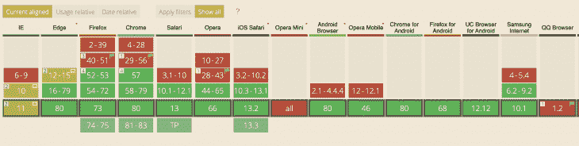
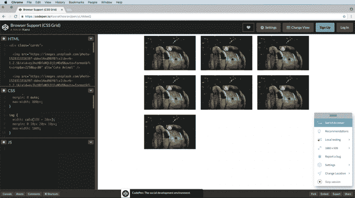
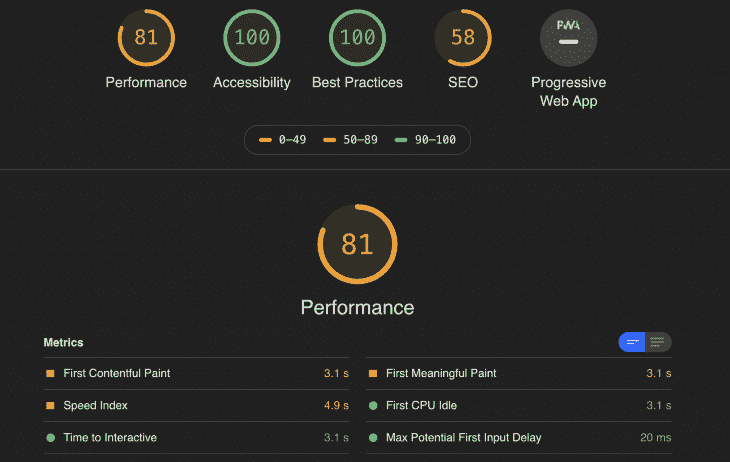
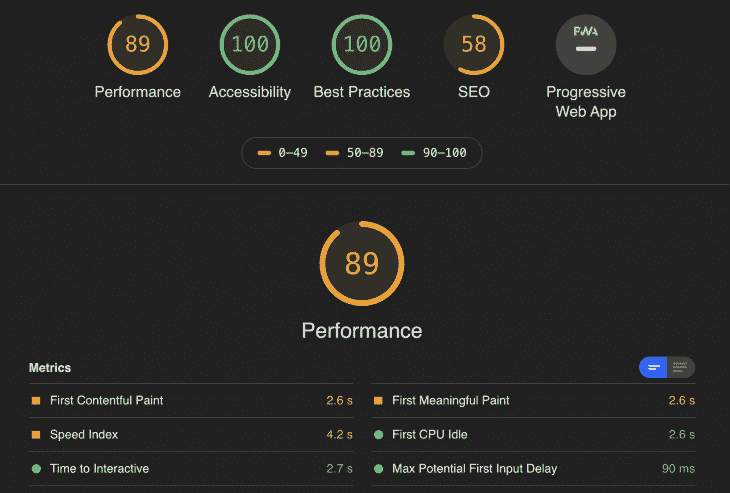
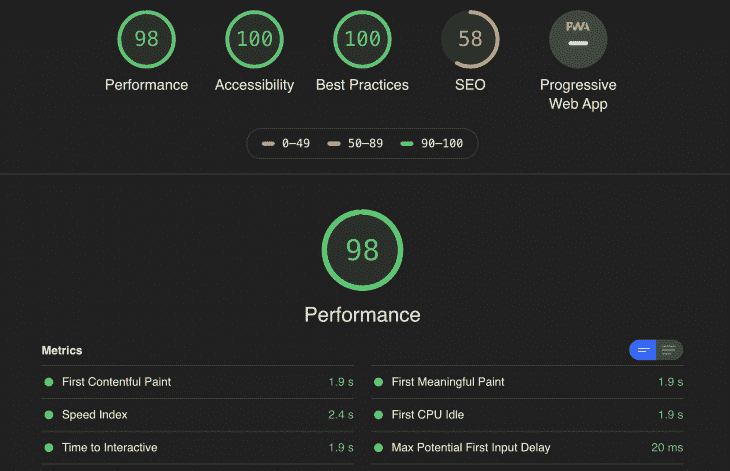

# CSS 网格还是 CSS 框架？- LogRocket 博客

> 原文：<https://blog.logrocket.com/css-grid-or-css-frameworks/>

很久以前，一个开发人员寻找一个明智的前端大师，并找到了她。他心中有一个重要的问题。

"在构建我的应用程序时，我应该使用 CSS 网格还是 CSS 框架？"他问。

“这要看情况，”她停顿了很长时间后说道。

故事结束。

我打赌你从一开始就知道故事的结局，但让我们更深入地探索一下故事情节。

## 背景

自 1996 年以来，CSS 已经走过了漫长的道路。1996 年，我们的浏览器和操作系统更少，也不需要支持复杂的布局、不同的设备和浏览大小。

快进到 2011 年，第一个 CSS 框架如 [Bootstrap](https://getbootstrap.com/) 和 [Foundation](https://get.foundation/) 被引入。那时，我们有更多样的浏览器、操作系统和设备，当前流行的 CSS3 功能仍处于试验阶段，没有得到广泛支持。

那时候，确实需要 CSS 框架。它们具有良好的跨浏览器支持，提供了具有相关 JavaScript 功能的可重用组件，提供了一个随时可用的网格系统来处理不同的浏览器大小，最重要的是标准化了构建应用程序 UI 部分的工作方式。

CSS 框架今天仍然被广泛使用。虽然不是所有的 CSS 框架都一样，但大多数都提供了一套预定义的组件、网格布局和可定制的设计系统，所以作为开发人员，你不用写太多的 CSS 就可以把它们放到页面上，它就能工作。由于 Bootstrap 是[最著名的](https://github.com/twbs/bootstrap) CSS 框架之一，我们将在本文中将其作为参考。以下是 Bootstrap 如何定义自己[官方](https://getbootstrap.com/docs/4.3/getting-started/introduction/):

> 世界上最流行的框架，用于构建响应迅速、移动优先的站点，具有 BootstrapCDN 和模板起始页面。

Bootstrap 目前(截至 2020 年 2 月)在 Github 中以 139k 颗星排名第六位。

## CSS3 的新特性怎么样？

CSS3(CSS 的最新版本)发展非常快，目前，我们已经在浏览器中广泛支持它的特性。今天，我们可以使用很酷的功能，如 [CSS Grid](https://developer.mozilla.org/en-US/docs/Web/CSS/CSS_Grid_Layout) 、 [CSS Flexbox](https://developer.mozilla.org/en-US/docs/Web/CSS/CSS_Flexible_Box_Layout/Basic_Concepts_of_Flexbox) 、 [CSS 变量](https://developer.mozilla.org/en-US/docs/Web/CSS/Using_CSS_custom_properties)、 [CSS 扩展语言，如 SASS](https://sass-lang.com/) 等等。但是由于本文的重点是网格系统，我们将只关注 CSS 网格与 CSS 框架的网格支持的比较。

首先，让我们弄清楚术语。CSS Grid 是一个二维布局系统，是作为 CSS 规范的一部分开发的。根据官方文档，CSS Grid 是这样定义自己的:

> 这个 CSS 模块定义了一个基于二维网格的布局系统，为用户界面设计进行了优化。

CSS Grid 在世界范围内的网站上的使用还不是很流行。比较一下 [Google 平台状态](https://www.chromestatus.com/metrics/css/popularity)上的 CSS 特性，可以发现 CSS 网格在所有网站上的使用率大约是 8%,而 Flexbox 的使用率是 50%。但是 [CSS 网格的采用正在增加](https://www.chromestatus.com/metrics/css/timeline/popularity/453)。

## 那么我们如何做决定呢？

让我们正确地看待这个“视情况而定”的答案。CSS 网格和 CSS 框架之间的选择取决于多种因素。在本文中，我们将重点讨论其中的四个主要问题:

*   少写 CSS 或者 HTML
*   浏览器支持
*   表演
*   响应性

## 少写 CSS 或者 HTML

如果使用 Bootstrap 这样的框架，您将会编写更多的 div、类和 HTML 元素。依赖预定义的类和元素意味着你将花费大部分时间在 HTML 标记上。

所以，如果你觉得在构建应用程序时使用预定义的元素和类更舒服，并且不想花太多时间写 CSS，那么就选择框架。我们将使用 Bootstrap 构建一个简单的照片库来查看这一过程。

参见 [CodePen](https://codepen.io) 上 Kasra([@ KasraKhosravi](https://codepen.io/KasraKhosravi))
的 Pen[Less CSS 或 Html (Bootstrap)](https://codepen.io/KasraKhosravi/pen/KKpmdPM) 。

我们也可以使用构建在 Bootstrap 之上的库，如 [Reactstrap](https://reactstrap.github.io/) 来获得可读性更好的标记。如果你使用 React 之外的东西作为 UI 库，很可能有[作为它的替代品](https://www.sitepoint.com/bootstrap-ui-libraries-angular-react-vue/)。这种库的使用进一步简化了构建页面的过程。这样，您可以只使用预定义的组件和属性。这是使用 Reactstrap 构建的页面的外观。

参见 [CodePen](https://codepen.io) 上 Kasra([@ KasraKhosravi](https://codepen.io/KasraKhosravi))
的 Pen[Less CSS 或 Html (Reactstrap)](https://codepen.io/KasraKhosravi/pen/eYNmVLv) 。

现在，当谈到 CSS 网格时，你将主要处理 HTML 中页面的语义结构，然后处理 CSS 中元素的布局和定位。如果您只想用 HTML 编写页面的基本结构，并将大部分时间用于编写 CSS 来处理布局，请选择 CSS Grid。

见笔 [少 CSS 或 HTML (CSS 网格)](https://codepen.io/KasraKhosravi/pen/PoqwQRL)由 Kasra([@ KasraKhosravi](https://codepen.io/KasraKhosravi))
上 [CodePen](https://codepen.io) 。

浏览器支持

## Bootstrap v4 支持所有主流浏览器的最新稳定版本 T1。Bootstrap v4 唯一不支持的主要浏览器是 [IE6-9](https://getbootstrap.com/docs/4.0/getting-started/browsers-devices/#internet-explorer) 。所以如果你需要支持这些浏览器，使用 Bootstrap v3 是很重要的。此外，IE10 中可能需要前缀 CSS 属性来使 Bootstrap v4.0 工作。

[浏览器对 CSS 网格支持](https://caniuse.com/#feat=css-grid)的故事有点不一样。尽管它在大多数现代浏览器**(如 Chrome +v57 或 Firefox +v52)** 中得到支持，但对传统浏览器的支持没有 Bootstrap 广泛。你需要知道老版本的浏览器**(如 Chrome v4-v28 或 Firefox v2-v39)** 根本不支持 CSS 网格，而这些浏览器的一些新版本通过在浏览器设置中启用一个标志来支持它**(如 Chrome v29-v56 或 Firefox v40-v51)** 。

所以我的建议是对你的目标用户做一个分析，如果数据显示他们大部分都在旧的浏览器/操作系统上，那么就去找一个像 Bootstrap 这样的工具，它有更好的传统浏览器支持。但是，如果您正在开发一个现代应用程序，并且目标受众都在新的移动电话和设备上，那么使用 CSS Grid 而不需要牺牲浏览器支持将是有意义的。



CanIUse – CSS Grid Browser Support (As of Feb, 2020)

但事实证明，这种情况并非非黑即白。在支持传统浏览器的同时，我们可以选择新的技术。通过使用[特性查询](https://hacks.mozilla.org/2016/08/using-feature-queries-in-css/)，检查不同浏览器对某个 CSS 属性的支持，我们可以为支持它的浏览器添加 CSS 网格属性，并重置我们为传统浏览器支持添加的任何其他 CSS 属性。

在我们需要定位元素的情况下，使用像 float、vertical-align 和 inline-block display [这样的属性可以在传统浏览器](https://developer.mozilla.org/en-US/docs/Web/CSS/CSS_Grid_Layout/CSS_Grid_and_Progressive_Enhancement)中正确地完成这项工作。但是在现代浏览器遇到这些属性的情况下，如果它们是网格容器的一部分，它就会忽略它们。

```
// Feature Query

@supports (display: grid) {
  ...
}
```

在下面的代码示例中，您可以看到我们依赖于为图像标签定义特定的宽度和边距，来模仿旧浏览器中照片库的布局。然后，我们在特征查询中重置宽度和边距，并定义 CSS 网格属性来处理图像之间的宽度(网格-模板-列)和边距(网格-间隙)。



这是一个支持 CSS 网格的浏览器的例子。

参见 [CodePen](https://codepen.io) 上 Kasra([@ KasraKhosravi](https://codepen.io/KasraKhosravi))
的 Pen [浏览器支持(CSS 网格)](https://codepen.io/KasraKhosravi/pen/yLNMeeQ)。

表演

Bootstrap 由特定的 CSS/JS 文件组成，即使它们的总大小不超过几 kb [(592 KB 作为预编译的 zip 文件夹)](https://www.sitepoint.com/most-popular-frontend-frameworks-compared/)，这也不会阻止浏览器在每次页面加载时下载它。然而，当谈到 CSS 网格时，大约 [92%的浏览器](https://caniuse.com/#search=css%20grid)(2020 年 2 月的广告)支持它，所以浏览器不需要下载任何额外的依赖项来加载网站。为了更好地了解这一点，我们将使用一个通用的性能审计工具， [Lighthouse CLI](https://github.com/GoogleChrome/lighthouse#using-the-node-cli) ，来测量我们的照片库的性能，这些照片库是由 Bootstrap、Reactstrap 和 CSS Grid 制作的。

## 很明显，用 CSS Grid 构建的照片库从 Lighthouse 获得了更好的性能分数。如果我们看一下[第一个内容丰富的痛苦(FCP)](https://developers.google.com/web/tools/lighthouse/audits/first-contentful-paint) ，从导航到浏览器(低速互联网上的桌面版本)呈现 DOM 的第一个内容需要 1.9s。对于 Reactstrap 版本(3.1s)或 Bootstrap 版本(2.6s)，这个时间要长得多。这可能是由于引导实现中未使用但呈现阻塞的 CSS。这个问题可以通过使用像 [PurgeCSS](https://developers.google.com/web/tools/lighthouse/audits/first-contentful-paint) 或 [UnCSS](https://github.com/uncss/uncss) 这样的工具，从样式表甚至 JS 注入的 CSS 中移除未使用的样式来缓解。然而，页面加载速度较低的另一个简单原因可能是每次页面加载时必须下载的引导资产的大小较大，与原生 CSS 替代方案相比，这会影响性能。如果你只关注性能，选择 CSS Grid 这样的原生解决方案，而不是 CSS 框架。

响应性



Lighthouse Report (Reactstrap)



Lighthouse Report (Bootstrap)



Lighthouse Report (CSS Grid)

Bootstrap 将自己定义为响应移动优先的方法。Bootstrap 中的响应主要是在 HTML 中使用助手类来处理的。当处理元素的大小时，您会得到五种类型的类或属性，这是通过源代码中的[预定义媒体查询](https://getbootstrap.com/docs/4.1/layout/overview/#responsive-breakpoints)在幕后处理的。从某种意义上说，这是有限制的，但是消除了猜测的需要。

## 所以你可以想象，如果我们想使用 Bootstrap 以一种响应的方式构建我们的照片库，我们通常会将 Bootstrap 的预定义类添加到我们的 HTML 中。

参见 [CodePen](https://codepen.io) 上 Kasra([@ KasraKhosravi](https://codepen.io/KasraKhosravi))
的笔 [响应度(自举)](https://codepen.io/KasraKhosravi/pen/rNVmWdM)。

```
// Extra small devices (portrait phones, less than 576px)
// No media query for `xs` since this is the default in Bootstrap

// Small devices (landscape phones, 576px and up)
@media (min-width: 576px) { ... }

// Medium devices (tablets, 768px and up)
@media (min-width: 768px) { ... }

// Large devices (desktops, 992px and up)
@media (min-width: 992px) { ... }

// Extra large devices (large desktops, 1200px and up)
@media (min-width: 1200px) { ... }
```

反应阱也是如此..

参见 [CodePen](https://codepen.io) 上 Kasra([@ KasraKhosravi](https://codepen.io/KasraKhosravi))
的 Pen [responsibility(reacts trap)](https://codepen.io/KasraKhosravi/pen/LYVWKJo)。

正如你可能已经猜到的那样，通过 CSS Grid 处理响应主要发生在 CSS 中。您只需在 HTML 中定义页面的基本布局，并使用媒体查询处理响应。这种方法更强大的原因是，处理响应式布局不仅仅包括不同视口的不同大小。您可能希望在不同的浏览器大小中隐藏或重新排序元素，根据我自己的经验，在 CSS 中使用媒体查询和 CSS 网格选项更直观。我们将看到一个使用 CSS 网格和媒体查询的简单响应布局。

参见 [CodePen](https://codepen.io) 上 Kasra([@ KasraKhosravi](https://codepen.io/KasraKhosravi))
的笔 [响应度(CSS 网格)](https://codepen.io/KasraKhosravi/pen/xxGdRBP)。

还可以利用一些特殊的 CSS 网格属性，如[最小最大值函数](https://developer.mozilla.org/en-US/docs/Web/CSS/minmax)和[自动适应](https://www.joomlashack.com/blog/tutorials/auto-fill-and-auto-fit-keywords-in-css-grid/)来处理响应性大小调整，而无需使用任何媒体查询。但是一般来说，使用媒体查询给你更多的控制和灵活性来处理响应，特别是如果你考虑使用 [helpers 媒体查询混合](https://css-tricks.com/approaches-media-queries-sass/)。

参见 [CodePen](https://codepen.io) 上 Kasra([@ KasraKhosravi](https://codepen.io/KasraKhosravi))
的 [响应度(无媒体查询的 CSS 网格)](https://codepen.io/KasraKhosravi/pen/qBdmRBY)。

结论

现在，当你思考上师的回答时，事情就有点清楚了。

从技术角度来说，使用 CSS 框架是有意义的，如果…

您更喜欢使用预定义的组件、属性和类来处理布局、定位和网格

## 支持传统浏览器对您的业务非常重要

拥有一个高性能的网站并不重要，或者你已经找到了一些聪明的方法来获得框架的好处，而不会遭受缓慢的加载时间(缓存、预取、预加载和服务器端渲染资产)

在助手类和属性的帮助下，处理网站响应对你来说似乎更直观

*   使用 CSS 网格，如果…
*   更多来自 LogRocket 的精彩文章:
*   在 CSS 中定义布局会让你感觉更舒服
*   您的大多数目标受众都使用支持这一新功能的现代浏览器

你关心通过依赖原生 CSS 来使你的站点更快、更有性能的所有方法

* * *

### 对你来说，用 CSS 处理网站响应似乎更合理

* * *

*   从更普遍的角度来看…
*   如果你正在设计一个想法或项目的原型，需要快速显示结果，那么选择你最有效的技术，但是也要考虑长远
*   分析你团队的情况。如果你正在做一个大项目，并且它的每一个方面都刻有 CSS 框架，坚持使用 CSS 框架将是最明智的选择，但是正如我们在这篇文章中了解到的，我们可以采取最简单的方法来开始向新技术的迁移
*   笔记

*这些数字代表在过去 24 小时内使用相应 CSS 属性至少一次的 Chrome 页面加载(跨所有渠道和平台)的百分比*

*   参考
*   你的前端是否占用了用户的 CPU？

## 随着 web 前端变得越来越复杂，资源贪婪的特性对浏览器的要求越来越高。如果您对监控和跟踪生产环境中所有用户的客户端 CPU 使用、内存使用等感兴趣，

.

## LogRocket 就像是网络和移动应用的 DVR，记录你的网络应用或网站上发生的一切。您可以汇总和报告关键的前端性能指标，重放用户会话和应用程序状态，记录网络请求，并自动显示所有错误，而不是猜测问题发生的原因。

现代化您调试 web 和移动应用的方式— [开始免费监控](https://lp.logrocket.com/blg/css-signup)。

## Is your frontend hogging your users' CPU?

As web frontends get increasingly complex, resource-greedy features demand more and more from the browser. If you’re interested in monitoring and tracking client-side CPU usage, memory usage, and more for all of your users in production,

[try LogRocket](https://lp.logrocket.com/blg/css-signup)

.

[](https://lp.logrocket.com/blg/css-signup)[https://logrocket.com/signup/](https://lp.logrocket.com/blg/css-signup)

[LogRocket](https://lp.logrocket.com/blg/css-signup) is like a DVR for web and mobile apps, recording everything that happens in your web app or site. Instead of guessing why problems happen, you can aggregate and report on key frontend performance metrics, replay user sessions along with application state, log network requests, and automatically surface all errors.

Modernize how you debug web and mobile apps — [Start monitoring for free](https://lp.logrocket.com/blg/css-signup).