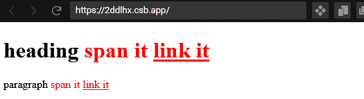
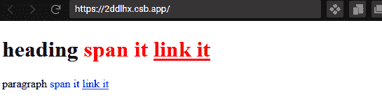
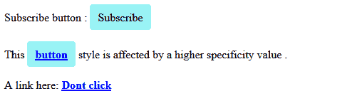
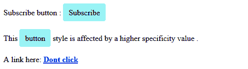

# 何时以及为何使用 CSS！重要声明

> 原文：<https://blog.logrocket.com/css-important-declaration-when-why/>

CSS 中的`!important`是一种特殊的符号，我们可以将其应用到 CSS 声明中，以覆盖匹配选择器的其他冲突规则。

当我们在 web 项目中工作时，我们有一些被其他样式否决的样式声明是很自然的。

对于了解 CSS 核心机制的有经验的开发人员来说，这不是问题。然而，初学者可能很难理解为什么他们期望的样式声明没有被浏览器应用。

因此，他们倾向于通过添加`!important`声明来实施他们所期望的风格，而不是专注于自然地解决问题。虽然这种方法可能暂时有效，但它也会引发另一个复杂的问题。

在本指南中，我们将回顾以下内容，包括如何使用`!important`以及何时应该使用它:

说得够多了，让我们开始吧。

## CSS 核心机制

理解 CSS 的核心原则自然会让我们知道什么时候使用`!important`声明是显而易见的。在本节中，我们将介绍其中的一些机制。

考虑下面的 HTML 和 CSS 代码，你觉得标题文字会是什么颜色？

首先，HTML:

```
<h2 class="mytitle">This is heading text</h2>

```

然后，CSS:

```
h2 {
  color: blue;
}
h2 {
  color: green;
}

```

文本将呈现绿色！这是 CSS 的基本原则。对于 [CSS 级联算法](https://blog.logrocket.com/how-css-works-understanding-the-cascade-d181cd89a4d8/)，CSS 规则的排序很重要。在这种情况下，源代码中最后出现的声明获胜。

正常情况下，这是符合逻辑的。首先，我们不应该像上面那样重复使用同一个选择器。CSS 不希望重复，所以它使用最后一个声明规则。

然而，有些情况下，我们为根元素创建通用样式，比如`h2`，然后添加类来样式化特定的元素。让我们也考虑下面的例子，从 HTML 开始:

```
<h2>This is heading text</h2>
<h2 class="mytitle">This is heading text</h2>
```

然后，让我们看看 CSS:

```
.mytitle {
  color: blue;
}
h2 {
  color: green;
}

```

在上面的代码中，第一个`h2`元素没有应用类，所以很明显它得到了绿色的`h2`选择器。

然而，第二个`h2`元素使用类选择器`.mytitle`的规则，即使元素选择器规则在 CSS 代码中排在最后。原因是与元素选择器相比，[类选择器具有更高的特异性](https://blog.logrocket.com/deep-dive-css-specificity/)。

换句话说，应用于类选择器中声明的权重大于元素选择器的权重。

类似地，ID 选择器中的声明多于类选择器中的声明。在这种情况下，下面代码中的红色优先:

```
<h2 id="maintitle" class="mytitle">This is heading text</h2> 

```

其次是 CSS:

此外，内联的`style`属性优先于 ID 选择器，从 HTML:

```
.mytitle {
  color: blue;
}
#maintitle {
  color: red;
}
h2 {
  color: green;
}

```

然后是 CSS:

```
<h2 id="maintitle" style="color: black;" class="mytitle">This is heading text</h2> 

```

这是 CSS 中理想的优先级流，必须保持以避免异常。大多数时候，当我们忘记这些基本规则的时候，宣言就出现了。

内联样式属性和每个选择器都有浏览器分配给它们的值。这样，它就知道哪个优先级更高或更低。可以把这个值想象成四个一位数，其中`style`属性被赋予了最强的权重值`1000`。

```
.mytitle {/*...*/}

#maintitle {/*...*/}

h2 {/*...*/}

```

接下来是值为`0100`的 ID，然后是值为`0010`的 class，最后是值为`0001`的元素选择器。

有时，我们可以针对特定元素组合选择器，如下例所示:

其次是 CSS:

上面 CSS 中的`h2.mytitle`选择器的特殊性在于添加了`h2`和`.mytitle`。也就是`0001 + 0010 = 0011`。然而，这个总值小于`#maintitle` ID 即`0100`的总值。

```
<h2 id="maintitle" class="mytitle">This is heading text</h2> 

```

更多来自 LogRocket 的精彩文章:

因此，浏览器使用 ID 选择器中的声明来覆盖其他冲突的规则。在权重相等的情况下，最后一个规则声明获胜。

```
h2.mytitle {
  color: blue;
}
#maintitle {
  color: red;
}
h2 {
  color: green;
}

```

既然我们知道了哪些规则是最相关的，为什么浏览器要应用它们，那么是否使用这个`!important`声明就变得很自然了。

* * *

### 在使用之前理解`!important`声明

* * *

在我们考虑使用`!important`符号之前，我们必须确保我们遵循特异性规则并使用 CSS 级联。

在下面的代码中，我们将`h2`和`h3`元素设置为`red`颜色:

## 然后，CSS 中的`.mytitle`:

但是，假设在某个时候，我们想给`h3`元素一个`blue`颜色。添加如下所示的样式规则不会改变颜色，因为该类比元素选择器更重要，也更具体，正如我们所了解的:

然而，在较小的权重上使用`!important`会使浏览器在其他冲突规则上强制声明:

```
<h2 class="mytitle">This is heading II text</h2>
<h3 class="mytitle">This is heading III text</h3>

```

这是因为`!important`符号增加了声明在级联优先级顺序中的权重。这意味着我们扰乱了正常的优先级流程。因此，这是不好的做法，会导致代码维护和调试的困难。

```
.mytitle {
  color: red;
}

```

如果在其他时候，我们想要覆盖上面的重要规则，我们可以在具有更高特异性的声明上应用另一个`!important`符号(或者，如果它在源代码中较低，也是一样)。这可能会导致这样的结果:

```
.mytitle {...}
h3 {
  color: blue;
}

```

这是不好的，应该避免。相反，我们应该检查:

```
.mytitle {...}
h3 {
  color: blue !important;
}

```

重新安排规则或重写选择器可以解决级联问题

增加目标元素的特异性可以解决这个问题

```
h3 {
  color: blue !important;
}

/* several lines of rules */

.mytitle {
  color: green !important;
}

```

好吧，让我们来看看。回到我们的样式规则，我们可以通过增加特异性分数在`h3`元素上强制使用`blue`颜色。

1.  如下所示，我们可以组合选择器，直到它们的特异性分数取代了冲突的规则。`h3.mytitle`选择器给出的特异性分数为`0011`，大于`0010`分数的`.mytitle`:
2.  正如我们所看到的，我们没有使用`!important`声明来执行规则，而是专注于增加特异性分数。

有时，我们可能会将问题追溯到伪类函数。所以，知道它是如何工作的可以帮我们减轻很多压力。让我们看另一个例子。

假设我们正在进行一个项目，看到下面的代码:

```
.mytitle {...}
h3.mytitle {
  color: blue;
}

```

使用下面的 CSS 规则，我们会得到以下输出:

[](https://blog.logrocket.com/css-important-declaration-when-why/output-heading-span-it-link-it/)

现在，假设我们想给段落中的`span`和链接文本赋予另一种颜色的`blue`。我们可以通过添加以下规则来做到这一点:

```
<h1 id="header">
  heading <span>span it</span>
  <a href="#">link it</a>
</h1>
<p class="paragraph">
  paragraph <span>span it</span>
  <a href="">link it</a>
</p>

```

先前的规则将会覆盖`blue`颜色，尽管它还在后面:

```
:is(#header, p) span,
:is(#header, p) a {
  color: red;
}

```

[](https://blog.logrocket.com/css-important-declaration-when-why/blue-color/)

作为一个快速解决方案，我们可以通过使用`!important`符号来加强我们的`blue`颜色，如下所示:

```
.paragraph span,
.paragraph a {
  color: blue;
}

```

但是，正如您可能猜到的那样，这是一种不好的做法，所以我们不能急于使用`!important`符号。相反，我们可以从分析每个选择器如何工作开始。代码中使用的`:is()`是一个伪类函数，用于以更压缩的形式编写大型选择器。

因此，在上面的代码中有以下规则:

这相当于以下内容:

```
:is(#header, p) span,
:is(#header, p) a {...}

.paragraph span,
.paragraph a {
  color: blue !important;
}

```

那么，为什么`.paragraph span`和`.paragraph a`虽然拥有比`p span`和`p a`的`0002`更高的`0011`特异性分数，却没有覆盖颜色呢？

嗯，`:is()`中的每个选择器都使用参数列表中最高的特异性。在这种情况下，`:is(#header, p)`中的`#header`和`p`都使用了`#header`的特异性分数，即`0100`。因此，浏览器坚持其价值，因为它具有更高的特异性。

```
:is(#header, p) span,
:is(#header, p) a {
  color: red;
}

```

因此，每当我们看到这种类型的冲突时，我们最好不要使用伪类函数，而坚持使用它的等价函数，如下所示:

```
#header span,
p span,
#header a,
p a {
  color: red;
}

```

现在，我们应该能够看到预期的结果，而不用使用打乱级联顺序的`!important`符号。

[](https://blog.logrocket.com/css-important-declaration-when-why/result-with-important-notation/)

你可以在 CodeSandbox 上亲眼看看[。](https://codesandbox.io/s/falling-cookies-2ddlhx?file=/index.html)

```
#header span,
p span,
#header a,
p a {
  color: red;
}

```

具体什么时候可以用`!important`声明？

下面是一些推荐使用`!important`符号的场合。

实用程序类别

## 假设我们想让页面上的所有按钮看起来都一样，我们可以编写一个可以跨页面重用的 [CSS 规则。](https://blog.logrocket.com/css-utility-classes-library-extendable-styles/)让我们看看下面的标记和样式:

其次是 CSS:

### 在上面的代码中，我们可以看到`section`元素中的按钮链接是 CSS 中两个选择器的目标。我们了解到，对于冲突的规则，浏览器将使用最具体的规则。正如我们所料，`.content a`的分数为`0011`，而`.btn`的分数为`0010`。

该页面将如下所示:

```
<p>Subscribe button : <a class="btn" href="#">Subscribe</a></p>

<section class="content">
  <p>
    This <a href="#" class="btn">button</a> style is affected by a higher
    specificity value .
  </p>
  A link here: <a href="#">Dont click</a>
</section>

```

[](https://blog.logrocket.com/css-important-declaration-when-why/subscribe-page-example/)

```
.btn {
  display: inline-block;
  background: #99f2f5;
  padding: 8px 10px;
  border: 1px solid #99f2f5;
  border-radius: 4px;
  color: black;
  font-weight: normal;
  text-decoration: none;
}

.content a {
  color: blue;
  font-weight: bold;
  text-decoration: underline;
}

```

在这种情况下，我们可以通过向冲突声明添加`!important`符号来实施`.btn`规则，如下所示:

页面现在看起来和我们预期的一样:

[](https://blog.logrocket.com/css-important-declaration-when-why/new-subscribe-page/)

在 CodeSandbox 上亲自查看[。](https://codesandbox.io/s/quirky-cherry-39qdom?file=/style.css)

```
.btn {
  /* ... */
  color: black !important;
  font-weight: normal !important;
  text-decoration: none !important;
}

```

我们无法超越的风格规则

这通常发生在我们不能完全控制工作代码的时候。有时，当我们使用像 WordPress 这样的内容管理系统时，我们可能会发现 WordPress 主题中的内嵌 CSS 样式正在取代我们的自定义样式。

在这种情况下，`!important`声明可以方便地覆盖主题内联样式。

### 结论

这个声明从来都不是我们想要的。我们必须只在绝对必要的情况下才使用它，比如我们对代码的控制较少的情况，或者我们自己的代码中非常极端的情况。

我们是否使用它取决于我们如何理解核心 CSS 机制，在本教程中，我们也谈到了这一点。

## 我希望你喜欢阅读这篇文章。如果你有问题或贡献，在评论区分享你的想法，记得在网上分享这个教程。

你的前端是否占用了用户的 CPU？

随着 web 前端变得越来越复杂，资源贪婪的特性对浏览器的要求越来越高。如果您对监控和跟踪生产环境中所有用户的客户端 CPU 使用、内存使用等感兴趣，

.

## LogRocket 就像是网络和移动应用的 DVR，记录你的网络应用或网站上发生的一切。您可以汇总和报告关键的前端性能指标，重放用户会话和应用程序状态，记录网络请求，并自动显示所有错误，而不是猜测问题发生的原因。

现代化您调试 web 和移动应用的方式— [开始免费监控](https://lp.logrocket.com/blg/css-signup)。

[try LogRocket](https://lp.logrocket.com/blg/css-signup)

.

[](https://lp.logrocket.com/blg/css-signup)[https://logrocket.com/signup/](https://lp.logrocket.com/blg/css-signup)

[LogRocket](https://lp.logrocket.com/blg/css-signup) is like a DVR for web and mobile apps, recording everything that happens in your web app or site. Instead of guessing why problems happen, you can aggregate and report on key frontend performance metrics, replay user sessions along with application state, log network requests, and automatically surface all errors.

Modernize how you debug web and mobile apps — [Start monitoring for free](https://lp.logrocket.com/blg/css-signup).