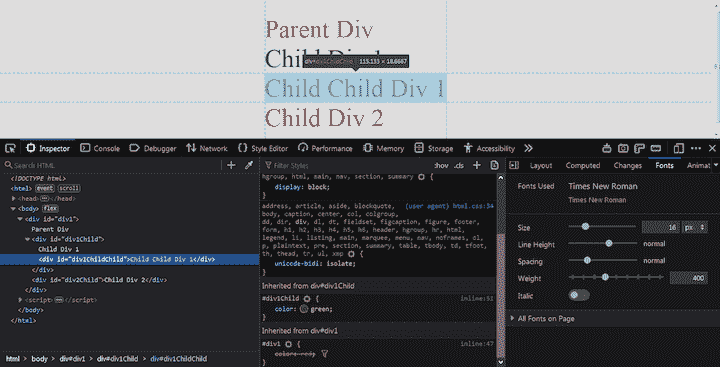

# CSS 继承:继承、初始化、取消设置和恢复

> 原文：<https://blog.logrocket.com/css-inheritance-inherit-initial-unset-and-revert/>

继承发生在现实生活中。孩子继承了父母的特征:高个子的父母很可能有高个子的孩子，反之亦然。子女也继承父母的财富和财产。

软件开发中的继承也是如此。在 OOP 语言中，类继承它们的父类的属性和方法。这样做是为了避免重复代码。

在 [CSS 中呢，网页的设计语言](https://blog.logrocket.com/the-latest-features-of-css-in-2021/)？遗传也发生在那里。如果在父元素中设置属性，默认情况下，子元素会继承这些属性及其值，而无需显式定义该属性。像`color`这样的属性被传递给元素的子元素。如果一个元素是绿色的，它的所有子元素也会变成绿色。

在本教程中，我们将关注 CSS 中的继承。我们将演示 CSS 中的继承是如何工作的，并回顾一些 [CSS 属性](https://blog.logrocket.com/css-custom-properties-as-of-2021/)，您可以使用它们将可继承的属性传递给子元素。

以下是我们将要介绍的内容:

## 什么是 CSS 继承？

CSS 规则集从父选择器到子选择器在 CSS 层次结构中向下级联。这些 [CSS 规则集继承自它们的父选择器](https://developer.mozilla.org/en-US/docs/Web/CSS/inheritance)。

如果没有指定 CSS 属性，子元素自然会从父元素继承 CSS 属性及其值。

```
<style>
  #div1 {
    color: red;
  }
</style>

<div id="div1">
  Parent Div
  <div id="div1Child">Child Div 1</div>
  <div id="div2Child">Child Div 2</div>
</div>

```

输出如下所示:


我们只设置了文本颜色为红色的`div#div1`，但是 CSS 规则应用到了它的两个子元素`div`:`div#div1Child`和`div#div2Child`。两个子元素`div`没有设置 CSS 规则集`color: red`。

发生了什么事？孩子从他们的父母`div#div1`那里继承了`color: red`。在子元素`div`上没有指定`color: red`，所以他们从父元素`div#div1`继承了它。

这种继承一直延续到最近的父元素:

```
<style>
  #div1 {
    color: red;
  }

  #div1Child {
    color: green;
  }
</style>
<div id="div1">
  Parent Div
  <div id="div1Child">
    Child Div 1
    <div id="div1ChildChild">Child Child Div 1</div>
  </div>
  <div id="div2Child">Child Div 2</div>
</div>

```



我们在`div#div1Child`里面有`div#div1ChildChild`。现在，我们已经将`color: blue`设定在`div1Child`上。`div1Child`不从`div1`继承`color: red`；它将使用它的`color: blue`。这就是所谓的特异性。`div#div1ChildChild`将从`div#div1Child`继承蓝色，因为它是蓝色的母体。

## 继承了哪些 CSS 属性？

虽然不是所有的 CSS 规则/属性都被继承，但是所有的`font-*`属性都被继承。这包括:

*   `font-size`
*   `font-family`
*   `font-weight`

`color`属性也被继承。

当元素上没有设置可继承属性时，CSS 中会发生继承。它在父链中向上将属性值设置为其父值。

CSS 属性如`height`、`width`、`border`、`margin`、`padding`等。不是遗传的。`We can enable inheritance on noninheritable CSS properties by using the `inherit`值。`

## CSS `inherit`是什么？

当您在 CSS 属性上设置`inherit`时，该属性从元素的父元素获取值。

这不仅适用于可继承的属性，也适用于所有 CSS 属性。

假设我们有以下内容:

```
<style>
  #div1 {
    height: 100px;
    color: red;
  }

  #div1Child {
    height: inherit;
  }
</style>

<div id="div1">
  Parent Div
  <div id="div1Child">Child Div 1</div>
  <div id="div2Child">Child Div 2</div>
</div>

```

`div1`的高度设置为`100px`，颜色设置为`red`。`color`将被子元素继承。`height`属性不可继承，所以子元素不会继承它。

另一方面，`div1Child`将其高度属性设置为`inherit`。这将使它从其父元素`div1`中继承其高度值。所以`div1Child`的高度将是`100px`。

`inherit`值启用所有 CSS 属性的继承。使用`inherit`，指定的元素将从其父元素获取指定属性的值。

如果 CSS 属性由元素的父元素设置，则只有直接子元素可以使用`inherit`值从其父元素继承 CSS 属性。这是为了确保要继承的 CSS 属性是可继承的属性。

这里有一个例子:

```
<style>
  #div1 {
    color: red;
    height: 100px;
  }

  #div1ChildChild {
    height: inherit;
  }
</style>

<div id="div1">
  Parent Div
  <div id="div1Child">
    Child Div 1
    <div id="div1ChildChild">Child Child Div 1</div>
  </div>
  <div id="div2Child">Child Div 2</div>
</div>

```

`div1`的高度设置为`100px`。`div1ChildChild`。`div1`(`div1`的子元素，但不是直接子元素)的孙辈将其 height 属性设置为`inherit`。CSS 将尝试从`div1ChildChild`的父对象(`div1Child`)获取值，但是它没有设置`height`属性。所以 CSS 会求助于初始值。

CSS 不会沿着父链向上移动(祖父母、曾祖父母、曾曾祖父母等)。)来检查任何一个 a 是否为来自的`div1ChildChild`设置了`height`属性。
所以`div1ChildChild`不会有`100px`的身高；相反，它将求助于其浏览器计算的高度。

## `initial`

根据 [MDN](https://developer.mozilla.org/en-US/docs/Web/CSS/initial_value) :

> **initial** 将应用于所选元素的属性值设置为与浏览器默认样式表中该元素的属性值相同。如果浏览器的默认样式表没有设置任何值，并且该属性是自然继承的，则属性值改为设置为 inherit。

`initial`是一个 CSS 属性值，用来设置一个元素的 CSS 属性的初始值。这成为 CSS 属性的默认值。当没有明确指定值时，每个 CSS 属性都有一个默认值。

例如，`display` CSS 属性的初始值是`inline`。有一种被称为用户代理浏览器样式，它是浏览器提供给 HTML 元素的样式。这些与 CSS 属性的初始值无关。

一个`div`带有一个设置为`block`的`display`属性。这来自于浏览器的风格。将`display`属性设置为`initial`，则`div`元素将转换为`inline`元素。

这里有一个没有`initial`的例子:

```
<html>
  <style>
    .div {
      padding: 50px;
      background-color: orange;
    }
  </style>
  <body>
    <div class="div">Hello</div>
  </body>
</html>

```

`div.div`元素是一个块元素。现在，让我们将`div.div`元素的`display`属性设置为`initial`。

* * *

### 更多来自 LogRocket 的精彩文章:

* * *

下面是一个带有`initial`的例子；

```
<html>
  <style>
    .div {
      padding: 50px;
      background-color: orange;
      display: initial;
    }
  </style>
  <body>
    <div class="div">Hello</div>
  </body>
</html>

```

CSS `display`用`initial`值设置在`div.div`元素上。这使得`div.div`元素取`display`属性的初始值，即`inline`。所以`div.div`变成了一个内嵌元素。

`color` CSS 属性的`initial`值为黑色。如果没有指定`color`属性，元素文本节点的颜色会变成黑色。

下面是一个带有`color`值的例子:

```
<html>
  <style>
    .div {
      padding: 50px;
      background-color: orange;
      color: green;
    }
  </style>
  <body>
    <div class="div">Hello</div>
  </body>
</html>

```

`div.div`元素的`color`属性值被设置为`green`，因此文本颜色将为绿色。

这里有一个用`color:` `initial`的例子:

```
<html>
  <style>
    .div {
      padding: 50px;
      background-color: orange;
      color: initial;
    }
  </style>
  <body>
    <div class="div">Hello</div>
  </body>
</html>

```

`div.div`元素的`color`属性被设置为`initial`，因此`color`属性将采用其默认值(黑色)。元素`div.div`中的文本节点`Hello`将显示为黑色。

## `unset`

属性对 CSS 属性的继承性和非继承性都有效。

### 继承的属性

默认情况下，这些属性是根据父元素计算的。继承的属性影响元素的子元素。大多数影响文本节点的 CSS 属性都是继承属性，比如`color`、`font-size`、`font-family`等。

如果我们将`html`元素的颜色设置为绿色，它将向下级联到`html`元素的所有子元素，因此整个页面的文本颜色将为绿色。

### 非继承属性

这些属性不是从元素的父元素继承或计算而来的。它的值是显式设置的或由其初始值设置的。大多数影响元素节点的 CSS 属性都是非继承属性

`unset`值对继承的和非继承的 CSS 属性有不同的作用。当在继承的属性上设置了`unset`值时，它会将属性值重置为其继承的值。`unset`值将非继承属性重置为初始值。

下面是继承属性中的`unset`的示例:

```
<html>
  <style>
    html {
      color: red;
    }
    div {
      color: green;
    }
    .div {
      margin-top: 8px;
      padding: 50px;
      background-color: orange;
      color: unset;
    }
  </style>
  <body>
    <div class="div">Hello</div>
  </body>
</html>

```

`div`元素的`color`属性设置为`green`,`html`的`color`属性设置为`red`,`div.div`的`color`属性设置为`unset`。color 属性是一个继承的 CSS 属性，所以`unset`会将`div.div`的颜色重置为其父对象`html`的颜色，红色。

`div.div`元素应该是绿色的，但是由于`unset`的值，颜色取自它的父元素`html`。

我们看到`unset`像`inherit`关键字一样处理继承的属性。我们可以将`inherit`设置为`div.div`的颜色属性，这和使用`unset`的效果一样。

这里有一个关于非继承属性的例子:

```
<html>
  <style>
    html {
      color: red;
    }
    div {
      background-color: orange;
    }
    .div {
      margin-top: 8px;
      padding: 50px;
      display: unset;
    }
  </style>
  <body>
    <div class="div">Hello</div>
  </body>
</html>

```

通常情况下，浏览器会加载带有其页面样式的页面。默认情况下，`div`的`display`属性设置为`block`。这不是`display`属性的默认值；其默认值为`inline`。

在上面的代码中，`div.div`的`display`属性被设置为`unset`。这个`div.div`本来应该是一个`block`元素，但是因为其`display`属性中的`unset`值，所以被重置为`inline`。

因此，`unset`值对非继承属性起作用，就像`initial`值一样。

## `revert`

我们已经讨论了 CSS 基本样式和浏览器用户代理样式。CSS 基本样式是 CSS 属性的默认值。这些是属性自带的自然默认值。浏览器用户代理样式是由浏览器设置的值。当一个页面加载时，浏览器为一些 CSS 属性设置了样式。

例如，`display`属性有一个 CSS 基值，就是`inline`。这是它来自 CSS 引擎的自然值。现在，浏览器将`display`属性重新设置为`block`。

浏览器风格就是添加自己的`.css`文件，这些文件包含它的代码。`revert`关键字将 CSS 默认值转换为浏览器用户代理样式。

这里有一个例子:

```
<html>
  <style>
    html {
      color: red;
    }
    div {
      background-color: orange;
      display: flex;
    }
    .div {
      margin-top: 8px;
      padding: 50px;
      display: revert;
    }
  </style>
  <body>
    <div class="div">Hello</div>
  </body>
</html>

```

这里，`div`元素被设置为`display: flex`。注意`display`的浏览器用户代理值是`block`。`div.div`的`display`属性被设置为`revert`。这将把`div.div`元素的`display`属性重置为`block`。`div.div`将是一个`block`元素。

## 结论

在本教程中，我们学习了所有关于 CSS 继承的知识，并探索了 CSS 中可以用来切换继承的四个主要关键字:`inherit`、`initial`、`unset`和`revert`。

## 你的前端是否占用了用户的 CPU？

随着 web 前端变得越来越复杂，资源贪婪的特性对浏览器的要求越来越高。如果您对监控和跟踪生产环境中所有用户的客户端 CPU 使用、内存使用等感兴趣，

[try LogRocket](https://lp.logrocket.com/blg/css-signup)

.

[](https://lp.logrocket.com/blg/css-signup)[https://logrocket.com/signup/](https://lp.logrocket.com/blg/css-signup)

LogRocket 就像是网络和移动应用的 DVR，记录你的网络应用或网站上发生的一切。您可以汇总和报告关键的前端性能指标，重放用户会话和应用程序状态，记录网络请求，并自动显示所有错误，而不是猜测问题发生的原因。

现代化您调试 web 和移动应用的方式— [开始免费监控](https://lp.logrocket.com/blg/css-signup)。