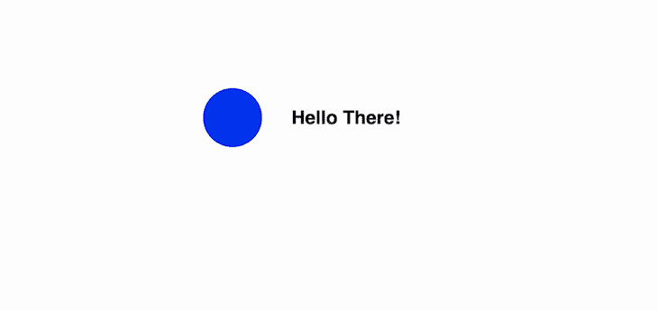
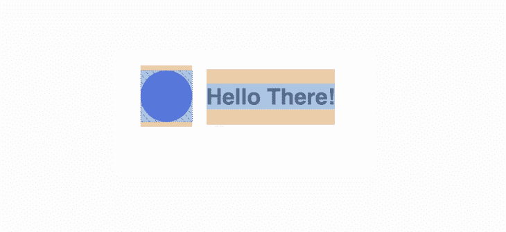
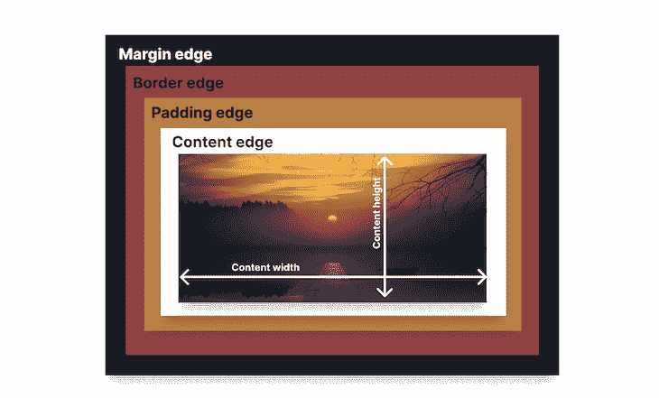
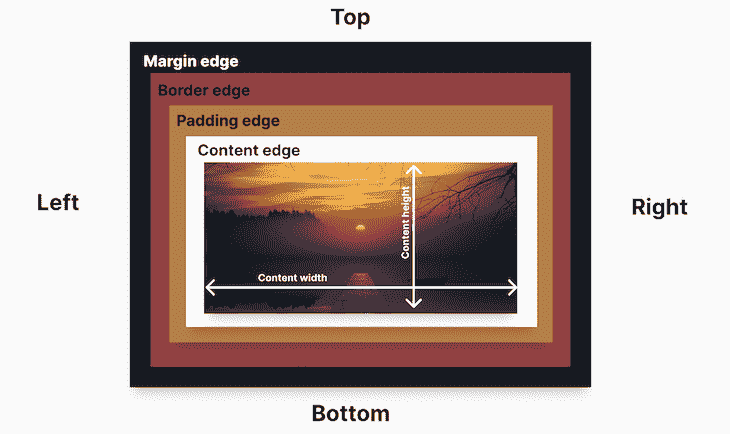
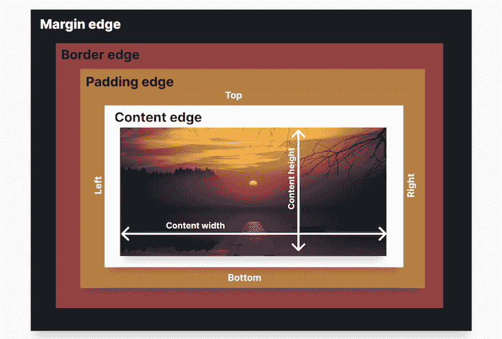
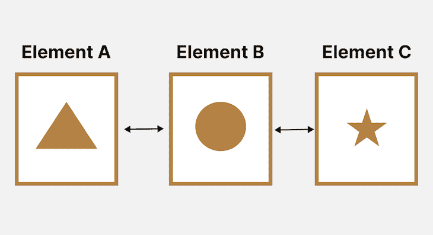
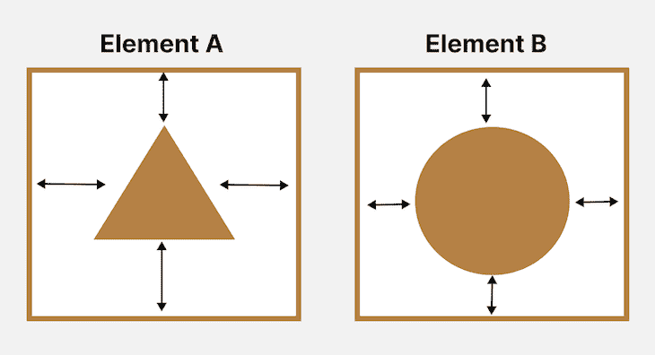
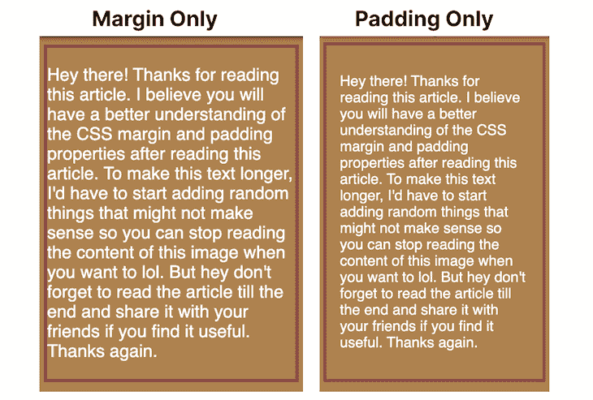

# CSS 边距与填充

> 原文：<https://blog.logrocket.com/css-margin-vs-padding/>

CSS `margin`和`padding`属性使开发人员能够控制网页上元素内部和外部的空间，给它想要的外观和感觉。

虽然这些属性很重要，但它们经常被大多数开发人员误解，尤其是新手。本教程揭示了围绕 CSS 边距和填充的问题。

我们将介绍 CSS 盒子模型、`margin`和`padding`属性的含义、如何以及何时使用它们，以及它们之间的区别。

## CSS 盒子模型

为了有效地理解 CSS `margin`和`padding`，必须理解 CSS 盒子模型以及 HTML 元素如何遵循其标准呈现。

[添加到网页的每个 HTML 元素在浏览器中呈现为一个框](https://blog.logrocket.com/using-css-content-visibility-to-boost-your-rendering-performance/)。例如，下图似乎不包含方框，而是包含一个圆和文本。



但是，如果浏览器检查这些元素，如下图所示，浏览器的呈现引擎会根据 CSS 框模型将这些元素表示为一个框。



那么，CSS 盒子模型到底是什么？它本质上是一个包裹网站上每个块级 HTML 元素的盒子。

每个框都由四个区域组成，这四个区域由各自的边缘定义:内容边缘、填充边缘、边框边缘和边距边缘。



以上面的插图为例，让我们详细说明每个盒子的四个区域。

### 内容区域

由内容边缘定义的内容区域表示指定 HTML 元素的值。

例如，如果向网页添加一个`<h1>`元素，该元素的内容将呈现为文本，如果添加一个`<audio>`元素，该内容将呈现为音频播放器。

在上面的例子中，内容是一个图像，由``元素定义。

### 填充区域

内容区域周围是填充区域，由填充边缘定义。元素的填充区域是其内容区域和边框区域之间的空间。

填充区域的大小使用 CSS 速记`padding`属性或其子属性来设置:`padding-top`、`padding-right`、`padding-bottom`和`padding-left`。

使用 CSS `padding`属性设置填充区域的大小是至关重要的，因为元素的填充区域大小可以显著影响或改善网页内容的外观。

### 边区

接下来是边框区域，它围绕着元素的填充区域，充当包围每个块级 HTML 元素的框的边缘或屏蔽。

通过向元素添加 CSS `border`属性，可以使边框区域可见。

### 边缘区域

由边距边缘定义的边距区域是边框区域周围的不可见区域，它将一个元素与其周围的其他元素分隔开。

空白区域的大小由 CSS 速记`margin`属性及其子属性决定:`margin-top`、`margin-right`、`margin-bottom`和`margin-left`。

## `margin`对`padding`

在上一节中，我们讨论了 CSS 盒子模型及其四个方面。这四个区域有各自的 CSS 属性来定义或控制它们:

*   内容区域由 HTML 元素的值定义
*   填充区域由`padding`属性定义
*   边界区域由`border`属性定义
*   空白区域由`margin`属性定义。

尽管这些属性能够定义 CSS 盒子模型的四个区域，但是`margin`和`padding`属性的影响几乎看不见。

如果没有这些属性，当您使用``标签时，您可以看到网页上的图像，当您使用`border`属性时，您可以看到图像周围的边框。但是，当添加一个`margin`或`padding`属性到一个元素时，你能看到的最好的是空间。

通常，有些人甚至看不到空间，我的朋友，这就是为什么这两个属性经常被误解或互换使用。

为了帮助您更好地理解`margin`和`padding`属性，本节将介绍它们是什么，如何使用它们，它们的区别，以及何时使用`padding`和`margin`。

### 什么是`margin`？

记住网页上的每个 HTML 元素都是一个盒子。最重要的是，所有的 HTML 元素都有四个边:上、右、下和左。



HTML 元素周围的空白区域会将其他元素推开。

因为边距包围了盒子的所有四个边(上、右、下、左),所以它使我们能够针对盒子的每个边或所有边定位和更改边距区域的大小:

```
margin: 50px;
margin-top: 20px:
margin-right: 40px;
margin-bottom: 70px
margin-left: 20px;

```

您可以使用这些子属性分别增加或减少上边、下边、左边和右边空白区域的大小:

*   `margin-top`
*   `margin-bottom`
*   `margin-left`
*   `margin-right`

您也可以使用速记`margin`属性一次增加或减少所有空白区域的大小。

在下面的演示中，一个 50 像素的空白(`margin: 50px;`)被添加到圆圈中，以在它和文本之间创建一个空间:

参见 Didicodes([@ edyasikpo](https://codepen.io/edyasikpo))[CodePen](https://codepen.io)上的 Pen [Margin 1(边距与填充教程)](https://codepen.io/edyasikpo/pen/yLbrMLy)。

如果您移除`margin`，两个元素之间的空间会减小，使它们看起来是连接在一起的。这表明`margin`属性只在元素外增加了空间，而不在元素内:

参见 Didicodes([@ edyasikpo](https://codepen.io/edyasikpo))[CodePen](https://codepen.io)上的 Pen [Margin 2(边距与填充教程)](https://codepen.io/edyasikpo/pen/QWvPrvL)。

什么是`padding`？

### 属性定义了 CSS 盒子模型的内部。它会增大或减小填充区域的大小。



就像 HTML 元素有四个边一样，HTML 元素中的内容，比如文本、图像或音频播放器，也有四个边:顶部、右侧、左侧和底部。

`padding`属性增加或减少填充区域的大小，从而在内容和边框之间创建一个空间:

与`margin`一样，`padding`属性包围内容的所有四个边，使您能够使用这些子属性独立地增加或减少顶部、底部、左侧和右侧的填充大小:

```
padding: 50px;
padding-top: 20px:
padding-right: 40px;
padding-bottom: 70px
padding-left: 20px;

```

`padding-top`

*   `padding-bottom`
*   `padding-left`
*   `padding-right`
*   您还可以使用速记`padding`属性同时增大或减小所有填充区域边的大小。

在下面的演示中，没有添加任何填充。您可以看到内容文本非常接近边框—这意味着填充区域相对较小或者不存在—您必须使用`padding`属性来增加它:

参见 Didicodes([@ edyasikpo](https://codepen.io/edyasikpo))[CodePen](https://codepen.io)上的 Pen [Padding 1 (CSS 边距 vs. Padding 教程)](https://codepen.io/edyasikpo/pen/rNmbKzv)。

See the Pen [Padding 1 (CSS Margin vs. Padding tutorial)](https://codepen.io/edyasikpo/pen/rNmbKzv) by Didicodes ([@edyasikpo](https://codepen.io/edyasikpo))
on [CodePen](https://codepen.io).

所以，让我们在当前的演示中添加 15 像素的填充，看看它会对 HTML 元素的内容产生什么影响:

参见 Didicodes([@ edyasikpo](https://codepen.io/edyasikpo))[CodePen](https://codepen.io)上的 Pen [Padding 2 (CSS 边距 vs. Padding 教程)](https://codepen.io/edyasikpo/pen/OJmGZwe)。

See the Pen [Padding 2 (CSS Margin vs. Padding tutorial)](https://codepen.io/edyasikpo/pen/OJmGZwe) by Didicodes ([@edyasikpo](https://codepen.io/edyasikpo))
on [CodePen](https://codepen.io).

正如您所看到的，框的填充区域增加了 15 个像素，从而在内容和边框之间增加了一个空间。

`margin`和`padding`的区别

## 尽管这两个 [CSS 属性](https://blog.logrocket.com/tag/css/)是相似的，并且经常被错误地互换使用，但是它们是完全不同的，理解它们的区别对 web 开发人员是有益的。

间隔

### `margin`和`padding`的一个核心区别是`padding`控制边框和元素内容之间的间距，而`margin`控制边框和周围其他元素之间的间距。

下图显示了使用`margin`属性时增加的空间。箭头表示添加在三个不同元素周围的不可见空间(边距),以确保它们不会彼此靠近。



而下图表示使用`padding`时增加的空间。箭头表示添加的不可见空间(填充)，以确保内容(圆形和三角形)不靠近元素的边界。



通俗地说，`padding`允许我们定义元素内部的空间，而`margin`允许我们定义元素之间的空间。

`Padding`取背景色；`Margin`没有

### 由边距和填充创建的空间是不可见的。然而，如果一个背景颜色被添加到一个元素中，`padding`将不再是不可见的，因为它采用了元素的颜色，而由空白创建的空间保持不可见。

例如，下图包含两个简单的网页。左侧图像仅应用了`margin`，而右侧图像仅应用了`padding`。

由于背景色的存在，填充变得更加明显，而边距看起来仍然不可见。



`margin`可以设置为自动；`padding`不能

### 如果将`margin: auto`设置为固定宽度的元素，它会将元素水平居中(或者使用 flexbox 时垂直居中)。

因为 web 开发人员理解或记住居中元素一直很棘手(你可以通过[关于在线居中 divs 的有趣迷因](https://twitter.com/overflow_meme/status/1233967116782579714?lang=en)来了解)，这个功能非常方便。

另一方面，不可能将`padding`设置为`auto`。

参见 Didicodes([@ edyasikpo](https://codepen.io/edyasikpo))[CodePen](https://codepen.io)上的 Pen [Margin Auto (CSS 边距与填充教程)](https://codepen.io/edyasikpo/pen/oNWOMLb)。

See the Pen [Margin Auto (CSS Margin vs. Padding tutorial)](https://codepen.io/edyasikpo/pen/oNWOMLb) by Didicodes ([@edyasikpo](https://codepen.io/edyasikpo))
on [CodePen](https://codepen.io).

`margin`可以有负值；`padding`不能

### 如果希望元素重叠，可以将`margin`值设置为负值。当你想在你的网站上实现漂亮的设计时，这个负值会非常方便。

参见 Didicodes([@ edyasikpo](https://codepen.io/edyasikpo))
在 [CodePen](https://codepen.io) 上的 [笔重叠(CSS 边距 vs .填充教程)](https://codepen.io/edyasikpo/pen/MWmRBMg)。

See the Pen [Overlapping (CSS Margin vs. Padding tutorial)](https://codepen.io/edyasikpo/pen/MWmRBMg) by Didicodes ([@edyasikpo](https://codepen.io/edyasikpo))
on [CodePen](https://codepen.io).

然而，值只能是正的，因为负填充会导致边框折叠到内容中，使内容区域小于内容本身。

`padding`忽略行内元素

### 当你添加`padding`到一个内联元素时，改变只反映在元素的左边和右边，而不是顶部和底部。

例如，下面的演示有一个填充 20 像素的 span 元素`<span>super</span>`(`padding: 20px;`)。如您所见，这仅在元素的左侧和右侧添加了空格，而不是顶部和底部。

参见 Didicodes([@ edyasikpo](https://codepen.io/edyasikpo))[CodePen](https://codepen.io)上的 Pen [忽略行内元素(CSS 边距与填充教程)](https://codepen.io/edyasikpo/pen/wvdZxLQ)。

See the Pen [Ignoring Inline Elements (CSS Margin vs. Padding tutorial)](https://codepen.io/edyasikpo/pen/wvdZxLQ) by Didicodes ([@edyasikpo](https://codepen.io/edyasikpo))
on [CodePen](https://codepen.io).

什么时候应该用`margin` vs. `padding`？

## `padding`和`margin`是网页设计中的两个重要元素，在不同的地方增加额外的空间。但是，在什么地方和什么时候应该使用一个而不是另一个呢？

对于`padding`，可以在以下情况下使用:

当你不想让你的内容接触到容器的边缘时

*   当您想要增加内容块的大小而不使内容本身变大时
*   当您需要内部元素和父框之间的空间时
*   当您希望元素的背景显示在产生的间隙中时
*   对于`margin`，在以下情况下使用:

当您需要在元素周围留出空间时，例如分隔照片和描述照片的文字

*   当您想要水平居中元素时
*   当您想要重叠元素时
*   当您想要向上、向下或左右移动元素时
*   摘要

## 我们在本教程中涉及了很多内容，我非常感谢你一直坚持到最后。💛

现在你已经完全理解了 CSS `margin`和`padding`属性之间的区别，你将能够为你的网站做出更好的设计决定。

如果你有任何问题或顾虑，请在下面的评论区分享，我会回复每一条评论。

你的前端是否占用了用户的 CPU？

## 随着 web 前端变得越来越复杂，资源贪婪的特性对浏览器的要求越来越高。如果您对监控和跟踪生产环境中所有用户的客户端 CPU 使用、内存使用等感兴趣，

.

[try LogRocket](https://lp.logrocket.com/blg/css-signup)

LogRocket 就像是网络和移动应用的 DVR，记录你的网络应用或网站上发生的一切。您可以汇总和报告关键的前端性能指标，重放用户会话和应用程序状态，记录网络请求，并自动显示所有错误，而不是猜测问题发生的原因。

[](https://lp.logrocket.com/blg/css-signup)[https://logrocket.com/signup/](https://lp.logrocket.com/blg/css-signup)

现代化您调试 web 和移动应用的方式— [开始免费监控](https://lp.logrocket.com/blg/css-signup)。

Modernize how you debug web and mobile apps — [Start monitoring for free](https://lp.logrocket.com/blg/css-signup).