# 用 mask-image 属性屏蔽 CSS 中的图像

> 原文：<https://blog.logrocket.com/css-mask-image-property/>

在 CSS 中引入`mask-image`属性之前，开发人员不得不使用其他技术在 web 上创建遮罩效果。一种常见的方法是使用透明的 PNG 图像作为“蒙版”,并使用`background-image`属性将其应用于元素。这将允许元素呈现 PNG 图像的透明度，有效地掩盖了元素中与图像透明区域相对应的部分。

另一种方法是使用`clip`属性。clip 属性允许您指定定义元素可见区域的矩形或形状。 [`clip-path`](https://developer.mozilla.org/en-US/docs/Web/CSS/clip-path) 属性指定一个元素周围的裁剪区域。

所有这些技术从技术上来说都是可行的，但是它们都有局限性，而且不如 e 属性灵活和强大。属性允许您使用任何图像或可缩放的矢量文件作为遮罩，并指定如何将遮罩应用于元素。`clip-path`与`mask-image`相似，但是将你限制在基本的形状和多边形上。

在本文中，我们将探索`mask-image`属性的功能，并演示如何使用它在 web 上创建引人注目的视觉效果。

要理解本文中的示例，您应该对 CSS 及其属性有一个基本的了解。

*向前跳转:*

## 什么是`mask-image`属性？

`mask-image`属性用于将遮罩应用于元素。遮罩是用于完全或部分隐藏元素的图像或 SVG。当遮罩叠加在元素上时，与遮罩的透明区域相对应的元素部分将不再可见。

属性可以用来在网页上创建各种各样的视觉效果。下面是几个关于如何使用`mask-image`属性的例子:

*   **图像过滤器**:将图像过滤器应用于网页上的元素。例如，您可以使用灰度蒙版图像创建图像的黑白版本
*   **透明**:在元素中创建透明的剪切块，允许它们后面的内容显示出来。这对于构建交互式 UI 元素非常有用，例如具有透明背景的按钮
*   **文本效果**:对网页上的元素应用文本效果，如文本轮廓或阴影
*   **形状遮罩**:创建几何形状或文本形状的遮罩，并使用它们为您的网页元素定制形状

下面是一个如何在 CSS 中使用`mask-image`属性的实际例子:

```
<html lang="en">
 <head>
 <style>
 .container {
 display: flex;
 place-items: center;
 justify-content: center;
 height: 100vh;
 }

 .my-element {
 width: 200px;
 height: 142px;
 margin-left: 50px;
 mask-image: url(./mask.svg);
 mask-size: contain;
 mask-repeat: no-repeat;
 }
 </style>
 </head>
 <body>
 <div class="container">
 <h1>This is a page title</h1>
 
 </div>
 </body>
</html>

```

在这个例子中，`mask-image`属性被应用于具有类`my-element`的图像元素，并且使用掩码文件的 URL 来指定掩码。这个例子使用了一个 SVG 文件，但是您也可以指定一个 PNG 图像文件。

以下是应用`mask-image`属性之前的网页:

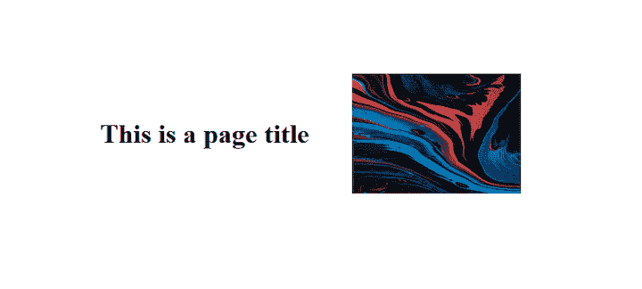

下面是应用了`mask-image`属性后的同一个网页:

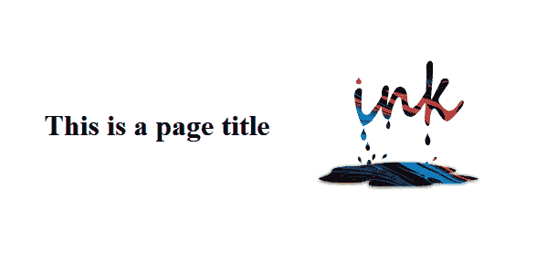

## `mask-image`属性是如何工作的？

正如您在前面的例子中可能已经观察到的，`mask-image`属性只是 CSS 中屏蔽过程的一个方面。其他几个与遮罩相关的属性可以用来控制如何将遮罩应用于元素，例如`mask-mode`、`mask-size`、`mask-repeat`和`mask-composite`。

我们来看看吧！

### `mask-mode`

`mask-mode`属性指定如何将遮罩层图像与其应用的元素相结合。它指定层图像是被视为`luminance`蒙版还是`alpha`蒙版。

`mask-mode`属性可以具有下列值之一:

*   `alpha`:使用遮罩图像的透明度来确定元素内容的可见程度；这是默认值
*   `luminance`:使用蒙版图像的亮度来确定元素内容的可见程度
*   `match-source`:表示遮罩层图像将使用与元素本身相同的合成规则与元素合成。这意味着，如果元素设置了不透明度属性，蒙版图像也将使用相同级别的不透明度与元素合成

下面是一个如何使用`mask-mode`属性的例子:

```
.my-element {
 width: 200px;
 height: 142px;
 margin-left: 50px;
 mask-image: url(./mask.svg);
 mask-size: contain;
 mask-repeat: no-repeat;
 Mask-mode: luminance;
 } 

```

在这个例子中，`mask-mode`属性指定蒙版图像将使用蒙版图像的`luminance`通道与元素合成。

这是我们应用了`mask-mode`属性后的示例网页:

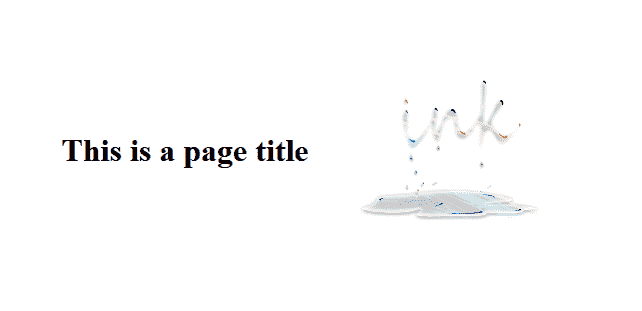

### `mask-size`

`mask-size`属性用于指定蒙版图像的尺寸。它可用于指定特定的宽度和高度，或设置为`cover`、`contain`或`auto`，以保持掩模图像的固有比率。

下面是一个如何在 CSS 中使用`mask-size`属性的例子:

```
.my-element {
 width: 400px;
 height: 242px;
 margin-left: 50px;
 Mask-image: url(./mask.svg);
 mask-size: 320px 160px;
 mask-repeat: no-repeat;
 }

```

这将设置掩模图像的尺寸为`320px`宽和`160px`高。


您也可以指定`mask-size`的百分比。当`mask-size`属性被设置为`100%`时，它使图像覆盖整个蒙版图像。

下面是一个例子，其中`mask-size`属性被设置为 50%:

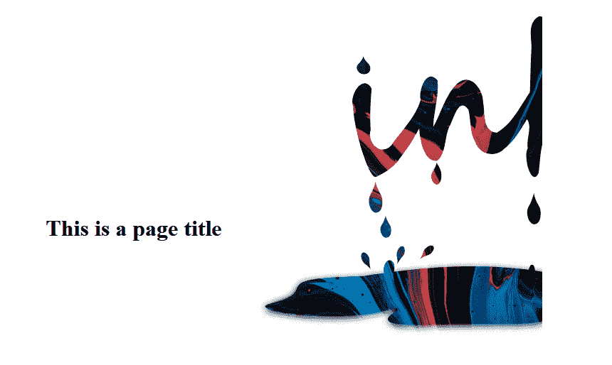

### `mask-repeat`

`mask-repeat`属性用于设置如何在掩模定位区域内重复(平铺)掩模图像。属性采用两个值，一个用于水平重复，一个用于垂直重复。

这些值如下所示:

*   `repeat`
*   `repeat-x`
*   `repeat-y`
*   `no-repeat`

下面是一个如何使用`mask-repeat`属性的例子:

```
.my-element {
 width: 600px;
 height: 242px;
 margin-left: 50px;
 Mask-image: url(./mask.svg);
 mask-size: 200px 100px;
 mask-repeat: repeat-y;
 }

```

在本例中，`mask-image`层将在掩膜定位区域内垂直(而非水平)重复:


如果在`mask-repeat`属性中包含第二个`repeat-x`值，输出将如下所示:

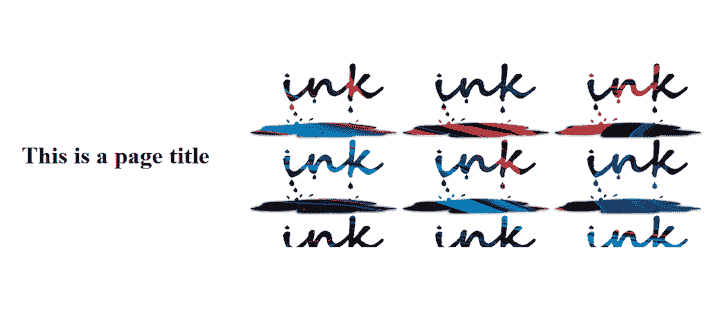

在这种情况下，`mask-image`层在指定区域内垂直和水平平铺。

您也可以通过使用`space`关键字并提供一个长度值来指定一个定制的重复值。例如:

```
.img {
 width: 600px;
 height: 242px;
 margin-left: 50px;
 Mask-image: url(./ink_drip.svg);
 mask-size: 200px 100px;
 mask-repeat: space 10px;
 }

```

这也将水平和垂直重复掩模，但是在每次重复之间有一个`10px`的`space`。

### `mask-composite`

属性是一个非常通用的特性。它允许您控制如何将`mask-image`与它所遮罩的元素合并，以及如何将多个不同形状的遮罩图像合并成一个图像。此属性为您的网页创建视觉上引人注目的效果提供了广泛的可能性。

下面是一个如何使用`mask-composite`属性的例子:

```
 .my-element {
 width: 200px;
 height: 142px;
 mask-image: url(./circle.svg), url(./cross.svg);
 mask-size: contain;
 mask-repeat: no-repeat;
 mask-composite: add;
 }

```

处理多个遮罩图像时，理解源层和目标层之间的区别很重要。在这个上下文中，源层是应用了`mask-composite`属性的蒙版图像(在这个例子中是`circle.svg`)，而目标层是它下面的所有蒙版图像(例如`cross.svg`)。这个概念对于理解`mask-composite`属性如何工作至关重要。

`mask-composite`属性可以取下列值之一:

*   `add`:表示将使用`add`合成操作合成遮罩层，该操作将源放置在目标上。换句话说，它将第一个遮罩层放置在其余的遮罩层上；这是默认值。在下面的例子中，`circle.svg`遮罩被放置在`cross.svg`遮罩上:

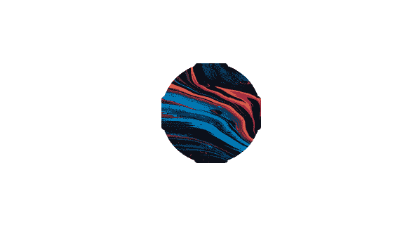

*   `subtract`:将源放置在目标层之外。换句话说，它减去与源重叠的目标层区域，如下所示:

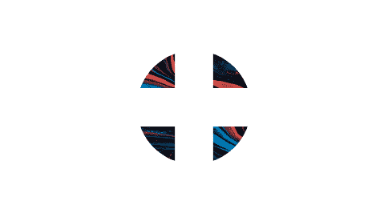

*   `intersect`:用源中与目的地重叠的部分替换目的地。换句话说，最终合成是与源重叠的目的区域:

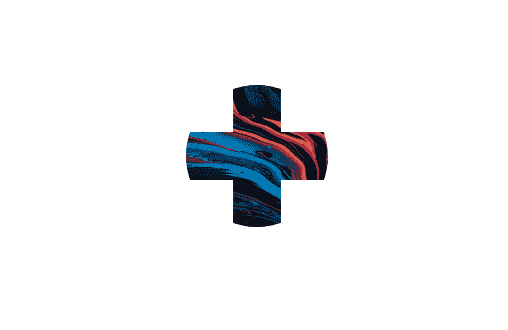

*   `exclude`:将源和目的的非重叠区域合并成一幅图像，如下所示:

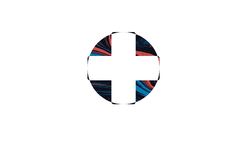

## 使用带有`mask-image`属性的渐变

与 [CSS `background-image`](https://blog.logrocket.com/guide-image-overlays-css/) 类似，`mask-image`属性不仅接受图像文件作为其值，它还接受诸如线性渐变和重复图案之类的值。这使得在设计网页元素时有了更多的灵活性和创造性。

让我们来看看如何使用 [CSS 渐变](https://blog.logrocket.com/complex-patterns-using-css-gradients/)来遮罩图像。这里我们将替换`mask-image`属性的`URL`，并将渐变的一部分设置为透明。我们将看一看`linear-gradient`和`radial-gradient`。

### 线性渐变

让我们从一个 [`linear-gradient`](https://blog.logrocket.com/advanced-effects-with-css-background-blend-modes-4b750198522a/#:~:text=Combining%20CSS%20gradients%20with%20background%2Dblend%2Dmode) 开始:

```
.container img{
  mask-image: linear-gradient(to top, transparent, #000);
  -webkit-mask-image: linear-gradient(to top, transparent, #000);;
}

```

在本例中，`mask-image`属性被设置为从底部透明到顶部黑色的线性渐变。这将创建一个渐变遮罩，逐渐从透明过渡到不透明，并可用于创建各种视觉效果:

参见钢笔 [线性渐变 CSS 蒙版-图片](https://codepen.io/david4473/pen/LYBKYmM)by David 4473 [](%22https://codepen.io/david4473/</a) [CodePen](https://codepen.io)[。](%22https://codepen.io/david4473/</a)

径向梯度

### 现在，让我们尝试使用一个`radial-gradient`:

结果如下:

```
.container img{
  mask-image: radial-gradient(circle, transparent 30%, #000);
  -webkit-mask-image: radial-gradient(circle, transparent 30%, #000);
}

```

参见钢笔 [径向渐变 CSS 蒙版-图片](https://codepen.io/david4473/pen/NWBZWLb)by David 4473 [](%22https://codepen.io/david4473/</a) [CodePen](https://codepen.io)[。](%22https://codepen.io/david4473/</a)

你也可以交换颜色的位置来改变事物，就像这样:

下面是结果，显示了交换颜色后的 r `adial-gradient`效果:

参见钢笔 [径向渐变遮罩-图像透明](https://codepen.io/david4473/pen/oNMrNaO)by David 4473 [](%22https://codepen.io/david4473/</a) [CodePen](https://codepen.io)[。](%22https://codepen.io/david4473/</a)

```
.container img{
  mask-image: radial-gradient(circle,#000, transparent 50%);
  -webkit-mask-image: radial-gradient(circle, #000, transparent 50%);
}

```

创建自定义 SVG 形状

如前所述，`mask-image`蒙版层可以是 SVG 或 PNG 图像文件。如果您愿意，您也可以创建自己的可缩放矢量图形形状。

要创建 SVG 蒙版，首先需要使用`SVG` HTML 元素创建形状。在`SVG`中，您将拥有一个带有`ID`的`mask`元素:

## 这个掩码`ID`将用作`mask-image`的参考:

你会得到下面的结果:这是一个相当沉闷的循环:

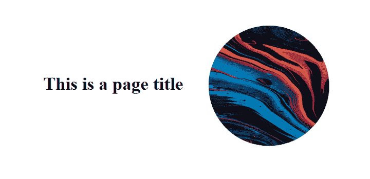

```
 <svg width="0" height="0" viewBox="0 0 400 400">
      <mask id="mask">
        <circle fill="#fff" cx="250" cy="250" r="200"/>
      </mask>
</svg>

```

SVG 必须是黑白的，因为当应用`mask-image`时，白色部分将是可见的(将被填充),而黑色部分将被隐藏(将变得透明)。如果您添加除黑色或白色之外的任何其他颜色，`mask`将变成半透明，带有该颜色的色调。

```
.container img{
  mask-image: url(#mask);
  -webkit-mask-image: url(#mask);
}

```

有了这个新的信息，让我们来给上面的圈子加点料。

添加一个颜色设置为黑色的小圆，使`mask`成为一个圆环。您还可以在较大的外部圆圈周围添加一个`stroke`:

下面是结果，一个 SVG `mask`作为一个被半透明边框包围的环:

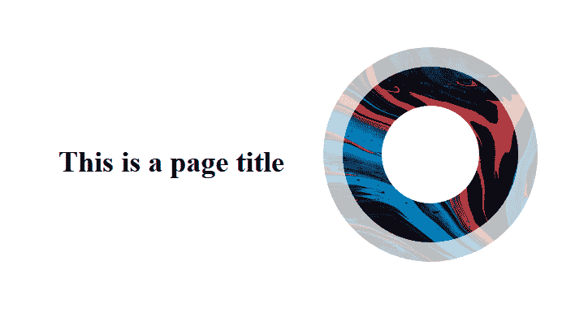

您还可以更改 SVG 的位置或组合不同的形状:

```
<svg width="0" height="0" viewBox="0 0 400 400">
      <mask id="mask">
        <circle fill="#fff" cx="250" cy="250" r="200" 
        stroke="#553c9a" stroke-width="40px"/>
        <circle fill="#000" cx="250" cy="250" r="100" />
      </mask>
</svg>

```

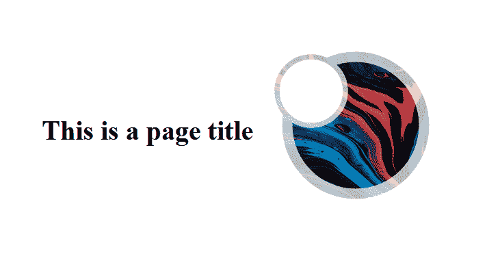

您已经看到了如何使用`mask-image`属性以不同的方式屏蔽图像。尝试不同的形状，看看你能想到什么。你可以使用`mask-image`属性为网页创建[非常酷的背景](https://blog.logrocket.com/best-css-background-generators/)。

要学习如何用 CSS 制作 SVG 动画，请查看本教程。

浏览器兼容性

需要注意的是，CSS `mask-image`属性并不是所有的浏览器都完全支持的。它在 Google Chrome、Mozilla Firefox、Opera 和 Microsoft Edge 等现代浏览器中受支持，但在这些浏览器的旧版本或 Internet Explorer 中不受支持:

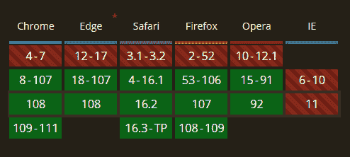

## 您可以使用供应商前缀来确保您的`mask-image`样式在尽可能多的浏览器中得到应用。例如，您可以使用以下代码来确保您的遮罩图像样式应用于所有现代浏览器:

通过使用供应商前缀和特性检测，您可以确保尽可能广泛地应用您的`mask-image`样式，同时为不支持该属性的浏览器提供后备样式或功能。

结论

在本文中，我们研究了如何使用`mask-image`属性将遮罩层图像应用于元素。我们研究了如何使用`mask-mode`和`mask-composite`属性控制遮罩层与元素的合成。

```
.my-element {
 -webkit-mask-image: url(mask.png);
 -moz-mask-image: url(mask.png);
 -ms-mask-image: url(mask.png);
 mask-image: url(mask.png);
 }

```

到目前为止，您应该理解了如何使用`mask-image`属性及其相应的值在您的网页上创建各种视觉效果。

## 来吧，展示你的创造力吧！看看用`mask-image`能产生什么有趣的效果！

你的前端是否占用了用户的 CPU？

随着 web 前端变得越来越复杂，资源贪婪的特性对浏览器的要求越来越高。如果您对监控和跟踪生产环境中所有用户的客户端 CPU 使用、内存使用等感兴趣，

.

## LogRocket 就像是网络和移动应用的 DVR，记录你的网络应用或网站上发生的一切。您可以汇总和报告关键的前端性能指标，重放用户会话和应用程序状态，记录网络请求，并自动显示所有错误，而不是猜测问题发生的原因。

现代化您调试 web 和移动应用的方式— [开始免费监控](https://lp.logrocket.com/blg/css-signup)。

[try LogRocket](https://lp.logrocket.com/blg/css-signup)

.

[](https://lp.logrocket.com/blg/css-signup)[https://logrocket.com/signup/](https://lp.logrocket.com/blg/css-signup)

[LogRocket](https://lp.logrocket.com/blg/css-signup) is like a DVR for web and mobile apps, recording everything that happens in your web app or site. Instead of guessing why problems happen, you can aggregate and report on key frontend performance metrics, replay user sessions along with application state, log network requests, and automatically surface all errors.

Modernize how you debug web and mobile apps — [Start monitoring for free](https://lp.logrocket.com/blg/css-signup).