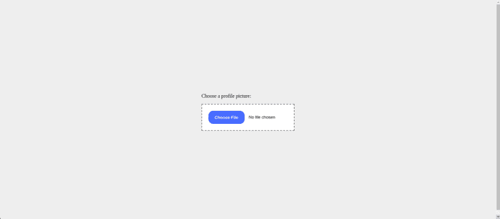
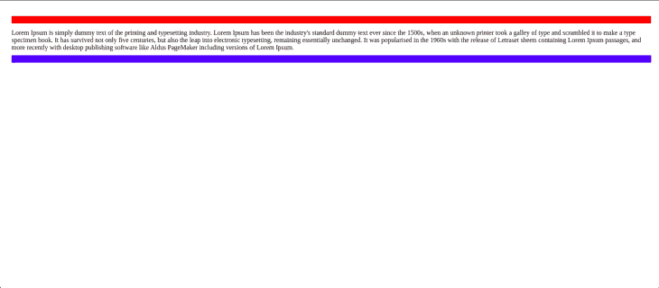

# 使用 CSS:模态伪选择器

> 原文：<https://blog.logrocket.com/css-modal-pseudo-selector/>

“伪”这个词被定义为虚假的东西，表面上看起来是一回事，但行为却像是另一回事。因此，当我们提到伪元素或伪类(伪选择器)时，我们指的是行为类似于 HTML 元素或类但不在标记中的东西。

因此，HTML 并不像看上去那样简单。我们可以用 CSS 来[样式化 UI 的某些部分，这些部分在我们的标记中并不存在。](https://blog.logrocket.com/new-css-style-queries/)

一个简单的例子见于`form input`元素上的`placeholder`属性的样式，如下所示:

```
<form>
   <input placeholder="Enter Email">
   <input placeholder="Enter Password">
</form>
```

因为`placeholder`是作为`input`的属性存在的，所以它不是 HTML 元素。然而，我们可以通过将 [CSS](https://blog.logrocket.com/tag/css/) 中的[伪元素](https://blog.logrocket.com/css-pseudo-elements-guide/)作为目标来设计`placeholder`的样式，如下所示:

```
input::placeholder {
  color: red
}

```

下面是代码的一个交互式示例:

参见 [CodePen](https://codepen.io) 上 Lawrence Eagles([@ Lawrence Eagles](https://codepen.io/Lawrenceagles))
的未命名的笔。

因此，伪元素代表了 DOM 的一个实际部分，它可以[使您的代码更加高效](https://blog.logrocket.com/best-practices-improving-css-performance/)。

在本文中，我们的重点是`:modal` CSS 伪选择器。然而，在深入研究之前，我们将通过学习更多关于伪元素和伪类的知识来奠定基础，并且，基于我们的知识，我们将学习关于`:modal`伪选择器的知识。

让我们在下一节开始学习更多关于伪元素和伪类的知识。

*向前跳转:*

## 什么是伪元素和伪类？

在这一节中，我们将学习更多关于伪元素和伪类的知识。我们将通过详细阐述涉及不同伪元素和伪类的代码示例来扩展我们的知识。

我们先来看伪元素。

### 伪元素

伪元素总是有一个双列— `::pseudo-element-name`，以区别于伪类— `:pseudo-class-name`。如下图所示:

```
// psuedo-element
input::placeholder {
  color: red
}

// psuedo-class
input:focus {
  color: red
}
```

如上所述，伪元素代表 DOM 的一部分，但在标记中不可见。我们还提到，它们使您的代码更加高效，因为它们提供了一种简单有效的方法来定位和样式化 DOM。

让我们通过查看一些伪元素以及它们如何使我们能够定位和样式化 DOM 中的元素来详细说明。

`::file-selector-button`是一个 CSS 伪元素，表示一个 HTML 的按钮——[`type="file"`](https://developer.mozilla.org/en-US/docs/Web/HTML/Element/input/file)的 [`<input>`](https://developer.mozilla.org/en-US/docs/Web/HTML/Element/input) 元素，看起来不可能样式化。

然而，使用`::file-selector-button`伪元素，我们可以轻松地设计这个文件上传按钮的样式，如下所示:

```
<!-- HTML -->
<form>
   <label for="avatar">Choose a profile picture:</label><br>
   <input type="file"
       name="avatar"
       accept="image/png, image/jpeg">
</form>
```

```
//CSS
body {
  display: grid;
  place-items: center;
  min-height: 100vh;
  background-color: #eee;
}

input[type="file"] {
  margin-top: 1rem;
  padding: 1.5em;
  border: 2px dashed grey;
  background-color: #fff;
}

input[type="file"]::file-selector-button {
  padding: 1em 1.5em;
  border-width: 0;
  border-radius: 1rem;
  background-color: dodgerblue;
  color: #FFFFFF;
  font-weight: bold;
  transition: all .25s ease-in-out;
  cursor: pointer;
  margin-right: 1em;
}
```

在这里，我们得到以下样式的文件上传按钮:



您可以查看下面的代码:

见笔 [文件上传](https://codepen.io/Lawrenceagles/pen/qBKEJjd)作者 Lawrence Eagles([@ Lawrence Eagles](https://codepen.io/Lawrenceagles))
上 [CodePen](https://codepen.io) 。

[`::before`和`::after`](https://blog.logrocket.com/how-to-use-css-before-after-create-custom-animations-transitions/) 是迄今为止最强大的，也可以说是最流行的伪元素。这些伪元素使我们能够在 HTML 其他元素之前或之后插入内容，这完全由 CSS 代码来处理。

考虑下面的代码:

```
<!-- HTML -->
<div class="summary" id="text">
   Lorem Ipsum is simply dummy text of the printing and typesetting industry. Lorem Ipsum has been the industry's standard dummy text ever since the 1500s, when an unknown printer took a galley of type and scrambled it to make a type specimen book. It has survived not only five centuries, but also the leap into electronic typesetting, remaining essentially unchanged. It was popularised in the 1960s with the release of Letraset sheets containing Lorem Ipsum passages, and more recently with desktop publishing software like Aldus PageMaker including versions of Lorem Ipsum.
</div>
```

```
// CSS
body {
   padding: 20px;
}

.summary::before, .summary::after {
   content: "";
   padding: 4px;
   margin: 10px auto;
   width: 100%;
   height: 10px;
   display: inline-block;
}

#text::before {
   background: red;
}

#text::after {
   background: blue;
}
```

在上面的代码中，我们用`summary`类定位`div`，并在其内容前插入一个空字符串。

我们使用`::before`和`::after`伪元素插入这些内容:



### 伪类

伪类或伪选择器允许我们根据 DOM 元素的状态来设计它的样式。例如，`:first-child`表示兄弟元素列表中的第一个子元素，可以使用`:first-child`伪类进行样式化。另一方面，`:last-child`表示兄弟元素列表中的最后一个子元素。处于这种状态的元素可以使用`last-child`伪类进行样式化。

伪类的行为就好像我们在标记中添加了额外的类。这允许我们减少在标记中使用的类的数量。因此，它们帮助我们编写更干净、更灵活和可维护的代码。

考虑下面的 HTML 代码:

```
<ul>
  <li>😍</li> 
  <li>🥳</li> 
  <li>🥸</li> 
  <li>😇</li> 
  <li>🤩</li> 
  <li>😎</li> 
  <li>🥰</li> 
</ul>
```

在上面的 HTML 代码中，我们可以根据第一个`li`内容和最后一个`li`内容的状态有选择地将它们作为目标，并对它们进行样式化，如下所示:

```
ul {
  list-style-type: none;
   font-size: 2rem;
   text-align: center;
}

ul>li {
   margin: 0.5rem;
}

ul>li:first-child {
   font-size: 4rem;
}

ul>li:last-child {
   font-size: 4rem;
}
```

在这里，我们得到:


由于元素的状态会因为用户的交互而改变，伪类使我们能够在用户与 DOM 元素交互时对它们进行样式化。这些伪类(也称为动态伪类)的行为就像一个表示元素状态的类由于用户的操作而被添加到元素中一样。

`[:hover](https://developer.mozilla.org/en-US/docs/Web/CSS/:hover)`元素是当用户用鼠标指针悬停在该元素上时处于悬停状态的按钮。我们可以使用`:hover`伪类在悬停状态下选择元素并设置样式。当用户通过选择`[:focus](https://developer.mozilla.org/en-US/docs/Web/CSS/:focus)`元素来聚焦该元素时，该元素有一个处于焦点状态的表单输入。我们可以使用`:focus`伪类在焦点状态期间选择并样式化该元素。

然而，在本文中，我们主要关注的是`:modal`伪选择器，我们将在下一节开始学习它。

## CSS `:modal`伪选择器

令人敬畏和强大的`:modal`是一个 CSS 伪选择器或伪类，它提供了一种检测模态元素的内在方法。这使得开发人员无需额外的 CSS 类就可以设计这些元素的样式。

因此，简而言之，`:modal`伪选择器选择一个元素，该元素处于一种状态，在该状态改变之前，它不会与外部的其他 DOM 元素进行交互——模态是关闭的。

### `:modal`动作中的伪选择器

可以弹出打开一个模态并排除与该模态之外的其他元素的所有交互的元素的一些例子是:

*   `[dialog](https://developer.mozilla.org/en-US/docs/Web/HTML/Element/dialog)`:用`showModal()` API 打开的对话框元素
*   `[:fullscreen](https://developer.mozilla.org/en-US/docs/Web/CSS/:fullscreen)`:用`requestFullscreen()` API 打开时的`:fullscreen`伪类

让我们通过一些代码示例来了解更多关于`:modal`伪选择器的信息。考虑下面的代码:

```
<!-- HTML -->
<section id="container">
  <dialog>
    <p>Lorem Ipsum is simply dummy text of the printing and typesetting industry.</p>
    <button id="close-modal-btn" class="modal-btn">Close</button>
  </dialog>
  <button id="open-modal-btn" class="modal-btn">Open Modal</button>
</section>
```

```
/* CSS */
*,
*:after,
*:before {
  box-sizing: border-box;
}

body {
  display: grid;
  place-items: center;
  min-height: 100vh;
  background: gray;
  font-family: "Google Sans", sans-serif, system-ui;
}

:modal {
  padding: 8rem;
  border: 1px solid black;
  border-radius: 2rem;
  gap: 3rem;
  background: orange;
  overflow: hidden;
}

:modal::backdrop {
  background: hsl(0 0% 10% / 0.5);
}

:modal[open] {
  display: grid;
}

.modal-btn {
  padding: 0.8rem 1.5rem;
  border: 1px solid black;
  border-radius: 1rem;
}
```

```
// JavaScript
const Container = document.querySelector("#container");
const DIALOG = document.querySelector("dialog");

Container.addEventListener(
  "click",
  function (event) {
    let modalStyle;
    if (event.target.matches("#open-modal-btn")) {
      modalStyle = "showModal";
    }

    if (event.target.matches("#close-modal-btn")) {
      modalStyle = "close";
    }

    DIALOG[modalStyle]();
  },

  false
);
```

在上面的代码示例中，我们使用 [`dialog`](https://developer.mozilla.org/en-US/docs/Web/HTML/Element/dialog#advanced_example) 元素在标记中创建了一个模态。我们使用 CSS 中的`:modal`伪类来定位和设计这个模型。在 JavaScript 中，我们使用`event-delegation`来监听`click`事件。然后我们将`modalStyle`设置为`showModal`——打开模态或者`close`——关闭模态。

您可以在运行中看到这一点，并实时使用代码:

参见 [CodePen](https://codepen.io) 上 Lawrence Eagles([@ Lawrence Eagles](https://codepen.io/Lawrenceagles))
的 Pen[Dialog-modal](https://codepen.io/Lawrenceagles/pen/YzvXYqR)。

结论

## 在本文中，我们学习了伪元素和伪选择器，它们是伪元素的 CSS 对应物。这些类似乎是在用户与 DOM 交互时添加到元素中的。我们也看到了它们是如何让我们减少使用的类的数量，写出更干净、更易维护的代码。

最后，我们学习了`:modal` CSS 伪选择器，它为我们提供了一种不需要额外 CSS 类就可以定位和样式化模态的方法。

阅读完本文后，我希望您已经掌握了足够的知识，可以开始使用伪选择器和伪元素编写更干净、更易维护的标记和样式。

你的前端是否占用了用户的 CPU？

## 随着 web 前端变得越来越复杂，资源贪婪的特性对浏览器的要求越来越高。如果您对监控和跟踪生产环境中所有用户的客户端 CPU 使用、内存使用等感兴趣，

.

[try LogRocket](https://lp.logrocket.com/blg/css-signup)

LogRocket 就像是网络和移动应用的 DVR，记录你的网络应用或网站上发生的一切。您可以汇总和报告关键的前端性能指标，重放用户会话和应用程序状态，记录网络请求，并自动显示所有错误，而不是猜测问题发生的原因。

[](https://lp.logrocket.com/blg/css-signup)[https://logrocket.com/signup/](https://lp.logrocket.com/blg/css-signup)

现代化您调试 web 和移动应用的方式— [开始免费监控](https://lp.logrocket.com/blg/css-signup)。

Modernize how you debug web and mobile apps — [Start monitoring for free](https://lp.logrocket.com/blg/css-signup).