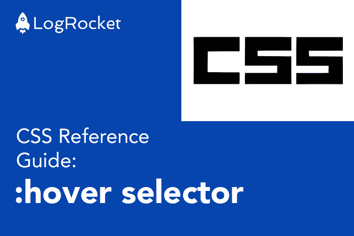

# CSS 参考指南:CSS:悬停选择器

> 原文：<https://blog.logrocket.com/css-reference-guide-hover-selector/>

[Chidume Nnamdi Follow](https://blog.logrocket.com/author/chidumennamdi/) I'm a software engineer with over six years of experience. I've worked with different stacks, including WAMP, MERN, and MEAN. My language of choice is JavaScript; frameworks are Angular and Node.js.

# CSS 参考指南:CSS `:hover`选择器

## 

2020 年 9 月 30 日 37 秒读 174



CSS `:hover`选择器是一个伪类选择器，用于在鼠标移动到元素上时将样式应用到元素上。

下面是一个实现示例:

```
a:hover {
    color: orangered;
}
```

我们对所有的`a`元素应用了一个`:hover`伪选择器。当鼠标悬停在元素上时，这将使`a`元素的文本颜色变为橙红色。

您可以在下面的 CodePen 上玩一个真实的例子:

参见 [CodePen](https://codepen.io) 上 Chidume David([@ philipsz-davido](https://codepen.io/philipsz-davido))
的笔[CSS:hover](https://codepen.io/philipsz-davido/pen/XWdYvGJ)。

我们还可以将`:hover`选择器应用于 body 中的所有元素:

```
body *:hover {
    background: yellow;
}
```

这将导致当鼠标移动到元素上时，body 元素内的所有元素都显示黄色背景。

除了背景，我们还可以改变边框、边框半径、字体、文本颜色、填充、边距等。

要将`:hover`选择器应用于文档中的所有元素，我们只需使用星号:

```
*:hover {
    border: 1px solid orangered;
}
```

这将导致悬停元素的边框为 1px 宽，颜色为纯橙红色。

## 你的前端是否占用了用户的 CPU？

随着 web 前端变得越来越复杂，资源贪婪的特性对浏览器的要求越来越高。如果您对监控和跟踪生产环境中所有用户的客户端 CPU 使用、内存使用等感兴趣，

[try LogRocket](https://lp.logrocket.com/blg/css-signup)

.

[](https://lp.logrocket.com/blg/css-signup)[https://logrocket.com/signup/](https://lp.logrocket.com/blg/css-signup)

LogRocket 就像是网络和移动应用的 DVR，记录你的网络应用或网站上发生的一切。您可以汇总和报告关键的前端性能指标，重放用户会话和应用程序状态，记录网络请求，并自动显示所有错误，而不是猜测问题发生的原因。

现代化您调试 web 和移动应用的方式— [开始免费监控](https://lp.logrocket.com/blg/css-signup)。

[Chidume Nnamdi Follow](https://blog.logrocket.com/author/chidumennamdi/) I'm a software engineer with over six years of experience. I've worked with different stacks, including WAMP, MERN, and MEAN. My language of choice is JavaScript; frameworks are Angular and Node.js.