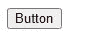
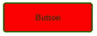
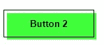
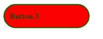

# 在 mind 中使用 CSS 来设计一个具有可访问性的按钮

> 原文：<https://blog.logrocket.com/css-style-button-accessibility/>

按钮在网站上有多种用途——有用于悬停在图像上和浏览网页的大按钮，也有用于显示产品或服务信息的更微妙的按钮。

然而，按钮甚至可以恐吓有经验的网页设计师。按钮有许多属性需要花很长时间才能掌握，如果使用不当或过度，会在 CSS 中增加不必要的大文件。

本文将介绍如何将优雅的样式应用到您的按钮上，以创建一个有吸引力的、可重用的商业按钮组件。我们还将特别关注你在 2022 年制作按钮时应该考虑的可访问性因素。别再浪费时间了，让我们开始吧。

向前跳:

## 创建和样式化普通按钮

在这一部分，我们将设计两个按钮——一个普通按钮，一个复古风格的按钮，都有悬停动画。

创建一个按钮非常简单。你所需要做的就是将下面的代码插入到你的 HTML 代码中。

```
<html lang="en">
<head>
    <meta charset="UTF-8">
    <meta http-equiv="X-UA-Compatible" content="IE=edge">
    <meta name="viewport" content="width=device-width, initial-scale=1.0">
    <link rel="stylesheet" href="style.css">
    <title>Document</title>
</head>
<body>
    <button class = btn>Button</button>

</body>
</html>

```

我使用了一个`btn`类，但是你可以随意命名你的按钮。接下来是更复杂的部分:设计按钮的样式。下面是一个无样式按钮的样子。



为了正确设计按钮的样式，我们将针对这个类，用 CSS 做一些改变。在这篇文章中，我们之前已经讨论过如何创建和设计基本按钮[，但是今天我们将更仔细地研究它们。](https://blog.logrocket.com/css-reference-guide-button-styling/)

让我们添加一些 CSS 到我们的按钮。

```
.btn {
    min-width: 150px;
    height: 50px;
    color: #fff;
    padding: 5px 10px;
    font-weight: bold;
    cursor: pointer;
    transition: all 0.3s ease;
    position: relative;
    display: inline-block;
    outline: none;
    border-radius: 5px;
    z-index: 0;
    background: red;
    overflow: hidden;
    border: 2px solid green;
    color: black;
  }

```

现在按钮看起来好多了:



如果你希望你的按钮是圆形的，你可以把它的边框半径增加到 25px。

你可以为你的网站使用这样一个普通的按钮，但是在 2022 年，有更先进的方法来设计你的按钮。设计按钮最流行的特性之一是动画。通过将 CSS 动画与 CSS 悬停效果相结合，您可以使一个普通的按钮具有响应性，这使得您的网站对用户来说更加直观和有趣。这篇文章更详细地介绍了动画按钮。

让我们用下面的代码给我们的按钮添加动画。

```
.btn:hover {
    color: #fff;
  }
  .btn:hover:after {
    width: 100%;
  }
  .btn:after {
    content: "";
    position: absolute;
    z-index: -1;
    transition: all 0.3s ease;
    left: 0;
    top: 0;
    width: 0;
    height: 100%;
    background: blue;
  }

```

在上面的代码中，当你悬停在按钮上时，会有一个滑动动画从左向右滑入，并将背景颜色更改为蓝色。您可以在下面的代码笔中查看动画按钮:

参见 [CodePen](https://codepen.io) 上 fimber elems([@ fimbosky 1](https://codepen.io/Fimbosky1))
的笔 [按钮 1](https://codepen.io/Fimbosky1/pen/YzLzYYJ) 。

如果你想让你的按钮动画从右向左移动，只需将`left: 0;`改为`right: 0;`。

当设计一个按钮的样式时，动画是至关重要的，因为它们给组件带来了生命。无论你是为下拉菜单创建一个大的行动号召按钮，还是一个小的按钮，你都可以通过动画获得创意。

## 创建和设计复古按钮

让我们创建一个更美观的复古外观的第二个按钮。

这是 HTML:

```
<button class="btn2">Button 2</button>

```

接下来，让我们输入 CSS:

```
.btn2 {
    min-width: 130px;
    height: 40px;
    color: #fff;
    padding: 5px 10px;
    font-weight: bold;
    cursor: pointer;
    transition: all 0.3s ease;
    position: relative;
    display: inline-block;
    outline: none;
    border: 1px solid #000;
    color: #000;
    background: transparent;
  }

  .btn2:hover:after {
    top: 0;
    left: 0;
  }

  .btn2:after {
    content: "";
    width: 100%;
    z-index: -1;
    position: absolute;
    height: 100%;
    top: 5px;
    left: 5px;
    transition: 0.7s;
    background-color: #40ff3a;
  }

```

上述代码将导致以下结果:



如果你想玩这些按钮，看看下面的代码笔。

参见 [CodePen](https://codepen.io) 上 fimber elems([@ fimbosky 1](https://codepen.io/Fimbosky1))
的笔 [样式按钮](https://codepen.io/Fimbosky1/pen/rNdgPKx)。

你也可以看看这个代码笔，看看你能使用的其他漂亮的按钮:

请看 [CodePen](https://codepen.io) 上 Yuhomyan ( [@yuhomyan](https://codepen.io/yuhomyan) )
的笔 [糖果色按钮动画](https://codepen.io/yuhomyan/pen/OJMejWJ)。

## 按钮可访问性注意事项

### 链接与按钮

开发人员面临的一个主要问题是不知道何时使用按钮。这听起来可能很傻，但这确实是个问题，因为按钮很容易被样式为按钮的链接所取代。虽然这可能有效，但这不是一个好的实践，主要是因为屏幕阅读器。

当屏幕阅读器或任何类型的辅助设备扫描网页时，它会获得关于页面 HTML 结构的信息，并大声读出内容，因此对于必须使用这些辅助技术与页面交互的用户来说，在应该使用`<button>`元素的时候使用链接元素`<a>`可能会有问题。

知道何时使用这两种元素很简单。根据 [Angular](https://material.angular.io/components/button/overview) 的说法，`<button>`元素应该用于在当前页面上执行动作的任何交互，`<a>`元素应该用于导航到另一个视图或页面的任何交互。就这么简单！

作为一名开发人员，你应该知道如何在创建按钮时使用正确的语义 HTML 元素。它让用户对控件的行为有一个合理的预期，允许您编写更轻、更好的代码，并使您的站点更易于维护。

你可以看看这篇文章来了解更多关于现代网络应用程序的链接和按钮。

### 按钮大小

在 2022 年，纽扣尺寸是设计纽扣的重要部分。事实上，这一点非常重要，以至于苹果在 iPhone 人机界面指南中推荐了 44x44px 的按钮尺寸。较小的按钮会导致灵巧性降低的人难以访问，并增加网站的出错率。

使用合适大小的按钮也可以提高你网站的搜索引擎优化或网络应用，因为谷歌和其他搜索引擎会根据网页的移动友好程度对其进行排名。确保你的按钮既大又相隔足够远，可以增加你的页面的可访问性，让它排名更高。

## 为按钮使用正确的语义

我们在上面讨论了使用`<button>`元素，但是让我们更深入地研究它。使用正确的语义 HTML 元素的重要性对网站的可访问性有很大的影响，我将简要解释为什么。

首先，让我们重新创建我们之前使用的第一个按钮，但是这一次，我们将使用一个`div`来创建按钮，而不是使用`<button>`元素。

这是 HTML:

```
<div class="btn3">Button 3</div>

```

这是 CSS:

```
.btn3 {
    display: flex;
    align-items: center;
    min-width: 150px;
    height: 35px;
    color: #fff;
    padding: 5px 10px;
    font-weight: bold;
    cursor: pointer;
    transition: all 0.3s ease;
    position: relative;
    margin-left: 20px;
    outline: none;
    border-radius: 25px;
    z-index: 0;
    background: red;
    overflow: hidden;
    border: 2px solid green;
    color: black;
  }

  .btn3:hover {
    color: #fff;
  }
  .btn3:hover:after {
    width: 100%;
  }
  .btn3:after {
    content: "";
    position: absolute;
    z-index: -1;
    transition: all 0.3s ease;
    left: 0;
    top: 0;
    width: 0;
    height: 100%;
    background: blue;
  }

```

上面代码的结果将如下所示。



与我们最初的按钮放在一起，一般人会发现很难在两者之间挑出实际的按钮，因为用一点 JavaScript，你可以让它们做同样的事情。


虽然这两个组件看起来一样，行为一样，完成的动作一样，但是使用前面提到的`<div>`或`<a>`元素重新创建一个按钮会破坏键盘导航，转移浏览器焦点，混淆屏幕阅读器，从而对你的站点产生负面影响。这是如何发生的。

### 键盘导航

网页可访问性的一个最重要的方面是键盘导航。这主要是因为大量有运动障碍的人不得不使用键盘进行网络导航。他们必须使用**选项卡**按钮来浏览交互式组件，如链接、按钮等。

在我们上面创建的例子中，使用键盘导航的人将只能使用**选项卡**按钮来聚焦和点击使用`<button>`元素创建的按钮。使用`<div>`元素创建的按钮就不能做到这一点，因为虽然它们看起来一样，但浏览器更关心元素是什么而不是它看起来像什么。

虽然键盘导航允许用户关注按钮样式的链接，就像我之前解释的那样，但这是不明智的，因为它扰乱了屏幕阅读器。

### 转移浏览器焦点

当使用`<a>`元素而不是`<button>`元素创建按钮时，通常会发生不适当的浏览器焦点转移。`<a>`元素是为页面外导航设计的，所以当它用于页面上的触发动作时，它会导致一个可访问性问题，使浏览器不恰当地转移焦点，并导致网站上糟糕的 UX。

## 结论

这就把我们带到了本文的结尾。设计一个按钮可能很复杂，但是掌握它的窍门很有趣。你应该知道如何恰当地设计一个按钮的样式有很多原因，从更好的 SEO 和美学到你的站点更好的可访问性和性能。希望这篇文章对你有帮助，成为你的按钮小抄。下次见！

## 你的前端是否占用了用户的 CPU？

随着 web 前端变得越来越复杂，资源贪婪的特性对浏览器的要求越来越高。如果您对监控和跟踪生产环境中所有用户的客户端 CPU 使用情况、内存使用情况等感兴趣，

[try LogRocket](https://lp.logrocket.com/blg/css-signup)

.

[](https://lp.logrocket.com/blg/css-signup)[https://logrocket.com/signup/](https://lp.logrocket.com/blg/css-signup)

LogRocket 就像是网络和移动应用的 DVR，记录你的网络应用或网站上发生的一切。您可以汇总和报告关键的前端性能指标，重放用户会话和应用程序状态，记录网络请求，并自动显示所有错误，而不是猜测问题发生的原因。

现代化您调试 web 和移动应用的方式— [开始免费监控](https://lp.logrocket.com/blg/css-signup)。